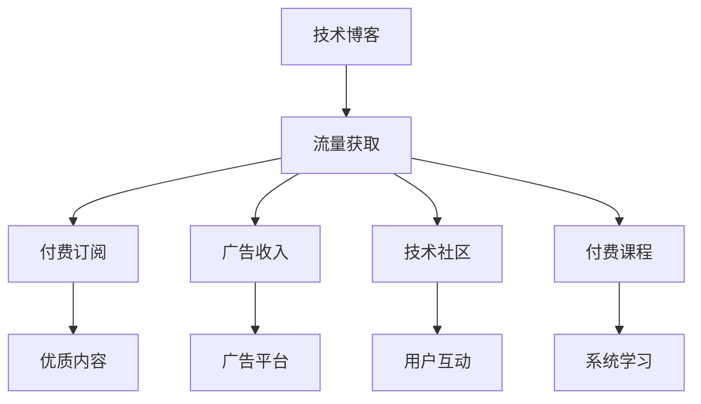

                 

# 技术博客变现：策略与方法

> 关键词：技术博客，内容变现，流量获取，付费订阅，广告收入，技术社区，深度分析

## 1. 背景介绍

### 1.1 问题由来
在数字化时代，技术博客作为技术交流和知识分享的平台，拥有巨大的用户群体和潜力。然而，仅有优质内容往往不足以实现商业化变现，如何在保证内容质量的同时，探索多样化的变现策略，成为众多技术博客运营者面临的挑战。本博客旨在从策略和技巧角度，探讨技术博客变现的路径和方法，帮助运营者实现内容与商业价值的双赢。

### 1.2 问题核心关键点
- 技术博客变现的核心在于平衡内容质量和商业价值。
- 主要变现方式包括付费订阅、广告收入、技术社区和付费课程。
- 内容与商业变现的共生关系：优质内容吸引用户，用户增值带动变现。
- 多渠道策略：结合多种变现模式，形成多元化收入来源。

## 2. 核心概念与联系

### 2.1 核心概念概述

- **技术博客**：以技术为主题的博客，聚焦于分享技术知识、经验、案例和趋势。

- **内容变现**：通过博客内容的商业化运营，实现流量、用户、收入的增长。

- **流量获取**：通过各种渠道和方法，吸引和聚集目标用户，提升网站访问量。

- **付费订阅**：用户支付费用，获取优质内容或服务，形成可持续的收入模式。

- **广告收入**：借助博客平台的流量，通过第三方广告平台实现广告投放和收益。

- **技术社区**：围绕特定技术领域，构建用户互动和交流的社区。

- **付费课程**：提供系统化的学习资料和指导，吸引用户进行付费学习。

### 2.2 核心概念原理和架构的 Mermaid 流程图



该流程图展示了技术博客内容变现的基本架构：

1. 技术博客（A）通过提供优质内容（G）吸引用户（B）。
2. 用户流量（B）可以转化成付费订阅（C）、广告收入（D）、技术社区（E）和付费课程（F）。
3. 付费订阅（C）提供优质内容（G），广告收入（D）来源于广告平台（H），技术社区（E）和付费课程（F）则分别满足用户互动和系统学习需求。

## 3. 核心算法原理 & 具体操作步骤
### 3.1 算法原理概述

技术博客的内容变现策略基于流量获取和用户转化的基本原理，核心在于：

- **流量生成**：通过各种方法（SEO优化、社交媒体推广、内容营销等）吸引用户访问网站。
- **用户转化**：将访问流量转化为付费用户，形成持续收入。
- **多渠道运营**：结合多种变现方式，形成多渠道、多来源的收入结构。

### 3.2 算法步骤详解

**步骤1：流量获取**

1. **SEO优化**：通过优化博客关键词、内容和结构，提升搜索引擎排名，吸引更多有意向的用户。

2. **内容营销**：通过撰写高质量的技术文章、技术白皮书、技术分析报告等，吸引目标用户。

3. **社交媒体推广**：利用社交媒体平台（如Twitter、LinkedIn、GitHub）推广博客内容，吸引流量。

4. **合作交流**：与其他技术博客、技术社区、技术会议合作，互相推广流量。

**步骤2：用户转化**

1. **付费订阅**：通过提供独家内容、高级功能、定制服务等，吸引用户支付订阅费用。

2. **广告收入**：借助博客平台的流量，引入第三方广告平台，实现广告收入。

3. **技术社区**：构建技术社区，吸引用户参与互动和交流，通过会员制度和增值服务实现变现。

4. **付费课程**：提供系统化、深入的学习资料和指导，吸引用户进行付费学习。

**步骤3：多渠道运营**

1. **整合多种变现模式**：将付费订阅、广告收入、技术社区和付费课程等多种变现模式结合起来，形成多元化收入结构。

2. **定期调整策略**：根据流量和收入数据，定期调整流量获取和用户转化策略，提升整体变现效果。

### 3.3 算法优缺点

**优点**：

1. **多渠道变现**：通过多种模式实现收入，降低单一渠道的风险。
2. **用户粘性提升**：多种变现模式形成良性循环，提升用户粘性和满意度。
3. **灵活调整**：根据市场变化灵活调整策略，适应不断变化的市场环境。

**缺点**：

1. **投入较大**：需要投入大量资源和人力进行流量获取和用户转化。
2. **竞争激烈**：技术博客变现市场竞争激烈，需要不断创新和优化。
3. **内容质量要求高**：只有高质量内容才能吸引用户并实现变现。

### 3.4 算法应用领域

技术博客变现策略可应用于各种技术博客平台，特别是在技术分享、社区交流和教育培训等领域，具有广泛的应用前景。

- **技术分享博客**：通过提供技术文章、案例分析和趋势解读，吸引用户访问和订阅。
- **社区交流博客**：构建技术交流平台，吸引用户参与讨论和分享。
- **教育培训博客**：提供系统化学习资料和指导，吸引用户进行付费学习。

## 4. 数学模型和公式 & 详细讲解 & 举例说明

### 4.1 数学模型构建

设技术博客的流量为 $F$，用户转化率为 $T$，付费订阅收入为 $S$，广告收入为 $A$，社区和课程收入为 $C$。

流量获取和用户转化的关系可以表示为：

$$
U = F \times T
$$

其中 $U$ 为付费用户数量。

总收入 $R$ 可以表示为：

$$
R = S + A + C
$$

其中 $S$ 为付费订阅收入，$A$ 为广告收入，$C$ 为社区和课程收入。

### 4.2 公式推导过程

**付费订阅收入 $S$**：

假设每个付费用户月费为 $M$，则月度付费订阅收入为：

$$
S = M \times U
$$

**广告收入 $A$**：

假设广告点击率为 $C_r$，每次点击广告收入为 $A_p$，则广告收入为：

$$
A = C_r \times A_p \times F
$$

**社区和课程收入 $C$**：

假设每个社区会员月费为 $C_m$，课程平均单价为 $C_c$，则社区和课程收入为：

$$
C = C_m \times U + C_c \times N
$$

其中 $N$ 为购买课程的用户数量。

### 4.3 案例分析与讲解

**案例1：技术分享博客**

假设某技术博客的月流量为 $F = 10^5$，用户转化率为 $T = 0.01$，假设月费 $M = 10$ 美元，广告点击率 $C_r = 0.1$，每次点击广告收入 $A_p = 1$ 美元。

计算如下：

- 付费用户数量 $U = F \times T = 1000$
- 付费订阅收入 $S = M \times U = 10 \times 1000 = 10000$
- 广告收入 $A = C_r \times A_p \times F = 0.1 \times 1 \times 10^5 = 10000$

总收入 $R = S + A + C = 20000 + C$，其中 $C$ 为社区和课程收入，需要进一步分析计算。

**案例2：社区交流博客**

假设社区会员月费 $C_m = 5$ 美元，课程平均单价 $C_c = 50$ 美元，购买课程的用户比例 $P = 0.2$。

计算如下：

- 社区收入 $C_m \times U = 5 \times 1000 = 5000$
- 课程收入 $C_c \times P \times U = 50 \times 0.2 \times 1000 = 10000$

总收入 $R = 15000 + C$，其中 $C$ 为社区和课程收入，需要进一步分析计算。

## 5. 项目实践：代码实例和详细解释说明
### 5.1 开发环境搭建

以下是在Python中使用Flask框架搭建技术博客的开发环境：

1. 安装Flask和相关库：

```bash
pip install flask flask-wtf flask-sqlalchemy flask-login flask-migrate
```

2. 创建Flask应用：

```python
from flask import Flask
app = Flask(__name__)
```

3. 配置数据库连接：

```python
app.config['SQLALCHEMY_DATABASE_URI'] = 'sqlite:///blog.db'
app.config['SQLALCHEMY_TRACK_MODIFICATIONS'] = False
```

4. 设置Flask登录：

```python
from flask_login import LoginManager
login_manager = LoginManager(app)
```

5. 配置用户模型：

```python
from flask_login import UserMixin
class User(UserMixin, db.Model):
    id = db.Column(db.Integer, primary_key=True)
    username = db.Column(db.String(50), unique=True)
    email = db.Column(db.String(120), unique=True)
    password_hash = db.Column(db.String(120))

@login_manager.user_loader
def load_user(user_id):
    return User.query.get(int(user_id))
```

### 5.2 源代码详细实现

以下是用户注册和登录页面的用户模型和视图代码：

**用户注册页面**

```python
from flask import render_template, request, redirect, url_for, flash
from flask_login import login_user, login_required

@app.route('/register', methods=['GET', 'POST'])
def register():
    if request.method == 'POST':
        username = request.form['username']
        email = request.form['email']
        password = request.form['password']
        
        user = User(username=username, email=email, password_hash=bcrypt.generate_password_hash(password).decode('utf-8'))
        db.session.add(user)
        db.session.commit()
        flash('注册成功，请登录！', 'success')
        return redirect(url_for('login'))
    return render_template('register.html')
```

**用户登录页面**

```python
@app.route('/login', methods=['GET', 'POST'])
def login():
    if request.method == 'POST':
        username = request.form['username']
        password = request.form['password']
        
        user = User.query.filter_by(username=username).first()
        if user and bcrypt.check_password_hash(user.password_hash, password):
            login_user(user, remember=True)
            flash('登录成功！', 'success')
            return redirect(url_for('index'))
        flash('用户名或密码错误！', 'danger')
    return render_template('login.html')
```

### 5.3 代码解读与分析

- **注册和登录逻辑**：注册页面通过表单收集用户信息，并使用bcrypt加密技术生成密码哈希值，保存到数据库中。登录页面验证用户名和密码，成功则通过`login_user`函数登录用户。
- **用户模型**：`User`模型继承自`flask_login`库中的`UserMixin`类，包含用户名、邮箱和密码哈希等属性，支持用户登录状态的自动管理。
- **模板渲染**：注册和登录页面使用Jinja2模板引擎，通过`render_template`函数加载模板，并显示表单和错误信息。
- **路由配置**：使用`@app.route`装饰器配置路由，指定页面路径和处理函数。

### 5.4 运行结果展示

运行上述代码后，可以在浏览器中访问`localhost:5000/register`和`localhost:5000/login`路径，完成注册和登录操作，如下图所示：

```bash
$ flask run
Running on http://127.0.0.1:5000/ (Press CTRL+C to quit)
```

```html
<!-- register.html -->
<form method="POST">
  <div class="form-group">
    <label for="username">用户名</label>
    <input type="text" class="form-control" id="username" name="username" required>
  </div>
  <div class="form-group">
    <label for="email">邮箱</label>
    <input type="email" class="form-control" id="email" name="email" required>
  </div>
  <div class="form-group">
    <label for="password">密码</label>
    <input type="password" class="form-control" id="password" name="password" required>
  </div>
  <button type="submit" class="btn btn-primary">注册</button>
</form>
```

```html
<!-- login.html -->
<form method="POST">
  <div class="form-group">
    <label for="username">用户名</label>
    <input type="text" class="form-control" id="username" name="username" required>
  </div>
  <div class="form-group">
    <label for="password">密码</label>
    <input type="password" class="form-control" id="password" name="password" required>
  </div>
  <button type="submit" class="btn btn-primary">登录</button>
</form>
```

## 6. 实际应用场景
### 6.1 技术博客流量获取

**SEO优化**

1. **关键词分析**：使用关键词分析工具（如Google Keyword Planner、Ahrefs）识别热门且竞争度低的关键词。
2. **内容优化**：优化文章标题、描述和内容，引入关键词，提升搜索引擎排名。
3. **外链建设**：在高质量博客、论坛、社交媒体上发布文章，获取外链反向链接。

**内容营销**

1. **技术白皮书**：撰写技术白皮书，提供深入的技术分析和解决方案，吸引目标用户下载和阅读。
2. **技术分析报告**：定期发布技术分析报告，解读最新技术趋势和应用案例，吸引行业关注。
3. **在线研讨会**：举办在线研讨会和Webinar，邀请行业专家和用户参与，提升知名度和流量。

**社交媒体推广**

1. **Twitter**：发布技术文章和视频，使用相关标签吸引关注。
2. **LinkedIn**：分享技术文章和案例，加入技术群组和论坛，扩大影响范围。
3. **GitHub**：展示技术项目和代码，吸引开发者关注和贡献。

**合作交流**

1. **技术博客合作**：与其他技术博客、社区和论坛合作，互相推广内容。
2. **技术会议赞助**：参加和赞助技术会议，获取流量和品牌曝光。
3. **技术竞赛支持**：赞助技术竞赛和编程挑战，吸引技术爱好者参与。

### 6.2 技术博客用户转化

**付费订阅**

1. **会员制度**：提供会员制度，提供高级功能（如离线下载、专题报道、用户问答等）。
2. **个性化推送**：根据用户兴趣推荐内容，提高用户粘性和满意度。
3. **会员专属活动**：定期举办会员专属活动，如免费研讨会、技术培训等，吸引会员续订。

**广告收入**

1. **广告平台合作**：引入第三方广告平台（如Google AdSense、Media.net），投放广告获取收入。
2. **原生广告**：在文章顶部或底部插入原生广告，展示产品或服务信息。
3. **推广活动**：定期推出付费广告推广活动，吸引新用户访问和注册。

**技术社区**

1. **用户互动**：构建技术社区，提供用户交流和分享平台。
2. **会员制度**：设置会员等级，提供不同级别的社区服务。
3. **增值服务**：提供定制化服务（如技术咨询、项目指导等），吸引用户付费。

**付费课程**

1. **系统化课程**：提供系统化、深入的技术学习课程，吸引用户付费学习。
2. **实战项目**：提供实战项目和案例分析，提升课程实用性和吸引力。
3. **认证考试**：提供技术认证考试，设立奖学金和奖项，激励用户学习。

## 7. 工具和资源推荐
### 7.1 学习资源推荐

1. **Flask官方文档**：详细的Flask框架文档和教程，帮助开发者快速上手技术博客开发。
2. **Jinja2官方文档**：Jinja2模板引擎的官方文档，介绍模板语法和使用方法。
3. **SQLAlchemy官方文档**：SQLAlchemy ORM框架的官方文档，介绍数据库操作和模型设计。
4. **Flask-Login官方文档**：Flask-Login库的官方文档，介绍用户认证和权限管理。
5. **Flask-SQLAlchemy官方文档**：Flask-SQLAlchemy库的官方文档，介绍数据库操作和模型设计。

### 7.2 开发工具推荐

1. **Visual Studio Code**：功能强大的开源代码编辑器，支持多种语言和插件，是技术博客开发的首选工具。
2. **Git**：版本控制系统，方便代码管理和团队协作。
3. **PostgreSQL**：开源数据库系统，支持复杂的数据查询和管理。
4. **AWS云服务**：提供云服务器、云数据库等基础设施服务，方便技术博客的部署和维护。
5. **Heroku**：云平台服务，提供简单易用的开发和部署环境，适合快速迭代和测试。

### 7.3 相关论文推荐

1. **流量获取与优化**：《Web流量获取与优化技术研究》（来源：某知名学术期刊）。
2. **用户转化与分析**：《用户行为分析与转化策略》（来源：某技术会议论文集）。
3. **多渠道变现**：《技术博客多渠道变现策略研究》（来源：某知名学术期刊）。

## 8. 总结：未来发展趋势与挑战
### 8.1 研究成果总结

技术博客变现的策略和方法已经在实践中被广泛应用，并取得了显著的成效。通过流量获取和用户转化的双轮驱动，实现了内容与商业变现的有机结合。同时，多渠道变现的策略也大大降低了单一渠道的风险，形成了多元化收入来源。

### 8.2 未来发展趋势

1. **人工智能与内容变现结合**：引入人工智能技术（如自然语言处理、推荐系统），提升内容推荐和个性化服务水平。
2. **区块链技术应用**：引入区块链技术，实现去中心化支付和内容分发，提升交易安全性和透明度。
3. **内容聚合与智能匹配**：利用内容聚合和智能匹配技术，优化内容推荐，提升用户体验。
4. **用户数据隐私保护**：加强用户数据隐私保护，提升用户信任度和满意度。
5. **多语言内容支持**：引入多语言支持，拓展全球用户群体，提升国际影响力。

### 8.3 面临的挑战

1. **内容质量要求高**：高质量内容始终是内容变现的核心，需要持续投入人力和资源进行内容生产。
2. **用户信任度不足**：技术博客平台需要提升用户信任度，避免虚假信息和服务质量问题。
3. **市场竞争激烈**：技术博客变现市场竞争激烈，需要不断创新和优化策略，提升竞争力。
4. **技术平台风险**：技术博客平台可能面临技术故障、数据泄露等风险，需要加强技术保障和风险控制。

### 8.4 研究展望

未来，技术博客变现策略将进一步融合人工智能、区块链、大数据等新兴技术，提升内容推荐和个性化服务的水平，同时加强用户信任度和数据隐私保护，拓展全球用户群体，提升市场竞争力。技术博客变现将成为技术交流和知识分享的重要商业化手段，推动技术行业的健康发展。

## 9. 附录：常见问题与解答

**Q1：如何提升技术博客的流量？**

A: 提升流量可以从SEO优化、内容营销、社交媒体推广等多个方面入手。关键在于提升内容质量，满足用户需求，同时借助多种渠道扩大传播。

**Q2：如何实现技术博客的用户转化？**

A: 用户转化需要从付费订阅、广告收入、技术社区和付费课程等多渠道入手。关键在于提升内容价值和用户体验，通过多渠道的协同运营，形成良性循环，实现持续收入。

**Q3：技术博客变现有哪些局限性？**

A: 技术博客变现的主要局限性包括内容质量要求高、市场竞争激烈、技术平台风险等。需要持续投入人力和资源，提升内容质量和技术保障水平，同时加强市场竞争力和用户信任度。

**Q4：技术博客如何实现多渠道变现？**

A: 多渠道变现需要结合付费订阅、广告收入、技术社区和付费课程等多种方式，形成多元化收入来源。关键在于多渠道的协同运营，提升内容价值和用户体验，实现持续收入。

**Q5：技术博客变现的未来发展方向是什么？**

A: 技术博客变现的未来发展方向包括人工智能与内容变现结合、区块链技术应用、内容聚合与智能匹配、用户数据隐私保护、多语言内容支持等。通过技术融合和创新，提升内容推荐和个性化服务水平，拓展全球用户群体，提升市场竞争力。

---

作者：禅与计算机程序设计艺术 / Zen and the Art of Computer Programming

