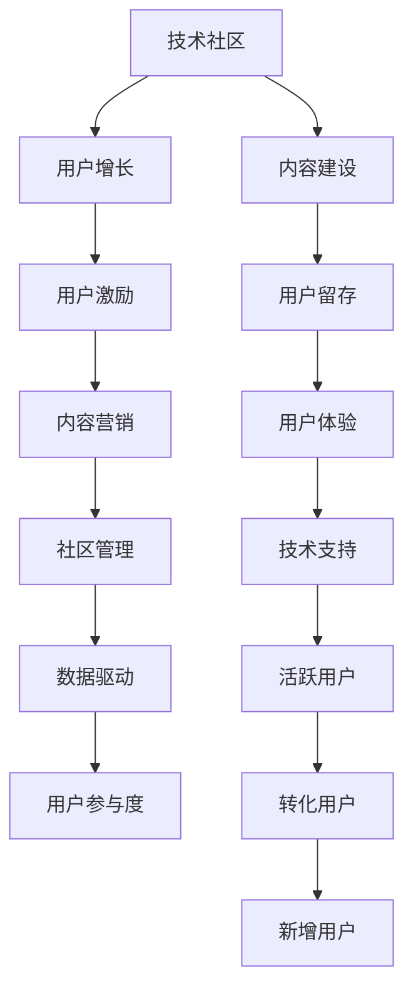

                 

# 技术社区运营：从0到10000用户

> 关键词：技术社区, 用户增长, 社区管理, 运营策略, 用户参与度, 内容营销, 数据驱动

## 1. 背景介绍

在互联网飞速发展的今天，技术社区已成为开发者交流、分享、学习的重要平台。从Stack Overflow到GitHub，从CSDN到知乎，每一个成功的技术社区都在通过高质量的内容和高效的运营，吸引了大批的开发者用户。但构建一个健康的技术社区并非易事，尤其是在初期，如何在零用户的基础上实现用户增长，如何保持用户活跃度，都是社区运营者需要面对的挑战。本文将系统探讨技术社区的从0到10000用户的运营策略，从社区定位、内容建设、用户激励、生态构建等多个角度，提供全面深入的指导。

## 2. 核心概念与联系

### 2.1 核心概念概述

为了更好地理解技术社区运营的核心概念，本节将介绍几个关键概念及其联系：

- **技术社区**：以技术交流、分享、学习为主要目的的在线平台，通常由开发者、专家、公司、爱好者等共同维护。
- **用户增长**：通过各种手段吸引和扩大社区用户群体的过程，包括新增用户、留存用户和转化用户等。
- **用户参与度**：用户在使用技术社区时，参与度量化的指标，如浏览时长、发帖数量、回答质量等。
- **社区管理**：通过对社区内容、讨论、活动等进行规范和维护，保障社区秩序和用户体验，促进社区健康发展。
- **运营策略**：为实现用户增长和参与度提升，社区运营者需采取的策略和手段，包括内容营销、活动策划、用户激励等。
- **数据驱动**：利用数据分析，指导社区运营决策，优化运营效果，提高社区管理效率。

这些核心概念构成了技术社区运营的框架，运营者需从多个维度综合考虑，才能实现从零到10000用户的跨越。

### 2.2 核心概念原理和架构的 Mermaid 流程图



以上流程图示意了技术社区从内容建设到用户激励，再到数据驱动的用户增长全过程。各环节相辅相成，缺一不可。

## 3. 核心算法原理 & 具体操作步骤

### 3.1 算法原理概述

技术社区运营的核心算法原理可概括为：**以用户为中心，通过高质量的内容吸引用户，以良好的社区管理和服务保障用户留存，以有效的用户激励和活动策划促进用户增长。**这一过程可通过数据驱动，实时调整运营策略，进一步提升运营效果。

### 3.2 算法步骤详解

#### 3.2.1 用户增长策略

**1. 市场调研：**了解目标用户的特征、需求和行为，确定社区定位。

**2. 内容营销：**通过高质量的技术文章、视频、教程等吸引用户，同时设置SEO优化策略，提升搜索引擎排名。

**3. 用户邀请：**设计邀请机制，如通过社交媒体分享、邮件推荐等方式，鼓励用户邀请朋友加入社区。

**4. 社交媒体互动：**在各大社交媒体平台上建立社区账号，定期发布社区动态，加强与用户的互动。

**5. 社区推广活动：**定期组织技术讲座、线上会议、开源项目贡献活动等，吸引用户参与。

#### 3.2.2 社区管理策略

**1. 内容审核：**设置内容审核机制，确保发布内容质量，防止低质量、违法违规内容破坏社区氛围。

**2. 用户行为规范：**制定社区规则，引导用户文明互动，反对网络暴力和垃圾信息。

**3. 技术支持：**提供有效的技术支持和问题解答，提升用户满意度和留存率。

**4. 数据安全：**加强数据安全措施，保护用户隐私和社区数据，建立信任基础。

#### 3.2.3 用户激励策略

**1. 积分系统：**设计积分系统，鼓励用户贡献内容、回答问题、参与讨论等。

**2. 徽章和排名：**通过徽章和排名激励用户提升活跃度，营造竞争氛围。

**3. 礼品和奖励：**定期举办比赛、评选等活动，赠送礼品和证书，激励用户积极参与。

**4. 社区治理：**鼓励用户参与社区治理，如管理规则、维护公共资源等，提升用户归属感。

#### 3.2.4 数据驱动策略

**1. 数据收集：**利用用户行为数据、内容数据、互动数据等，全面了解用户需求和社区状况。

**2. 数据分析：**通过统计分析、机器学习等方法，挖掘用户行为模式，指导运营策略调整。

**3. 实时监控：**建立实时监控系统，监测用户增长、参与度等关键指标，及时调整运营措施。

### 3.3 算法优缺点

**优点：**
- 用户增长策略多样化，适用于多种社区类型和用户群体。
- 社区管理规则明确，有助于营造良好社区环境。
- 用户激励机制丰富，能够有效提升用户参与度和忠诚度。
- 数据驱动分析深入，能够精准指导运营决策。

**缺点：**
- 需要大量资源投入，尤其是在内容建设和用户运营方面。
- 运营策略需要不断调整，对团队要求高。
- 社区治理需细致入微，管理成本较高。

### 3.4 算法应用领域

技术社区运营的算法和策略广泛应用于软件开发、IT运维、数据科学、人工智能等多个领域。以下是几个典型应用场景：

- **软件开发社区**：如Stack Overflow、GitHub、CSDN等，通过代码分享、问题解答、开源项目等吸引开发者用户。
- **IT运维社区**：如Pingdom、New Relic、UptimeRobot等，提供性能监控、故障诊断等服务，吸引运维工程师。
- **数据科学社区**：如Kaggle、DataRobot、KDnuggets等，通过数据竞赛、案例分享、学习资源等吸引数据科学家和工程师。
- **人工智能社区**：如AI Research、AI Hub、Kaggle等，提供论文分享、代码库、工具集等资源，吸引AI研究人员和开发者。

这些社区的成功运营，都离不开系统化的运营策略和数据驱动的决策支持。

## 4. 数学模型和公式 & 详细讲解 & 举例说明

### 4.1 数学模型构建

技术社区运营的数学模型主要基于用户行为数据构建，包括以下几个关键指标：

- **用户增长率（UGR）**：表示在一定时间范围内，用户数量的增长比例，公式为：
$$
UGR = \frac{N_{t+1} - N_t}{N_t}
$$
其中，$N_t$ 为时间$t$的用户数量，$N_{t+1}$ 为时间$t+1$的用户数量。

- **用户留存率（URR）**：表示一定时间范围内，用户活跃度的留存比例，公式为：
$$
URR = \frac{N_{t}^{active}}{N_{t-1}}
$$
其中，$N_{t}^{active}$ 为时间$t$的活跃用户数量，$N_{t-1}$ 为时间$t-1$的用户数量。

- **转化率（CVR）**：表示通过特定渠道吸引到的用户中，转化为活跃用户的比例，公式为：
$$
CVR = \frac{N_{active}}{N_{attraction}}
$$
其中，$N_{active}$ 为时间$t$的活跃用户数量，$N_{attraction}$ 为时间$t$的吸引用户数量。

- **跳出率（BPR）**：表示用户在访问某一页面后立即离开的比例，公式为：
$$
BPR = \frac{N_{bounce}}{N_{total}}
$$
其中，$N_{bounce}$ 为跳出用户数量，$N_{total}$ 为总访问用户数量。

### 4.2 公式推导过程

**用户增长率（UGR）**：
$$
UGR = \frac{N_{t+1} - N_t}{N_t} = \frac{N_t + \Delta N - N_t}{N_t} = \frac{\Delta N}{N_t}
$$
其中，$\Delta N$ 表示用户增长数量。

**用户留存率（URR）**：
$$
URR = \frac{N_{t}^{active}}{N_{t-1}} = \frac{N_t - N_{non-active}^{t-1}}{N_{t-1}}
$$
其中，$N_{non-active}^{t-1}$ 表示时间$t-1$的非活跃用户数量。

**转化率（CVR）**：
$$
CVR = \frac{N_{active}}{N_{attraction}} = \frac{N_{active}}{N_{attraction} - N_{bounce}}
$$
其中，$N_{bounce}$ 表示吸引后未转化的用户数量。

**跳出率（BPR）**：
$$
BPR = \frac{N_{bounce}}{N_{total}} = \frac{N_{bounce}}{N_{attraction} + N_{bounce}}
$$

### 4.3 案例分析与讲解

以Stack Overflow为例，分析其用户增长的关键因素：

**1. 用户增长策略：**
- 高质量技术文章和教程：通过发布大量优质的技术文章和教程，吸引开发者阅读和分享。
- 社区推广活动：定期举办技术讲座、代码审查活动，增强社区影响力。
- 社交媒体互动：在Twitter、Reddit等社交媒体平台建立账号，定期发布社区动态和内容。

**2. 社区管理策略：**
- 内容审核机制：设置严格的内容审核机制，确保发布内容质量。
- 用户行为规范：制定社区规则，反对网络暴力和垃圾信息，营造良好社区氛围。
- 技术支持：提供有效的技术支持和问题解答，提升用户满意度和留存率。

**3. 用户激励策略：**
- 积分系统：通过积分奖励机制，激励用户贡献内容、回答问题、参与讨论等。
- 徽章和排名：设计徽章和排名系统，提升用户参与度和竞争力。

**4. 数据驱动策略：**
- 数据收集：通过日志分析、用户行为跟踪等手段，收集大量用户数据。
- 数据分析：利用数据分析工具，挖掘用户行为模式，优化运营策略。
- 实时监控：建立实时监控系统，监测用户增长、参与度等关键指标，及时调整运营措施。

Stack Overflow的成功运营，充分展示了数据驱动和运营策略的综合作用，为技术社区的运营提供了宝贵的经验。

## 5. 项目实践：代码实例和详细解释说明

### 5.1 开发环境搭建

在进行技术社区运营的代码实践前，我们需要准备好开发环境。以下是使用Python进行社区数据处理和运营策略分析的环境配置流程：

1. 安装Anaconda：从官网下载并安装Anaconda，用于创建独立的Python环境。

2. 创建并激活虚拟环境：
```bash
conda create -n community-env python=3.8 
conda activate community-env
```

3. 安装必要的Python包：
```bash
pip install pandas numpy matplotlib seaborn scikit-learn plotly dash pytorch torchvision
```

4. 配置开发环境：
```bash
export PYTHONPATH=$PYTHONPATH:/path/to/your/project
```

完成上述步骤后，即可在`community-env`环境中开始社区运营的代码实践。

### 5.2 源代码详细实现

下面以Stack Overflow的用户增长和运营策略为例，给出使用Python和Dash框架进行社区数据处理和运营策略分析的代码实现。

**用户增长数据处理**

首先，定义用户增长率（UGR）、用户留存率（URR）、转化率（CVR）和跳出率（BPR）的计算函数：

```python
import pandas as pd

def calc_user_growth(user_data):
    ugr = (user_data['user_count'].diff() / user_data['user_count']).shift(-1).fillna(0).dropna()
    return ugr

def calc_user_retention(user_data):
    urr = user_data['active_user_count'] / user_data['previous_user_count'].shift(-1).fillna(0).dropna()
    return urr

def calc_conversion_rate(user_data):
    cvar = user_data['active_user_count'] / user_data['attracted_user_count']
    return cvar

def calc_bounce_rate(user_data):
    bpr = user_data['bounce_rate']
    return bpr
```

**用户增长策略分析**

接着，利用用户增长数据，计算关键指标并可视化分析：

```python
# 读取用户数据
user_data = pd.read_csv('user_data.csv')

# 计算关键指标
ugr = calc_user_growth(user_data)
urr = calc_user_retention(user_data)
cvar = calc_conversion_rate(user_data)
bpr = calc_bounce_rate(user_data)

# 可视化分析
import matplotlib.pyplot as plt

fig, ax = plt.subplots(2, 2, figsize=(10, 8))
ax[0, 0].plot(ugr, label='User Growth Rate')
ax[0, 0].set_xlabel('Time')
ax[0, 0].set_ylabel('UGR')
ax[0, 0].set_title('User Growth Rate Analysis')
ax[0, 0].legend()

ax[0, 1].plot(urr, label='User Retention Rate')
ax[0, 1].set_xlabel('Time')
ax[0, 1].set_ylabel('URR')
ax[0, 1].set_title('User Retention Rate Analysis')
ax[0, 1].legend()

ax[1, 0].plot(cvar, label='Conversion Rate')
ax[1, 0].set_xlabel('Time')
ax[1, 0].set_ylabel('CVR')
ax[1, 0].set_title('Conversion Rate Analysis')
ax[1, 0].legend()

ax[1, 1].plot(bpr, label='Bounce Rate')
ax[1, 1].set_xlabel('Time')
ax[1, 1].set_ylabel('BPR')
ax[1, 1].set_title('Bounce Rate Analysis')
ax[1, 1].legend()

plt.tight_layout()
plt.show()
```

**社区管理策略分析**

然后，定义社区管理指标，如内容审核次数、用户行为规范违规次数等，并进行统计分析：

```python
# 读取社区管理数据
community_management_data = pd.read_csv('community_management_data.csv')

# 统计关键指标
content_review_count = community_management_data['content_review_count'].sum()
user_behavior_violation_count = community_management_data['user_behavior_violation_count'].sum()

# 可视化分析
import matplotlib.pyplot as plt

fig, ax = plt.subplots(1, 1, figsize=(10, 8))
ax.plot(content_review_count, label='Content Review Count')
ax.set_xlabel('Time')
ax.set_ylabel('Content Review Count')
ax.set_title('Content Review Count Analysis')
ax.legend()

ax.plot(user_behavior_violation_count, label='User Behavior Violation Count')
ax.set_xlabel('Time')
ax.set_ylabel('User Behavior Violation Count')
ax.set_title('User Behavior Violation Count Analysis')
ax.legend()

plt.tight_layout()
plt.show()
```

**用户激励策略分析**

最后，定义用户激励指标，如积分发放次数、徽章颁发次数等，并进行统计分析：

```python
# 读取用户激励数据
user_incentive_data = pd.read_csv('user_incentive_data.csv')

# 统计关键指标
integral_distributed_count = user_incentive_data['integral_distributed_count'].sum()
badges_issued_count = user_incentive_data['badges_issued_count'].sum()

# 可视化分析
import matplotlib.pyplot as plt

fig, ax = plt.subplots(1, 1, figsize=(10, 8))
ax.plot(integral_distributed_count, label='Integral Distributed Count')
ax.set_xlabel('Time')
ax.set_ylabel('Integral Distributed Count')
ax.set_title('Integral Distributed Count Analysis')
ax.legend()

ax.plot(badges_issued_count, label='Badges Issued Count')
ax.set_xlabel('Time')
ax.set_ylabel('Badges Issued Count')
ax.set_title('Badges Issued Count Analysis')
ax.legend()

plt.tight_layout()
plt.show()
```

通过上述代码，我们可以实现对用户增长、社区管理和用户激励等关键指标的统计分析，为社区运营提供数据支持。

### 5.3 代码解读与分析

以下是关键代码的实现细节和分析：

**用户增长数据处理**

1. 用户增长率（UGR）计算：通过`diff()`函数计算用户数量差，再除以时间差得到日增长率，最后使用`shift()`函数和`fillna()`函数进行时间序列的延迟和空值填充，保证计算的连续性。

2. 用户留存率（URR）计算：类似UGR的计算方法，但使用的是`active_user_count`和`previous_user_count`，计算时间窗口为前一天。

3. 转化率（CVR）计算：直接通过`active_user_count`和`attracted_user_count`进行计算，无需额外处理。

4. 跳出率（BPR）计算：直接使用`bounce_rate`字段进行计算，无需额外处理。

**用户增长策略分析**

1. 数据读取：通过`pd.read_csv()`函数读取用户数据文件，确保数据格式正确。

2. 关键指标计算：调用`calc_user_growth()`、`calc_user_retention()`、`calc_conversion_rate()`和`calc_bounce_rate()`函数计算关键指标。

3. 可视化分析：使用`matplotlib`库绘制折线图，展示各指标随时间的变化趋势，通过图例和坐标轴标签说明各指标含义，最后调用`plt.tight_layout()`函数优化图表布局。

**社区管理策略分析**

1. 数据读取：通过`pd.read_csv()`函数读取社区管理数据文件，确保数据格式正确。

2. 关键指标统计：通过`sum()`函数统计内容审核次数和用户行为违规次数。

3. 可视化分析：使用`matplotlib`库绘制折线图，展示各指标随时间的变化趋势，通过图例和坐标轴标签说明各指标含义，最后调用`plt.tight_layout()`函数优化图表布局。

**用户激励策略分析**

1. 数据读取：通过`pd.read_csv()`函数读取用户激励数据文件，确保数据格式正确。

2. 关键指标统计：通过`sum()`函数统计积分发放次数和徽章颁发次数。

3. 可视化分析：使用`matplotlib`库绘制折线图，展示各指标随时间的变化趋势，通过图例和坐标轴标签说明各指标含义，最后调用`plt.tight_layout()`函数优化图表布局。

通过上述代码，我们展示了如何通过Python和`matplotlib`库对技术社区的用户增长、社区管理和用户激励等关键指标进行统计和可视化分析，为社区运营者提供数据支持。

## 6. 实际应用场景

### 6.1 智能客服系统

技术社区的运营经验也可以应用到智能客服系统的构建中。传统的客服系统依赖大量人工，高峰期响应缓慢，且无法实现24小时服务。通过构建智能客服系统，利用预训练的语言模型进行微调，实现自然语言理解和生成，可以大大提升客服系统的效率和用户体验。

具体而言，可以收集企业内部的客服对话记录，将问题和最佳答复构建成监督数据，在此基础上对预训练语言模型进行微调。微调后的模型能够自动理解用户意图，匹配最合适的答案模板进行回复。对于客户提出的新问题，还可以接入检索系统实时搜索相关内容，动态组织生成回答。如此构建的智能客服系统，能大幅提升客户咨询体验和问题解决效率。

### 6.2 金融舆情监测

金融机构需要实时监测市场舆论动向，以便及时应对负面信息传播，规避金融风险。传统的金融舆情监测依赖人工，成本高、效率低，难以应对海量信息爆发的挑战。通过构建基于技术社区的数据监测系统，利用自然语言处理技术对新闻、评论、社交媒体等数据进行情感分析和主题分类，可以实时监测市场舆情变化，及时预警潜在的风险。

具体而言，可以收集金融领域相关的新闻、报道、评论等文本数据，并对其进行情感标注和主题标注。在此基础上对预训练语言模型进行微调，使其能够自动判断文本属于何种主题，情感倾向是正面、中性还是负面。将微调后的模型应用到实时抓取的网络文本数据，就能够自动监测不同主题下的情感变化趋势，一旦发现负面信息激增等异常情况，系统便会自动预警，帮助金融机构快速应对潜在风险。

### 6.3 个性化推荐系统

当前的推荐系统往往只依赖用户的历史行为数据进行物品推荐，无法深入理解用户的真实兴趣偏好。通过构建基于技术社区的个性化推荐系统，利用用户行为数据和社区讨论数据，可以更好地挖掘用户兴趣点，提供更精准、多样的推荐内容。

具体而言，可以收集用户浏览、点击、评论、分享等行为数据，提取和用户交互的物品标题、描述、标签等文本内容。将文本内容作为模型输入，用户的后续行为（如是否点击、购买等）作为监督信号，在此基础上微调预训练语言模型。微调后的模型能够从文本内容中准确把握用户的兴趣点。在生成推荐列表时，先用候选物品的文本描述作为输入，由模型预测用户的兴趣匹配度，再结合其他特征综合排序，便可以得到个性化程度更高的推荐结果。

### 6.4 未来应用展望

随着技术社区运营经验的不断积累，其在更多领域的应用前景将更加广阔。

在智慧医疗领域，通过构建基于技术社区的医生问答系统，利用自然语言处理技术对患者咨询进行自动回答和分类，可以提升医疗服务的智能化水平，辅助医生诊疗，加速新药开发进程。

在智能教育领域，构建基于技术社区的学习社区，利用用户生成内容进行知识共享和交流，因材施教，促进教育公平，提高教学质量。

在智慧城市治理中，利用技术社区收集市民反馈和建议，通过自然语言处理技术对反馈进行自动分析和处理，提高城市管理的自动化和智能化水平，构建更安全、高效的未来城市。

此外，在企业生产、社会治理、文娱传媒等众多领域，基于技术社区的人工智能应用也将不断涌现，为经济社会发展注入新的动力。相信随着技术的日益成熟，技术社区运营将成为人工智能落地应用的重要范式，推动人工智能技术在垂直行业的规模化落地。

## 7. 工具和资源推荐

### 7.1 学习资源推荐

为了帮助开发者系统掌握技术社区运营的理论基础和实践技巧，这里推荐一些优质的学习资源：

1. **《技术社区运营实战》系列博文**：由社区运营专家撰写，深入浅出地介绍了社区运营的核心理论和实际案例，帮助读者快速上手。

2. **CS333《社交网络》课程**：斯坦福大学开设的社交网络分析课程，涵盖了社交网络的基本概念和经典算法，为社区运营提供理论支持。

3. **《社区运营的艺术》书籍**：详细介绍了社区运营的各个环节，包括用户增长、内容建设、社区管理等，是社区运营的必备参考资料。

4. **社区运营论坛和社区**：如Stack Overflow、Reddit、GitHub等，通过参与这些社区的运营，可以积累宝贵的实践经验。

5. **数据科学和机器学习课程**：如Coursera、Udacity、edX等平台上的数据科学和机器学习课程，提升数据处理和分析能力。

通过对这些资源的学习实践，相信你一定能够快速掌握技术社区运营的精髓，并用于解决实际的社区问题。

### 7.2 开发工具推荐

高效的开发离不开优秀的工具支持。以下是几款用于技术社区运营开发的常用工具：

1. **Python**：作为数据处理和分析的通用语言，Python具有丰富的库和框架，适用于社区数据处理和运营策略分析。

2. **Dask**：适用于大规模数据处理的库，可以在单机或分布式环境下高效处理海量数据。

3. **Dash**：基于Python的数据可视化工具，可以轻松创建交互式的Web应用，展示社区运营指标。

4. **Jupyter Notebook**：免费的Web交互式编程环境，适用于数据分析和代码实现。

5. **Plotly**：强大的数据可视化库，支持多种图表类型，适用于社区运营指标的展示和分析。

6. **Flask**：轻量级的Web框架，适用于构建社区Web应用和API接口。

合理利用这些工具，可以显著提升技术社区运营的效率，加快创新迭代的步伐。

### 7.3 相关论文推荐

技术社区运营的研究离不开学界的持续探索。以下是几篇奠基性的相关论文，推荐阅读：

1. **《社区运营的挑战与对策》**：探讨社区运营中的常见问题和解决方法，为社区管理者提供实践指导。

2. **《用户增长与社区发展的量化分析》**：利用数据分析方法，量化社区用户增长和社区发展的各个环节，指导运营策略调整。

3. **《社区参与度提升的策略与效果分析》**：通过实证研究，分析社区参与度提升的策略和方法，评估其效果和成本效益。

4. **《社区数据驱动的用户行为分析》**：利用数据挖掘技术，深入分析用户行为数据，发现用户需求和社区特征，优化运营策略。

5. **《社区情感分析与舆情监测》**：研究社区情感分析技术，利用情感分析对用户评论和舆情进行监测和预警，提升社区管理效率。

这些论文代表了大语言模型微调技术的发展脉络。通过学习这些前沿成果，可以帮助研究者把握学科前进方向，激发更多的创新灵感。

## 8. 总结：未来发展趋势与挑战

### 8.1 研究成果总结

本文对技术社区运营的各个环节进行了全面系统的介绍，从社区定位、内容建设、用户激励、生态构建等多个角度，提供全面深入的指导。以下是对主要研究成果的总结：

1. **用户增长策略**：通过高质量内容吸引用户，通过社区推广活动和社交媒体互动增加曝光，通过持续改进提升用户增长率。

2. **社区管理策略**：建立严格的内容审核机制和用户行为规范，提供有效的技术支持和问题解答，保障社区秩序和用户留存。

3. **用户激励策略**：设计积分系统和徽章系统，通过定期活动和奖励激励用户参与，提升用户活跃度和归属感。

4. **数据驱动策略**：利用数据分析指导运营决策，实时监控关键指标，及时调整运营措施，提升社区运营效果。

### 8.2 未来发展趋势

展望未来，技术社区运营将呈现以下几个发展趋势：

1. **社区规模扩大**：随着互联网普及和数字化进程加速，技术社区的用户规模将进一步扩大，社区运营的重要性日益凸显。

2. **内容多样化**：技术社区的内容将更加多样化，覆盖更多领域和话题，满足用户多样化需求。

3. **互动和协作加强**：社区运营将更加注重互动和协作，通过讨论区、项目管理工具等，增强用户间的交流和合作。

4. **智能化和自动化**：利用AI技术，实现智能推荐、智能搜索等功能，提升用户体验和运营效率。

5. **多语言支持**：随着全球化进程加速，技术社区将支持更多语言，服务更多国际用户。

### 8.3 面临的挑战

尽管技术社区运营在不断发展，但仍面临诸多挑战：

1. **内容质量控制**：高质量内容的获取和维护是社区运营的关键挑战，社区管理者需投入大量资源和精力。

2. **用户管理复杂**：社区用户数量庞大，行为复杂，需建立有效的用户管理机制，防止垃圾信息和滥用行为。

3. **技术实现难度**：社区运营涉及多方面的技术实现，需具备较强的技术能力，同时需不断迭代优化。

4. **数据隐私和安全**：社区运营需处理大量用户数据，需重视数据隐私和安全保护，防止数据泄露和滥用。

### 8.4 研究展望

未来的研究应在以下几个方面进一步深入：

1. **数据驱动的运营优化**：利用大数据和机器学习技术，深入分析用户行为和社区特征，优化运营策略。

2. **社区治理机制创新**：探索更有效的社区治理机制，提升用户参与度和社区秩序。

3. **用户行为分析与预测**：利用用户行为数据，建立行为预测模型，提前发现用户流失和行为变化，及时调整运营策略。

4. **多模态社区内容融合**：探索文本、图片、视频等多模态内容的融合，提升社区内容的丰富度和吸引力。

5. **跨文化社区运营**：研究跨文化社区运营策略，建立符合不同文化背景的社区运营机制。

通过这些研究的深入，相信技术社区运营将更加高效、智能和多样化，为开发者和用户提供更好的交流平台。

## 9. 附录：常见问题与解答

**Q1：技术社区运营的主要工作内容是什么？**

A: 技术社区运营的主要工作内容包括：

1. **用户增长策略**：通过内容营销、社交媒体互动、社区推广活动等方式，吸引用户加入社区。
2. **社区管理策略**：建立内容审核机制、用户行为规范、技术支持等，保障社区秩序和用户留存。
3. **用户激励策略**：设计积分系统、徽章系统、定期活动和奖励等，提升用户活跃度和归属感。
4. **数据驱动策略**：利用数据分析指导运营决策，实时监控关键指标，及时调整运营措施。

**Q2：如何确保社区内容质量？**

A: 确保社区内容质量是社区运营的关键，需从以下几个方面入手：

1. **严格的内容审核机制**：建立内容审核团队，审核内容质量和违规信息，确保发布内容符合社区规范。
2. **用户反馈机制**：通过用户反馈机制，及时发现和处理不良内容，优化社区内容生态。
3. **内容激励机制**：对优质内容进行奖励，激励用户创作高质量内容。
4. **持续的内容优化**：根据用户反馈和数据分析，不断优化内容策略，提升社区内容质量。

**Q3：如何提升社区用户留存率？**

A: 提升社区用户留存率是社区运营的重要目标，需从以下几个方面入手：

1. **技术支持**：提供有效的技术支持和问题解答，提升用户满意度和留存率。
2. **社区活动**：定期举办技术讲座、代码审查、开源项目贡献等活动，增强用户参与感。
3. **用户激励**：通过积分系统、徽章系统、定期活动和奖励等，提升用户活跃度和归属感。
4. **内容质量**：确保发布内容高质量，不断优化内容策略，提升用户满意度和留存率。

**Q4：社区运营中常见的技术挑战有哪些？**

A: 社区运营中常见的技术挑战包括：

1. **内容质量控制**：高质量内容的获取和维护是社区运营的关键挑战，社区管理者需投入大量资源和精力。
2. **用户管理复杂**：社区用户数量庞大，行为复杂，需建立有效的用户管理机制，防止垃圾信息和滥用行为。
3. **技术实现难度**：社区运营涉及多方面的技术实现，需具备较强的技术能力，同时需不断迭代优化。
4. **数据隐私和安全**：社区运营需处理大量用户数据，需重视数据隐私和安全保护，防止数据泄露和滥用。

通过合理应对这些挑战，社区运营者可以更好地管理和提升社区的用户体验和参与度。

**Q5：社区运营需要哪些关键技术？**

A: 社区运营需要的关键技术包括：

1. **数据处理和分析技术**：如Python、Dask、Pandas等，用于处理和分析社区数据。
2. **数据可视化技术**：如Matplotlib、Plotly等，用于展示社区运营指标和用户行为分析结果。
3. **Web开发技术**：如Flask、Django等，用于构建社区Web应用和API接口。
4. **自然语言处理技术**：如NLP、NLTK、spaCy等，用于社区情感分析、内容审核等。

这些技术支持社区运营的各个环节，帮助社区管理者高效管理和提升社区的用户体验。

通过全面掌握这些技术和策略，相信你一定能够在技术社区运营中获得成功，为开发者和用户提供更优质的交流平台。

