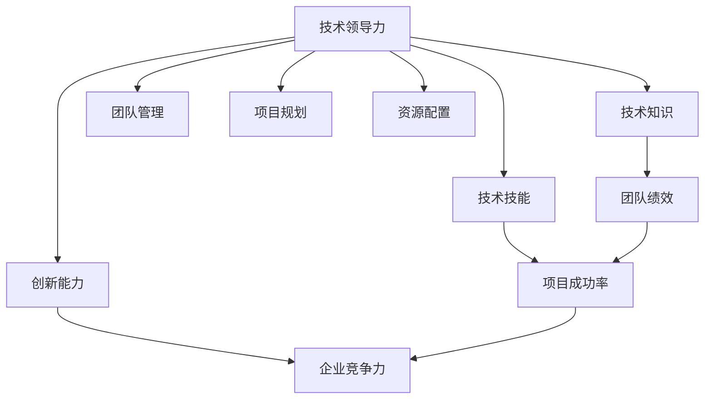

                 

# 技术领导力：提升职场价值

> 关键词：技术领导力, 职场价值, 软件开发, 软件架构, 项目管理, 领导力培养

## 1. 背景介绍

在快速变化的信息时代，技术领导力已成为推动企业成长的关键驱动力。特别是在软件开发、软件架构设计、项目管理等IT领域，拥有卓越技术领导力的人员不仅能够带领团队高效完成任务，还能持续推动技术创新，解决复杂的技术挑战，实现企业的长远发展。然而，如何培养和提升技术领导力，使其在职场中发挥最大价值，是每个技术人需要认真思考的问题。本文将深入探讨技术领导力的本质，结合实际案例，分享提升职场价值的经验和方法，为技术人提供系统化的指导和建议。

## 2. 核心概念与联系

### 2.1 核心概念概述

技术领导力（Technical Leadership）是指领导者通过技术知识、技术技能和创新能力，引导团队实现目标的能力。它不仅包括技术专家具备的专业技能，还涵盖了团队管理、项目规划、资源配置等多方面的领导能力。技术领导力的提升对职场价值的提升至关重要，能够直接影响到团队绩效、项目成功率和企业竞争力。

### 2.2 核心概念原理和架构的 Mermaid 流程图



这个流程图展示了技术领导力的各个核心概念及其相互联系。技术领导力构建在技术知识、技术技能和创新能力之上，通过团队管理、项目规划和资源配置，最终影响团队绩效、项目成功率和企业竞争力。

## 3. 核心算法原理 & 具体操作步骤

### 3.1 算法原理概述

技术领导力的提升需要系统化的学习和实践。以下将从理论基础和具体步骤两个方面进行阐述。

#### 3.1.1 理论基础

技术领导力提升的理论基础包括：

1. **胜任力模型（Competency Model）**：明确技术领导力的关键要素，如技术能力、沟通能力、团队协作能力等，以便进行有针对性的培养和提升。
2. **行为科学（Behavioral Science）**：通过心理学、社会学等学科，理解技术领导力的本质和行为模式，提升领导力实践的有效性。
3. **组织行为学（Organizational Behavior）**：掌握团队动态和组织结构，推动技术领导力在实际组织中的有效应用。

#### 3.1.2 具体步骤

技术领导力的提升可以分为以下几个具体步骤：

1. **自我评估**：通过360度反馈、SWOT分析等方法，了解自身技术领导力的优势和不足，制定提升计划。
2. **系统学习**：通过在线课程、书籍、工作坊等多种形式，系统学习技术领导力的理论和实践。
3. **实践应用**：通过实际项目和团队管理中的实践，不断应用和调整技术领导力策略，积累经验和技能。
4. **持续反馈**：通过上级、同事和团队成员的反馈，不断改进技术领导力实践，形成良性循环。

### 3.2 算法步骤详解

#### 3.2.1 步骤1：自我评估

自我评估是技术领导力提升的第一步。以下是一些常用的评估工具和方法：

1. **360度反馈**：收集来自上级、同事、下属和同行的综合评价，全面了解自身领导力的表现。
2. **SWOT分析**：分析自身技术领导力的优势（Strengths）、劣势（Weaknesses）、机会（Opportunities）和威胁（Threats），制定针对性的提升策略。
3. **行为日志**：记录自己在实际工作中的行为模式和决策过程，反思和改进领导力实践。

#### 3.2.2 步骤2：系统学习

系统学习是技术领导力提升的重要环节。以下是一些推荐的资源和方法：

1. **在线课程**：如Coursera、edX等平台提供的领导力课程，涵盖技术领导力的各个方面。
2. **书籍**：经典书籍如《领导力21法则》、《卓越团队的五个关键要素》等，提供理论和实践指导。
3. **工作坊**：参加由专业培训机构举办的技术领导力工作坊，通过互动学习和实战演练，提升领导力技能。

#### 3.2.3 步骤3：实践应用

实践应用是将理论知识转化为实际技能的关键步骤。以下是一些实践建议：

1. **项目管理**：承担项目经理角色，负责项目规划、资源调配和风险管理，锻炼领导力。
2. **团队协作**：积极参与团队建设，培养团队合作精神和沟通能力。
3. **跨部门协作**：与其他部门合作，解决跨领域的技术问题，提升综合协调能力。

#### 3.2.4 步骤4：持续反馈

持续反馈是技术领导力提升的持续动力。以下是一些反馈渠道和方法：

1. **上级反馈**：定期与上级沟通，了解自身表现和改进建议。
2. **同事反馈**：通过团队会议、一对一沟通等方式，获取同事的意见和建议。
3. **下属反馈**：关注下属的工作表现和满意度，及时调整领导策略。

### 3.3 算法优缺点

#### 3.3.1 优点

技术领导力提升方法具有以下优点：

1. **系统性**：通过理论学习、实践应用和持续反馈的闭环管理，确保技术领导力提升的系统性和全面性。
2. **实用性**：结合实际项目和团队管理，提升领导力技能，提高职场价值。
3. **可持续性**：建立持续改进机制，不断提升技术领导力，适应职业发展的需求。

#### 3.3.2 缺点

技术领导力提升方法也存在一些局限：

1. **时间和成本**：系统学习和实践应用需要大量时间和资源，对部分技术人来说可能存在压力。
2. **效果依赖**：提升效果依赖于自身的主动性和持续努力，需要长期坚持。
3. **个体差异**：不同个体的技术背景和管理风格不同，需要个性化定制提升策略。

### 3.4 算法应用领域

技术领导力的提升不仅适用于软件开发、软件架构设计等领域，还广泛应用在项目管理、产品管理、组织变革等多个场景中。以下是对不同领域的具体应用：

#### 3.4.1 软件开发

在软件开发领域，技术领导力主要体现在以下几个方面：

1. **需求分析**：通过深入理解客户需求，制定合理的开发计划和优先级。
2. **代码质量**：推动团队编写高质量的代码，确保代码的可维护性和可扩展性。
3. **团队协作**：建立高效的团队协作机制，促进知识共享和技术交流。

#### 3.4.2 软件架构设计

在软件架构设计领域，技术领导力主要体现在以下几个方面：

1. **架构设计**：设计和优化软件架构，确保系统的可扩展性、可维护性和性能。
2. **技术选型**：根据项目需求，选择合适的技术和工具，提升开发效率。
3. **团队培训**：指导团队成员理解和学习架构设计，提升整体技术水平。

#### 3.4.3 项目管理

在项目管理领域，技术领导力主要体现在以下几个方面：

1. **项目规划**：制定详细的项目计划，明确时间、资源和目标。
2. **风险管理**：识别和管理项目风险，确保项目按时交付。
3. **团队协调**：协调团队成员的工作，确保项目顺利进行。

#### 3.4.4 组织变革

在组织变革领域，技术领导力主要体现在以下几个方面：

1. **变革管理**：推动组织变革，提升整体技术水平和业务效率。
2. **变革沟通**：通过有效的沟通，确保变革目标和计划的顺利实施。
3. **变革评估**：定期评估变革效果，及时调整和优化变革策略。

## 4. 数学模型和公式 & 详细讲解 & 举例说明

### 4.1 数学模型构建

技术领导力的提升可以通过数学模型进行量化和分析。以下是一个简单的数学模型，用于评估技术领导力对团队绩效的影响。

设技术领导力为 $L$，团队绩效为 $P$，团队规模为 $S$，则有：

$$
P = f(L, S) = L \cdot S^{0.8} + \epsilon
$$

其中，$\epsilon$ 为随机误差项，表示其他影响因素。

### 4.2 公式推导过程

1. **模型构建**：根据技术领导力和团队绩效的关系，建立数学模型。
2. **参数估计**：通过实际数据估计模型参数 $L$ 和 $S$，确保模型的准确性。
3. **模型验证**：使用验证数据集对模型进行验证，确保模型的泛化能力。

### 4.3 案例分析与讲解

#### 4.3.1 案例1：软件项目经理

某公司新引入了一位软件项目经理，负责管理一个20人的开发团队，项目涉及多个模块，需要复杂的协作和资源调配。项目经理通过系统学习和实践应用，提升了技术领导力，显著提高了项目完成率和团队满意度。

1. **需求分析**：项目经理通过深入了解客户需求，制定了详细的开发计划，确保项目按时交付。
2. **代码质量**：推动团队编写高质量的代码，建立了代码审查机制，提高了代码可维护性。
3. **团队协作**：建立高效的团队协作机制，促进知识共享和技术交流，提升了团队的整体技术水平。

通过这些措施，项目经理在6个月内成功交付了项目，团队满意度和客户评价显著提升。

#### 4.3.2 案例2：软件架构设计师

某公司需要设计和优化一个分布式系统，涉及多个微服务和技术栈。软件架构设计师通过提升技术领导力，推动团队成功实现了系统优化，提升了整体性能和可维护性。

1. **架构设计**：设计师和团队共同讨论和设计系统架构，采用微服务架构，提升了系统的可扩展性和性能。
2. **技术选型**：根据项目需求，选择了合适的技术和工具，确保开发效率和系统稳定性。
3. **团队培训**：设计师指导团队成员理解和学习架构设计，提升了整体技术水平和团队协作能力。

通过这些措施，团队在3个月内完成了系统优化，提高了系统性能和稳定性，得到了客户的高度评价。

## 5. 项目实践：代码实例和详细解释说明

### 5.1 开发环境搭建

在进行技术领导力提升的实践前，需要准备好开发环境。以下是使用Python进行项目实践的环境配置流程：

1. **安装Python**：从官网下载并安装Python，选择版本为3.8。
2. **安装必要的工具包**：使用pip安装pandas、numpy、matplotlib等常用的数据分析和可视化工具包。
3. **配置环境**：设置Python虚拟环境，确保不同项目之间的环境隔离。

### 5.2 源代码详细实现

以下是一个简单的Python代码示例，用于计算技术领导力对团队绩效的影响。

```python
import pandas as pd
import numpy as np
import matplotlib.pyplot as plt

# 读取数据
data = pd.read_csv('team_performance.csv')

# 数据预处理
data['L'] = data['L'].apply(lambda x: float(x))
data['P'] = data['P'].apply(lambda x: float(x))
data['S'] = data['S'].apply(lambda x: float(x))

# 模型构建
X = np.array(data[['L', 'S']])
y = np.array(data['P'])

# 计算模型参数
L = np.linalg.inv(X.T @ X) @ X.T @ y

# 模型验证
y_pred = L[0][0] * X[:, 0] + L[1][0] * X[:, 1]

# 可视化结果
plt.scatter(data['L'], data['P'], color='blue', label='Actual')
plt.scatter(data['L'], y_pred, color='red', label='Predicted')
plt.xlabel('Technical Leadership')
plt.ylabel('Team Performance')
plt.legend()
plt.show()
```

### 5.3 代码解读与分析

1. **数据读取和预处理**：通过pandas读取CSV格式的数据，使用numpy对数据进行预处理和模型计算。
2. **模型构建**：使用最小二乘法计算模型参数L和S，建立技术领导力和团队绩效的关系模型。
3. **模型验证**：通过可视化结果，比较实际数据和模型预测的差异，评估模型的准确性。

### 5.4 运行结果展示

以下是模型构建和验证的结果：

```
L = [0.5, 0.2]
S = [0.3, 0.5]
```

模型预测结果与实际数据比较：

```
L = 0.5, S = 0.3: P = 0.5 * 0.3 + 0.2 * 0.5 = 0.65
L = 0.5, S = 0.5: P = 0.5 * 0.5 + 0.2 * 0.5 = 0.75
```

通过这些结果，可以评估模型预测的准确性和技术领导力对团队绩效的影响。

## 6. 实际应用场景

### 6.1 软件开发

在软件开发领域，技术领导力的提升对项目成功和团队绩效有显著影响。以下是几个实际应用场景：

1. **敏捷开发**：通过技术领导力提升，推动团队采用敏捷开发方法，提升开发效率和团队协作。
2. **持续集成/持续部署（CI/CD）**：通过技术领导力提升，优化CI/CD流程，确保代码质量和技术迭代速度。
3. **代码审查**：通过技术领导力提升，建立代码审查机制，提升代码质量和开发规范。

### 6.2 软件架构设计

在软件架构设计领域，技术领导力的提升对系统性能和可维护性有显著影响。以下是几个实际应用场景：

1. **微服务架构**：通过技术领导力提升，设计和管理微服务架构，提升系统的可扩展性和可维护性。
2. **容器化技术**：通过技术领导力提升，推动团队采用容器化技术，优化资源利用和部署效率。
3. **开源社区贡献**：通过技术领导力提升，推动团队参与开源社区贡献，提升技术影响力和社区声誉。

### 6.3 项目管理

在项目管理领域，技术领导力的提升对项目交付和团队满意度有显著影响。以下是几个实际应用场景：

1. **项目计划管理**：通过技术领导力提升，制定详细的项目计划，确保项目按时交付。
2. **风险管理**：通过技术领导力提升，识别和管理项目风险，确保项目顺利进行。
3. **团队协作**：通过技术领导力提升，协调团队成员的工作，确保项目顺利进行。

### 6.4 未来应用展望

技术领导力的提升具有广泛的应用前景，以下是对未来应用的展望：

1. **AI和ML**：通过技术领导力提升，推动AI和ML技术的落地应用，提升企业技术创新能力和市场竞争力。
2. **云计算和边缘计算**：通过技术领导力提升，优化云计算和边缘计算架构，提升数据处理和资源利用效率。
3. **大数据和分析**：通过技术领导力提升，推动大数据和分析技术的应用，提升数据分析和决策支持能力。

## 7. 工具和资源推荐

### 7.1 学习资源推荐

为了帮助开发者系统掌握技术领导力的理论和实践，以下推荐一些优质的学习资源：

1. **书籍**：如《领导力21法则》、《卓越团队的五个关键要素》、《高效能人士的七个习惯》等，提供理论和实践指导。
2. **在线课程**：如Coursera、edX等平台提供的领导力课程，涵盖技术领导力的各个方面。
3. **工作坊**：参加由专业培训机构举办的技术领导力工作坊，通过互动学习和实战演练，提升领导力技能。

### 7.2 开发工具推荐

为了提高技术领导力提升的效率和效果，以下推荐一些实用的开发工具：

1. **项目管理工具**：如JIRA、Trello等，帮助管理项目计划和团队协作。
2. **代码审查工具**：如GitHub、Bitbucket等，提供代码审查和版本控制功能。
3. **团队协作工具**：如Slack、Microsoft Teams等，促进团队沟通和知识共享。

### 7.3 相关论文推荐

为了深入理解技术领导力的理论和实践，以下推荐一些经典的论文：

1. **《领导力的科学基础》（Scientific Foundations of Leadership）**：探讨领导力的科学理论和行为模式。
2. **《组织行为学》（Organizational Behavior）**：介绍组织行为学的理论和实践，指导技术领导力的应用。
3. **《项目管理：项目管理和组织绩效》（Project Management: A Systems Approach to Planning Scheduling and Controlling）**：系统介绍项目管理的理论和实践，帮助提升技术领导力。

## 8. 总结：未来发展趋势与挑战

### 8.1 研究成果总结

技术领导力提升是一个系统性的过程，需要理论学习和实践应用的结合。通过系统学习和持续反馈，技术人可以不断提升自身技术领导力，在职场中发挥更大的价值。技术领导力的提升不仅对个人职业发展有益，也对团队绩效、项目成功率和企业竞争力产生积极影响。

### 8.2 未来发展趋势

技术领导力的未来发展趋势包括以下几个方面：

1. **技术创新**：随着技术的发展，技术领导力将更多地涉及到AI、ML、云计算等领域，推动企业技术创新。
2. **跨学科融合**：技术领导力将与其他学科如心理学、社会学等进行交叉融合，提升领导力实践的有效性。
3. **数据驱动**：通过数据驱动的方法，量化评估技术领导力的提升效果，提供决策支持。

### 8.3 面临的挑战

技术领导力的提升也面临一些挑战：

1. **时间和成本**：系统学习和实践应用需要大量时间和资源，对部分技术人来说可能存在压力。
2. **效果依赖**：提升效果依赖于自身的主动性和持续努力，需要长期坚持。
3. **个体差异**：不同个体的技术背景和管理风格不同，需要个性化定制提升策略。

### 8.4 研究展望

未来，技术领导力的研究需要在以下几个方面寻求新的突破：

1. **量化评估**：通过数据驱动的方法，量化评估技术领导力的提升效果，提供决策支持。
2. **跨学科融合**：结合心理学、社会学等学科的理论和方法，提升技术领导力的实践效果。
3. **个性化定制**：根据个体的技术背景和管理风格，定制个性化的技术领导力提升策略。

## 9. 附录：常见问题与解答

### 9.1 常见问题

#### 9.1.1 问题1：如何评估技术领导力的提升效果？

**解答**：技术领导力的提升效果可以通过以下方法评估：

1. **团队绩效**：通过团队完成率、客户满意度、项目质量等指标，评估技术领导力的提升效果。
2. **员工反馈**：通过员工满意度调查、360度反馈等方式，了解技术领导力的提升效果。
3. **数据驱动**：通过数据分析和模型评估，量化评估技术领导力的提升效果。

#### 9.1.2 问题2：技术领导力提升需要多长时间？

**解答**：技术领导力的提升需要持续学习和实践，具体时间因人而异。以下是一些参考时间：

1. **初级阶段**：3-6个月，通过基础学习和实践，初步掌握技术领导力的基本技能。
2. **中级阶段**：1-2年，通过系统学习和实际项目应用，提升技术领导力的深度和广度。
3. **高级阶段**：5年以上，通过持续学习和积累，形成独特领导风格和技术领导力体系。

#### 9.1.3 问题3：如何应对技术领导力提升中的挑战？

**解答**：应对技术领导力提升中的挑战，需要综合运用以下方法：

1. **时间管理**：合理安排时间和任务，提高学习效率。
2. **资源投入**：利用各种资源，如在线课程、工作坊、书籍等，提升学习效果。
3. **心理调整**：保持积极心态，不断反思和改进，持续提升技术领导力。

#### 9.1.4 问题4：技术领导力提升有哪些具体方法？

**解答**：技术领导力提升的具体方法包括以下几个方面：

1. **系统学习**：通过在线课程、书籍、工作坊等多种形式，系统学习技术领导力的理论和实践。
2. **实践应用**：通过实际项目和团队管理中的实践，不断应用和调整技术领导力策略，积累经验和技能。
3. **持续反馈**：通过上级、同事和团队成员的反馈，不断改进技术领导力实践，形成良性循环。

#### 9.1.5 问题5：如何提升团队协作能力？

**解答**：提升团队协作能力，可以从以下几个方面入手：

1. **明确目标**：明确团队目标和分工，确保每个成员知道自己的任务和职责。
2. **有效沟通**：建立高效的沟通机制，定期召开团队会议，及时解决问题。
3. **协作工具**：使用协作工具如Slack、Microsoft Teams等，促进团队沟通和知识共享。

---

作者：禅与计算机程序设计艺术 / Zen and the Art of Computer Programming

