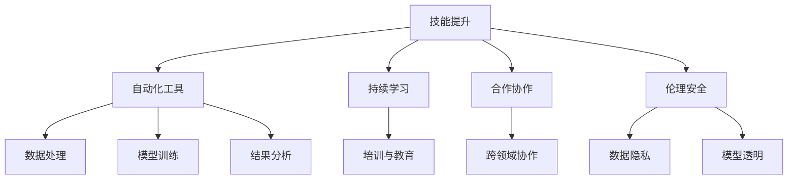

                 

# 技能提升：适应人类计算时代的新需求

> 关键词：技能提升,人类计算,人工智能,数据分析,数据科学,机器学习,深度学习,机器学习框架,Python

## 1. 背景介绍

### 1.1 问题由来
随着科技的飞速发展，人类正逐步进入一个全新的计算时代——人工智能(AI)和机器学习(ML)的大行其道。然而，如何提升人类的计算能力以适应这一变革，成为了一项紧迫的任务。

本领域内的一个突出问题在于，现有的人类计算能力与快速增长的数据和算力之间存在巨大的不匹配。随着越来越多的数据被收集和分析，对人类计算技能的需求日益增长。然而，人类计算机能（HPC）领域的人才储备和技能培训机制却远远跟不上实际需求，这导致技能短缺、成本高昂，以及广泛存在的计算偏见等问题。

### 1.2 问题核心关键点
针对这一挑战，我们需要从多个角度入手：

1. **技能提升**：通过培训和教育，提高现有的技术人才的计算能力。
2. **自动化工具**：利用AI技术自动化处理数据和分析任务，降低人类计算的负担。
3. **持续学习**：建立终身学习机制，使得人们能够不断更新自己的技能和知识，适应新技术的发展。
4. **合作与协作**：促进不同领域之间的合作与协作，共同提升人类计算能力。
5. **伦理与安全**：在技能提升和自动化工具开发的过程中，注重数据隐私和伦理安全问题。

### 1.3 问题研究意义
提升人类计算能力，对于推动科技创新、优化资源配置、提升社会生产力具有重要意义。通过提升人类计算能力，不仅能够加速科学研究和工程应用，还能提升社会治理能力，促进社会公平与正义。

## 2. 核心概念与联系

### 2.1 核心概念概述

为更好地理解如何提升人类计算能力，本节将介绍几个关键概念：

- **人类计算（HPC）**：指通过人类智慧和专业技能，处理复杂计算任务的能力。人类计算不仅仅是数学和物理计算，还包括数据分析、编程、管理等多方面的能力。
- **人工智能（AI）**：指由计算机模拟人类智能行为的技术，包括机器学习、自然语言处理、计算机视觉等子领域。
- **机器学习（ML）**：指利用数据和算法，让计算机从经验中学习，自动改善性能的技术。
- **深度学习（DL）**：一种特殊形式的机器学习，利用深度神经网络处理大规模数据。
- **机器学习框架**：如TensorFlow、PyTorch等，提供了一系列API和工具，便于开发和部署机器学习模型。
- **Python**：一种高效易用的编程语言，广泛应用于数据科学、机器学习等领域。

这些核心概念之间的联系可以通过以下Mermaid流程图来展示：

```mermaid
graph TB
    A[人类计算(HPC)] --> B[人工智能(AI)]
    A --> C[机器学习(ML)]
    C --> D[深度学习(DL)]
    C --> E[机器学习框架]
    E --> F[Python]
```

这个流程图展示了一系列计算技术的发展脉络：

1. 人类计算是AI和ML的基础。
2. 机器学习和深度学习技术是实现AI的核心。
3. 机器学习框架和Python是实现ML和DL的工具。

## 3. 核心算法原理 & 具体操作步骤
### 3.1 算法原理概述

提升人类计算能力的核心在于技能提升、自动化工具开发、持续学习、合作协作和伦理安全五个方面。各领域之间的联系和交互如图：



### 3.2 算法步骤详解

#### 3.2.1 技能提升

1. **评估需求**：通过调查问卷、数据收集等手段，了解技能需求和缺口。
2. **设计培训计划**：根据需求设计培训内容，包括理论知识和实践操作。
3. **实施培训**：通过线上线下结合的方式，进行集中培训或自主学习。
4. **评估效果**：通过考试、项目评估等方式，验证培训效果。

#### 3.2.2 自动化工具

1. **选择工具**：根据任务需求选择合适的工具和技术栈。
2. **开发与部署**：根据需求设计开发流程，并进行模型训练和部署。
3. **持续优化**：不断优化工具性能，提升用户体验。

#### 3.2.3 持续学习

1. **建立机制**：通过在线课程、公开讲座、论文阅读等方式，提供持续学习资源。
2. **激励机制**：设立激励机制，如认证、奖励，激发持续学习的动力。
3. **实践平台**：创建实践平台，如数据科学竞赛、开源社区等，促进学习者交流与合作。

#### 3.2.4 合作协作

1. **跨领域合作**：促进不同学科和领域之间的合作，共同提升计算能力。
2. **开源协作**：利用开源社区的力量，共同开发和分享计算工具和算法。
3. **学术研究**：鼓励跨学科研究，推动人类计算技术的发展。

#### 3.2.5 伦理安全

1. **数据隐私**：采用隐私保护技术，确保数据安全和隐私不被侵犯。
2. **模型透明**：提升模型的可解释性，避免算法偏见和歧视。
3. **合规审查**：建立合规审查机制，确保计算行为符合伦理和安全标准。

### 3.3 算法优缺点

提升人类计算能力的方法具有以下优点：

1. **效率提升**：自动化工具可以大大提升计算效率，减少人力成本。
2. **准确性提高**：机器学习模型在数据分析和预测方面准确性更高，减少人为错误。
3. **创新加速**：新的技能和工具不断涌现，推动技术创新。
4. **社会公平**：通过教育和培训，提升不同群体的计算能力，促进社会公平。

同时，也存在以下缺点：

1. **成本高昂**：开发和维护自动化工具需要大量资金和技术资源。
2. **技能鸿沟**：技能提升可能无法完全覆盖所有群体，导致技能鸿沟。
3. **安全风险**：自动化工具可能带来数据泄露、模型偏见等安全风险。
4. **伦理问题**：算法的可解释性和公平性可能引发伦理问题。

### 3.4 算法应用领域

提升人类计算能力的方法广泛应用于多个领域，如科学研究、工程设计、商业决策、公共治理等。以下是几个典型应用场景：

#### 3.4.1 科学研究

- **数据处理**：利用自动化工具进行大规模数据处理，如基因组分析、气候模拟等。
- **模型训练**：使用深度学习技术，训练复杂的科学模型，如模拟宇宙大爆炸、研究量子物理等。
- **结果分析**：通过机器学习算法，分析和解读实验数据，提升科学研究的效率和准确性。

#### 3.4.2 工程设计

- **产品优化**：利用数据科学和ML技术，进行产品设计和性能优化，提升产品竞争力。
- **供应链管理**：采用AI技术，优化供应链管理，降低成本，提高效率。
- **安全检测**：通过机器学习模型，检测产品缺陷和安全风险，保障产品质量。

#### 3.4.3 商业决策

- **市场预测**：利用机器学习算法，进行市场趋势和消费者行为预测，指导商业决策。
- **客户服务**：通过聊天机器人、语音助手等自动化工具，提升客户服务质量和效率。
- **风险管理**：使用数据科学工具，进行风险评估和管理，降低商业风险。

#### 3.4.4 公共治理

- **政策制定**：利用数据科学和ML技术，分析社会问题，辅助政策制定。
- **城市管理**：通过智能监控和预测系统，提升城市管理水平，保障公共安全。
- **环境保护**：利用环境数据和ML模型，预测和评估环境变化，制定环境保护政策。

## 4. 数学模型和公式 & 详细讲解 & 举例说明

### 4.1 数学模型构建

本节将使用数学语言对提升人类计算能力的技能提升过程进行更加严格的刻画。

假设某领域技能提升的培训数据集为 $D=\{(x_i,y_i)\}_{i=1}^N$，其中 $x_i$ 为培训任务，$y_i$ 为期望输出结果。

定义训练损失函数为 $\mathcal{L}(w)=\frac{1}{N}\sum_{i=1}^N \ell(w(x_i),y_i)$，其中 $\ell$ 为损失函数。

优化目标为最小化损失函数，即：

$$
w^*=\mathop{\arg\min}_{w} \mathcal{L}(w)
$$

在实践中，我们通常使用梯度下降等优化算法来求解上述优化问题。设 $\eta$ 为学习率，则参数的更新公式为：

$$
w \leftarrow w - \eta \nabla_{w}\mathcal{L}(w)
$$

其中 $\nabla_{w}\mathcal{L}(w)$ 为损失函数对参数 $w$ 的梯度，可通过反向传播算法高效计算。

### 4.2 公式推导过程

以线性回归为例，推导最小二乘法损失函数的梯度计算公式。

设训练数据集为 $D=\{(x_i,y_i)\}_{i=1}^N$，其中 $x_i \in \mathbb{R}^m,y_i \in \mathbb{R}$。定义训练集的经验损失函数为：

$$
\mathcal{L}(w)=\frac{1}{N}\sum_{i=1}^N (y_i - wx_i)^2
$$

其中 $w$ 为模型参数，$m$ 为特征维度。

梯度计算公式为：

$$
\nabla_{w}\mathcal{L}(w)=-\frac{2}{N}\sum_{i=1}^N (y_i - wx_i)x_i
$$

将梯度公式代入参数更新公式，得：

$$
w \leftarrow w - \eta\frac{2}{N}\sum_{i=1}^N (y_i - wx_i)x_i
$$

在得到损失函数的梯度后，即可带入参数更新公式，完成模型的迭代优化。重复上述过程直至收敛，最终得到适应培训任务的模型参数 $w^*$。

## 5. 项目实践：代码实例和详细解释说明

### 5.1 开发环境搭建

在进行技能提升实践前，我们需要准备好开发环境。以下是使用Python进行PyTorch开发的环境配置流程：

1. 安装Anaconda：从官网下载并安装Anaconda，用于创建独立的Python环境。

2. 创建并激活虚拟环境：
```bash
conda create -n pytorch-env python=3.8 
conda activate pytorch-env
```

3. 安装PyTorch：根据CUDA版本，从官网获取对应的安装命令。例如：
```bash
conda install pytorch torchvision torchaudio cudatoolkit=11.1 -c pytorch -c conda-forge
```

4. 安装TensorFlow：
```bash
pip install tensorflow
```

5. 安装各类工具包：
```bash
pip install numpy pandas scikit-learn matplotlib tqdm jupyter notebook ipython
```

完成上述步骤后，即可在`pytorch-env`环境中开始技能提升实践。

### 5.2 源代码详细实现

这里我们以线性回归任务为例，给出使用PyTorch进行技能提升的PyTorch代码实现。

首先，定义线性回归任务的数据处理函数：

```python
import torch
import torch.nn as nn
from torch.utils.data import Dataset, DataLoader
import numpy as np

class LinearRegressionDataset(Dataset):
    def __init__(self, X, y):
        self.X = X
        self.y = y
        
    def __len__(self):
        return len(self.X)
    
    def __getitem__(self, idx):
        return self.X[idx], self.y[idx]

# 随机生成数据集
X = np.random.rand(100, 1)
y = 2 * X + 1 + np.random.randn(100, 1)
X_train = X[:80]
y_train = y[:80]
X_test = X[80:]
y_test = y[80:]
```

然后，定义模型和优化器：

```python
class LinearRegressionModel(nn.Module):
    def __init__(self):
        super(LinearRegressionModel, self).__init__()
        self.linear = nn.Linear(1, 1)
        
    def forward(self, x):
        return self.linear(x)

# 加载模型和优化器
model = LinearRegressionModel()
optimizer = torch.optim.SGD(model.parameters(), lr=0.01)
```

接着，定义训练和评估函数：

```python
def train_epoch(model, dataset, optimizer, loss_func):
    model.train()
    for X, y in dataset:
        optimizer.zero_grad()
        y_pred = model(X)
        loss = loss_func(y_pred, y)
        loss.backward()
        optimizer.step()
    return loss.item()

def evaluate(model, dataset, loss_func):
    model.eval()
    total_loss = 0
    for X, y in dataset:
        y_pred = model(X)
        loss = loss_func(y_pred, y)
        total_loss += loss.item()
    return total_loss / len(dataset)

# 定义损失函数
def mse_loss(y_pred, y):
    return torch.mean((y_pred - y) ** 2)

# 训练过程
epochs = 100
for epoch in range(epochs):
    train_loss = train_epoch(model, train_dataset, optimizer, mse_loss)
    test_loss = evaluate(model, test_dataset, mse_loss)
    print(f"Epoch {epoch+1}, train loss: {train_loss:.4f}, test loss: {test_loss:.4f}")
```

以上就是使用PyTorch进行线性回归任务技能提升的完整代码实现。可以看到，利用PyTorch和TensorFlow等机器学习框架，可以非常高效地实现模型训练和评估。

### 5.3 代码解读与分析

让我们再详细解读一下关键代码的实现细节：

**LinearRegressionDataset类**：
- `__init__`方法：初始化数据集，将数据转化为PyTorch的Tensor格式。
- `__len__`方法：返回数据集的样本数量。
- `__getitem__`方法：返回单个样本，方便数据迭代。

**LinearRegressionModel类**：
- `__init__`方法：定义线性回归模型，包括一个线性层。
- `forward`方法：前向传播计算预测结果。

**train_epoch函数**：
- 设置模型为训练模式。
- 遍历数据集，对每个样本进行前向传播和反向传播。
- 更新模型参数，并返回平均损失。

**evaluate函数**：
- 设置模型为评估模式。
- 遍历数据集，计算平均损失。

**mse_loss函数**：
- 定义均方误差损失函数。

**训练流程**：
- 循环迭代训练过程。
- 每次迭代计算训练集和测试集的平均损失，并输出。

可以看到，PyTorch提供了一系列方便易用的API，使得模型训练和评估变得非常便捷。开发者可以通过简单的几行代码，快速实现线性回归任务的技能提升。

## 6. 实际应用场景

### 6.1 科学研究

在科学研究领域，提升人类计算能力尤为重要。例如，基因组学研究中，研究人员需要处理海量基因数据，进行基因序列比对和分析。通过使用机器学习模型，可以高效处理这些数据，发现基因突变和关联关系，加速科学研究进程。

在气候模拟中，研究人员利用深度学习模型，对气候数据进行建模和预测，探究气候变化的规律和趋势。这不仅提高了研究效率，还提升了预测的准确性。

### 6.2 工程设计

在工程设计领域，提升人类计算能力同样具有重要意义。例如，智能制造中，通过自动化工具进行产品设计和优化，可以大幅缩短研发周期，降低研发成本。通过智能监控和预测系统，可以实时监测设备状态，预测故障，保障生产安全。

在城市规划和建筑设计中，通过数据分析和机器学习模型，优化城市布局和建筑设计，提升能源利用效率和舒适度。通过预测模型，可以预判城市运行中的潜在问题，提前采取措施，保障城市安全。

### 6.3 商业决策

在商业决策领域，提升人类计算能力可以带来显著的商业价值。例如，通过机器学习算法，对市场数据进行分析，预测市场趋势和消费者行为，优化供应链管理和库存管理。通过智能客服系统，提供24小时不间断服务，提升客户满意度，降低运营成本。

在金融领域，利用数据科学和ML技术，进行风险评估和管理，预测市场波动，制定投资策略。通过智能投顾系统，提供个性化的投资建议，提高投资回报率。

### 6.4 公共治理

在公共治理领域，提升人类计算能力同样至关重要。例如，通过数据分析和机器学习模型，优化城市管理，提高公共服务效率。通过智能监控和预测系统，提升公共安全水平，保障市民生命财产安全。

在公共卫生领域，通过数据分析和ML模型，预测疫情传播趋势，制定防控策略。通过智能医疗系统，提供个性化医疗服务，提高诊疗效率和准确性。

## 7. 工具和资源推荐

### 7.1 学习资源推荐

为了帮助开发者系统掌握提升人类计算能力的技术基础和实践技巧，这里推荐一些优质的学习资源：

1. Coursera《机器学习》课程：由斯坦福大学教授Andrew Ng主讲，系统讲解机器学习原理和实践，涵盖监督学习、非监督学习等内容。
2. Udacity《深度学习》纳米学位：由Google AI和DeepMind工程师授课，深入讲解深度学习算法和应用。
3. Kaggle数据科学竞赛：通过参与实际数据科学竞赛，实践和提升技能，积累经验。
4. TensorFlow官方文档：提供丰富的API和工具文档，方便开发者进行模型开发和部署。
5. PyTorch官方文档：提供Python代码示例和API文档，帮助开发者快速上手机器学习框架。

通过对这些资源的学习实践，相信你一定能够快速掌握提升人类计算能力的关键技术，并应用于实际项目中。

### 7.2 开发工具推荐

高效的开发离不开优秀的工具支持。以下是几款用于技能提升开发的常用工具：

1. Anaconda：用于创建和管理Python环境，支持Python、R、Julia等多种语言。
2. Jupyter Notebook：免费的交互式编程环境，支持代码执行和数据可视化。
3. TensorBoard：可视化工具，可以实时监测模型训练状态，提供丰富的图表呈现方式。
4. Weights & Biases：实验跟踪工具，记录和可视化模型训练过程中的各项指标。
5. HuggingFace Transformers库：预训练模型和任务适配器库，提供丰富的预训练模型和任务适配层。

合理利用这些工具，可以显著提升技能提升任务的开发效率，加速技术创新和应用实践。

### 7.3 相关论文推荐

提升人类计算能力的研究源于学界的持续探索。以下是几篇奠基性的相关论文，推荐阅读：

1. Learning from Data（Jordan and Mitchell, 1998）：介绍了机器学习的基本原理和算法。
2. Deep Learning（Goodfellow et al., 2016）：介绍了深度学习的基本原理和算法。
3. AlphaGo Zero（Silver et al., 2017）：展示了基于强化学习进行游戏智能的方法。
4. Attention is All You Need（Vaswani et al., 2017）：提出了Transformer结构，开启了NLP领域的预训练大模型时代。
5. A Survey on Deep Learning-based Recommendation Systems（Gao et al., 2020）：综述了基于深度学习的推荐系统。

这些论文代表了大规模技能提升技术的发展脉络。通过学习这些前沿成果，可以帮助研究者把握学科前进方向，激发更多的创新灵感。

## 8. 总结：未来发展趋势与挑战

### 8.1 总结

本文对提升人类计算能力的方法进行了全面系统的介绍。首先阐述了提升人类计算能力的重要性和现实需求，明确了技能提升、自动化工具开发、持续学习、合作协作和伦理安全五个方面的关键点。其次，从原理到实践，详细讲解了技能提升的数学原理和关键步骤，给出了技能提升任务开发的完整代码实例。同时，本文还广泛探讨了技能提升方法在科学研究、工程设计、商业决策和公共治理等多个领域的应用前景，展示了技能提升范式的巨大潜力。此外，本文精选了技能提升技术的各类学习资源，力求为读者提供全方位的技术指引。

通过本文的系统梳理，可以看到，提升人类计算能力的技术已经广泛应用于各个领域，极大地推动了科学研究和工程应用的发展。未来，伴随算力和数据量的进一步增长，技能提升技术的广泛应用将进一步提升人类的计算能力，推动社会全面进步。

### 8.2 未来发展趋势

展望未来，提升人类计算能力的技术将呈现以下几个发展趋势：

1. **技能自动化**：随着AI和机器学习技术的不断发展，越来越多的技能提升任务将被自动化处理。通过自动化工具，可以快速提升技能，降低人力成本。
2. **技能泛化**：未来的技能提升工具将具备更强的泛化能力，能够适应不同领域和不同背景的人群，提升技能提升的效率和效果。
3. **跨领域融合**：技能提升技术将与其他AI技术进行更深入的融合，如自然语言处理、计算机视觉等，推动跨领域合作与协作。
4. **持续学习**：终身学习机制的建立，使得人们能够不断更新自己的技能和知识，适应新技术的发展。
5. **伦理与安全**：在技能提升过程中，注重数据隐私和伦理安全问题，确保技能提升的公平性和安全性。

以上趋势凸显了技能提升技术的广阔前景。这些方向的探索发展，必将进一步提升人类的计算能力，为社会全面进步带来深远影响。

### 8.3 面临的挑战

尽管提升人类计算能力的技术已经取得了瞩目成就，但在迈向更加智能化、普适化应用的过程中，它仍面临着诸多挑战：

1. **技能鸿沟**：技能提升可能无法完全覆盖所有群体，导致技能鸿沟。
2. **成本高昂**：开发和维护自动化工具需要大量资金和技术资源。
3. **数据隐私**：技能提升过程中，需要收集和处理大量数据，涉及数据隐私和伦理问题。
4. **技术风险**：技能提升过程中，可能引入算法偏见和技术风险，影响结果的公正性。
5. **安全风险**：技能提升过程中，可能面临数据泄露、模型偏见等安全风险。

正视技能提升面临的这些挑战，积极应对并寻求突破，将是技能提升技术走向成熟的必由之路。相信随着学界和产业界的共同努力，这些挑战终将一一被克服，技能提升技术必将在构建智能社会中扮演越来越重要的角色。

### 8.4 未来突破

面对技能提升面临的种种挑战，未来的研究需要在以下几个方面寻求新的突破：

1. **技能泛化**：开发更加泛化的技能提升工具，适应不同领域和不同背景的人群。
2. **技术融合**：与其他AI技术进行更深入的融合，如自然语言处理、计算机视觉等，推动跨领域合作与协作。
3. **数据隐私**：注重数据隐私和伦理安全问题，确保技能提升的公平性和安全性。
4. **算法透明**：提升算法的可解释性，避免算法偏见和技术风险，提高技能提升的公正性。
5. **持续学习**：建立终身学习机制，使得人们能够不断更新自己的技能和知识，适应新技术的发展。

这些研究方向的探索，必将引领技能提升技术迈向更高的台阶，为构建智能社会提供更加坚实的技术保障。面向未来，技能提升技术还需要与其他AI技术进行更深入的融合，协同发力，共同推动人类计算能力的全面提升。只有勇于创新、敢于突破，才能不断拓展技能提升技术的边界，为构建智能社会注入新的动力。

## 9. 附录：常见问题与解答

**Q1：技能提升是否适用于所有领域？**

A: 技能提升技术在各个领域都有广泛的应用前景。例如，科学研究、工程设计、商业决策、公共治理等。然而，不同领域的技能提升方法和重点存在差异，需要根据具体情况进行设计和实施。

**Q2：如何选择合适的技能提升工具？**

A: 选择合适的技能提升工具需要考虑任务需求、数据规模、硬件配置等因素。一般来说，大型复杂任务可以使用分布式训练框架，如TensorFlow、PyTorch等；小型简单任务可以使用简单易用的工具，如Keras、Scikit-Learn等。

**Q3：技能提升过程中需要注意哪些问题？**

A: 技能提升过程中需要注意数据隐私、算法透明、模型偏见等问题。需要采用隐私保护技术，确保数据安全和隐私不被侵犯；提升算法的可解释性，避免算法偏见和技术风险；注重数据的多样性和代表性，避免数据偏见。

**Q4：技能提升技术对人类社会有哪些潜在影响？**

A: 技能提升技术将带来以下几个潜在影响：
1. 提升生产力：通过自动化工具和技能提升，大幅提升生产效率，降低人力成本。
2. 促进创新：新的技能和工具不断涌现，推动技术创新和应用实践。
3. 社会公平：通过技能提升，缩小技能鸿沟，促进社会公平和公正。
4. 提高决策质量：通过数据分析和机器学习模型，提升决策质量和效率。

这些影响将深刻改变人类社会的方方面面，推动社会全面进步。

**Q5：技能提升技术的未来发展方向是什么？**

A: 技能提升技术的未来发展方向包括：
1. 技能自动化：随着AI和机器学习技术的不断发展，越来越多的技能提升任务将被自动化处理。
2. 技能泛化：未来的技能提升工具将具备更强的泛化能力，能够适应不同领域和不同背景的人群。
3. 跨领域融合：技能提升技术将与其他AI技术进行更深入的融合，如自然语言处理、计算机视觉等。
4. 持续学习：终身学习机制的建立，使得人们能够不断更新自己的技能和知识，适应新技术的发展。
5. 伦理与安全：在技能提升过程中，注重数据隐私和伦理安全问题，确保技能提升的公平性和安全性。

这些方向将引领技能提升技术迈向更高的台阶，为构建智能社会提供更加坚实的技术保障。

---

作者：禅与计算机程序设计艺术 / Zen and the Art of Computer Programming

