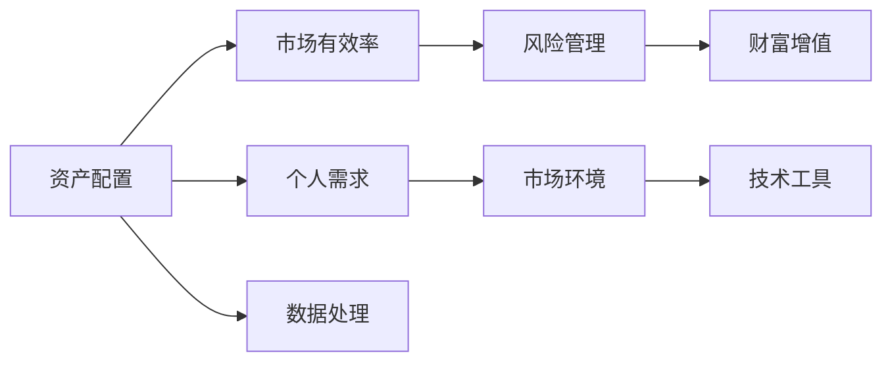

                 

# 投资理财：程序员的第二技能

## 1. 背景介绍

在数字化、信息化的浪潮中，程序员已经从单纯的代码编写者转变为拥有广泛技术视野、数据分析能力、业务认知的复合型人才。而投资理财作为一门跨学科的知识，不仅能够帮助程序员实现财富增值，还能够增强其整体素质和决策能力。本文旨在为程序员提供一种系统的投资理财知识框架，结合编程技能，实现个人财富的有效管理和增值。

### 1.1 问题的由来

随着科技的进步，程序员群体的收入水平和生活方式发生了显著变化。程序员普遍具备较高的教育背景，技术能力强，但大多数人在财富管理和投资理财方面缺乏系统的知识和经验。同时，随着房价、物价、股市等市场波动，财富贬值的风险逐渐增加。因此，投资理财成为了程序员在职业生涯中一个重要的议题。

### 1.2 问题核心关键点

程序员在投资理财中面临的主要挑战包括：
- **知识储备不足**：尽管程序员具备技术能力，但在投资理财知识上仍缺乏系统训练。
- **数据处理能力**：理财投资中涉及大量数据，需要高效的算法和工具进行处理。
- **风险管理**：需要根据自身的风险承受能力制定合适的投资策略。
- **市场环境变化**：需要不断学习和适应快速变化的市场环境。

## 2. 核心概念与联系

### 2.1 核心概念概述

投资理财的核心概念主要包括：
- **资产配置**：根据个人的风险承受能力和收益预期，合理分配股票、债券、基金等资产。
- **市场有效率**：通过分析市场数据，预测未来市场趋势，调整投资策略。
- **风险管理**：识别和管理投资组合中的风险，包括系统性风险和个体风险。
- **财富增值**：通过科学的投资手段，实现资产的增值和收益的最大化。

这些概念之间相互关联，形成一个系统的投资理财框架。资产配置决定了投资组合的风险和收益特征，市场有效率指导着投资决策，风险管理保障投资安全，而财富增值则是整个投资理财过程的目标。

### 2.2 核心概念原理和架构的 Mermaid 流程图



这个流程图展示了核心概念之间的逻辑关系：
- 根据个人需求（E）和市场环境（F）进行资产配置（A）。
- 利用市场有效率（B）进行投资决策。
- 通过风险管理（C）保证投资安全。
- 最终实现财富增值（D）。
- 整个流程使用技术工具（G）和数据处理（H）进行支持。

## 3. 核心算法原理 & 具体操作步骤

### 3.1 算法原理概述

投资理财的算法原理主要包括以下几个方面：
- **统计分析**：利用历史数据进行统计分析，预测市场趋势。
- **机器学习**：构建模型预测股票、基金等的表现，并进行优化配置。
- **量化交易**：通过计算机算法进行高频交易，实现套利策略。
- **风险管理**：运用统计和算法技术，识别和管理风险。

### 3.2 算法步骤详解

**步骤 1: 数据采集与预处理**

1. 收集市场数据，包括股票价格、基金回报、利率、宏观经济指标等。
2. 数据清洗：去除缺失值和异常值，标准化数据格式。
3. 数据划分：将数据集划分为训练集、验证集和测试集。

**步骤 2: 模型训练与验证**

1. 选择合适的模型，如线性回归、随机森林、支持向量机等。
2. 使用训练集进行模型训练。
3. 在验证集上进行模型验证，调整超参数，如正则化系数、学习率等。
4. 保存最优模型参数。

**步骤 3: 投资组合优化**

1. 根据优化目标，选择适合的优化算法，如遗传算法、粒子群算法等。
2. 定义优化目标函数，如最大化预期收益，最小化风险。
3. 进行投资组合的优化，生成多种资产配置方案。

**步骤 4: 风险评估与管理**

1. 使用VaR、CVaR等风险度量方法评估投资组合的风险。
2. 识别高风险资产，并进行调整。
3. 定期监测和调整投资组合。

**步骤 5: 财富增值**

1. 根据优化后的投资组合进行投资。
2. 定期跟踪和评估投资表现。
3. 根据市场环境调整投资策略。

### 3.3 算法优缺点

**优点**：
- **高效**：利用算法可以自动化处理大量数据，提高投资决策的效率。
- **系统性**：算法分析提供了一套系统的决策框架，减少主观偏见。
- **动态调整**：可以根据市场变化动态调整投资策略。

**缺点**：
- **模型假设**：模型的假设可能与实际情况不符，导致预测偏差。
- **复杂性**：模型设计复杂，需要专业知识。
- **过拟合风险**：模型可能过拟合历史数据，导致未来表现不佳。

### 3.4 算法应用领域

投资理财算法广泛应用于以下几个领域：
- **量化投资**：高频交易、股票分析、基金管理等。
- **风险管理**：金融衍生品定价、信用风险评估等。
- **资产配置**：大宗商品投资、房地产投资等。
- **财富管理**：智能投顾、私人财富管理等。

## 4. 数学模型和公式 & 详细讲解 & 举例说明

### 4.1 数学模型构建

投资理财的数学模型主要分为两大类：
- **线性模型**：包括线性回归、线性规划等，用于描述资产价格和收益的关系。
- **非线性模型**：包括随机过程、神经网络等，用于更复杂的金融时间序列分析。

### 4.2 公式推导过程

以线性回归模型为例，其基本形式为：
$$
y = \beta_0 + \beta_1x_1 + \cdots + \beta_nx_n + \epsilon
$$

其中，$y$ 为目标变量（如股票价格），$x_i$ 为自变量（如历史价格），$\beta_i$ 为系数，$\epsilon$ 为误差项。通过最小二乘法求解 $\beta_i$ 值。

**推导过程**：
1. 将模型改写为矩阵形式：
$$
\mathbf{y} = \mathbf{X}\mathbf{\beta} + \mathbf{\epsilon}
$$
其中 $\mathbf{y}$ 为 $n \times 1$ 的向量，$\mathbf{X}$ 为 $n \times k$ 的矩阵，$\mathbf{\beta}$ 为 $k \times 1$ 的向量，$\mathbf{\epsilon}$ 为 $n \times 1$ 的向量。
2. 最小二乘法的目标函数为：
$$
\min_{\beta} ||\mathbf{y} - \mathbf{X}\mathbf{\beta}||^2
$$
3. 对目标函数求导并令导数为0，求解 $\beta_i$：
$$
\mathbf{X}^T\mathbf{X}\mathbf{\beta} = \mathbf{X}^T\mathbf{y}
$$
$$
\mathbf{\beta} = (\mathbf{X}^T\mathbf{X})^{-1}\mathbf{X}^T\mathbf{y}
$$

### 4.3 案例分析与讲解

假设我们想预测某股票的价格，已知其前 $k$ 天价格 $P_1, P_2, \ldots, P_k$，并获取其前 $k$ 天的交易量 $V_1, V_2, \ldots, V_k$。使用线性回归模型，构建如下模型：
$$
P_{k+1} = \beta_0 + \beta_1P_k + \beta_2V_k + \epsilon
$$

利用历史数据 $(x_i, y_i)$ 进行最小二乘法求解 $\beta_0, \beta_1, \beta_2$，即可得到未来价格 $P_{k+1}$ 的预测值。

## 5. 项目实践：代码实例和详细解释说明

### 5.1 开发环境搭建

1. **安装 Python 环境**：
   - 安装 Anaconda，创建虚拟环境。
   - 安装必要的 Python 包，如 NumPy、Pandas、Scikit-learn 等。
   
   ```bash
   conda create -n finance_env python=3.8
   conda activate finance_env
   pip install numpy pandas scikit-learn
   ```

2. **安装 PyTorch 和 Transformers 库**：
   - 用于处理金融时间序列数据和构建神经网络模型。
   - 安装 HuggingFace 的 Transformers 库，方便使用预训练模型。

   ```bash
   pip install torch transformers
   ```

### 5.2 源代码详细实现

**投资组合优化**

```python
import numpy as np
from scipy.optimize import minimize

def portfolio_optimization(rets, covs, risk_free_rate, num_periods, num_assets):
    n = num_periods * num_assets
    m = num_periods
    x0 = np.zeros(n)
    bnds = [(0, 1) for i in range(n)]
    cons = ({'type': 'eq', 'fun': lambda x: np.sum(x) - 1})
    res = minimize(lambda x: -np.dot(np.dot(x, covs), x) + np.dot(rets, x) + risk_free_rate * np.sum(x),
                   x0,
                   method='SLSQP',
                   bounds=bnds,
                   constraints=cons)
    return res.x

# 示例数据
rets = np.array([[0.02, 0.03, 0.01],
                [0.01, 0.02, 0.02],
                [0.03, 0.01, 0.02]])
covs = np.array([[0.0015, 0.0012, 0.0009],
                 [0.0012, 0.0018, 0.0011],
                 [0.0009, 0.0011, 0.0017]])
risk_free_rate = 0.01
num_periods = 3
num_assets = 3

optimal_weights = portfolio_optimization(rets, covs, risk_free_rate, num_periods, num_assets)
print(optimal_weights)
```

**量化投资**

```python
import pandas as pd
import numpy as np
import yfinance as yf
from backtrader import CandleStick, Backtesting, Visualizer
from backtrading import iPair

# 获取股票数据
ticker = 'AAPL'
start = '2020-01-01'
end = '2020-12-31'
data = yf.download(ticker, start=start, end=end, progress=False)

# 计算技术指标
data['RSI'] = compute_RSI(data['Close'], 14)

# 构建交易策略
class SimpleRSIStrategy(CandleStick):
    def next(self):
        if self.data.RSI[0] > 70 and self.data.RSI[1] > 60:
            self.buy()

# 回测模拟
cerebro = Backtesting(single=SimpleRSIStrategy)
cerebro.adddata(data)
cerebro.run()

# 输出结果
visualizer = Visualizer(cerebro)
visualizer.plot()
```

### 5.3 代码解读与分析

**资产配置与优化**

- **numpy**：用于高效处理数组和矩阵运算。
- **scipy.optimize**：提供了多种优化算法，如最小二乘法、梯度下降等，用于求解资产配置问题。

**量化投资**

- **yfinance**：用于获取金融市场数据。
- **backtrader**：一个用于金融市场策略测试和回测的开源库，支持多种技术指标和交易策略。

## 6. 实际应用场景

### 6.1 智能投顾

智能投顾系统结合了算法和金融知识，能够根据用户的风险偏好和收益目标，自动生成投资组合建议。这些系统通常基于量化模型和机器学习算法，利用历史数据进行风险评估和优化配置，并提供实时市场行情和个性化建议。

### 6.2 风险管理

风险管理技术在金融市场中有广泛应用，如计算VaR（Value at Risk）和CVaR（Conditional Value at Risk）等指标，评估投资组合的风险暴露。通过算法识别市场风险和个体风险，制定相应的应对策略，如避险对冲、分散投资等。

### 6.3 量化交易

量化交易通过算法进行高频交易，实现套利策略。例如，基于历史价格和交易量构建机器学习模型，预测市场趋势，自动下达交易指令，实现自动化的投资管理。

## 7. 工具和资源推荐

### 7.1 学习资源推荐

1. **《投资理财入门》**：系统介绍投资理财的基础知识和常见工具，适合零基础读者。
2. **《Python for Finance》**：详细讲解Python在金融分析中的应用，包括数据处理、统计分析、算法优化等。
3. **《量化交易算法》**：介绍量化交易的算法和策略，涵盖多种技术指标和交易模型。

### 7.2 开发工具推荐

1. **Jupyter Notebook**：用于编写和运行Python代码，支持数据可视化、交互式编程和代码分享。
2. **GitHub**：提供代码托管和协作平台，方便团队管理和版本控制。
3. **Google Colab**：在线Jupyter Notebook环境，免费提供GPU资源，便于快速实验和测试。

### 7.3 相关论文推荐

1. **《用线性回归预测股票价格》**：介绍如何使用线性回归模型进行股票价格预测。
2. **《投资组合优化理论》**：系统讲解投资组合的优化方法和技术。
3. **《量化交易中的机器学习算法》**：分析量化交易中常用的机器学习算法及其应用。

## 8. 总结：未来发展趋势与挑战

### 8.1 研究成果总结

本文对投资理财中的核心概念和算法进行了系统介绍，通过实际案例展示了投资理财的编程实践。投资理财作为程序员的第二技能，结合了金融知识和编程能力，有助于提升个人财务管理水平和决策能力。

### 8.2 未来发展趋势

1. **人工智能与金融结合**：未来人工智能技术将与金融市场深度融合，提升投资决策的精准度和自动化水平。
2. **大数据与量化投资**：利用大数据分析优化交易策略，实现个性化和动态调整。
3. **多模态金融分析**：结合自然语言处理、图像识别等技术，进行更全面的市场分析。
4. **区块链与智能合约**：利用区块链技术实现更透明、安全的金融交易和投资管理。

### 8.3 面临的挑战

1. **数据隐私和安全**：投资理财中涉及大量敏感数据，需要采取有效措施保护隐私和安全。
2. **算法复杂性**：复杂算法模型的设计和优化需要专业知识，且容易过拟合。
3. **市场波动风险**：金融市场的不确定性，对投资策略的稳定性和鲁棒性提出了更高要求。
4. **法律法规**：金融市场涉及复杂的法律法规，投资理财需要遵守相关规定。

### 8.4 研究展望

1. **自动化投资管理**：未来将发展更多自动化和智能化的投资管理工具，提升投资效率。
2. **跨学科融合**：投资理财需要多学科知识的融合，未来将更多结合计算机科学、数学和金融学的最新进展。
3. **可解释性增强**：提升投资理财算法的可解释性，帮助用户理解模型决策过程。
4. **监管与合规**：建立健全的金融监管机制，保障市场的公平性和透明度。

## 9. 附录：常见问题与解答

### Q1: 程序员在投资理财中应该重点关注哪些方面？

A: 程序员在投资理财中应重点关注以下方面：
- **基础知识**：学习投资理财的基本概念和方法，如资产配置、风险管理等。
- **数据分析**：掌握数据分析工具和技术，如Python、SQL、Pandas等。
- **算法设计**：理解量化交易和风险管理的算法原理，设计并实现相应的模型。
- **实践经验**：通过实际投资操作，积累经验和调整策略。

### Q2: 如何评估一个量化交易策略的有效性？

A: 量化交易策略的有效性评估主要包括以下几个方面：
- **回测**：通过历史数据模拟交易策略的表现，评估其盈亏情况。
- **风险度量**：计算VaR、CVaR等风险指标，评估策略的风险承受能力。
- **模拟交易**：在实际市场中进行小规模的模拟交易，测试策略的实际表现。
- **多策略比较**：对比不同策略的表现，选择最优策略。

### Q3: 如何选择适合的投资组合？

A: 选择适合的投资组合需考虑以下几个因素：
- **风险承受能力**：根据自己的风险偏好，选择适合的资产配置。
- **收益预期**：设定合理的收益目标，评估不同组合的预期收益。
- **市场环境**：结合市场趋势和投资环境，调整投资策略。
- **历史数据**：利用历史数据进行风险评估和配置优化。

### Q4: 如何在投资理财中应用机器学习？

A: 在投资理财中应用机器学习的方法包括：
- **数据预处理**：清洗和标准化数据，使用机器学习模型进行预测和分类。
- **特征工程**：设计有效的特征，提高模型的预测精度。
- **模型选择**：选择适合的机器学习算法，如线性回归、随机森林等。
- **模型评估**：使用交叉验证等方法评估模型性能，选择最优模型。

### Q5: 投资理财中的量化交易和智能投顾有什么区别？

A: 量化交易和智能投顾的区别主要在于：
- **交易策略**：量化交易是基于算法的高频交易，智能投顾则侧重于长期投资策略。
- **算法复杂度**：量化交易的算法较为复杂，需要处理高频数据和实时计算，而智能投顾算法相对简单，侧重于综合分析和决策。
- **用户交互**：量化交易更注重算法和策略，智能投顾则更注重用户体验和交互设计。

---

作者：禅与计算机程序设计艺术 / Zen and the Art of Computer Programming

