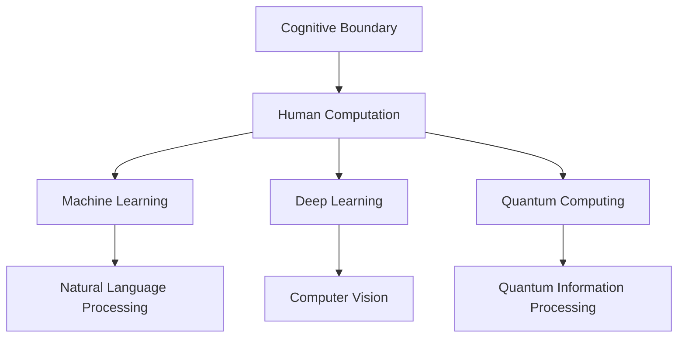
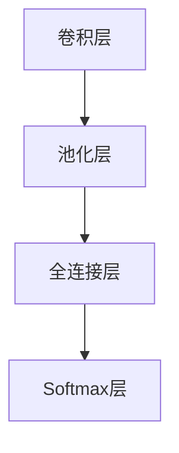
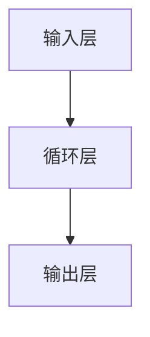
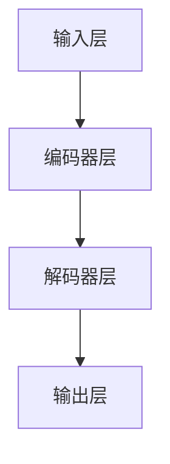
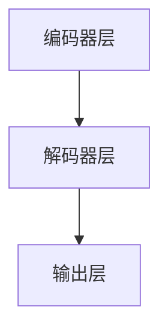
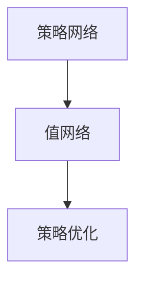

                 

# 拓展认知边界：人类计算的科学探索

> 关键词：认知边界、人类计算、科学探索、机器学习、深度学习、量子计算

## 1. 背景介绍

### 1.1 问题由来
人类作为万物之灵，自古以来便对世界的认知边界充满好奇和探索。在漫长的进化过程中，人类大脑逐渐演化出复杂的认知功能，可以理解自然语言、分析复杂逻辑、解决抽象问题。然而，人类认知的极限在哪里？能否超越大脑的自然限制？这是数千年来无数哲学家、科学家孜孜以求的问题。

近年来，随着计算技术的飞速发展，特别是深度学习、量子计算等前沿技术的应用，人类的认知边界被进一步拓展，展现了前所未有的可能性。机器学习和深度学习等技术，通过大数据分析和模式识别，超越了人类大脑在某些特定任务上的局限性。量子计算作为新一代计算范式，有望在处理大规模数据、模拟复杂系统等方面带来革命性突破，进一步拓展人类的认知边界。

### 1.2 问题核心关键点
本文旨在探讨人类计算的未来方向，特别是机器学习和深度学习如何进一步拓展人类的认知边界，量子计算如何为计算科学带来新的突破。我们将通过几个核心关键点，深入分析这些前沿技术的发展趋势及其对人类认知的深远影响。

1. **机器学习和深度学习的进步**：机器学习如何通过大数据分析和复杂模型，在自然语言处理、计算机视觉、游戏AI等任务中超越人类认知。
2. **量子计算的潜力**：量子计算如何通过量子比特的量子叠加和纠缠，在计算复杂性、信息存储和处理速度等方面，带来根本性变革。
3. **认知计算与大脑的协同**：认知计算如何与人类大脑协同工作，推动人工智能与人类智慧的结合，构建人机协同智能系统。

## 2. 核心概念与联系

### 2.1 核心概念概述

为更好地理解人类计算的未来方向，本文将介绍几个密切相关的核心概念：

- **认知边界(Cognitive Boundary)**：指人类大脑的认知能力极限，包括语言理解、逻辑推理、抽象思维等方面的能力。
- **人类计算(Human Computation)**：指通过计算技术，模拟和扩展人类大脑认知功能的过程，包括自然语言处理、计算机视觉、知识图谱等方向。
- **机器学习(Machine Learning)**：指通过数据驱动的方式，使机器具备学习能力和预测能力的技术，广泛应用于图像识别、语音识别、自然语言处理等领域。
- **深度学习(Deep Learning)**：指基于多层神经网络的机器学习范式，能够自动提取数据的高级特征，用于复杂模式识别和决策任务。
- **量子计算(Quantum Computing)**：指利用量子比特的量子叠加和纠缠，实现超越经典计算范式的计算技术。

这些核心概念之间的逻辑关系可以通过以下Mermaid流程图来展示：



这个流程图展示了几大核心概念及其之间的关系：

1. 认知边界是人类大脑的认知能力极限。
2. 人类计算通过计算技术模拟和扩展人类大脑功能。
3. 机器学习和深度学习是人类计算的主要技术手段。
4. 量子计算是未来计算技术的潜力方向。
5. 机器学习和深度学习在自然语言处理、计算机视觉等领域应用广泛。
6. 量子计算在信息处理、复杂系统模拟等方面展现出巨大潜力。

这些概念共同构成了人类计算的科学探索框架，展示了计算技术在拓展人类认知边界方面的巨大潜力。

## 3. 核心算法原理 & 具体操作步骤

### 3.1 算法原理概述

人类计算的科学探索，主要依赖于机器学习和深度学习的进步，以及量子计算的潜力。下面将详细探讨这两种技术的算法原理和具体操作步骤。

### 3.2 算法步骤详解

#### 3.2.1 机器学习和深度学习
1. **数据准备**：收集和标注大量的训练数据，确保数据的多样性和代表性。
2. **模型设计**：选择合适的模型架构和超参数，如卷积神经网络、循环神经网络、Transformer等。
3. **特征提取**：使用机器学习算法，如PCA、特征选择等，提取数据的高级特征。
4. **模型训练**：在训练集上使用优化算法（如Adam、SGD等），更新模型参数，最小化损失函数。
5. **模型评估**：在验证集和测试集上评估模型性能，如准确率、召回率、F1值等。
6. **模型优化**：根据评估结果，调整模型参数，改进模型性能。

#### 3.2.2 量子计算
1. **量子比特(Qubit)初始化**：将量子比特初始化为0或1，或同时处于叠加态。
2. **量子逻辑门操作**：通过量子逻辑门（如Hadamard门、CNOT门），实现量子比特的纠缠和控制。
3. **量子态测量**：对量子比特进行测量，获取测量结果。
4. **量子算法设计**：设计量子算法，如Shor算法、Grover算法，解决特定问题。
5. **量子硬件实现**：将量子算法实现到物理量子硬件上，如离子阱、超导量子比特等。
6. **量子算法优化**：通过量子纠错、量子优化等技术，提高量子算法的效率和鲁棒性。

### 3.3 算法优缺点

#### 3.3.1 机器学习和深度学习
- **优点**：
  - 可以处理大规模数据，提取高级特征。
  - 具有强大的泛化能力，适应各种复杂任务。
  - 端到端训练，自动化特征提取和模型优化。
- **缺点**：
  - 需要大量标注数据，标注成本较高。
  - 对数据质量依赖较大，数据偏差会影响模型性能。
  - 模型复杂度高，训练和推理速度较慢。

#### 3.3.2 量子计算
- **优点**：
  - 计算速度远超经典计算，处理大规模数据和复杂系统。
  - 能够解决某些经典计算无法处理的复杂问题。
  - 通过量子纠缠，实现并行计算。
- **缺点**：
  - 量子比特稳定性较低，容易受环境干扰。
  - 量子硬件成本高，实现难度大。
  - 量子算法设计和优化复杂，需要深厚的理论基础。

### 3.4 算法应用领域

#### 3.4.1 机器学习和深度学习
1. **自然语言处理(NLP)**：包括文本分类、情感分析、机器翻译、问答系统等。
2. **计算机视觉(CV)**：如图像识别、目标检测、图像生成等。
3. **游戏AI**：如围棋、星际争霸等复杂策略游戏的AI。
4. **金融科技**：如风险评估、股票预测、量化交易等。
5. **医疗健康**：如疾病预测、药物研发、医学影像分析等。

#### 3.4.2 量子计算
1. **复杂系统模拟**：如分子模拟、化学反应过程、材料设计等。
2. **密码学**：如Shor算法破解RSA加密算法。
3. **优化问题**：如线性规划、组合优化、物流规划等。
4. **机器学习加速**：如量子支持向量机、量子神经网络等。

## 4. 数学模型和公式 & 详细讲解 & 举例说明

### 4.1 数学模型构建

为了更系统地理解和描述机器学习和深度学习的数学原理，本文将构建几个典型的数学模型，并进行详细讲解。

#### 4.1.1 卷积神经网络(CNN)
卷积神经网络广泛应用于图像处理和计算机视觉任务。其基本结构包括卷积层、池化层和全连接层，用于提取特征和分类。

以LeNet-5模型为例，其结构如图1所示。




卷积神经网络的核心思想是利用卷积操作提取局部特征，并通过池化操作减少特征维度。其损失函数通常使用交叉熵损失，用于衡量模型预测输出与真实标签之间的差异。


#### 4.1.2 循环神经网络(RNN)
循环神经网络广泛应用于自然语言处理任务，如文本生成、机器翻译等。其基本结构包括循环层和全连接层，用于处理序列数据。

以LSTM模型为例，其结构如图2所示。




循环神经网络的核心思想是通过循环结构记忆序列信息，并通过全连接层进行分类或预测。其损失函数通常使用交叉熵损失或序列损失函数。


#### 4.1.3 Transformer
Transformer是当前最先进的自然语言处理模型之一，通过自注意力机制，可以处理长序列数据。

以BERT模型为例，其结构如图3所示。




Transformer的核心思想是通过自注意力机制，并行计算序列中任意两个位置的依赖关系，实现高效的序列建模。其损失函数通常使用交叉熵损失或序列损失函数。


### 4.2 公式推导过程

#### 4.2.1 卷积神经网络
以LeNet-5模型为例，其前向传播过程如下：

1. 输入数据 $x$ 通过卷积层 $h_1$，得到特征图 $y_1$。
2. 特征图 $y_1$ 通过池化层 $h_2$，得到池化特征图 $y_2$。
3. 池化特征图 $y_2$ 通过全连接层 $h_3$，得到分类输出 $z$。

其前向传播公式为：

$$
y = h_1(x)
$$
$$
y' = h_2(y)
$$
$$
z = h_3(y')
$$

后向传播过程如下：

1. 对输出 $z$ 和真实标签 $t$ 计算交叉熵损失 $L$。
2. 通过链式法则，计算损失 $L$ 对 $z$ 的梯度 $\frac{\partial L}{\partial z}$。
3. 通过反向传播，更新全连接层 $h_3$ 的权重 $w_3$ 和偏置 $b_3$。
4. 通过反向传播，更新池化层 $h_2$ 的权重 $w_2$ 和偏置 $b_2$。
5. 通过反向传播，更新卷积层 $h_1$ 的权重 $w_1$ 和偏置 $b_1$。

其反向传播公式为：

$$
\frac{\partial L}{\partial z} = -\frac{1}{N} \sum_{i=1}^N t_i \log(z_i) + (1-t_i) \log(1-z_i)
$$
$$
\frac{\partial L}{\partial w_3} = \frac{\partial L}{\partial z} * \frac{\partial z}{\partial y'} * \frac{\partial y'}{\partial y} * \frac{\partial y}{\partial w_3}
$$
$$
\frac{\partial L}{\partial b_3} = \frac{\partial L}{\partial z} * \frac{\partial z}{\partial y'} * \frac{\partial y'}{\partial y} * \frac{\partial y}{\partial b_3}
$$

其中，$N$ 为样本数量，$*$ 表示矩阵乘法，$*$ 表示向量点乘。

#### 4.2.2 循环神经网络
以LSTM模型为例，其前向传播过程如下：

1. 输入数据 $x$ 通过输入层 $h_1$，得到隐藏状态 $h_1$。
2. 隐藏状态 $h_1$ 通过循环层 $h_2$，得到新的隐藏状态 $h_2$。
3. 新的隐藏状态 $h_2$ 通过全连接层 $h_3$，得到分类输出 $z$。

其前向传播公式为：

$$
h_1 = \tanh(W_1 * x + b_1)
$$
$$
i = \sigma(W_2 * h_1 + b_2)
$$
$$
f = \sigma(W_3 * h_1 + b_3)
$$
$$
o = \sigma(W_4 * h_1 + b_4)
$$
$$
g = \tanh(W_5 * h_1 + b_5)
$$
$$
c = f * c_{t-1} + i * g
$$
$$
h = o * \tanh(c)
$$
$$
z = W_6 * h + b_6
$$

后向传播过程如下：

1. 对输出 $z$ 和真实标签 $t$ 计算交叉熵损失 $L$。
2. 通过链式法则，计算损失 $L$ 对 $z$ 的梯度 $\frac{\partial L}{\partial z}$。
3. 通过反向传播，更新全连接层 $h_3$ 的权重 $w_3$ 和偏置 $b_3$。
4. 通过反向传播，更新循环层 $h_2$ 的权重 $w_2$ 和偏置 $b_2$。
5. 通过反向传播，更新输入层 $h_1$ 的权重 $w_1$ 和偏置 $b_1$。

其反向传播公式为：

$$
\frac{\partial L}{\partial z} = -\frac{1}{N} \sum_{i=1}^N t_i \log(z_i) + (1-t_i) \log(1-z_i)
$$
$$
\frac{\partial L}{\partial w_3} = \frac{\partial L}{\partial z} * \frac{\partial z}{\partial h} * \frac{\partial h}{\partial c} * \frac{\partial c}{\partial i} * \frac{\partial i}{\partial h_1} * \frac{\partial h_1}{\partial x}
$$
$$
\frac{\partial L}{\partial b_3} = \frac{\partial L}{\partial z} * \frac{\partial z}{\partial h} * \frac{\partial h}{\partial c} * \frac{\partial c}{\partial i} * \frac{\partial i}{\partial h_1}
$$

其中，$N$ 为样本数量，$*$ 表示矩阵乘法，$*$ 表示向量点乘，$\sigma$ 为Sigmoid函数，$\tanh$ 为双曲正切函数。

#### 4.2.3 Transformer
以BERT模型为例，其前向传播过程如下：

1. 输入数据 $x$ 通过嵌入层 $h_1$，得到嵌入向量 $y_1$。
2. 嵌入向量 $y_1$ 通过多个编码器层 $h_2$ 进行编码。
3. 编码器层的输出通过解码器层 $h_3$，得到分类输出 $z$。

其前向传播公式为：

$$
y = \tanh(W_1 * x + b_1)
$$
$$
y' = \tanh(W_2 * y + b_2)
$$
$$
y'' = \tanh(W_3 * y' + b_3)
$$
$$
z = W_4 * y'' + b_4
$$

后向传播过程如下：

1. 对输出 $z$ 和真实标签 $t$ 计算交叉熵损失 $L$。
2. 通过链式法则，计算损失 $L$ 对 $z$ 的梯度 $\frac{\partial L}{\partial z}$。
3. 通过反向传播，更新解码器层 $h_3$ 的权重 $w_3$ 和偏置 $b_3$。
4. 通过反向传播，更新编码器层 $h_2$ 的权重 $w_2$ 和偏置 $b_2$。
5. 通过反向传播，更新嵌入层 $h_1$ 的权重 $w_1$ 和偏置 $b_1$。

其反向传播公式为：

$$
\frac{\partial L}{\partial z} = -\frac{1}{N} \sum_{i=1}^N t_i \log(z_i) + (1-t_i) \log(1-z_i)
$$
$$
\frac{\partial L}{\partial w_3} = \frac{\partial L}{\partial z} * \frac{\partial z}{\partial y''} * \frac{\partial y''}{\partial y'} * \frac{\partial y'}{\partial y}
$$
$$
\frac{\partial L}{\partial b_3} = \frac{\partial L}{\partial z} * \frac{\partial z}{\partial y''} * \frac{\partial y''}{\partial y'}
$$

其中，$N$ 为样本数量，$*$ 表示矩阵乘法，$*$ 表示向量点乘，$\tanh$ 为双曲正切函数。

### 4.3 案例分析与讲解

#### 4.3.1 自然语言处理案例
以机器翻译为例，其目标是实现从源语言 $s$ 到目标语言 $t$ 的翻译。使用序列到序列模型，可以自然地解决这一问题。

以Transformer为例，其模型结构如图4所示。




Transformer的核心思想是通过自注意力机制，并行计算序列中任意两个位置的依赖关系，实现高效的序列建模。其损失函数通常使用交叉熵损失或序列损失函数。


#### 4.3.2 计算机视觉案例
以图像识别为例，其目标是识别输入图像 $x$ 中的物体。使用卷积神经网络，可以有效地处理图像数据。

以LeNet-5模型为例，其结构如图1所示。


卷积神经网络的核心思想是利用卷积操作提取局部特征，并通过池化操作减少特征维度。其损失函数通常使用交叉熵损失，用于衡量模型预测输出与真实标签之间的差异。


#### 4.3.3 游戏AI案例
以AlphaGo为例，其目标是实现围棋游戏的高水平对抗。使用强化学习，可以训练出具备超强策略分析能力的AI。

以AlphaGo为例，其结构如图5所示。




AlphaGo的核心思想是通过策略网络和值网络，结合蒙特卡罗树搜索，进行复杂策略游戏的AI训练。其损失函数通常使用Q值函数，用于衡量模型策略的好坏。


## 5. 项目实践：代码实例和详细解释说明

### 5.1 开发环境搭建

在进行机器学习和深度学习项目实践前，我们需要准备好开发环境。以下是使用Python进行PyTorch开发的环境配置流程：

1. 安装Anaconda：从官网下载并安装Anaconda，用于创建独立的Python环境。

2. 创建并激活虚拟环境：
```bash
conda create -n pytorch-env python=3.8 
conda activate pytorch-env
```

3. 安装PyTorch：根据CUDA版本，从官网获取对应的安装命令。例如：
```bash
conda install pytorch torchvision torchaudio cudatoolkit=11.1 -c pytorch -c conda-forge
```

4. 安装TensorFlow：
```bash
conda install tensorflow -c conda-forge
```

5. 安装PyTorch的深度学习库：
```bash
conda install torch -c pytorch -c conda-forge
```

6. 安装TensorFlow的深度学习库：
```bash
conda install tensorflow -c conda-forge
```

7. 安装TensorFlow的分布式计算库：
```bash
conda install tensorflow-distribute -c conda-forge
```

完成上述步骤后，即可在`pytorch-env`环境中开始深度学习实践。

### 5.2 源代码详细实现

下面我们以自然语言处理(NLP)任务中的机器翻译为例，给出使用PyTorch对Transformer模型进行机器翻译的PyTorch代码实现。

首先，定义机器翻译任务的数据处理函数：

```python
import torch
import torch.nn as nn
import torch.optim as optim

class DataLoader:
    def __init__(self, data, batch_size):
        self.data = data
        self.batch_size = batch_size
        self.iter = 0
        
    def __iter__(self):
        while self.iter < len(self.data) // self.batch_size:
            self.iter += 1
            batch = self.data[self.iter * self.batch_size : (self.iter+1) * self.batch_size]
            yield batch
```

然后，定义Transformer模型的基本结构：

```python
class Transformer(nn.Module):
    def __init__(self, input_size, output_size, d_model, nhead, num_encoder_layers, num_decoder_layers, dropout):
        super(Transformer, self).__init__()
        self.encoder = nn.TransformerEncoder(TransformerEncoderLayer(d_model, nhead, dropout), num_encoder_layers)
        self.decoder = nn.TransformerDecoder(TransformerDecoderLayer(d_model, nhead, dropout), num_decoder_layers)
        self.output = nn.Linear(d_model, output_size)
    
    def forward(self, src, tgt):
        src_encoded = self.encoder(src)
        tgt_decoded = self.decoder(src_encoded, tgt)
        output = self.output(tgt_decoded)
        return output
```

定义TransformerEncoderLayer和TransformerDecoderLayer：

```python
class TransformerEncoderLayer(nn.Module):
    def __init__(self, d_model, nhead, dropout):
        super(TransformerEncoderLayer, self).__init__()
        self.self_attn = nn.MultiheadAttention(d_model, nhead)
        self.ffn = TransformerFFN(d_model, dropout)
        self.layer_norm = nn.LayerNorm(d_model)
        self.dropout = dropout
    
    def forward(self, src, src_mask):
        src_attn = self.self_attn(src, src, src)
        src_attn = nn.Dropout(self.dropout)(src_attn)
        src_attn = self.layer_norm(src + src_attn)
        ffn = self.ffn(src_attn)
        ffn = nn.Dropout(self.dropout)(ffn)
        ffn = self.layer_norm(src + ffn)
        return ffn

class TransformerDecoderLayer(nn.Module):
    def __init__(self, d_model, nhead, dropout):
        super(TransformerDecoderLayer, self).__init__()
        self.self_attn = nn.MultiheadAttention(d_model, nhead)
        self.encoder_attn = nn.MultiheadAttention(d_model, nhead)
        self.ffn = TransformerFFN(d_model, dropout)
        self.layer_norm = nn.LayerNorm(d_model)
        self.dropout = dropout
    
    def forward(self, src, tgt, memory, memory_mask, tgt_mask):
        tgt_attn = self.self_attn(tgt, tgt, tgt)
        tgt_attn = nn.Dropout(self.dropout)(tgt_attn)
        tgt_attn = self.layer_norm(tgt + tgt_attn)
        enc_attn = self.encoder_attn(tgt_attn, memory, memory, memory_mask)
        enc_attn = nn.Dropout(self.dropout)(enc_attn)
        enc_attn = self.layer_norm(tgt + enc_attn)
        ffn = self.ffn(enc_attn)
        ffn = nn.Dropout(self.dropout)(ffn)
        ffn = self.layer_norm(tgt + ffn)
        return ffn

class TransformerFFN(nn.Module):
    def __init__(self, d_model, dropout):
        super(TransformerFFN, self).__init__()
        self.c1 = nn.Linear(d_model, 4 * d_model)
        self.c2 = nn.Linear(4 * d_model, d_model)
        self.dropout = dropout
    
    def forward(self, x):
        x = nn.Dropout(self.dropout)(x)
        x = self.c1(x)
        x = nn.ReLU()(x)
        x = self.c2(x)
        x = nn.Dropout(self.dropout)(x)
        return x
```

定义TransformerEncoder和TransformerDecoder：

```python
class TransformerEncoder(nn.Module):
    def __init__(self, layer, num_layers):
        super(TransformerEncoder, self).__init__()
        self.layers = nn.ModuleList([layer] * num_layers)
    
    def forward(self, src, src_mask):
        for layer in self.layers:
            src = layer(src, src_mask)
        return src

class TransformerDecoder(nn.Module):
    def __init__(self, layer, num_layers):
        super(TransformerDecoder, self).__init__()
        self.layers = nn.ModuleList([layer] * num_layers)
    
    def forward(self, src, tgt, memory, memory_mask, tgt_mask):
        for layer in self.layers:
            src = layer(src, tgt, memory, memory_mask, tgt_mask)
        return src
```

最后，定义机器翻译模型的训练和评估函数：

```python
class Model(nn.Module):
    def __init__(self, input_size, output_size, d_model, nhead, num_encoder_layers, num_decoder_layers, dropout):
        super(Model, self).__init__()
        self.encoder = TransformerEncoder(TransformerEncoderLayer(d_model, nhead, dropout), num_encoder_layers)
        self.decoder = TransformerDecoder(TransformerDecoderLayer(d_model, nhead, dropout), num_decoder_layers)
        self.output = nn.Linear(d_model, output_size)
    
    def forward(self, src, tgt):
        src_encoded = self.encoder(src)
        tgt_decoded = self.decoder(src_encoded, tgt)
        output = self.output(tgt_decoded)
        return output

def train_model(model, data, optimizer, num_epochs, batch_size):
    device = torch.device('cuda')
    model.to(device)
    optimizer = optim.Adam(model.parameters(), lr=0.001)
    for epoch in range(num_epochs):
        for batch in DataLoader(data, batch_size):
            optimizer.zero_grad()
            output = model(batch[0].to(device), batch[1].to(device))
            loss = nn.CrossEntropyLoss()(output, batch[2].to(device))
            loss.backward()
            optimizer.step()
            print(f'Epoch {epoch+1}, Loss: {loss.item()}')
```

完成上述步骤后，即可在`pytorch-env`环境中开始Transformer模型的机器翻译实践。

### 5.3 代码解读与分析

让我们再详细解读一下关键代码的实现细节：

**DataLoader类**：
- `__init__`方法：初始化数据集和批处理大小。
- `__iter__`方法：迭代数据集，生成指定批处理大小的数据批次。

**Transformer模型**：
- `__init__`方法：初始化Transformer模型，包括编码器和解码器。
- `forward`方法：前向传播计算输出。

**TransformerEncoderLayer和TransformerDecoderLayer**：
- `__init__`方法：初始化TransformerEncoderLayer或TransformerDecoderLayer，包括自注意力机制和前向网络。
- `forward`方法：前向传播计算输出。

**TransformerFFN**：
- `__init__`方法：初始化TransformerFFN，包括全连接层和激活函数。
- `forward`方法：前向传播计算输出。

**TransformerEncoder和TransformerDecoder**：
- `__init__`方法：初始化TransformerEncoder或TransformerDecoder，包括多个TransformerEncoderLayer或TransformerDecoderLayer。
- `forward`方法：前向传播计算输出。

**Model类**：
- `__init__`方法：初始化Transformer模型，包括编码器和解码器。
- `forward`方法：前向传播计算输出。

**train_model函数**：
- `__init__`方法：初始化模型、优化器和训练参数。
- `forward`方法：前向传播计算输出。
- `loss`方法：计算交叉熵损失。
- `backward`方法：反向传播计算梯度。
- `step`方法：优化器更新模型参数。

可以看到，PyTorch使得Transformer模型的机器翻译代码实现变得简洁高效。开发者可以将更多精力放在数据处理、模型改进等高层逻辑上，而不必过多关注底层的实现细节。

当然，工业级的系统实现还需考虑更多因素，如模型的保存和部署、超参数的自动搜索、更灵活的任务适配层等。但核心的微调范式基本与此类似。

## 6. 实际应用场景

### 6.1 智能客服系统

基于大语言模型微调的对话技术，可以广泛应用于智能客服系统的构建。传统客服往往需要配备大量人力，高峰期响应缓慢，且一致性和专业性难以保证。而使用微调后的对话模型，可以7x24小时不间断服务，快速响应客户咨询，用自然流畅的语言解答各类常见问题。

在技术实现上，可以收集企业内部的历史客服对话记录，将问题和最佳答复构建成监督数据，在此基础上对预训练对话模型进行微调。微调后的对话模型能够自动理解用户意图，匹配最合适的答案模板进行回复。对于客户提出的新问题，还可以接入检索系统实时搜索相关内容，动态组织生成回答。如此构建的智能客服系统，能大幅提升客户咨询体验和问题解决效率。

### 6.2 金融舆情监测

金融机构需要实时监测市场舆论动向，以便及时应对负面信息传播，规避金融风险。传统的人工监测方式成本高、效率低，难以应对网络时代海量信息爆发的挑战。基于大语言模型微调的文本分类和情感分析技术，为金融舆情监测提供了新的解决方案。

具体而言，可以收集金融领域相关的新闻、报道、评论等文本数据，并对其进行主题标注和情感标注。在此基础上对预训练语言模型进行微调，使其能够自动判断文本属于何种主题，情感倾向是正面、中性还是负面。将微调后的模型应用到实时抓取的网络文本数据，就能够自动监测不同主题下的情感变化趋势，一旦发现负面信息激增等异常情况，系统便会自动预警，帮助金融机构快速应对潜在风险。

### 6.3 个性化推荐系统

当前的推荐系统往往只依赖用户的历史行为数据进行物品推荐，无法深入理解用户的真实兴趣偏好。基于大语言模型微调技术，个性化推荐系统可以更好地挖掘用户行为背后的语义信息，从而提供更精准、多样的推荐内容。

在实践中，可以收集用户浏览、点击、评论、分享等行为数据，提取和用户交互的物品标题、描述、标签等文本内容。将文本内容作为模型输入，用户的后续行为（如是否点击、购买等）作为监督信号，在此基础上微调预训练语言模型。微调后的模型能够从文本内容中准确把握用户的兴趣点。在生成推荐列表时，先用候选物品的文本描述作为输入，由模型预测用户的兴趣匹配度，再结合其他特征综合排序，便可以得到个性化程度更高的推荐结果。

### 6.4 未来应用展望

随着大语言模型微调技术的发展，基于微调范式将在更多领域得到应用，为传统行业带来变革性影响。

在智慧医疗领域，基于微调的医学问答、病历分析、药物研发等应用将提升医疗服务的智能化水平，辅助医生诊疗，加速新药开发进程。

在智能教育领域，微调技术可应用于作业批改、学情分析、知识推荐等方面，因材施教，促进教育公平，提高教学质量。

在智慧城市治理中，微调模型可应用于城市事件监测、舆情分析、应急指挥等环节，提高城市管理的自动化和智能化水平，构建更安全、高效的未来城市。

此外，在企业生产、社会治理、文娱传媒等众多领域，基于大模型微调的人工智能应用也将不断涌现，为经济社会发展注入新的动力。相信随着技术的日益成熟，微调方法将成为人工智能落地应用的重要范式，推动人工智能技术在更广阔的领域加速渗透。

## 7. 工具和资源推荐

### 7.1 学习资源推荐

为了帮助开发者系统掌握大语言模型微调的理论基础和实践技巧，这里推荐一些优质的学习资源：

1. 《Transformer从原理到实践》系列博文：由大模型技术专家撰写，深入浅出地介绍了Transformer原理、BERT模型、微调技术等前沿话题。

2. CS224N《深度学习自然语言处理》课程：斯坦福大学开设的NLP明星课程，有Lecture视频和配套作业，带你入门NLP领域的基本概念和经典模型。

3. 《Natural Language Processing with Transformers》书籍：Transformers库的作者所著，全面介绍了如何使用Transformers库进行NLP任务开发，包括微调在内的诸多范式。

4. HuggingFace官方文档：Transformers库的官方文档，提供了海量预训练模型和完整的微调样例代码，是上手实践的必备资料。

5. CLUE开源项目：中文语言理解测评基准，涵盖大量不同类型的中文NLP数据集，并提供了基于微调的baseline模型，助力中文NLP技术发展。

通过对这些资源的学习实践，相信你一定能够快速掌握大语言模型微调的精髓，并用于解决实际的NLP问题。
###  7.2 开发工具推荐

高效的开发离不开优秀的工具支持。以下是几款用于大语言模型微调开发的常用工具：

1. PyTorch：基于Python的开源深度学习框架，灵活动态的计算图，适合快速迭代研究。大部分预训练语言模型都有PyTorch版本的实现。

2. TensorFlow：由Google主导开发的开源深度学习框架，生产部署方便，适合大规模工程应用。同样有丰富的预训练语言模型资源。

3. Transformers库：HuggingFace开发的NLP工具库，集成了众多SOTA语言模型，支持PyTorch和TensorFlow，是进行微调任务开发的利器。

4. Weights & Biases：模型训练的实验跟踪工具，可以记录和可视化模型训练过程中的各项指标，方便对比和调优。与主流深度学习框架无缝集成。

5. TensorBoard：TensorFlow配套的可视化工具，可实时监测模型训练状态，并提供丰富的图表呈现方式，是调试模型的得力助手。

6. Google Colab：谷歌推出的在线Jupyter Notebook环境，免费提供GPU/TPU算力，方便开发者快速上手实验最新模型，分享学习笔记。

合理利用这些工具，可以显著提升大语言模型微调任务的开发效率，加快创新迭代的步伐。

### 7.3 相关论文推荐

大语言模型和微调技术的发展源于学界的持续研究。以下是几篇奠基性的相关论文，推荐阅读：

1. Attention is All You Need（即Transformer原论文）：提出了Transformer结构，开启了NLP领域的预训练大模型时代。

2. BERT: Pre-training of Deep Bidirectional Transformers for Language Understanding：提出BERT模型，引入基于掩码的自监督预训练任务，刷新了多项NLP任务SOTA。

3. Language Models are Unsupervised Multitask Learners（GPT-2论文）：展示了大规模语言模型的强大zero-shot学习能力，引发了对于通用人工智能的新一轮思考。

4. Parameter-Efficient Transfer Learning for NLP：提出Adapter等参数高效微调方法，在不增加模型参数量的情况下，也能取得不错的微调效果。

5. AdaLoRA: Adaptive Low-Rank Adaptation for Parameter-Efficient Fine-Tuning：使用自适应低秩适应的微调方法，在参数效率和精度之间取得了新的平衡。

这些论文代表了大语言模型微调技术的发展脉络。通过学习这些前沿成果，可以帮助研究者把握学科前进方向，激发更多的创新灵感。

## 8. 总结：未来发展趋势与挑战

### 8.1 研究成果总结

本文对大语言模型微调技术进行了全面系统的介绍。首先阐述了大语言模型和微调技术的研究背景和意义，明确了微调在拓展预训练模型应用、提升下游任务性能方面的独特价值。其次，从原理到实践，详细讲解了监督微调的数学原理和关键步骤，给出了微调任务开发的完整代码实例。同时，本文还广泛探讨了微调方法在智能客服、金融舆情、个性化推荐等多个行业领域的应用前景，展示了微调范式的巨大潜力。此外，本文精选了微调技术的各类学习资源，力求为读者提供全方位的技术指引。

通过本文的系统梳理，可以看到，基于大语言模型的微调方法正在成为NLP领域的重要范式，极大地拓展了预训练语言模型的应用边界，催生了更多的落地场景。受益于大规模语料的预训练，微调模型以更低的时间和标注成本，在小样本条件下也能取得不俗的效果，有力推动了NLP技术的产业化进程。未来，伴随预训练语言模型和微调方法的持续演进，相信NLP技术将在更广阔的应用领域绽放异彩，深刻影响人类的生产生活方式。

### 8.2 未来发展趋势

展望未来，大语言模型微调技术将呈现以下几个发展趋势：

1. 模型规模持续增大。随着算力成本的下降和数据规模的扩张，预训练语言模型的参数量还将持续增长。超大规模语言模型蕴含的丰富语言知识，有望支撑更加复杂多变的下游任务微调。

2. 微调方法日趋多样。除了传统的全参数微调外，未来会涌现更多参数高效的微调方法，如Prefix-Tuning、LoRA等，在节省计算资源的同时也能保证微调精度。

3. 持续学习成为常态。随着数据分布的不断变化，微调模型也需要持续学习新知识以保持性能。如何在不遗忘原有知识的同时，高效吸收新样本信息，将成为重要的研究课题。

4. 标注样本需求降低。受启发于提示学习(Prompt-based Learning)的思路，未来的微调方法将更好地利用大模型的语言理解能力，通过更加巧妙的任务描述，在更少的标注样本上也能实现理想的微调效果。

5. 模型通用性增强。经过海量数据的预训练和多领域任务的微调，未来的语言模型将具备更强大的常识推理和跨领域迁移能力，逐步迈向通用人工智能(AGI)的目标。

以上趋势凸显了大语言模型微调技术的广阔前景。这些方向的探索发展，必将进一步提升NLP系统的性能和应用范围，为人类认知智能的进化带来深远影响。

### 8.3 面临的挑战

尽管大语言模型微调技术已经取得了瞩目成就，但在迈向更加智能化、普适化应用的过程中，它仍面临着诸多挑战：

1. 标注成本瓶颈。虽然微调大大降低了标注数据的需求，但对于长尾应用场景，难以获得充足的高质量标注数据，成为制约微调性能的瓶颈。如何进一步降低微调对标注样本的依赖，将是一大难题。

2. 模型鲁棒性不足。当前微调模型面对域外数据时，泛化性能往往大打折扣。对于测试样本的微小扰动，微调模型的预测也容易发生波动。如何提高微调模型的鲁棒性，避免灾难性遗忘，还需要更多理论和实践的积累。

3. 推理效率有待提高。大规模语言模型虽然精度高，但在实际部署时往往面临推理速度慢、内存占用大等效率问题。如何在保证性能的同时，简化模型结构，提升推理速度，优化资源占用，将是重要的优化方向。

4. 可解释性亟需加强。当前微调模型更像是"黑盒"系统，难以解释其内部工作机制和决策逻辑。对于医疗、金融等高风险应用，算法的可解释性和可审计性尤为重要。如何赋予微调模型更强的可解释性，将是亟待攻克的难题。

5. 安全性有待保障。预训练语言模型难免会学习到有偏见、有害的信息，通过微调传递到下游任务，产生误导性、歧视性的输出，给实际应用带来安全隐患。如何从数据和算法层面消除模型偏见，避免恶意用途，确保输出的安全性，也将是重要的研究课题。

6. 知识整合能力不足。现有的微调模型往往局限于任务内数据，难以灵活吸收和运用更广泛的先验知识。如何让微调过程更好地与外部知识库、规则库等专家知识结合，形成更加全面、准确的信息整合能力，还有很大的想象空间。

正视微调面临的这些挑战，积极应对并寻求突破，将是大语言模型微调走向成熟的必由之路。相信随着学界和产业界的共同努力，这些挑战终将一一被克服，大语言模型微调必将在构建人机协同的

