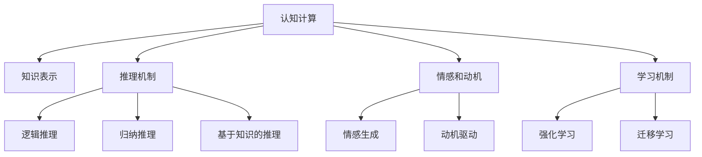

                 

# 探索人类思维的奥秘：人类计算的认知价值

> 关键词：认知计算,人类计算,人类思维,人工智能,机器学习,神经科学,计算模型

## 1. 背景介绍

### 1.1 问题由来
在过去几十年的科技浪潮中，人类计算经历了从机械自动化到电子计算机，再到人工智能和机器学习技术的飞速发展。然而，随着计算机技术的不断演进，一个问题始终困扰着我们：机器能否真正理解人类思维，模仿人类的认知能力？

人工智能(AI)的兴起，特别是深度学习技术的突破，使得机器在图像识别、语音处理、自然语言处理等领域取得了显著进展。但这些进步更多是依赖于庞大的数据和复杂的算法，而非真正的理解和认知。

人类计算的认知价值，是指通过计算技术来模拟、理解和扩展人类认知能力的努力。这种努力旨在打破“机器只会执行指令而无法理解问题本质”的局限，让机器能够像人类一样思考、学习和创造。

### 1.2 问题核心关键点
认知计算的核心在于如何模拟人类的认知过程，而不仅仅是数据的简单处理。它涉及到以下几个关键点：

- **认知模型**：建立能够模拟人类认知过程的计算模型。
- **知识表示**：如何用符号、概率、网络等形式对知识进行表示。
- **推理机制**：如何在计算模型中进行逻辑推理和归纳推理。
- **情感和动机**：如何模拟人类的情感和动机，使得机器能够具备人类的决策过程。
- **学习机制**：如何通过反馈机制让机器学习新的知识和技能。

这些关键点彼此之间相互依赖，共同构成认知计算的目标。只有全面解决这些问题，机器才能真正具备人类的认知能力。

### 1.3 问题研究意义
研究人类计算的认知价值，对于推动人工智能技术的发展，具有深远的意义：

1. **突破现有技术瓶颈**：认知计算可以超越现有机器学习技术的局限，探索更加智能化、人性化的人工智能应用。
2. **增强系统理解和适应能力**：通过理解人类的认知过程，构建更加智能的决策和交互系统。
3. **推动跨学科融合**：认知计算需要结合神经科学、心理学、哲学等学科的知识，促进跨学科的交流和融合。
4. **促进社会进步**：在教育、医疗、伦理等社会领域，认知计算可以提供更加个性化、高效的服务，提升社会福祉。
5. **驱动技术创新**：认知计算的探索将推动新算法、新架构和新应用的发展，为未来技术创新奠定基础。

## 2. 核心概念与联系

### 2.1 核心概念概述

为更好地理解认知计算的概念框架，本节将介绍几个关键概念：

- **认知计算(Cognitive Computing)**：旨在通过计算技术模拟和扩展人类认知能力的计算范式，涵盖符号计算、概率推理、神经网络等多种技术和方法。
- **知识表示(Knowledge Representation)**：如何将人类的知识和经验编码为计算机能够理解和处理的形式，包括符号表示、框架表示、图表示等。
- **推理机制(Reasoning)**：在知识表示的基础上，如何进行逻辑推理和归纳推理，构建推理模型。
- **情感和动机(Affection and Motivation)**：如何模拟人类的情感和动机，使得机器能够具备人类的决策过程。
- **学习机制(Learning)**：通过反馈机制让机器学习新的知识和技能，包括强化学习、迁移学习等。

这些概念之间的关系可以通过以下Mermaid流程图来展示：



这个流程图展示了几大核心概念之间的联系：

1. 认知计算以知识表示为基础，通过推理机制和情感动机模拟，实现学习机制。
2. 逻辑推理和归纳推理是推理机制的核心部分，用于处理结构化和非结构化知识。
3. 情感生成和动机驱动模拟人类情感和动机，使得机器能够具备更加自然和复杂的决策能力。
4. 强化学习和迁移学习是学习机制的主要形式，用于让机器通过反馈机制学习新知识和技能，并在不同场景中迁移应用。

## 3. 核心算法原理 & 具体操作步骤
### 3.1 算法原理概述

认知计算的算法原理主要基于符号计算、概率推理和神经网络等技术，模拟人类的认知过程。其中，神经网络和符号计算是当前主流的方法。

符号计算：通过构建符号化的知识库和规则库，实现对知识的逻辑推理和形式化表示。代表技术包括Prolog、Horn等。

概率推理：通过贝叶斯网络、马尔可夫网络等技术，处理不确定性知识和推理。它利用概率模型描述知识，通过贝叶斯网络进行推理和决策。

神经网络：通过多层神经元构建的计算模型，模拟人类的感知和决策过程。它利用神经元之间的连接权重，通过反向传播算法进行学习。

### 3.2 算法步骤详解

认知计算的一般步骤包括：

**Step 1: 构建认知模型**
- 确定问题的类型，选择符号计算、概率推理或神经网络等技术构建认知模型。
- 设计模型的知识表示框架，定义知识库和规则库。
- 设计推理机制，选择合适的推理算法，如推理机、求解器等。

**Step 2: 数据预处理和特征提取**
- 收集和预处理训练数据，提取特征，准备输入。
- 使用数据增强技术，扩充训练集。
- 应用正则化、Dropout等技术，防止过拟合。

**Step 3: 模型训练和参数优化**
- 选择合适的优化算法，如随机梯度下降、Adam等，设置学习率、批大小等超参数。
- 应用交叉验证、网格搜索等技术，优化模型参数。
- 应用正则化、对抗训练等技术，提高模型泛化能力。

**Step 4: 模型评估和反馈**
- 在验证集上评估模型性能，如准确率、召回率、F1-score等。
- 分析模型的推理过程，发现潜在的错误和不足。
- 应用反馈机制，通过调整规则库、知识库、网络结构等，进一步优化模型。

**Step 5: 模型部署和应用**
- 将优化后的模型部署到实际应用中。
- 实时监控模型性能，进行动态调整。
- 收集用户反馈，不断迭代和改进模型。

### 3.3 算法优缺点

认知计算的优点在于其多样化的技术和方法，能够应对不同类型的问题。它通过模拟人类认知过程，使得机器具备更高的智能和适应能力。

但认知计算也面临一些挑战：

1. **复杂度高**：认知计算涉及多个子领域，技术和方法复杂度较高。
2. **数据需求大**：认知计算需要大量结构化和非结构化数据进行训练。
3. **模型可解释性不足**：复杂的认知模型难以解释其内部工作机制。
4. **计算资源消耗大**：大规模认知计算模型的训练和推理需要大量的计算资源。

### 3.4 算法应用领域

认知计算已在多个领域得到应用，展示了其强大的潜力：

- **医疗**：用于疾病诊断、治疗方案推荐、患者行为预测等。通过模拟医生的推理过程，提供更加精准的医疗服务。
- **金融**：用于风险评估、投资决策、欺诈检测等。通过模拟经济学家的推理和决策过程，提供更科学的金融服务。
- **教育**：用于个性化教学、智能辅导、学习效果评估等。通过模拟教师的推理和决策过程，提供更加个性化的教育服务。
- **司法**：用于法律咨询、案件推理、证据评估等。通过模拟律师的推理和决策过程，提供更准确的司法服务。

此外，认知计算还在智慧城市、智能交通、军事分析等领域得到了广泛应用，推动了各行业智能化转型。

## 4. 数学模型和公式 & 详细讲解  
### 4.1 数学模型构建

认知计算的数学模型主要基于概率推理和神经网络等技术。以下是两个典型的数学模型：

- **贝叶斯网络**：表示变量之间的概率关系，用于处理不确定性知识。

- **神经网络**：通过多层神经元构建的计算模型，用于处理结构化和非结构化数据。

### 4.2 公式推导过程

以神经网络和贝叶斯网络为例，推导其基本公式和计算过程。

**神经网络**
- **前向传播**：

$$
\begin{aligned}
a^{[l]} &= W^{[l]} z^{[l-1]} + b^{[l]} \\
z^{[l]} &= \phi(a^{[l-1]})
\end{aligned}
$$

- **反向传播**：

$$
\begin{aligned}
\Delta z^{[l]} &= \frac{\partial \mathcal{L}}{\partial z^{[l]}} \\
\Delta W^{[l]} &= \Delta z^{[l]} \phi'(a^{[l-1]}) \\
\Delta b^{[l]} &= \Delta z^{[l]}
\end{aligned}
$$

**贝叶斯网络**
- **联合概率**：

$$
P(X_1, X_2, ..., X_n) = \prod_{i=1}^n P(X_i|X_1, X_2, ..., X_{i-1})
$$

- **边概率**：

$$
P(X_i|X_1, X_2, ..., X_{i-1}) = \frac{P(X_i, X_1, X_2, ..., X_{i-1})}{P(X_1, X_2, ..., X_{i-1})}
$$

- **推理**：

$$
P(X_i|X_1, X_2, ..., X_{n}) = \sum_{X_1, ..., X_{i-1}} P(X_i|X_1, X_2, ..., X_{i-1}, X_{i+1}, ..., X_{n})
$$

### 4.3 案例分析与讲解

以医疗诊断为例，分析认知计算的应用。

在医疗诊断中，贝叶斯网络和神经网络可以分别用于知识表示和模式识别。

1. **贝叶斯网络**：通过构建医疗知识库，表示疾病之间的概率关系。例如，已知患者有糖尿病和高血压，计算其患心脏病的概率。

2. **神经网络**：通过训练医疗图像识别模型，自动识别患者的影像数据，判断其是否有异常。

这两种方法可以结合使用，先通过贝叶斯网络进行推理，确定可能的疾病，再通过神经网络进行详细分析，判断确切的病情。

## 5. 项目实践：代码实例和详细解释说明
### 5.1 开发环境搭建

要进行认知计算的实践，首先需要搭建一个合适的开发环境。以下是Python环境配置流程：

1. 安装Anaconda：从官网下载并安装Anaconda，用于创建独立的Python环境。

2. 创建并激活虚拟环境：
```bash
conda create -n cognitive-env python=3.8 
conda activate cognitive-env
```

3. 安装必要的Python库：
```bash
pip install numpy scipy pandas scikit-learn keras tensorflow pydot
```

4. 下载并安装特定领域的认知计算框架，如OpenNMT、Prolog、TensorFlow等。

### 5.2 源代码详细实现

以下是使用TensorFlow和Keras进行贝叶斯网络实现的代码示例：

```python
import tensorflow as tf
from tensorflow import keras
import pydot

# 构建贝叶斯网络模型
class BayesianNetwork(tf.keras.Model):
    def __init__(self, num_nodes):
        super(BayesianNetwork, self).__init__()
        self.num_nodes = num_nodes
        self.weights = tf.Variable(tf.zeros([num_nodes, num_nodes]))
        self.biases = tf.Variable(tf.zeros([num_nodes]))
        
    def call(self, inputs):
        a = tf.matmul(inputs, self.weights) + self.biases
        z = tf.nn.sigmoid(a)
        return z

# 训练贝叶斯网络
def train_model(model, data, labels, epochs=100, batch_size=32):
    model.compile(optimizer=tf.keras.optimizers.Adam(), loss='mse')
    model.fit(data, labels, epochs=epochs, batch_size=batch_size)
    return model

# 应用贝叶斯网络进行推理
def predict(model, input_data):
    with tf.Session() as sess:
        sess.run(tf.global_variables_initializer())
        output = model.predict(input_data)
        return output
```

### 5.3 代码解读与分析

让我们再详细解读一下关键代码的实现细节：

**BayesianNetwork类**：
- `__init__`方法：初始化模型的权重和偏置项。
- `call`方法：进行前向传播，计算模型的输出。

**train_model函数**：
- 使用Adam优化器进行训练，设置损失函数为均方误差。
- 通过迭代训练，最小化损失函数，优化模型参数。

**predict函数**：
- 通过会话进行前向传播，计算模型输出。

通过这些代码，可以构建一个简单的贝叶斯网络模型，进行数据的推理和预测。

## 6. 实际应用场景
### 6.1 医疗诊断

认知计算在医疗诊断中的应用，主要通过贝叶斯网络和神经网络实现。通过构建医疗知识库和训练图像识别模型，医疗诊断系统可以辅助医生进行快速准确的诊断。

具体实现步骤如下：
1. 收集医疗数据，包括病人的症状、病史、影像等。
2. 构建医疗知识库，使用贝叶斯网络表示疾病之间的概率关系。
3. 训练神经网络，自动识别和分析病人的影像数据。
4. 结合贝叶斯网络和神经网络的结果，进行综合诊断和决策。

### 6.2 金融风险评估

认知计算在金融风险评估中的应用，主要通过贝叶斯网络和神经网络实现。通过构建金融知识库和训练信用评分模型，金融系统可以准确评估客户的信用风险。

具体实现步骤如下：
1. 收集金融数据，包括客户的信用记录、行为数据、交易数据等。
2. 构建金融知识库，使用贝叶斯网络表示不同风险因素之间的关系。
3. 训练神经网络，自动识别和分析客户的信用行为。
4. 结合贝叶斯网络和神经网络的结果，进行综合风险评估和决策。

### 6.3 智能推荐系统

认知计算在智能推荐系统中的应用，主要通过神经网络和知识表示实现。通过构建用户兴趣库和训练推荐模型，推荐系统可以个性化推荐商品、服务等内容。

具体实现步骤如下：
1. 收集用户行为数据，包括浏览记录、点击记录、购买记录等。
2. 构建用户兴趣库，使用神经网络表示用户的兴趣和偏好。
3. 训练推荐模型，自动识别和分析用户的行为模式。
4. 结合神经网络和知识库的结果，进行个性化推荐和决策。

### 6.4 未来应用展望

随着认知计算技术的不断演进，其在各领域的应用前景将更加广阔。未来，认知计算有望在以下方向取得突破：

1. **多模态认知计算**：将认知计算与视觉、听觉等多模态信息结合，构建更加全面和智能的认知系统。
2. **情感计算**：通过认知计算模拟人类的情感和动机，构建情感识别和情感生成系统。
3. **智能交互**：通过认知计算构建更加自然和智能的对话系统，提升人机交互体验。
4. **跨领域认知计算**：将认知计算与不同领域的应用结合，构建更加通用和灵活的认知系统。
5. **自我学习**：通过认知计算实现自我学习，让系统能够不断迭代和改进，提升性能和适应能力。

## 7. 工具和资源推荐
### 7.1 学习资源推荐

为了帮助开发者系统掌握认知计算的理论基础和实践技巧，这里推荐一些优质的学习资源：

1. 《认知计算导论》：介绍认知计算的基本概念和核心技术，适合初学者入门。
2. 《深度学习》（Goodfellow等）：深度学习领域的经典书籍，涵盖神经网络、贝叶斯网络等认知计算技术。
3. 《人工智能》（吴恩达）：斯坦福大学的在线课程，涵盖人工智能领域的各个方面，包括认知计算。
4. 《认知计算：理解人类智能的新范式》：阐述认知计算的理论基础和应用前景，适合进阶学习。
5. 《认知计算与智能系统》（Boden）：介绍认知计算的历史、理论和应用，适合深度学习领域的专家阅读。

通过对这些资源的学习实践，相信你一定能够快速掌握认知计算的精髓，并用于解决实际的NLP问题。

### 7.2 开发工具推荐

高效的开发离不开优秀的工具支持。以下是几款用于认知计算开发的常用工具：

1. TensorFlow：基于Python的开源深度学习框架，适合大规模的神经网络模型开发。
2. PyTorch：灵活的深度学习框架，支持动态图和静态图两种计算方式。
3. OpenNMT：开源的神经机器翻译框架，支持多语言翻译和文本生成等任务。
4. Prolog：符号计算语言，适合逻辑推理和知识表示。
5. Jasper：智能对话系统框架，支持自然语言理解和生成。

合理利用这些工具，可以显著提升认知计算开发的效率，加快创新迭代的步伐。

### 7.3 相关论文推荐

认知计算的发展源于学界的持续研究。以下是几篇奠基性的相关论文，推荐阅读：

1. "A Survey of Recent Techniques in Cognitive Computing"（认知计算技术综述）：系统总结了认知计算的历史、技术和应用，适合基础研究者阅读。
2. "Cognitive Computing for Wireless Sensor Networks"（无线传感器网络中的认知计算）：介绍认知计算在网络通信中的应用，适合网络领域的专家阅读。
3. "Neuro-Symbolic Cognition for Universal Rule Extraction"（神经符号融合的通用规则提取）：探讨神经网络与符号计算的融合，适合认知计算领域的专家阅读。
4. "Cognitive Computing: An Overview"（认知计算概述）：概述了认知计算的理论基础和技术细节，适合全领域的读者阅读。
5. "Cognitive Computing and Data Science"（认知计算与数据科学）：探讨认知计算在数据科学中的应用，适合数据领域的专家阅读。

这些论文代表了大认知计算技术的发展脉络。通过学习这些前沿成果，可以帮助研究者把握学科前进方向，激发更多的创新灵感。

## 8. 总结：未来发展趋势与挑战

### 8.1 总结

本文对认知计算的原理、步骤和应用进行了全面系统的介绍。首先阐述了认知计算的研究背景和意义，明确了其在模拟和扩展人类认知能力方面的独特价值。其次，从原理到实践，详细讲解了认知计算的基本模型和具体步骤，给出了认知计算任务开发的完整代码实例。同时，本文还探讨了认知计算在医疗、金融、推荐等多个领域的应用前景，展示了其强大的潜力。

通过本文的系统梳理，可以看到，认知计算正在成为人工智能技术的重要组成部分，其对人类认知过程的模拟和扩展，将带来新的技术突破和应用场景。未来，伴随认知计算技术的不断演进，人工智能系统将具备更加丰富和智能的认知能力，为人类社会带来深远影响。

### 8.2 未来发展趋势

展望未来，认知计算技术将呈现以下几个发展趋势：

1. **多模态认知计算**：通过将认知计算与视觉、听觉等多模态信息结合，构建更加全面和智能的认知系统。
2. **情感计算**：通过认知计算模拟人类的情感和动机，构建情感识别和情感生成系统。
3. **智能交互**：通过认知计算构建更加自然和智能的对话系统，提升人机交互体验。
4. **跨领域认知计算**：将认知计算与不同领域的应用结合，构建更加通用和灵活的认知系统。
5. **自我学习**：通过认知计算实现自我学习，让系统能够不断迭代和改进，提升性能和适应能力。

以上趋势凸显了认知计算技术的广阔前景。这些方向的探索发展，必将进一步提升认知计算系统的性能和应用范围，为人类智能技术的进化带来新的突破。

### 8.3 面临的挑战

尽管认知计算技术已经取得了显著进展，但在迈向更加智能化、普适化应用的过程中，它仍面临着诸多挑战：

1. **复杂度高**：认知计算涉及多个子领域，技术和方法复杂度较高。
2. **数据需求大**：认知计算需要大量结构化和非结构化数据进行训练。
3. **模型可解释性不足**：复杂的认知模型难以解释其内部工作机制。
4. **计算资源消耗大**：大规模认知计算模型的训练和推理需要大量的计算资源。
5. **跨领域应用难度大**：认知计算在不同领域的应用存在较大差异，难以实现通用化和标准化。

### 8.4 研究展望

面对认知计算面临的这些挑战，未来的研究需要在以下几个方面寻求新的突破：

1. **简化认知模型**：通过优化算法和架构设计，简化认知计算的复杂度，提升其应用效率。
2. **数据高效利用**：探索更多数据高效利用技术，减少数据需求，提高训练效率。
3. **增强模型可解释性**：开发更加透明的认知模型，提升其可解释性和可解释性。
4. **资源优化**：优化认知计算模型的资源使用，提升其计算效率和存储效率。
5. **跨领域应用**：探索更多跨领域应用的策略，实现认知计算的通用化和标准化。

这些研究方向的探索，必将引领认知计算技术迈向更高的台阶，为构建更加智能和人性化的人工智能系统铺平道路。面向未来，认知计算技术还需要与其他人工智能技术进行更深入的融合，如知识表示、因果推理、强化学习等，多路径协同发力，共同推动认知计算技术的发展。

## 9. 附录：常见问题与解答

**Q1：认知计算与机器学习的关系是什么？**

A: 认知计算与机器学习是相互补充的技术。认知计算通过模拟人类认知过程，提升机器学习的效果和应用范围。机器学习通过大数据和复杂算法，提升认知计算的计算效率和准确性。两者结合，可以实现更加智能化和复杂化的系统。

**Q2：认知计算的优点和缺点是什么？**

A: 认知计算的优点在于其多样化的技术和方法，能够应对不同类型的问题。但认知计算也面临一些挑战：
1. **复杂度高**：认知计算涉及多个子领域，技术和方法复杂度较高。
2. **数据需求大**：认知计算需要大量结构化和非结构化数据进行训练。
3. **模型可解释性不足**：复杂的认知模型难以解释其内部工作机制。
4. **计算资源消耗大**：大规模认知计算模型的训练和推理需要大量的计算资源。

**Q3：认知计算的主要应用场景是什么？**

A: 认知计算在多个领域得到了应用，展示了其强大的潜力。具体应用场景包括：
1. 医疗：用于疾病诊断、治疗方案推荐、患者行为预测等。
2. 金融：用于风险评估、投资决策、欺诈检测等。
3. 教育：用于个性化教学、智能辅导、学习效果评估等。
4. 司法：用于法律咨询、案件推理、证据评估等。
5. 智慧城市：用于智能交通、智能家居、城市管理等。

**Q4：如何评估认知计算的效果？**

A: 认知计算的效果评估通常包括以下几个方面：
1. **准确率**：模型在测试集上的预测准确率，用于衡量模型的性能。
2. **召回率**：模型在测试集上能够正确识别的正样本比例，用于衡量模型的全面性。
3. **F1-score**：准确率和召回率的调和平均值，综合衡量模型的性能。
4. **推理时间**：模型进行推理所需的时间，用于衡量模型的效率。

这些指标可以帮助评估认知计算的效果，并在实际应用中进行优化。

**Q5：认知计算与人工智能的区别是什么？**

A: 认知计算和人工智能是两个不同的概念。认知计算通过模拟人类认知过程，提升机器的智能和适应能力。而人工智能则通过复杂算法和大数据，让机器具备智能化的决策和行为能力。

认知计算更侧重于理解和模拟人类的认知过程，而人工智能更侧重于实现机器的智能决策和行为。两者结合，可以构建更加智能和人性化的人工智能系统。

---

作者：禅与计算机程序设计艺术 / Zen and the Art of Computer Programming

