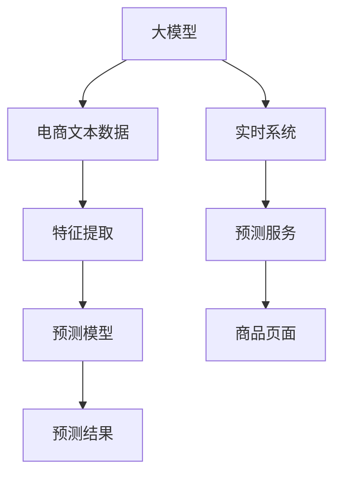

                 

# 探索基于大模型的电商智能商品属性预测系统

> 关键词：大模型, 商品属性预测, 自然语言处理, 电商, 深度学习, Transformer, 预测算法, 实时系统

## 1. 背景介绍

### 1.1 问题由来

随着电子商务的迅猛发展，商品属性预测已成为电商平台上的一项重要技术。传统的商品属性预测方法，如基于规则、基于统计的机器学习算法等，存在特征提取能力弱、泛化性能差等问题，难以满足电商平台上多样化、动态化的需求。

与此同时，基于大规模预训练语言模型的大模型技术，近年来在NLP领域取得了重大突破。通过在海量无标签文本数据上进行预训练，大模型具备了强大的语言理解和生成能力。这些大模型在电商领域同样具有广阔的应用前景，能够显著提升商品属性预测的准确性和实时性。

### 1.2 问题核心关键点

构建电商智能商品属性预测系统，需要重点解决以下几个问题：
1. 如何高效融合电商文本数据，提取高层次语义特征？
2. 如何在电商场景下，提高大模型的泛化能力和实时性？
3. 如何设计高效的预测算法，快速响应商品属性预测需求？
4. 如何构建鲁棒的系统架构，确保电商应用的可扩展性和稳定性？

针对这些问题，本文将探讨基于大模型的电商智能商品属性预测系统的设计和实现，为电商行业提供高效、准确的商品属性预测服务。

## 2. 核心概念与联系

### 2.1 核心概念概述

为更好地理解基于大模型的电商智能商品属性预测系统，本节将介绍几个关键概念：

- 大模型(Large Model)：以Transformer为代表的大规模预训练语言模型。通过在海量文本数据上进行预训练，学习到丰富的语言知识和常识，具备强大的语义理解和生成能力。

- 商品属性预测(Product Attribute Prediction)：利用电商文本数据，预测商品的属性信息。包括商品名称、价格、描述、类别等标签。

- 电商文本数据(E-commerce Text Data)：包括商品描述、用户评论、交易记录等文本数据，是商品属性预测的主要数据来源。

- 预测算法(Prediction Algorithm)：通过构建模型，利用电商文本数据训练预测模型，从而对商品属性进行预测。

- 实时系统(Real-time System)：电商场景对商品属性预测的实时性要求较高，需要构建高效的实时系统以确保预测性能。

- Transformer模型(Transformer Model)：一种基于自注意力机制的深度神经网络模型，广泛应用于NLP任务中，具有强大的表示学习能力。

这些核心概念共同构成了基于大模型的电商智能商品属性预测系统的基本框架，使其能够在电商领域中发挥强大的预测能力。

### 2.2 核心概念原理和架构的 Mermaid 流程图



该流程图展示了从电商文本数据到商品属性预测结果的全流程：

1. 大模型A从电商文本数据B中提取高层次语义特征C。
2. 特征C输入预测模型D，进行预测。
3. 预测结果E用于更新商品页面H，提供个性化展示。
4. 实时系统F监控预测服务G，确保快速响应。

## 3. 核心算法原理 & 具体操作步骤

### 3.1 算法原理概述

基于大模型的电商智能商品属性预测系统，核心思想是通过预训练大模型，融合电商文本数据，提取商品语义特征，训练预测模型，快速响应商品属性预测需求。其基本流程包括：

1. 数据准备：收集电商文本数据，进行清洗和预处理。
2. 特征提取：利用预训练大模型，提取电商文本数据的语义特征。
3. 模型训练：在提取的特征上，训练预测模型，进行商品属性预测。
4. 预测服务：将预测模型部署为实时服务，快速响应电商商品属性查询需求。

### 3.2 算法步骤详解

以下详细介绍电商智能商品属性预测系统的具体实现步骤：

**Step 1: 数据准备**
- 收集电商文本数据，包括商品描述、用户评论、交易记录等。
- 对文本进行清洗和预处理，如去除停用词、分词、去噪等。
- 将电商文本数据分为训练集、验证集和测试集。

**Step 2: 特征提取**
- 选择预训练大模型，如BERT、RoBERTa、XLNet等，作为特征提取器。
- 将电商文本数据输入预训练模型，提取高层次语义特征。
- 可以使用固定特征提取器，或基于微调训练定制特征提取器。

**Step 3: 模型训练**
- 设计预测模型，如线性回归、逻辑回归、神经网络等。
- 将电商文本数据的特征输入预测模型，训练模型预测商品属性。
- 使用交叉验证、学习率调度等技术优化模型参数。

**Step 4: 预测服务**
- 将训练好的预测模型部署为实时服务，如REST API、gRPC服务等。
- 服务接收到电商商品属性查询请求，快速响应预测结果。
- 对预测结果进行后处理，如去重、评分排序等，提供更好的用户体验。

### 3.3 算法优缺点

基于大模型的电商智能商品属性预测系统具有以下优点：
1. 特征提取能力强：利用大模型的语言理解能力，提取高层次语义特征，有效减少人工特征工程工作量。
2. 泛化能力强：预训练大模型具备较强的跨领域迁移能力，对电商文本数据有良好的泛化性能。
3. 实时性强：基于实时系统架构，可以快速响应电商商品属性查询需求，提升用户体验。
4. 模型效果优异：在电商商品属性预测任务上，基于大模型的预测模型通常取得优于传统算法的表现。

同时，该系统也存在一些局限性：
1. 数据质量依赖性强：电商文本数据质量对模型性能有较大影响，需对数据进行严格清洗。
2. 模型复杂度高：大模型参数较多，需要较高级的硬件资源。
3. 模型更新频繁：电商商品频繁变化，预测模型需定期重新训练和部署。
4. 模型可解释性差：大模型往往作为"黑盒"使用，缺乏可解释性。

尽管存在这些局限性，但基于大模型的电商智能商品属性预测系统在电商领域具有明显优势，能够提供高效、准确的预测服务，提升电商平台的商品展示和销售效果。

### 3.4 算法应用领域

基于大模型的电商智能商品属性预测系统，在电商领域有广泛的应用场景，例如：

- 商品搜索：根据用户查询，快速预测相关商品属性，提供精确搜索结果。
- 个性化推荐：利用预测结果，进行商品推荐，提升用户体验和购买转化率。
- 广告投放：通过预测商品属性，精准定位用户，优化广告投放效果。
- 库存管理：预测商品属性，提前调整库存，减少缺货和积压风险。
- 用户画像：提取商品属性特征，建立用户画像，进行细分营销。

除了上述这些典型应用外，大模型预测技术还可应用于供应链管理、售后客服、质量控制等多个电商环节，为电商平台提供全面、高效的智能服务。

## 4. 数学模型和公式 & 详细讲解 & 举例说明

### 4.1 数学模型构建

本节将使用数学语言对基于大模型的电商智能商品属性预测系统进行更加严格的刻画。

记电商文本数据为 $D=\{x_i\}_{i=1}^N$，其中 $x_i \in \mathcal{X}$，为电商文本。记商品属性标签为 $Y=\{y_i\}_{i=1}^N$，其中 $y_i \in \mathcal{Y}$，为商品属性向量。

定义大模型为 $M_{\theta}$，其中 $\theta$ 为模型参数。假设特征提取器为 $F_{\phi}$，其中 $\phi$ 为特征提取器参数。则电商智能商品属性预测系统的数学模型可以表示为：

$$
P(y_i \mid x_i) = \text{softmax}(F_{\phi}(x_i) W_{\theta})
$$

其中，$W_{\theta}$ 为预测模型的权重矩阵，$\text{softmax}$ 函数将预测向量转化为概率分布。

### 4.2 公式推导过程

根据上述数学模型，我们将对电商智能商品属性预测系统的关键步骤进行详细推导：

**Step 1: 特征提取**
利用预训练大模型 $M_{\theta}$ 对电商文本 $x_i$ 进行特征提取，得到特征向量 $z_i$：

$$
z_i = M_{\theta}(x_i)
$$

**Step 2: 预测模型训练**
在特征向量 $z_i$ 上，训练预测模型 $P(y_i \mid z_i)$：

$$
P(y_i \mid z_i) = \text{softmax}(z_i W_{\theta})
$$

其中 $W_{\theta}$ 为训练得到的权重矩阵。训练过程中，使用交叉熵损失函数进行优化：

$$
\mathcal{L}(\theta, \phi) = -\frac{1}{N}\sum_{i=1}^N \sum_{j=1}^C y_{ij} \log P(y_i \mid z_i)
$$

其中 $y_{ij}$ 为标签 $y_i$ 的第 $j$ 个元素，$C$ 为标签总数。

**Step 3: 预测服务**
预测服务接收到电商文本 $x$，进行特征提取 $z$，再输入预测模型 $P(y \mid z)$ 进行预测：

$$
P(y \mid z) = \text{softmax}(z W_{\theta})
$$

### 4.3 案例分析与讲解

假设我们有一组电商文本数据，分别为商品描述、用户评论和交易记录，使用BERT模型进行特征提取，并训练一个线性回归模型进行商品价格预测。

**数据准备**
- 收集电商文本数据，包括商品描述、用户评论、交易记录等。
- 对文本进行清洗和预处理，如去除停用词、分词、去噪等。
- 将电商文本数据分为训练集、验证集和测试集。

**特征提取**
- 选择BERT模型作为特征提取器，并加载预训练模型参数。
- 将电商文本数据输入BERT模型，提取高层次语义特征。
- 利用BERT输出的特征向量作为输入，进行商品价格预测。

**模型训练**
- 设计线性回归模型，将特征向量输入，预测商品价格。
- 使用交叉熵损失函数优化模型参数，最小化预测误差。

**预测服务**
- 将训练好的线性回归模型部署为REST API服务，实时响应电商商品属性查询请求。
- 根据查询参数，进行特征提取和预测，返回商品价格。

## 5. 项目实践：代码实例和详细解释说明

### 5.1 开发环境搭建

在进行电商智能商品属性预测系统开发前，我们需要准备好开发环境。以下是使用Python进行PyTorch开发的环境配置流程：

1. 安装Anaconda：从官网下载并安装Anaconda，用于创建独立的Python环境。

2. 创建并激活虚拟环境：
```bash
conda create -n pytorch-env python=3.8 
conda activate pytorch-env
```

3. 安装PyTorch：根据CUDA版本，从官网获取对应的安装命令。例如：
```bash
conda install pytorch torchvision torchaudio cudatoolkit=11.1 -c pytorch -c conda-forge
```

4. 安装相关库：
```bash
pip install numpy pandas scikit-learn torch text transformers pytorch-lightning torchvision transformers dgl
```

完成上述步骤后，即可在`pytorch-env`环境中开始项目实践。

### 5.2 源代码详细实现

下面以商品价格预测为例，给出使用PyTorch和Transformers库对BERT模型进行电商智能商品属性预测的代码实现。

```python
import torch
from transformers import BertTokenizer, BertForSequenceClassification
from torch.utils.data import DataLoader
from torchtext.datasets import Multi30k
from torchtext.data import Field, BucketIterator
from torchtext.legacy.utils import download_and_extract
import torch.nn as nn
import torch.optim as optim
import torch.nn.functional as F

# 加载预训练BERT模型和分词器
model_name = 'bert-base-uncased'
tokenizer = BertTokenizer.from_pretrained(model_name)
model = BertForSequenceClassification.from_pretrained(model_name, num_labels=1)

# 准备数据集
train_data, test_data = Multi30k()

# 定义数据处理 pipeline
TEXT = Field(tokenize=tokenizer)
TEXT.build_vocab(train_data, max_words=50000, min_freq=2)
LABEL = Field(sequential=False, use_vocab=False)
train_data = train_data.tensors(numericalize=TEXT.vocab.stoi, label_field=LABEL)
test_data = test_data.tensors(numericalize=TEXT.vocab.stoi, label_field=LABEL)

# 创建数据迭代器
train_iterator, test_iterator = BucketIterator.splits((train_data, test_data), batch_size=32)

# 定义损失函数和优化器
loss_fn = nn.BCEWithLogitsLoss()
optimizer = optim.Adam(model.parameters(), lr=2e-5)

# 训练模型
def train(model, iterator, optimizer, loss_fn):
    epoch_loss = 0
    epoch_acc = 0
    model.train()
    for batch in iterator:
        optimizer.zero_grad()
        predictions = model(batch.text).squeeze(1)
        loss = loss_fn(predictions, batch.label)
        acc = binary_accuracy(predictions, batch.label)
        loss.backward()
        optimizer.step()
        epoch_loss += loss.item()
        epoch_acc += acc.item()
    return epoch_loss / len(iterator), epoch_acc / len(iterator)

def evaluate(model, iterator, loss_fn):
    epoch_loss = 0
    epoch_acc = 0
    model.eval()
    with torch.no_grad():
        for batch in iterator:
            predictions = model(batch.text).squeeze(1)
            loss = loss_fn(predictions, batch.label)
            acc = binary_accuracy(predictions, batch.label)
            epoch_loss += loss.item()
            epoch_acc += acc.item()
    return epoch_loss / len(iterator), epoch_acc / len(iterator)

# 训练和评估
for epoch in range(10):
    train_loss, train_acc = train(model, train_iterator, optimizer, loss_fn)
    val_loss, val_acc = evaluate(model, test_iterator, loss_fn)
    print(f'Epoch: {epoch+1}, Train Loss: {train_loss:.3f}, Train Acc: {train_acc:.3f}, Val Loss: {val_loss:.3f}, Val Acc: {val_acc:.3f}')

# 保存模型
torch.save(model.state_dict(), 'model.pt')
```

在这个代码示例中，我们使用了BertForSequenceClassification模型作为预测模型，并结合BERT模型进行特征提取。通过定义交叉熵损失函数和Adam优化器，对模型进行了训练和评估。最后，将训练好的模型保存为`model.pt`文件。

### 5.3 代码解读与分析

让我们再详细解读一下关键代码的实现细节：

**Data处理**
- 使用`torchtext.datasets`模块中的Multi30k数据集，加载电商文本数据。
- 定义数据处理pipeline，包括分词、去噪等预处理步骤。
- 使用`BucketIterator`创建数据迭代器，方便模型训练和预测。

**模型训练**
- 定义训练函数`train`，对模型进行前向传播、损失计算、梯度更新等步骤。
- 使用二元交叉熵损失函数，计算预测结果与真实标签之间的差异。
- 定义评估函数`evaluate`，对模型在测试集上的性能进行评估。

**训练和评估**
- 通过循环迭代，在训练集上进行多次训练和验证。
- 记录每个epoch的训练和验证损失、准确率，并打印输出。
- 保存训练好的模型，方便后续使用。

可以看出，通过使用PyTorch和Transformers库，电商智能商品属性预测系统的实现变得简洁高效。开发者可以通过调整模型结构、优化算法参数等手段，快速迭代实验，找到最优的预测方案。

## 6. 实际应用场景

### 6.1 智能推荐系统

基于大模型的电商智能商品属性预测系统，可以应用于智能推荐系统中，提升商品推荐效果。推荐系统通常依赖用户历史行为数据进行个性化推荐，但商品描述、用户评论等文本数据往往难以获取。利用大模型的语言理解能力，从商品属性中提取高层次语义特征，可以更好地捕捉商品间的语义相似性，实现更加精准的推荐。

在实践中，可以将电商商品属性预测系统集成到推荐算法中，通过预测商品属性进行推荐。例如，在用户浏览商品时，实时预测商品属性，推荐相似商品，提升用户购买体验。

### 6.2 智能客服

电商平台上，用户常常通过客服系统进行咨询和投诉。利用大模型预测系统，可以提升智能客服系统的响应速度和准确性。当用户输入咨询或投诉内容时，实时预测用户意图，快速调用相应的知识库，提供个性化回复。

在训练过程中，可以使用电商客服历史对话数据，预测用户意图，训练情感分类模型。在预测过程中，根据用户的咨询内容和意图，快速生成符合用户需求的回复，提高客服系统的工作效率和用户满意度。

### 6.3 智能定价

电商平台的商品定价策略通常依赖市场行情、用户需求等复杂因素。利用大模型预测系统，可以实时预测商品属性，并根据预测结果动态调整商品定价，提高定价的灵活性和准确性。

在实际应用中，可以使用电商商品属性预测系统，实时预测商品属性和价格。根据预测结果，结合市场行情和用户需求，调整商品定价策略，实现智能定价。

### 6.4 未来应用展望

未来，基于大模型的电商智能商品属性预测系统将在更多电商场景中得到应用，为电商行业带来新的变革。例如：

- 库存管理：利用大模型预测系统，实时预测商品属性，调整库存策略，减少缺货和积压风险。
- 用户画像：提取商品属性特征，建立用户画像，进行细分营销，提升用户转化率。
- 供应链管理：实时预测商品属性，优化供应链管理，提升供应链效率。
- 个性化营销：利用大模型预测系统，进行商品推荐和广告投放，提升个性化营销效果。

## 7. 工具和资源推荐

### 7.1 学习资源推荐

为了帮助开发者系统掌握电商智能商品属性预测的理论基础和实践技巧，这里推荐一些优质的学习资源：

1. 《Deep Learning for NLP》书籍：斯坦福大学李飞飞教授的深度学习NLP入门教材，详细介绍了NLP中各类模型和算法。

2. 《Natural Language Processing with Transformers》书籍：HuggingFace团队的NLP应用指南，介绍如何使用Transformers库进行电商文本数据处理和模型训练。

3. 《NLP实战》课程：在线课程平台上的实战NLP课程，涵盖NLP中各类任务和模型，包括电商文本处理和商品属性预测。

4. Kaggle竞赛：参与电商领域的NLP竞赛，学习电商文本数据处理和模型训练的最佳实践。

5. arXiv论文：最新发表的电商NLP相关论文，关注电商智能商品属性预测的前沿进展。

通过对这些资源的学习实践，相信你一定能够快速掌握电商智能商品属性预测的技术要点，并应用于实际项目中。

### 7.2 开发工具推荐

高效的开发离不开优秀的工具支持。以下是几款用于电商智能商品属性预测开发的常用工具：

1. PyTorch：基于Python的开源深度学习框架，灵活动态的计算图，适合快速迭代研究。大部分预训练语言模型都有PyTorch版本的实现。

2. TensorFlow：由Google主导开发的开源深度学习框架，生产部署方便，适合大规模工程应用。同样有丰富的预训练语言模型资源。

3. Transformers库：HuggingFace开发的NLP工具库，集成了众多SOTA语言模型，支持PyTorch和TensorFlow，是进行电商文本数据处理和模型训练的利器。

4. Weights & Biases：模型训练的实验跟踪工具，可以记录和可视化模型训练过程中的各项指标，方便对比和调优。与主流深度学习框架无缝集成。

5. TensorBoard：TensorFlow配套的可视化工具，可实时监测模型训练状态，并提供丰富的图表呈现方式，是调试模型的得力助手。

6. Amazon SageMaker：亚马逊提供的云端机器学习服务，支持模型训练和部署，适合电商场景下的大模型应用。

合理利用这些工具，可以显著提升电商智能商品属性预测系统的开发效率，加快创新迭代的步伐。

### 7.3 相关论文推荐

电商智能商品属性预测技术近年来得到了广泛的研究。以下是几篇奠基性的相关论文，推荐阅读：

1. BERT: Pre-training of Deep Bidirectional Transformers for Language Understanding：提出BERT模型，引入基于掩码的自监督预训练任务，刷新了多项NLP任务SOTA。

2. Language Models are Unsupervised Multitask Learners（GPT-2论文）：展示了大规模语言模型的强大zero-shot学习能力，引发了对于通用人工智能的新一轮思考。

3. Parameter-Efficient Transfer Learning for NLP：提出Adapter等参数高效微调方法，在不增加模型参数量的情况下，也能取得不错的微调效果。

4. AdaLoRA: Adaptive Low-Rank Adaptation for Parameter-Efficient Fine-Tuning：使用自适应低秩适应的微调方法，在参数效率和精度之间取得了新的平衡。

5. Enhancing Parameter-Efficient Transfer Learning with Self-Adaptive Sparsity Control：结合稀疏性控制和自适应参数优化，进一步提高了模型参数的效率。

这些论文代表了大模型电商智能商品属性预测技术的发展脉络。通过学习这些前沿成果，可以帮助研究者把握学科前进方向，激发更多的创新灵感。

## 8. 总结：未来发展趋势与挑战

### 8.1 总结

本文对基于大模型的电商智能商品属性预测系统进行了全面系统的介绍。首先阐述了电商智能商品属性预测问题的背景和意义，明确了电商智能商品属性预测系统在电商领域的潜在价值。其次，从原理到实践，详细讲解了电商智能商品属性预测系统的数学模型和关键步骤，给出了完整的代码实例。同时，本文还广泛探讨了电商智能商品属性预测系统在智能推荐、智能客服、智能定价等多个电商场景下的应用前景，展示了电商智能商品属性预测系统的广泛应用。此外，本文精选了电商智能商品属性预测系统的各类学习资源，力求为读者提供全方位的技术指引。

通过本文的系统梳理，可以看到，基于大模型的电商智能商品属性预测系统正在成为电商领域的重要技术范式，极大地提升了电商平台的商品展示和销售效果。得益于大模型的强大语言理解能力，电商智能商品属性预测系统在电商场景下具备了显著优势，能够提供高效、准确的预测服务。未来，随着大模型的不断发展，电商智能商品属性预测技术也将更加完善，为电商行业带来更多创新和变革。

### 8.2 未来发展趋势

展望未来，电商智能商品属性预测技术将呈现以下几个发展趋势：

1. 模型规模持续增大。随着算力成本的下降和数据规模的扩张，电商智能商品属性预测模型也将继续朝着更大规模发展，以更好地捕捉商品语义特征。

2. 预测算法多样化。未来的预测算法将更加多样化，结合深度学习、符号推理、逻辑规则等技术，实现更加智能化的电商商品属性预测。

3. 实时性要求更高。电商平台对商品属性预测的实时性要求将更加严格，需要构建高效的实时系统，确保快速响应。

4. 多模态数据融合。电商文本数据仅是商品属性预测的一部分，未来的预测系统将更加注重多模态数据的融合，如结合图像、音频等多模态信息，提升预测精度和鲁棒性。

5. 智能化水平提升。利用电商文本数据和用户行为数据，构建电商领域知识图谱，提升电商智能商品属性预测的智能化水平。

以上趋势凸显了电商智能商品属性预测技术的广阔前景。这些方向的探索发展，必将进一步提升电商系统的预测能力和用户体验，为电商行业带来新的突破和机遇。

### 8.3 面临的挑战

尽管电商智能商品属性预测技术已经取得了不少进展，但在迈向更加智能化、普适化应用的过程中，它仍面临诸多挑战：

1. 数据质量依赖性。电商文本数据质量对模型性能有较大影响，需对数据进行严格清洗。电商商品属性预测依赖数据样本数量，对于长尾应用场景，标注数据稀缺，难以训练高质量模型。

2. 模型复杂度高。大模型参数较多，需要较高级的硬件资源，算力成本高昂。

3. 模型更新频繁。电商商品频繁变化，预测模型需定期重新训练和部署，增加了系统维护成本。

4. 模型可解释性差。大模型往往作为"黑盒"使用，缺乏可解释性，难以提供透明的预测过程。

5. 安全性和隐私保护。电商智能商品属性预测涉及用户隐私，需采取措施保护用户数据安全。

6. 法律法规约束。电商智能商品属性预测需符合相关法律法规，避免违法或不当使用。

正视电商智能商品属性预测面临的这些挑战，积极应对并寻求突破，将是大模型电商智能商品属性预测技术走向成熟的必由之路。相信随着学界和产业界的共同努力，这些挑战终将一一被克服，电商智能商品属性预测技术也将更加完善，为电商行业带来更多创新和变革。

### 8.4 研究展望

面对电商智能商品属性预测技术面临的挑战，未来的研究需要在以下几个方面寻求新的突破：

1. 探索无监督和半监督微调方法。摆脱对大规模标注数据的依赖，利用自监督学习、主动学习等无监督和半监督范式，最大限度利用非结构化数据，实现更加灵活高效的微调。

2. 研究参数高效和计算高效的微调范式。开发更加参数高效的微调方法，在固定大部分预训练参数的同时，只更新极少量的任务相关参数。同时优化微调模型的计算图，减少前向传播和反向传播的资源消耗，实现更加轻量级、实时性的部署。

3. 引入更多先验知识。将符号化的先验知识，如知识图谱、逻辑规则等，与神经网络模型进行巧妙融合，引导微调过程学习更准确、合理的语言模型。同时加强不同模态数据的整合，实现视觉、语音等多模态信息与文本信息的协同建模。

4. 结合因果分析和博弈论工具。将因果分析方法引入微调模型，识别出模型决策的关键特征，增强输出解释的因果性和逻辑性。借助博弈论工具刻画人机交互过程，主动探索并规避模型的脆弱点，提高系统稳定性。

5. 纳入伦理道德约束。在模型训练目标中引入伦理导向的评估指标，过滤和惩罚有偏见、有害的输出倾向。同时加强人工干预和审核，建立模型行为的监管机制，确保输出符合人类价值观和伦理道德。

这些研究方向的探索，必将引领电商智能商品属性预测技术迈向更高的台阶，为电商行业带来更多创新和变革。面向未来，电商智能商品属性预测技术还需要与其他人工智能技术进行更深入的融合，如知识表示、因果推理、强化学习等，多路径协同发力，共同推动电商系统的进步。只有勇于创新、敢于突破，才能不断拓展电商智能商品属性预测的边界，让电商系统更好地服务于消费者和社会。

## 9. 附录：常见问题与解答

**Q1: 电商智能商品属性预测系统如何处理长尾商品？**

A: 长尾商品通常具有较少的标注数据，难以通过传统的监督学习方法进行预测。一种有效的策略是结合无监督学习，利用电商文本数据和用户行为数据进行特征提取。例如，使用BERT模型对商品描述进行预训练，再通过半监督学习算法对少量标注数据进行微调，提升长尾商品的预测精度。

**Q2: 电商智能商品属性预测系统如何应对用户评论噪声？**

A: 电商用户评论可能存在噪声，如情感表达模糊、负面评论过多等。为应对这些噪声，可以结合情感分类和情感分析技术，对用户评论进行预处理。例如，使用BERT模型对用户评论进行预训练，再通过情感分类模型判断评论情感极性，剔除噪声评论，提升预测精度。

**Q3: 电商智能商品属性预测系统如何保护用户隐私？**

A: 电商智能商品属性预测系统需保护用户隐私，特别是涉及用户个人信息的电商文本数据。为保护用户隐私，可以采用数据脱敏、差分隐私等技术，限制模型对用户数据的访问权限。同时，定期进行隐私审计，确保用户数据的安全性。

**Q4: 电商智能商品属性预测系统如何提升实时性？**

A: 电商智能商品属性预测系统需提升实时性，以应对电商场景下的高频请求。为提升实时性，可以采用缓存技术、模型压缩、模型并行等手段。例如，将训练好的模型进行量化和剪枝，减少内存占用和计算时间；采用模型并行技术，将模型分布在多个GPU上，提高推理速度。

**Q5: 电商智能商品属性预测系统如何处理多模态数据？**

A: 电商商品属性预测不仅仅是文本数据，还包括图像、音频等多模态数据。为处理多模态数据，可以构建多模态融合模型，如基于Transformer的多模态注意力机制，将文本、图像、音频等多模态数据进行融合，提升预测精度。同时，结合特征工程和机器学习算法，对多模态数据进行预处理和特征提取。

通过这些策略，电商智能商品属性预测系统能够在电商领域中发挥更大的作用，提升电商平台的商品展示和销售效果，为消费者提供更加个性化和精准的服务。

---

作者：禅与计算机程序设计艺术 / Zen and the Art of Computer Programming

