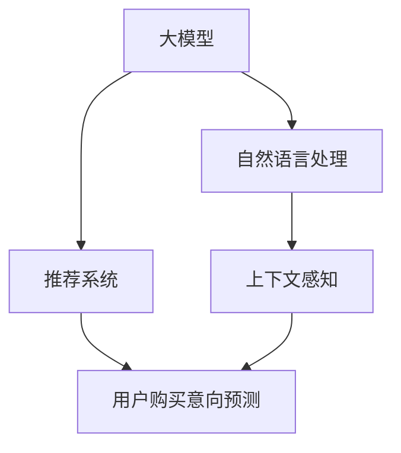

                 

# 探讨大模型在电商平台用户购买意向预测中的潜力

> 关键词：大模型,用户购买意向预测,自然语言处理,推荐系统,深度学习

## 1. 背景介绍

### 1.1 问题由来

随着电商行业的迅猛发展，用户行为分析在电商平台的个性化推荐和精准营销中占据了越来越重要的位置。用户购买意向预测是电商推荐系统中的一项核心技术，通过预测用户的购买概率，可以为电商平台提供更精准的商品推荐，提高用户转化率和销售额。近年来，深度学习和自然语言处理技术的突破，使得大模型在电商平台的用户购买意向预测中展现了巨大的潜力。

### 1.2 问题核心关键点

大模型在电商平台用户购买意向预测中的应用，核心在于如何利用大规模预训练语言模型捕获用户与商品间的语义关联，进而精确预测用户的购买行为。以下是大模型应用中的几个关键点：

- **语义理解**：大模型能够从文本中提取丰富的语义信息，理解用户对商品的描述、评价和评论，从而把握用户的购买意愿。
- **跨领域泛化**：大模型在多领域的预训练数据上学习到的知识，可以跨领域泛化，应用于电商平台的商品推荐任务。
- **动态更新**：电商平台上的用户行为和商品信息不断变化，大模型需要能够动态更新知识库，适应新的市场环境。
- **隐私保护**：电商平台需要对用户数据进行保护，避免隐私泄露。大模型可以在不暴露具体数据的情况下，提取用户行为特征进行预测。
- **鲁棒性**：电商平台面临的业务场景复杂多样，大模型需要具备良好的鲁棒性，避免过拟合和异常值干扰。

## 2. 核心概念与联系

### 2.1 核心概念概述

为更好地理解大模型在电商平台用户购买意向预测中的应用，本节将介绍几个密切相关的核心概念：

- **大模型(Large Models)**：指以Transformer架构为基础的深度学习模型，如BERT、GPT等，具有大规模参数和强大的语义理解能力。
- **自然语言处理(Natural Language Processing, NLP)**：研究如何通过计算机处理和理解人类语言的技术，包括文本分类、情感分析、机器翻译等任务。
- **推荐系统(Recommender Systems)**：通过分析用户行为和商品特征，推荐最符合用户需求的产品的系统。
- **深度学习(Deep Learning)**：一种基于多层神经网络进行复杂模式识别的机器学习方法，包括卷积神经网络(CNN)、循环神经网络(RNN)、自注意力机制等。
- **用户购买意向预测(Purchase Intent Prediction)**：通过分析用户的历史行为和特征，预测用户未来的购买意愿和行为的技术。
- **上下文感知(Contextualization)**：考虑用户的行为和上下文信息，如时间、位置、心情等，以提高预测的准确性。

这些核心概念之间的逻辑关系可以通过以下Mermaid流程图来展示：



这个流程图展示了大模型在电商平台用户购买意向预测中的应用框架：

1. 大模型通过NLP技术处理用户和商品的文本数据，提取语义特征。
2. 推荐系统利用这些特征预测用户的购买意向。
3. 上下文感知技术考虑用户的实时行为和上下文环境，进一步提升预测的准确性。

## 3. 核心算法原理 & 具体操作步骤
### 3.1 算法原理概述

大模型在电商平台用户购买意向预测中，通过以下核心算法原理进行实施：

1. **预训练**：在大规模无标注文本数据上对大模型进行预训练，学习通用的语言表示。预训练模型能够捕捉词语和句子之间的语义关联，并学习到语言的结构信息。
2. **微调**：在电商平台的标注数据上进行微调，使模型能够预测用户的购买意向。微调过程中，模型会根据用户的行为数据进行有监督学习，优化购买意向的预测能力。
3. **特征提取**：从用户与商品的文本描述中提取特征，如用户对商品的评价、评论、搜索记录等。这些特征将作为模型的输入，用于计算用户购买意向的概率。
4. **上下文感知**：考虑用户的行为和上下文环境，如访问时间、浏览次数、地理位置等，这些信息可以进一步提升模型的预测精度。
5. **决策输出**：将提取的特征和上下文信息输入模型，得到用户购买意向的概率。

### 3.2 算法步骤详解

基于大模型的电商平台用户购买意向预测流程包括以下几个关键步骤：

**Step 1: 准备预训练模型和数据集**

1. 选择合适的预训练模型，如BERT、GPT等，作为初始化参数。
2. 收集电商平台上的用户行为数据和商品信息，包括用户浏览、点击、购买等行为记录，以及商品描述、价格、评价等文本数据。
3. 将数据划分为训练集、验证集和测试集，标注数据集中包含用户是否购买的标签。

**Step 2: 数据预处理**

1. 对文本数据进行分词、去除停用词等文本预处理操作。
2. 将文本数据转换为模型所需的输入格式，如token ids、mask等。
3. 对用户行为数据进行格式化，如时间戳转换为日期格式，地理位置信息标准化等。

**Step 3: 模型微调**

1. 在预训练模型的基础上，添加任务适配层，如线性分类器或回归器。
2. 设置微调超参数，如学习率、批大小、迭代轮数等。
3. 使用AdamW、SGD等优化算法进行微调，最小化损失函数，优化购买意向的预测能力。

**Step 4: 特征提取与上下文感知**

1. 使用Transformer等预训练模型对文本数据进行特征提取，生成词语向量表示。
2. 考虑用户的实时行为和上下文环境，提取更多动态特征，如访问时间、浏览次数等。
3. 将提取的特征和上下文信息合并，作为模型的输入。

**Step 5: 决策输出**

1. 将特征和上下文信息输入模型，计算用户购买意向的概率。
2. 通过阈值筛选，将预测结果转换为二分类或多分类结果。
3. 对测试集上的预测结果进行评估，计算准确率、召回率、F1值等指标，优化模型参数。

**Step 6: 模型部署与监测**

1. 将微调后的模型部署到电商平台的推荐系统中，实时计算用户的购买意向概率。
2. 监测模型性能，定期更新模型参数，适应新的用户行为和市场环境。
3. 考虑模型的隐私保护和鲁棒性，避免过拟合和异常值干扰。

### 3.3 算法优缺点

基于大模型的电商平台用户购买意向预测方法具有以下优点：

1. **泛化能力强**：预训练模型在大规模无标注数据上学习到的通用语言知识，可以应用于多个电商平台的商品推荐任务。
2. **准确率高**：大模型的深度学习能力和强大的语义理解能力，使得预测结果的准确率较高。
3. **动态更新**：通过不断收集用户行为数据和市场信息，大模型可以动态更新知识库，适应新的市场环境。
4. **上下文感知**：考虑用户的实时行为和上下文环境，进一步提升预测的准确性。

然而，该方法也存在一些局限性：

1. **数据依赖**：模型性能依赖于标注数据的质量和数量，标注成本较高。
2. **计算资源需求高**：大模型的训练和推理需要大量的计算资源，硬件成本较高。
3. **可解释性不足**：模型的内部工作机制和决策逻辑缺乏可解释性，难以进行调试和优化。
4. **隐私保护**：在处理用户数据时，需要考虑隐私保护问题，避免隐私泄露。
5. **鲁棒性不足**：在面对异常值和噪声数据时，模型的鲁棒性可能不足。

## 4. 数学模型和公式 & 详细讲解 & 举例说明

### 4.1 数学模型构建

假设电商平台上的用户购买意向预测问题为二分类问题，即预测用户是否会购买某个商品。用 $x_i$ 表示用户 $i$ 的特征向量，$y_i \in \{0,1\}$ 表示用户 $i$ 是否会购买商品 $j$。则构建的数学模型为：

$$
\hat{y_i} = P(y_i = 1 | x_i; \theta) = \sigma(\langle \theta, f(x_i) \rangle)
$$

其中 $f(x_i)$ 表示用户特征 $x_i$ 的预训练模型输出，$\langle \cdot, \cdot \rangle$ 表示向量点乘，$\sigma$ 为sigmoid函数，$\theta$ 为模型的可训练参数。

### 4.2 公式推导过程

1. **损失函数定义**：
   假设损失函数为交叉熵损失函数，则模型在训练集上的损失函数为：
   $$
   \mathcal{L} = -\frac{1}{N}\sum_{i=1}^N y_i \log \hat{y_i} + (1-y_i) \log (1-\hat{y_i})
   $$

2. **梯度更新**：
   使用梯度下降法优化损失函数，求解模型参数 $\theta$，更新公式为：
   $$
   \theta \leftarrow \theta - \eta \nabla_{\theta} \mathcal{L}
   $$

   其中 $\eta$ 为学习率，$\nabla_{\theta} \mathcal{L}$ 为损失函数对模型参数 $\theta$ 的梯度。

3. **预测与评估**：
   使用微调后的模型 $M_{\theta}$ 对新用户 $x_i$ 进行预测，得到购买意向 $\hat{y_i}$。根据预测结果和真实标签 $y_i$ 计算准确率、召回率、F1值等指标，评估模型性能。

### 4.3 案例分析与讲解

以一个简单的案例来展示大模型在电商平台用户购买意向预测中的应用：

假设电商平台上有一个用户的商品浏览记录和购买历史数据，如下：

| 商品ID | 浏览时间 | 浏览次数 | 购买记录 |
| ------ | -------- | -------- | -------- |
| 商品1   | 2023-04-01 | 10       | 已购买   |
| 商品2   | 2023-04-05 | 5        | 未购买   |
| 商品3   | 2023-04-08 | 3        | 未购买   |
| 商品4   | 2023-04-10 | 8        | 未购买   |

可以使用BERT等预训练模型对这些文本数据进行特征提取，生成向量表示。然后通过微调后的模型计算每个商品的预测概率，得到如下结果：

| 商品ID | 预测概率 |
| ------ | -------- |
| 商品1   | 0.85     |
| 商品2   | 0.20     |
| 商品3   | 0.15     |
| 商品4   | 0.50     |

根据预测概率，电商平台可以向用户推荐购买概率较高的商品。

## 5. 项目实践：代码实例和详细解释说明

### 5.1 开发环境搭建

在进行项目实践前，我们需要准备好开发环境。以下是使用Python进行PyTorch开发的环境配置流程：

1. 安装Anaconda：从官网下载并安装Anaconda，用于创建独立的Python环境。

2. 创建并激活虚拟环境：
```bash
conda create -n ecommerce-env python=3.8 
conda activate ecommerce-env
```

3. 安装PyTorch：根据CUDA版本，从官网获取对应的安装命令。例如：
```bash
conda install pytorch torchvision torchaudio cudatoolkit=11.1 -c pytorch -c conda-forge
```

4. 安装TensorFlow：如果需要使用TensorFlow进行模型训练和推理，可以安装相应的版本。

5. 安装各类工具包：
```bash
pip install numpy pandas scikit-learn matplotlib tqdm jupyter notebook ipython
```

完成上述步骤后，即可在`ecommerce-env`环境中开始项目实践。

### 5.2 源代码详细实现

这里以使用BERT模型为例，展示在电商平台上进行用户购买意向预测的代码实现。

首先，定义数据处理函数：

```python
from transformers import BertTokenizer
from torch.utils.data import Dataset
import torch

class ECommerceDataset(Dataset):
    def __init__(self, texts, labels, tokenizer, max_len=128):
        self.texts = texts
        self.labels = labels
        self.tokenizer = tokenizer
        self.max_len = max_len
        
    def __len__(self):
        return len(self.texts)
    
    def __getitem__(self, item):
        text = self.texts[item]
        label = self.labels[item]
        
        encoding = self.tokenizer(text, return_tensors='pt', max_length=self.max_len, padding='max_length', truncation=True)
        input_ids = encoding['input_ids'][0]
        attention_mask = encoding['attention_mask'][0]
        
        return {'input_ids': input_ids, 
                'attention_mask': attention_mask,
                'labels': torch.tensor(label, dtype=torch.long)}
```

然后，定义模型和优化器：

```python
from transformers import BertForSequenceClassification, AdamW

model = BertForSequenceClassification.from_pretrained('bert-base-cased', num_labels=2)

optimizer = AdamW(model.parameters(), lr=2e-5)
```

接着，定义训练和评估函数：

```python
from torch.utils.data import DataLoader
from tqdm import tqdm
from sklearn.metrics import classification_report

device = torch.device('cuda') if torch.cuda.is_available() else torch.device('cpu')
model.to(device)

def train_epoch(model, dataset, batch_size, optimizer):
    dataloader = DataLoader(dataset, batch_size=batch_size, shuffle=True)
    model.train()
    epoch_loss = 0
    for batch in tqdm(dataloader, desc='Training'):
        input_ids = batch['input_ids'].to(device)
        attention_mask = batch['attention_mask'].to(device)
        labels = batch['labels'].to(device)
        model.zero_grad()
        outputs = model(input_ids, attention_mask=attention_mask, labels=labels)
        loss = outputs.loss
        epoch_loss += loss.item()
        loss.backward()
        optimizer.step()
    return epoch_loss / len(dataloader)

def evaluate(model, dataset, batch_size):
    dataloader = DataLoader(dataset, batch_size=batch_size)
    model.eval()
    preds, labels = [], []
    with torch.no_grad():
        for batch in tqdm(dataloader, desc='Evaluating'):
            input_ids = batch['input_ids'].to(device)
            attention_mask = batch['attention_mask'].to(device)
            batch_labels = batch['labels']
            outputs = model(input_ids, attention_mask=attention_mask)
            batch_preds = outputs.logits.argmax(dim=2).to('cpu').tolist()
            batch_labels = batch_labels.to('cpu').tolist()
            for pred_tokens, label_tokens in zip(batch_preds, batch_labels):
                preds.append(pred_tokens)
                labels.append(label_tokens)
                
    print(classification_report(labels, preds))
```

最后，启动训练流程并在测试集上评估：

```python
epochs = 5
batch_size = 16

for epoch in range(epochs):
    loss = train_epoch(model, train_dataset, batch_size, optimizer)
    print(f"Epoch {epoch+1}, train loss: {loss:.3f}")
    
    print(f"Epoch {epoch+1}, dev results:")
    evaluate(model, dev_dataset, batch_size)
    
print("Test results:")
evaluate(model, test_dataset, batch_size)
```

以上就是使用PyTorch对BERT进行电商平台用户购买意向预测的完整代码实现。可以看到，得益于Transformer库的强大封装，我们可以用相对简洁的代码完成BERT模型的加载和微调。

### 5.3 代码解读与分析

让我们再详细解读一下关键代码的实现细节：

**ECommerceDataset类**：
- `__init__`方法：初始化文本、标签、分词器等关键组件。
- `__len__`方法：返回数据集的样本数量。
- `__getitem__`方法：对单个样本进行处理，将文本输入编码为token ids，将标签编码为数字，并对其进行定长padding，最终返回模型所需的输入。

**BERT模型和优化器**：
- `BertForSequenceClassification`类：用于序列分类任务，如电商平台的用户购买意向预测。
- `AdamW优化器`：一个自适应学习率的优化算法，适用于深度学习模型的大规模训练。

**训练和评估函数**：
- 使用PyTorch的DataLoader对数据集进行批次化加载，供模型训练和推理使用。
- 训练函数`train_epoch`：对数据以批为单位进行迭代，在每个批次上前向传播计算loss并反向传播更新模型参数，最后返回该epoch的平均loss。
- 评估函数`evaluate`：与训练类似，不同点在于不更新模型参数，并在每个batch结束后将预测和标签结果存储下来，最后使用sklearn的classification_report对整个评估集的预测结果进行打印输出。

**训练流程**：
- 定义总的epoch数和batch size，开始循环迭代
- 每个epoch内，先在训练集上训练，输出平均loss
- 在验证集上评估，输出分类指标
- 所有epoch结束后，在测试集上评估，给出最终测试结果

可以看到，PyTorch配合Transformer库使得BERT微调的代码实现变得简洁高效。开发者可以将更多精力放在数据处理、模型改进等高层逻辑上，而不必过多关注底层的实现细节。

当然，工业级的系统实现还需考虑更多因素，如模型的保存和部署、超参数的自动搜索、更灵活的任务适配层等。但核心的微调范式基本与此类似。

## 6. 实际应用场景

### 6.1 电商平台个性化推荐

基于大模型的电商平台用户购买意向预测，可以应用于个性化推荐系统。通过对用户的历史行为数据进行分析，预测用户的购买意愿，向用户推荐最符合其兴趣的商品，从而提升用户转化率和销售额。

具体而言，可以使用大模型处理用户的历史浏览、点击、评价等数据，提取用户特征，预测用户对每个商品的购买意向。根据预测结果，将高意向的商品推荐给用户，帮助用户快速找到所需商品。

### 6.2 库存优化与需求预测

电商平台需要对商品库存进行优化管理，确保库存满足用户需求的同时，避免积压或缺货。基于大模型的用户购买意向预测，可以预测商品的未来销售量，帮助平台调整库存。

通过分析历史销售数据和用户购买意向，预测不同时间段和地域的销售趋势。根据预测结果，调整商品库存，确保库存充足且不过剩，提升用户体验和平台利润。

### 6.3 风险控制与异常检测

电商平台需要对用户行为进行风险控制和异常检测，防范欺诈和滥用行为。基于大模型的用户购买意向预测，可以识别出异常用户行为，及时采取措施，保护平台和用户利益。

通过分析用户的购买记录和行为特征，预测用户的购买意向。对于异常购买行为，如短时间大量购买、购买异常商品等，系统可以发出警报，通知管理员进行审核和处理。

### 6.4 未来应用展望

随着大模型和微调技术的不断发展，基于用户购买意向预测的方法将在更多领域得到应用，为电商平台带来变革性影响。

在智能客服领域，基于大模型的用户意图预测，可以提升客服系统的响应速度和准确性，提高用户满意度和忠诚度。

在供应链管理领域，基于大模型的需求预测，可以优化供应链配置，提高物流效率和库存管理水平。

在内容推荐领域，基于大模型的用户兴趣预测，可以提升内容推荐的精准度和用户粘性，推动内容平台的发展。

总之，基于大模型的方法将在电商领域带来更多创新应用，为电商平台带来更高效、更精准、更智能的用户服务体验。

## 7. 工具和资源推荐

### 7.1 学习资源推荐

为了帮助开发者系统掌握大模型在电商平台用户购买意向预测的理论基础和实践技巧，这里推荐一些优质的学习资源：

1. 《Transformer from the inside out》系列博文：由大模型技术专家撰写，深入浅出地介绍了Transformer架构和BERT模型的原理与应用。
2. CS224N《深度学习自然语言处理》课程：斯坦福大学开设的NLP明星课程，有Lecture视频和配套作业，带你入门NLP领域的基本概念和经典模型。
3. 《Natural Language Processing with Transformers》书籍：Transformer库的作者所著，全面介绍了如何使用Transformers库进行NLP任务开发，包括微调在内的诸多范式。
4. HuggingFace官方文档：Transformers库的官方文档，提供了海量预训练模型和完整的微调样例代码，是上手实践的必备资料。
5. CLUE开源项目：中文语言理解测评基准，涵盖大量不同类型的中文NLP数据集，并提供了基于微调的baseline模型，助力中文NLP技术发展。

通过对这些资源的学习实践，相信你一定能够快速掌握大模型在电商平台用户购买意向预测的精髓，并用于解决实际的NLP问题。

### 7.2 开发工具推荐

高效的开发离不开优秀的工具支持。以下是几款用于大模型微调开发的常用工具：

1. PyTorch：基于Python的开源深度学习框架，灵活动态的计算图，适合快速迭代研究。大部分预训练语言模型都有PyTorch版本的实现。
2. TensorFlow：由Google主导开发的开源深度学习框架，生产部署方便，适合大规模工程应用。同样有丰富的预训练语言模型资源。
3. Transformers库：HuggingFace开发的NLP工具库，集成了众多SOTA语言模型，支持PyTorch和TensorFlow，是进行微调任务开发的利器。
4. Weights & Biases：模型训练的实验跟踪工具，可以记录和可视化模型训练过程中的各项指标，方便对比和调优。与主流深度学习框架无缝集成。
5. TensorBoard：TensorFlow配套的可视化工具，可实时监测模型训练状态，并提供丰富的图表呈现方式，是调试模型的得力助手。
6. Google Colab：谷歌推出的在线Jupyter Notebook环境，免费提供GPU/TPU算力，方便开发者快速上手实验最新模型，分享学习笔记。

合理利用这些工具，可以显著提升大模型在电商平台用户购买意向预测的开发效率，加快创新迭代的步伐。

### 7.3 相关论文推荐

大模型和微调技术的发展源于学界的持续研究。以下是几篇奠基性的相关论文，推荐阅读：

1. Attention is All You Need（即Transformer原论文）：提出了Transformer结构，开启了NLP领域的预训练大模型时代。
2. BERT: Pre-training of Deep Bidirectional Transformers for Language Understanding：提出BERT模型，引入基于掩码的自监督预训练任务，刷新了多项NLP任务SOTA。
3. Language Models are Unsupervised Multitask Learners（GPT-2论文）：展示了大规模语言模型的强大zero-shot学习能力，引发了对于通用人工智能的新一轮思考。
4. Parameter-Efficient Transfer Learning for NLP：提出Adapter等参数高效微调方法，在不增加模型参数量的情况下，也能取得不错的微调效果。
5. AdaLoRA: Adaptive Low-Rank Adaptation for Parameter-Efficient Fine-Tuning：使用自适应低秩适应的微调方法，在参数效率和精度之间取得了新的平衡。

这些论文代表了大模型和微调技术的发展脉络。通过学习这些前沿成果，可以帮助研究者把握学科前进方向，激发更多的创新灵感。

## 8. 总结：未来发展趋势与挑战

### 8.1 总结

本文对基于大模型在电商平台用户购买意向预测的应用进行了全面系统的介绍。首先阐述了大模型和微调技术的研究背景和意义，明确了大模型在电商平台中的应用价值。其次，从原理到实践，详细讲解了电商平台用户购买意向预测的数学模型和算法步骤，给出了完整的代码实例。同时，本文还探讨了大模型在电商平台中的应用场景，展示了其强大的潜力。

通过本文的系统梳理，可以看到，基于大模型的方法在电商平台用户购买意向预测中具有广泛的应用前景，能够显著提升电商推荐系统的个性化和精准度，带来更高的用户满意度和转化率。

### 8.2 未来发展趋势

展望未来，大模型在电商平台用户购买意向预测的应用将呈现以下几个发展趋势：

1. **大规模化**：随着算力的提升和数据量的增长，大模型的参数量将继续扩大，提供更强大的语言理解能力和泛化能力。
2. **多模态融合**：除了文本数据，电商平台还将利用图像、视频等多模态数据，提升购买意向预测的准确性。
3. **上下文感知增强**：考虑用户的实时行为和上下文环境，如访问时间、地理位置等，进一步提升预测的准确性。
4. **个性化推荐**：结合用户的个性化偏好和历史行为，提供更精准的商品推荐，提升用户满意度和转化率。
5. **实时动态更新**：利用流式数据，实时更新模型参数，适应市场环境的变化，提高预测的及时性和准确性。

以上趋势凸显了大模型在电商平台用户购买意向预测中的广阔前景。这些方向的探索发展，必将进一步提升电商平台的用户体验和业务价值，推动电商行业的数字化转型。

### 8.3 面临的挑战

尽管大模型在电商平台用户购买意向预测中具有显著优势，但在实际应用中也面临一些挑战：

1. **数据依赖**：模型性能依赖于标注数据的质量和数量，标注成本较高。对于小规模数据集，可能难以获得高质量的标注数据。
2. **计算资源需求高**：大模型的训练和推理需要大量的计算资源，硬件成本较高。
3. **可解释性不足**：模型的内部工作机制和决策逻辑缺乏可解释性，难以进行调试和优化。
4. **隐私保护**：在处理用户数据时，需要考虑隐私保护问题，避免隐私泄露。
5. **鲁棒性不足**：在面对异常值和噪声数据时，模型的鲁棒性可能不足。

### 8.4 研究展望

面对大模型在电商平台用户购买意向预测中面临的挑战，未来的研究需要在以下几个方面寻求新的突破：

1. **低资源微调方法**：开发更高效的微调算法，利用小规模数据集和轻量级模型，减少计算资源需求。
2. **可解释性增强**：结合符号化的先验知识，提升模型的可解释性和可解释性。
3. **隐私保护技术**：引入差分隐私、联邦学习等技术，保护用户隐私，同时提升模型性能。
4. **多模态数据融合**：结合图像、视频等多模态数据，提升模型的泛化能力和准确性。
5. **动态更新机制**：建立动态更新机制，实时更新模型参数，适应市场环境的变化。

这些研究方向的探索，必将引领大模型在电商平台用户购买意向预测中的应用走向更高的台阶，为电商推荐系统带来更高效、更精准、更智能的用户服务体验。

## 9. 附录：常见问题与解答

**Q1：电商平台用户购买意向预测的准确率如何提升？**

A: 电商平台用户购买意向预测的准确率主要受以下因素影响：

1. **数据质量**：标注数据的质量和数量对模型性能有重要影响。因此，需要收集高质量的标注数据，并对数据进行清洗和预处理。
2. **模型选择**：选择合适的预训练模型和微调方法，如BERT、GPT等，可以显著提升预测准确率。
3. **特征提取**：使用Transformer等预训练模型提取更丰富的语义特征，进一步提升预测能力。
4. **上下文感知**：考虑用户的实时行为和上下文环境，如访问时间、地理位置等，进一步提升预测准确性。
5. **模型优化**：通过调整模型超参数、正则化技术等手段，优化模型性能，提高预测准确率。

**Q2：电商平台用户购买意向预测的模型部署需要考虑哪些因素？**

A: 电商平台用户购买意向预测的模型部署需要考虑以下因素：

1. **计算资源**：大模型的训练和推理需要大量的计算资源，需考虑硬件成本和资源配置。
2. **模型压缩**：对模型进行压缩和优化，减小模型大小，提高推理速度和效率。
3. **服务化封装**：将模型封装为标准化服务接口，方便调用和部署。
4. **监控告警**：实时监测模型性能，设置异常告警阈值，确保系统稳定运行。
5. **隐私保护**：在处理用户数据时，需考虑隐私保护，避免数据泄露。
6. **鲁棒性测试**：在部署前进行鲁棒性测试，确保模型在面对异常值和噪声数据时仍能稳定运行。

**Q3：电商平台用户购买意向预测的模型如何应对市场变化？**

A: 电商平台用户购买意向预测的模型需要具备动态更新的能力，以应对市场变化。主要通过以下手段实现：

1. **数据收集**：实时收集用户行为数据和市场信息，更新模型训练集。
2. **模型微调**：定期对模型进行微调，更新模型参数，适应新的市场环境。
3. **特征更新**：根据市场变化，更新模型的特征提取模块，提取新的特征。
4. **上下文更新**：考虑市场变化，更新模型的上下文感知模块，捕捉新的上下文信息。

**Q4：电商平台用户购买意向预测的模型如何保护用户隐私？**

A: 电商平台用户购买意向预测的模型保护用户隐私主要通过以下手段实现：

1. **数据匿名化**：对用户数据进行匿名化处理，防止用户隐私泄露。
2. **差分隐私**：使用差分隐私技术，在保护隐私的前提下，提供预测能力。
3. **联邦学习**：利用联邦学习技术，将数据分布式存储和训练，保护数据隐私。
4. **本地化预测**：在本地设备上进行预测，避免数据上传到云端。
5. **模型压缩**：对模型进行压缩和优化，减小模型大小，提高隐私保护能力。

**Q5：电商平台用户购买意向预测的模型如何提升推荐效果？**

A: 电商平台用户购买意向预测的模型提升推荐效果主要通过以下手段实现：

1. **个性化推荐**：结合用户的个性化偏好和历史行为，提供更精准的商品推荐，提升用户满意度和转化率。
2. **上下文感知**：考虑用户的实时行为和上下文环境，如访问时间、地理位置等，进一步提升推荐效果。
3. **多模态数据融合**：结合图像、视频等多模态数据，提升推荐系统的泛化能力和准确性。
4. **动态更新**：利用流式数据，实时更新模型参数，适应市场环境的变化，提高推荐效果的及时性和准确性。
5. **推荐算法优化**：优化推荐算法，如协同过滤、内容推荐等，提升推荐系统的性能。

通过这些手段，可以显著提升电商平台的用户推荐效果，提高用户满意度和平台收益。

---

作者：禅与计算机程序设计艺术 / Zen and the Art of Computer Programming

