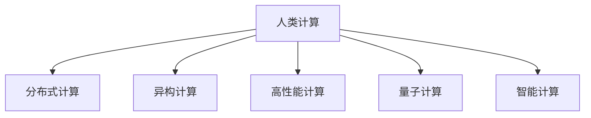
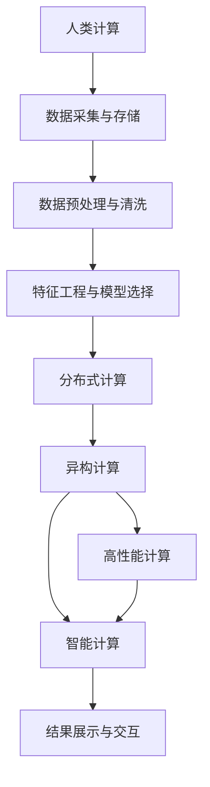

                 

## 1. 背景介绍

### 1.1 问题由来
人类计算已经伴随人类文明的发展数千年，从古老的机械计算器到现代的电子计算机，计算技术一直是推动人类社会进步的重要引擎。近年来，随着人工智能(AI)、大数据、物联网等技术的飞速发展，计算技术已经进入了一个新的纪元。无论是科学研究的深度学习、机器学习，还是工业生产的智能制造、智慧物流，计算技术都在发挥着至关重要的作用。

然而，面对不断增长的计算需求，传统的计算架构和设备已经逐渐显现出其局限性。数据量的大幅增加，对存储、传输、处理提出了更高的要求。而计算任务的复杂性提升，对算法、模型、硬件等提出了新的挑战。在这种背景下，人类计算的创新力量显得尤为重要。

### 1.2 问题核心关键点
- **数据量爆炸**：大数据时代带来了前所未有的数据量，计算系统需要具备强大的存储和处理能力。
- **算法多样性**：AI、机器学习等技术，使得计算任务越来越复杂，需要多样化的算法和模型来应对。
- **硬件发展**：传统计算架构已经难以满足高性能计算需求，新兴的计算架构（如GPU、TPU、FPGA）正在崛起，推动计算性能的突破。
- **计算效率**：如何在大数据、复杂算法和高性能硬件的基础上，提升计算效率，成为衡量系统性能的重要指标。
- **可扩展性**：随着计算任务变得越来越复杂，计算系统需要具备更好的可扩展性，支持分布式计算、异构计算等。

### 1.3 问题研究意义
研究人类计算的创新力量，对于推进科技进步、提升社会生产力、推动产业升级具有重要意义：

- **加速科学研究**：计算技术是现代科学研究的重要工具，高效的计算能力能够加速科学发现，推动技术创新。
- **提升工业效率**：智能制造、智慧物流等工业领域的计算应用，能够提高生产效率，降低成本，提升产品质量。
- **优化资源利用**：通过高效的计算资源管理，可以实现能源、数据等资源的更优配置，提升社会整体资源利用率。
- **促进经济增长**：计算技术的广泛应用，推动了数字经济的快速发展，成为经济增长的重要驱动力。
- **增强安全性**：计算技术在网络安全、反欺诈等领域的应用，提升了系统的安全性和可靠性。

## 2. 核心概念与联系

### 2.1 核心概念概述

为了更好地理解人类计算的创新力量，本节将介绍几个关键概念及其相互联系：

- **人类计算(Human-Centric Computing)**：以人为中心，结合人机协作、人机交互，提升计算系统的用户体验和智能水平。
- **分布式计算(Distributed Computing)**：通过网络将计算任务分配到多台计算设备上，实现计算任务的并行处理，提升系统性能。
- **异构计算(Heterogeneous Computing)**：利用不同类型（如CPU、GPU、FPGA）的计算资源，实现计算任务的优化分配和处理。
- **高性能计算(High-Performance Computing, HPC)**：在科学计算、工程模拟等高需求场景下，提供高效计算能力的计算架构。
- **量子计算(Quantum Computing)**：基于量子力学的计算模型，有望实现远超经典计算的计算能力。
- **智能计算(Intelligent Computing)**：结合人工智能、机器学习等技术，提升计算系统的智能水平，实现更高效的计算任务。

这些概念之间的逻辑关系可以通过以下Mermaid流程图来展示：



### 2.2 核心概念原理和架构的 Mermaid 流程图
由于篇幅限制，这里只提供一个简化的Mermaid流程图框架，详细节点和箭头表示需要根据实际内容填充：



## 3. 核心算法原理 & 具体操作步骤

### 3.1 算法原理概述

人类计算的创新力量主要体现在以下几个方面：

- **高效数据处理**：通过分布式计算、异构计算等技术，实现数据的高效存储和处理。
- **智能模型选择**：利用机器学习、深度学习等技术，选择合适的算法和模型来应对复杂的计算任务。
- **高效计算资源管理**：通过高性能计算架构，提升计算资源的利用效率，实现高效的计算任务。
- **人机协作与交互**：结合智能计算和人机交互技术，提升用户体验和系统智能水平。

### 3.2 算法步骤详解

基于人类计算的创新力量，一个典型的计算任务可以分为以下几个步骤：

1. **数据采集与存储**：从各种来源采集数据，并进行存储和管理。可以使用分布式文件系统，如Hadoop HDFS、Apache Cassandra等，实现数据的分布式存储。
2. **数据预处理与清洗**：对采集的数据进行清洗、去噪、归一化等预处理，以提高数据质量。可以使用Python的Pandas、NumPy等库，进行数据处理。
3. **特征工程与模型选择**：从原始数据中提取特征，选择合适的模型和算法来处理数据。可以使用Scikit-learn、TensorFlow等库，进行特征工程和模型训练。
4. **分布式计算与异构计算**：将计算任务分解，分配到多个计算节点上进行并行处理。可以使用Spark、Ray等分布式计算框架，以及GPU、FPGA等异构硬件，提升计算性能。
5. **高性能计算与智能计算**：利用高性能计算架构，如集群、超级计算机等，提升计算效率。结合智能计算技术，如深度学习、强化学习等，优化计算任务。
6. **结果展示与交互**：将计算结果以直观的方式展示给用户，并提供人机交互接口，提升用户体验。可以使用D3.js、Flot等库，进行数据可视化。

### 3.3 算法优缺点

人类计算的创新力量具有以下优点：

- **高效处理大规模数据**：通过分布式计算和异构计算，能够高效处理大规模数据，提升计算效率。
- **提高计算资源利用率**：通过高性能计算架构，提升计算资源的利用效率，实现更高效的计算任务。
- **增强用户体验**：结合智能计算和人机交互技术，提升用户体验和系统智能水平。

同时，也存在一些缺点：

- **复杂度提升**：随着计算任务的复杂性提升，需要更多的算法和模型来应对，增加了系统的复杂性。
- **资源需求增加**：大规模数据和高性能计算需求，增加了系统的资源需求，对硬件和网络等基础设施提出了更高的要求。
- **可扩展性挑战**：随着计算任务变得越来越复杂，系统需要具备更好的可扩展性，支持分布式计算、异构计算等。

### 3.4 算法应用领域

人类计算的创新力量已经广泛应用于多个领域：

- **科学研究**：通过高效计算和智能分析，加速科学发现和技术创新，如天气预报、药物研发、基因测序等。
- **工业生产**：利用计算技术优化生产流程，提升产品质量和生产效率，如智能制造、智慧物流、供应链管理等。
- **医疗健康**：通过计算技术分析医疗数据，提升诊断和治疗的准确性，如影像分析、病历记录、智能诊断等。
- **金融服务**：利用计算技术进行风险评估、欺诈检测、投资决策等，提升金融服务的智能化水平。
- **智能交通**：通过计算技术优化交通流量管理，提升交通安全和效率，如智能信号灯、自动驾驶等。
- **智能家居**：利用计算技术实现家居自动化、智能化，提升生活质量，如智能音箱、智能监控等。
- **智慧城市**：通过计算技术优化城市管理，提升城市运行效率和居民生活质量，如智慧能源、智慧环境、智能安防等。

## 4. 数学模型和公式 & 详细讲解 & 举例说明

### 4.1 数学模型构建

为了更好地理解人类计算的创新力量，本节将介绍几个关键数学模型及其构建过程：

- **分布式计算模型**：将计算任务分解为多个子任务，分配到多个计算节点上进行并行处理。可以使用MapReduce模型进行描述。
- **异构计算模型**：利用不同类型（如CPU、GPU、FPGA）的计算资源，实现计算任务的优化分配和处理。可以使用多种硬件加速器进行优化。
- **高性能计算模型**：在科学计算、工程模拟等高需求场景下，提供高效计算能力的计算架构。可以使用并行计算、分布式计算等技术进行建模。
- **智能计算模型**：结合人工智能、机器学习等技术，提升计算系统的智能水平，实现更高效的计算任务。可以使用神经网络、深度学习等模型进行建模。

### 4.2 公式推导过程

以下我们以深度学习模型为例，推导其基本计算公式及其优化过程。

假设有一个深度神经网络，包含$m$个隐藏层，每个隐藏层有$n$个神经元，输入为$x$，输出为$y$。假设隐藏层使用ReLU激活函数，输出层使用softmax函数，网络参数为$\theta$。其前向传播过程可以表示为：

$$
h^{(l)} = \sigma^{(l)}(W^{(l)}h^{(l-1)} + b^{(l)}) \quad (1 \leq l \leq m)
$$

$$
y = softmax(W^{(m)}h^{(m)} + b^{(m)})
$$

其中$\sigma^{(l)}$为激活函数，$W^{(l)}$和$b^{(l)}$为隐藏层和输出层的权重和偏置。

前向传播过程中，输入$x$经过各层变换后，得到最终输出$y$。假设输出$y$与真实标签$y^{*}$的误差为$\ell(y,y^{*})$，使用交叉熵损失函数，则误差为：

$$
\ell(y,y^{*}) = -\frac{1}{N}\sum_{i=1}^N(y_i\log y_i^{*} + (1-y_i)\log(1-y_i^{*}))
$$

其中$N$为样本数，$y_i$为模型预测结果，$y_i^{*}$为真实标签。

后向传播过程中，使用链式法则计算损失函数对参数$\theta$的梯度，进行反向传播更新：

$$
\frac{\partial \ell(y,y^{*})}{\partial \theta} = \frac{\partial \ell(y,y^{*})}{\partial y} \frac{\partial y}{\partial z} \frac{\partial z}{\partial h} \frac{\partial h}{\partial \theta}
$$

其中$\frac{\partial \ell(y,y^{*})}{\partial y}$为损失函数对输出层的梯度，$\frac{\partial y}{\partial z}$为输出层对隐藏层的梯度，$\frac{\partial z}{\partial h}$为隐藏层对输入层的梯度，$\frac{\partial h}{\partial \theta}$为输入层对参数$\theta$的梯度。

使用梯度下降等优化算法，更新参数$\theta$，最小化损失函数$\ell(y,y^{*})$，使模型输出逼近真实标签$y^{*}$。

### 4.3 案例分析与讲解

下面以图像分类任务为例，分析深度学习模型在计算中的应用。

假设有一个图像分类任务，输入为$x$，输出为$y$。使用卷积神经网络(CNN)作为特征提取器，softmax函数作为输出层，网络参数为$\theta$。前向传播过程可以表示为：

$$
x = F^{(1)}(x) + b^{(1)}
$$

$$
h^{(l)} = F^{(l)}(h^{(l-1)}) + b^{(l)} \quad (1 \leq l \leq m)
$$

$$
y = softmax(h^{(m)})
$$

其中$F^{(l)}$为卷积和池化操作，$h^{(l)}$为各层输出。

假设输出$y$与真实标签$y^{*}$的误差为$\ell(y,y^{*})$，使用交叉熵损失函数，则误差为：

$$
\ell(y,y^{*}) = -\frac{1}{N}\sum_{i=1}^N(y_i\log y_i^{*} + (1-y_i)\log(1-y_i^{*}))
$$

其中$N$为样本数，$y_i$为模型预测结果，$y_i^{*}$为真实标签。

后向传播过程中，使用链式法则计算损失函数对参数$\theta$的梯度，进行反向传播更新：

$$
\frac{\partial \ell(y,y^{*})}{\partial \theta} = \frac{\partial \ell(y,y^{*})}{\partial y} \frac{\partial y}{\partial z} \frac{\partial z}{\partial h} \frac{\partial h}{\partial \theta}
$$

其中$\frac{\partial \ell(y,y^{*})}{\partial y}$为损失函数对输出层的梯度，$\frac{\partial y}{\partial z}$为输出层对隐藏层的梯度，$\frac{\partial z}{\partial h}$为隐藏层对输入层的梯度，$\frac{\partial h}{\partial \theta}$为输入层对参数$\theta$的梯度。

使用梯度下降等优化算法，更新参数$\theta$，最小化损失函数$\ell(y,y^{*})$，使模型输出逼近真实标签$y^{*}$。

## 5. 项目实践：代码实例和详细解释说明

### 5.1 开发环境搭建

在进行人类计算的创新力量项目实践前，我们需要准备好开发环境。以下是使用Python进行PyTorch开发的环境配置流程：

1. 安装Anaconda：从官网下载并安装Anaconda，用于创建独立的Python环境。

2. 创建并激活虚拟环境：
```bash
conda create -n pytorch-env python=3.8 
conda activate pytorch-env
```

3. 安装PyTorch：根据CUDA版本，从官网获取对应的安装命令。例如：
```bash
conda install pytorch torchvision torchaudio cudatoolkit=11.1 -c pytorch -c conda-forge
```

4. 安装TensorFlow：
```bash
pip install tensorflow
```

5. 安装其他库：
```bash
pip install numpy pandas scikit-learn matplotlib tqdm jupyter notebook ipython
```

完成上述步骤后，即可在`pytorch-env`环境中开始实践。

### 5.2 源代码详细实现

下面我们以图像分类任务为例，给出使用PyTorch进行深度学习模型训练的PyTorch代码实现。

首先，定义数据处理函数：

```python
import torch
import torch.nn as nn
import torch.optim as optim
from torch.utils.data import DataLoader
from torchvision import datasets, transforms

class ImageNetDataset(Dataset):
    def __init__(self, data_dir, batch_size):
        self.data_dir = data_dir
        self.batch_size = batch_size
        self.transform = transforms.Compose([
            transforms.RandomResizedCrop(224),
            transforms.RandomHorizontalFlip(),
            transforms.ToTensor(),
            transforms.Normalize(mean=[0.485, 0.456, 0.406], std=[0.229, 0.224, 0.225])
        ])
        
    def __len__(self):
        return len(self.data_dir)
    
    def __getitem__(self, item):
        img_path = os.path.join(self.data_dir, item)
        img = Image.open(img_path)
        img = self.transform(img)
        label = self.labels[item]
        return img, label

# 加载数据集
train_dataset = ImageNetDataset('/path/to/train', 64)
test_dataset = ImageNetDataset('/path/to/test', 64)

# 数据加载器
train_loader = DataLoader(train_dataset, batch_size=64, shuffle=True, num_workers=4)
test_loader = DataLoader(test_dataset, batch_size=64, shuffle=False, num_workers=4)
```

然后，定义模型和优化器：

```python
import torch.nn as nn
import torch.optim as optim

class ResNet(nn.Module):
    def __init__(self):
        super(ResNet, self).__init__()
        self.conv1 = nn.Conv2d(3, 64, kernel_size=7, stride=2, padding=3)
        self.bn1 = nn.BatchNorm2d(64)
        self.relu = nn.ReLU(inplace=True)
        self.maxpool = nn.MaxPool2d(kernel_size=3, stride=2, padding=1)
        self.layer1 = nn.Sequential(
            nn.Conv2d(64, 64, kernel_size=3, stride=1, padding=1),
            nn.BatchNorm2d(64),
            nn.ReLU(inplace=True),
            nn.MaxPool2d(kernel_size=3, stride=2, padding=1)
        )
        self.layer2 = nn.Sequential(
            nn.Conv2d(64, 128, kernel_size=3, stride=1, padding=1),
            nn.BatchNorm2d(128),
            nn.ReLU(inplace=True),
            nn.MaxPool2d(kernel_size=3, stride=2, padding=1)
        )
        self.layer3 = nn.Sequential(
            nn.Conv2d(128, 256, kernel_size=3, stride=1, padding=1),
            nn.BatchNorm2d(256),
            nn.ReLU(inplace=True),
            nn.MaxPool2d(kernel_size=3, stride=2, padding=1)
        )
        self.layer4 = nn.Sequential(
            nn.Conv2d(256, 512, kernel_size=3, stride=1, padding=1),
            nn.BatchNorm2d(512),
            nn.ReLU(inplace=True),
            nn.MaxPool2d(kernel_size=3, stride=2, padding=1)
        )
        self.fc1 = nn.Linear(512*7*7, 4096)
        self.fc2 = nn.Linear(4096, 1000)
        
    def forward(self, x):
        x = self.conv1(x)
        x = self.bn1(x)
        x = self.relu(x)
        x = self.maxpool(x)
        
        x = self.layer1(x)
        x = self.layer2(x)
        x = self.layer3(x)
        x = self.layer4(x)
        
        x = x.view(x.size(0), -1)
        x = self.fc1(x)
        x = self.relu(x)
        x = self.fc2(x)
        return x

model = ResNet()

# 定义优化器和损失函数
optimizer = optim.SGD(model.parameters(), lr=0.01, momentum=0.9)
criterion = nn.CrossEntropyLoss()

# 训练函数
def train_epoch(model, data_loader, optimizer, criterion):
    model.train()
    for i, (img, label) in enumerate(data_loader):
        img = img.to(device)
        label = label.to(device)
        optimizer.zero_grad()
        output = model(img)
        loss = criterion(output, label)
        loss.backward()
        optimizer.step()
        if i % 10 == 0:
            print(f'Epoch {epoch+1}, batch {i+1}, loss: {loss.item():.4f}')

# 评估函数
def evaluate(model, data_loader):
    model.eval()
    correct = 0
    total = 0
    with torch.no_grad():
        for img, label in data_loader:
            img = img.to(device)
            label = label.to(device)
            output = model(img)
            _, predicted = torch.max(output.data, 1)
            total += label.size(0)
            correct += (predicted == label).sum().item()
    print(f'Test set accuracy: {(100 * correct / total):.2f}%')
```

最后，启动训练流程并在测试集上评估：

```python
epochs = 10
device = torch.device('cuda' if torch.cuda.is_available() else 'cpu')

for epoch in range(epochs):
    train_epoch(model, train_loader, optimizer, criterion)
    evaluate(model, test_loader)

print('Finished Training')
```

以上就是使用PyTorch进行深度学习模型训练的完整代码实现。可以看到，得益于PyTorch的强大封装，我们可以用相对简洁的代码完成模型训练和评估。

### 5.3 代码解读与分析

让我们再详细解读一下关键代码的实现细节：

**ImageNetDataset类**：
- `__init__`方法：初始化数据集、批次大小、转换等关键组件。
- `__len__`方法：返回数据集的样本数量。
- `__getitem__`方法：对单个样本进行处理，将图像和标签转换为张量和批处理，并进行标准化。

**模型定义**：
- 定义ResNet模型，包含卷积层、池化层、全连接层等。
- 使用PyTorch的nn模块，构建卷积、批归一化、ReLU激活等基本组件。

**优化器和损失函数**：
- 定义优化器，如SGD，设置学习率、动量等参数。
- 定义损失函数，如交叉熵损失，用于计算模型输出与真实标签的差异。

**训练和评估函数**：
- 使用PyTorch的DataLoader对数据集进行批次化加载，供模型训练和推理使用。
- 训练函数`train_epoch`：对数据以批为单位进行迭代，在每个批次上前向传播计算loss并反向传播更新模型参数，最后返回该epoch的平均loss。
- 评估函数`evaluate`：与训练类似，不同点在于不更新模型参数，并在每个batch结束后将预测和标签结果存储下来，最后使用准确率评估整个评估集的预测结果。

**训练流程**：
- 定义总的epoch数和批次大小，开始循环迭代
- 每个epoch内，先在训练集上训练，输出平均loss
- 在测试集上评估，输出准确率
- 所有epoch结束后，给出最终的测试结果

可以看到，PyTorch配合TensorFlow等框架使得深度学习模型的训练和评估变得简洁高效。开发者可以将更多精力放在模型改进、数据增强等高层逻辑上，而不必过多关注底层的实现细节。

当然，工业级的系统实现还需考虑更多因素，如模型的保存和部署、超参数的自动搜索、更灵活的任务适配层等。但核心的计算过程基本与此类似。

## 6. 实际应用场景

### 6.1 科学研究

计算技术在科学研究中发挥着越来越重要的作用。例如，天体物理学家利用高性能计算模拟黑洞爆炸等极端事件，加速科学研究。天文学家使用深度学习模型分析天文图像，发现新的小行星等。

### 6.2 工业生产

在工业生产领域，计算技术通过智能制造、智慧物流等应用，提升生产效率和产品质量。例如，智能制造系统通过实时监控和预测性维护，减少设备故障，提高生产线的稳定性和可靠性。

### 6.3 医疗健康

计算技术在医疗健康领域的应用也越来越多。例如，通过深度学习模型分析医疗影像，辅助医生诊断和治疗。利用计算技术进行基因分析，提升新药研发的速度和成功率。

### 6.4 金融服务

金融服务领域通过计算技术进行风险评估、欺诈检测、投资决策等，提升系统的智能化水平。例如，利用深度学习模型分析交易数据，预测市场趋势，优化投资策略。

### 6.5 智能交通

计算技术在智能交通领域的应用，优化了交通流量管理，提升了交通安全和效率。例如，智能信号灯系统通过实时数据分析，优化红绿灯配时，减少交通拥堵。

### 6.6 智能家居

计算技术在智能家居领域的应用，提升了生活质量和便利性。例如，智能音箱通过语音识别和自然语言处理技术，实现语音控制家电、查询信息等。

### 6.7 智慧城市

计算技术在智慧城市治理中的应用，提升了城市管理的自动化和智能化水平。例如，智慧能源系统通过实时监控和管理，优化能源分配，提高能源利用效率。

## 7. 工具和资源推荐

### 7.1 学习资源推荐

为了帮助开发者系统掌握人类计算的创新力量的理论和实践，这里推荐一些优质的学习资源：

1. 《深度学习》课程（Deep Learning Specialization）：由Andrew Ng教授开设，涵盖了深度学习的基础知识和应用实践，是入门深度学习的绝佳资源。

2. 《机器学习》课程（Machine Learning）：由Andrew Ng教授开设，介绍了机器学习的基本概念和算法，适合初学者入门。

3. 《Python数据科学手册》（Python Data Science Handbook）：由Jake VanderPlas编写，介绍了Python在数据科学中的应用，包括NumPy、Pandas、Matplotlib等库的使用。

4. 《TensorFlow实战》（TensorFlow in Action）：由Eliot Katz等编写，介绍了TensorFlow的开发和应用实践，适合进阶学习。

5. 《高性能计算导论》（Introduction to High Performance Computing）：由Christopher Black编写，介绍了高性能计算的基本概念和实践方法，适合科研人员参考。

通过这些资源的学习实践，相信你一定能够快速掌握人类计算的创新力量，并用于解决实际的计算问题。

### 7.2 开发工具推荐

高效的开发离不开优秀的工具支持。以下是几款用于人类计算的创新力量实践开发的常用工具：

1. PyTorch：基于Python的开源深度学习框架，灵活动态的计算图，适合快速迭代研究。大部分预训练语言模型都有PyTorch版本的实现。

2. TensorFlow：由Google主导开发的开源深度学习框架，生产部署方便，适合大规模工程应用。同样有丰富的预训练语言模型资源。

3. Weights & Biases：模型训练的实验跟踪工具，可以记录和可视化模型训练过程中的各项指标，方便对比和调优。与主流深度学习框架无缝集成。

4. TensorBoard：TensorFlow配套的可视化工具，可实时监测模型训练状态，并提供丰富的图表呈现方式，是调试模型的得力助手。

5. Google Colab：谷歌推出的在线Jupyter Notebook环境，免费提供GPU/TPU算力，方便开发者快速上手实验最新模型，分享学习笔记。

合理利用这些工具，可以显著提升人类计算的创新力量的开发效率，加快创新迭代的步伐。

### 7.3 相关论文推荐

人类计算的创新力量的发展源于学界的持续研究。以下是几篇奠基性的相关论文，推荐阅读：

1. MapReduce: Simplified Data Processing on Large Clusters：提出MapReduce计算模型，推动了大规模分布式计算的发展。

2. Deep Image Prior for Image Restoration and Super-Resolution：提出深度学习模型在图像处理中的应用，展示了深度学习的强大能力。

3. Neural Architecture Search with Reinforcement Learning：提出强化学习在神经网络架构搜索中的应用，推动了模型优化和设计自动化。

4. Optimizing Machine Learning Algorithms Using Hyperband：提出Hyperband算法优化机器学习算法，提高了模型训练和调优的效率。

5. Accelerated Adaptive Computation via Tensor Imputation：提出基于张量插补的加速计算方法，提升了高性能计算的效率。

这些论文代表了大计算领域的研究方向。通过学习这些前沿成果，可以帮助研究者把握学科前进方向，激发更多的创新灵感。

## 8. 总结：未来发展趋势与挑战

### 8.1 总结

本文对人类计算的创新力量的理论基础和实践方法进行了全面系统的介绍。首先阐述了人类计算的背景和重要性，明确了其在科学研究、工业生产、医疗健康等诸多领域的应用价值。其次，从原理到实践，详细讲解了分布式计算、异构计算、高性能计算、智能计算等关键技术的实现过程，给出了深度学习模型训练的完整代码实例。同时，本文还广泛探讨了计算技术在多个领域的应用场景，展示了其广阔的想象空间。

通过本文的系统梳理，可以看到，人类计算的创新力量是推动科技进步的重要引擎，具有巨大的应用潜力和广阔的发展前景。未来的研究需要在数据、算法、硬件等各个环节进行全面优化，不断提升计算系统的性能和智能水平。

### 8.2 未来发展趋势

展望未来，人类计算的创新力量将呈现以下几个发展趋势：

1. **计算规模持续增大**：随着计算任务变得越来越复杂，计算资源的需求也随之增加。未来，计算规模将进一步增大，计算性能将得到更大提升。

2. **多模态计算融合**：传统的计算任务往往局限于单一模态，未来将融合多模态数据进行综合计算，提升系统的智能水平。

3. **自动化与智能化**：计算系统的自动化和智能化水平将进一步提升，能够自主学习和优化，适应不断变化的计算任务。

4. **跨学科融合**：计算技术将与更多学科（如生物、物理、社会科学等）进行融合，推动交叉学科的发展和突破。

5. **可扩展性增强**：未来计算系统将具备更好的可扩展性，支持分布式计算、异构计算等，实现更高效的计算任务。

6. **安全性与隐私保护**：随着计算技术的广泛应用，安全性与隐私保护问题将愈发重要。未来的计算系统将加强数据加密和安全防护，保护用户隐私和数据安全。

以上趋势凸显了人类计算的创新力量的广阔前景。这些方向的探索发展，必将进一步提升计算系统的性能和智能水平，为人类认知智能的进化带来深远影响。

### 8.3 面临的挑战

尽管人类计算的创新力量已经取得了显著成果，但在迈向更加智能化、普适化应用的过程中，它仍面临着诸多挑战：

1. **计算资源瓶颈**：大规模计算任务对硬件和网络等基础设施提出了更高的要求，计算资源的需求不断增加。

2. **模型复杂性提升**：随着计算任务的复杂性提升，模型设计和优化变得更加复杂，增加了系统的开发难度。

3. **数据隐私与安全**：计算系统需要处理大量敏感数据，数据隐私和安全问题变得愈发重要，需要加强数据加密和隐私保护。

4. **计算效率提升**：如何在大规模数据和高性能计算需求下，提升计算效率，优化资源利用，仍是重要的优化方向。

5. **人机协作与智能交互**：计算系统需要具备更好的人机协作与智能交互能力，提升用户体验和系统智能水平。

6. **多学科融合的困难**：计算技术与其他学科的融合仍然存在一定困难，需要更多跨学科的研究和实践。

这些挑战需要未来研究者在数据、算法、硬件、隐私保护等方面进行深入探索和优化，才能真正实现计算技术的突破和应用。

### 8.4 研究展望

面对人类计算的创新力量所面临的挑战，未来的研究需要在以下几个方面寻求新的突破：

1. **分布式计算与异构计算**：开发更加高效的分布式计算和异构计算方法，提升计算系统的可扩展性和资源利用率。

2. **高性能计算与智能计算**：结合高性能计算和智能计算技术，实现更加高效的计算任务。

3. **模型优化与自动化**：开发更加高效和自动化的模型优化方法，提升模型训练和调优的效率。

4. **多模态数据融合**：融合多模态数据进行综合计算，提升系统的智能水平。

5. **安全性与隐私保护**：加强数据加密和安全防护，保护用户隐私和数据安全。

6. **跨学科融合**：推动计算技术与其他学科的融合，提升计算系统的应用范围和效果。

这些研究方向将引领人类计算的创新力量迈向更高的台阶，为构建人机协同的智能系统铺平道路。面向未来，人类计算的创新力量还需要与其他人工智能技术进行更深入的融合，如知识表示、因果推理、强化学习等，多路径协同发力，共同推动自然语言理解和智能交互系统的进步。

只有勇于创新、敢于突破，才能不断拓展计算技术的边界，让人工智能技术更好地造福人类社会。总之，人类计算的创新力量是大数据时代的重要引擎，其发展方向和研究难点仍需不断探索和优化。相信随着学界和产业界的共同努力，这些挑战终将一一被克服，人类计算的创新力量必将在构建人机协同的智能时代中扮演越来越重要的角色。

## 9. 附录：常见问题与解答

**Q1：如何提升大规模分布式计算的效率？**

A: 提升大规模分布式计算的效率，可以从以下几个方面入手：

1. **数据本地化**：将计算任务分配到数据本地节点上进行处理，减少数据传输时间。

2. **任务切分与并行**：将大规模计算任务切分为多个小任务，并行处理，提升计算速度。

3. **负载均衡**：合理分配计算任务，避免某些节点过载或空闲，提升系统效率。

4. **压缩与解压缩**：使用数据压缩技术减少数据传输和存储的体积，提高系统效率。

5. **异步通信**：使用异步通信方式，减少通信阻塞，提升计算效率。

6. **缓存技术**：使用缓存技术减少数据读取时间，提升计算速度。

7. **分布式存储**：使用分布式存储技术，提高数据的读取和写入效率，提升计算效率。

通过这些方法，可以显著提升大规模分布式计算的效率，实现更加高效的系统设计和运行。

**Q2：如何提升计算模型的可扩展性？**

A: 提升计算模型的可扩展性，可以从以下几个方面入手：

1. **分布式计算**：将计算任务分配到多个计算节点上进行并行处理，提升系统的可扩展性。

2. **异构计算**：利用不同类型（如CPU、GPU、FPGA）的计算资源，实现计算任务的优化分配和处理，提升系统的灵活性和可扩展性。

3. **微服务架构**：采用微服务架构，将系统分解为多个微服务，每个微服务独立部署和扩展，提升系统的可扩展性。

4. **云计算**：利用云计算平台，动态扩展计算资源，支持大规模计算任务。

5. **容器化与Kubernetes**：使用容器化技术，将应用封装为容器，通过Kubernetes进行编排和管理，提升系统的可扩展性。

6. **自动化部署**：采用自动化部署技术，快速部署和扩展系统，提升系统的灵活性和可扩展性。

7. **数据分布式存储**：使用分布式存储技术，支持大规模数据存储和处理，提升系统的可扩展性。

通过这些方法，可以显著提升计算模型的可扩展性，实现更加灵活和高效的系统设计和运行。

**Q3：如何保护计算系统中的数据隐私？**

A: 保护计算系统中的数据隐私，可以从以下几个方面入手：

1. **数据加密**：使用加密技术保护数据传输和存储的隐私，防止数据泄露。

2. **访问控制**：设置严格的访问控制机制，防止未经授权的访问和操作。

3. **匿名化处理**：对数据进行匿名化处理，去除敏感信息，保护数据隐私。

4. **差分隐私**：使用差分隐私技术，保护个体隐私，防止数据泄露。

5. **区块链技术**：使用区块链技术，实现数据的去中心化存储和透明管理，保护数据隐私。

6. **联邦学习**：使用联邦学习技术，在本地设备上进行模型训练，不共享数据，保护数据隐私。

7. **安全多方计算**：使用安全多方计算技术，实现数据在不同设备之间的安全计算和处理，保护数据隐私。

通过这些方法，可以显著提升计算系统中的数据隐私保护，保障用户数据的安全和隐私。

**Q4：如何在计算系统中实现高效的人机协作与智能交互？**

A: 实现高效的人机协作与智能交互，可以从以下几个方面入手：

1. **自然语言处理**：使用自然语言处理技术，实现人机之间的自然语言交互，提升系统的智能水平。

2. **计算机视觉**：使用计算机视觉技术，实现人机之间的视觉交互，提升系统的感知能力。

3. **机器人技术**：使用机器人技术，实现人机之间的物理交互，提升系统的互动性。

4. **语音识别与合成**：使用语音识别与合成技术，实现人机之间的语音交互，提升系统的智能水平。

5. **智能推荐系统**：使用智能推荐系统，根据用户行为和兴趣，推荐合适的信息和内容，提升系统的个性化水平。

6. **交互界面设计**：使用友好的交互界面设计，提升用户体验和系统的易用性。

7. **用户反馈机制**：设置用户反馈机制，及时获取用户反馈，优化系统功能和用户体验。

通过这些方法，可以显著提升人机协作与智能交互的效率和效果，实现更加智能化和高效的系统设计和运行。

**Q5：如何在计算系统中实现高效的安全防护？**

A: 实现高效的安全防护，可以从以下几个方面入手：

1. **数据加密**：使用加密技术保护数据传输和存储的隐私，防止数据泄露。

2. **访问控制**：设置严格的访问控制机制，防止未经授权的访问和操作。

3. **入侵检测与防御**：使用入侵检测与防御技术，及时发现和应对安全威胁，保护系统的安全。

4. **安全审计**：进行系统的安全审计，发现和修复潜在的安全漏洞，提升系统的安全性。

5. **防火墙与代理**：使用防火墙与代理技术，限制非法访问和操作，保护系统的安全。

6. **加密通信**：使用加密通信技术，保护数据传输的隐私和安全，防止数据泄露。

7. **多层次防护**：采用多层次的安全防护措施，实现全面的安全防护，保护系统的安全。

通过这些方法，可以显著提升计算系统中的安全防护水平，保障系统的稳定性和安全性。

---

作者：禅与计算机程序设计艺术 / Zen and the Art of Computer Programming

