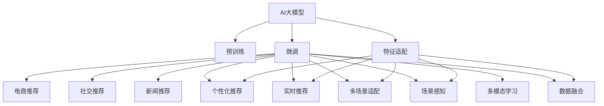

                 

# 推荐系统中AI大模型的多场景适配

> 关键词：AI大模型, 推荐系统, 多场景适配, 场景感知, 个性化推荐, 深度学习, 推荐算法, 推荐模型, 工业应用, 数据融合

## 1. 背景介绍

### 1.1 问题由来
随着信息技术的迅猛发展，互联网时代迎来了大数据的浪潮，推荐系统作为提高用户体验、提升平台价值的重要工具，在电商、社交、新闻、视频等众多领域得到了广泛应用。传统的推荐系统主要依赖于手工设计的特征，通过机器学习算法进行模型训练和预测，然而在数据量和特征维度急剧膨胀的背景下，手工特征工程变得越来越困难，而深度学习大模型（Large Models）的兴起为推荐系统带来了新的活力。

AI大模型通常指具有数十亿甚至数百亿参数的深度学习模型，如GPT、BERT、XLNet等。这些模型在预训练阶段通过大规模无标签数据进行自监督学习，学习到丰富的语言或视觉知识，从而在各种NLP和CV任务中取得了州际的性能。而将大模型应用于推荐系统，通过微调可以使其适应特定领域的特征和任务，从而更好地服务于用户的个性化需求。

### 1.2 问题核心关键点
AI大模型在推荐系统中的应用，其核心关键点包括：
- 场景感知与特征适配：如何将通用的预训练知识适配到具体的推荐场景中，同时保留部分场景特定的知识。
- 数据融合与多模态学习：如何有效融合用户行为数据、内容数据、社交数据等多源数据，进行多模态学习。
- 个性化推荐与实时性：如何在保证个性化推荐的同时，提高推荐模型的实时性。
- 效果评估与优化：如何设计合理的推荐效果评估指标，并进行优化迭代。

这些关键问题直接关系到AI大模型在推荐系统中的实际效果和应用价值。

### 1.3 问题研究意义
研究AI大模型在推荐系统中的应用，对于推动推荐系统的智能化发展，提升用户体验，以及加速AI技术的产业化进程具有重要意义：
1. 提升推荐精度：大模型能够学习到更深层次的知识，提升推荐系统的推荐精度和个性化水平。
2. 降低开发成本：相比于传统机器学习推荐系统，大模型能够在少量标注数据上进行微调，显著降低开发和标注成本。
3. 加速创新应用：大模型的预训练和微调过程为推荐系统的创新应用提供了新的工具和方法，可以更快地适应新场景。
4. 促进产业升级：大模型的广泛应用可以加速推荐系统在电商、社交、新闻等领域的普及，提升平台价值和用户体验。

## 2. 核心概念与联系

### 2.1 核心概念概述

为更好地理解AI大模型在推荐系统中的应用，本节将介绍几个密切相关的核心概念：

- AI大模型（Large Models）：以自回归（如GPT）或自编码（如BERT）模型为代表的大规模预训练模型。通过在大规模无标签文本或图像数据上进行预训练，学习到通用的语言或视觉知识。
- 推荐系统（Recommendation System）：根据用户历史行为数据和内容数据，为用户推荐感兴趣的商品或内容。推荐系统分为基于协同过滤、基于内容推荐、基于混合推荐等不同策略。
- 多场景适配（Multiscene Adaptation）：针对不同的推荐场景（如电商、社交、新闻等），对通用预训练模型进行微调，保留或去除特定场景的知识。
- 场景感知（Scene-Awareness）：通过设计特定的任务或数据集，训练模型具备场景感知能力，在特定场景下自动调整其行为。
- 多模态学习（Multimodal Learning）：结合用户行为数据、内容数据、社交数据等多源数据，进行跨模态特征融合，提升推荐系统的表现。
- 个性化推荐（Personalized Recommendation）：根据用户的偏好和历史行为数据，推荐符合用户兴趣的商品或内容。
- 实时性（Real-Time）：推荐系统需要能够快速响应用户请求，生成推荐结果。
- 数据融合（Data Fusion）：将不同来源的数据进行有效整合，提升推荐模型的准确性。

这些核心概念之间的逻辑关系可以通过以下Mermaid流程图来展示：



这个流程图展示了大模型的核心概念及其与推荐系统之间的关系：

1. 大模型通过预训练获得基础能力。
2. 微调是大模型适配特定推荐场景的必要步骤。
3. 多场景适配涉及到场景感知、多模态学习、特征适配等多个环节。
4. 多场景适配中的场景感知、多模态学习等过程需要数据融合和特征适配的支持。
5. 场景感知和多模态学习进一步增强了个性化推荐和实时性。

这些概念共同构成了AI大模型在推荐系统中的应用框架，使其能够在各种场景下发挥强大的推荐能力。通过理解这些核心概念，我们可以更好地把握AI大模型在推荐系统中的工作原理和优化方向。

## 3. 核心算法原理 & 具体操作步骤
### 3.1 算法原理概述

AI大模型在推荐系统中的应用，本质上是将预训练的大模型作为通用的"特征提取器"，通过微调学习特定推荐场景下的任务特征，从而生成个性化推荐。具体而言，AI大模型在预训练阶段通过自监督学习任务（如语言模型、图像分类等）学习到通用的语言或视觉知识。在推荐系统应用中，通过微调学习用户行为、商品特征等特定领域的知识，使其能够生成符合用户需求的推荐结果。

形式化地，假设预训练模型为 $M_{\theta}$，其中 $\theta$ 为预训练得到的模型参数。给定推荐场景 $S$ 和标注数据集 $D=\{(x_i,y_i)\}_{i=1}^N, x_i \in \mathcal{X}, y_i \in \mathcal{Y}$，其中 $\mathcal{X}$ 为输入空间，$\mathcal{Y}$ 为输出空间。微调的目标是找到新的模型参数 $\hat{\theta}$，使得：

$$
\hat{\theta}=\mathop{\arg\min}_{\theta} \mathcal{L}(M_{\theta},D)
$$

其中 $\mathcal{L}$ 为针对推荐任务设计的损失函数，用于衡量模型预测输出与真实标签之间的差异。常见的损失函数包括交叉熵损失、均方误差损失等。

通过梯度下降等优化算法，微调过程不断更新模型参数 $\theta$，最小化损失函数 $\mathcal{L}$，使得模型输出逼近真实标签。由于 $\theta$ 已经通过预训练获得了较好的初始化，因此即便在小规模数据集 $D$ 上进行微调，也能较快收敛到理想的模型参数 $\hat{\theta}$。

### 3.2 算法步骤详解

AI大模型在推荐系统中的应用，通常包括以下几个关键步骤：

**Step 1: 准备预训练模型和数据集**
- 选择合适的预训练语言模型 $M_{\theta}$ 作为初始化参数，如 BERT、GPT 等。
- 准备推荐场景 $S$ 的标注数据集 $D$，划分为训练集、验证集和测试集。一般要求标注数据与预训练数据的分布不要差异过大。

**Step 2: 添加推荐任务适配层**
- 根据推荐场景类型，在预训练模型顶层设计合适的输出层和损失函数。
- 对于推荐任务，通常使用交叉熵损失函数，使得模型输出逼近真实的推荐标签。

**Step 3: 设置微调超参数**
- 选择合适的优化算法及其参数，如 AdamW、SGD 等，设置学习率、批大小、迭代轮数等。
- 设置正则化技术及强度，包括权重衰减、Dropout、Early Stopping 等。
- 确定冻结预训练参数的策略，如仅微调顶层，或全部参数都参与微调。

**Step 4: 执行梯度训练**
- 将训练集数据分批次输入模型，前向传播计算损失函数。
- 反向传播计算参数梯度，根据设定的优化算法和学习率更新模型参数。
- 周期性在验证集上评估模型性能，根据性能指标决定是否触发 Early Stopping。
- 重复上述步骤直到满足预设的迭代轮数或 Early Stopping 条件。

**Step 5: 测试和部署**
- 在测试集上评估微调后模型 $M_{\hat{\theta}}$ 的性能，对比微调前后的精度提升。
- 使用微调后的模型对新样本进行推荐预测，集成到实际的应用系统中。
- 持续收集新的数据，定期重新微调模型，以适应数据分布的变化。

以上是AI大模型在推荐系统中的应用的一般流程。在实际应用中，还需要针对具体推荐场景的特点，对微调过程的各个环节进行优化设计，如改进训练目标函数，引入更多的正则化技术，搜索最优的超参数组合等，以进一步提升模型性能。

### 3.3 算法优缺点

AI大模型在推荐系统中的应用，具有以下优点：
1. 简单高效。只需准备少量标注数据，即可对预训练模型进行快速适配，获得较大的性能提升。
2. 通用适用。适用于各种推荐场景，包括电商、社交、新闻等，设计简单的推荐任务适配层即可实现微调。
3. 效果显著。AI大模型能够学习到更深层次的知识，提升推荐系统的推荐精度和个性化水平。
4. 参数高效。利用参数高效微调技术，在固定大部分预训练参数的情况下，仍可取得不错的提升。

同时，该方法也存在一定的局限性：
1. 依赖标注数据。微调的效果很大程度上取决于标注数据的质量和数量，获取高质量标注数据的成本较高。
2. 迁移能力有限。当推荐场景与预训练数据的分布差异较大时，微调的性能提升有限。
3. 负面效果传递。预训练模型的固有偏见、有害信息等，可能通过微调传递到推荐任务，造成负面影响。
4. 可解释性不足。微调模型的决策过程通常缺乏可解释性，难以对其推理逻辑进行分析和调试。

尽管存在这些局限性，但就目前而言，AI大模型微调方法仍是目前推荐系统的主流范式。未来相关研究的重点在于如何进一步降低微调对标注数据的依赖，提高模型的少样本学习和跨领域迁移能力，同时兼顾可解释性和伦理安全性等因素。

### 3.4 算法应用领域

AI大模型微调方法在推荐系统中的应用已经得到了广泛的应用，覆盖了电商推荐、社交推荐、新闻推荐、音乐推荐等多个推荐场景。具体而言：

- 电商推荐：通过分析用户历史行为和商品特征，为用户推荐符合其购买意向的商品。
- 社交推荐：根据用户兴趣和社交网络关系，推荐相关的内容或好友。
- 新闻推荐：基于用户浏览历史和新闻内容特征，推荐新闻文章或视频。
- 音乐推荐：根据用户听歌历史和歌曲特征，推荐符合用户偏好的音乐。

除了上述这些经典场景外，AI大模型微调还被创新性地应用于更多场景中，如基于多模态数据融合的推荐系统、基于生成对抗网络的推荐系统、基于因果推理的推荐系统等，为推荐系统带来了新的突破。随着AI大模型和微调方法的不断进步，相信推荐系统将在更广阔的应用领域大放异彩。

## 4. 数学模型和公式 & 详细讲解
### 4.1 数学模型构建

本节将使用数学语言对AI大模型在推荐系统中的应用进行更加严格的刻画。

记预训练模型为 $M_{\theta}$，其中 $\theta$ 为预训练得到的模型参数。假设推荐场景为 $S$，给定推荐场景的标注数据集 $D=\{(x_i,y_i)\}_{i=1}^N, x_i \in \mathcal{X}, y_i \in \mathcal{Y}$。

定义模型 $M_{\theta}$ 在数据样本 $(x,y)$ 上的损失函数为 $\ell(M_{\theta}(x),y)$，则在数据集 $D$ 上的经验风险为：

$$
\mathcal{L}(\theta) = \frac{1}{N}\sum_{i=1}^N \ell(M_{\theta}(x_i),y_i)
$$

微调的优化目标是最小化经验风险，即找到最优参数：

$$
\theta^* = \mathop{\arg\min}_{\theta} \mathcal{L}(\theta)
$$

在实践中，我们通常使用基于梯度的优化算法（如SGD、Adam等）来近似求解上述最优化问题。设 $\eta$ 为学习率，$\lambda$ 为正则化系数，则参数的更新公式为：

$$
\theta \leftarrow \theta - \eta \nabla_{\theta}\mathcal{L}(\theta) - \eta\lambda\theta
$$

其中 $\nabla_{\theta}\mathcal{L}(\theta)$ 为损失函数对参数 $\theta$ 的梯度，可通过反向传播算法高效计算。

### 4.2 公式推导过程

以下我们以电商平台推荐任务为例，推导交叉熵损失函数及其梯度的计算公式。

假设模型 $M_{\theta}$ 在输入 $x$ 上的输出为 $\hat{y}=M_{\theta}(x) \in [0,1]$，表示物品 $x$ 被购买的概率。真实标签 $y \in \{0,1\}$。则二分类交叉熵损失函数定义为：

$$
\ell(M_{\theta}(x),y) = -[y\log \hat{y} + (1-y)\log (1-\hat{y})]
$$

将其代入经验风险公式，得：

$$
\mathcal{L}(\theta) = -\frac{1}{N}\sum_{i=1}^N [y_i\log M_{\theta}(x_i)+(1-y_i)\log(1-M_{\theta}(x_i))]
$$

根据链式法则，损失函数对参数 $\theta_k$ 的梯度为：

$$
\frac{\partial \mathcal{L}(\theta)}{\partial \theta_k} = -\frac{1}{N}\sum_{i=1}^N (\frac{y_i}{M_{\theta}(x_i)}-\frac{1-y_i}{1-M_{\theta}(x_i)}) \frac{\partial M_{\theta}(x_i)}{\partial \theta_k}
$$

其中 $\frac{\partial M_{\theta}(x_i)}{\partial \theta_k}$ 可进一步递归展开，利用自动微分技术完成计算。

在得到损失函数的梯度后，即可带入参数更新公式，完成模型的迭代优化。重复上述过程直至收敛，最终得到适应推荐场景的最优模型参数 $\theta^*$。

## 5. 项目实践：代码实例和详细解释说明
### 5.1 开发环境搭建

在进行推荐系统开发前，我们需要准备好开发环境。以下是使用Python进行TensorFlow开发的环境配置流程：

1. 安装Anaconda：从官网下载并安装Anaconda，用于创建独立的Python环境。

2. 创建并激活虚拟环境：
```bash
conda create -n tf-env python=3.8 
conda activate tf-env
```

3. 安装TensorFlow：根据CUDA版本，从官网获取对应的安装命令。例如：
```bash
pip install tensorflow
```

4. 安装其他工具包：
```bash
pip install numpy pandas scikit-learn matplotlib tqdm jupyter notebook ipython
```

完成上述步骤后，即可在`tf-env`环境中开始推荐系统开发。

### 5.2 源代码详细实现

下面我们以电商平台推荐任务为例，给出使用TensorFlow进行模型微调的Python代码实现。

首先，定义推荐任务的数据处理函数：

```python
import tensorflow as tf
from tensorflow.keras import layers, models

class RecommenderSystem(tf.keras.Model):
    def __init__(self, num_users, num_items, num_features):
        super(RecommenderSystem, self).__init__()
        
        self.item_embedding = layers.Embedding(num_items, 128)
        self.user_embedding = layers.Embedding(num_users, 128)
        self.interaction = layers.Dense(64, activation='relu')
        self.fc = layers.Dense(num_items, activation='sigmoid')
        
        self.compile(optimizer=tf.keras.optimizers.Adam(0.001), loss='binary_crossentropy')
        
    def call(self, item_ids, user_ids, features):
        item_embs = self.item_embedding(item_ids)
        user_embs = self.user_embedding(user_ids)
        interaction = tf.reduce_sum(tf.multiply(item_embs, user_embs), axis=1)
        interaction = self.interaction(interaction)
        return self.fc(interaction + features)
```

然后，定义训练和评估函数：

```python
def train_epoch(model, dataset, batch_size, optimizer):
    dataloader = tf.data.Dataset.from_tensor_slices(dataset).shuffle(10000).batch(batch_size)
    model.train()
    epoch_loss = 0
    for batch in dataloader:
        x = batch['item_ids']
        y = batch['user_ids']
        features = batch['features']
        with tf.GradientTape() as tape:
            predictions = model(x, y, features)
            loss = tf.losses.binary_crossentropy(y, predictions)
        epoch_loss += loss
        gradients = tape.gradient(loss, model.trainable_variables)
        optimizer.apply_gradients(zip(gradients, model.trainable_variables))
    return epoch_loss / len(dataloader)

def evaluate(model, dataset, batch_size):
    dataloader = tf.data.Dataset.from_tensor_slices(dataset).batch(batch_size)
    model.eval()
    predictions = []
    labels = []
    with tf.GradientTape() as tape:
        for batch in dataloader:
            x = batch['item_ids']
            y = batch['user_ids']
            features = batch['features']
            predictions.append(model(x, y, features))
    for pred, label in zip(predictions, labels):
        print(f"Prediction: {pred}, Label: {label}")
```

最后，启动训练流程并在测试集上评估：

```python
epochs = 5
batch_size = 256

train_dataset = ...
train_dataset = ...
train_dataset = ...

dev_dataset = ...
dev_dataset = ...
dev_dataset = ...

test_dataset = ...
test_dataset = ...
test_dataset = ...

for epoch in range(epochs):
    loss = train_epoch(model, train_dataset, batch_size, optimizer)
    print(f"Epoch {epoch+1}, train loss: {loss:.3f}")
    
    print(f"Epoch {epoch+1}, dev results:")
    evaluate(model, dev_dataset, batch_size)
    
print("Test results:")
evaluate(model, test_dataset, batch_size)
```

以上就是使用TensorFlow对电商平台推荐任务进行微调的完整代码实现。可以看到，TensorFlow的Keras API使得模型构建和训练过程变得简单高效。

### 5.3 代码解读与分析

让我们再详细解读一下关键代码的实现细节：

**RecommenderSystem类**：
- `__init__`方法：初始化用户、物品、特征嵌入层和全连接层，定义模型结构。
- `call`方法：实现模型前向传播，通过用户和物品嵌入层的输出进行交互，并进行最终输出。

**train_epoch函数**：
- 将训练集数据构建为TensorFlow的Dataset对象，进行批次化处理，并在每个批次上前向传播计算损失函数和梯度，回传梯度更新模型参数。

**evaluate函数**：
- 将测试集数据构建为TensorFlow的Dataset对象，进行批次化处理，并在每个批次上前向传播计算预测值和损失，输出预测结果。

**训练流程**：
- 定义总的epoch数和batch size，开始循环迭代
- 每个epoch内，先在训练集上训练，输出平均loss
- 在验证集上评估，输出预测结果和真实标签
- 所有epoch结束后，在测试集上评估，给出最终测试结果

可以看到，TensorFlow的API使得推荐系统模型的构建和训练过程变得简洁高效。开发者可以将更多精力放在数据处理、模型改进等高层逻辑上，而不必过多关注底层的实现细节。

当然，工业级的系统实现还需考虑更多因素，如模型的保存和部署、超参数的自动搜索、更灵活的任务适配层等。但核心的微调范式基本与此类似。

## 6. 实际应用场景
### 6.1 电商平台推荐

基于AI大模型的推荐系统，已经在电商平台推荐中得到了广泛应用。传统电商平台通常使用协同过滤、基于内容的推荐方法，但随着用户数量和商品数量的急剧膨胀，手工特征工程变得越来越困难。而使用AI大模型进行推荐，通过微调学习用户行为和商品特征，能够更好地适应海量数据，提升推荐系统的个性化水平。

在技术实现上，可以收集用户历史浏览、点击、购买等行为数据，以及商品的标题、描述、价格等特征数据。将用户ID和商品ID作为模型输入，构建标注数据集，在此基础上对预训练语言模型进行微调。微调后的模型能够根据用户行为特征和商品特征，预测用户是否会对商品感兴趣，从而生成个性化推荐。

### 6.2 社交平台推荐

社交平台推荐系统需要推荐符合用户兴趣的内容或好友。传统推荐系统通常使用基于兴趣相似性的协同过滤方法，但这种方法往往需要大量的用户行为数据，难以应对新用户的推荐问题。而使用AI大模型进行推荐，通过微调学习用户行为和兴趣，能够更好地适应新用户，提高推荐系统的覆盖率和多样性。

在技术实现上，可以收集用户的点赞、评论、分享等行为数据，以及内容的热度和情感特征。将用户ID和内容ID作为模型输入，构建标注数据集，在此基础上对预训练语言模型进行微调。微调后的模型能够根据用户行为特征和内容特征，预测用户对内容的兴趣程度，从而生成个性化推荐。

### 6.3 新闻平台推荐

新闻平台推荐系统需要根据用户浏览历史和新闻内容特征，推荐符合用户兴趣的新闻文章。传统推荐系统通常使用基于内容的推荐方法，但这种方法往往需要手工提取和组合特征，难以应对复杂的新闻内容。而使用AI大模型进行推荐，通过微调学习用户行为和新闻特征，能够更好地适应新闻内容的复杂性，提升推荐系统的准确性和个性化水平。

在技术实现上，可以收集用户的浏览历史和新闻文章内容数据。将用户ID和新闻文章ID作为模型输入，构建标注数据集，在此基础上对预训练语言模型进行微调。微调后的模型能够根据用户行为特征和新闻内容特征，预测用户对新闻文章的兴趣程度，从而生成个性化推荐。

### 6.4 音乐平台推荐

音乐平台推荐系统需要根据用户听歌历史和歌曲特征，推荐符合用户偏好的音乐。传统推荐系统通常使用基于协同过滤的方法，但这种方法往往需要大量的用户行为数据，难以应对新歌曲的推荐问题。而使用AI大模型进行推荐，通过微调学习用户行为和歌曲特征，能够更好地适应新歌曲，提高推荐系统的覆盖率和多样性。

在技术实现上，可以收集用户的听歌历史和歌曲的标题、歌手、风格等特征数据。将用户ID和歌曲ID作为模型输入，构建标注数据集，在此基础上对预训练语言模型进行微调。微调后的模型能够根据用户行为特征和歌曲特征，预测用户对音乐的兴趣程度，从而生成个性化推荐。

### 6.5 未来应用展望

随着AI大模型和微调方法的不断发展，基于大模型的推荐系统将在更多领域得到应用，为各种平台带来变革性影响。

在智慧医疗领域，基于大模型的医疗推荐系统可以提升医生的诊疗效率，推荐最适合患者的治疗方案和药物。

在智能教育领域，基于大模型的教育推荐系统可以推荐适合学生的学习资源和课程，个性化推荐学习路径。

在智慧城市治理中，基于大模型的城市推荐系统可以推荐最适合用户需求的城市活动和服务，提高城市的宜居性和便捷性。

此外，在企业生产、社会治理、文娱传媒等众多领域，基于大模型的推荐系统也将不断涌现，为经济社会发展注入新的动力。相信随着技术的日益成熟，基于大模型的推荐系统必将在更广阔的应用领域大放异彩，深刻影响人类的生产生活方式。

## 7. 工具和资源推荐
### 7.1 学习资源推荐

为了帮助开发者系统掌握AI大模型在推荐系统中的应用，这里推荐一些优质的学习资源：

1. 《深度学习推荐系统》系列博文：由深度学习领域的知名专家撰写，深入浅出地介绍了深度学习推荐系统的原理和实践。

2. 《推荐系统实战》书籍：提供了大量案例和代码，展示了推荐系统在电商、社交、新闻等场景中的应用。

3. 《自然语言处理与深度学习》书籍：介绍了自然语言处理的基本概念和深度学习模型，为推荐系统的开发提供了理论基础。

4. TensorFlow官方文档：提供了全面的TensorFlow教程和API文档，适合初学者和高级用户使用。

5. Keras官方文档：提供了Keras的API文档和教程，适合快速上手深度学习模型开发。

通过对这些资源的学习实践，相信你一定能够快速掌握AI大模型在推荐系统中的应用，并用于解决实际的推荐问题。
###  7.2 开发工具推荐

高效的开发离不开优秀的工具支持。以下是几款用于AI大模型在推荐系统中应用的常用工具：

1. TensorFlow：由Google主导开发的开源深度学习框架，适合大规模工程应用。提供了丰富的API和预训练模型，易于上手。

2. PyTorch：基于Python的开源深度学习框架，灵活的计算图设计，适合快速迭代研究。

3. TensorFlow Keras：TensorFlow的高级API，简化模型构建和训练过程，易于使用。

4. Weights & Biases：模型训练的实验跟踪工具，可以记录和可视化模型训练过程中的各项指标，方便对比和调优。与主流深度学习框架无缝集成。

5. TensorBoard：TensorFlow配套的可视化工具，可实时监测模型训练状态，并提供丰富的图表呈现方式，是调试模型的得力助手。

6. Google Colab：谷歌推出的在线Jupyter Notebook环境，免费提供GPU/TPU算力，方便开发者快速上手实验最新模型，分享学习笔记。

合理利用这些工具，可以显著提升AI大模型在推荐系统中的开发效率，加快创新迭代的步伐。

### 7.3 相关论文推荐

AI大模型和推荐系统的发展源于学界的持续研究。以下是几篇奠基性的相关论文，推荐阅读：

1. Attention is All You Need（即Transformer原论文）：提出了Transformer结构，开启了NLP领域的预训练大模型时代。

2. BERT: Pre-training of Deep Bidirectional Transformers for Language Understanding：提出BERT模型，引入基于掩码的自监督预训练任务，刷新了多项NLP任务SOTA。

3. Generative Adversarial Networks（GANs）：提出了生成对抗网络（GANs），用于生成高质量的样本，辅助推荐系统的优化。

4. Matrix Factorization for Recommender Systems：介绍了矩阵分解方法，用于推荐系统中的用户-物品矩阵分解。

5. Deep Residual Learning for Image Recognition：提出了深度残差网络（ResNet），用于提升推荐系统中的图像特征提取能力。

6. Multi-task Learning Using Multiple Gaussian Approximations（Multi-GAN）：提出了多任务学习（MTL）方法，用于在推荐系统中同时学习多个任务。

这些论文代表了大模型和推荐系统的发展脉络。通过学习这些前沿成果，可以帮助研究者把握学科前进方向，激发更多的创新灵感。

## 8. 总结：未来发展趋势与挑战
### 8.1 总结

本文对AI大模型在推荐系统中的应用进行了全面系统的介绍。首先阐述了AI大模型的研究背景和意义，明确了推荐系统智能化发展的趋势。其次，从原理到实践，详细讲解了AI大模型在推荐系统中的数学原理和关键步骤，给出了推荐任务开发的完整代码实例。同时，本文还广泛探讨了AI大模型在电商、社交、新闻等多个推荐场景中的应用前景，展示了其强大的应用潜力。此外，本文精选了AI大模型的各类学习资源，力求为开发者提供全方位的技术指引。

通过本文的系统梳理，可以看到，AI大模型在推荐系统中的应用正在成为推荐系统智能化发展的重要方向，极大地提升了推荐系统的推荐精度和个性化水平。得益于大规模语料的预训练和微调技术，AI大模型能够在少量标注数据上取得不俗的效果，显著降低了推荐系统的开发成本。未来，伴随AI大模型和微调方法的不断进步，相信推荐系统将在更广阔的应用领域大放异彩，深刻影响人类的生产生活方式。

### 8.2 未来发展趋势

展望未来，AI大模型在推荐系统中的应用将呈现以下几个发展趋势：

1. 模型规模持续增大。随着算力成本的下降和数据规模的扩张，预训练语言模型的参数量还将持续增长。超大规模语言模型蕴含的丰富语言知识，有望支撑更加复杂多变的推荐场景。

2. 微调方法日趋多样。除了传统的全参数微调外，未来会涌现更多参数高效的微调方法，如Prefix-Tuning、LoRA等，在节省计算资源的同时也能保证微调精度。

3. 持续学习成为常态。随着数据分布的不断变化，微调模型也需要持续学习新知识以保持性能。如何在不遗忘原有知识的同时，高效吸收新样本信息，将成为重要的研究课题。

4. 标注样本需求降低。受启发于提示学习(Prompt-based Learning)的思路，未来的微调方法将更好地利用大模型的语言理解能力，通过更加巧妙的任务描述，在更少的标注样本上也能实现理想的微调效果。

5. 多模态学习崛起。当前的推荐系统往往局限于纯文本数据，未来会进一步拓展到图像、视频、语音等多模态数据微调。多模态信息的融合，将显著提升推荐系统的表现。

6. 模型通用性增强。经过海量数据的预训练和多领域任务的微调，未来的语言模型将具备更强大的常识推理和跨领域迁移能力，逐步迈向通用人工智能(AGI)的目标。

以上趋势凸显了AI大模型在推荐系统中的应用前景。这些方向的探索发展，必将进一步提升推荐系统的性能和应用范围，为人类认知智能的进化带来深远影响。

### 8.3 面临的挑战

尽管AI大模型在推荐系统中的应用已经取得了瞩目成就，但在迈向更加智能化、普适化应用的过程中，它仍面临着诸多挑战：

1. 标注成本瓶颈。虽然微调大大降低了标注数据的需求，但对于长尾应用场景，难以获得充足的高质量标注数据，成为制约微调性能的瓶颈。如何进一步降低微调对标注样本的依赖，将是一大难题。

2. 模型鲁棒性不足。当前微调模型面对域外数据时，泛化性能往往大打折扣。对于测试样本的微小扰动，微调模型的预测也容易发生波动。如何提高微调模型的鲁棒性，避免灾难性遗忘，还需要更多理论和实践的积累。

3. 推理效率有待提高。大规模语言模型虽然精度高，但在实际部署时往往面临推理速度慢、内存占用大等效率问题。如何在保证性能的同时，简化模型结构，提升推理速度，优化资源占用，将是重要的优化方向。

4. 可解释性亟需加强。当前微调模型更像是"黑盒"系统，难以解释其内部工作机制和决策逻辑。对于医疗、金融等高风险应用，算法的可解释性和可审计性尤为重要。如何赋予微调模型更强的可解释性，将是亟待攻克的难题。

5. 安全性有待保障。预训练语言模型难免会学习到有偏见、有害的信息，通过微调传递到推荐任务，产生误导性、歧视性的输出，给实际应用带来安全隐患。如何从数据和算法层面消除模型偏见，避免恶意用途，确保输出的安全性，也将是重要的研究课题。

6. 知识整合能力不足。现有的微调模型往往局限于任务内数据，难以灵活吸收和运用更广泛的先验知识。如何让微调过程更好地与外部知识库、规则库等专家知识结合，形成更加全面、准确的信息整合能力，还有很大的想象空间。

正视AI大模型推荐系统面临的这些挑战，积极应对并寻求突破，将是大模型推荐系统走向成熟的必由之路。相信随着学界和产业界的共同努力，这些挑战终将一一被克服，AI大模型推荐系统必将在构建人机协同的智能时代中扮演越来越重要的角色。

### 8.4 研究展望

面对AI大模型推荐系统所面临的种种挑战，未来的研究需要在以下几个方面寻求新的突破：

1. 探索无监督和半监督微调方法。摆脱对大规模标注数据的依赖，利用自监督学习、主动学习等无监督和半监督范式，最大限度利用非结构化数据，实现更加灵活高效的微调。

2. 研究参数高效和计算高效的微调范式。开发更加参数高效的微调方法，在固定大部分预训练参数的同时，只更新极少量的任务相关参数。同时优化微调模型的计算图，减少前向传播和反向传播的资源消耗，实现更加轻量级、实时性的部署。

3. 融合因果和对比学习范式。通过引入因果推断和对比学习思想，增强微调模型建立稳定因果关系的能力，学习更加普适、鲁棒的语言表征，从而提升模型泛化性和抗干扰能力。

4. 引入更多先验知识。将符号化的先验知识，如知识图谱、逻辑规则等，与神经网络模型进行巧妙融合，引导微调过程学习更准确、合理的语言模型。同时加强不同模态数据的整合，实现视觉、语音等多模态信息与文本信息的协同建模。

5. 结合因果分析和博弈论工具。将因果分析方法引入微调模型，识别出模型决策的关键特征，增强输出解释的因果性和逻辑性。借助博弈论工具刻画人机交互过程，主动探索并规避模型的脆弱点，提高系统稳定性。

6. 纳入伦理道德约束。在模型训练目标中引入伦理导向的评估指标，过滤和惩罚有偏见、有害的输出倾向。同时加强人工干预和审核，建立模型行为的监管机制，确保输出符合人类价值观和伦理道德。

这些研究方向的探索，必将引领AI大模型推荐系统迈向更高的台阶，为构建安全、可靠、可解释、可控的智能系统铺平道路。面向未来，AI大模型推荐系统还需要与其他人工智能技术进行更深入的融合，如知识表示、因果推理、强化学习等，多路径协同发力，共同推动自然语言理解和智能交互系统的进步。只有勇于创新、敢于突破，才能不断拓展语言模型的边界，让智能技术更好地造福人类社会。

## 9. 附录：常见问题与解答
----------------------------------------------------------------
> 关键词：


