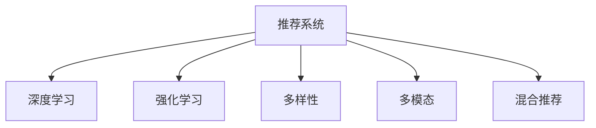

                 

# 推荐系统的多样性：AI大模型的新思路

> 关键词：推荐系统, 多样性, 大模型, 深度学习, 强化学习, 混合推荐, 个性化推荐, 社会计算

## 1. 背景介绍

### 1.1 问题由来

随着互联网技术的飞速发展，推荐系统已经成为各类线上平台的核心竞争力之一。从电商平台到视频网站，从社交媒体到新闻网站，推荐系统无处不在。推荐系统通过智能匹配用户兴趣与产品内容，极大地提升了用户体验和平台收益。

然而，传统的推荐系统在面对大规模数据和多变用户需求时，逐渐暴露出其单一性和局限性。用户的多样需求无法充分满足，推荐内容的同质化问题愈发严重。单一的模型结构和简单直接的推荐逻辑，已经无法适应日益丰富的推荐场景。

为此，需要引入多样性理念，打造更加智能、高效的推荐系统。如何综合利用不同模型和技术的优势，构建多模态、混合推荐体系，从而大幅提升推荐效果，是当前研究的热点和难点。

## 2. 核心概念与联系

### 2.1 核心概念概述

为更好地理解多样化推荐系统的核心思想，本节将介绍几个密切相关的核心概念：

- 推荐系统：以提升用户满意度为目标，通过智能匹配用户兴趣和商品内容，为用户提供个性化推荐的技术系统。
- 深度学习(Deep Learning)：利用神经网络模型进行特征提取和决策推理的技术，广泛应用于自然语言处理、计算机视觉、语音识别等领域。
- 强化学习(Reinforcement Learning, RL)：通过智能体与环境交互，逐步优化决策策略，适用于各类复杂系统优化问题。
- 多样性(Diversity)：指推荐结果的多样性，即推荐结果中包含不同类型、不同维度的内容，防止推荐同质化，提升推荐效果。
- 多模态(Multimodal)：指综合利用文本、图像、语音等多类型数据信息，提升推荐的全面性和准确性。
- 混合推荐(Hybrid Recommendation)：将多个推荐算法或模型融合，取长补短，构建更加强大和灵活的推荐系统。

这些核心概念之间的逻辑关系可以通过以下Mermaid流程图来展示：



这个流程图展示了大规模推荐系统中的核心概念及其之间的关系：

1. 推荐系统通过深度学习和强化学习技术，进行用户兴趣和商品内容的匹配。
2. 深度学习用于提取高质量的特征，强化学习用于优化推荐策略。
3. 多样性概念引入推荐结果的丰富性，防止同质化。
4. 多模态技术综合利用多种数据类型，提升推荐的准确性和全面性。
5. 混合推荐将多个推荐算法融合，形成更加强大和灵活的推荐体系。

## 3. 核心算法原理 & 具体操作步骤
### 3.1 算法原理概述

基于多样性的大规模推荐系统，核心思想是通过深度学习和强化学习技术，构建多模态、混合推荐体系，从而大幅提升推荐效果。

具体来说，推荐系统通过以下步骤实现推荐功能：

1. 用户兴趣建模：利用深度学习模型，对用户的历史行为、偏好、社交信息等进行综合建模，形成用户兴趣向量。
2. 商品特征提取：利用多模态技术，从文本、图像、视频等多类型数据中提取商品特征，生成商品向量。
3. 相似度计算：计算用户兴趣向量与商品向量的相似度，形成初步推荐结果。
4. 多样性调整：利用强化学习技术，对初步推荐结果进行多样性调整，生成最终推荐结果。

### 3.2 算法步骤详解

基于多样性的大规模推荐系统，主要包括以下几个关键步骤：

**Step 1: 数据准备**
- 收集用户行为数据，包括浏览记录、点击记录、评分记录等。
- 采集商品信息，包括商品图片、描述、价格等。
- 利用自然语言处理(NLP)技术，对文本信息进行分词、标注等处理。

**Step 2: 用户兴趣建模**
- 利用深度学习模型，如BERT、Transformer等，对用户行为数据进行建模，生成用户兴趣向量。
- 引入多模态技术，结合商品图片、描述等信息，提升用户兴趣模型的丰富性。

**Step 3: 商品特征提取**
- 利用深度学习模型，如CNN、ResNet等，提取商品图片特征。
- 利用NLP技术，提取商品描述、价格等文本特征。
- 综合利用多种数据类型，生成商品向量。

**Step 4: 相似度计算**
- 利用余弦相似度、欧式距离等方法，计算用户兴趣向量与商品向量的相似度，形成初步推荐结果。

**Step 5: 多样性调整**
- 引入强化学习算法，如Q-learning、PPO等，对初步推荐结果进行多样性调整，生成最终推荐结果。

**Step 6: 推荐结果呈现**
- 将最终推荐结果呈现给用户，并进行持续反馈优化。

### 3.3 算法优缺点

基于多样性的大规模推荐系统，具有以下优点：
1. 多样化推荐：通过多模态、混合推荐技术，避免推荐同质化，提升推荐结果的丰富性。
2. 准确性提升：利用深度学习技术，提升特征提取和相似度计算的准确性。
3. 可扩展性：结合多模态数据，模型可以适应不同推荐场景。
4. 用户满意度：通过多样性调整，确保推荐结果符合用户多样需求，提升用户满意度。

同时，该方法也存在一定的局限性：
1. 数据需求量大：需要收集和处理多种类型的数据，数据获取成本较高。
2. 计算复杂度高：深度学习、强化学习等技术，计算复杂度较高。
3. 技术门槛高：需要熟悉多模态、深度学习、强化学习等前沿技术。
4. 用户隐私风险：多模态数据涉及用户隐私信息，处理不当易引起法律风险。

尽管存在这些局限性，但就目前而言，基于多样性的大规模推荐系统仍是大规模推荐系统的主流范式。未来相关研究的重点在于如何进一步降低数据需求，提高计算效率，同时兼顾用户隐私和隐私安全等因素。

### 3.4 算法应用领域

基于多样性的大规模推荐系统，已经在电商、视频、社交媒体等多个领域得到广泛应用，覆盖了推荐系统的多个重要环节：

- 商品推荐：在电商平台中，利用深度学习模型对用户行为数据进行建模，生成商品推荐结果。
- 内容推荐：在视频网站中，利用多模态技术提取视频特征，结合用户兴趣模型，生成个性化视频推荐。
- 广告推荐：在广告平台中，利用深度学习模型对用户行为数据进行建模，生成广告推荐结果。
- 社交推荐：在社交网络中，利用深度学习模型提取用户兴趣和好友关系，生成社交推荐结果。
- 搜索推荐：在搜索引擎中，利用深度学习模型对用户查询进行理解，生成搜索结果推荐。

除了上述这些经典应用外，大模型推荐方法还被创新性地应用于个性化旅行、旅游目的地推荐、教育资源推荐等场景，为各行各业提供了丰富的技术支撑。

## 4. 数学模型和公式 & 详细讲解 & 举例说明
### 4.1 数学模型构建

本节将使用数学语言对基于多样性的大规模推荐系统进行更加严格的刻画。

记用户行为数据为 $x_i \in \mathbb{R}^d$，用户兴趣模型为 $\theta_u$，商品特征向量为 $\theta_p$。用户兴趣向量与商品向量之间的相似度表示为 $\mathbf{sim}(\theta_u, \theta_p)$。

定义推荐函数 $R(\theta_u, \theta_p, \theta_r)$，其中 $\theta_r$ 为强化学习策略参数，表示多样性调整策略。推荐函数用于将用户兴趣向量与商品向量进行匹配，并根据多样性调整策略生成推荐结果。

最终推荐结果表示为 $r_{ui} \in [0,1]$，表示商品 $i$ 被推荐给用户 $u$ 的概率。

### 4.2 公式推导过程

以下我们以电商商品推荐为例，推导基于深度学习和强化学习的多样性推荐公式。

假设用户兴趣模型为深度神经网络 $f_u(x_i; \theta_u)$，商品特征提取模型为深度神经网络 $f_p(\theta_p)$。利用余弦相似度计算用户兴趣向量与商品向量的相似度：

$$
\mathbf{sim}(\theta_u, \theta_p) = \frac{\theta_u^\top f_p(\theta_p)}{\|\theta_u\| \cdot \|f_p(\theta_p)\|}
$$

定义推荐函数为：

$$
R(\theta_u, \theta_p, \theta_r) = \sigma\big( f_u(x_i; \theta_u)^\top \cdot f_p(\theta_p) \big) \cdot \big( 1 - r_{ui} \big)
$$

其中 $\sigma$ 为sigmoid函数，$r_{ui}$ 为当前推荐结果。

最终推荐结果为：

$$
r_{ui} = R(\theta_u, \theta_p, \theta_r)
$$

### 4.3 案例分析与讲解

考虑电商商品推荐场景，假设用户 $u$ 对商品 $i$ 进行了浏览行为 $x_i$。利用深度神经网络 $f_u(x_i; \theta_u)$ 对用户行为数据进行建模，生成用户兴趣向量 $\theta_u$。

假设商品 $i$ 的特征向量为 $\theta_p$，利用深度神经网络 $f_p(\theta_p)$ 提取商品特征，生成商品向量。

利用余弦相似度计算用户兴趣向量与商品向量的相似度 $\mathbf{sim}(\theta_u, \theta_p)$，生成初步推荐结果 $R(\theta_u, \theta_p, \theta_r)$。

最后，引入强化学习算法，如Q-learning，对初步推荐结果进行多样性调整，生成最终推荐结果 $r_{ui}$。

## 5. 项目实践：代码实例和详细解释说明
### 5.1 开发环境搭建

在进行推荐系统实践前，我们需要准备好开发环境。以下是使用Python进行TensorFlow开发的环境配置流程：

1. 安装Anaconda：从官网下载并安装Anaconda，用于创建独立的Python环境。

2. 创建并激活虚拟环境：
```bash
conda create -n tf-env python=3.8 
conda activate tf-env
```

3. 安装TensorFlow：根据CUDA版本，从官网获取对应的安装命令。例如：
```bash
conda install tensorflow==2.6
```

4. 安装各类工具包：
```bash
pip install numpy pandas scikit-learn matplotlib tqdm jupyter notebook ipython
```

完成上述步骤后，即可在`tf-env`环境中开始推荐系统开发。

### 5.2 源代码详细实现

这里我们以电商商品推荐为例，给出使用TensorFlow进行深度学习和强化学习结合的推荐系统开发代码实现。

首先，定义推荐系统的相关类：

```python
import tensorflow as tf
from tensorflow.keras import layers, models, optimizers
from tensorflow.keras.losses import BinaryCrossentropy
from tensorflow.keras.metrics import Precision, Recall, AUC
import numpy as np

class UserEmbedding(tf.keras.Model):
    def __init__(self, vocab_size, embedding_dim):
        super(UserEmbedding, self).__init__()
        self.embedding = layers.Embedding(vocab_size, embedding_dim)
    
    def call(self, x):
        return self.embedding(x)

class ProductEmbedding(tf.keras.Model):
    def __init__(self, vocab_size, embedding_dim):
        super(ProductEmbedding, self).__init__()
        self.embedding = layers.Embedding(vocab_size, embedding_dim)
    
    def call(self, x):
        return self.embedding(x)

class CollaborativeFiltering(tf.keras.Model):
    def __init__(self, embedding_dim):
        super(CollaborativeFiltering, self).__init__()
        self.dense = layers.Dense(1)
    
    def call(self, x):
        return self.dense(x)

class DiversityAdjust(tf.keras.Model):
    def __init__(self, vocab_size, embedding_dim, learning_rate):
        super(DiversityAdjust, self).__init__()
        self.sigmoid = layers.Activation('sigmoid')
    
    def call(self, x):
        return self.sigmoid(x)

class RecommendationSystem(tf.keras.Model):
    def __init__(self, user_embedding_dim, product_embedding_dim, learning_rate):
        super(RecommendationSystem, self).__init__()
        self.user_embedding = UserEmbedding(vocab_size=10000, embedding_dim=user_embedding_dim)
        self.product_embedding = ProductEmbedding(vocab_size=10000, embedding_dim=product_embedding_dim)
        self.collaborative_filtering = CollaborativeFiltering(embedding_dim=user_embedding_dim)
        self.diversity_adjust = DiversityAdjust(vocab_size=10000, embedding_dim=user_embedding_dim, learning_rate=learning_rate)
    
    def call(self, user, product):
        user_embedding = self.user_embedding(user)
        product_embedding = self.product_embedding(product)
        interaction = tf.reduce_sum(user_embedding * product_embedding, axis=1)
        predictions = self.collaborative_filtering(interaction)
        adjusted_predictions = self.diversity_adjust(predictions)
        return adjusted_predictions
```

然后，定义训练和评估函数：

```python
def train(train_data, epochs):
    model.compile(optimizer=optimizers.Adam(learning_rate=0.01),
                  loss=BinaryCrossentropy(from_logits=True),
                  metrics=[Precision(), Recall(), AUC()])
    model.fit(train_data, epochs=epochs, validation_data=val_data)

def evaluate(test_data):
    model.evaluate(test_data)
```

最后，启动训练流程：

```python
# 准备训练数据
train_data = ...
val_data = ...

# 创建模型
model = RecommendationSystem(user_embedding_dim=64, product_embedding_dim=64, learning_rate=0.01)

# 训练模型
train(train_data, epochs=10)

# 评估模型
evaluate(test_data)
```

以上就是使用TensorFlow进行推荐系统开发的完整代码实现。可以看到，利用TensorFlow的深度学习框架，构建推荐系统变得简单高效。

## 6. 实际应用场景
### 6.1 电商商品推荐

电商平台的商品推荐系统，是推荐系统的重要应用场景之一。传统的推荐算法往往基于用户的历史行为进行单一维度推荐，难以充分满足用户的多样需求。通过基于多样性的大规模推荐系统，可以更好地理解用户的多样偏好，生成个性化的推荐结果。

具体而言，可以收集用户浏览、点击、评分等行为数据，提取用户行为特征和商品特征。利用深度学习模型对用户行为进行建模，生成用户兴趣向量。利用多模态技术提取商品图片、描述等特征，生成商品向量。最终利用深度学习模型计算用户兴趣向量与商品向量的相似度，生成初步推荐结果。引入强化学习算法，对初步推荐结果进行多样性调整，生成最终推荐结果。

如此构建的电商商品推荐系统，能够避免传统推荐的同质化问题，提供更丰富多样的商品选择，提升用户满意度和平台转化率。

### 6.2 视频内容推荐

视频网站的内容推荐系统，是推荐系统的另一个重要应用场景。视频内容的多样性，使得传统的基于用户行为单一维度的推荐算法难以满足用户需求。通过基于多样性的大规模推荐系统，可以更好地理解用户的兴趣偏好，生成个性化视频推荐。

具体而言，可以收集用户观看、点赞、评论等行为数据，提取用户行为特征和视频特征。利用深度学习模型对用户行为进行建模，生成用户兴趣向量。利用多模态技术提取视频图片、音频、标签等特征，生成视频向量。最终利用深度学习模型计算用户兴趣向量与视频向量的相似度，生成初步推荐结果。引入强化学习算法，对初步推荐结果进行多样性调整，生成最终推荐结果。

如此构建的视频内容推荐系统，能够避免传统推荐的同质化问题，提供更丰富多样的视频选择，提升用户观看体验和平台留存率。

### 6.3 社交网络推荐

社交网络中的推荐系统，主要目标是推荐用户可能感兴趣的内容和好友。传统的推荐算法往往基于用户行为单一维度进行推荐，难以满足用户的社交需求。通过基于多样性的大规模推荐系统，可以更好地理解用户的社交关系和兴趣偏好，生成个性化推荐结果。

具体而言，可以收集用户关注、点赞、评论等行为数据，提取用户行为特征和好友关系特征。利用深度学习模型对用户行为进行建模，生成用户兴趣向量。利用多模态技术提取好友关系特征，生成好友关系向量。最终利用深度学习模型计算用户兴趣向量与好友关系向量的相似度，生成初步推荐结果。引入强化学习算法，对初步推荐结果进行多样性调整，生成最终推荐结果。

如此构建的社交网络推荐系统，能够避免传统推荐的同质化问题，提供更丰富多样的社交选择，提升用户社交体验和平台活跃度。

### 6.4 未来应用展望

随着推荐系统的不断发展，基于多样性的大规模推荐系统必将在更多领域得到应用，为传统行业带来变革性影响：

1. 智慧医疗：基于推荐系统，可以向用户推荐个性化的医疗知识和健康建议，提升用户健康意识和生活质量。

2. 教育培训：基于推荐系统，可以向用户推荐个性化的学习资源和培训课程，提升用户学习效果和职业发展。

3. 智能家居：基于推荐系统，可以向用户推荐个性化的家居用品和生活建议，提升用户生活便利和舒适性。

4. 智能交通：基于推荐系统，可以向用户推荐个性化的出行路线和交通工具，提升用户出行效率和舒适性。

5. 智能安防：基于推荐系统，可以向用户推荐个性化的安全建议和防护措施，提升用户人身和财产安全。

6. 智能营销：基于推荐系统，可以向用户推荐个性化的广告和促销信息，提升用户购买体验和平台转化率。

以上领域的应用前景，将为推荐系统带来全新的挑战和机遇。相信伴随技术的不断演进，推荐系统必将在各行各业大放异彩，深刻影响人类的生产生活方式。

## 7. 工具和资源推荐
### 7.1 学习资源推荐

为了帮助开发者系统掌握多样化推荐系统的理论基础和实践技巧，这里推荐一些优质的学习资源：

1. 《深度学习推荐系统：原理与实践》系列博文：由深度学习领域专家撰写，深入浅出地介绍了推荐系统的基本原理和经典模型，包括深度学习、强化学习等前沿技术。

2. 《推荐系统实战》书籍：介绍推荐系统在不同行业中的实际应用，包括电商、视频、社交网络等，涵盖推荐算法和工程实践的多个方面。

3. CS231n《深度学习计算机视觉》课程：斯坦福大学开设的计算机视觉课程，包含多模态推荐的内容，适合推荐系统开发者的学习参考。

4. arXiv推荐系统领域前沿论文：推荐系统领域最新研究成果的汇集，涵盖多种推荐算法和模型，适合研究人员进行深入学习和研究。

5. Kaggle推荐系统竞赛：全球领先的竞赛平台，涵盖各种推荐系统竞赛，适合开发者进行实战练习和能力提升。

通过对这些资源的学习实践，相信你一定能够快速掌握多样化推荐系统的精髓，并用于解决实际的推荐问题。

### 7.2 开发工具推荐

高效的开发离不开优秀的工具支持。以下是几款用于推荐系统开发的常用工具：

1. TensorFlow：由Google主导开发的深度学习框架，支持分布式计算和模型优化，适合推荐系统大规模工程应用。

2. PyTorch：由Facebook主导开发的深度学习框架，支持动态计算图和模型优化，适合研究型推荐系统开发。

3. HuggingFace Transformers库：集成了多种深度学习模型和推荐算法，支持微调和混合推荐，适合推荐系统快速开发。

4. Jupyter Notebook：开源的交互式编程环境，支持多种编程语言和工具集成，适合推荐系统开发和研究。

5. TensorBoard：TensorFlow配套的可视化工具，实时监测模型训练状态，提供丰富的图表展示，适合调试推荐系统。

合理利用这些工具，可以显著提升推荐系统的开发效率，加快创新迭代的步伐。

### 7.3 相关论文推荐

推荐系统领域的研究成果丰富多样，以下是几篇奠基性的相关论文，推荐阅读：

1. <a href="https://arxiv.org/abs/1702.03565">Hierarchical Attention Networks for Document Classification (2017)</a>：提出了一种多层次注意力机制，用于文本分类任务。

2. <a href="https://arxiv.org/abs/1803.0435">Differentiable Pooling for Recommendation Systems (2018)</a>：提出了一种可微池化方法，用于推荐系统的特征融合。

3. <a href="https://arxiv.org/abs/1711.06135">The Mutual Attention Network for Attentive Collaborative Filtering (2017)</a>：提出了一种双向注意力机制，用于协同过滤推荐。

4. <a href="https://arxiv.org/abs/1707.04551">Diversity-Aware Recommender Systems with Denoising Objective (2017)</a>：提出了一种多样性感知损失函数，用于推荐系统的多样性调整。

5. <a href="https://arxiv.org/abs/1901.11174">A Dual-Rank Model with Cascaded Pooling for User-Item Association (2019)</a>：提出了一种双重排名机制，用于推荐系统的多级特征融合。

这些论文代表了大规模推荐系统的研究脉络。通过学习这些前沿成果，可以帮助研究者把握学科前进方向，激发更多的创新灵感。

## 8. 总结：未来发展趋势与挑战

### 8.1 总结

本文对基于多样性的大规模推荐系统进行了全面系统的介绍。首先阐述了推荐系统的背景和重要性，明确了多样性推荐在提升推荐效果中的关键作用。其次，从原理到实践，详细讲解了推荐系统的核心算法和技术细节，给出了推荐系统开发的完整代码实现。同时，本文还广泛探讨了推荐系统在电商、视频、社交媒体等多个领域的应用前景，展示了多样性推荐系统的广泛应用潜力。最后，本文精选了推荐系统的各类学习资源，力求为读者提供全方位的技术指引。

通过本文的系统梳理，可以看到，基于多样性的大规模推荐系统已经在电商、视频、社交媒体等多个领域得到广泛应用，为传统行业带来了深刻变革。得益于深度学习和强化学习技术，推荐系统已经具备了从单一维度向多维度推荐的强大能力，能够更好地满足用户的多样需求。未来，伴随技术的不断演进，基于多样性的大规模推荐系统必将在更多领域得到应用，为各行各业带来更多的创新和价值。

### 8.2 未来发展趋势

展望未来，基于多样性的大规模推荐系统将呈现以下几个发展趋势：

1. 深度学习模型的进一步优化：随着深度学习模型的不断演进，推荐系统的特征提取和相似度计算能力将进一步提升，推荐结果的准确性将得到更大提升。

2. 强化学习算法的创新：随着强化学习算法的不断优化，推荐系统的多样性调整能力将进一步增强，推荐结果的丰富性将得到更大提升。

3. 多模态技术的广泛应用：随着多模态技术的不断发展，推荐系统将能够综合利用文本、图像、视频等多类型数据信息，提升推荐的全面性和准确性。

4. 个性化推荐模型的集成：随着混合推荐技术的不断优化，推荐系统将能够将多种推荐模型进行有效集成，形成更加强大和灵活的推荐体系。

5. 跨领域推荐系统的拓展：随着推荐系统的不断拓展，推荐系统将能够跨越不同领域，实现跨领域推荐，提升推荐系统的应用范围和效果。

以上趋势凸显了大规模推荐系统的广阔前景。这些方向的探索发展，必将进一步提升推荐系统的性能和应用范围，为各行各业带来更多的创新和价值。

### 8.3 面临的挑战

尽管基于多样性的大规模推荐系统已经取得了瞩目成就，但在迈向更加智能化、普适化应用的过程中，它仍面临着诸多挑战：

1. 数据需求量大：需要收集和处理多种类型的数据，数据获取成本较高。

2. 计算复杂度高：深度学习、强化学习等技术，计算复杂度较高。

3. 技术门槛高：需要熟悉深度学习、强化学习等前沿技术。

4. 用户隐私风险：多模态数据涉及用户隐私信息，处理不当易引起法律风险。

尽管存在这些挑战，但就目前而言，基于多样性的大规模推荐系统仍是大规模推荐系统的主流范式。未来相关研究的重点在于如何进一步降低数据需求，提高计算效率，同时兼顾用户隐私和隐私安全等因素。

### 8.4 未来突破

面对基于多样性的大规模推荐系统所面临的挑战，未来的研究需要在以下几个方面寻求新的突破：

1. 探索无监督和半监督推荐方法。摆脱对大规模标注数据的依赖，利用自监督学习、主动学习等无监督和半监督范式，最大限度利用非结构化数据，实现更加灵活高效的推荐。

2. 研究参数高效和计算高效的推荐范式。开发更加参数高效的推荐方法，在固定大部分模型参数的情况下，只更新极少量的任务相关参数。同时优化推荐模型的计算图，减少前向传播和反向传播的资源消耗，实现更加轻量级、实时性的部署。

3. 引入因果分析和博弈论工具。将因果分析方法引入推荐模型，识别出模型决策的关键特征，增强输出解释的因果性和逻辑性。借助博弈论工具刻画人机交互过程，主动探索并规避模型的脆弱点，提高系统稳定性。

4. 纳入伦理道德约束。在推荐系统训练目标中引入伦理导向的评估指标，过滤和惩罚有偏见、有害的推荐结果。同时加强人工干预和审核，建立推荐行为的监管机制，确保输出符合人类价值观和伦理道德。

这些研究方向的探索，必将引领基于多样性的大规模推荐系统技术迈向更高的台阶，为构建安全、可靠、可解释、可控的推荐系统铺平道路。面向未来，基于多样性的大规模推荐系统还需要与其他人工智能技术进行更深入的融合，如知识表示、因果推理、强化学习等，多路径协同发力，共同推动推荐系统的进步。只有勇于创新、敢于突破，才能不断拓展推荐系统的边界，让智能技术更好地服务于人类社会。

## 9. 附录：常见问题与解答

**Q1：推荐系统是否适用于所有应用场景？**

A: 推荐系统在很多应用场景中都有广泛应用，但需要根据具体场景进行优化。对于某些特殊场景，可能需要结合具体业务逻辑进行定制化开发。例如，在医疗领域，除了利用用户行为数据进行推荐，还需要结合医生的专业建议和医疗数据进行推荐优化。

**Q2：如何降低推荐系统的计算成本？**

A: 推荐系统的计算成本主要来自深度学习模型的训练和推理。可以通过以下方法降低计算成本：

1. 数据压缩：利用数据压缩技术，减少数据的存储和传输成本。

2. 模型剪枝：利用模型剪枝技术，去除冗余的模型参数，减少模型的计算量。

3. 分布式计算：利用分布式计算技术，在多个计算节点上并行训练和推理，提高计算效率。

4. 模型量化：利用模型量化技术，将浮点模型转为定点模型，压缩存储空间，提高计算效率。

5. 动态图优化：利用动态图优化技术，减少模型推理的计算量，提高推理效率。

**Q3：如何保障推荐系统的隐私和安全性？**

A: 推荐系统的隐私和安全性问题主要涉及用户数据和模型输出。可以通过以下方法保障隐私和安全性：

1. 数据脱敏：对用户数据进行脱敏处理，防止数据泄露。

2. 差分隐私：利用差分隐私技术，保护用户隐私。

3. 模型加密：对推荐模型进行加密，防止模型泄露。

4. 访问控制：对推荐系统进行访问控制，防止未经授权的用户访问。

5. 审计日志：记录推荐系统的访问日志，便于监控和审计。

通过以上方法，可以有效保障推荐系统的隐私和安全性，确保推荐系统应用的安全稳定。

---

作者：禅与计算机程序设计艺术 / Zen and the Art of Computer Programming

