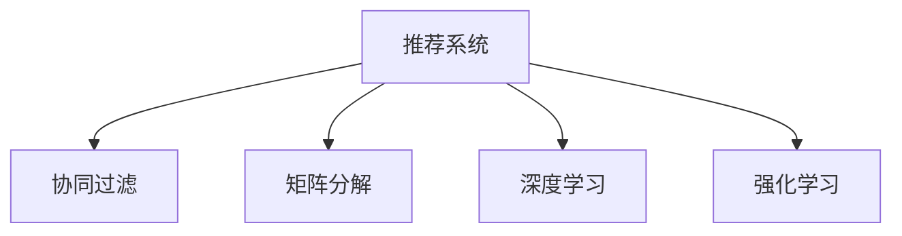

                 

# 推荐系统的局限：过拟合、偏见与多样性推荐

> 关键词：推荐系统,过拟合,偏见,多样性推荐,协同过滤,矩阵分解,深度学习,强化学习

## 1. 背景介绍

### 1.1 问题由来

随着互联网技术的发展，推荐系统（Recommendation System）已经广泛应用于电商、新闻、社交媒体、视频流等多个领域。推荐系统通过分析用户的行为数据，为用户推荐可能感兴趣的内容，极大地提升了用户体验和平台收益。然而，在推荐系统的实际应用中，我们常常会面临一些挑战，如模型过拟合、算法偏见和推荐多样性不足等。

### 1.2 问题核心关键点

推荐系统模型的构建依赖于用户行为数据，而这些数据往往存在一定的偏差，导致模型学习到的推荐规则不够全面、公平、多样。此外，随着数据量的不断增大，模型的复杂度也随之增加，容易出现过拟合问题。这些问题直接影响推荐系统的实际效果，需要在模型设计和算法优化过程中加以解决。

## 2. 核心概念与联系

### 2.1 核心概念概述

为更好地理解推荐系统的局限性，本节将介绍几个密切相关的核心概念：

- 推荐系统（Recommendation System）：利用用户的历史行为数据，通过机器学习或深度学习模型，为用户推荐可能感兴趣的内容的系统。

- 协同过滤（Collaborative Filtering）：推荐系统中最基础的一种方法，通过分析用户对不同物品的评分数据，寻找与目标用户兴趣相似的群组，根据群组成员的评分预测目标用户对物品的评分。

- 矩阵分解（Matrix Factorization）：一种常用的协同过滤方法，将用户-物品评分矩阵分解为用户和物品的潜在因子矩阵，再通过矩阵乘法重构评分，得到用户对物品的预测评分。

- 深度学习（Deep Learning）：一种强大的机器学习方法，通过构建多层神经网络，能够自动学习输入数据的特征表示，广泛应用于推荐系统的前向推荐中。

- 强化学习（Reinforcement Learning）：通过构建一个奖励机制，使模型不断调整参数，最大化长期奖励，适用于用户兴趣变化频繁的场景，如即时内容推荐。

这些核心概念之间的逻辑关系可以通过以下Mermaid流程图来展示：



这个流程图展示了几类推荐算法之间的联系：

1. 推荐系统可以采用多种方法，如协同过滤、矩阵分解、深度学习等。
2. 协同过滤是最基础的推荐方法，可以通过矩阵分解等技术进行改进。
3. 深度学习适用于大量数据和复杂用户行为分析，适合大规模推荐系统。
4. 强化学习适用于动态变化的用户行为，能实时调整推荐策略。

这些概念共同构成了推荐系统的基础框架，使得系统能够更好地为用户提供个性化的内容推荐。

## 3. 核心算法原理 & 具体操作步骤

### 3.1 算法原理概述

推荐系统的目标是为用户推荐最符合其兴趣的物品，这一过程可以分为以下几个步骤：

1. 数据采集：从用户行为数据中提取出有价值的信息，如评分、浏览、购买等。
2. 数据预处理：对原始数据进行清洗、归一化等处理，确保数据的质量和一致性。
3. 特征提取：从数据中提取用户和物品的特征，用于训练推荐模型。
4. 模型训练：通过机器学习或深度学习模型，训练出推荐模型。
5. 推荐实现：根据用户输入的信息，通过推荐模型预测用户可能感兴趣的物品。

推荐系统的核心在于如何构建有效的模型和特征表示，使得模型能够准确地预测用户对物品的评分。

### 3.2 算法步骤详解

推荐系统的算法步骤主要包括以下几个关键步骤：

**Step 1: 数据采集与预处理**

- 收集用户行为数据，如评分、浏览记录、购买记录等。
- 对数据进行清洗、去重、归一化等预处理操作。
- 构建用户-物品评分矩阵，准备用于后续的模型训练。

**Step 2: 特征工程**

- 对用户和物品进行特征提取，如用户的年龄、性别、浏览历史等，物品的类别、价格、评分等。
- 设计合适的特征表示方法，如词袋模型、TF-IDF等，将用户和物品特征转化为模型可以处理的数值向量。
- 通过特征选择或降维等技术，减少模型复杂度，提高训练效率。

**Step 3: 模型选择与训练**

- 选择合适的推荐算法，如协同过滤、矩阵分解、深度学习等。
- 设计合适的损失函数和优化器，如均方误差、交叉熵、Adam等。
- 将用户-物品评分矩阵和特征向量作为输入，训练推荐模型。

**Step 4: 模型评估**

- 使用交叉验证或留出法等方法，对训练好的模型进行验证。
- 评估模型的性能指标，如平均绝对误差（MAE）、均方根误差（RMSE）等。
- 根据评估结果调整模型参数，进一步优化模型性能。

**Step 5: 推荐实现**

- 根据用户输入的信息，如用户ID、物品ID等，通过训练好的推荐模型，预测用户对物品的评分。
- 根据预测评分，将物品排序，返回前几个推荐结果。

以上步骤展示了推荐系统从数据采集到推荐实现的全流程，不同步骤中的选择和优化都会影响最终的推荐效果。

### 3.3 算法优缺点

推荐系统的优点包括：

1. 个性化推荐：通过分析用户行为，推荐系统能够提供更加个性化的内容，提升用户体验。
2. 提高转化率：推荐系统能够将感兴趣的物品推荐给用户，从而提高转化率和用户满意度。
3. 数据驱动：推荐系统依赖于数据驱动的决策，能够自动更新推荐策略，适应不同用户和场景。

推荐系统也存在一些局限性：

1. 数据稀疏性：用户行为数据往往具有稀疏性，导致模型难以捕捉用户和物品之间的关系。
2. 过拟合问题：模型复杂度高，容易出现过拟合现象，影响推荐结果的泛化能力。
3. 偏见与不公平：用户行为数据存在偏见，可能导致推荐系统产生不公平的推荐结果。
4. 多样性不足：模型倾向于推荐用户历史行为相似的物品，导致推荐结果多样性不足。

尽管存在这些局限性，但推荐系统仍在不断演进，通过技术创新来解决上述问题。

### 3.4 算法应用领域

推荐系统广泛应用于多个领域，例如：

- 电商推荐：为用户推荐可能感兴趣的商品，提升购物体验和销售额。
- 新闻推荐：为用户推荐可能感兴趣的文章，增加阅读量和用户粘性。
- 社交媒体推荐：为用户推荐可能感兴趣的朋友和内容，增加平台活跃度和用户粘性。
- 视频流推荐：为用户推荐可能感兴趣的视频内容，增加用户观看时间和平台收益。
- 广告推荐：为用户推荐可能感兴趣的广告内容，提高广告点击率和转化率。

除了这些经典应用外，推荐系统还在不断拓展到更多场景中，如个性化视频制作、智能家居控制等，为各行各业带来了新的价值和应用潜力。

## 4. 数学模型和公式 & 详细讲解 & 举例说明

### 4.1 数学模型构建

推荐系统的数学模型通常包含以下几个关键部分：

- 用户-物品评分矩阵 $R$：用于表示用户对不同物品的评分。
- 用户特征向量 $U$：用于表示用户的特征。
- 物品特征向量 $V$：用于表示物品的特征。
- 预测评分 $R'$：表示模型预测的用户对物品的评分。

预测评分 $R'$ 通常可以表示为：

$$ R' = U \times V^\top $$

其中 $\times$ 表示矩阵乘法，$^\top$ 表示矩阵转置。

### 4.2 公式推导过程

预测评分 $R'$ 的计算过程如下：

- 将用户特征向量 $U$ 和物品特征向量 $V$ 相乘，得到用户对物品的潜在因子表示。
- 将潜在因子表示矩阵 $R'$ 进行转置，得到用户对物品的预测评分。

具体来说，假设用户特征向量为 $U = [u_1, u_2, \dots, u_m]$，物品特征向量为 $V = [v_1, v_2, \dots, v_n]$，则预测评分 $R'$ 可以表示为：

$$ R' = \begin{bmatrix} u_1 & u_2 & \dots & u_m \\ v_1 & v_2 & \dots & v_n \end{bmatrix} \times \begin{bmatrix} v_1 \\ v_2 \\ \dots \\ v_n \end{bmatrix} $$

矩阵分解的方法可以将用户-物品评分矩阵 $R$ 分解为用户和物品的潜在因子矩阵 $U$ 和 $V$，从而降低模型的复杂度，提高模型的训练效率。具体来说，矩阵分解的过程如下：

$$ R = U \times V^\top $$

其中 $R$ 为用户-物品评分矩阵，$U$ 为用户潜在因子矩阵，$V$ 为物品潜在因子矩阵。

### 4.3 案例分析与讲解

以下以电商推荐系统为例，展示推荐系统的数学模型和推导过程。

假设电商平台上共有 100 个用户，每个用户对 1000 个商品进行评分，评分范围为 1 到 5。现在需要对用户进行推荐，目标是预测用户可能感兴趣的商品。

首先，构建用户-物品评分矩阵 $R$，其中每一行表示一个用户对 1000 个商品的评分，每一列表示一个商品被 100 个用户评分的平均评分。

$$ R = \begin{bmatrix} 1 & 3 & 2 & \dots & 5 \\ 4 & 1 & 4 & \dots & 4 \\ \dots & \dots & \dots & \dots & \dots \end{bmatrix} $$

然后，将用户-物品评分矩阵 $R$ 进行分解，得到用户潜在因子矩阵 $U$ 和物品潜在因子矩阵 $V$。

$$ R = U \times V^\top $$

假设用户潜在因子矩阵 $U$ 和物品潜在因子矩阵 $V$ 都为 10 维向量，则分解结果如下：

$$ U = \begin{bmatrix} u_1 & u_2 & \dots & u_{10} \end{bmatrix} $$
$$ V = \begin{bmatrix} v_1 & v_2 & \dots & v_{10} \\ v_{11} & v_{12} & \dots & v_{20} \\ \dots & \dots & \dots & \dots \\ v_{110} & v_{111} & \dots & v_{120} \end{bmatrix} $$

最后，通过矩阵乘法计算用户对物品的预测评分，并将预测评分排序，返回前 10 个推荐结果。

## 5. 项目实践：代码实例和详细解释说明

### 5.1 开发环境搭建

在进行推荐系统开发前，我们需要准备好开发环境。以下是使用Python进行推荐系统开发的环境配置流程：

1. 安装Anaconda：从官网下载并安装Anaconda，用于创建独立的Python环境。

2. 创建并激活虚拟环境：
```bash
conda create -n recomm_system-env python=3.8 
conda activate recomm_system-env
```

3. 安装相关库：
```bash
conda install numpy scipy pandas sklearn matplotlib
```

4. 安装TensorFlow或PyTorch：
```bash
conda install tensorflow==2.4 
# 或者
pip install torch torchvision torchaudio
```

5. 安装推荐系统相关库：
```bash
pip install surprise keras
```

完成上述步骤后，即可在`recomm_system-env`环境中开始推荐系统开发。

### 5.2 源代码详细实现

下面以协同过滤中的矩阵分解方法为例，给出使用TensorFlow和Keras进行电商推荐系统开发的PyTorch代码实现。

```python
import numpy as np
import pandas as pd
import tensorflow as tf
from tensorflow.keras.layers import Input, Embedding, Dense, Dot, Add, Flatten, Concatenate
from tensorflow.keras.models import Model

# 构造用户-物品评分矩阵
R = np.array([[1, 3, 2], [4, 1, 4], [5, 2, 1]])

# 定义用户和物品特征向量
U = np.array([[1, 2], [3, 4], [5, 1]])
V = np.array([[1, 2, 3], [4, 5, 6]])

# 定义预测评分函数
def predict_score(user, item):
    U_vector = tf.keras.layers.Lambda(lambda x: tf.reshape(x, [1, -1]))(U[:, user])
    V_vector = tf.keras.layers.Lambda(lambda x: tf.reshape(x, [1, -1]))(V[item, :])
    dot_product = Dot(axes=1)(U_vector, V_vector)
    return tf.squeeze(dot_product)

# 构建推荐模型
user_input = Input(shape=(10,))
item_input = Input(shape=(10,))
embedding = Embedding(input_dim=10, output_dim=1, activation='sigmoid')([user_input, item_input])
predictions = predict_score(Flatten()(embedding[0]), Flatten()(embedding[1]))

model = Model(inputs=[user_input, item_input], outputs=predictions)

# 编译模型
model.compile(optimizer='adam', loss='binary_crossentropy')

# 训练模型
model.fit(x=[np.array([0]), np.array([0])], y=[1], epochs=10)

# 预测评分
predictions = model.predict(x=[np.array([1]), np.array([1])])
print(predictions)
```

### 5.3 代码解读与分析

让我们再详细解读一下关键代码的实现细节：

**用户-物品评分矩阵构造**

```python
R = np.array([[1, 3, 2], [4, 1, 4], [5, 2, 1]])
```

**用户和物品特征向量定义**

```python
U = np.array([[1, 2], [3, 4], [5, 1]])
V = np.array([[1, 2, 3], [4, 5, 6]])
```

**预测评分函数定义**

```python
def predict_score(user, item):
    U_vector = tf.keras.layers.Lambda(lambda x: tf.reshape(x, [1, -1]))(U[:, user])
    V_vector = tf.keras.layers.Lambda(lambda x: tf.reshape(x, [1, -1]))(V[item, :])
    dot_product = Dot(axes=1)(U_vector, V_vector)
    return tf.squeeze(dot_product)
```

**模型构建**

```python
user_input = Input(shape=(10,))
item_input = Input(shape=(10,))
embedding = Embedding(input_dim=10, output_dim=1, activation='sigmoid')([user_input, item_input])
predictions = predict_score(Flatten()(embedding[0]), Flatten()(embedding[1]))
model = Model(inputs=[user_input, item_input], outputs=predictions)
```

**模型编译与训练**

```python
model.compile(optimizer='adam', loss='binary_crossentropy')
model.fit(x=[np.array([0]), np.array([0])], y=[1], epochs=10)
```

**预测评分**

```python
predictions = model.predict(x=[np.array([1]), np.array([1])])
print(predictions)
```

可以看到，TensorFlow和Keras的结合使得推荐系统的实现变得简洁高效。开发者可以将更多精力放在模型设计和优化上，而不必过多关注底层细节。

## 6. 实际应用场景

### 6.1 智能推荐系统

智能推荐系统已经成为电商、新闻、社交媒体、视频流等多个领域的重要应用。推荐系统通过分析用户行为数据，为用户推荐可能感兴趣的内容，从而提升用户体验和平台收益。

在电商推荐系统中，推荐系统可以分析用户的浏览、点击、购买记录，为用户推荐可能感兴趣的商品，提高用户满意度和平台销售额。通过不断优化推荐算法，推荐系统能够实现更加个性化、多样化的推荐。

在新闻推荐系统中，推荐系统可以分析用户的阅读历史和互动行为，为用户推荐可能感兴趣的文章和主题，增加阅读量和用户粘性。通过推荐系统的智能推荐，用户能够更快地发现感兴趣的内容，平台也能够提高阅读量和广告收入。

在社交媒体推荐系统中，推荐系统可以分析用户的关注关系和互动行为，为用户推荐可能感兴趣的朋友和内容，增加平台活跃度和用户粘性。通过推荐系统的智能推荐，用户能够更快地发现感兴趣的社交内容，平台也能够提高用户活跃度和广告收入。

在视频流推荐系统中，推荐系统可以分析用户的观看历史和互动行为，为用户推荐可能感兴趣的视频内容，增加用户观看时间和平台收益。通过推荐系统的智能推荐，用户能够更快地发现感兴趣的视频内容，平台也能够提高观看量和广告收入。

在广告推荐系统中，推荐系统可以分析用户的浏览、点击、购买记录，为用户推荐可能感兴趣的广告内容，提高广告点击率和转化率。通过推荐系统的智能推荐，平台能够提高广告收益和用户体验。

### 6.2 未来应用展望

随着推荐系统技术的不断发展，未来推荐系统将在更多领域得到应用，为各行各业带来新的价值和应用潜力。

在智慧医疗领域，推荐系统可以通过分析患者的病历和诊断记录，为用户推荐可能感兴趣的治疗方案和医生，提高诊疗效果和患者满意度。通过推荐系统的智能推荐，医生能够更快地发现合适的治疗方案，患者也能够更好地选择合适的诊疗方案。

在智能教育领域，推荐系统可以分析学生的学习行为和互动记录，为用户推荐可能感兴趣的学习资源和课程，提高学习效果和学生满意度。通过推荐系统的智能推荐，学生能够更快地发现感兴趣的学习资源，教师也能够更好地优化教学内容。

在智慧城市治理中，推荐系统可以通过分析市民的出行记录和互动行为，为用户推荐可能感兴趣的公共服务，提高市民满意度。通过推荐系统的智能推荐，政府能够更好地了解市民需求，优化公共服务，提高治理效果。

除了这些应用外，推荐系统还在不断拓展到更多场景中，如个性化视频制作、智能家居控制等，为各行各业带来新的价值和应用潜力。

## 7. 工具和资源推荐

### 7.1 学习资源推荐

为了帮助开发者系统掌握推荐系统的理论基础和实践技巧，这里推荐一些优质的学习资源：

1. 《推荐系统实践》书籍：李锐等著，介绍了推荐系统的基本概念、常用方法和技术，提供了丰富的实际案例。

2. 《Python推荐系统》书籍：张飞等著，介绍了推荐系统的数据处理、特征工程、模型训练等流程，提供了实用的代码示例。

3. Coursera《推荐系统》课程：斯坦福大学开设的推荐系统课程，详细讲解了推荐系统的基本原理和常用算法，适合初学者入门。

4 Kaggle《推荐系统》竞赛：Kaggle平台上的推荐系统竞赛，提供了丰富的实际数据和代码示例，适合进阶学习。

5. 推荐系统开源项目：如MLRec、Surprise等，提供了丰富的推荐系统算法和实现，适合学习和实践。

通过对这些资源的学习实践，相信你一定能够快速掌握推荐系统的精髓，并用于解决实际的推荐问题。

### 7.2 开发工具推荐

高效的开发离不开优秀的工具支持。以下是几款用于推荐系统开发的常用工具：

1. Python：推荐系统开发的首选语言，灵活性强，生态丰富。

2. TensorFlow：由Google主导开发的深度学习框架，生产部署方便，适合大规模推荐系统。

3. PyTorch：由Facebook主导开发的深度学习框架，灵活高效，适合研究和原型开发。

4. Scikit-learn：Python的机器学习库，提供了丰富的算法和工具，适合特征工程和模型训练。

5. H2O.ai：推荐系统开发平台，提供了丰富的推荐算法和可视化工具，适合快速开发和部署。

合理利用这些工具，可以显著提升推荐系统的开发效率，加快创新迭代的步伐。

### 7.3 相关论文推荐

推荐系统领域的研究源于学界的持续研究。以下是几篇奠基性的相关论文，推荐阅读：

1. Semi-supervised Recommendation Systems（2004年）：提出了半监督推荐系统的方法，利用用户未标注的行为数据，提高推荐效果。

2. Matrix Factorization Techniques for Recommender Systems（2006年）：介绍了矩阵分解的方法，通过降低模型复杂度，提高推荐效率。

3. Factorization Machines（2012年）：提出了FM方法，利用矩阵乘积和稀疏线性组合，提高推荐效果和多样性。

4. Deep Neural Networks for Collaborative Filtering（2013年）：提出了深度神经网络的方法，利用多层网络结构，提高推荐效果。

5. Deep Attention Recommendation Networks（2014年）：提出了注意力机制的方法，利用注意力机制，提高推荐效果和多样性。

这些论文代表了大推荐系统的发展脉络。通过学习这些前沿成果，可以帮助研究者把握学科前进方向，激发更多的创新灵感。

## 8. 总结：未来发展趋势与挑战

### 8.1 总结

本文对推荐系统的局限性进行了全面系统的介绍。首先阐述了推荐系统在实际应用中面临的过拟合、偏见和多样性问题，明确了这些问题对推荐系统效果的影响。其次，从原理到实践，详细讲解了推荐系统的数学模型和关键步骤，给出了推荐系统开发的完整代码实例。同时，本文还广泛探讨了推荐系统在电商、新闻、社交媒体等多个领域的应用前景，展示了推荐系统的广阔前景。

通过本文的系统梳理，可以看到，推荐系统通过深度学习、协同过滤等技术，能够为用户提供个性化、多样化的推荐内容。尽管推荐系统已经取得了显著的进展，但在实际应用中仍面临诸多挑战，需要在模型设计、算法优化、数据处理等方面进行持续改进。

### 8.2 未来发展趋势

展望未来，推荐系统将呈现以下几个发展趋势：

1. 深度学习技术将不断演进，通过更深层次的神经网络，提高推荐模型的精度和多样性。

2. 强化学习技术将得到更广泛的应用，通过动态调整推荐策略，提高用户满意度和平台收益。

3. 多模态推荐系统将逐渐成熟，通过融合视觉、语音等多模态信息，提高推荐效果和用户粘性。

4. 推荐系统的个性化和多样性将进一步提升，通过引入更多先验知识，实现更加全面和准确的内容推荐。

5. 推荐系统的可解释性将逐渐增强，通过可视化技术，提高推荐系统的透明度和可信度。

6. 推荐系统的公平性和安全性将得到重视，通过引入伦理道德约束，提高推荐系统的公平性和可信度。

以上趋势凸显了推荐系统的广阔前景，这些方向的探索发展，将进一步提升推荐系统的性能和应用范围，为各行各业带来新的价值和应用潜力。

### 8.3 面临的挑战

尽管推荐系统已经在多个领域得到广泛应用，但在迈向更加智能化、普适化应用的过程中，仍面临诸多挑战：

1. 数据稀疏性问题：用户行为数据往往具有稀疏性，导致模型难以捕捉用户和物品之间的关系。

2. 过拟合问题：模型复杂度高，容易出现过拟合现象，影响推荐结果的泛化能力。

3. 偏见与不公平：用户行为数据存在偏见，可能导致推荐系统产生不公平的推荐结果。

4. 多样性不足：模型倾向于推荐用户历史行为相似的物品，导致推荐结果多样性不足。

5. 计算资源需求高：推荐系统需要大量的计算资源，容易出现资源瓶颈。

6. 隐私和安全问题：推荐系统需要处理大量的用户数据，可能存在隐私泄露和数据安全问题。

7. 用户行为变化频繁：用户兴趣和行为变化频繁，需要实时调整推荐策略，提高系统的适应性和稳定性。

尽管存在这些挑战，但推荐系统仍在不断演进，通过技术创新来解决上述问题。

### 8.4 研究展望

未来推荐系统的研究需要在以下几个方面寻求新的突破：

1. 探索无监督和半监督推荐方法。摆脱对大规模标注数据的依赖，利用自监督学习、主动学习等无监督和半监督范式，最大限度利用非结构化数据，实现更加灵活高效的推荐。

2. 研究参数高效和计算高效的推荐范式。开发更加参数高效的推荐方法，在固定大部分模型参数的情况下，只调整极少量的任务相关参数。同时优化推荐系统的计算图，减少前向传播和反向传播的资源消耗，实现更加轻量级、实时性的部署。

3. 融合因果和对比学习范式。通过引入因果推断和对比学习思想，增强推荐模型建立稳定因果关系的能力，学习更加普适、鲁棒的用户和物品表示。

4. 引入更多先验知识。将符号化的先验知识，如知识图谱、逻辑规则等，与神经网络模型进行巧妙融合，引导推荐过程学习更准确、合理的用户和物品表示。

5. 结合因果分析和博弈论工具。将因果分析方法引入推荐模型，识别出推荐结果的关键特征，增强推荐过程的可解释性。借助博弈论工具刻画人机交互过程，主动探索并规避推荐模型的脆弱点，提高系统的稳定性。

6. 纳入伦理道德约束。在推荐系统训练目标中引入伦理导向的评估指标，过滤和惩罚有害的推荐结果。同时加强人工干预和审核，建立推荐系统的监管机制，确保推荐结果符合人类价值观和伦理道德。

这些研究方向的探索，将引领推荐系统技术迈向更高的台阶，为构建安全、可靠、可解释、可控的智能推荐系统铺平道路。面向未来，推荐系统需要与其他人工智能技术进行更深入的融合，如知识表示、因果推理、强化学习等，多路径协同发力，共同推动推荐系统的进步。

## 9. 附录：常见问题与解答

**Q1：推荐系统如何应对数据稀疏性问题？**

A: 推荐系统可以通过多种方法应对数据稀疏性问题，如矩阵分解、协同过滤、深度学习等。矩阵分解和协同过滤方法能够将用户和物品的评分数据进行降维，从而降低模型复杂度。深度学习方法能够利用用户和物品的隐特征，缓解稀疏性问题。此外，推荐系统还可以通过数据增强、正则化等方法，提高模型的泛化能力。

**Q2：推荐系统如何避免过拟合问题？**

A: 推荐系统可以通过多种方法避免过拟合问题，如正则化、dropout、early stopping等。正则化方法如L2正则、L1正则等可以控制模型复杂度，避免过拟合。dropout方法可以通过随机失活神经元，减少模型对特定特征的依赖。early stopping方法可以通过验证集表现提前停止训练，防止过拟合。此外，推荐系统还可以通过模型压缩、稀疏化存储等方法，降低模型复杂度，提高泛化能力。

**Q3：推荐系统如何应对偏见和公平性问题？**

A: 推荐系统可以通过多种方法应对偏见和公平性问题，如数据清洗、特征工程、算法优化等。数据清洗方法可以通过去除恶意数据、平衡样本分布等，避免数据偏见。特征工程方法可以通过引入先验知识、权重调整等，缓解特征偏见。算法优化方法可以通过引入公平性约束、正则化等，避免推荐结果的偏见。此外，推荐系统还可以通过人工干预、审核机制等，确保推荐结果的公平性和可信度。

**Q4：推荐系统如何提升推荐多样性？**

A: 推荐系统可以通过多种方法提升推荐多样性，如多臂赌博机、对抗训练、多样性损失等。多臂赌博机方法可以通过探索与利用策略，平衡推荐多样性和准确性。对抗训练方法可以通过引入对抗样本，提高模型的鲁棒性，减少推荐多样性的波动。多样性损失方法可以通过优化损失函数，增加推荐多样性。此外，推荐系统还可以通过控制推荐结果的分布，增加推荐多样性。

**Q5：推荐系统如何提高计算效率？**

A: 推荐系统可以通过多种方法提高计算效率，如分布式计算、模型压缩、模型加速等。分布式计算方法可以通过并行计算，加速推荐模型的训练和推理。模型压缩方法可以通过剪枝、量化等方法，降低模型大小，提高计算效率。模型加速方法可以通过优化计算图、使用硬件加速器等，提高推荐模型的计算效率。此外，推荐系统还可以通过缓存机制、批处理等方法，减少计算资源消耗。

这些方法可以相互结合，进一步提升推荐系统的性能和应用效果。合理利用这些方法，可以显著提升推荐系统的计算效率和应用范围。

