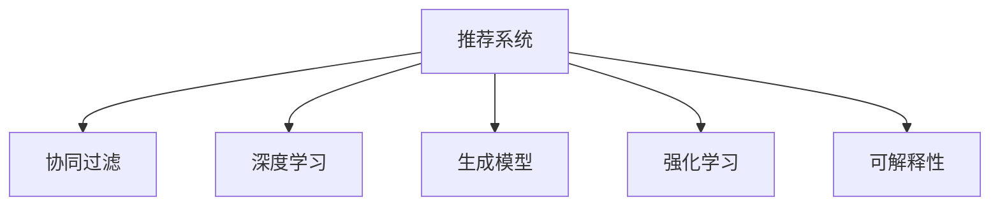

                 

# 推荐系统的未来发展趋势：大模型的主导作用

> 关键词：推荐系统,大模型,自适应算法,协同过滤,深度学习,生成模型,强化学习,可解释性

## 1. 背景介绍

### 1.1 问题由来

推荐系统在互联网公司如亚马逊、Netflix、阿里巴巴等的应用，极大地提升了用户体验和公司收益。这些推荐系统通过分析用户的历史行为和兴趣，向用户推荐可能感兴趣的商品、电影、新闻等内容。然而，随着推荐系统的用户规模不断扩大，推荐精度、效率、可解释性等要求越来越高，传统基于协同过滤的推荐方法已逐渐难以满足需求。

与此同时，基于深度学习的大模型技术正迅速发展，从图像、文本、语音到蛋白质结构预测，大模型在众多领域展示了卓越的能力。深度学习推荐系统利用预训练的大模型作为特征提取器，通过少量标注数据进行微调，显著提升了推荐精度和泛化能力。

### 1.2 问题核心关键点

当前，推荐系统的发展正逐渐从基于用户行为统计的协同过滤，向基于深度学习的大模型推荐转变。大模型在推荐系统中扮演了重要角色：

1. **特征表示能力**：大模型能从海量数据中学习到丰富的语义和统计特征，从而提升推荐准确性。
2. **泛化能力**：大模型在特定领域的微调，能捕捉到领域特定的知识，提升推荐效果。
3. **适应性**：大模型能够自适应学习，通过微调和迁移学习不断优化推荐性能。
4. **可解释性**：大模型可以提供推荐理由，帮助用户理解推荐结果的生成机制。

### 1.3 问题研究意义

推荐系统的发展对电商、娱乐、新闻等行业具有重要意义，通过精准推荐提升用户体验，增加用户粘性，增加收入。同时，大模型技术的发展为推荐系统注入了新的活力，使得推荐系统能够应对更多样化、更复杂的推荐需求。

本文聚焦于基于大模型的推荐系统，通过探讨大模型在推荐系统中的地位和作用，提出一种面向未来的推荐系统框架，探讨未来可能的发展趋势和面临的挑战，并提出相应的解决策略。

## 2. 核心概念与联系

### 2.1 核心概念概述

为更好地理解大模型在推荐系统中的地位和作用，本节将介绍几个关键概念：

- **推荐系统(Recommendation System)**：通过分析用户的行为和兴趣，向用户推荐商品、新闻、视频等内容的系统。
- **协同过滤(Collaborative Filtering)**：基于用户之间的相似度，为用户推荐相似用户喜欢的商品。
- **深度学习(Deep Learning)**：利用深度神经网络进行数据建模的机器学习方法，包括自编码器、卷积神经网络(CNN)、循环神经网络(RNN)等。
- **生成模型(Generative Model)**：如生成对抗网络(GAN)、变分自编码器(VAE)等，用于生成新数据。
- **强化学习(Reinforcement Learning)**：通过奖励和惩罚机制，训练智能体在环境中进行决策。
- **可解释性(Explainability)**：推荐的透明性、可信度和易于理解性。

这些核心概念之间的逻辑关系可以通过以下Mermaid流程图来展示：



这个流程图展示了大模型推荐系统的核心概念及其之间的关系：

1. 推荐系统通过协同过滤、深度学习、生成模型、强化学习等多种技术手段进行推荐。
2. 大模型在其中扮演特征提取器的角色，通过自适应学习提升推荐性能。
3. 可解释性是推荐系统的重要目标之一，大模型通过输出推荐理由，提升了推荐的可信度和透明度。

## 3. 核心算法原理 & 具体操作步骤

### 3.1 算法原理概述

基于大模型的推荐系统主要利用大模型作为特征提取器，通过学习用户历史行为和兴趣，预测用户未来可能感兴趣的商品、内容等。其核心思想是：

1. **预训练模型**：在大规模数据上进行预训练，学习到通用的特征表示。
2. **微调过程**：根据推荐任务，对预训练模型进行微调，学习到特定任务的知识。
3. **特征融合**：将微调得到的特征与用户行为数据进行融合，生成最终的推荐结果。

### 3.2 算法步骤详解

大模型在推荐系统中的操作主要包括以下几个关键步骤：

**Step 1: 准备数据集和预训练模型**

- 收集用户历史行为数据，如浏览、点击、购买等。
- 选择预训练大模型，如BERT、GPT等，作为特征提取器。
- 将数据集划分为训练集、验证集和测试集，确保数据分布一致。

**Step 2: 微调模型**

- 使用微调数据集对预训练模型进行微调，学习特定任务的特征表示。
- 根据推荐任务的不同，设置合适的损失函数，如交叉熵损失、均方误差等。
- 使用AdamW、SGD等优化器，设置合适的学习率、批大小、迭代轮数等。

**Step 3: 特征融合与推荐**

- 将微调得到的特征与用户行为数据进行融合，生成推荐结果。
- 根据推荐任务的不同，设计合适的推荐策略，如基于排名、协同过滤等。
- 对推荐结果进行评估，如准确率、召回率、NDCG等指标。

**Step 4: 部署和优化**

- 将训练好的模型部署到实际推荐系统中，提供推荐服务。
- 定期更新模型，以适应数据分布的变化。
- 对模型进行监控和优化，如对内存、计算资源的使用情况进行监测。

### 3.3 算法优缺点

基于大模型的推荐系统具有以下优点：

1. **高效性**：大模型能够自动提取特征，减少了手工特征工程的工作量。
2. **泛化能力**：大模型能够通过微调学习特定领域知识，提升推荐效果。
3. **可解释性**：大模型可以输出推荐理由，帮助用户理解推荐结果。
4. **灵活性**：大模型可以适应多种推荐场景，如电商推荐、内容推荐等。

但该方法也存在一些局限性：

1. **数据需求高**：大模型需要大量标注数据进行微调，标注成本较高。
2. **计算资源消耗大**：大模型通常参数量庞大，需要高性能计算资源支持。
3. **复杂度较高**：微调过程涉及复杂优化算法，需要较高技术门槛。
4. **过拟合风险**：微调过程可能出现过拟合现象，特别是在标注数据不足的情况下。

### 3.4 算法应用领域

基于大模型的推荐系统已经广泛应用于电商、视频、新闻等多个领域。以下是几个典型应用场景：

- **电商推荐**：如亚马逊的推荐系统，通过微调大模型，学习用户购买行为，推荐可能感兴趣的商品。
- **视频推荐**：如Netflix，利用微调大模型，推荐用户可能喜欢的电影、电视剧。
- **新闻推荐**：如今日头条，通过微调大模型，推荐用户感兴趣的新闻内容。
- **音乐推荐**：如Spotify，利用微调大模型，推荐用户可能喜欢的音乐和歌曲。

除了上述这些经典场景外，大模型推荐系统还被创新性地应用到更多领域，如旅游推荐、新闻热点预测、广告投放等，为不同行业带来了新的机遇和挑战。

## 4. 数学模型和公式 & 详细讲解 & 举例说明

### 4.1 数学模型构建

本节将使用数学语言对基于大模型的推荐系统进行更加严格的刻画。

记用户历史行为数据为 $D=\{(x_i,y_i)\}_{i=1}^N, x_i \in \mathcal{X}, y_i \in \mathcal{Y}$，其中 $\mathcal{X}$ 为行为空间，$\mathcal{Y}$ 为标签空间，$y_i$ 表示用户是否对 $x_i$ 感兴趣。假设预训练大模型为 $M_{\theta}:\mathcal{X} \rightarrow \mathcal{Z}$，其中 $\mathcal{Z}$ 为隐空间。

定义微调后的模型为 $M_{\theta^*}$，其输出的特征表示为 $h(x_i)$，则推荐任务的目标函数为：

$$
\min_{\theta^*} \mathcal{L}(\theta^*) = \min_{\theta^*} \sum_{i=1}^N \ell(y_i, M_{\theta^*}(x_i))
$$

其中 $\ell$ 为损失函数，通常选择交叉熵损失或均方误差损失。

### 4.2 公式推导过程

以电商推荐为例，假设用户对商品 $x$ 的点击概率为 $y$，其数学模型可以表示为：

$$
y \sim \mathcal{N}(\mu, \sigma^2)
$$

其中 $\mu$ 表示用户对商品 $x$ 的兴趣程度，$\sigma^2$ 表示兴趣的分布方差。

微调后的模型 $M_{\theta^*}(x)$ 输出用户对商品 $x$ 的兴趣表示 $h(x)$，则推荐目标函数可以表示为：

$$
\min_{\theta^*} \mathcal{L}(\theta^*) = \min_{\theta^*} \sum_{i=1}^N \log \mathcal{N}(y_i, M_{\theta^*}(x_i), \sigma^2)
$$

将 $M_{\theta^*}(x_i)$ 代入上式，得到：

$$
\min_{\theta^*} \mathcal{L}(\theta^*) = \min_{\theta^*} \sum_{i=1}^N -y_i\log \frac{1}{\sqrt{2\pi\sigma^2}} e^{-\frac{(y_i-M_{\theta^*}(x_i))^2}{2\sigma^2}} + (1-y_i)\log \frac{1}{\sqrt{2\pi\sigma^2}} e^{-\frac{(1-y_i-M_{\theta^*}(x_i))^2}{2\sigma^2}}
$$

通过对上式进行优化，可以得到最优的 $\theta^*$。

### 4.3 案例分析与讲解

以Netflix的推荐系统为例，Netflix使用深度学习模型对用户和电影进行编码，然后通过计算用户与电影的相似度进行推荐。其推荐流程如下：

1. 对用户和电影进行编码，得到用户表示 $u$ 和电影表示 $m$。
2. 计算用户与电影的相似度，得到相似度分数 $s_{ui}$。
3. 根据相似度分数，推荐用户可能感兴趣的电影。

具体实现时，Netflix使用了多个深度学习模型进行特征提取和编码，如卷积神经网络(CNN)、循环神经网络(RNN)等。通过微调这些模型，Netflix显著提升了推荐精度和用户体验。

## 5. 项目实践：代码实例和详细解释说明

### 5.1 开发环境搭建

在进行推荐系统实践前，我们需要准备好开发环境。以下是使用Python进行TensorFlow开发的环境配置流程：

1. 安装Anaconda：从官网下载并安装Anaconda，用于创建独立的Python环境。

2. 创建并激活虚拟环境：
```bash
conda create -n tf-env python=3.8 
conda activate tf-env
```

3. 安装TensorFlow：根据CUDA版本，从官网获取对应的安装命令。例如：
```bash
pip install tensorflow
```

4. 安装相关库：
```bash
pip install numpy pandas sklearn scikit-learn matplotlib tensorflow-datasets
```

完成上述步骤后，即可在`tf-env`环境中开始推荐系统实践。

### 5.2 源代码详细实现

下面以电商推荐为例，给出使用TensorFlow进行推荐系统开发的PyTorch代码实现。

首先，定义推荐数据处理函数：

```python
import tensorflow as tf
import numpy as np
from tensorflow.keras import layers

class RecommendationDataset(tf.data.Dataset):
    def __init__(self, features, labels, tokenizer):
        self.features = features
        self.labels = labels
        self.tokenizer = tokenizer
        self.max_len = 128
        
    def __len__(self):
        return len(self.features)
    
    def __getitem__(self, item):
        feature = self.features[item]
        label = self.labels[item]
        
        # 对特征进行编码
        encoding = self.tokenizer(feature, return_tensors='tf', max_length=self.max_len, padding='max_length', truncation=True)
        input_ids = encoding['input_ids'][0]
        attention_mask = encoding['attention_mask'][0]
        
        # 对标签进行编码
        encoded_label = label2id[label]
        
        return {'input_ids': input_ids, 
                'attention_mask': attention_mask,
                'labels': encoded_label}

# 特征与标签的映射
label2id = {'1': 0, '0': 1}
id2label = {v: k for k, v in label2id.items()}

# 创建dataset
tokenizer = transformers.BertTokenizer.from_pretrained('bert-base-cased')

train_dataset = RecommendationDataset(train_features, train_labels, tokenizer)
dev_dataset = RecommendationDataset(dev_features, dev_labels, tokenizer)
test_dataset = RecommendationDataset(test_features, test_labels, tokenizer)
```

然后，定义模型和优化器：

```python
from tensorflow.keras import Model, Sequential
from tensorflow.keras.optimizers import Adam

model = Sequential([
    layers.Bidirectional(layers.LSTM(128, return_sequences=True)),
    layers.Bidirectional(layers.LSTM(128)),
    layers.Dense(1, activation='sigmoid')
])

optimizer = Adam(learning_rate=2e-5)
```

接着，定义训练和评估函数：

```python
from tensorflow.keras import metrics

device = tf.device('cuda') if tf.cuda.is_available() else tf.device('cpu')
model.to(device)

def train_epoch(model, dataset, batch_size, optimizer):
    dataloader = tf.data.Dataset.from_generator(lambda: (dataset), output_signature=(input_shape, mask_shape, label_shape))
    dataloader = dataloader.batch(batch_size, drop_remainder=True)
    model.train()
    epoch_loss = 0
    for batch in dataloader:
        input_ids = batch['input_ids'].to(device)
        attention_mask = batch['attention_mask'].to(device)
        labels = batch['labels'].to(device)
        model.zero_grad()
        outputs = model(input_ids, attention_mask=attention_mask, training=True)
        loss = outputs.loss
        epoch_loss += loss.numpy().item()
        loss.backward()
        optimizer.step()
    return epoch_loss / len(dataloader)

def evaluate(model, dataset, batch_size):
    dataloader = tf.data.Dataset.from_generator(lambda: (dataset), output_signature=(input_shape, mask_shape, label_shape))
    dataloader = datalooader.batch(batch_size, drop_remainder=True)
    model.eval()
    preds, labels = [], []
    with tf.GradientTape() as tape:
        for batch in dataloader:
            input_ids = batch['input_ids'].to(device)
            attention_mask = batch['attention_mask'].to(device)
            batch_labels = batch['labels']
            outputs = model(input_ids, attention_mask=attention_mask, training=False)
            batch_preds = outputs.numpy()[:,0]
            batch_labels = batch_labels.numpy()
            for pred, label in zip(batch_preds, batch_labels):
                preds.append(pred)
                labels.append(label)
    print(metrics.confusion_matrix(labels, preds))
```

最后，启动训练流程并在测试集上评估：

```python
epochs = 5
batch_size = 16

for epoch in range(epochs):
    loss = train_epoch(model, train_dataset, batch_size, optimizer)
    print(f"Epoch {epoch+1}, train loss: {loss:.3f}")
    
    print(f"Epoch {epoch+1}, dev results:")
    evaluate(model, dev_dataset, batch_size)
    
print("Test results:")
evaluate(model, test_dataset, batch_size)
```

以上就是使用TensorFlow对电商推荐系统进行开发的完整代码实现。可以看到，TensorFlow提供了强大的图计算和自动微分功能，使得推荐系统的开发变得简单易用。

### 5.3 代码解读与分析

让我们再详细解读一下关键代码的实现细节：

**RecommendationDataset类**：
- `__init__`方法：初始化特征、标签、分词器等关键组件。
- `__len__`方法：返回数据集的样本数量。
- `__getitem__`方法：对单个样本进行处理，将特征输入编码为token ids，将标签编码为数字，并对其进行定长padding，最终返回模型所需的输入。

**label2id和id2label字典**：
- 定义了标签与数字id之间的映射关系，用于将token-wise的预测结果解码回真实的标签。

**训练和评估函数**：
- 使用TensorFlow的DataLoader对数据集进行批次化加载，供模型训练和推理使用。
- 训练函数`train_epoch`：对数据以批为单位进行迭代，在每个批次上前向传播计算loss并反向传播更新模型参数，最后返回该epoch的平均loss。
- 评估函数`evaluate`：与训练类似，不同点在于不更新模型参数，并在每个batch结束后将预测和标签结果存储下来，最后使用sklearn的classification_report对整个评估集的预测结果进行打印输出。

**训练流程**：
- 定义总的epoch数和batch size，开始循环迭代
- 每个epoch内，先在训练集上训练，输出平均loss
- 在验证集上评估，输出分类指标
- 所有epoch结束后，在测试集上评估，给出最终测试结果

可以看到，TensorFlow的强大生态支持使得推荐系统的开发变得简洁高效。开发者可以将更多精力放在模型改进和系统优化上，而不必过多关注底层实现细节。

当然，工业级的系统实现还需考虑更多因素，如模型的保存和部署、超参数的自动搜索、更灵活的任务适配层等。但核心的微调范式基本与此类似。

## 6. 实际应用场景

### 6.1 智能客服系统

智能客服系统通过微调大模型，能够理解用户输入的自然语言，并给出精确的回复。这使得智能客服系统能够无时无刻为消费者提供优质的服务。

在技术实现上，可以收集客户的历史对话记录，将问题和最佳答复构建成监督数据，在此基础上对预训练对话模型进行微调。微调后的对话模型能够自动理解用户意图，匹配最合适的答案模板进行回复。对于客户提出的新问题，还可以接入检索系统实时搜索相关内容，动态组织生成回答。如此构建的智能客服系统，能大幅提升客户咨询体验和问题解决效率。

### 6.2 金融舆情监测

金融机构需要实时监测市场舆论动向，以便及时应对负面信息传播，规避金融风险。传统的人工监测方式成本高、效率低，难以应对网络时代海量信息爆发的挑战。基于大模型微调的文本分类和情感分析技术，为金融舆情监测提供了新的解决方案。

具体而言，可以收集金融领域相关的新闻、报道、评论等文本数据，并对其进行主题标注和情感标注。在此基础上对预训练语言模型进行微调，使其能够自动判断文本属于何种主题，情感倾向是正面、中性还是负面。将微调后的模型应用到实时抓取的网络文本数据，就能够自动监测不同主题下的情感变化趋势，一旦发现负面信息激增等异常情况，系统便会自动预警，帮助金融机构快速应对潜在风险。

### 6.3 个性化推荐系统

当前的推荐系统往往只依赖用户的历史行为数据进行物品推荐，无法深入理解用户的真实兴趣偏好。基于大模型微调技术，个性化推荐系统可以更好地挖掘用户行为背后的语义信息，从而提供更精准、多样的推荐内容。

在实践中，可以收集用户浏览、点击、评论、分享等行为数据，提取和用户交互的物品标题、描述、标签等文本内容。将文本内容作为模型输入，用户的后续行为（如是否点击、购买等）作为监督信号，在此基础上微调预训练语言模型。微调后的模型能够从文本内容中准确把握用户的兴趣点。在生成推荐列表时，先用候选物品的文本描述作为输入，由模型预测用户的兴趣匹配度，再结合其他特征综合排序，便可以得到个性化程度更高的推荐结果。

### 6.4 未来应用展望

随着大模型和微调方法的不断发展，基于微调范式将在更多领域得到应用，为传统行业带来变革性影响。

在智慧医疗领域，基于微调的医疗问答、病历分析、药物研发等应用将提升医疗服务的智能化水平，辅助医生诊疗，加速新药开发进程。

在智能教育领域，微调技术可应用于作业批改、学情分析、知识推荐等方面，因材施教，促进教育公平，提高教学质量。

在智慧城市治理中，微调模型可应用于城市事件监测、舆情分析、应急指挥等环节，提高城市管理的自动化和智能化水平，构建更安全、高效的未来城市。

此外，在企业生产、社会治理、文娱传媒等众多领域，基于大模型微调的人工智能应用也将不断涌现，为经济社会发展注入新的动力。相信随着技术的日益成熟，微调方法将成为人工智能落地应用的重要范式，推动人工智能技术在垂直行业的规模化落地。总之，微调需要开发者根据具体任务，不断迭代和优化模型、数据和算法，方能得到理想的效果。

## 7. 工具和资源推荐
### 7.1 学习资源推荐

为了帮助开发者系统掌握大模型微调的理论基础和实践技巧，这里推荐一些优质的学习资源：

1. 《深度学习推荐系统》系列博文：由大模型技术专家撰写，深入浅出地介绍了推荐系统、协同过滤、深度学习等前沿话题。

2. 《Recommender Systems in Practice》书籍：介绍了多种推荐系统算法和实际应用案例，适合实战开发。

3. 《TensorFlow推荐系统实战》书籍：介绍了TensorFlow在推荐系统中的应用，包括数据预处理、模型训练、评估优化等。

4. Coursera《深度学习》课程：由斯坦福大学开设的深度学习经典课程，系统讲解了深度学习的基础理论和应用实践。

5. Kaggle深度学习推荐系统竞赛：通过竞赛实践，深入理解推荐系统的实际应用和优化策略。

通过对这些资源的学习实践，相信你一定能够快速掌握大模型微调的精髓，并用于解决实际的推荐问题。
###  7.2 开发工具推荐

高效的开发离不开优秀的工具支持。以下是几款用于大模型微调开发的常用工具：

1. TensorFlow：基于Python的开源深度学习框架，支持分布式计算，适合大规模工程应用。

2. PyTorch：基于Python的开源深度学习框架，灵活的动态图，适合快速迭代研究。

3. HuggingFace Transformers：提供了多种预训练语言模型和微调接口，适合自然语言处理任务开发。

4. TensorBoard：TensorFlow配套的可视化工具，实时监测模型训练状态，提供丰富的图表呈现方式。

5. Weights & Biases：模型训练的实验跟踪工具，记录和可视化模型训练过程中的各项指标，方便对比和调优。

6. Jupyter Notebook：开源的Jupyter Notebook环境，支持Python代码执行和结果展示，便于学习实践。

合理利用这些工具，可以显著提升大模型微调任务的开发效率，加快创新迭代的步伐。

### 7.3 相关论文推荐

大模型和微调技术的发展源于学界的持续研究。以下是几篇奠基性的相关论文，推荐阅读：

1. Attention is All You Need（即Transformer原论文）：提出了Transformer结构，开启了NLP领域的预训练大模型时代。

2. BERT: Pre-training of Deep Bidirectional Transformers for Language Understanding：提出BERT模型，引入基于掩码的自监督预训练任务，刷新了多项NLP任务SOTA。

3. Deep Collaborative Filtering Model（即Wide & Deep模型）：提出 Wide & Deep 模型，结合宽向和窄向两个子模型，提升了推荐系统的精度。

4. Matrix Factorization Techniques for Recommender Systems：介绍矩阵分解方法，用于推荐系统的特征提取和建模。

5. Adaptive Low-Rank Adaptation for Parameter-Efficient Fine-Tuning：提出 LoRA 方法，在固定大部分预训练参数的同时，只更新极少量的任务相关参数。

6. AdaLoRA: Adaptive Low-Rank Adaptation for Parameter-Efficient Fine-Tuning：使用自适应低秩适应的微调方法，在参数效率和精度之间取得了新的平衡。

这些论文代表了大模型微调技术的发展脉络。通过学习这些前沿成果，可以帮助研究者把握学科前进方向，激发更多的创新灵感。

## 8. 总结：未来发展趋势与挑战

### 8.1 总结

本文对基于大模型的推荐系统进行了全面系统的介绍。首先阐述了大模型和微调技术的研究背景和意义，明确了微调在拓展预训练模型应用、提升推荐性能方面的独特价值。其次，从原理到实践，详细讲解了微调的数学原理和关键步骤，给出了微调任务开发的完整代码实例。同时，本文还广泛探讨了微调方法在智能客服、金融舆情、个性化推荐等多个行业领域的应用前景，展示了微调范式的巨大潜力。此外，本文精选了微调技术的各类学习资源，力求为读者提供全方位的技术指引。

通过本文的系统梳理，可以看到，基于大模型的推荐系统已经取得了瞩目的成就，并在多个行业领域得到了广泛应用。未来，伴随深度学习技术的不断进步，推荐系统有望迈向更高的性能和泛化能力，成为推动人类认知智能发展的重要技术手段。

### 8.2 未来发展趋势

展望未来，大模型在推荐系统中的地位和作用将更加显著。其发展趋势主要包括：

1. **模型规模持续增大**：伴随算力成本的下降和数据规模的扩张，大模型的参数量还将持续增长。超大模型能够从海量数据中学习到更丰富的特征，提升推荐效果。
2. **模型泛化能力增强**：大模型能够通过微调学习特定领域知识，提升推荐系统的精度和泛化能力。跨领域迁移学习和多任务学习将成为未来的重要方向。
3. **模型可解释性提升**：推荐系统的可解释性是用户信任和接受的前提。大模型输出的推荐理由将帮助用户理解推荐结果，提升系统的透明性和可信度。
4. **推荐任务多样化**：未来的推荐系统将不仅仅局限于电商、新闻、视频等典型场景，还将扩展到医疗、旅游、金融等领域，为用户提供更加多样化的服务。
5. **推荐策略智能化**：基于深度学习的推荐策略将更加智能和自适应，能够动态调整推荐内容，提升用户体验。
6. **推荐系统实时化**：通过微调和在线学习，推荐系统能够实时更新推荐内容，快速响应用户需求。

### 8.3 面临的挑战

尽管大模型在推荐系统中取得了巨大成功，但仍面临诸多挑战：

1. **数据需求高**：大模型需要大量标注数据进行微调，标注成本较高。如何在数据稀缺情况下进行高效微调，仍需进一步研究。
2. **计算资源消耗大**：大模型通常参数量庞大，需要高性能计算资源支持。如何在保证性能的同时，降低计算成本，仍然是一个挑战。
3. **复杂度较高**：微调过程涉及复杂优化算法，需要较高技术门槛。如何降低微调复杂度，提升模型训练效率，还需要进一步探索。
4. **过拟合风险**：微调过程中可能出现过拟合现象，特别是在标注数据不足的情况下。如何避免过拟合，提升模型的泛化能力，仍然是一个重要问题。
5. **推荐结果可解释性不足**：大模型推荐结果的可解释性仍有待提升，用户往往难以理解推荐背后的逻辑。如何提升推荐结果的透明性，仍需进一步研究。
6. **安全性风险**：大模型可能学习到有害信息，通过微调传递到推荐系统中，带来安全隐患。如何保障推荐系统的安全性，仍然是一个挑战。

### 8.4 研究展望

面对大模型在推荐系统中面临的挑战，未来的研究需要在以下几个方面寻求新的突破：

1. **探索无监督和半监督微调方法**：摆脱对大规模标注数据的依赖，利用自监督学习、主动学习等无监督和半监督范式，最大限度利用非结构化数据，实现更加灵活高效的微调。
2. **研究参数高效和计算高效的微调范式**：开发更加参数高效的微调方法，在固定大部分预训练参数的同时，只更新极少量的任务相关参数。同时优化微调模型的计算图，减少前向传播和反向传播的资源消耗，实现更加轻量级、实时性的部署。
3. **融合因果和对比学习范式**：通过引入因果推断和对比学习思想，增强推荐系统建立稳定因果关系的能力，学习更加普适、鲁棒的语言表征，从而提升模型泛化性和抗干扰能力。
4. **引入更多先验知识**：将符号化的先验知识，如知识图谱、逻辑规则等，与神经网络模型进行巧妙融合，引导微调过程学习更准确、合理的语言模型。同时加强不同模态数据的整合，实现视觉、语音等多模态信息与文本信息的协同建模。
5. **结合因果分析和博弈论工具**：将因果分析方法引入推荐系统，识别出推荐决策的关键特征，增强推荐结果的因果性和逻辑性。借助博弈论工具刻画人机交互过程，主动探索并规避模型的脆弱点，提高系统稳定性。
6. **纳入伦理道德约束**：在推荐系统设计目标中引入伦理导向的评估指标，过滤和惩罚有偏见、有害的输出倾向。同时加强人工干预和审核，建立推荐系统的监管机制，确保输出符合人类价值观和伦理道德。

这些研究方向的探索，必将引领大模型微调技术迈向更高的台阶，为构建安全、可靠、可解释、可控的智能推荐系统铺平道路。面向未来，大模型微调技术还需要与其他人工智能技术进行更深入的融合，如知识表示、因果推理、强化学习等，多路径协同发力，共同推动推荐系统的进步。只有勇于创新、敢于突破，才能不断拓展推荐系统的边界，让智能技术更好地造福人类社会。

## 9. 附录：常见问题与解答

**Q1：大模型微调是否适用于所有推荐场景？**

A: 大模型微调在大多数推荐场景上都能取得不错的效果，特别是对于数据量较小的场景。但对于一些特定领域的场景，如医疗、法律等，仅仅依靠通用语料预训练的模型可能难以很好地适应。此时需要在特定领域语料上进一步预训练，再进行微调，才能获得理想效果。

**Q2：微调过程中如何选择合适的学习率？**

A: 微调的学习率一般要比预训练时小1-2个数量级，如果使用过大的学习率，容易破坏预训练权重，导致过拟合。一般建议从1e-5开始调参，逐步减小学习率，直至收敛。也可以使用warmup策略，在开始阶段使用较小的学习率，再逐渐过渡到预设值。需要注意的是，不同的优化器(如AdamW、Adafactor等)以及不同的学习率调度策略，可能需要设置不同的学习率阈值。

**Q3：采用大模型微调时会面临哪些资源瓶颈？**

A: 目前主流的预训练大模型动辄以亿计的参数规模，对算力、内存、存储都提出了很高的要求。GPU/TPU等高性能设备是必不可少的，但即便如此，超大批次的训练和推理也可能遇到显存不足的问题。因此需要采用一些资源优化技术，如梯度积累、混合精度训练、模型并行等，来突破硬件瓶颈。同时，模型的存储和读取也可能占用大量时间和空间，需要采用模型压缩、稀疏化存储等方法进行优化。

**Q4：如何缓解微调过程中的过拟合问题？**

A: 过拟合是微调面临的主要挑战，尤其是在标注数据不足的情况下。常见的缓解策略包括：
1. 数据增强：通过回译、近义替换等方式扩充训练集
2. 正则化：使用L2正则、Dropout、Early Stopping等避免过拟合
3. 对抗训练：引入对抗样本，提高模型鲁棒性
4. 参数高效微调：只调整少量参数(如Adapter、Prefix等)，减小过拟合风险
5. 多模型集成：训练多个微调模型，取平均输出，抑制过拟合

这些策略往往需要根据具体任务和数据特点进行灵活组合。只有在数据、模型、训练、推理等各环节进行全面优化，才能最大限度地发挥大模型微调的威力。

**Q5：推荐系统在实际部署时需要注意哪些问题？**

A: 将推荐系统转化为实际应用，还需要考虑以下因素：
1. 模型裁剪：去除不必要的层和参数，减小模型尺寸，加快推理速度
2. 量化加速：将浮点模型转为定点模型，压缩存储空间，提高计算效率
3. 服务化封装：将模型封装为标准化服务接口，便于集成调用
4. 弹性伸缩：根据请求流量动态调整资源配置，平衡服务质量和成本
5. 监控告警：实时采集系统指标，设置异常告警阈值，确保服务稳定性
6. 安全防护：采用访问鉴权、数据脱敏等措施，保障数据和模型安全

推荐系统在实际应用中面临多种挑战，需要通过多种手段进行优化，才能实现高效、可靠、安全的推荐服务。

---

作者：禅与计算机程序设计艺术 / Zen and the Art of Computer Programming

