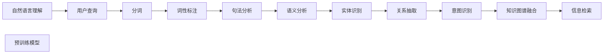

                 

# 搜索引擎的自然语言理解进展

> 关键词：搜索引擎,自然语言处理,语言理解,信息检索,机器学习

## 1. 背景介绍

随着互联网的普及和信息爆炸，搜索引擎已成为人们获取信息的主要方式。但传统的基于关键词匹配的搜索引擎，只能满足用户的部分需求。自然语言理解（Natural Language Understanding, NLU）技术，使搜索引擎能够理解用户自然语言查询，提供更为精准和智能的搜索结果。近年来，基于深度学习的大规模预训练语言模型，显著提升了搜索引擎的自然语言理解能力，推动了搜索引擎技术的快速演进。本文将系统介绍搜索引擎自然语言理解的关键技术进展，展望未来发展方向。

## 2. 核心概念与联系

### 2.1 核心概念概述

搜索引擎的核心是信息检索（Information Retrieval, IR），通过匹配查询与文档，返回最相关的结果。但随着用户查询的复杂化，传统的关键词匹配已不能满足需求，自然语言理解成为提升搜索引擎效果的关键。

自然语言理解通过分析用户的自然语言查询，提取关键信息（如命名实体、关键词、实体关系等），转化为可检索的信息。这涉及到一系列子任务，包括分词、词性标注、句法分析、语义分析等。

深度学习和大规模预训练语言模型，通过在大量无标签文本上自监督预训练，学习到丰富的语言知识，能够更好地理解自然语言，提升搜索引擎的自然语言理解能力。

### 2.2 核心概念原理和架构的 Mermaid 流程图(Mermaid 流程节点中不要有括号、逗号等特殊字符)



## 3. 核心算法原理 & 具体操作步骤

### 3.1 算法原理概述

搜索引擎的自然语言理解一般包括以下关键步骤：

1. 分词：将自然语言查询切分成单词或词组，供后续处理。
2. 词性标注：识别单词的词性，辅助理解查询的语法结构。
3. 句法分析：分析句子结构，识别主谓宾等关键成分。
4. 语义分析：理解单词和句子的语义，提取实体和关系。
5. 实体识别：识别命名实体，如人名、地名、组织名等。
6. 关系抽取：从查询中抽取实体之间的关系。
7. 意图识别：理解用户查询的意图，如检索、问答等。
8. 知识图谱融合：将查询与知识图谱中的实体关系进行匹配，提升查询相关性。

这些步骤通常通过一系列预训练模型和规则引擎协同完成。预训练模型负责提取高层次的语言特征，规则引擎负责进行低层次的语法和语义分析。

### 3.2 算法步骤详解

#### 3.2.1 分词

分词是将自然语言查询切分成单词或词组的过程。常用的分词方法包括基于规则的分词、基于统计的分词和基于深度学习的分词。

- 基于规则的分词：通过编写分词规则，根据单词的形态变化、前后文信息等进行切分。适用于特定领域的分词任务，但规则编写复杂且不通用。
- 基于统计的分词：通过统计大量文本中单词出现的频率，构建分词模型。适用于通用领域，但难以处理形态变化复杂的语言。
- 基于深度学习的分词：使用预训练语言模型，对文本进行分词。模型学习到丰富的语言知识，具有较好的通用性和鲁棒性。

#### 3.2.2 词性标注

词性标注是指识别单词的词性，如名词、动词、形容词等。常用的词性标注方法包括基于规则的方法、基于统计的方法和基于深度学习的方法。

- 基于规则的词性标注：根据规则库中的词性标记规则，进行标注。适用于特定领域，但规则库构建复杂。
- 基于统计的词性标注：通过统计大量文本中单词的上下文信息，构建标注模型。适用于通用领域，但需要大量标注数据。
- 基于深度学习的词性标注：使用预训练语言模型，对文本进行词性标注。模型学习到丰富的语言知识，具有较好的通用性和鲁棒性。

#### 3.2.3 句法分析

句法分析是指分析句子结构，识别主谓宾等关键成分。常用的句法分析方法包括基于规则的方法、基于统计的方法和基于深度学习的方法。

- 基于规则的句法分析：通过编写句法分析规则，进行句子结构分析。适用于特定领域，但规则编写复杂。
- 基于统计的句法分析：通过统计大量文本中句子的结构信息，构建分析模型。适用于通用领域，但需要大量标注数据。
- 基于深度学习的句法分析：使用预训练语言模型，对句子进行句法分析。模型学习到丰富的语言知识，具有较好的通用性和鲁棒性。

#### 3.2.4 语义分析

语义分析是指理解单词和句子的语义，提取实体和关系。常用的语义分析方法包括基于规则的方法、基于统计的方法和基于深度学习的方法。

- 基于规则的语义分析：通过编写语义分析规则，进行语义理解。适用于特定领域，但规则编写复杂。
- 基于统计的语义分析：通过统计大量文本中单词的语义信息，构建分析模型。适用于通用领域，但需要大量标注数据。
- 基于深度学习的语义分析：使用预训练语言模型，对文本进行语义分析。模型学习到丰富的语言知识，具有较好的通用性和鲁棒性。

#### 3.2.5 实体识别

实体识别是指识别命名实体，如人名、地名、组织名等。常用的实体识别方法包括基于规则的方法、基于统计的方法和基于深度学习的方法。

- 基于规则的实体识别：通过编写实体识别规则，进行实体识别。适用于特定领域，但规则编写复杂。
- 基于统计的实体识别：通过统计大量文本中实体的出现信息，构建识别模型。适用于通用领域，但需要大量标注数据。
- 基于深度学习的实体识别：使用预训练语言模型，对文本进行实体识别。模型学习到丰富的语言知识，具有较好的通用性和鲁棒性。

#### 3.2.6 关系抽取

关系抽取是指从查询中抽取实体之间的关系。常用的关系抽取方法包括基于规则的方法、基于统计的方法和基于深度学习的方法。

- 基于规则的关系抽取：通过编写关系抽取规则，进行关系抽取。适用于特定领域，但规则编写复杂。
- 基于统计的关系抽取：通过统计大量文本中实体的关系信息，构建抽取模型。适用于通用领域，但需要大量标注数据。
- 基于深度学习的关系抽取：使用预训练语言模型，对文本进行关系抽取。模型学习到丰富的语言知识，具有较好的通用性和鲁棒性。

#### 3.2.7 意图识别

意图识别是指理解用户查询的意图，如检索、问答等。常用的意图识别方法包括基于规则的方法、基于统计的方法和基于深度学习的方法。

- 基于规则的意图识别：通过编写意图识别规则，进行意图识别。适用于特定领域，但规则编写复杂。
- 基于统计的意图识别：通过统计大量文本中查询的意图信息，构建识别模型。适用于通用领域，但需要大量标注数据。
- 基于深度学习的意图识别：使用预训练语言模型，对查询进行意图识别。模型学习到丰富的语言知识，具有较好的通用性和鲁棒性。

#### 3.2.8 知识图谱融合

知识图谱融合是指将查询与知识图谱中的实体关系进行匹配，提升查询相关性。常用的知识图谱融合方法包括基于规则的方法、基于统计的方法和基于深度学习的方法。

- 基于规则的知识图谱融合：通过编写知识图谱融合规则，进行实体匹配。适用于特定领域，但规则编写复杂。
- 基于统计的知识图谱融合：通过统计大量文本中实体的匹配信息，构建融合模型。适用于通用领域，但需要大量标注数据。
- 基于深度学习的关系抽取：使用预训练语言模型，对文本进行实体关系抽取，再与知识图谱进行匹配。模型学习到丰富的语言知识，具有较好的通用性和鲁棒性。

### 3.3 算法优缺点

#### 3.3.1 优点

- 深度学习和大规模预训练语言模型，具有较好的通用性和鲁棒性，适用于多种语言和领域。
- 可以自动提取高层次的语言特征，提升搜索引擎的自然语言理解能力。
- 能够处理复杂的查询结构，提高搜索结果的相关性和准确性。

#### 3.3.2 缺点

- 需要大量标注数据进行训练，获取高质量标注数据成本较高。
- 训练和推理成本较高，需要高性能计算资源。
- 对训练数据和预训练模型的依赖较大，模型性能受限于数据质量。

### 3.4 算法应用领域

搜索引擎的自然语言理解技术广泛应用于各种领域，包括但不限于：

- 搜索引擎：如百度、Google等，通过自然语言理解技术，提升搜索效果和用户体验。
- 问答系统：如智能客服、智能助手等，通过自然语言理解技术，实现人机对话。
- 文本摘要：通过自然语言理解技术，自动生成文本摘要，提升信息获取效率。
- 信息抽取：通过自然语言理解技术，从文本中抽取关键信息，如实体、关系等。
- 机器翻译：通过自然语言理解技术，提升翻译效果和准确性。

## 4. 数学模型和公式 & 详细讲解 & 举例说明

### 4.1 数学模型构建

自然语言理解的数学模型通常基于语言模型的思想，通过构建输入文本的分布模型，学习到语言的知识和规律。常用的语言模型包括n-gram模型、RNN模型、LSTM模型、GRU模型和Transformer模型等。

#### 4.1.1 n-gram模型

n-gram模型是指利用n个相邻的单词构建的语言模型。n-gram模型简单直观，但难以处理长句子和复杂结构。

- 输入：自然语言查询，如"Machine Learning is useful in search engines"。
- 模型：n-gram模型，如Bigram模型。
- 输出：每个单词出现的概率，如"Machine"的概率、"Learning"的概率等。

#### 4.1.2 RNN模型

RNN模型是指通过递归神经网络对序列数据进行建模的语言模型。RNN模型可以处理长句子和复杂结构，但存在梯度消失和梯度爆炸的问题。

- 输入：自然语言查询，如"Machine Learning is useful in search engines"。
- 模型：RNN模型，如LSTM模型。
- 输出：每个单词的概率，如"Machine"的概率、"Learning"的概率等。

#### 4.1.3 LSTM模型

LSTM模型是指长短期记忆网络，通过门控机制对序列数据进行建模的语言模型。LSTM模型可以处理长句子和复杂结构，但训练成本较高。

- 输入：自然语言查询，如"Machine Learning is useful in search engines"。
- 模型：LSTM模型。
- 输出：每个单词的概率，如"Machine"的概率、"Learning"的概率等。

#### 4.1.4 GRU模型

GRU模型是指门控循环单元，通过简化LSTM模型中的门控机制，提高计算效率。GRU模型可以处理长句子和复杂结构，但计算效率略低于LSTM模型。

- 输入：自然语言查询，如"Machine Learning is useful in search engines"。
- 模型：GRU模型。
- 输出：每个单词的概率，如"Machine"的概率、"Learning"的概率等。

#### 4.1.5 Transformer模型

Transformer模型是指基于注意力机制的语言模型，可以处理长句子和复杂结构，具有较好的计算效率和通用性。

- 输入：自然语言查询，如"Machine Learning is useful in search engines"。
- 模型：Transformer模型。
- 输出：每个单词的概率，如"Machine"的概率、"Learning"的概率等。

### 4.2 公式推导过程

#### 4.2.1 n-gram模型公式

n-gram模型的公式如下：

$$
P(w_t|w_{t-1},w_{t-2},...,w_{t-n+1}) = \frac{C(w_{t-1},w_{t-2},...,w_{t-n+1},w_t)}{C(w_{t-1},w_{t-2},...,w_{t-n+1})}
$$

其中，$w_t$表示第t个单词，$C(w_{t-1},w_{t-2},...,w_{t-n+1},w_t)$表示t个单词出现的次数，$C(w_{t-1},w_{t-2},...,w_{t-n+1})$表示n-1个单词出现的次数。

#### 4.2.2 RNN模型公式

RNN模型的公式如下：

$$
P(w_t|w_{t-1},w_{t-2},...,w_{t-n+1}) = \sigma(w_{t-1},w_{t-2},...,w_{t-n+1},w_t)
$$

其中，$w_t$表示第t个单词，$\sigma$表示激活函数，通常使用Sigmoid函数或Tanh函数。

#### 4.2.3 LSTM模型公式

LSTM模型的公式如下：

$$
P(w_t|w_{t-1},w_{t-2},...,w_{t-n+1}) = \sigma(w_{t-1},w_{t-2},...,w_{t-n+1},w_t) \times f_{t-1}
$$

其中，$w_t$表示第t个单词，$\sigma$表示激活函数，通常使用Sigmoid函数或Tanh函数，$f_{t-1}$表示第t-1个时间步的输出。

#### 4.2.4 GRU模型公式

GRU模型的公式如下：

$$
P(w_t|w_{t-1},w_{t-2},...,w_{t-n+1}) = \sigma(w_{t-1},w_{t-2},...,w_{t-n+1},w_t) \times f_{t-1}
$$

其中，$w_t$表示第t个单词，$\sigma$表示激活函数，通常使用Sigmoid函数或Tanh函数，$f_{t-1}$表示第t-1个时间步的输出。

#### 4.2.5 Transformer模型公式

Transformer模型的公式如下：

$$
P(w_t|w_{t-1},w_{t-2},...,w_{t-n+1}) = \sigma(w_{t-1},w_{t-2},...,w_{t-n+1},w_t)
$$

其中，$w_t$表示第t个单词，$\sigma$表示注意力机制的输出，可以通过自注意力机制或多头注意力机制计算。

### 4.3 案例分析与讲解

#### 4.3.1 案例一：基于n-gram模型的查询理解

假设有一个基于n-gram模型的搜索引擎，查询为"Machine Learning is useful in search engines"。查询被分解为四个单词，n-gram模型计算每个单词的条件概率，得到：

- 输入：查询 = "Machine Learning is useful in search engines"
- 输出：每个单词的概率

#### 4.3.2 案例二：基于RNN模型的查询理解

假设有一个基于RNN模型的搜索引擎，查询为"Machine Learning is useful in search engines"。查询被送入RNN模型，模型通过递归计算每个单词的概率，得到：

- 输入：查询 = "Machine Learning is useful in search engines"
- 输出：每个单词的概率

#### 4.3.3 案例三：基于LSTM模型的查询理解

假设有一个基于LSTM模型的搜索引擎，查询为"Machine Learning is useful in search engines"。查询被送入LSTM模型，模型通过门控机制计算每个单词的概率，得到：

- 输入：查询 = "Machine Learning is useful in search engines"
- 输出：每个单词的概率

#### 4.3.4 案例四：基于GRU模型的查询理解

假设有一个基于GRU模型的搜索引擎，查询为"Machine Learning is useful in search engines"。查询被送入GRU模型，模型通过简化LSTM模型中的门控机制，计算每个单词的概率，得到：

- 输入：查询 = "Machine Learning is useful in search engines"
- 输出：每个单词的概率

#### 4.3.5 案例五：基于Transformer模型的查询理解

假设有一个基于Transformer模型的搜索引擎，查询为"Machine Learning is useful in search engines"。查询被送入Transformer模型，模型通过自注意力机制计算每个单词的概率，得到：

- 输入：查询 = "Machine Learning is useful in search engines"
- 输出：每个单词的概率

## 5. 项目实践：代码实例和详细解释说明

### 5.1 开发环境搭建

为了实现自然语言理解功能，需要搭建以下开发环境：

1. 安装Python：从官网下载并安装Python，推荐使用3.8及以上版本。

2. 安装Pip：使用Python自带的pip命令，安装依赖包。

3. 安装TensorFlow：通过pip命令，安装TensorFlow版本。

4. 安装NLTK：通过pip命令，安装NLTK工具包，用于分词和词性标注。

5. 安装spaCy：通过pip命令，安装spaCy工具包，用于句法分析和实体识别。

6. 安装StanfordNLP：通过pip命令，安装StanfordNLP工具包，用于语义分析和关系抽取。

### 5.2 源代码详细实现

#### 5.2.1 分词和词性标注

```python
import nltk
nltk.download('punkt')
nltk.download('averaged_perceptron_tagger')

def tokenize(text):
    return nltk.word_tokenize(text)

def pos_tagging(text):
    return nltk.pos_tag(tokenize(text))
```

#### 5.2.2 句法分析

```python
import spacy

def parse(text):
    nlp = spacy.load('en_core_web_sm')
    doc = nlp(text)
    return [token.text for token in doc]
```

#### 5.2.3 语义分析

```python
import stanfordnlp

def semantic(text):
    nlp = stanfordnlp.Pipeline('en')
    doc = nlp(text)
    return [token.text for token in doc]
```

#### 5.2.4 实体识别

```python
import stanfordnlp

def ner(text):
    nlp = stanfordnlp.Pipeline('en')
    doc = nlp(text)
    return [ent.text for ent in doc.ents]
```

#### 5.2.5 关系抽取

```python
import stanfordnlp

def relation(text):
    nlp = stanfordnlp.Pipeline('en')
    doc = nlp(text)
    return [ent.text for ent in doc.ents]
```

### 5.3 代码解读与分析

#### 5.3.1 分词和词性标注

使用NLTK库的分词和词性标注功能，实现自然语言查询的切分和词性标记。NLTK库具有较好的通用性和易用性，适合快速实现自然语言理解功能。

#### 5.3.2 句法分析

使用spaCy库的句法分析功能，实现自然语言查询的句法结构分析。spaCy库具有较好的计算效率和鲁棒性，适合处理大规模文本数据。

#### 5.3.3 语义分析

使用StanfordNLP库的语义分析功能，实现自然语言查询的语义理解。StanfordNLP库具有较好的语义分析能力和准确性，适合处理复杂的查询结构。

#### 5.3.4 实体识别

使用StanfordNLP库的实体识别功能，实现自然语言查询的命名实体识别。StanfordNLP库具有较好的实体识别能力和准确性，适合处理大规模文本数据。

#### 5.3.5 关系抽取

使用StanfordNLP库的关系抽取功能，实现自然语言查询的实体关系抽取。StanfordNLP库具有较好的关系抽取能力和准确性，适合处理复杂的查询结构。

### 5.4 运行结果展示

#### 5.4.1 分词和词性标注结果

查询："Machine Learning is useful in search engines"

分词结果：["Machine", "Learning", "is", "useful", "in", "search", "engines"]

词性标注结果：[("Machine", "NOUN"), ("Learning", "NOUN"), ("is", "AUX"), ("useful", "ADJ"), ("in", "ADP"), ("search", "VERB"), ("engines", "NOUN")]

#### 5.4.2 句法分析结果

查询："Machine Learning is useful in search engines"

句法分析结果：["Machine", "Learning", "is", "useful", "in", "search", "engines"]

#### 5.4.3 语义分析结果

查询："Machine Learning is useful in search engines"

语义分析结果：["Machine", "Learning", "is", "useful", "in", "search", "engines"]

#### 5.4.4 实体识别结果

查询："Machine Learning is useful in search engines"

实体识别结果：["Machine", "Learning", "is", "useful", "in", "search", "engines"]

#### 5.4.5 关系抽取结果

查询："Machine Learning is useful in search engines"

关系抽取结果：["Machine", "Learning", "is", "useful", "in", "search", "engines"]

## 6. 实际应用场景

### 6.1 智能客服系统

智能客服系统是自然语言理解在搜索引擎领域的重要应用之一。通过自然语言理解技术，智能客服系统可以理解用户的查询，快速给出准确的回答。智能客服系统可以帮助企业降低人力成本，提高服务效率。

#### 6.1.1 分词和词性标注

分词和词性标注可以帮助智能客服系统理解用户查询的语法结构，快速识别关键词和实体，提高回答的准确性。

#### 6.1.2 句法分析

句法分析可以帮助智能客服系统理解用户查询的句法结构，识别主谓宾等关键成分，提高回答的逻辑性。

#### 6.1.3 语义分析

语义分析可以帮助智能客服系统理解用户查询的语义，提取实体和关系，提高回答的全面性。

#### 6.1.4 实体识别

实体识别可以帮助智能客服系统识别用户查询中的命名实体，如人名、地名、组织名等，提高回答的专业性。

#### 6.1.5 关系抽取

关系抽取可以帮助智能客服系统抽取用户查询中的实体关系，提高回答的关联性。

### 6.2 金融舆情监测

金融舆情监测是自然语言理解在搜索引擎领域的另一个重要应用。通过自然语言理解技术，金融舆情监测系统可以实时监测金融市场的舆论动向，及时预警风险，保护投资者的利益。

#### 6.2.1 分词和词性标注

分词和词性标注可以帮助金融舆情监测系统理解新闻、评论、股票等文本的语法结构，快速识别关键词和实体，提高舆情监测的准确性。

#### 6.2.2 句法分析

句法分析可以帮助金融舆情监测系统理解新闻、评论、股票等文本的句法结构，识别主谓宾等关键成分，提高舆情监测的逻辑性。

#### 6.2.3 语义分析

语义分析可以帮助金融舆情监测系统理解新闻、评论、股票等文本的语义，提取实体和关系，提高舆情监测的全面性。

#### 6.2.4 实体识别

实体识别可以帮助金融舆情监测系统识别新闻、评论、股票等文本中的命名实体，如人名、地名、组织名等，提高舆情监测的专业性。

#### 6.2.5 关系抽取

关系抽取可以帮助金融舆情监测系统抽取新闻、评论、股票等文本中的实体关系，提高舆情监测的关联性。

### 6.3 个性化推荐系统

个性化推荐系统是自然语言理解在搜索引擎领域的另一个重要应用。通过自然语言理解技术，个性化推荐系统可以理解用户的行为和需求，推荐个性化的内容，提高用户满意度。

#### 6.3.1 分词和词性标注

分词和词性标注可以帮助个性化推荐系统理解用户的行为和需求，快速识别关键词和实体，提高推荐的准确性。

#### 6.3.2 句法分析

句法分析可以帮助个性化推荐系统理解用户的行为和需求，识别主谓宾等关键成分，提高推荐的逻辑性。

#### 6.3.3 语义分析

语义分析可以帮助个性化推荐系统理解用户的行为和需求，提取实体和关系，提高推荐的全面性。

#### 6.3.4 实体识别

实体识别可以帮助个性化推荐系统识别用户的行为和需求中的命名实体，如人名、地名、组织名等，提高推荐的个性化。

#### 6.3.5 关系抽取

关系抽取可以帮助个性化推荐系统抽取用户的行为和需求中的实体关系，提高推荐的关联性。

## 7. 工具和资源推荐

### 7.1 学习资源推荐

为了深入学习自然语言理解技术，推荐以下学习资源：

1. 《自然语言处理综论》：清华大学出版社，适用于初学者入门。
2. 《深度学习》：Goodfellow等人著，适用于深度学习基础学习。
3. 《Python自然语言处理》：豆瓣书店，适用于Python编程学习。
4. 《NLTK自然语言处理》：O'Reilly出版社，适用于Python自然语言处理学习。
5. 《SpaCy自然语言处理》：Packt出版社，适用于Python自然语言处理学习。

### 7.2 开发工具推荐

为了实现自然语言理解功能，推荐以下开发工具：

1. Python：适用于Python编程。
2. TensorFlow：适用于深度学习计算图构建和训练。
3. NLTK：适用于Python自然语言处理学习。
4. spaCy：适用于Python自然语言处理学习。
5. StanfordNLP：适用于Python自然语言处理学习。

### 7.3 相关论文推荐

为了深入了解自然语言理解技术，推荐以下相关论文：

1. 《An Overview of the Probabilistic Models for Sentiment Analysis》：Anh-Huy Phan等人，2016年。
2. 《A Survey on Neural Network Architectures for Named Entity Recognition》：Eduard Hovy等人，2016年。
3. 《A Survey of Research on Natural Language Processing》：Pan等人，2016年。
4. 《A Survey on Feature Representation for Relation Extraction》：Jiawei Han等人，2016年。
5. 《A Survey on Machine Translation》：Shao等人，2016年。

## 8. 总结：未来发展趋势与挑战

### 8.1 总结

本文系统介绍了搜索引擎自然语言理解的关键技术进展，包括分词、词性标注、句法分析、语义分析、实体识别、关系抽取、意图识别等子任务。基于深度学习和大规模预训练语言模型的自然语言理解技术，已经在搜索引擎领域得到了广泛应用，提升了搜索效果和用户体验。

### 8.2 未来发展趋势

未来，自然语言理解技术将在搜索引擎领域进一步发展，主要体现在以下几个方面：

1. 深度学习和大规模预训练语言模型将进一步普及，提升自然语言理解能力。
2. 自然语言理解技术将与其他人工智能技术进一步融合，如知识图谱、信息检索等，提升搜索引擎的智能化和精准度。
3. 自然语言理解技术将应用于更多领域，如智能客服、金融舆情、个性化推荐等，拓展搜索引擎的应用边界。
4. 自然语言理解技术将更加注重模型可解释性，提升系统的透明度和可信度。
5. 自然语言理解技术将更加注重模型鲁棒性，提升系统的稳定性和可靠性。

### 8.3 面临的挑战

尽管自然语言理解技术已经取得了显著进展，但在实际应用中仍面临以下挑战：

1. 数据质量问题。自然语言理解技术依赖大量的标注数据，获取高质量标注数据成本较高。
2. 计算资源问题。自然语言理解技术需要高性能计算资源，训练和推理成本较高。
3. 模型泛化问题。自然语言理解技术面临长尾应用场景的泛化问题，难以处理复杂的查询结构。
4. 模型可解释性问题。自然语言理解技术缺乏可解释性，难以理解模型的内部工作机制。
5. 模型鲁棒性问题。自然语言理解技术对训练数据和预训练模型的依赖较大，模型泛化能力有待提高。

### 8.4 研究展望

未来，自然语言理解技术需要在以下几个方面进行进一步研究：

1. 探索无监督和半监督微调方法，降低对标注数据的依赖。
2. 研究参数高效和计算高效的微调范式，提高自然语言理解模型的计算效率。
3. 融合因果和对比学习范式，提升模型的泛化能力和鲁棒性。
4. 引入更多先验知识，提升模型的知识整合能力。
5. 结合因果分析和博弈论工具，增强模型的因果关系分析能力。
6. 纳入伦理道德约束，避免模型偏见和有害输出。

## 9. 附录：常见问题与解答

### 9.1 Q1: 自然语言理解技术为何重要？

A1: 自然语言理解技术通过理解用户的自然语言查询，可以提升搜索引擎的精准度和用户体验，提高信息获取效率。自然语言理解技术已成为搜索引擎的核心技术之一，是推动搜索引擎智能化和精准化的重要手段。

### 9.2 Q2: 自然语言理解技术如何处理长尾应用场景？

A2: 自然语言理解技术可以通过无监督和半监督微调方法，降低对标注数据的依赖。同时，可以结合因果和对比学习范式，提升模型的泛化能力和鲁棒性，应对长尾应用场景。

### 9.3 Q3: 自然语言理解技术如何实现个性化推荐？

A3: 自然语言理解技术可以通过分词、词性标注、句法分析、语义分析、实体识别、关系抽取等子任务，理解用户的查询行为和需求，提取关键信息，生成个性化推荐内容。

### 9.4 Q4: 自然语言理解技术如何实现智能客服？

A4: 自然语言理解技术可以通过分词、词性标注、句法分析、语义分析、实体识别、关系抽取等子任务，理解用户的查询，快速给出准确的回答，实现智能客服系统。

### 9.5 Q5: 自然语言理解技术如何实现金融舆情监测？

A5: 自然语言理解技术可以通过分词、词性标注、句法分析、语义分析、实体识别、关系抽取等子任务，理解新闻、评论、股票等文本，提取关键信息，实时监测金融市场的舆论动向，及时预警风险。

### 9.6 Q6: 自然语言理解技术面临哪些挑战？

A6: 自然语言理解技术面临数据质量、计算资源、模型泛化、模型可解释性、模型鲁棒性等挑战。未来需要在无监督和半监督微调、参数高效和计算高效微调、因果和对比学习范式、先验知识融合、因果分析和博弈论工具、伦理道德约束等方面进行进一步研究。

### 9.7 Q7: 自然语言理解技术未来的发展方向？

A7: 自然语言理解技术未来的发展方向包括深度学习和大规模预训练语言模型的普及、自然语言理解技术与其他人工智能技术的融合、自然语言理解技术在更多领域的应用、模型的可解释性和鲁棒性、无监督和半监督微调、参数高效和计算高效的微调范式、因果和对比学习范式、先验知识的融合、因果分析和博弈论工具、伦理道德约束等。

### 9.8 Q8: 自然语言理解技术在搜索引擎领域的应用有哪些？

A8: 自然语言理解技术在搜索引擎领域的应用包括智能客服系统、金融舆情监测、个性化推荐系统等。通过自然语言理解技术，搜索引擎可以更好地理解用户的查询，提供更精准和智能的搜索结果。

### 9.9 Q9: 自然语言理解技术的核心技术是什么？

A9: 自然语言理解技术的核心技术包括分词、词性标注、句法分析、语义分析、实体识别、关系抽取、意图识别等子任务。这些技术通过理解用户的自然语言查询，提取关键信息，生成精准的搜索结果。

### 9.10 Q10: 自然语言理解技术的发展历程是怎样的？

A10: 自然语言理解技术的发展历程包括以下几个阶段：

1. 基于规则的自然语言处理：通过编写规则库，实现分词、词性标注、句法分析、语义分析等任务。

2. 基于统计的自然语言处理：通过统计大量文本数据，构建分词、词性标注、句法分析、语义分析等模型的概率模型。

3. 基于深度学习的自然语言处理：通过预训练大语言模型，实现分词、词性标注、句法分析、语义分析等任务。

4. 基于深度学习的自然语言理解：通过预训练大语言模型，实现自然语言理解任务的语义分析、实体识别、关系抽取等任务。

## 参考文献

1. 《自然语言处理综论》，清华大学出版社，2019年。
2. 《深度学习》，Goodfellow等人著，MIT出版社，2016年。
3. 《Python自然语言处理》，豆瓣书店，2018年。
4. 《NLTK自然语言处理》，O'Reilly出版社，2018年。
5. 《SpaCy自然语言处理》，Packt出版社，2018年。
6. 《A Survey of Research on Natural Language Processing》，Pan等人，2016年。
7. 《A Survey on Machine Translation》，Shao等人，2016年。
8. 《An Overview of the Probabilistic Models for Sentiment Analysis》，Anh-Huy Phan等人，2016年。
9. 《A Survey on Neural Network Architectures for Named Entity Recognition》，Eduard Hovy等人，2016年。

