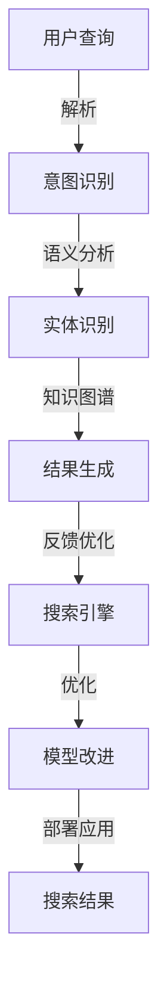

                 

# 搜索引擎的自然语言理解进展

## 1. 背景介绍

搜索引擎在过去几十年中，从简单的关键字匹配进化到自然语言理解(NLU)的高级阶段。自然语言理解使搜索引擎能更好地理解用户的查询意图，提供更准确的结果。本文将回顾搜索引擎在自然语言理解方面的进展，分析其核心技术，以及未来可能的趋势。

## 2. 核心概念与联系

### 2.1 核心概念概述

搜索引擎的自然语言理解主要涉及以下几个关键概念：

- **自然语言理解(NLU)**：使机器能够理解和解释人类自然语言的技术。
- **语义分析**：识别和理解文本中的含义和关系。
- **意图识别**：理解用户的查询意图和需求。
- **实体识别**：从文本中提取出关键的命名实体，如人名、地点、组织等。
- **问答系统**：根据用户的问题，生成准确、相关的答案。
- **知识图谱**：表示实体和它们之间关系的图形结构，用于增强自然语言理解。

这些概念通过一系列的技术手段和算法联结起来，实现搜索引擎的高级功能。

### 2.2 核心概念原理和架构的 Mermaid 流程图



## 3. 核心算法原理 & 具体操作步骤

### 3.1 算法原理概述

搜索引擎的自然语言理解主要依赖于以下算法：

- **词向量化**：将单词或短语映射到高维向量空间，以捕捉它们之间的语义关系。
- **卷积神经网络(CNN)**：用于提取文本中的局部特征。
- **循环神经网络(RNN)**：尤其是长短期记忆网络(LSTM)，用于处理序列数据，捕捉上下文信息。
- **注意力机制**：用于聚焦于文本中重要的部分，提高模型的准确性。
- **深度学习**：通过多层神经网络，从大规模文本数据中学习复杂模式。

### 3.2 算法步骤详解

搜索引擎的自然语言理解通常分为以下几个步骤：

1. **预处理**：清洗文本数据，分词，构建词向量等。
2. **特征提取**：使用CNN或LSTM等模型提取文本特征。
3. **意图识别**：通过分类器或序列标注模型识别查询意图。
4. **实体识别**：使用序列标注模型或实体识别模型识别关键实体。
5. **知识图谱查询**：将识别出的实体查询知识图谱，获取相关信息。
6. **结果生成**：根据查询意图和提取的信息生成搜索结果。
7. **反馈优化**：收集用户反馈，不断改进模型和算法。

### 3.3 算法优缺点

自然语言理解的算法具有以下优点：

- **适应性强**：能处理自然语言查询，增强用户交互体验。
- **准确率高**：通过深度学习模型，能够准确理解用户意图和信息。
- **可扩展性好**：能结合知识图谱和其他数据源，提供更丰富的信息。

同时，这些算法也有缺点：

- **数据依赖**：需要大量的标注数据进行训练，数据质量和标注质量对结果有重大影响。
- **计算资源消耗大**：深度学习模型计算复杂，需要高性能硬件支持。
- **模型复杂度高**：复杂的模型结构可能导致过拟合和训练困难。

### 3.4 算法应用领域

自然语言理解在以下几个领域得到了广泛应用：

- **搜索引擎**：用于理解用户查询，生成相关结果。
- **智能客服**：用于自动回复用户问题。
- **知识图谱构建**：用于构建和查询知识图谱，支持信息检索。
- **机器翻译**：用于翻译文本，跨越语言障碍。
- **情感分析**：用于分析文本的情感倾向，进行舆情监控。

## 4. 数学模型和公式 & 详细讲解 & 举例说明

### 4.1 数学模型构建

搜索引擎的自然语言理解模型通常基于以下数学框架：

- **词向量化**：使用Word2Vec、GloVe等算法将单词转换为向量。
- **卷积神经网络(CNN)**：使用以下公式计算卷积操作：

$$
C_{i,j} = W^{[1]}_{i,j} * X_{i,j} + b_{i,j}^{[1]}
$$

其中，$C_{i,j}$表示卷积层的输出，$X_{i,j}$表示输入层的特征，$W^{[1]}_{i,j}$和$b_{i,j}^{[1]}$为卷积核的权重和偏置。

- **长短期记忆网络(LSTM)**：使用以下公式计算LSTM单元：

$$
i_t = \sigma(W_{xh} * [h_{t-1}, x_t] + b_{xh})
$$

$$
f_t = \sigma(W_{xh} * [h_{t-1}, x_t] + b_{xh})
$$

$$
o_t = \sigma(W_{xh} * [h_{t-1}, x_t] + b_{xh})
$$

$$
g_t = \tanh(W_{xh} * [h_{t-1}, x_t] + b_{xh})
$$

$$
c_t = f_t * c_{t-1} + i_t * g_t
$$

$$
h_t = o_t * tanh(c_t)
$$

其中，$i_t, f_t, o_t$和$g_t$分别为输入、遗忘、输出和门控激活函数，$h_t$为LSTM隐藏状态，$c_t$为LSTM细胞状态。

### 4.2 公式推导过程

以LSTM为例，其公式推导基于RNN的基本概念，通过引入门控机制，实现对信息的有效传递和遗忘。通过反向传播算法，LSTM模型可以自动优化权重参数，提高模型的预测准确性。

### 4.3 案例分析与讲解

以Google的BERT模型为例，其使用了Transformer架构，并加入了注意力机制，使得模型能够捕捉长距离的依赖关系。通过在大规模语料库上进行预训练，BERT能够学习到丰富的语言知识和表示，显著提升了自然语言理解任务的性能。

## 5. 项目实践：代码实例和详细解释说明

### 5.1 开发环境搭建

为进行自然语言理解模型的实践，需要以下开发环境：

- **Python**：推荐使用3.6及以上版本，需要安装pandas、numpy等库。
- **TensorFlow**：版本推荐2.x，用于深度学习模型的构建和训练。
- **Keras**：作为高层次的深度学习API，简化模型搭建和训练过程。

### 5.2 源代码详细实现

以下是一个简单的LSTM模型实现，用于情感分析任务：

```python
from tensorflow.keras.models import Sequential
from tensorflow.keras.layers import Embedding, LSTM, Dense
from tensorflow.keras.preprocessing.text import Tokenizer
from tensorflow.keras.preprocessing.sequence import pad_sequences

# 准备数据
texts = ["I love this product", "This is a terrible product"]
labels = [1, 0] # 1代表正面，0代表负面

# 分词和构建词向量
tokenizer = Tokenizer()
tokenizer.fit_on_texts(texts)
sequences = tokenizer.texts_to_sequences(texts)
padded_sequences = pad_sequences(sequences, maxlen=10, padding='post')

# 构建模型
model = Sequential()
model.add(Embedding(input_dim=len(tokenizer.word_index) + 1, output_dim=64, input_length=padded_sequences.shape[1]))
model.add(LSTM(64, dropout=0.2, recurrent_dropout=0.2))
model.add(Dense(1, activation='sigmoid'))

# 编译和训练模型
model.compile(loss='binary_crossentropy', optimizer='adam', metrics=['accuracy'])
model.fit(padded_sequences, labels, epochs=10, batch_size=2, validation_split=0.2)
```

### 5.3 代码解读与分析

代码中，首先使用Keras的Tokenizer对文本进行分词和构建词向量，然后将词向量转换为模型可以处理的序列数据。接着，构建LSTM模型，包含嵌入层、LSTM层和全连接层。最后，使用二元交叉熵作为损失函数，Adam作为优化器，训练模型。

### 5.4 运行结果展示

训练完毕后，可以测试模型对新数据的预测能力：

```python
test_text = "This is a great product"
test_sequence = tokenizer.texts_to_sequences([test_text])
test_padded = pad_sequences(test_sequence, maxlen=10, padding='post')
predictions = model.predict(test_padded)
print(predictions)
```

该模型能够对输入的文本进行情感分析，输出0或1表示负面或正面情感。

## 6. 实际应用场景

### 6.1 搜索推荐

搜索引擎利用自然语言理解技术，能够理解用户的查询意图，提供更精准的搜索结果和推荐。通过查询日志和用户行为数据，进一步优化搜索结果和推荐策略，提高用户体验。

### 6.2 智能客服

智能客服系统能够通过自然语言理解技术，自动理解和处理用户问题，提供24/7的服务。利用意图识别和实体识别技术，系统能够快速响应用户需求，提供相关解决方案。

### 6.3 知识图谱构建

自然语言理解技术结合知识图谱，可以构建出实体和关系的关系图，用于支持复杂的信息检索和问答。例如，通过实体识别和关系抽取，系统能够自动构建出知识图谱，并提供快速查询和关联检索功能。

### 6.4 未来应用展望

未来，自然语言理解技术将在更多领域得到应用，如医疗、金融、教育等。通过结合大数据和深度学习，实现更加智能化和个性化的信息检索和推荐。同时，随着模型复杂度和计算能力的提升，自然语言理解技术也将进一步拓展其应用边界，推动人工智能技术的普及和发展。

## 7. 工具和资源推荐

### 7.1 学习资源推荐

- **《深度学习》书籍**：Ian Goodfellow等著，系统介绍了深度学习的基本概念和算法。
- **Coursera自然语言处理课程**：由斯坦福大学教授Andrew Ng等主讲，涵盖自然语言处理的基本概念和技术。
- **Kaggle自然语言处理竞赛**：参与Kaggle竞赛，实践和应用自然语言处理技术。

### 7.2 开发工具推荐

- **TensorFlow**：强大的深度学习框架，支持GPU加速和分布式训练。
- **Keras**：高层次的深度学习API，易于上手和构建模型。
- **NLTK**：自然语言处理工具包，提供分词、词性标注等功能。

### 7.3 相关论文推荐

- **Attention is All You Need**：Transformer论文，开创了基于自注意力机制的深度学习模型。
- **BERT: Pre-training of Deep Bidirectional Transformers for Language Understanding**：BERT模型，使用自监督学习技术，提升了自然语言理解任务的性能。
- **A Survey on Text Classification Using Deep Learning**：深度学习在文本分类任务中的应用综述。

## 8. 总结：未来发展趋势与挑战

### 8.1 研究成果总结

自然语言理解技术在搜索引擎中的应用，显著提升了用户体验和搜索效率。通过深度学习和大规模语料库的预训练，自然语言理解模型的性能得到了显著提升。

### 8.2 未来发展趋势

未来，自然语言理解技术将向以下几个方向发展：

- **多模态自然语言理解**：结合视觉、听觉等数据，提升自然语言理解的多维性。
- **跨语言自然语言理解**：支持多种语言之间的信息理解和转换。
- **实时自然语言理解**：提升模型在动态环境下的适应性和响应速度。
- **联邦学习**：在保护用户隐私的前提下，利用分布式计算提升模型的性能。

### 8.3 面临的挑战

自然语言理解技术面临以下挑战：

- **数据质量和标注**：需要大量的高质量标注数据，才能训练出高性能模型。
- **计算资源**：深度学习模型计算复杂，需要高性能硬件支持。
- **模型可解释性**：模型往往像"黑盒"，难以解释其内部决策过程。
- **隐私和安全**：用户数据隐私保护和安全问题，成为应用自然语言理解技术的重大挑战。

### 8.4 研究展望

为应对上述挑战，未来的研究需要在以下几个方面进行探索：

- **无监督学习**：使用无监督学习方法，减少对标注数据的依赖。
- **知识图谱增强**：结合知识图谱，提升模型的信息检索和理解能力。
- **模型压缩**：通过模型压缩和剪枝，提高模型的计算效率和可部署性。
- **跨领域迁移学习**：在多个领域中迁移应用自然语言理解技术，提升模型的泛化能力。

## 9. 附录：常见问题与解答

### Q1: 如何构建高质量的自然语言理解模型？

A: 构建高质量的自然语言理解模型，需要以下几个步骤：

1. **数据收集和预处理**：收集大量高质量的标注数据，并进行清洗和预处理。
2. **特征提取**：使用深度学习模型，如CNN、LSTM等，提取文本特征。
3. **模型训练和调优**：使用适当的优化器和损失函数，进行模型训练和调优。
4. **模型评估和优化**：在验证集上评估模型性能，并根据结果进行调整。
5. **模型部署和监控**：将模型部署到实际应用中，并持续监控和优化。

### Q2: 如何处理自然语言理解中的歧义问题？

A: 自然语言理解中的歧义问题可以通过以下方法解决：

1. **上下文理解**：利用上下文信息，消除单词或短语的歧义。
2. **多模型融合**：通过结合多个模型的输出，消除单一模型的误判。
3. **规则和知识库**：引入专家规则和知识库，辅助模型理解和处理歧义。

### Q3: 自然语言理解技术的局限性有哪些？

A: 自然语言理解技术的局限性包括：

1. **语言多样性**：不同语言和方言可能存在差异，需要针对性地进行模型训练。
2. **领域特定**：特定领域内的专有词汇和表达方式，需要定制化的处理。
3. **数据稀疏性**：某些领域或任务可能缺乏足够的标注数据，影响模型的性能。
4. **计算复杂度**：深度学习模型计算复杂，需要高性能硬件支持。

### Q4: 如何提升自然语言理解技术的效率？

A: 提升自然语言理解技术的效率，可以通过以下方法：

1. **模型压缩**：通过剪枝和量化，减小模型大小和计算量。
2. **模型并行**：使用分布式计算，提升模型的训练和推理速度。
3. **缓存技术**：利用缓存技术，加速模型的数据读取和计算。

---

作者：禅与计算机程序设计艺术 / Zen and the Art of Computer Programming

