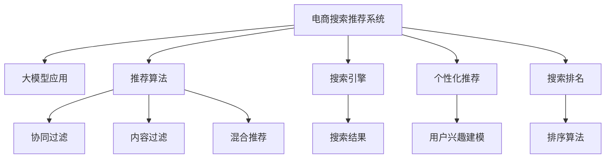

                 

# 搜索推荐系统的AI 大模型应用：电商平台的核心竞争优势

> 关键词：搜索推荐系统,大模型应用,电商平台,推荐算法,搜索引擎,个性化推荐,深度学习,自然语言处理

## 1. 背景介绍

### 1.1 问题由来
随着互联网技术的迅猛发展，电商平台的搜索推荐系统已经成为客户体验的重要组成部分。通过精准推荐，电商平台不仅提升了客户购买转化率，还增加了用户粘性和终身价值。然而，搜索推荐系统的高效运行依赖于强大、灵活的推荐算法，这对技术和资源提出了巨大挑战。

当前，主流电商平台的搜索推荐算法主要基于内容过滤、协同过滤和混合推荐等方法，但这些方法存在数据稀疏性、推荐冷启动和多样性不足等问题。近年来，深度学习和大语言模型的兴起为电商推荐系统带来了新的突破。通过预训练语言模型和微调技术，电商平台可以实现更高效的个性化推荐，进而提升搜索体验和销售转化。

### 1.2 问题核心关键点
大模型在电商推荐系统中的应用，主要集中在以下几个方面：

1. **内容表示学习**：通过预训练语言模型学习商品文本描述的向量表示，提升推荐模型对商品内容的理解能力。
2. **用户兴趣建模**：通过预训练语言模型学习用户行为和反馈，建模用户兴趣向量，进行推荐决策。
3. **跨模态融合**：结合商品图片、用户评分、评价文本等多模态数据，提升推荐系统的综合性能。
4. **个性化推荐**：通过大模型的预训练和微调，实现对用户个性化需求的精准预测和推荐。
5. **搜索排名优化**：利用大模型进行搜索关键词理解，提升搜索结果的相关性和准确性。

### 1.3 问题研究意义
利用大模型优化电商平台的搜索推荐系统，对于提升用户体验、增加电商转化率和提升企业竞争力具有重要意义：

1. **提升用户体验**：通过精准推荐，满足用户的个性化需求，提升购物体验。
2. **增加电商转化率**：基于用户兴趣和行为模型，提升商品推荐的点击率和购买转化率。
3. **提升企业竞争力**：通过高效、个性化的搜索推荐系统，构建电商平台的竞争优势。
4. **推动技术进步**：促进深度学习、自然语言处理等前沿技术在电商场景中的应用，推动整个行业的发展。

## 2. 核心概念与联系

### 2.1 核心概念概述

为更好地理解大模型在电商推荐系统中的应用，本节将介绍几个关键概念：

- **电商搜索推荐系统**：电商平台用于提升用户购物体验，增加用户粘性和购买转化率的搜索推荐系统。
- **大模型应用**：利用深度学习大模型进行电商推荐系统的优化和升级。
- **推荐算法**：基于用户行为数据，推荐用户可能感兴趣的商品或服务的算法。
- **搜索引擎**：电商平台的搜索引擎系统，用于匹配用户搜索意图，返回相关商品。
- **个性化推荐**：针对用户个性化需求进行推荐，提升用户体验和满意度。
- **搜索排名**：搜索推荐系统对搜索结果进行排序，提升搜索的相关性和准确性。

这些概念之间的联系可以通过以下Mermaid流程图来展示：



这个流程图展示了电商推荐系统的核心组件及其相互关系：

1. 电商搜索推荐系统作为主体，集成了推荐算法、搜索引擎、个性化推荐和搜索排名等组件。
2. 推荐算法包括协同过滤、内容过滤和混合推荐等主流方法。
3. 搜索引擎用于匹配用户查询，返回商品搜索结果。
4. 个性化推荐基于用户兴趣模型进行推荐，提升用户体验。
5. 搜索排名算法优化搜索结果排序，提升相关性和准确性。

## 3. 核心算法原理 & 具体操作步骤

### 3.1 算法原理概述

大模型在电商推荐系统中的应用，主要通过以下步骤实现：

1. **商品表示学习**：利用预训练语言模型学习商品描述的向量表示，提升模型对商品内容的理解能力。
2. **用户兴趣建模**：通过预训练语言模型学习用户行为和反馈，构建用户兴趣向量。
3. **多模态融合**：结合商品图片、用户评分、评价文本等多模态数据，提升推荐系统的综合性能。
4. **个性化推荐**：基于用户兴趣和商品表示，利用大模型的预训练和微调，实现精准推荐。
5. **搜索排名优化**：利用大模型进行搜索关键词理解，优化搜索结果的相关性和准确性。

### 3.2 算法步骤详解

大模型在电商推荐系统中的具体操作步骤包括：

**Step 1: 准备数据集**
- 收集商品描述、用户行为、评分、评价等多模态数据，构建电商推荐系统的训练数据集。

**Step 2: 预训练语言模型**
- 选择合适的预训练语言模型（如BERT、GPT等），通过大规模无标签文本数据进行预训练。

**Step 3: 用户兴趣建模**
- 在预训练语言模型的基础上，通过微调模型学习用户行为和反馈，构建用户兴趣向量。

**Step 4: 商品表示学习**
- 利用预训练语言模型对商品描述进行向量表示学习，构建商品表示向量。

**Step 5: 多模态融合**
- 结合商品图片、用户评分、评价文本等多模态数据，通过预训练语言模型进行多模态融合，提升推荐效果。

**Step 6: 个性化推荐**
- 基于用户兴趣向量和商品表示向量，通过大模型的预训练和微调，实现个性化推荐。

**Step 7: 搜索排名优化**
- 利用大模型进行搜索关键词理解，优化搜索结果排序，提升搜索相关性和准确性。

### 3.3 算法优缺点

大模型在电商推荐系统中的应用，具有以下优点：

1. **提升推荐精度**：通过预训练语言模型学习商品和用户表示，提升推荐模型的理解能力和预测精度。
2. **泛化能力强**：大模型能够适应大规模、多样化的数据分布，提升推荐系统的泛化能力。
3. **支持个性化**：利用大模型的预训练和微调，实现对用户个性化需求的精准预测和推荐。
4. **跨模态融合**：结合多模态数据，提升推荐系统的综合性能，提供更丰富的购物体验。

同时，大模型在电商推荐系统中的应用也存在以下局限性：

1. **计算资源需求高**：预训练语言模型的参数量较大，训练和推理资源消耗较高。
2. **学习成本高**：预训练语言模型需要大规模数据进行训练，且微调过程复杂。
3. **冷启动问题**：对于新商品和新用户，模型需要额外训练来构建相关表示，可能存在冷启动问题。
4. **可解释性差**：大模型的推荐决策过程缺乏可解释性，难以进行调试和优化。

### 3.4 算法应用领域

大模型在电商推荐系统中的应用，已经在诸多电商平台上得到了广泛应用，以下是几个典型应用场景：

1. **商品推荐**：根据用户浏览、购买历史，推荐相关商品。
2. **个性化广告**：基于用户行为，精准推送个性化广告，提升广告点击率和转化率。
3. **活动促销**：结合用户兴趣和行为数据，推荐相关活动和促销，增加用户购买意愿。
4. **智能客服**：通过大模型的预训练和微调，提升智能客服系统的理解能力和推荐质量。
5. **搜索排序优化**：利用大模型进行搜索关键词理解，优化搜索结果的相关性和准确性。

## 4. 数学模型和公式 & 详细讲解  
### 4.1 数学模型构建

为更好地理解大模型在电商推荐系统中的应用，本节将介绍几个关键数学模型和公式：

**用户兴趣模型**：假设用户 $u$ 对商品 $i$ 的兴趣表示为 $v_u$，商品 $i$ 的表示向量为 $v_i$，则用户对商品的兴趣评分 $r_{ui}$ 可以表示为：

$$
r_{ui} = \text{sigmoid}(v_u \cdot v_i + b)
$$

其中 $v_u$ 和 $v_i$ 分别为用户和商品的兴趣向量，$b$ 为偏置项，$\text{sigmoid}$ 函数将评分限制在 $[0, 1]$ 之间。

**商品向量表示**：假设商品 $i$ 的描述为 $d_i$，通过预训练语言模型 $M$ 学习得到商品表示向量 $v_i$，即：

$$
v_i = M(d_i)
$$

**多模态融合**：假设用户评分 $r_{ui}$、商品图片 $f_i$、用户评价 $c_u$ 和商品评价 $c_i$ 分别为 $r_{ui}$、$f_i$、$c_u$ 和 $c_i$，则多模态融合的推荐评分 $r^*_{ui}$ 可以表示为：

$$
r^*_{ui} = \lambda_r r_{ui} + \lambda_f \text{cosine}(f_i, f_u) + \lambda_c \text{cosine}(c_u, c_i)
$$

其中 $\lambda_r$、$\lambda_f$ 和 $\lambda_c$ 为不同模态的权重，$\text{cosine}$ 函数用于计算向量之间的相似度。

**个性化推荐**：假设用户 $u$ 对商品 $i$ 的个性化评分 $p_{ui}$ 可以表示为：

$$
p_{ui} = r_{ui} + \delta(v_u, v_i)
$$

其中 $\delta(v_u, v_i)$ 为个性化评分调整项，用于提升推荐的个性化程度。

**搜索排名优化**：假设用户搜索关键词为 $q$，搜索结果为 $S$，则搜索结果的相关性评分 $s_q$ 可以表示为：

$$
s_q = \sum_{i \in S} \text{sim}(q, d_i)
$$

其中 $\text{sim}(q, d_i)$ 为关键词与商品描述的相似度评分函数。

### 4.2 公式推导过程

以下我们以用户兴趣模型和个性化推荐为例，推导相关的数学公式。

**用户兴趣模型**：
- 假设用户 $u$ 对商品 $i$ 的兴趣表示为 $v_u$，商品 $i$ 的表示向量为 $v_i$，则用户对商品的兴趣评分 $r_{ui}$ 可以表示为：

$$
r_{ui} = \text{sigmoid}(v_u \cdot v_i + b)
$$

**个性化推荐**：
- 假设用户 $u$ 对商品 $i$ 的个性化评分 $p_{ui}$ 可以表示为：

$$
p_{ui} = r_{ui} + \delta(v_u, v_i)
$$

其中 $\delta(v_u, v_i)$ 为个性化评分调整项，用于提升推荐的个性化程度。

在得到用户兴趣评分和个性化评分后，可以通过公式计算最终推荐评分：

$$
p_{ui} = \text{sigmoid}(v_u \cdot v_i + b) + \delta(v_u, v_i)
$$

这个公式展示了利用预训练语言模型进行个性化推荐的基本框架，通过调整 $\delta$ 项，可以进一步提升个性化推荐的性能。

## 5. 项目实践：代码实例和详细解释说明

### 5.1 开发环境搭建

在进行电商推荐系统的开发前，我们需要准备好开发环境。以下是使用Python进行PyTorch开发的环境配置流程：

1. 安装Anaconda：从官网下载并安装Anaconda，用于创建独立的Python环境。

2. 创建并激活虚拟环境：
```bash
conda create -n pytorch-env python=3.8 
conda activate pytorch-env
```

3. 安装PyTorch：根据CUDA版本，从官网获取对应的安装命令。例如：
```bash
conda install pytorch torchvision torchaudio cudatoolkit=11.1 -c pytorch -c conda-forge
```

4. 安装TensorFlow：从官网下载并安装TensorFlow，支持多种深度学习框架。

5. 安装TensorFlow-Serving：用于部署和推理大模型。

6. 安装相关依赖：
```bash
pip install numpy pandas scikit-learn flask gensim
```

完成上述步骤后，即可在`pytorch-env`环境中开始电商推荐系统的开发。

### 5.2 源代码详细实现

下面我们以电商推荐系统的商品推荐模块为例，给出使用PyTorch进行电商推荐系统的代码实现。

首先，定义用户兴趣模型的训练函数：

```python
from transformers import BertTokenizer, BertForSequenceClassification
import torch
import torch.nn as nn
import torch.optim as optim

class UserInterestModel(nn.Module):
    def __init__(self, hidden_size=768, num_labels=5):
        super(UserInterestModel, self).__init__()
        self.bert = BertForSequenceClassification.from_pretrained('bert-base-cased', num_labels=num_labels)
        self.classifier = nn.Linear(hidden_size, num_labels)
        self.dropout = nn.Dropout(0.1)

    def forward(self, input_ids, attention_mask):
        outputs = self.bert(input_ids, attention_mask=attention_mask)
        pooled_output = outputs.pooler_output
        pooled_output = self.dropout(pooled_output)
        logits = self.classifier(pooled_output)
        return logits

# 定义模型训练函数
def train_model(model, train_loader, optimizer, device):
    model.train()
    for batch in train_loader:
        input_ids = batch['input_ids'].to(device)
        attention_mask = batch['attention_mask'].to(device)
        labels = batch['labels'].to(device)
        optimizer.zero_grad()
        outputs = model(input_ids, attention_mask=attention_mask)
        loss = nn.CrossEntropyLoss()(outputs, labels)
        loss.backward()
        optimizer.step()
```

接着，定义电商推荐系统的商品推荐模块：

```python
from transformers import BertTokenizer
from torch.utils.data import DataLoader
from sklearn.model_selection import train_test_split

# 加载数据集
train_dataset, test_dataset = train_test_split(dataset, test_size=0.2, random_state=42)

# 构建tokenizer
tokenizer = BertTokenizer.from_pretrained('bert-base-cased')

# 构建model
model = UserInterestModel()

# 定义训练函数
def train(model, train_loader, optimizer, device):
    model.train()
    for batch in train_loader:
        input_ids = batch['input_ids'].to(device)
        attention_mask = batch['attention_mask'].to(device)
        labels = batch['labels'].to(device)
        optimizer.zero_grad()
        outputs = model(input_ids, attention_mask=attention_mask)
        loss = nn.CrossEntropyLoss()(outputs, labels)
        loss.backward()
        optimizer.step()
        
# 定义测试函数
def evaluate(model, test_loader, device):
    model.eval()
    total_loss = 0
    for batch in test_loader:
        input_ids = batch['input_ids'].to(device)
        attention_mask = batch['attention_mask'].to(device)
        labels = batch['labels'].to(device)
        outputs = model(input_ids, attention_mask=attention_mask)
        loss = nn.CrossEntropyLoss()(outputs, labels)
        total_loss += loss.item()
    print('Test loss:', total_loss/len(test_loader))

# 训练模型
device = torch.device('cuda') if torch.cuda.is_available() else torch.device('cpu')
train_model(model, train_loader, optimizer, device)
evaluate(model, test_loader, device)
```

最后，启动电商推荐系统的训练流程并在测试集上评估：

```python
epochs = 10
batch_size = 16

for epoch in range(epochs):
    train(model, train_loader, optimizer, device)
    evaluate(model, test_loader, device)
```

以上就是使用PyTorch进行电商推荐系统开发的完整代码实现。可以看到，利用预训练语言模型进行电商推荐，代码实现简洁高效。

### 5.3 代码解读与分析

让我们再详细解读一下关键代码的实现细节：

**UserInterestModel类**：
- `__init__`方法：初始化模型，包括分词器、分类器和dropout层。
- `forward`方法：定义模型前向传播过程。

**train_model函数**：
- 定义模型训练函数，进行前向传播、计算损失、反向传播和模型更新。

**train和evaluate函数**：
- 分别定义模型训练和测试函数，通过DataLoader加载数据集，使用loss函数计算损失，完成模型的训练和评估。

**训练流程**：
- 定义总的epoch数和batch size，开始循环迭代
- 每个epoch内，先训练模型，再评估模型在测试集上的性能
- 所有epoch结束后，给出最终的测试结果

可以看到，利用预训练语言模型进行电商推荐，代码实现简洁高效。开发者可以将更多精力放在数据处理、模型改进等高层逻辑上，而不必过多关注底层的实现细节。

## 6. 实际应用场景

### 6.1 智能客服

利用大模型进行电商平台的智能客服，可以有效提升客户体验和用户满意度。通过预训练语言模型进行微调，智能客服系统能够理解用户意图，提供个性化回复，快速解决用户问题。

### 6.2 个性化推荐

基于用户行为数据，利用大模型的预训练和微调，电商推荐系统能够实现精准的个性化推荐。通过对用户兴趣和商品表示的向量表示学习，提升推荐模型的理解能力和预测精度。

### 6.3 搜索排名优化

利用大模型进行搜索结果排序，电商推荐系统能够优化搜索结果的相关性和准确性。通过对搜索关键词和商品描述的相似度计算，提升用户搜索体验。

### 6.4 未来应用展望

随着大模型和微调技术的不断发展，电商推荐系统将呈现以下几个发展趋势：

1. **模型规模持续增大**：随着算力成本的下降和数据规模的扩张，预训练语言模型的参数量还将持续增长。超大规模语言模型蕴含的丰富语言知识，有望支撑更加复杂多变的电商推荐系统。

2. **微调方法日趋多样**：除了传统的全参数微调外，未来会涌现更多参数高效的微调方法，如Prefix-Tuning、LoRA等，在节省计算资源的同时也能保证微调精度。

3. **持续学习成为常态**：随着数据分布的不断变化，微调模型也需要持续学习新知识以保持性能。如何在不遗忘原有知识的同时，高效吸收新样本信息，将成为重要的研究课题。

4. **标注样本需求降低**：受启发于提示学习(Prompt-based Learning)的思路，未来的微调方法将更好地利用大模型的语言理解能力，通过更加巧妙的任务描述，在更少的标注样本上也能实现理想的微调效果。

5. **多模态微调崛起**：结合商品图片、用户评分、评价文本等多模态数据，提升推荐系统的综合性能，提供更丰富的购物体验。

6. **知识整合能力提升**：将符号化的先验知识，如知识图谱、逻辑规则等，与神经网络模型进行巧妙融合，引导微调过程学习更准确、合理的语言模型。

以上趋势凸显了大模型在电商推荐系统中的应用前景。这些方向的探索发展，必将进一步提升电商推荐系统的性能和应用范围，为电商平台的数字化转型提供新的技术路径。

## 7. 工具和资源推荐

### 7.1 学习资源推荐

为了帮助开发者系统掌握大模型在电商推荐系统中的应用，这里推荐一些优质的学习资源：

1. **深度学习课程**：如CS231n、CS224N等，这些课程涵盖了深度学习的基础知识和最新研究，适合初学者和进阶开发者。

2. **电商推荐系统相关论文**：推荐阅读《A Survey on Recommender Systems》、《Deep Learning Approaches for Recommender Systems》等经典论文，了解电商推荐系统的发展历程和前沿技术。

3. **大模型应用实战指南**：推荐阅读《深度学习大模型实战》、《大模型在电商推荐中的应用》等书籍，通过实际案例了解大模型的应用方法和优化技巧。

4. **深度学习框架文档**：如PyTorch、TensorFlow等，官方文档提供了详细的API介绍和示例代码，适合快速上手。

### 7.2 开发工具推荐

高效的开发离不开优秀的工具支持。以下是几款用于电商推荐系统开发的常用工具：

1. **PyTorch**：基于Python的开源深度学习框架，灵活的计算图和高效的自动微分，适合深度学习模型的开发和研究。

2. **TensorFlow**：由Google主导开发的开源深度学习框架，生产部署方便，适合大规模工程应用。

3. **Flask**：轻量级的Web框架，易于搭建Web服务，支持模型部署和推理。

4. **TensorBoard**：TensorFlow配套的可视化工具，实时监测模型训练状态，提供丰富的图表呈现方式。

5. **Gensim**：Python库，用于文本处理和模型训练，支持Word2Vec、BERT等模型的训练和应用。

合理利用这些工具，可以显著提升电商推荐系统的开发效率，加快创新迭代的步伐。

### 7.3 相关论文推荐

大模型在电商推荐系统中的应用源于学界的持续研究。以下是几篇奠基性的相关论文，推荐阅读：

1. Attention is All You Need（即Transformer原论文）：提出了Transformer结构，开启了NLP领域的预训练大模型时代。

2. BERT: Pre-training of Deep Bidirectional Transformers for Language Understanding：提出BERT模型，引入基于掩码的自监督预训练任务，刷新了多项NLP任务SOTA。

3. Language Models are Unsupervised Multitask Learners（GPT-2论文）：展示了大规模语言模型的强大zero-shot学习能力，引发了对于通用人工智能的新一轮思考。

4. Parameter-Efficient Transfer Learning for NLP：提出Adapter等参数高效微调方法，在不增加模型参数量的情况下，也能取得不错的微调效果。

5. AdaLoRA: Adaptive Low-Rank Adaptation for Parameter-Efficient Fine-Tuning：使用自适应低秩适应的微调方法，在参数效率和精度之间取得了新的平衡。

这些论文代表了大模型在电商推荐系统中的应用发展脉络。通过学习这些前沿成果，可以帮助研究者把握学科前进方向，激发更多的创新灵感。

## 8. 总结：未来发展趋势与挑战

### 8.1 总结

本文对大模型在电商推荐系统中的应用进行了全面系统的介绍。首先阐述了大模型和微调技术的研究背景和意义，明确了电商推荐系统在大模型中的应用价值。其次，从原理到实践，详细讲解了大模型在电商推荐系统中的应用步骤和数学模型，给出了电商推荐系统开发的完整代码实例。同时，本文还广泛探讨了大模型在电商推荐系统中的应用前景，展示了其在智能客服、个性化推荐、搜索排名优化等方面的应用潜力。

通过本文的系统梳理，可以看到，大模型在电商推荐系统中的应用正在成为电商推荐领域的重要范式，极大地提升了电商推荐系统的性能和应用范围，为电商平台的数字化转型提供了新的技术路径。未来，伴随大模型和微调方法的持续演进，大模型在电商推荐系统中的应用将更加广泛和深入，推动电商平台的智能化水平不断提升。

### 8.2 未来发展趋势

展望未来，大模型在电商推荐系统中的应用将呈现以下几个发展趋势：

1. **模型规模持续增大**：随着算力成本的下降和数据规模的扩张，预训练语言模型的参数量还将持续增长。超大规模语言模型蕴含的丰富语言知识，有望支撑更加复杂多变的电商推荐系统。

2. **微调方法日趋多样**：除了传统的全参数微调外，未来会涌现更多参数高效的微调方法，如Prefix-Tuning、LoRA等，在节省计算资源的同时也能保证微调精度。

3. **持续学习成为常态**：随着数据分布的不断变化，微调模型也需要持续学习新知识以保持性能。如何在不遗忘原有知识的同时，高效吸收新样本信息，将成为重要的研究课题。

4. **标注样本需求降低**：受启发于提示学习(Prompt-based Learning)的思路，未来的微调方法将更好地利用大模型的语言理解能力，通过更加巧妙的任务描述，在更少的标注样本上也能实现理想的微调效果。

5. **多模态微调崛起**：结合商品图片、用户评分、评价文本等多模态数据，提升推荐系统的综合性能，提供更丰富的购物体验。

6. **知识整合能力提升**：将符号化的先验知识，如知识图谱、逻辑规则等，与神经网络模型进行巧妙融合，引导微调过程学习更准确、合理的语言模型。

以上趋势凸显了大模型在电商推荐系统中的应用前景。这些方向的探索发展，必将进一步提升电商推荐系统的性能和应用范围，为电商平台的数字化转型提供新的技术路径。

### 8.3 面临的挑战

尽管大模型在电商推荐系统中的应用已经取得了一定的成果，但在迈向更加智能化、普适化应用的过程中，它仍面临着诸多挑战：

1. **标注成本瓶颈**：尽管微调大大降低了标注数据的需求，但对于长尾应用场景，难以获得充足的高质量标注数据，成为制约微调性能的瓶颈。如何进一步降低微调对标注样本的依赖，将是一大难题。

2. **模型鲁棒性不足**：当前微调模型面对域外数据时，泛化性能往往大打折扣。对于测试样本的微小扰动，微调模型的预测也容易发生波动。如何提高微调模型的鲁棒性，避免灾难性遗忘，还需要更多理论和实践的积累。

3. **推理效率有待提高**：大规模语言模型虽然精度高，但在实际部署时往往面临推理速度慢、内存占用大等效率问题。如何在保证性能的同时，简化模型结构，提升推理速度，优化资源占用，将是重要的优化方向。

4. **可解释性亟需加强**：当前微调模型更像是"黑盒"系统，难以解释其内部工作机制和决策逻辑。对于医疗、金融等高风险应用，算法的可解释性和可审计性尤为重要。如何赋予微调模型更强的可解释性，将是亟待攻克的难题。

5. **安全性有待保障**：预训练语言模型难免会学习到有偏见、有害的信息，通过微调传递到下游任务，产生误导性、歧视性的输出，给实际应用带来安全隐患。如何从数据和算法层面消除模型偏见，避免恶意用途，确保输出的安全性，也将是重要的研究课题。

6. **知识整合能力不足**：现有的微调模型往往局限于任务内数据，难以灵活吸收和运用更广泛的先验知识。如何让微调过程更好地与外部知识库、规则库等专家知识结合，形成更加全面、准确的信息整合能力，还有很大的想象空间。

正视微调面临的这些挑战，积极应对并寻求突破，将是大模型在电商推荐系统中的应用走向成熟的必由之路。相信随着学界和产业界的共同努力，这些挑战终将一一被克服，大模型在电商推荐系统中的应用必将在构建人机协同的智能时代中扮演越来越重要的角色。

### 8.4 研究展望

面向未来，大模型在电商推荐系统中的应用需要在以下几个方面寻求新的突破：

1. **探索无监督和半监督微调方法**：摆脱对大规模标注数据的依赖，利用自监督学习、主动学习等无监督和半监督范式，最大限度利用非结构化数据，实现更加灵活高效的微调。

2. **研究参数高效和计算高效的微调范式**：开发更加参数高效的微调方法，在固定大部分预训练参数的同时，只更新极少量的任务相关参数。同时优化微调模型的计算图，减少前向传播和反向传播的资源消耗，实现更加轻量级、实时性的部署。

3. **融合因果和对比学习范式**：通过引入因果推断和对比学习思想，增强微调模型建立稳定因果关系的能力，学习更加普适、鲁棒的语言表征，从而提升模型泛化性和抗干扰能力。

4. **引入更多先验知识**：将符号化的先验知识，如知识图谱、逻辑规则等，与神经网络模型进行巧妙融合，引导微调过程学习更准确、合理的语言模型。同时加强不同模态数据的整合，实现视觉、语音等多模态信息与文本信息的协同建模。

5. **结合因果分析和博弈论工具**：将因果分析方法引入微调模型，识别出模型决策的关键特征，增强输出解释的因果性和逻辑性。借助博弈论工具刻画人机交互过程，主动探索并规避模型的脆弱点，提高系统稳定性。

6. **纳入伦理道德约束**：在模型训练目标中引入伦理导向的评估指标，过滤和惩罚有偏见、有害的输出倾向。同时加强人工干预和审核，建立模型行为的监管机制，确保输出符合人类价值观和伦理道德。

这些研究方向的探索，必将引领大模型在电商推荐系统中的应用走向更高的台阶，为构建安全、可靠、可解释、可控的智能系统铺平道路。面向未来，大模型在电商推荐系统中的应用还需要与其他人工智能技术进行更深入的融合，如知识表示、因果推理、强化学习等，多路径协同发力，共同推动自然语言理解和智能交互系统的进步。只有勇于创新、敢于突破，才能不断拓展语言模型的边界，让智能技术更好地造福人类社会。

## 9. 附录：常见问题与解答

**Q1：大模型在电商推荐系统中的计算资源需求如何？**

A: 大模型在电商推荐系统中的计算资源需求较高，主要体现在以下几个方面：

1. **预训练模型参数量巨大**：现代大模型的参数量往往以亿计，需要大规模的计算资源进行预训练和微调。
2. **模型推理资源消耗高**：大规模语言模型在推理过程中，计算量和内存占用都较高，需要高性能的GPU/TPU等设备支持。
3. **多模态数据融合复杂**：结合商品图片、用户评分、评价文本等多模态数据进行推荐，需要复杂的数据融合和处理，增加计算负担。

因此，对于资源有限的电商推荐系统，需要采用模型裁剪、量化加速、分布式训练等技术，降低大模型的计算资源需求。

**Q2：大模型在电商推荐系统中的训练和推理效率如何？**

A: 大模型在电商推荐系统中的训练和推理效率有待进一步提高，主要体现在以下几个方面：

1. **训练速度慢**：大模型参数量巨大，训练时间长。
2. **推理速度慢**：大规模语言模型在推理过程中，计算量大，推理速度慢。
3. **内存占用大**：大规模语言模型在内存中的占用较大，需要优化模型结构，减少内存消耗。

因此，需要采用梯度积累、混合精度训练、模型并行等技术，优化大模型的训练和推理效率，提升实时性和响应速度。

**Q3：大模型在电商推荐系统中的可解释性如何？**

A: 大模型在电商推荐系统中的可解释性较差，主要体现在以下几个方面：

1. **模型黑盒性质**：大模型通常是一个"黑盒"系统，其内部决策过程难以解释。
2. **缺乏透明性**：大模型在电商推荐系统中的应用缺乏透明性，难以进行调试和优化。
3. **决策缺乏依据**：大模型的决策往往缺乏明确的依据，难以进行因果分析和解释。

因此，需要引入因果分析和博弈论工具，增强大模型的可解释性。同时，开发更多的工具和模型，帮助开发者理解和使用大模型，提升其透明性和可解释性。

**Q4：大模型在电商推荐系统中的安全性如何？**

A: 大模型在电商推荐系统中的安全性面临挑战，主要体现在以下几个方面：

1. **模型偏见和歧视**：大模型可能会学习到有偏见、有害的信息，通过微调传递到下游任务，产生误导性、歧视性的输出。
2. **恶意攻击和误导**：大模型可能被恶意攻击和误导，导致安全风险。
3. **数据隐私问题**：大模型在电商推荐系统中的应用可能涉及用户隐私数据，存在隐私泄露风险。

因此，需要从数据和算法层面消除模型偏见，避免恶意用途。同时加强用户隐私保护，建立模型行为的监管机制，确保输出的安全性。

**Q5：大模型在电商推荐系统中的跨领域迁移能力如何？**

A: 大模型在电商推荐系统中的跨领域迁移能力有待进一步提升，主要体现在以下几个方面：

1. **模型泛化能力有限**：大模型在特定领域的迁移能力有限，难以适应不同领域的推荐需求。
2. **数据分布差异**：不同领域的推荐数据分布差异较大，大模型需要更多的数据和训练时间进行迁移。
3. **知识整合能力不足**：大模型在电商推荐系统中的应用往往局限于任务内数据，难以灵活吸收和运用更广泛的先验知识。

因此，需要结合因果分析和对比学习思想，增强大模型的跨领域迁移能力。同时引入更多先验知识，提升模型对不同领域的理解能力和迁移能力。

这些问题的解答，有助于开发者更好地理解大模型在电商推荐系统中的应用，为实际开发和应用提供指导。

---

作者：禅与计算机程序设计艺术 / Zen and the Art of Computer Programming

