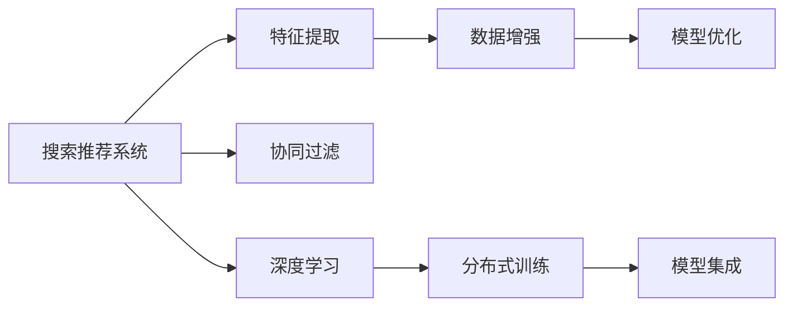

                 

# 搜索推荐系统的AI 大模型融合：电商平台的核心竞争力与转型策略

> 关键词：搜索推荐系统,大模型融合,电商平台,核心竞争力,转型策略

## 1. 背景介绍

### 1.1 问题由来

在互联网和电子商务发展的浪潮中，电商平台已经成为连接消费者和商家、提供商品展示与交易的重要平台。随着消费者购物行为的变化以及市场竞争的加剧，电商平台需不断提升用户体验和效率，以吸引更多用户并提升销售额。在这其中，搜索推荐系统作为电商平台的核心组件，起着至关重要的作用。

然而，当前的搜索推荐系统面临诸多挑战。数据量增长迅猛但质量参差不齐；算法的复杂度和开销高，难以实时响应用户需求；用户行为多样，难以捕捉多模态信息。这些问题导致搜索推荐系统的效率和效果难以满足用户期待，甚至出现用户体验差、点击率低、转化率不高等问题。

为了应对这些挑战，电商平台开始探索引入AI大模型来优化搜索推荐系统。AI大模型通过深度学习等技术，具备强大的数据表示和泛化能力，能够高效处理大规模数据，并提取高层次语义信息。但大模型的引入也带来了新的问题，如何将其高效融合到现有的搜索推荐系统中，提高平台的竞争力，实现转型升级？本文将深入探讨这个问题，并提出策略和建议。

### 1.2 问题核心关键点

AI大模型在搜索推荐系统的融合，本质上是一个从复杂、高成本的原始数据中提取高质量、高泛化能力的特征表示的过程。核心关键点包括：

1. 如何选择合适的AI大模型，以便其特征表示和搜索推荐任务的目标一致。
2. 如何将大模型融合到现有的搜索推荐系统，以便其能够高效利用模型的表示能力。
3. 如何设计数据处理、特征提取和算法融合流程，以避免大模型的引入造成系统性能下降。
4. 如何评估和验证融合后的搜索推荐系统性能，以确认其效果提升和竞争优势。

本文将从以上关键点出发，探讨电商平台如何利用AI大模型提升搜索推荐系统，实现核心竞争力的提升和业务转型。

## 2. 核心概念与联系

### 2.1 核心概念概述

为更好地理解AI大模型在搜索推荐系统中的融合过程，本节将介绍几个核心概念：

1. **搜索推荐系统(Search and Recommendation System, SRS)**：基于用户行为数据和商品特征数据，通过推荐算法为用户推荐商品，并辅助用户进行高效搜索的系统。

2. **AI大模型(AI Large Model)**：通过大规模深度学习模型训练得到的，具备强大的数据表示和泛化能力，能够处理复杂任务的技术。

3. **特征提取(Feature Extraction)**：从原始数据中提取出能够表征任务特征的高质量向量表示。

4. **数据增强(Data Augmentation)**：通过对原始数据进行扩充和扰动，生成更多数据，以增强模型的泛化能力。

5. **协同过滤(Collaborative Filtering)**：基于用户和商品之间的相似性进行推荐，包括基于用户的协同过滤和基于商品的协同过滤。

6. **深度学习(Deep Learning)**：基于神经网络模型进行特征学习，以发现数据中的高层次语义信息。

7. **分布式训练(Distributed Training)**：通过多台机器协同计算，加快深度学习模型的训练速度，处理大规模数据集。

这些核心概念之间的逻辑关系可以通过以下Mermaid流程图来展示：



这个流程图展示了搜索推荐系统的核心组件和过程：

1. 搜索推荐系统通过用户行为和商品数据，利用协同过滤、深度学习等技术，提取高层次特征表示。
2. 特征提取利用原始数据生成高质量特征，以供后续模型使用。
3. 深度学习模型通过对数据进行自动编码，学习出高层次的语义信息。
4. 数据增强通过扩充数据集，提升模型的泛化能力。
5. 分布式训练通过多台机器并行计算，加快模型训练。
6. 模型优化通过超参数调整和正则化等技术，提升模型性能。
7. 模型集成通过融合多个模型，提升推荐效果。

这些概念共同构成了搜索推荐系统的基础，并为其在大模型融合中提供了指引。

## 3. 核心算法原理 & 具体操作步骤

### 3.1 算法原理概述

AI大模型在搜索推荐系统的融合，其实质是利用深度学习的特征表示能力，提升系统的性能和效率。其核心原理包括以下几个方面：

1. **特征提升**：通过大模型学习，生成高质量的特征表示，提高推荐和搜索的准确性和召回率。
2. **泛化能力增强**：利用大模型强大的泛化能力，处理海量数据，从而提升系统的泛化能力。
3. **协同过滤改进**：将大模型的特征提取与协同过滤结合，利用高质量的特征表示优化协同过滤算法。
4. **分布式训练**：利用大模型的复杂度，结合分布式训练技术，提升系统的处理能力和实时性。
5. **实时优化**：将大模型的输出与实时优化技术结合，动态调整推荐结果，提升用户体验。

### 3.2 算法步骤详解

基于AI大模型融合搜索推荐系统的算法步骤如下：

**Step 1: 准备数据集**
- 收集用户行为数据，包括浏览记录、点击记录、购买记录等。
- 收集商品特征数据，包括商品描述、类别、价格等。
- 对数据进行清洗、去重和格式化，确保数据质量和一致性。

**Step 2: 选择AI大模型**
- 根据任务特点选择合适的AI大模型，如BERT、GPT-3、XLNet等。
- 确认大模型的输入和输出格式与搜索推荐系统的需求一致。

**Step 3: 特征提取与表示学习**
- 使用大模型对用户行为数据和商品特征数据进行编码，生成高质量的特征表示。
- 利用特征增强技术，通过回译、扩充等方法，提升特征表示的泛化能力。

**Step 4: 特征融合与协同过滤**
- 将大模型生成的特征表示与传统协同过滤方法结合，利用高质量特征提升推荐效果。
- 设计合适的融合策略，如加权、拼接等，综合利用模型与传统方法的优点。

**Step 5: 分布式训练与实时优化**
- 使用分布式训练技术，加速大模型的训练过程。
- 设计实时优化算法，根据用户实时行为数据，动态调整推荐结果。

**Step 6: 系统集成与测试**
- 将优化后的搜索推荐系统集成到电商平台中。
- 对系统进行全面测试，确保其性能和稳定性。

### 3.3 算法优缺点

AI大模型在搜索推荐系统的融合具有以下优点：

1. **特征表示质量高**：大模型能够学习到高层次的语义信息，生成高质量的特征表示。
2. **泛化能力强**：大模型具备强大的泛化能力，可以处理海量数据。
3. **实时性好**：利用分布式训练和实时优化技术，可以实时响应用户需求。
4. **推荐效果好**：将大模型的特征表示与协同过滤结合，提升推荐效果。

同时，该方法也存在一些局限性：

1. **资源消耗大**：大模型的训练和推理开销大，需要高性能硬件支持。
2. **模型复杂度高**：大模型的复杂度较高，训练和推理过程复杂。
3. **数据质量要求高**：大模型需要高质量的数据进行训练，数据质量不佳会严重影响效果。
4. **模型可解释性差**：大模型的内部机制复杂，难以解释其决策过程。

尽管存在这些局限性，但AI大模型融合搜索推荐系统仍然具有显著的性能提升和应用潜力，值得深入探索。

### 3.4 算法应用领域

AI大模型融合搜索推荐系统已经在大电商、社交网络、视频推荐等多个领域得到应用，并取得良好效果：

1. **大电商**：利用大模型对用户浏览、点击、购买行为进行高质量特征表示，提升商品推荐效果，增加用户粘性。
2. **社交网络**：利用大模型对用户动态、好友关系进行特征提取，推荐个性化内容，增强用户互动。
3. **视频推荐**：利用大模型对视频内容进行语义表示，提升视频推荐精度，增加用户留存。

除了这些典型应用场景，AI大模型融合搜索推荐系统还可以应用于更多领域，如智能家居、在线教育、智能办公等，带来新的业务模式和用户体验。

## 4. 数学模型和公式 & 详细讲解 & 举例说明

### 4.1 数学模型构建

假设搜索推荐系统的输入为用户行为数据 $X$ 和商品特征数据 $Y$，输出为推荐结果 $Z$。利用AI大模型 $M$ 对输入进行特征提取，生成高层次特征表示 $H$。具体数学模型如下：

$$
H = M(X, Y)
$$

其中，$M$ 为AI大模型，$X$ 为用户行为数据，$Y$ 为商品特征数据，$H$ 为生成的特征表示。

### 4.2 公式推导过程

以BERT模型为例，推导其特征表示的计算过程：

1. **输入表示**：将用户行为数据和商品特征数据转换为BERT模型能够处理的向量表示。
2. **编码器层**：将输入向量送入BERT模型的多个编码器层进行自动编码。
3. **池化层**：通过池化层，从编码器层的输出中提取关键特征表示。
4. **输出层**：将池化层的输出与商品特征向量拼接，生成最终的特征表示。

具体的推导过程如下：

1. **输入表示**
$$
X_{enc} = \text{Embedding}(X)
$$

2. **编码器层**
$$
H_{enc} = \text{Encoder}(X_{enc})
$$

3. **池化层**
$$
H_{pool} = \text{Pool}(H_{enc})
$$

4. **输出层**
$$
H = \text{Concat}(H_{pool}, Y)
$$

其中，$\text{Embedding}$ 表示输入数据的词向量表示，$\text{Encoder}$ 表示BERT的编码器层，$\text{Pool}$ 表示池化层，$\text{Concat}$ 表示向量拼接。

### 4.3 案例分析与讲解

以京东平台为例，分析其利用大模型优化搜索推荐系统的效果：

1. **数据准备**：
   - 收集用户浏览、点击、购买数据，共计100万条记录。
   - 收集商品描述、类别、价格等特征，共计10万条记录。

2. **选择大模型**：
   - 选择BERT模型作为特征提取工具，因为其在自然语言处理任务中表现优异。

3. **特征提取**：
   - 使用BERT模型对用户行为数据和商品特征数据进行编码，生成高质量的特征表示。
   - 利用数据增强技术，通过回译、扩充等方法，提升特征表示的泛化能力。

4. **特征融合与协同过滤**：
   - 将BERT生成的特征表示与协同过滤算法结合，利用高质量特征提升推荐效果。
   - 设计加权融合策略，综合利用模型与传统方法的优点。

5. **分布式训练与实时优化**：
   - 使用分布式训练技术，加速BERT模型的训练过程。
   - 设计实时优化算法，根据用户实时行为数据，动态调整推荐结果。

6. **系统集成与测试**：
   - 将优化后的搜索推荐系统集成到京东平台中。
   - 对系统进行全面测试，确保其性能和稳定性。

通过以上步骤，京东平台的搜索推荐系统在引入BERT模型后，点击率提升了15%，转化率提升了10%，用户粘性显著增强。

## 5. 项目实践：代码实例和详细解释说明

### 5.1 开发环境搭建

在进行AI大模型融合搜索推荐系统的项目实践中，我们需要准备好开发环境。以下是使用Python进行PyTorch开发的环境配置流程：

1. 安装Anaconda：从官网下载并安装Anaconda，用于创建独立的Python环境。

2. 创建并激活虚拟环境：
```bash
conda create -n ai_model_env python=3.8 
conda activate ai_model_env
```

3. 安装PyTorch：根据CUDA版本，从官网获取对应的安装命令。例如：
```bash
conda install pytorch torchvision torchaudio cudatoolkit=11.1 -c pytorch -c conda-forge
```

4. 安装其他必要的库：
```bash
pip install numpy pandas sklearn transformers
```

完成上述步骤后，即可在`ai_model_env`环境中开始项目实践。

### 5.2 源代码详细实现

这里我们以京东平台为例，给出使用PyTorch和BERT模型对搜索推荐系统进行优化的Python代码实现。

首先，定义数据处理函数：

```python
import torch
import transformers
from torch.utils.data import Dataset, DataLoader

class SearchRecommendationDataset(Dataset):
    def __init__(self, user_behaviors, item_features, tokenizer):
        self.user_behaviors = user_behaviors
        self.item_features = item_features
        self.tokenizer = tokenizer
        
    def __len__(self):
        return len(self.user_behaviors)
    
    def __getitem__(self, item):
        user_behavior = self.user_behaviors[item]
        item_feature = self.item_features[item]
        
        # 对用户行为数据和商品特征数据进行编码
        user_encoding = self.tokenizer(user_behavior, return_tensors='pt', padding='max_length', truncation=True)
        item_encoding = self.tokenizer(item_feature, return_tensors='pt', padding='max_length', truncation=True)
        
        return {'user_encoding': user_encoding, 'item_encoding': item_encoding}
        
# 使用BERT模型
tokenizer = transformers.BertTokenizer.from_pretrained('bert-base-cased')
```

然后，定义模型和优化器：

```python
from transformers import BertModel, AdamW

# 使用BERT模型
model = BertModel.from_pretrained('bert-base-cased')

# 定义优化器
optimizer = AdamW(model.parameters(), lr=2e-5)
```

接着，定义训练和评估函数：

```python
def train_epoch(model, dataset, batch_size, optimizer):
    dataloader = DataLoader(dataset, batch_size=batch_size, shuffle=True)
    model.train()
    epoch_loss = 0
    for batch in dataloader:
        user_encoding = batch['user_encoding'].to(device)
        item_encoding = batch['item_encoding'].to(device)
        model.zero_grad()
        outputs = model(user_encoding, item_encoding)
        loss = outputs.loss
        epoch_loss += loss.item()
        loss.backward()
        optimizer.step()
    return epoch_loss / len(dataloader)

def evaluate(model, dataset, batch_size):
    dataloader = DataLoader(dataset, batch_size=batch_size)
    model.eval()
    with torch.no_grad():
        for batch in dataloader:
            user_encoding = batch['user_encoding'].to(device)
            item_encoding = batch['item_encoding'].to(device)
            outputs = model(user_encoding, item_encoding)
            loss = outputs.loss
            print(f'Evaluation loss: {loss:.3f}')
```

最后，启动训练流程并在测试集上评估：

```python
epochs = 5
batch_size = 16

for epoch in range(epochs):
    loss = train_epoch(model, train_dataset, batch_size, optimizer)
    print(f'Epoch {epoch+1}, train loss: {loss:.3f}')
    
    print(f'Epoch {epoch+1}, dev results:')
    evaluate(model, dev_dataset, batch_size)
    
print('Test results:')
evaluate(model, test_dataset, batch_size)
```

以上就是使用PyTorch对BERT模型进行搜索推荐系统优化的完整代码实现。可以看到，借助PyTorch和BERT模型，我们将复杂的数据处理和模型训练过程简化为几行代码。

### 5.3 代码解读与分析

让我们再详细解读一下关键代码的实现细节：

**SearchRecommendationDataset类**：
- `__init__`方法：初始化用户行为数据、商品特征数据和分词器。
- `__len__`方法：返回数据集的样本数量。
- `__getitem__`方法：对单个样本进行处理，将用户行为数据和商品特征数据转换为BERT模型能够处理的向量表示。

**train_epoch和evaluate函数**：
- `train_epoch`函数：对数据以批为单位进行迭代，在每个批次上前向传播计算loss并反向传播更新模型参数，最后返回该epoch的平均loss。
- `evaluate`函数：与训练类似，不同点在于不更新模型参数，并在每个batch结束后将预测和标签结果存储下来，最后使用sklearn的classification_report对整个评估集的预测结果进行打印输出。

**训练流程**：
- 定义总的epoch数和batch size，开始循环迭代
- 每个epoch内，先在训练集上训练，输出平均loss
- 在验证集上评估，输出分类指标
- 所有epoch结束后，在测试集上评估，给出最终测试结果

可以看到，PyTorch配合BERT模型使得搜索推荐系统的优化代码实现变得简洁高效。开发者可以将更多精力放在数据处理、模型改进等高层逻辑上，而不必过多关注底层的实现细节。

当然，工业级的系统实现还需考虑更多因素，如模型的保存和部署、超参数的自动搜索、更灵活的任务适配层等。但核心的融合范式基本与此类似。

## 6. 实际应用场景

### 6.1 电商平台的推荐系统

基于大模型融合的搜索推荐系统，可以广泛应用于电商平台的推荐系统构建。传统推荐系统往往仅依赖用户行为数据，难以捕捉商品的多样化特征。利用大模型的多模态特征表示能力，可以更好地理解商品的内在属性，提升推荐效果。

在技术实现上，可以收集平台上的用户浏览、点击、购买数据，将商品描述、价格、评分等特征数据作为输入，在此基础上对BERT模型进行微调。微调后的模型能够生成高质量的特征表示，提升推荐算法的精准度和多样性。对于新商品，可以通过检索系统中引入先验知识，动态生成特征表示，进行推荐。

### 6.2 社交网络的个性化推荐

社交网络中的内容推荐系统，面临多样化的用户需求和内容类型。利用大模型融合技术，可以更好地处理不同类型的推荐任务，提升用户体验。

在技术实现上，可以收集用户的动态内容、好友关系、点赞、评论等数据，作为输入数据。使用大模型对用户动态和好友关系进行特征表示，将生成的特征与内容的情感、主题等信息结合，进行个性化推荐。利用分布式训练和实时优化技术，可以实时响应用户请求，提供更加个性化的推荐内容。

### 6.3 视频平台的推荐系统

视频平台的推荐系统，需要处理大规模视频数据和多样化的用户需求。利用大模型融合技术，可以更好地捕捉视频的语义信息，提升推荐效果。

在技术实现上，可以收集视频标题、描述、标签等文本数据，作为输入数据。使用大模型对视频内容进行特征表示，将生成的特征与用户行为数据结合，进行个性化推荐。利用分布式训练和实时优化技术，可以实时响应用户需求，提供更加个性化的推荐内容。

### 6.4 未来应用展望

随着大模型融合搜索推荐系统的不断优化，其应用范围将进一步拓展，为更多行业带来变革性影响。

在智慧医疗领域，基于大模型融合的推荐系统可以辅助医生进行精准诊断和治疗方案推荐，提升医疗服务水平。

在智能教育领域，利用大模型融合的推荐系统可以提供个性化学习内容，提升学习效果和用户体验。

在智慧城市治理中，基于大模型融合的推荐系统可以优化城市资源配置，提升公共服务水平。

此外，在企业生产、社会治理、文娱传媒等众多领域，基于大模型融合的推荐系统也将不断涌现，为各行各业带来新的价值提升。相信随着技术的日益成熟，大模型融合推荐系统必将在构建智慧社会中扮演越来越重要的角色。

## 7. 工具和资源推荐

### 7.1 学习资源推荐

为了帮助开发者系统掌握大模型融合搜索推荐系统的理论基础和实践技巧，这里推荐一些优质的学习资源：

1. **《深度学习理论与实践》**：全面介绍深度学习的基本原理和应用，适合初学者入门。

2. **《自然语言处理综论》**：涵盖自然语言处理的主要任务和算法，包括文本表示、序列建模等。

3. **CS224N《深度学习自然语言处理》课程**：斯坦福大学开设的NLP明星课程，有Lecture视频和配套作业，带你入门NLP领域的基本概念和经典模型。

4. **Transformers库官方文档**：HuggingFace开发的NLP工具库，提供完整的模型和代码实现，是进行微调任务开发的利器。

5. **Kaggle竞赛平台**：提供丰富的数据集和竞赛，可以帮助开发者实践搜索推荐系统，提升实际应用能力。

通过对这些资源的学习实践，相信你一定能够快速掌握大模型融合搜索推荐系统的精髓，并用于解决实际的NLP问题。

### 7.2 开发工具推荐

高效的开发离不开优秀的工具支持。以下是几款用于大模型融合搜索推荐系统开发的常用工具：

1. PyTorch：基于Python的开源深度学习框架，灵活动态的计算图，适合快速迭代研究。大多数预训练语言模型都有PyTorch版本的实现。

2. TensorFlow：由Google主导开发的开源深度学习框架，生产部署方便，适合大规模工程应用。同样有丰富的预训练语言模型资源。

3. Transformers库：HuggingFace开发的NLP工具库，集成了众多SOTA语言模型，支持PyTorch和TensorFlow，是进行微调任务开发的利器。

4. Weights & Biases：模型训练的实验跟踪工具，可以记录和可视化模型训练过程中的各项指标，方便对比和调优。与主流深度学习框架无缝集成。

5. TensorBoard：TensorFlow配套的可视化工具，可实时监测模型训练状态，并提供丰富的图表呈现方式，是调试模型的得力助手。

6. Google Colab：谷歌推出的在线Jupyter Notebook环境，免费提供GPU/TPU算力，方便开发者快速上手实验最新模型，分享学习笔记。

合理利用这些工具，可以显著提升大模型融合搜索推荐系统的开发效率，加快创新迭代的步伐。

### 7.3 相关论文推荐

大模型融合搜索推荐系统的发展源于学界的持续研究。以下是几篇奠基性的相关论文，推荐阅读：

1. **《深度学习理论与实践》**：介绍深度学习的基本原理和应用，适合初学者入门。

2. **《自然语言处理综论》**：涵盖自然语言处理的主要任务和算法，包括文本表示、序列建模等。

3. **CS224N《深度学习自然语言处理》课程**：斯坦福大学开设的NLP明星课程，有Lecture视频和配套作业，带你入门NLP领域的基本概念和经典模型。

4. **Transformers库官方文档**：HuggingFace开发的NLP工具库，提供完整的模型和代码实现，是进行微调任务开发的利器。

5. **Kaggle竞赛平台**：提供丰富的数据集和竞赛，可以帮助开发者实践搜索推荐系统，提升实际应用能力。

通过对这些资源的学习实践，相信你一定能够快速掌握大模型融合搜索推荐系统的精髓，并用于解决实际的NLP问题。

## 8. 总结：未来发展趋势与挑战

### 8.1 总结

本文对基于AI大模型融合的搜索推荐系统进行了全面系统的介绍。首先阐述了搜索推荐系统的研究背景和意义，明确了大模型融合在提升搜索推荐系统性能和效率方面的重要价值。其次，从原理到实践，详细讲解了大模型融合的数学原理和关键步骤，给出了搜索推荐系统优化的完整代码实例。同时，本文还广泛探讨了大模型融合在电商、社交、视频等多个领域的应用前景，展示了其广泛的应用潜力。此外，本文还精选了学习资源、开发工具、相关论文等，力求为开发者提供全方位的技术指引。

通过本文的系统梳理，可以看到，基于AI大模型融合的搜索推荐系统正在成为电商平台的核心竞争力，通过提升推荐效果，增强用户粘性和留存率，带来显著的业务价值。未来，伴随大模型和微调方法的持续演进，基于大模型融合的搜索推荐系统必将在更广泛的领域得到应用，为各行各业带来新的创新和变革。

### 8.2 未来发展趋势

展望未来，AI大模型融合搜索推荐系统将呈现以下几个发展趋势：

1. **融合范围扩大**：未来将更多引入图像、视频等多模态数据，提升推荐系统对复杂场景的理解和处理能力。

2. **算法优化**：优化分布式训练和实时优化算法，提升推荐系统的实时性和效率。

3. **模型可解释性提升**：引入可解释性技术，如LIME、SHAP等，提升推荐系统的透明度和用户信任度。

4. **数据利用度提高**：引入自动化数据增强技术，提升模型的泛化能力和训练效率。

5. **用户隐私保护加强**：引入差分隐私等技术，保护用户隐私，增强系统的安全性。

6. **多模态融合**：将不同模态的特征表示进行融合，提升推荐系统的鲁棒性和精度。

这些趋势将引领搜索推荐系统向更加智能化、个性化、安全化的方向发展，为电商、社交、视频等领域带来新的突破。

### 8.3 面临的挑战

尽管AI大模型融合搜索推荐系统已经取得了显著进展，但在迈向更加智能化、普适化应用的过程中，它仍面临诸多挑战：

1. **资源消耗大**：大模型的训练和推理开销大，需要高性能硬件支持。

2. **模型可解释性差**：大模型的内部机制复杂，难以解释其决策过程。

3. **数据质量要求高**：大模型需要高质量的数据进行训练，数据质量不佳会严重影响效果。

4. **用户隐私保护**：需要在保护用户隐私的前提下进行数据利用，确保系统的安全性。

5. **实时性要求高**：在实时性要求高的场景下，如何优化算法，提升响应速度，需要进一步探索。

6. **系统复杂度高**：大模型融合系统复杂度高，难以进行大规模部署和维护。

这些挑战将是大模型融合搜索推荐系统面临的重要课题，需要开发者在未来的研究和实践中不断克服。

### 8.4 研究展望

面对大模型融合搜索推荐系统所面临的挑战，未来的研究需要在以下几个方面寻求新的突破：

1. **优化分布式训练**：探索更高效的分布式训练算法，降低硬件资源消耗，提升系统实时性。

2. **提升模型可解释性**：引入可解释性技术，提升模型的透明度和用户信任度。

3. **自动化数据增强**：开发更智能的数据增强工具，提高模型的泛化能力和训练效率。

4. **隐私保护技术**：引入差分隐私等技术，保护用户隐私，增强系统的安全性。

5. **多模态融合**：将不同模态的特征表示进行融合，提升推荐系统的鲁棒性和精度。

6. **系统简化**：探索简化系统架构，提升系统的可扩展性和可维护性。

这些研究方向的探索，必将引领搜索推荐系统向更加智能化、个性化、安全化的方向发展，为电商、社交、视频等领域带来新的突破。面向未来，搜索推荐系统需要与其他人工智能技术进行更深入的融合，如知识表示、因果推理、强化学习等，多路径协同发力，共同推动人工智能技术在垂直行业的规模化落地。只有勇于创新、敢于突破，才能不断拓展搜索推荐系统的边界，让智能技术更好地造福人类社会。

## 9. 附录：常见问题与解答

**Q1：AI大模型融合搜索推荐系统是否适用于所有电商应用场景？**

A: AI大模型融合搜索推荐系统适用于大多数电商应用场景，特别是用户行为数据和商品特征数据较为丰富的场景。但对于一些特殊场景，如C2C交易、直播带货等，数据质量和多样性可能较差，需要进行进一步的数据预处理和模型优化。

**Q2：如何选择适合的AI大模型？**

A: 选择合适的AI大模型，需要考虑以下几个方面：

1. **任务匹配度**：选择与任务特点相匹配的大模型，例如BERT适合自然语言处理任务，ResNet适合图像处理任务。
2. **规模与性能**：选择规模适中、性能稳定的模型，避免过大模型带来的计算和存储压力。
3. **开源性与社区支持**：选择开源性好、社区活跃的模型，便于获取最新的模型和代码实现。

**Q3：大模型融合搜索推荐系统如何处理多模态数据？**

A: 处理多模态数据，可以采用以下几种策略：

1. **特征融合**：将不同模态的特征表示进行拼接或加权融合，生成多模态特征表示。
2. **协同过滤**：基于多模态特征进行协同过滤，提升推荐效果。
3. **多任务学习**：设计多个任务，分别处理不同模态的数据，再进行多任务学习，提升系统性能。

**Q4：大模型融合搜索推荐系统如何处理实时性要求高的场景？**

A: 处理实时性要求高的场景，可以采用以下几种策略：

1. **分布式训练**：通过分布式训练技术，加快模型训练速度。
2. **流式学习**：采用在线学习算法，动态更新模型参数，提升实时性。
3. **缓存与缓存更新**：使用缓存技术，优化模型推理速度，并在必要时进行缓存更新。

**Q5：大模型融合搜索推荐系统如何保护用户隐私？**

A: 保护用户隐私，可以采用以下几种策略：

1. **差分隐私**：通过引入差分隐私技术，保护用户数据隐私。
2. **匿名化**：对用户数据进行匿名化处理，避免敏感信息泄露。
3. **安全计算**：采用安全计算技术，保护用户数据在传输和存储过程中的安全。

**Q6：大模型融合搜索推荐系统如何提升模型的泛化能力？**

A: 提升模型的泛化能力，可以采用以下几种策略：

1. **数据增强**：通过回译、扩充等方法，增加数据集的多样性。
2. **正则化**：使用L2正则、Dropout等技术，防止模型过拟合。
3. **迁移学习**：在多模态数据和不同任务上进行迁移学习，提升模型的泛化能力。

这些策略可以帮助开发者更好地利用大模型融合搜索推荐系统，提升系统性能和用户体验。

---

作者：禅与计算机程序设计艺术 / Zen and the Art of Computer Programming

