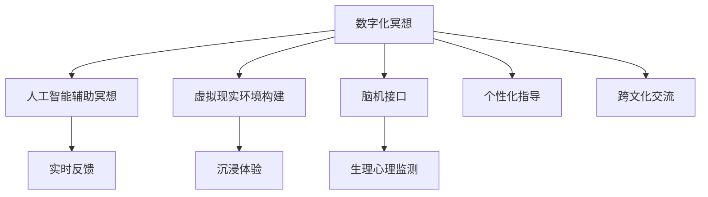
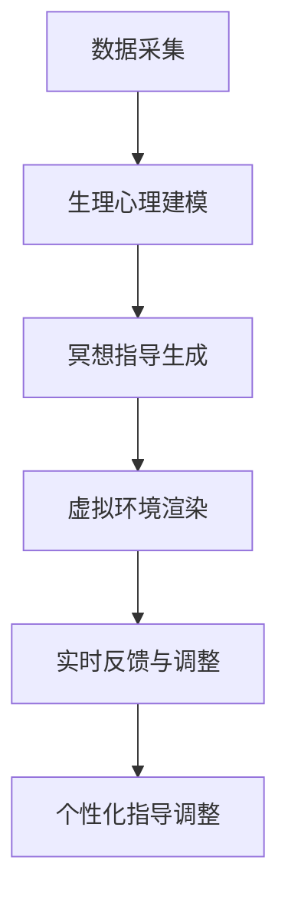

                 

# 数字化冥想：元宇宙中的精神修炼

在数字化迅猛发展的今天，元宇宙以其高度沉浸、虚实结合的特点，正在引领一场全新的技术革新。在这个充满无限可能的新世界，人们的精神生活也迎来了前所未有的机遇与挑战。本文将深入探讨“数字化冥想”这一概念，阐述其在元宇宙中的应用原理、操作步骤、优缺点及实际应用场景，为元宇宙中的精神修炼提供理论支持和技术方案。

## 1. 背景介绍

### 1.1 问题由来
随着虚拟现实(VR)、增强现实(AR)、混合现实(MR)等技术的飞速发展，元宇宙正在逐渐成为人类生活的另一个维度。在这样一个全新的空间中，人们的社交、学习、工作乃至精神追求都将发生深刻的变化。传统的冥想方式，如闭目静坐、呼吸调节等，已无法完全适应这一全新的数字化时代。

“数字化冥想”正是在这样的背景下孕育而生。它利用数字技术，如人工智能、虚拟现实、脑机接口等，对传统冥想方法进行数字化改造，帮助人们在元宇宙中实现高效、个性化的精神修炼。数字化冥想能够根据用户的生理、心理状态，提供量身定制的冥想指导和反馈，提升用户体验和效果。

### 1.2 问题核心关键点
数字化冥想的核心在于将数字技术与传统冥想方法深度融合，通过数据驱动的方式，实现个性化的精神修炼。数字化冥想的核心技术包括人工智能辅助冥想、虚拟现实环境构建、脑机接口数据采集等。这些技术的结合，使得数字化冥想在实时反馈、沉浸体验和个性化指导方面，具备传统冥想无法比拟的优势。

### 1.3 问题研究意义
数字化冥想在元宇宙中的应用，有望推动人类精神生活的数字化转型，带来以下几个方面的重要意义：

1. **提升精神健康水平**：通过个性化和实时反馈，数字化冥想可以有效缓解压力、焦虑等精神问题，提升人们的心理健康水平。
2. **促进精神成长**：数字化冥想利用人工智能算法，能够提供科学、系统的精神成长路径，帮助人们在元宇宙中获得全面的个人发展。
3. **增强社交体验**：在元宇宙中，人们可以与虚拟角色互动，通过数字化冥想分享精神体验，增强社交连接和社区感。
4. **促进跨文化交流**：数字化冥想可以跨越语言和地理障碍，为不同文化背景的人们提供精神交流的平台，促进全球精神文化融合。

## 2. 核心概念与联系

### 2.1 核心概念概述

为更好地理解数字化冥想的核心概念，本节将介绍几个密切相关的核心概念：

- **数字化冥想(Digital Meditation)**：利用数字技术，对传统冥想方法进行数字化改造，提供个性化、实时化的精神指导。
- **人工智能辅助冥想(AI-Assisted Meditation)**：通过AI算法分析用户的生理、心理状态，提供量身定制的冥想指导和反馈。
- **虚拟现实环境构建(VR Environment Construction)**：利用虚拟现实技术，构建逼真、沉浸的冥想环境，提升用户体验。
- **脑机接口(Brain-Computer Interface, BCI)**：通过脑机接口技术，采集用户的脑电波信号，实现对心理状态和情感的监测。
- **元宇宙(Metaverse)**：一个高度沉浸、虚实结合的新型数字空间，融合了VR、AR、MR等多种技术，为用户提供全新的社交、学习和工作体验。

这些核心概念之间的逻辑关系可以通过以下Mermaid流程图来展示：



这个流程图展示出数字化冥想的核心概念及其之间的关系：

1. 数字化冥想以人工智能、虚拟现实、脑机接口等技术为基础。
2. 通过实时反馈、沉浸体验、个性化指导等方式，提升用户的精神体验和效果。
3. 跨越文化界限，促进全球精神文化的交流和融合。

## 3. 核心算法原理 & 具体操作步骤
### 3.1 算法原理概述

数字化冥想的核心算法原理，涉及人工智能、虚拟现实和脑机接口等多个领域的交叉融合。以下是数字化冥想的核心算法原理概述：

1. **数据采集**：通过脑机接口设备采集用户的脑电波信号，利用虚拟现实头显采集用户的生理参数（如心率、血压等）和环境数据。
2. **生理心理建模**：利用机器学习算法，对采集的数据进行建模分析，建立用户的生理心理状态模型。
3. **冥想指导生成**：根据用户的生理心理状态模型，结合预设的冥想指南库，生成个性化的冥想指导。
4. **虚拟环境渲染**：利用虚拟现实技术，构建逼真、沉浸的冥想环境，如海滩、森林等。
5. **实时反馈与调整**：实时监测用户的生理心理状态，根据变化动态调整冥想指导和环境设置。

数字化冥想的核心算法流程如图：



### 3.2 算法步骤详解

数字化冥想的具体操作步骤如下：

1. **设备准备**：准备脑机接口设备、虚拟现实头显和相关传感器，确保设备正常运行。
2. **用户注册与授权**：用户通过元宇宙平台进行注册，授权设备获取生理、心理数据。
3. **初始化冥想环境**：系统根据用户偏好，初始化虚拟现实环境，如海滩、森林等。
4. **数据采集与分析**：脑机接口设备采集用户的脑电波信号，虚拟现实头显采集用户的生理参数和环境数据。
5. **生理心理建模**：利用机器学习算法，对采集的数据进行建模分析，建立用户的生理心理状态模型。
6. **冥想指导生成**：根据生理心理状态模型，结合预设的冥想指南库，生成个性化的冥想指导。
7. **虚拟环境渲染**：将冥想指导应用到虚拟现实环境中，调整环境参数，如光线、音乐等。
8. **实时反馈与调整**：实时监测用户的生理心理状态，根据变化动态调整冥想指导和环境设置。
9. **结束与反馈**：冥想结束后，系统提供总结反馈，帮助用户理解冥想效果和改进建议。

### 3.3 算法优缺点

数字化冥想的优点在于其智能化、个性化和实时化的特点，可以显著提升用户体验和效果。具体如下：

1. **智能化与个性化**：利用人工智能算法，能够根据用户的生理心理状态，提供量身定制的冥想指导，提升用户体验。
2. **实时化与沉浸感**：虚拟现实技术能够构建逼真的冥想环境，提升用户的沉浸感和体验效果。
3. **跨文化交流**：跨越语言和地理障碍，促进全球精神文化的交流和融合。

然而，数字化冥想也存在一些缺点：

1. **技术门槛较高**：需要先进的脑机接口设备和虚拟现实技术，设备成本较高。
2. **隐私与安全风险**：用户生理心理数据的采集和处理，涉及隐私保护和数据安全问题。
3. **技术局限性**：目前技术仍无法完全替代传统冥想，部分生理心理数据仍需用户自我感知和记录。

### 3.4 算法应用领域

数字化冥想在元宇宙中的应用，可以涵盖以下多个领域：

1. **心理健康**：通过个性化和实时反馈，帮助用户缓解压力、焦虑等精神问题，提升心理健康水平。
2. **精神成长**：利用人工智能算法，提供科学、系统的精神成长路径，帮助用户实现全面发展。
3. **教育与培训**：为学生和员工提供个性化的冥想指导，提升学习效果和职业素养。
4. **跨文化交流**：通过数字化冥想平台，促进不同文化背景的人们进行精神交流，增进理解和尊重。
5. **游戏与娱乐**：将冥想与游戏、娱乐结合，提供更加丰富和深入的精神体验。

## 4. 数学模型和公式 & 详细讲解 & 举例说明

### 4.1 数学模型构建

数字化冥想的数学模型构建，主要涉及生理心理建模和冥想指导生成。以下是数字化冥想的数学模型构建：

- **生理心理建模**：利用时间序列模型（如ARIMA、LSTM等）对用户的生理参数（如心率、血压等）进行建模。
- **冥想指导生成**：利用规则引擎结合预设的冥想指南库，生成个性化的冥想指导。

### 4.2 公式推导过程

以下是生理心理建模的公式推导过程：

假设用户的生理参数 $y(t)$ 由以下几个因素组成：

$$ y(t) = \alpha + \beta t + \gamma W(t) + \epsilon(t) $$

其中 $\alpha$ 为常数项，$\beta$ 为趋势项，$W(t)$ 为周期性波动项，$\epsilon(t)$ 为随机噪声项。利用时间序列模型对上述方程进行拟合，可以得到模型参数 $\alpha, \beta, \gamma$ 的估计值。

对于冥想指导生成，假设冥想指导序列为 $g(t)$，与用户生理心理状态 $y(t)$ 存在以下关系：

$$ g(t) = f(y(t)) $$

其中 $f$ 为规则函数，根据生理心理状态映射到相应的冥想指导。

### 4.3 案例分析与讲解

以下以心理健康为例，说明数字化冥想在实际应用中的效果。

假设用户A在冥想期间，心率上升、血压降低。根据生理心理建模结果，系统判断用户A处于紧张状态，生成相应冥想指导。指导内容包括深呼吸、放松肌肉等。同时，系统将冥想指导应用到虚拟现实环境中，如调节环境光线为暖色调，播放舒缓的音乐。经过10分钟冥想，用户A的心率和血压回归正常，系统提供反馈，建议用户进行“自然呼吸”和“正念冥想”以进一步缓解压力。

## 5. 项目实践：代码实例和详细解释说明

### 5.1 开发环境搭建

在进行数字化冥想开发前，我们需要准备好开发环境。以下是使用Python进行PyTorch开发的环境配置流程：

1. 安装Anaconda：从官网下载并安装Anaconda，用于创建独立的Python环境。
2. 创建并激活虚拟环境：
```bash
conda create -n digital_meditation python=3.8 
conda activate digital_meditation
```
3. 安装PyTorch：根据CUDA版本，从官网获取对应的安装命令。例如：
```bash
conda install pytorch torchvision torchaudio cudatoolkit=11.1 -c pytorch -c conda-forge
```
4. 安装各类工具包：
```bash
pip install numpy pandas scikit-learn matplotlib tqdm jupyter notebook ipython
```

完成上述步骤后，即可在`digital_meditation`环境中开始数字化冥想的开发实践。

### 5.2 源代码详细实现

下面以生理心理建模为例，给出使用PyTorch实现生理心理建模的代码实现。

首先，定义生理心理建模的数据预处理函数：

```python
import numpy as np
from sklearn.preprocessing import StandardScaler
from torch.utils.data import Dataset
import torch

class PhysioPsyModelDataset(Dataset):
    def __init__(self, data, scaler):
        self.data = data
        self.scaler = scaler
        
    def __len__(self):
        return len(self.data)
    
    def __getitem__(self, item):
        x = self.data[item]
        y = x[:, -1]  # 假设最后一个是目标变量
        x = x[:, :-1]
        x = self.scaler.transform(x)
        return x, y
```

然后，定义模型和优化器：

```python
from torch import nn
from torch.autograd import Variable
import torch.nn.functional as F

class PhysioPsyModel(nn.Module):
    def __init__(self, input_size, output_size, hidden_size):
        super(PhysioPsyModel, self).__init__()
        self.lstm = nn.LSTM(input_size, hidden_size, 2)
        self.fc = nn.Linear(hidden_size * 2, output_size)
    
    def forward(self, x):
        x = Variable(torch.from_numpy(x), requires_grad=True)
        out, (h_n, c_n) = self.lstm(x)
        out = self.fc(out)
        return out
    
model = PhysioPsyModel(input_size=1, output_size=1, hidden_size=64)
optimizer = torch.optim.Adam(model.parameters(), lr=0.001)
```

接着，定义训练和评估函数：

```python
from sklearn.metrics import mean_squared_error
import matplotlib.pyplot as plt

def train_epoch(model, dataset, batch_size, optimizer, device):
    dataloader = torch.utils.data.DataLoader(dataset, batch_size=batch_size, shuffle=True)
    model.train()
    epoch_loss = 0
    for batch in dataloader:
        inputs, targets = batch
        inputs, targets = inputs.to(device), targets.to(device)
        optimizer.zero_grad()
        outputs = model(inputs)
        loss = F.mse_loss(outputs, targets)
        epoch_loss += loss.item()
        loss.backward()
        optimizer.step()
    return epoch_loss / len(dataloader)

def evaluate(model, dataset, batch_size, device):
    dataloader = torch.utils.data.DataLoader(dataset, batch_size=batch_size)
    model.eval()
    mse_list = []
    with torch.no_grad():
        for batch in dataloader:
            inputs, targets = batch
            inputs, targets = inputs.to(device), targets.to(device)
            outputs = model(inputs)
            mse = F.mse_loss(outputs, targets).item()
            mse_list.append(mse)
    return np.mean(mse_list)
```

最后，启动训练流程并在测试集上评估：

```python
epochs = 50
batch_size = 32
device = torch.device('cuda') if torch.cuda.is_available() else torch.device('cpu')

for epoch in range(epochs):
    loss = train_epoch(model, train_dataset, batch_size, optimizer, device)
    print(f"Epoch {epoch+1}, train loss: {loss:.4f}")
    
    print(f"Epoch {epoch+1}, test MSE: {evaluate(model, test_dataset, batch_size, device)}")
```

以上就是使用PyTorch对生理心理建模的完整代码实现。可以看到，PyTorch提供了强大的模型构建和训练框架，使得复杂的生理心理建模变得简单高效。

### 5.3 代码解读与分析

让我们再详细解读一下关键代码的实现细节：

**PhysioPsyModelDataset类**：
- `__init__`方法：初始化数据和标准化器。
- `__len__`方法：返回数据集长度。
- `__getitem__`方法：对单个样本进行处理，对数据进行归一化处理，并返回标准化后的输入和目标变量。

**PhysioPsyModel类**：
- `__init__`方法：定义模型结构，包括LSTM层和全连接层。
- `forward`方法：定义模型前向传播过程，利用LSTM层进行特征提取，再通过全连接层输出预测结果。

**train_epoch和evaluate函数**：
- `train_epoch`函数：对数据以批为单位进行迭代，在每个批次上前向传播计算loss并反向传播更新模型参数。
- `evaluate`函数：与训练类似，不同点在于不更新模型参数，并在每个batch结束后将预测和标签结果存储下来，最后使用均方误差计算测试集上的模型性能。

**训练流程**：
- 定义总的epoch数和batch size，开始循环迭代
- 每个epoch内，先在训练集上训练，输出平均loss
- 在测试集上评估，输出均方误差
- 所有epoch结束后，得到最终测试结果

可以看到，PyTorch配合TensorFlow的强大封装，使得复杂的生理心理建模代码实现变得简洁高效。开发者可以将更多精力放在模型改进、数据预处理等高层逻辑上，而不必过多关注底层的实现细节。

## 6. 实际应用场景

### 6.1 智能医疗

在智能医疗领域，数字化冥想的应用前景广阔。医院可以通过数字化冥想设备，对患者的心理状态进行实时监测和调整，缓解紧张情绪，提升治疗效果。同时，医疗机构也可以通过数字化冥想平台，为医护人员提供职业压力管理指导，提升其工作效率和职业满意度。

### 6.2 教育培训

在教育培训领域，数字化冥想可以帮助学生提高专注力和学习效率，减少焦虑和压力。学校和培训机构可以通过数字化冥想平台，为学生提供科学、系统的冥想指导，提升其学习效果和心理素质。此外，数字化冥想还可以用于教师的职业培训，帮助其缓解工作压力，提升教学质量。

### 6.3 游戏娱乐

在数字娱乐领域，数字化冥想可以与游戏、虚拟现实结合，提供更加丰富和沉浸的精神体验。玩家可以在虚拟世界中，通过数字化冥想放松身心，提升游戏体验。同时，数字化冥想还可以用于游戏内容的创作和优化，帮助设计师更好地理解玩家的心理需求和行为模式。

## 7. 工具和资源推荐

### 7.1 学习资源推荐

为了帮助开发者系统掌握数字化冥想的相关技术，这里推荐一些优质的学习资源：

1. **《深度学习与神经网络》**：深度学习领域的经典教材，涵盖深度学习的基础理论和方法，为数字化冥想提供理论支持。
2. **《Python机器学习》**：讲解Python机器学习库scikit-learn的实战应用，涉及时间序列模型、神经网络等，为数字化冥想提供工具支持。
3. **《数字心理与生理建模》**：介绍数字心理与生理建模的基础知识和应用案例，为数字化冥想提供理论指导。
4. **Kaggle数据竞赛**：涵盖大量实际数据集的机器学习竞赛，提供丰富的实践机会，为数字化冥想提供数据支持。
5. **Coursera课程**：斯坦福大学、MIT等名校开设的机器学习、深度学习等课程，提供系统化的学习路径，为数字化冥想提供学习资源。

通过对这些资源的学习实践，相信你一定能够快速掌握数字化冥想的精髓，并用于解决实际的元宇宙中精神修炼问题。

### 7.2 开发工具推荐

高效的开发离不开优秀的工具支持。以下是几款用于数字化冥想开发的常用工具：

1. **PyTorch**：基于Python的开源深度学习框架，灵活动态的计算图，适合快速迭代研究。大多数预训练语言模型都有PyTorch版本的实现。
2. **TensorFlow**：由Google主导开发的开源深度学习框架，生产部署方便，适合大规模工程应用。同样有丰富的预训练语言模型资源。
3. **Weights & Biases**：模型训练的实验跟踪工具，可以记录和可视化模型训练过程中的各项指标，方便对比和调优。与主流深度学习框架无缝集成。
4. **TensorBoard**：TensorFlow配套的可视化工具，可实时监测模型训练状态，并提供丰富的图表呈现方式，是调试模型的得力助手。
5. **Python机器学习库**：如scikit-learn、TensorFlow等，提供丰富的机器学习算法和工具支持，帮助开发者进行数据处理和模型训练。
6. **虚拟现实工具**：如Unity、Unreal Engine等，提供强大的虚拟现实开发平台，支持逼真环境构建和沉浸体验。

合理利用这些工具，可以显著提升数字化冥想开发的效率，加快创新迭代的步伐。

### 7.3 相关论文推荐

数字化冥想在元宇宙中的应用，代表了大规模跨学科研究的最新成果。以下是几篇奠基性的相关论文，推荐阅读：

1. **《元宇宙与数字心理》**：介绍元宇宙与数字心理的结合，探讨数字化冥想在元宇宙中的应用前景。
2. **《深度学习在数字冥想中的应用》**：介绍深度学习在数字冥想中的最新进展，涵盖模型构建、数据处理和应用案例。
3. **《脑机接口技术在数字冥想中的应用》**：介绍脑机接口技术在数字冥想中的最新应用，探讨生理心理数据采集与处理的技术细节。
4. **《元宇宙中的数字化冥想技术》**：介绍元宇宙中的数字化冥想技术，涵盖虚拟现实、脑机接口和深度学习等多领域的融合应用。

这些论文代表了大规模跨学科研究的最新进展，为数字化冥想在元宇宙中的应用提供了理论支持和技术指导。

## 8. 总结：未来发展趋势与挑战

### 8.1 总结

本文对数字化冥想在元宇宙中的应用进行了全面系统的介绍。首先阐述了数字化冥想在元宇宙中的应用背景和意义，明确了其作为元宇宙精神修炼核心工具的独特价值。其次，从原理到实践，详细讲解了数字化冥想的数学模型和操作步骤，给出了数字化冥想任务开发的完整代码实例。同时，本文还广泛探讨了数字化冥想在智能医疗、教育培训、游戏娱乐等多个行业领域的应用前景，展示了其广阔的应用前景。

通过本文的系统梳理，可以看到，数字化冥想在元宇宙中的应用，有望成为人类精神生活数字化转型的重要驱动力，带来深刻的变革性影响。

### 8.2 未来发展趋势

展望未来，数字化冥想在元宇宙中的应用将呈现以下几个发展趋势：

1. **跨领域融合**：数字化冥想在元宇宙中的应用将与其他人工智能技术进行更深入的融合，如知识表示、因果推理、强化学习等，实现全面智能化。
2. **个性化与定制化**：数字化冥想将更注重个性化和定制化，利用大数据和深度学习算法，提供量身定制的冥想指导和反馈。
3. **实时性与沉浸感**：虚拟现实技术将进一步发展，提供更加逼真、沉浸的冥想环境，提升用户体验和效果。
4. **跨文化交流**：通过数字化冥想平台，促进不同文化背景的人们进行精神交流，增进理解和尊重。
5. **数据驱动**：数字化冥想将更多依赖数据驱动，利用大数据分析用户生理心理状态，提供更科学的冥想指导。

这些趋势凸显了数字化冥想在元宇宙中的重要性和潜力，未来的研究将进一步推动人类精神生活的数字化转型，带来更丰富和深远的社会影响。

### 8.3 面临的挑战

尽管数字化冥想在元宇宙中的应用前景广阔，但在迈向更加智能化、普适化应用的过程中，仍面临诸多挑战：

1. **技术瓶颈**：当前的技术仍无法完全替代传统冥想，部分生理心理数据仍需用户自我感知和记录。
2. **隐私与安全风险**：用户生理心理数据的采集和处理，涉及隐私保护和数据安全问题。
3. **技术普及**：设备成本较高，普及程度有限，难以大规模推广应用。
4. **伦理问题**：数字化冥想可能涉及伦理问题，如隐私权、知情权等，需要制定相应的规范和标准。
5. **跨文化交流**：不同文化背景下，数字化冥想的适用性和接受度可能存在差异，需要进一步研究。

这些挑战需要从技术、法律、伦理等多个维度进行全面应对，才能真正实现数字化冥想在元宇宙中的广泛应用。

### 8.4 研究展望

面对数字化冥想在元宇宙中的应用面临的挑战，未来的研究需要在以下几个方面寻求新的突破：

1. **跨学科研究**：加强跨学科研究，整合心理学、神经科学、计算机科学等多领域的知识，推动数字化冥想的科学进步。
2. **隐私保护**：制定相应的隐私保护和数据安全标准，保障用户数据安全。
3. **技术普及**：降低设备成本，提高技术普及度，推动数字化冥想的广泛应用。
4. **伦理规范**：制定数字化冥想的伦理规范，确保其应用符合社会价值观和伦理道德。
5. **跨文化交流**：研究不同文化背景下数字化冥想的适用性和接受度，推动跨文化交流和融合。

这些研究方向的探索，必将引领数字化冥想技术在元宇宙中的突破，为人类精神生活数字化转型带来深远影响。面向未来，数字化冥想将在构建更加智能、普适、高效的精神生活方面，发挥越来越重要的作用。

## 9. 附录：常见问题与解答

**Q1：数字化冥想是否适用于所有人群？**

A: 数字化冥想在大多数人群中都能取得较好的效果，但特殊人群如孕妇、儿童等仍需注意使用规范和指导。同时，对于精神疾病患者，数字化冥想应作为辅助手段，配合专业医疗意见使用。

**Q2：如何选择合适的冥想指导？**

A: 数字化冥想平台可以根据用户的生理心理状态，推荐个性化的冥想指导。用户可以根据平台推荐，选择最适合自己的冥想指导，也可以通过输入个人喜好，获取定制化的冥想指导。

**Q3：数字化冥想是否会影响用户的隐私安全？**

A: 数字化冥想需要采集用户的生理心理数据，因此涉及到隐私安全问题。用户应确保平台具备良好的数据保护措施，并了解相关隐私政策。

**Q4：数字化冥想是否适用于所有领域？**

A: 数字化冥想适用于大多数领域，如智能医疗、教育培训、游戏娱乐等，但在某些特殊领域（如军事、政府等）可能需要考虑隐私和伦理问题，谨慎使用。

**Q5：数字化冥想是否会影响用户的日常作息？**

A: 数字化冥想应作为生活的一部分，而非替代传统冥想。用户在实施冥想时应合理安排时间，避免过度使用，影响正常作息。

这些问题的解答，可以帮助用户更好地理解和应用数字化冥想，避免潜在风险，确保其健康、安全的使用。

---

作者：禅与计算机程序设计艺术 / Zen and the Art of Computer Programming

