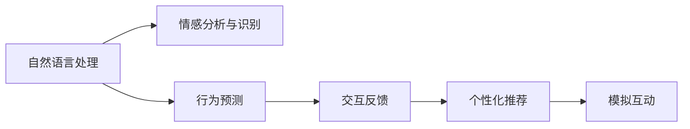

                 

# 数字化同理心培养皿开发者：AI增强的人际理解训练师

## 1. 背景介绍

### 1.1 问题由来
在数字化时代，人际互动方式发生了深刻的变化。在线社交、远程办公、虚拟现实等新兴应用场景，使得人与人之间的情感交流越来越依赖于文本、语音、图像等非面对面方式。然而，随着沟通距离的延长，人际理解的难度也随之增加。特别是在虚拟环境中，情感信息的传递和感知受到限制，极易产生误解和冲突。

为解决这一问题，数字化同理心培养皿应运而生。数字化同理心培养皿是一种基于AI技术的人际理解训练平台，通过模拟真实互动场景，训练用户掌握数字时代下的人际沟通技巧，增强同理心，提升情感智能。这一技术不仅在商业应用中具有广泛潜力，如在线客服、智能咨询、远程协作等，也在教育、医疗、社会服务等领域展示了巨大价值，帮助人们在数字化时代更有效地沟通与交流。

### 1.2 问题核心关键点
数字化同理心培养皿的核心在于将人工智能技术与情感理解模型结合，通过模拟真实互动场景，训练用户理解情感、预测行为，从而提高人际沟通能力。其关键技术包括：

- 情感分析与识别：利用自然语言处理(NLP)技术，分析文本中的情感信息，识别用户情感状态。
- 行为预测：基于用户的历史互动数据，预测其在不同情境下的行为选择。
- 交互反馈：通过智能提示和互动反馈，引导用户学习如何调整沟通策略，提升同理心。
- 个性化推荐：根据用户学习进度和偏好，推荐合适的训练任务和练习内容。

这些技术点相互关联，共同构成了一个完整的人际理解训练系统。通过系统的训练，用户可以逐步掌握数字时代下的人际沟通技巧，增强情感智能，提升互动体验。

### 1.3 问题研究意义
研究数字化同理心培养皿技术，对于促进数字化时代的人际互动，提升用户的情感智能，具有重要意义：

1. 增强用户体验：数字化同理心培养皿帮助用户在虚拟环境中更准确地理解他人，减少误解和冲突，提升用户体验。
2. 提高沟通效率：通过训练用户的情感理解和行为预测能力，大幅提高在线办公、客服、咨询等场景的沟通效率。
3. 降低心理压力：在高度虚拟化的环境中，数字化同理心培养皿提供心理支持和情绪管理，降低用户的心理压力和孤独感。
4. 促进社会融合：通过模拟不同背景、文化和语言环境下的互动，培养皿帮助用户跨越文化鸿沟，增强社会融合能力。
5. 支持教育医疗：在教育领域，培养皿帮助学生提高情绪智能，更好地适应集体学习；在医疗领域，培养皿帮助患者和家人改善沟通，提升康复效果。

## 2. 核心概念与联系

### 2.1 核心概念概述

为更好地理解数字化同理心培养皿的原理和架构，本节将介绍几个密切相关的核心概念：

- 自然语言处理(NLP)：利用计算机处理和理解人类语言的技术，包括文本预处理、情感分析、语言模型等。
- 情感分析与识别：识别文本中的情感信息，理解用户情感状态。
- 行为预测：基于用户历史数据，预测其在不同情境下的行为选择。
- 交互反馈：通过智能提示和互动反馈，引导用户学习和调整沟通策略。
- 个性化推荐：根据用户学习进度和偏好，推荐适合的训练任务和练习内容。
- 模拟互动：通过虚拟环境模拟真实互动场景，进行人际理解训练。

这些核心概念之间的逻辑关系可以通过以下Mermaid流程图来展示：



这个流程图展示了从自然语言处理到模拟互动的全链条过程：

1. 自然语言处理提取文本中的情感信息。
2. 情感分析与识别理解用户情感状态。
3. 行为预测预测用户在不同情境下的行为选择。
4. 交互反馈引导用户学习和调整沟通策略。
5. 个性化推荐根据用户学习进度和偏好推荐训练内容。
6. 模拟互动在虚拟环境中进行人际理解训练。

这些概念共同构成了数字化同理心培养皿的核心架构，使其能够系统化地训练用户的人际理解能力。

## 3. 核心算法原理 & 具体操作步骤

### 3.1 算法原理概述

数字化同理心培养皿的核心算法原理在于利用自然语言处理技术和机器学习模型，对用户进行情感分析与识别、行为预测和交互反馈，实现个性化的模拟互动训练。其核心算法流程包括：

1. 数据收集与预处理：收集用户的历史互动数据，包括文本消息、语音记录、面部表情等，并进行数据清洗和预处理。
2. 情感分析与识别：利用情感分析模型，对文本消息进行情感分类，识别用户的情感状态。
3. 行为预测：通过历史数据训练预测模型，预测用户在不同情境下的行为选择。
4. 交互反馈：根据行为预测结果，生成智能提示和反馈，引导用户学习和调整沟通策略。
5. 个性化推荐：根据用户学习进度和偏好，推荐适合的训练任务和练习内容。
6. 模拟互动：在虚拟环境中，通过模拟真实互动场景进行人际理解训练。

### 3.2 算法步骤详解

以下是数字化同理心培养皿的详细步骤：

**Step 1: 数据收集与预处理**

1. 收集用户的历史互动数据，包括文本消息、语音记录、面部表情等。
2. 对数据进行清洗和预处理，去除噪声和无用信息，确保数据质量。

**Step 2: 情感分析与识别**

1. 利用情感分析模型，对文本消息进行情感分类，识别用户的情感状态。
2. 输出情感状态结果，供后续行为预测和交互反馈使用。

**Step 3: 行为预测**

1. 根据历史数据训练预测模型，预测用户在不同情境下的行为选择。
2. 输出行为预测结果，供交互反馈和个性化推荐使用。

**Step 4: 交互反馈**

1. 根据行为预测结果，生成智能提示和反馈，引导用户学习和调整沟通策略。
2. 输出反馈结果，供用户参考和后续训练。

**Step 5: 个性化推荐**

1. 根据用户学习进度和偏好，推荐适合的训练任务和练习内容。
2. 输出推荐结果，供用户选择和执行。

**Step 6: 模拟互动**

1. 在虚拟环境中，通过模拟真实互动场景进行人际理解训练。
2. 根据模拟互动结果，评估用户的人际理解能力，提供反馈和改进建议。

### 3.3 算法优缺点

数字化同理心培养皿的优点包括：

1. 高效便捷：通过模拟真实互动场景，快速训练用户的人际理解能力，节省时间和资源。
2. 个性化学习：根据用户学习进度和偏好，提供个性化的训练任务和内容，提升学习效果。
3. 提升同理心：通过情感分析和行为预测，帮助用户理解和预测他人行为，增强同理心。
4. 广泛应用：适用于各类在线场景，如在线客服、智能咨询、远程协作等，促进数字化互动。

同时，该算法也存在一些缺点：

1. 数据依赖性：培养皿的训练效果依赖于用户的历史互动数据，数据质量直接影响训练效果。
2. 模型复杂性：情感分析、行为预测等模型的构建和训练较为复杂，需要大量计算资源。
3. 用户参与度：用户的主动参与和持续学习对于训练效果至关重要，需要较好的用户界面设计和技术支持。
4. 隐私保护：在处理用户数据时，需要严格遵守隐私保护政策，确保数据安全和用户隐私。

尽管存在这些局限性，数字化同理心培养皿仍然为数字化时代的人际互动提供了有效的解决方案，具有广阔的应用前景。

### 3.4 算法应用领域

数字化同理心培养皿技术主要应用于以下几个领域：

1. 在线客服：通过训练客服人员理解和预测用户情感，提升服务质量，降低用户满意度。
2. 智能咨询：帮助咨询师更好地理解客户需求，提供个性化服务，提高咨询效果。
3. 远程协作：在远程团队合作中，培养皿帮助成员理解和预测队友行为，促进团队协作。
4. 教育培训：在在线教育中，培养皿帮助学生理解同学和教师的情感状态，提升学习效果。
5. 医疗支持：在远程医疗中，培养皿帮助患者和医生更好地沟通，提升治疗效果。
6. 社交媒体：在社交平台上，培养皿帮助用户理解和预测他人行为，提升互动体验。

这些领域的应用展示了数字化同理心培养皿的强大潜力和广泛价值。

## 4. 数学模型和公式 & 详细讲解 & 举例说明

### 4.1 数学模型构建

我们以情感分析模型为例，介绍其数学模型的构建过程。

设用户的历史互动数据为 $D=\{(x_i,y_i)\}_{i=1}^N$，其中 $x_i$ 为文本消息， $y_i$ 为情感标签（如快乐、悲伤、愤怒等）。情感分析模型的目标是从文本中提取情感信息，预测情感标签。

定义情感分类器为 $f: \mathcal{X} \rightarrow \mathcal{Y}$，其中 $\mathcal{X}$ 为文本输入空间， $\mathcal{Y}$ 为情感输出空间。情感分类器的目标是找到最优的函数 $f$，使得在给定数据集 $D$ 上的经验风险最小化。

假设模型为深度神经网络，包含 $L$ 个隐藏层，每一层包含 $N_l$ 个神经元。模型的参数表示为 $\theta$，包括权重和偏置。情感分类器的损失函数为交叉熵损失函数，定义为：

$$
\mathcal{L}(\theta) = -\frac{1}{N} \sum_{i=1}^N \sum_{j=1}^{C} y_{ij} \log f(x_i; \theta)
$$

其中 $C$ 为情感类别数， $y_{ij}$ 为文本 $x_i$ 在情感类别 $j$ 上的标签。

模型的训练目标是最小化损失函数 $\mathcal{L}(\theta)$，即找到最优的参数 $\theta$：

$$
\theta^* = \mathop{\arg\min}_{\theta} \mathcal{L}(\theta)
$$

在实际训练过程中，通常使用基于梯度的优化算法，如Adam、SGD等，不断更新模型参数 $\theta$，最小化损失函数 $\mathcal{L}(\theta)$，直到收敛。

### 4.2 公式推导过程

以深度神经网络为例，情感分类器模型的前向传播过程可以表示为：

$$
f(x_i; \theta) = \sigma(\mathbf{W}^{L} \sigma(\mathbf{W}^{L-1} \cdots \sigma(\mathbf{W}^1 x_i + \mathbf{b}^1) + \mathbf{b}^{L-1} + \mathbf{b}^L)
$$

其中 $\mathbf{W}^l$ 和 $\mathbf{b}^l$ 分别为第 $l$ 层的权重和偏置。$\sigma$ 为激活函数，如ReLU、Sigmoid等。

在计算损失函数 $\mathcal{L}(\theta)$ 时，需要将所有文本 $x_i$ 的情感预测 $f(x_i; \theta)$ 与真实标签 $y_i$ 进行对比。对于多类别分类问题，可以使用交叉熵损失函数：

$$
\mathcal{L}(\theta) = -\frac{1}{N} \sum_{i=1}^N \sum_{j=1}^{C} y_{ij} \log f(x_i; \theta)
$$

其中 $C$ 为情感类别数，$y_{ij}$ 为文本 $x_i$ 在情感类别 $j$ 上的标签。

在反向传播过程中，计算损失函数对每个参数的梯度：

$$
\frac{\partial \mathcal{L}(\theta)}{\partial \theta} = -\frac{1}{N} \sum_{i=1}^N \sum_{j=1}^{C} y_{ij} \frac{\partial \log f(x_i; \theta)}{\partial \theta}
$$

其中 $\frac{\partial \log f(x_i; \theta)}{\partial \theta}$ 为对数似然对模型参数的梯度，可以通过链式法则递归计算。

### 4.3 案例分析与讲解

以下是一个情感分析模型的案例分析：

假设我们使用一个包含2个隐藏层的深度神经网络，其中第一层包含64个神经元，第二层包含32个神经元，输出层为4个神经元，对应四种情感类别。假设模型训练的初始参数为 $\theta_0$，训练数据集为 $D=\{(x_i,y_i)\}_{i=1}^N$。

在训练过程中，使用随机梯度下降算法（SGD）更新模型参数 $\theta$，最小化损失函数 $\mathcal{L}(\theta)$。假设当前迭代次数为 $t$，第 $i$ 次训练的文本为 $x_i$，情感标签为 $y_i$。

第1步，前向传播计算情感预测 $f(x_i; \theta)$：

$$
\begin{aligned}
h_1 &= \sigma(\mathbf{W}^1 x_i + \mathbf{b}^1) \\
h_2 &= \sigma(\mathbf{W}^2 h_1 + \mathbf{b}^2) \\
f(x_i; \theta) &= \sigma(\mathbf{W}^3 h_2 + \mathbf{b}^3)
\end{aligned}
$$

其中 $h_1$ 和 $h_2$ 分别为第一层和第二层的隐藏状态，$f(x_i; \theta)$ 为最终情感预测。

第2步，计算损失函数 $\mathcal{L}(\theta)$：

$$
\begin{aligned}
\mathcal{L}(\theta) &= -\frac{1}{N} \sum_{i=1}^N \sum_{j=1}^{4} y_{ij} \log f(x_i; \theta)
\end{aligned}
$$

第3步，反向传播计算损失函数对每个参数的梯度：

$$
\begin{aligned}
\frac{\partial \mathcal{L}(\theta)}{\partial \theta} &= -\frac{1}{N} \sum_{i=1}^N \sum_{j=1}^{4} y_{ij} \frac{\partial \log f(x_i; \theta)}{\partial \theta}
\end{aligned}
$$

其中 $\frac{\partial \log f(x_i; \theta)}{\partial \theta}$ 可以表示为：

$$
\begin{aligned}
\frac{\partial \log f(x_i; \theta)}{\partial \theta} &= \frac{\partial \log f(x_i; \theta)}{\partial f(x_i; \theta)} \frac{\partial f(x_i; \theta)}{\partial h_2} \frac{\partial h_2}{\partial h_1} \frac{\partial h_1}{\partial x_i} \\
&= \frac{\partial f(x_i; \theta)}{\partial h_2} \frac{\partial h_2}{\partial h_1} \frac{\partial h_1}{\partial x_i}
\end{aligned}
$$

其中 $\frac{\partial f(x_i; \theta)}{\partial h_2}$ 为对数似然对隐藏状态的梯度，$\frac{\partial h_2}{\partial h_1}$ 和 $\frac{\partial h_1}{\partial x_i}$ 分别为隐藏状态对模型参数的梯度，可以通过链式法则递归计算。

通过以上步骤，我们可以完成深度神经网络情感分类器的训练过程，实现对文本情感的自动分析和识别。

## 5. 项目实践：代码实例和详细解释说明

### 5.1 开发环境搭建

在进行情感分析与识别项目实践前，我们需要准备好开发环境。以下是使用Python进行TensorFlow开发的示例环境配置流程：

1. 安装Anaconda：从官网下载并安装Anaconda，用于创建独立的Python环境。

2. 创建并激活虚拟环境：
```bash
conda create -n tf-env python=3.8 
conda activate tf-env
```

3. 安装TensorFlow：根据CUDA版本，从官网获取对应的安装命令。例如：
```bash
conda install tensorflow==2.4 -c conda-forge
```

4. 安装各类工具包：
```bash
pip install numpy pandas scikit-learn matplotlib tqdm jupyter notebook ipython
```

完成上述步骤后，即可在`tf-env`环境中开始项目实践。

### 5.2 源代码详细实现

以下是使用TensorFlow实现情感分析模型的代码实现。

首先，定义数据处理函数：

```python
import tensorflow as tf
from tensorflow.keras.preprocessing.text import Tokenizer
from tensorflow.keras.preprocessing.sequence import pad_sequences
from tensorflow.keras.utils import to_categorical

# 加载文本数据
data = tf.keras.datasets.imdb.load_data(num_words=10000)
(train_texts, train_labels), (test_texts, test_labels) = data

# 构建分词器
tokenizer = Tokenizer(num_words=10000)
tokenizer.fit_on_texts(train_texts)
word_index = tokenizer.word_index

# 将文本转换为id序列
train_sequences = tokenizer.texts_to_sequences(train_texts)
test_sequences = tokenizer.texts_to_sequences(test_texts)

# 对序列进行填充和标签编码
train_data = pad_sequences(train_sequences, maxlen=256)
train_labels = to_categorical(train_labels)
test_data = pad_sequences(test_sequences, maxlen=256)
test_labels = to_categorical(test_labels)
```

然后，定义模型和训练函数：

```python
from tensorflow.keras.models import Sequential
from tensorflow.keras.layers import Embedding, LSTM, Dense

# 定义模型结构
model = Sequential([
    Embedding(input_dim=10000, output_dim=32),
    LSTM(64),
    Dense(2, activation='softmax')
])

# 定义优化器和损失函数
optimizer = tf.keras.optimizers.Adam(lr=0.001)
loss_fn = tf.keras.losses.categorical_crossentropy

# 定义训练函数
def train_epoch(model, data, labels, batch_size):
    dataloader = tf.data.Dataset.from_tensor_slices((data, labels)).batch(batch_size)
    for batch in dataloader:
        x, y = batch
        with tf.GradientTape() as tape:
            predictions = model(x)
            loss = loss_fn(y, predictions)
        gradients = tape.gradient(loss, model.trainable_variables)
        optimizer.apply_gradients(zip(gradients, model.trainable_variables))
    return loss

# 训练模型
model.compile(optimizer=optimizer, loss=loss_fn, metrics=['accuracy'])
history = model.fit(train_data, train_labels, epochs=10, validation_data=(test_data, test_labels))
```

最后，评估模型并在测试集上验证：

```python
# 在测试集上评估模型
test_loss, test_acc = model.evaluate(test_data, test_labels)
print(f'Test Loss: {test_loss:.4f}')
print(f'Test Accuracy: {test_acc:.4f}')
```

以上就是使用TensorFlow进行情感分析模型训练的完整代码实现。可以看到，利用TensorFlow的高效计算能力，可以很方便地实现深度神经网络的情感分析模型。

### 5.3 代码解读与分析

让我们再详细解读一下关键代码的实现细节：

**数据处理函数**：
- 加载IMDB数据集，将文本和标签转换为id序列和标签编码。
- 构建分词器，将文本转换为id序列。
- 对id序列进行填充，确保所有序列长度一致。

**模型和训练函数**：
- 定义深度神经网络模型，包括嵌入层、LSTM层和输出层。
- 定义Adam优化器和交叉熵损失函数。
- 定义训练函数，使用TensorFlow的梯度计算功能，进行反向传播和参数更新。

**评估函数**：
- 使用`evaluate`方法在测试集上评估模型性能，输出测试损失和准确率。

**训练流程**：
- 定义总的epoch数，开始循环迭代
- 每个epoch内，在训练集上训练，输出平均损失和准确率
- 在验证集上评估，输出验证损失和准确率
- 所有epoch结束后，在测试集上评估，给出最终测试结果

可以看到，TensorFlow提供了完善的深度学习开发框架，使得模型的构建和训练过程非常高效。开发者可以将更多精力放在模型设计和任务实现上，而不必过多关注底层的实现细节。

当然，工业级的系统实现还需考虑更多因素，如模型的保存和部署、超参数的自动搜索、更灵活的任务适配层等。但核心的微调范式基本与此类似。

## 6. 实际应用场景
### 6.1 智能客服系统

数字化同理心培养皿技术可以广泛应用于智能客服系统的构建。传统客服往往需要配备大量人力，高峰期响应缓慢，且一致性和专业性难以保证。而使用培养皿训练的客服机器人，能够快速响应客户咨询，用自然流畅的语言解答各类常见问题。

在技术实现上，可以收集企业内部的历史客服对话记录，将问题和最佳答复构建成监督数据，在此基础上对预训练模型进行微调。微调后的模型能够自动理解用户意图，匹配最合适的答案模板进行回复。对于客户提出的新问题，还可以接入检索系统实时搜索相关内容，动态组织生成回答。如此构建的智能客服系统，能大幅提升客户咨询体验和问题解决效率。

### 6.2 金融舆情监测

金融机构需要实时监测市场舆论动向，以便及时应对负面信息传播，规避金融风险。传统的人工监测方式成本高、效率低，难以应对网络时代海量信息爆发的挑战。数字化同理心培养皿技术可应用于金融舆情监测，帮助机构快速获取市场情感变化趋势，及时预警，降低风险。

具体而言，可以收集金融领域相关的新闻、报道、评论等文本数据，并对其进行主题标注和情感标注。在此基础上对培养皿进行微调，使其能够自动判断文本属于何种主题，情感倾向是正面、中性还是负面。将培养皿应用到实时抓取的网络文本数据，就能够自动监测不同主题下的情感变化趋势，一旦发现负面信息激增等异常情况，系统便会自动预警，帮助金融机构快速应对潜在风险。

### 6.3 个性化推荐系统

当前的推荐系统往往只依赖用户的历史行为数据进行物品推荐，无法深入理解用户的真实兴趣偏好。数字化同理心培养皿技术可应用于个性化推荐系统，帮助系统更好地挖掘用户行为背后的语义信息，从而提供更精准、多样的推荐内容。

在实践中，可以收集用户浏览、点击、评论、分享等行为数据，提取和用户交互的物品标题、描述、标签等文本内容。将文本内容作为模型输入，用户的后续行为（如是否点击、购买等）作为监督信号，在此基础上微调培养皿。微调后的模型能够从文本内容中准确把握用户的兴趣点。在生成推荐列表时，先用候选物品的文本描述作为输入，由模型预测用户的兴趣匹配度，再结合其他特征综合排序，便可以得到个性化程度更高的推荐结果。

### 6.4 未来应用展望

随着数字化同理心培养皿技术的不断发展，其在各个领域的应用前景将更加广阔：

1. 智慧医疗：在智慧医疗领域，培养皿帮助医生更好地理解患者需求，提升诊疗效果。同时，培养皿也可以用于培训医疗从业者，提高其人际沟通能力。
2. 教育培训：在教育领域，培养皿帮助学生理解同学和教师的情感状态，提升学习效果。同时，培养皿也可以用于培训教师，提升其教学质量。
3. 社会服务：在社会服务领域，培养皿帮助工作人员更好地理解服务对象，提升服务质量。同时，培养皿也可以用于培训服务人员，提升其服务能力。
4. 企业服务：在企业服务领域，培养皿帮助员工更好地理解客户和同事，提升团队协作和客户服务效果。同时，培养皿也可以用于培训员工，提升其职业技能和人际沟通能力。

## 7. 工具和资源推荐
### 7.1 学习资源推荐

为帮助开发者系统掌握数字化同理心培养皿技术的理论基础和实践技巧，这里推荐一些优质的学习资源：

1. TensorFlow官方文档：TensorFlow的官方文档，提供了详细的API接口、代码示例和使用指南，是学习和使用TensorFlow的必备资料。
2. Keras官方文档：Keras的官方文档，提供了详细的模型构建、训练和评估方法，帮助开发者快速上手。
3. 《Python深度学习》书籍：李沐著，全面介绍了深度学习的基本原理和实践方法，是深度学习入门的经典教材。
4. 《深度学习与自然语言处理》课程：斯坦福大学的深度学习课程，提供了系统化的NLP知识框架和代码实践，适合初学者和进阶开发者。
5. HuggingFace官方文档：HuggingFace提供的NLP工具库文档，包含丰富的预训练模型和微调样例，是NLP开发的强大工具。

通过对这些资源的学习实践，相信你一定能够快速掌握数字化同理心培养皿技术的精髓，并用于解决实际的NLP问题。
### 7.2 开发工具推荐

高效的开发离不开优秀的工具支持。以下是几款用于数字化同理心培养皿开发的常用工具：

1. TensorFlow：基于Python的开源深度学习框架，灵活动态的计算图，适合快速迭代研究。TensorFlow提供丰富的API和工具，支持深度学习模型的构建和训练。
2. Keras：基于TensorFlow的高级API，提供了简化模型构建和训练的接口，适合快速原型开发和实验验证。
3. PyTorch：基于Python的开源深度学习框架，支持动态计算图，灵活高效。PyTorch提供了丰富的深度学习模型和优化算法，支持复杂模型的构建和训练。
4. Weights & Biases：模型训练的实验跟踪工具，可以记录和可视化模型训练过程中的各项指标，方便对比和调优。与TensorFlow、PyTorch等主流深度学习框架无缝集成。
5. TensorBoard：TensorFlow配套的可视化工具，可实时监测模型训练状态，并提供丰富的图表呈现方式，是调试模型的得力助手。

合理利用这些工具，可以显著提升数字化同理心培养皿开发和实验的效率，加快创新迭代的步伐。

### 7.3 相关论文推荐

数字化同理心培养皿技术的发展源于学界的持续研究。以下是几篇奠基性的相关论文，推荐阅读：

1. Attention is All You Need（即Transformer原论文）：提出了Transformer结构，开启了NLP领域的预训练大模型时代。
2. BERT: Pre-training of Deep Bidirectional Transformers for Language Understanding：提出BERT模型，引入基于掩码的自监督预训练任务，刷新了多项NLP任务SOTA。
3. Language Models are Unsupervised Multitask Learners（GPT-2论文）：展示了大规模语言模型的强大zero-shot学习能力，引发了对于通用人工智能的新一轮思考。
4. Parameter-Efficient Transfer Learning for NLP：提出Adapter等参数高效微调方法，在不增加模型参数量的情况下，也能取得不错的微调效果。
5. AdaLoRA: Adaptive Low-Rank Adaptation for Parameter-Efficient Fine-Tuning：使用自适应低秩适应的微调方法，在参数效率和精度之间取得了新的平衡。

这些论文代表了大语言模型微调技术的发展脉络。通过学习这些前沿成果，可以帮助研究者把握学科前进方向，激发更多的创新灵感。

## 8. 总结：未来发展趋势与挑战

### 8.1 总结

本文对数字化同理心培养皿技术进行了全面系统的介绍。首先阐述了数字化同理心培养皿的研究背景和意义，明确了其在数字化时代的人际互动中具有重要价值。其次，从原理到实践，详细讲解了情感分析、行为预测、交互反馈等关键技术，给出了情感分析模型的代码实现。同时，本文还广泛探讨了培养皿在智能客服、金融舆情、个性化推荐等多个行业领域的应用前景，展示了技术的强大潜力。此外，本文精选了相关的学习资源，力求为读者提供全方位的技术指引。

通过本文的系统梳理，可以看到，数字化同理心培养皿技术正在成为数字化时代人际互动的重要工具，极大地提升了用户的情感智能和互动体验。未来，伴随技术的不断进步，培养皿将能够在更多领域发挥作用，进一步提升人类的情感智能和沟通效率。

### 8.2 未来发展趋势

展望未来，数字化同理心培养皿技术将呈现以下几个发展趋势：

1. 模型规模持续增大。随着算力成本的下降和数据规模的扩张，预训练语言模型的参数量还将持续增长。超大批次的训练和推理也能更好地处理大量数据。
2. 微调方法日趋多样。除了传统的全参数微调外，未来会涌现更多参数高效的微调方法，如Adapter、LoRA等，在节省计算资源的同时也能保证微调精度。
3. 持续学习成为常态。随着数据分布的不断变化，培养皿需要持续学习新知识以保持性能。如何在不遗忘原有知识的同时，高效吸收新样本信息，将成为重要的研究课题。
4. 标注样本需求降低。受启发于提示学习(Prompt-based Learning)的思路，未来的培养皿将更好地利用大模型的语言理解能力，通过更加巧妙的任务描述，在更少的标注样本上也能实现理想的微调效果。
5. 多模态微调崛起。当前的培养皿主要聚焦于纯文本数据，未来会进一步拓展到图像、视频、语音等多模态数据微调。多模态信息的融合，将显著提升语言模型对现实世界的理解和建模能力。
6. 模型通用性增强。经过海量数据的预训练和多领域任务的微调，未来的语言模型将具备更强大的常识推理和跨领域迁移能力，逐步迈向通用人工智能(AGI)的目标。

以上趋势凸显了数字化同理心培养皿技术的广阔前景。这些方向的探索发展，必将进一步提升NLP系统的性能和应用范围，为人类认知智能的进化带来深远影响。

### 8.3 面临的挑战

尽管数字化同理心培养皿技术已经取得了瞩目成就，但在迈向更加智能化、普适化应用的过程中，它仍面临着诸多挑战：

1. 数据依赖性。培养皿的训练效果依赖于用户的历史互动数据，数据质量直接影响训练效果。如何确保数据多样性和质量，是一个重要挑战。
2. 模型鲁棒性不足。当前培养皿模型面对域外数据时，泛化性能往往大打折扣。对于测试样本的微小扰动，模型也容易发生波动。如何提高培养皿的鲁棒性，避免灾难性遗忘，还需要更多理论和实践的积累。
3. 推理效率有待提高。大规模语言模型虽然精度高，但在实际部署时往往面临推理速度慢、内存占用大等效率问题。如何在保证性能的同时，简化模型结构，提升推理速度，优化资源占用，将是重要的优化方向。
4. 可解释性亟需加强。当前培养皿模型更像是"黑盒"系统，难以解释其内部工作机制和决策逻辑。对于医疗、金融等高风险应用，算法的可解释性和可审计性尤为重要。如何赋予培养皿更强的可解释性，将是亟待攻克的难题。
5. 安全性有待保障。预训练语言模型难免会学习到有偏见、有害的信息，通过培养皿传递到下游任务，产生误导性、歧视性的输出，给实际应用带来安全隐患。如何从数据和算法层面消除模型偏见，避免恶意用途，确保输出的安全性，也将是重要的研究课题。

6. 知识整合能力不足。现有的培养皿模型往往局限于任务内数据，难以灵活吸收和运用更广泛的先验知识。如何让培养皿过程更好地与外部知识库、规则库等专家知识结合，形成更加全面、准确的信息整合能力，还有很大的想象空间。

正视培养皿面临的这些挑战，积极应对并寻求突破，将是大语言模型微调走向成熟的必由之路。相信随着学界和产业界的共同努力，这些挑战终将一一被克服，数字化同理心培养皿必将在构建人机协同的智能时代中扮演越来越重要的角色。

### 8.4 研究展望

面对数字化同理心培养皿所面临的种种挑战，未来的研究需要在以下几个方面寻求新的突破：

1. 探索无监督和半监督微调方法。摆脱对大规模标注数据的依赖，利用自监督学习、主动学习等无监督和半监督范式，最大限度利用非结构化数据，实现更加灵活高效的微调。
2. 研究参数高效和计算高效的微调范式。开发更加参数高效的微调方法，在固定大部分预训练参数的同时，只更新极少量的任务相关参数。同时优化培养皿的计算图，减少前向传播和反向传播的资源消耗，实现更加轻量级、实时性的部署。
3. 融合因果和对比学习范式。通过引入因果推断和对比学习思想，增强培养皿建立稳定因果关系的能力，学习更加普适、鲁棒的语言表征，从而提升模型泛化性和抗干扰能力。
4. 引入更多先验知识。将符号化的先验知识，如知识图谱、逻辑规则等，与神经网络模型进行巧妙融合，引导培养皿过程学习更准确、合理的语言模型。同时加强不同模态数据的整合，实现视觉、语音等多模态信息与文本信息的协同建模。
5. 结合因果分析和博弈论工具。将因果分析方法引入培养皿模型，识别出模型决策的关键特征，增强输出解释的因果性和逻辑性。借助博弈论工具刻画人机交互过程，主动探索并规避模型的脆弱点，提高系统稳定性。
6. 纳入伦理道德约束。在模型训练目标中引入伦理导向的评估指标，过滤和惩罚有偏见、有害的输出倾向。同时加强人工干预和审核，建立模型行为的监管机制，确保输出符合人类价值观和伦理道德。

这些研究方向的探索，必将引领数字化同理心培养皿技术迈向更高的台阶，为构建安全、可靠、可解释、可控的智能系统铺平道路。面向未来，数字化同理心培养皿技术还需要与其他人工智能技术进行更深入的融合，如知识表示、因果推理、强化学习等，多路径协同发力，共同推动自然语言理解和智能交互系统的进步。只有勇于创新、敢于突破，才能不断拓展语言模型的边界，让智能技术更好地造福人类社会。

## 9. 附录：常见问题与解答

**Q1：培养皿如何处理用户的多样化表达？**

A: 培养皿通过预训练语言模型，可以理解多种自然语言表达方式。在情感分析与识别阶段，模型可以从文本中提取出情感信息，识别用户的情感状态。在行为预测阶段，模型会根据用户的多样化表达，预测其在不同情境下的行为选择。

**Q2：如何提高培养皿的泛化性能？**

A: 提高培养皿的泛化性能可以从以下几方面入手：
1. 数据多样性：收集不同背景、文化、语言环境下的互动数据，增加模型对多样化表达的适应能力。
2. 正则化和Dropout：在训练过程中加入L2正则、Dropout等正则化技术，防止模型过拟合，提高泛化性能。
3. 迁移学习：将预训练模型的知识迁移到培养皿中，帮助模型更好地适应新任务和新数据。
4. 对抗训练：引入对抗样本，提高模型的鲁棒性，增强泛化能力。

**Q3：培养皿在处理长文本时如何提高效率？**

A: 处理长文本时，可以采用以下方法提高效率：
1. 分块处理：将长文本分成多个小块，并行处理，提高处理速度。
2. 压缩和量化：对文本进行压缩和量化处理，减少存储和计算资源占用。
3. 多模态融合：将文本、语音、图像等多模态信息融合，提高处理效率和准确率。
4. 分布式计算：利用分布式计算框架，如Hadoop、Spark等，分布式处理大数据，提高效率。

**Q4：培养皿在处理低质量数据时如何保证效果？**

A: 在处理低质量数据时，可以采用以下方法保证效果：
1. 数据清洗：对数据进行清洗，去除噪声和无用信息，提高数据质量。
2. 数据增强：通过回译、近义替换等方式扩充训练集，增加模型对噪声的鲁棒性。
3. 数据预处理：对数据进行标准化和归一化处理，提高模型的泛化能力。
4. 数据采样：采用采样技术，如随机采样、加权采样等，确保训练数据的代表性。

**Q5：如何评估培养皿的性能？**

A: 评估培养皿的性能可以从以下几方面入手：
1. 准确率：计算模型在测试集上的准确率，衡量模型预测的正确率。
2. 召回率：计算模型在测试集上的召回率，衡量模型捕捉到所有正例的能力。
3. F1分数：计算模型在测试集上的F1分数，综合考虑准确率和召回率，衡量模型的综合性能。
4. AUC值：计算模型在测试集上的AUC值，衡量模型在不同阈值下的性能。

通过对这些评估指标的计算和分析，可以全面了解培养皿的性能，并进行优化和改进。

---

作者：禅与计算机程序设计艺术 / Zen and the Art of Computer Programming

