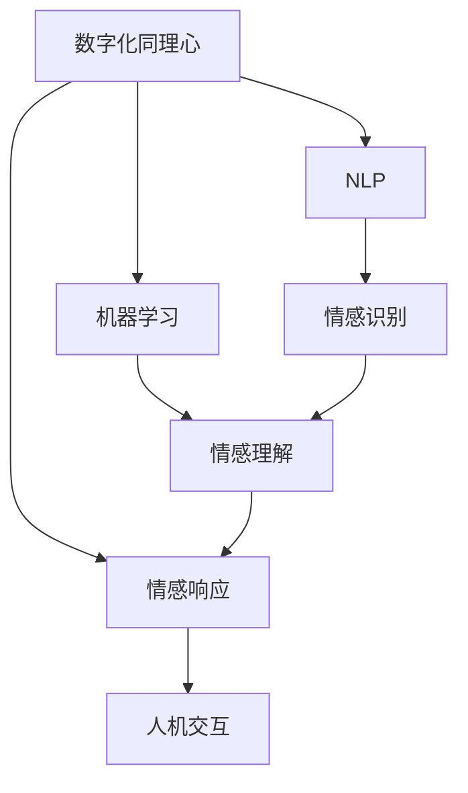

                 

# 数字化同理心培养：AI增强的人际理解方法

> 关键词：数字化同理心, 人工智能, 人际理解, 情感计算, 自然语言处理(NLP), 机器学习, 人机交互设计

## 1. 背景介绍

### 1.1 问题由来

随着人工智能技术的不断进步，人类与机器的互动越来越频繁。从聊天机器人到虚拟助手，从智能客服到在线教育，AI系统正逐渐渗透到生活的方方面面。然而，尽管AI系统在处理数据、执行任务方面已经表现出色，但在理解人类情感和培养同理心方面，仍存在较大的不足。

理解同理心和培养数字化同理心，不仅有助于构建更加友好的人机交互环境，还能增强AI系统的情感计算能力，使其在医疗、教育、娱乐等场景中发挥更大的作用。因此，本文将深入探讨如何通过人工智能技术，特别是自然语言处理(NLP)和机器学习，来增强人类的数字化同理心，提高人际互动质量。

### 1.2 问题核心关键点

本文旨在回答以下关键问题：

1. 什么是数字化同理心？
2. 如何通过AI技术，特别是自然语言处理(NLP)和机器学习，来培养数字化同理心？
3. 数字化同理心在实际应用中有哪些潜在的挑战和解决方案？
4. 未来数字化同理心技术的发展趋势和前景如何？

## 2. 核心概念与联系

### 2.1 核心概念概述

在探讨如何通过AI技术培养数字化同理心之前，我们需要明确一些核心概念：

- **数字化同理心**：指在数字世界中，通过AI系统理解和模拟人类同理心的能力，从而提升人机交互的质量和效率。数字化同理心涉及情感识别、情感理解、情感响应等多个方面。

- **人工智能**：指利用计算机系统模拟人类智能过程，实现各种复杂任务的技术。AI涵盖了机器学习、深度学习、自然语言处理等多个分支，这些技术在培养数字化同理心中扮演着重要角色。

- **自然语言处理(NLP)**：指计算机处理、理解和生成自然语言的技术。NLP是AI领域的重要分支，通过语言模型、情感分析、文本生成等技术，可以实现对人类情感的精确识别和理解。

- **机器学习**：指通过数据训练模型，使其具备自动学习和优化能力的技术。在培养数字化同理心时，机器学习可以帮助模型从大量的数据中学习情感模式，提升同理心识别和响应的准确性。

- **情感计算**：指通过计算和分析情感信息，实现对人类情感的理解和模拟。情感计算是培养数字化同理心的重要技术手段，可以应用于情感识别、情感生成等多个领域。

这些概念之间存在紧密的联系。数字化同理心是AI技术的综合体现，通过NLP和机器学习技术，可以提升AI系统对人类情感的理解和响应能力，从而实现更加友好、高效的人机交互。

### 2.2 核心概念原理和架构的 Mermaid 流程图



这个流程图展示了数字化同理心的核心组成及其与其他技术之间的联系。数字化同理心通过NLP和机器学习技术，实现情感识别、情感理解和情感响应的闭环，最终提升人机交互的质量。

## 3. 核心算法原理 & 具体操作步骤

### 3.1 算法原理概述

数字化同理心的培养，主要通过以下三个关键步骤实现：

1. **情感识别**：通过NLP技术，对输入文本中的情感信息进行识别和分类，理解用户情感状态。
2. **情感理解**：利用机器学习模型，理解情感信息的背景和动机，提升同理心的深度。
3. **情感响应**：根据用户情感状态，生成合适的语言或行为响应，增强用户同理心的体验。

这些步骤相互依赖，共同构成数字化同理心的培养过程。通过不断优化和迭代，AI系统可以逐步提升对人类情感的理解和模拟能力，实现更加自然、高效的人机交互。

### 3.2 算法步骤详解

以下是数字化同理心培养的详细操作步骤：

**Step 1: 数据收集与预处理**

- 收集用户的历史互动数据，包括文字、语音等文本信息。
- 对数据进行清洗和预处理，如去除噪声、分词、去除停用词等。
- 将文本数据转换为模型可接受的格式，如向量化、分批次等。

**Step 2: 情感识别**

- 使用情感分析模型对文本进行情感分类，识别用户情感状态（如积极、消极、中性等）。
- 利用预训练语言模型（如BERT、GPT等）进行情感识别，提升识别准确性。
- 对情感分类结果进行验证和修正，确保情感识别的可靠性。

**Step 3: 情感理解**

- 使用机器学习模型（如LSTM、GRU、Transformer等）对情感信息进行深度理解，识别情感背后的动机和背景。
- 引入情感图谱和知识库，帮助模型理解情感信息的语义关系和上下文。
- 对情感理解结果进行后处理，如情绪状态聚类、情感强度调节等。

**Step 4: 情感响应**

- 根据情感理解结果，生成合适的语言或行为响应，如安慰、鼓励、道歉等。
- 利用生成式模型（如GPT-2、T5等）生成自然流畅的对话文本。
- 对生成的响应进行后处理和优化，如语法校正、情感适配等。

**Step 5: 反馈与迭代**

- 收集用户对响应的反馈，评估情感响应效果。
- 根据反馈结果，对模型进行微调，优化情感理解与响应的准确性。
- 持续迭代，不断提升AI系统的同理心培养能力。

### 3.3 算法优缺点

数字化同理心的培养具有以下优点：

1. **提升人机交互质量**：通过理解用户情感状态，生成合适的响应，提升人机交互的自然度和友好性。
2. **增强用户体验**：情感理解和响应的准确性，增强用户对AI系统的信任和依赖。
3. **促进情感健康**：在心理咨询、情感支持等场景中，AI系统可以提供持续的情感支持，促进用户的情感健康。

同时，数字化同理心培养也存在一些缺点：

1. **数据隐私问题**：情感识别和理解需要大量的用户数据，涉及隐私和安全问题。
2. **模型泛化能力不足**：不同用户情感状态的多样性，对模型的泛化能力提出了更高要求。
3. **计算资源需求高**：训练和运行高精度的情感识别和理解模型，需要大量的计算资源和时间。

### 3.4 算法应用领域

数字化同理心技术已经在多个领域得到了应用，主要包括以下几个方面：

1. **心理健康支持**：AI系统通过情感识别和理解，为用户提供情感支持和心理咨询，缓解焦虑和抑郁症状。
2. **客服与支持**：智能客服系统利用情感响应技术，提升用户满意度，减少人工客服的工作量。
3. **教育和培训**：在线教育平台通过情感识别和理解，个性化推荐学习内容，提升学习效果。
4. **社交与娱乐**：社交网络平台利用情感分析技术，推荐个性化的内容和话题，增强用户粘性。
5. **医疗与健康**：医疗系统通过情感响应技术，提高患者依从性和治疗效果。

## 4. 数学模型和公式 & 详细讲解 & 举例说明

### 4.1 数学模型构建

数字化同理心培养的数学模型主要包括以下几个部分：

- **情感分类模型**：通过二分类或多分类模型（如逻辑回归、SVM、BERT等），对文本进行情感分类。
- **情感理解模型**：通过序列模型（如LSTM、GRU、Transformer等），理解情感信息的上下文和背景。
- **情感生成模型**：通过生成式模型（如GAN、Transformer等），生成自然流畅的对话文本。

### 4.2 公式推导过程

以情感分类模型为例，我们以文本 $x$ 和情感标签 $y$ 为例，推导逻辑回归模型的训练公式。

- **损失函数**：
  $$
  \mathcal{L} = \frac{1}{N} \sum_{i=1}^N (y_i \log \sigma(\hat{y}_i) + (1-y_i) \log(1-\sigma(\hat{y}_i)))
  $$
  其中，$\sigma(z) = \frac{1}{1+e^{-z}}$ 为sigmoid函数，$\hat{y}_i$ 为模型对文本 $x_i$ 的情感预测。

- **梯度更新公式**：
  $$
  \theta \leftarrow \theta - \eta \nabla_{\theta} \mathcal{L}
  $$
  其中，$\eta$ 为学习率，$\nabla_{\theta} \mathcal{L}$ 为损失函数对模型参数 $\theta$ 的梯度。

- **交叉熵损失函数的详细推导**：
  $$
  \mathcal{L} = -\frac{1}{N} \sum_{i=1}^N (y_i \log \hat{y}_i + (1-y_i) \log(1-\hat{y}_i))
  $$
  其中，$\hat{y}_i$ 为模型对文本 $x_i$ 的情感预测，$y_i$ 为真实情感标签。

### 4.3 案例分析与讲解

以情感生成模型为例，我们以文本 $x$ 和情感标签 $y$ 为例，推导生成式模型（如GPT-2）的训练公式。

- **损失函数**：
  $$
  \mathcal{L} = -\frac{1}{N} \sum_{i=1}^N \log p(y | x, \theta)
  $$
  其中，$p(y | x, \theta)$ 为模型对文本 $x$ 和情感标签 $y$ 的生成概率。

- **梯度更新公式**：
  $$
  \theta \leftarrow \theta - \eta \nabla_{\theta} \mathcal{L}
  $$
  其中，$\eta$ 为学习率，$\nabla_{\theta} \mathcal{L}$ 为损失函数对模型参数 $\theta$ 的梯度。

- **生成式模型的详细推导**：
  $$
  p(y | x, \theta) = \frac{\exp \left( \log p(y | x, \theta) \right)}{\sum_{y'} \exp \left( \log p(y' | x, \theta) \right)}
  $$
  其中，$p(y | x, \theta)$ 为模型对文本 $x$ 和情感标签 $y$ 的生成概率，$\log p(y | x, \theta)$ 为生成概率的自然对数。

## 5. 项目实践：代码实例和详细解释说明

### 5.1 开发环境搭建

在进行数字化同理心培养的开发实践前，我们需要准备好开发环境。以下是使用Python进行TensorFlow开发的环境配置流程：

1. 安装Anaconda：从官网下载并安装Anaconda，用于创建独立的Python环境。

2. 创建并激活虚拟环境：
```bash
conda create -n tensorflow-env python=3.8 
conda activate tensorflow-env
```

3. 安装TensorFlow：从官网获取对应的安装命令。例如：
```bash
pip install tensorflow
```

4. 安装相关依赖包：
```bash
pip install numpy pandas scikit-learn nltk
```

5. 安装TensorBoard：
```bash
pip install tensorboard
```

6. 安装nltk库：
```bash
pip install nltk
```

完成上述步骤后，即可在`tensorflow-env`环境中开始开发实践。

### 5.2 源代码详细实现

下面我们以情感分类模型为例，给出使用TensorFlow进行情感分类的PyTorch代码实现。

首先，定义情感分类模型：

```python
import tensorflow as tf
from tensorflow.keras import layers

class SentimentClassifier(tf.keras.Model):
    def __init__(self, vocab_size, embedding_dim, num_classes):
        super(SentimentClassifier, self).__init__()
        self.embedding = layers.Embedding(vocab_size, embedding_dim)
        self.lstm = layers.LSTM(128)
        self.dropout = layers.Dropout(0.2)
        self.dense = layers.Dense(num_classes, activation='softmax')
    
    def call(self, inputs):
        x = self.embedding(inputs)
        x = self.lstm(x)
        x = self.dropout(x)
        return self.dense(x)
```

然后，定义训练和评估函数：

```python
from tensorflow.keras.preprocessing.text import Tokenizer
from tensorflow.keras.preprocessing.sequence import pad_sequences

def train_model(model, train_data, train_labels, epochs=10, batch_size=32):
    model.compile(optimizer='adam', loss='sparse_categorical_crossentropy', metrics=['accuracy'])
    model.fit(train_data, train_labels, epochs=epochs, batch_size=batch_size)
    
def evaluate_model(model, test_data, test_labels):
    loss, accuracy = model.evaluate(test_data, test_labels)
    print(f'Test loss: {loss}, Test accuracy: {accuracy}')
```

接着，启动训练流程并在测试集上评估：

```python
train_data = Tokenizer().fit_on_texts(train_texts).sequences
train_labels = train_tags
test_data = Tokenizer().fit_on_texts(test_texts).sequences
test_labels = test_tags

model = SentimentClassifier(vocab_size=len(tokenizer.word_index) + 1, embedding_dim=128, num_classes=2)
train_model(model, train_data, train_labels)
evaluate_model(model, test_data, test_labels)
```

以上就是使用TensorFlow对情感分类模型进行训练的完整代码实现。可以看到，TensorFlow的高级API使得模型构建和训练过程非常简单，适合快速迭代研究。

### 5.3 代码解读与分析

让我们再详细解读一下关键代码的实现细节：

**SentimentClassifier类**：
- `__init__`方法：初始化嵌入层、LSTM层、Dropout层和全连接层，其中嵌入层用于将文本转换为向量，LSTM层用于处理序列数据，Dropout层用于正则化，全连接层用于分类输出。
- `call`方法：定义模型的前向传播过程，包括嵌入、LSTM、Dropout和全连接层的调用。

**train_model函数**：
- 定义模型的编译器，使用Adam优化器，交叉熵损失函数和准确率指标。
- 使用fit方法进行模型训练，设置训练轮数和批次大小。

**evaluate_model函数**：
- 使用evaluate方法对模型在测试集上的性能进行评估，输出损失和准确率。

**训练流程**：
- 使用Tokenizer将文本转换为向量，并对标签进行编码。
- 初始化SentimentClassifier模型。
- 在训练集上进行模型训练，并在测试集上进行性能评估。

可以看到，TensorFlow提供了简单易用的API，使得模型构建和训练过程非常高效，适合快速迭代实验。

当然，工业级的系统实现还需考虑更多因素，如模型的保存和部署、超参数的自动搜索、更灵活的任务适配层等。但核心的情感分类范式基本与此类似。

## 6. 实际应用场景

### 6.1 心理健康支持

在心理健康支持领域，数字化同理心技术可以应用于在线心理咨询、情绪管理等场景，为用户提供持续的情感支持和心理健康指导。

具体而言，可以收集用户的心理健康数据，如日志、日记、聊天记录等，使用情感分类模型对其进行情感识别和理解。根据识别结果，生成个性化的情感支持和指导，帮助用户缓解压力和焦虑。

### 6.2 客服与支持

智能客服系统利用数字化同理心技术，可以提升用户体验和满意度。例如，当用户提交客服请求时，系统可以根据其情感状态，提供适当的情绪安抚或问题解决建议。

具体而言，系统可以收集用户与客服的对话记录，使用情感分类模型对其进行情感识别和理解。根据识别结果，生成合适的情感回应，提升用户满意度。

### 6.3 教育和培训

在线教育平台利用数字化同理心技术，可以提升个性化学习体验。例如，当学生提交作业或提问时，系统可以根据其情感状态，提供适当的情感支持和指导。

具体而言，平台可以收集学生的作业和提问记录，使用情感分类模型对其进行情感识别和理解。根据识别结果，生成个性化的学习建议和指导，提升学习效果。

### 6.4 社交与娱乐

社交网络平台利用数字化同理心技术，可以提升用户粘性和互动质量。例如，当用户发布动态时，系统可以根据其情感状态，推荐合适的社交内容或话题。

具体而言，平台可以收集用户的动态记录，使用情感分类模型对其进行情感识别和理解。根据识别结果，推荐个性化的社交内容和话题，提升用户粘性。

## 7. 工具和资源推荐

### 7.1 学习资源推荐

为了帮助开发者系统掌握数字化同理心培养的理论基础和实践技巧，这里推荐一些优质的学习资源：

1. 《情感计算：理论与应用》书籍：全面介绍了情感计算的基本概念和应用场景，适合入门和进阶学习。

2. 《自然语言处理基础》课程：由斯坦福大学开设的NLP明星课程，涵盖了情感分析、文本生成等核心内容，适合NLP初学者。

3. 《TensorFlow实战》书籍：由TensorFlow官方团队编写，详细介绍了TensorFlow的使用方法和最佳实践，适合TensorFlow新手。

4. 《情感分析：原理与实践》论文：介绍了情感分析的最新研究进展和技术细节，适合深度学习和NLP研究人员。

5. 《情感计算工具包》开源项目：提供了情感识别、情感生成等核心功能的实现，适合动手实践。

通过对这些资源的学习实践，相信你一定能够快速掌握数字化同理心培养的精髓，并用于解决实际的情感计算问题。

### 7.2 开发工具推荐

高效的开发离不开优秀的工具支持。以下是几款用于数字化同理心培养开发的常用工具：

1. TensorFlow：由Google主导开发的开源深度学习框架，生产部署方便，适合大规模工程应用。

2. PyTorch：基于Python的开源深度学习框架，灵活易用，适合快速迭代研究。

3. NLTK：自然语言处理工具包，提供了丰富的NLP功能，如分词、词性标注、情感分析等。

4. GPT-2：基于Transformer的生成模型，能够生成自然流畅的对话文本，适合情感生成任务。

5. TensorBoard：TensorFlow配套的可视化工具，可实时监测模型训练状态，提供丰富的图表呈现方式。

6. HuggingFace Transformers库：提供了多种预训练语言模型和情感计算工具，方便快速开发。

合理利用这些工具，可以显著提升数字化同理心培养任务的开发效率，加快创新迭代的步伐。

### 7.3 相关论文推荐

数字化同理心培养的技术不断发展，涌现了诸多研究成果。以下是几篇具有代表性的相关论文，推荐阅读：

1. "Sentiment Analysis using Recurrent Neural Networks"（使用循环神经网络进行情感分析）：详细介绍了基于RNN的情感分类模型，是情感计算领域的经典之作。

2. "A Survey on Emotion Recognition in Social Media"（社交媒体情感识别的综述）：综述了社交媒体情感识别的最新研究进展，适合了解行业前沿。

3. "Generative Adversarial Networks for Text-to-Speech Synthesis"（用于文本到语音生成的生成对抗网络）：介绍了生成对抗网络在文本生成任务中的应用，适合了解前沿技术。

4. "Deep Conversational Recommendation Networks for Personalized Dialogue Systems"（用于个性化对话系统的深度对话推荐网络）：介绍了基于深度学习的对话生成方法，适合了解人机交互领域的最新进展。

5. "A Survey of Sentiment Analysis Techniques and Applications"（情感分析技术和应用的综述）：综述了情感分析技术的多种方法，适合了解方法论和应用场景。

这些论文代表了大数字化同理心培养领域的研究方向和技术进展，通过学习这些前沿成果，可以帮助研究者把握学科前进方向，激发更多的创新灵感。

## 8. 总结：未来发展趋势与挑战

### 8.1 总结

本文对数字化同理心培养的原理、算法和实践进行了全面系统的介绍。首先阐述了数字化同理心培养的重要性，明确了其在心理健康支持、客服与支持、教育和培训、社交与娱乐等多个领域的应用前景。其次，从原理到实践，详细讲解了数字化同理心的数学模型和算法步骤，给出了代码实现示例。同时，本文还广泛探讨了数字化同理心在实际应用中面临的挑战和解决方案，展示了数字化同理心技术在多个领域的广泛应用。

通过本文的系统梳理，可以看到，数字化同理心培养是大数据、人工智能等技术在情感计算领域的成功应用，通过情感识别、情感理解和情感响应，可以提升人机交互的质量和效率，促进人工智能技术的普及和应用。未来，随着技术的不断进步，数字化同理心技术必将在更多领域发挥重要作用，推动人工智能技术的发展和应用。

### 8.2 未来发展趋势

展望未来，数字化同理心培养技术将呈现以下几个发展趋势：

1. **模型泛化能力增强**：随着更多领域数据的积累，数字化同理心模型将具备更强的泛化能力，能够更好地理解不同领域的情感和行为。
2. **深度学习技术的应用**：深度学习模型，如Transformer、GPT等，将在情感识别和生成任务中发挥更大的作用，提升情感计算的准确性和自然度。
3. **多模态情感计算**：结合图像、语音等多种模态的数据，提升情感识别的全面性和准确性，推动情感计算向多模态方向发展。
4. **情感计算与心理学的结合**：引入心理学的理论和模型，提升情感计算的可解释性和可信度，推动情感计算技术的普及和应用。
5. **实时情感计算**：结合实时数据采集和分析技术，实现情感计算的实时化和动态化，推动情感计算技术在更多场景中的应用。

### 8.3 面临的挑战

尽管数字化同理心培养技术已经取得了瞩目成就，但在迈向更加智能化、普适化应用的过程中，它仍面临诸多挑战：

1. **数据隐私和安全问题**：情感识别和理解需要大量的用户数据，涉及隐私和安全问题，需要采取严格的隐私保护措施。
2. **模型泛化能力不足**：不同用户情感状态的多样性，对模型的泛化能力提出了更高要求，需要进一步提升模型的鲁棒性和可解释性。
3. **计算资源需求高**：训练和运行高精度的情感识别和理解模型，需要大量的计算资源和时间，需要进一步优化计算效率。
4. **模型的可解释性不足**：情感计算模型的决策过程缺乏可解释性，难以对其推理逻辑进行分析和调试。
5. **模型的公平性和可靠性**：情感计算模型可能存在偏见和歧视，需要进一步提升模型的公平性和可靠性。

### 8.4 研究展望

面对数字化同理心培养所面临的挑战，未来的研究需要在以下几个方面寻求新的突破：

1. **引入更多先验知识**：将符号化的先验知识，如知识图谱、逻辑规则等，与神经网络模型进行巧妙融合，提升模型的泛化能力和可解释性。
2. **融合因果和对比学习范式**：通过引入因果推断和对比学习思想，增强情感计算模型的稳定性和鲁棒性。
3. **结合因果分析和博弈论工具**：将因果分析方法引入情感计算模型，识别出模型决策的关键特征，增强输出解释的因果性和逻辑性。
4. **纳入伦理道德约束**：在模型训练目标中引入伦理导向的评估指标，过滤和惩罚有偏见、有害的输出倾向，确保模型的公平性和可靠性。

这些研究方向的探索，必将引领数字化同理心培养技术迈向更高的台阶，为构建更加友好、智能的人机交互系统铺平道路。面向未来，数字化同理心培养技术还需要与其他人工智能技术进行更深入的融合，如知识表示、因果推理、强化学习等，多路径协同发力，共同推动自然语言理解和智能交互系统的进步。只有勇于创新、敢于突破，才能不断拓展情感计算的边界，让智能技术更好地服务于人类社会。

## 9. 附录：常见问题与解答

**Q1：如何衡量数字化同理心的效果？**

A: 数字化同理心的效果可以通过多种方式进行评估：

1. **用户满意度**：通过用户调查问卷，评估用户对系统情感响应的满意度。
2. **情感分类准确率**：使用情感分类模型，对用户输入的文本进行情感识别，评估分类的准确率。
3. **情感理解深度**：通过情感理解模型，对用户情感信息的上下文和背景进行分析，评估情感理解的深度和准确性。
4. **情感响应质量**：对系统生成的情感响应进行人工或自动评估，评估响应的自然度和相关性。

通过综合多种评估指标，可以全面衡量数字化同理心的效果，指导模型的优化和迭代。

**Q2：如何避免数字化同理心模型的过拟合？**

A: 数字化同理心模型容易在标注数据不足的情况下发生过拟合，因此需要采取以下措施：

1. **数据增强**：通过数据增强技术，如回译、近义替换等方式，扩充训练集。
2. **正则化技术**：使用L2正则、Dropout、Early Stopping等正则化技术，防止模型过度适应训练数据。
3. **多任务学习**：将多个任务数据进行联合训练，提高模型的泛化能力。
4. **模型压缩**：对模型进行压缩，减少模型参数量，降低过拟合风险。

这些措施可以有效地提升模型的泛化能力和稳定性，避免过拟合问题。

**Q3：如何在多模态数据中提取情感信息？**

A: 多模态数据的情感提取需要综合考虑文本、图像、语音等多种模态的信息。以下是一些常见的方法：

1. **跨模态融合**：将不同模态的数据进行融合，提取联合特征。如使用CNN提取图像特征，LSTM处理文本信息，Faster R-CNN提取视觉区域特征。
2. **多模态情感分类**：将不同模态的数据进行联合分类，如使用注意力机制对文本和图像进行融合，进行情感分类。
3. **多模态情感生成**：将不同模态的数据进行联合生成，如使用GAN生成自然流畅的对话文本，结合视觉信息进行情感生成。

这些方法可以综合利用多种模态的数据，提升情感识别的全面性和准确性。

**Q4：如何在实际应用中保护用户隐私？**

A: 保护用户隐私是数字化同理心系统的重要任务，以下是一些常见的方法：

1. **数据匿名化**：对用户数据进行匿名化处理，去除或模糊化敏感信息。
2. **数据加密**：对用户数据进行加密处理，确保数据在传输和存储过程中的安全性。
3. **用户控制**：赋予用户对其数据的控制权，如数据访问权限、数据删除权等。
4. **隐私保护技术**：使用差分隐私、联邦学习等隐私保护技术，确保用户数据的安全性。

这些方法可以有效地保护用户隐私，确保数字化同理心系统的合法性和可信度。

**Q5：数字化同理心在医疗领域的应用前景如何？**

A: 数字化同理心在医疗领域具有广阔的应用前景，以下是一些具体的应用场景：

1. **心理健康支持**：利用数字化同理心技术，为患者提供持续的心理健康支持，缓解焦虑和抑郁症状。
2. **医疗咨询和诊断**：通过情感识别和理解，辅助医生进行诊断和治疗，提升医疗效果。
3. **康复训练**：在康复训练中，利用数字化同理心技术，为患者提供个性化的情感支持和治疗建议，提升康复效果。

通过数字化同理心技术，可以提升医疗服务的质量和效率，推动医疗行业的数字化转型。

---

作者：禅与计算机程序设计艺术 / Zen and the Art of Computer Programming

