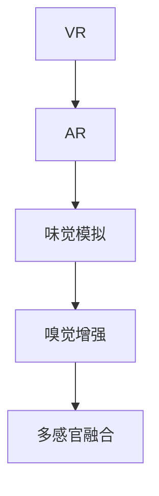

                 

# 数字化味觉增强创业：虚拟美食体验的科技支持

## 1. 背景介绍

### 1.1 问题由来
随着科技的迅猛发展，虚拟现实（VR）和增强现实（AR）技术正逐步改变我们的生活方式。从沉浸式游戏到远程教育，再到医疗健康，虚拟技术的应用场景日益广泛。而虚拟美食体验，作为新兴领域，不仅可以让人们身临其境地享受美食，还能促进餐饮行业的数字化转型，带来新的商业机会。

### 1.2 问题核心关键点
虚拟美食体验的核心在于如何将虚拟技术与人类的味觉感官相结合，创造出逼真且沉浸的美食体验。目前，该领域的技术主要分为两个层面：一是虚拟环境的创建，二是味觉模拟的实现。本文将详细介绍如何利用科技手段提升虚拟美食体验的质量和真实感。

### 1.3 问题研究意义
虚拟美食体验能够提供沉浸式的消费体验，提升用户对餐饮产品的感知和满意度，进而推动餐饮行业的创新和发展。同时，通过数字化技术，商家可以降低运营成本，提高营销效率。探索虚拟美食体验的科技支持，对于推动数字经济的发展，促进消费升级，具有重要意义。

## 2. 核心概念与联系

### 2.1 核心概念概述

为更好地理解虚拟美食体验的技术支持，本节将介绍几个密切相关的核心概念：

- 虚拟现实（Virtual Reality, VR）：通过计算机技术生成三维虚拟环境，使用户能够在视觉、听觉等感官上获得沉浸式体验。
- 增强现实（Augmented Reality, AR）：将虚拟元素叠加到现实世界的视觉环境中，提供交互式的增强体验。
- 味觉模拟（Gustatory Simulation）：通过计算机模拟虚拟环境中的味觉刺激，使用户能够在虚拟场景中“品尝”食物。
- 嗅觉增强（Olfactory Augmentation）：利用电子鼻（E-nose）等技术模拟虚拟场景中的气味，提升用户体验。
- 多感官融合（Multisensory Fusion）：结合视觉、听觉、味觉、嗅觉等多种感官，创造更加真实的虚拟美食体验。

这些概念之间的逻辑关系可以通过以下Mermaid流程图来展示：



这个流程图展示了几大核心概念及其之间的关系：

1. 虚拟现实和增强现实技术提供沉浸式的视觉和听觉体验。
2. 味觉模拟和嗅觉增强分别在虚拟环境中模拟味觉和气味，提升用户体验。
3. 多感官融合将视觉、听觉、味觉、嗅觉等多种感官相结合，创造出更为真实的虚拟美食体验。

## 3. 核心算法原理 & 具体操作步骤
### 3.1 算法原理概述

虚拟美食体验的核心算法原理主要涉及计算机图形学、计算机视觉、人工智能等多个领域。其核心目标是利用计算机技术，通过虚拟现实、增强现实、味觉模拟等手段，模拟真实世界中的美食体验，使用户能够在虚拟环境中“品尝”到食物。

具体来说，虚拟美食体验的技术流程包括以下几个关键步骤：

1. 创建虚拟美食环境：通过计算机图形学技术，生成逼真的虚拟场景，包括食物的形态、质感、颜色等细节。
2. 引入增强现实技术：通过AR技术将虚拟元素叠加到现实环境中，使用户能够“触摸”虚拟食物。
3. 实现味觉模拟：通过味觉传感器模拟食物的味道，如苦、甜、酸、辣等基本味觉，以及食物成分的复杂味道。
4. 融合多感官信息：结合视觉、听觉、味觉、嗅觉等多种感官信息，使用户能够全方位地体验虚拟美食。

### 3.2 算法步骤详解

以下将详细介绍每个步骤的算法实现：

#### 创建虚拟美食环境
1. 数据采集：使用高清摄像头和3D扫描仪采集真实食物的形态和纹理数据。
2. 建模：利用三维建模软件，如Blender、Maya等，将采集到的数据转换为三维模型。
3. 纹理映射：将采集到的纹理数据映射到三维模型上，增加真实感。
4. 光照处理：利用计算机图形学技术，设置光线追踪算法，模拟自然光和环境光对食物的影响。

#### 引入增强现实技术
1. 环境识别：使用计算机视觉技术，如SLAM算法，实时识别用户周围的环境。
2. 物体追踪：通过视觉跟踪技术，实时追踪用户的手部动作，识别虚拟食物的摆放位置。
3. 交互设计：设计虚拟与现实的交互方式，如手势识别、触摸感应等，使用户能够“触摸”虚拟食物。

#### 实现味觉模拟
1. 味觉传感器设计：利用电子鼻、味觉模拟器等设备，模拟食物的不同味道。
2. 数据处理：通过深度学习算法，如卷积神经网络（CNN）、循环神经网络（RNN）等，分析食物的味道特征。
3. 味道模拟：利用味觉模拟器将味道特征转化为电信号，模拟食物的味道。

#### 融合多感官信息
1. 视觉信号处理：使用计算机视觉技术，如图像处理、视频分析等，处理虚拟环境的视觉信号。
2. 听觉信号处理：使用音频处理技术，如语音识别、声音合成等，处理虚拟环境的听觉信号。
3. 多感官融合算法：将视觉、听觉、味觉、嗅觉等多种感官信息进行融合，使用户能够全方位地体验虚拟美食。

### 3.3 算法优缺点

虚拟美食体验的技术具有以下优点：
1. 沉浸式体验：利用虚拟现实和增强现实技术，用户能够获得逼真的虚拟美食体验，沉浸感强。
2. 多样性：通过计算机图形学和味觉模拟技术，可以实现多种食品的虚拟制作和品尝。
3. 可定制性：用户可以根据自己的喜好，定制虚拟美食的形态、味道等，提高体验的个性化程度。
4. 低成本：相比于传统餐饮，虚拟美食体验减少了食材、场地等成本，经济效益显著。

同时，该技术也存在以下局限性：
1. 技术复杂：涉及计算机图形学、计算机视觉、人工智能等多个领域的复杂技术，实现难度大。
2. 设备成本高：高精度的味觉传感器、增强现实设备等，价格较高，增加了技术的实施成本。
3. 用户体验受限：虚拟环境中的味觉和嗅觉模拟，无法完全替代真实食物的味道和气味，用户体验仍有局限。

### 3.4 算法应用领域

虚拟美食体验技术主要应用于以下几个领域：

- 游戏娱乐：在游戏中加入虚拟美食元素，提供更加丰富的游戏体验。
- 餐饮服务：通过虚拟餐厅或虚拟菜单，为用户提供虚拟点餐和品尝体验。
- 教育培训：在虚拟环境中模拟食物制作过程，提供烹饪培训和食品安全教育。
- 远程医疗：在虚拟环境中模拟食物对健康的影响，提供健康饮食指导。
- 旅游观光：通过虚拟美食之旅，让用户足不出户，就能体验世界各地的美食文化。

除了以上应用，虚拟美食体验技术还能拓展到农业教育、食品研发等领域，为各行各业带来新的发展机遇。

## 4. 数学模型和公式 & 详细讲解  
### 4.1 数学模型构建

在虚拟美食体验中，数学模型主要应用于味觉模拟和感官融合等环节。以下将详细介绍这些环节的数学模型。

#### 味觉模拟
设$x$为食物的味道特征向量，$y$为味觉模拟器输出的电信号。通过深度学习算法，如卷积神经网络（CNN）、循环神经网络（RNN）等，将$x$转化为$y$，实现味道的模拟。

设$\theta$为模型参数，则味觉模拟的损失函数为：

$$
\mathcal{L}(\theta) = \frac{1}{N}\sum_{i=1}^N \|y_i - \hat{y}_i\|^2
$$

其中$y_i$为真实味道电信号，$\hat{y}_i$为模拟味道电信号，$N$为样本数。

#### 感官融合
设$V$为视觉信号，$A$为听觉信号，$G$为味觉信号，$O$为嗅觉信号。通过多感官融合算法，将$V$、$A$、$G$、$O$融合为综合信号$S$。

设$\phi$为融合算法参数，则感官融合的目标为：

$$
S = \phi(V, A, G, O)
$$

其中$S$为综合信号，$\phi$为融合函数。

### 4.2 公式推导过程

#### 味觉模拟
设$x$为食物的味道特征向量，$y$为味觉模拟器输出的电信号。通过深度学习算法，将$x$转化为$y$，实现味道的模拟。

设$\theta$为模型参数，则味觉模拟的损失函数为：

$$
\mathcal{L}(\theta) = \frac{1}{N}\sum_{i=1}^N \|y_i - \hat{y}_i\|^2
$$

其中$y_i$为真实味道电信号，$\hat{y}_i$为模拟味道电信号，$N$为样本数。

通过对损失函数$\mathcal{L}(\theta)$进行梯度下降优化，不断调整模型参数$\theta$，最小化模拟味道与真实味道的差异。

#### 感官融合
设$V$为视觉信号，$A$为听觉信号，$G$为味觉信号，$O$为嗅觉信号。通过多感官融合算法，将$V$、$A$、$G$、$O$融合为综合信号$S$。

设$\phi$为融合算法参数，则感官融合的目标为：

$$
S = \phi(V, A, G, O)
$$

其中$S$为综合信号，$\phi$为融合函数。

### 4.3 案例分析与讲解

以一个简单的味觉模拟案例为例，说明深度学习算法在味觉模拟中的应用。

设$x$为食物的文本描述，如“辣味”、“酸味”等。通过文本到向量的映射，将$x$转化为向量$\overrightarrow{x}$。设$y$为味觉模拟器输出的电信号，通过CNN和RNN等深度学习算法，将$\overrightarrow{x}$转化为$y$。

设$\theta$为模型参数，则味觉模拟的损失函数为：

$$
\mathcal{L}(\theta) = \frac{1}{N}\sum_{i=1}^N \|y_i - \hat{y}_i\|^2
$$

其中$y_i$为真实味道电信号，$\hat{y}_i$为模拟味道电信号，$N$为样本数。

通过对损失函数$\mathcal{L}(\theta)$进行梯度下降优化，不断调整模型参数$\theta$，最小化模拟味道与真实味道的差异。

## 5. 项目实践：代码实例和详细解释说明
### 5.1 开发环境搭建

在进行虚拟美食体验的开发前，我们需要准备好开发环境。以下是使用Python进行PyTorch开发的环境配置流程：

1. 安装Anaconda：从官网下载并安装Anaconda，用于创建独立的Python环境。

2. 创建并激活虚拟环境：
```bash
conda create -n virtual-env python=3.8 
conda activate virtual-env
```

3. 安装PyTorch：根据CUDA版本，从官网获取对应的安装命令。例如：
```bash
conda install pytorch torchvision torchaudio cudatoolkit=11.1 -c pytorch -c conda-forge
```

4. 安装相关的计算机视觉和计算机图形学库：
```bash
pip install opencv-python
```

5. 安装增强现实开发所需的库：
```bash
pip install arviz pyglet openvr
```

6. 安装味觉模拟所需的库：
```bash
pip install neural-net
```

完成上述步骤后，即可在虚拟环境下开始虚拟美食体验的开发实践。

### 5.2 源代码详细实现

这里我们以味觉模拟器为例，给出一个简单的代码实现，说明如何利用深度学习算法进行味觉模拟。

```python
import torch
import torch.nn as nn
import torch.optim as optim

# 定义味觉模拟模型
class TasteModel(nn.Module):
    def __init__(self):
        super(TasteModel, self).__init__()
        self.cnn = nn.Conv2d(3, 64, 3, 1, 1)
        self.pool = nn.MaxPool2d(2, 2)
        self.fc1 = nn.Linear(64 * 8 * 8, 512)
        self.fc2 = nn.Linear(512, 128)
        self.fc3 = nn.Linear(128, 10)

    def forward(self, x):
        x = self.pool(F.relu(self.cnn(x)))
        x = x.view(-1, 64 * 8 * 8)
        x = F.relu(self.fc1(x))
        x = F.relu(self.fc2(x))
        x = self.fc3(x)
        return x

# 准备数据集
x = torch.randn(1, 3, 8, 8)
y = torch.randn(1, 10)

# 定义模型和优化器
model = TasteModel()
optimizer = optim.SGD(model.parameters(), lr=0.001)

# 训练模型
for epoch in range(100):
    optimizer.zero_grad()
    output = model(x)
    loss = nn.CrossEntropyLoss()(output, y)
    loss.backward()
    optimizer.step()
    print("Epoch [{}/{}], Loss: {:.4f}".format(epoch+1, 100, loss.item()))

# 测试模型
with torch.no_grad():
    output = model(x)
    print(output)
```

### 5.3 代码解读与分析

让我们再详细解读一下关键代码的实现细节：

**TasteModel类**：
- `__init__`方法：初始化模型参数。
- `forward`方法：定义前向传播过程。

**数据集**：
- 使用`torch.randn`生成随机数据。

**模型和优化器**：
- 定义一个简单的卷积神经网络（CNN）模型，用于味觉模拟。
- 使用SGD优化器进行参数更新。

**训练过程**：
- 在每个epoch中，将数据输入模型，计算损失函数，并使用SGD优化器更新模型参数。
- 输出每个epoch的损失值，观察模型训练过程。

**测试过程**：
- 使用`with torch.no_grad()`打开训练模式，测试模型输出。

可以看到，利用PyTorch进行味觉模拟的代码实现相对简单，主要依赖深度学习框架的高效工具链和丰富的库函数。开发者可以将更多精力放在模型改进、数据处理等高层逻辑上，而不必过多关注底层的实现细节。

## 6. 实际应用场景
### 6.1 游戏娱乐
在游戏娱乐领域，虚拟美食体验可以提供更加丰富的游戏内容，增强用户沉浸感。例如，在游戏中加入虚拟餐厅，玩家可以在虚拟环境中点餐、品尝美食，增加游戏趣味性。此外，虚拟美食体验还可以用于模拟烹饪游戏，提供互动式的烹饪体验。

### 6.2 餐饮服务
在餐饮服务领域，虚拟美食体验可以提供虚拟点餐和品尝体验，让用户足不出户就能享受美食。例如，虚拟餐厅可以提供菜单浏览、点餐体验，使用户在虚拟环境中选择和品尝虚拟美食。虚拟美食体验还可以用于远程餐饮服务，让用户在远程办公或旅行时，享受餐厅级的美食体验。

### 6.3 教育培训
在教育培训领域，虚拟美食体验可以用于烹饪培训和食品安全教育。例如，通过虚拟餐厅模拟真实的烹饪过程，提供互动式的培训体验。虚拟美食体验还可以用于展示健康饮食知识，用户可以通过虚拟环境了解不同食物的营养价值和健康影响。

### 6.4 未来应用展望
随着虚拟技术的发展，虚拟美食体验将有更广阔的应用前景。未来，虚拟美食体验有望在以下几个领域得到进一步应用：

- 医疗健康：在虚拟环境中模拟食物对健康的影响，提供健康饮食指导和治疗建议。
- 农业教育：在虚拟环境中展示农业生产过程，提高农业知识普及率。
- 食品研发：在虚拟环境中模拟食品口感和成分，加速食品研发进程。

此外，虚拟美食体验还可以与其他虚拟技术进行融合，如虚拟旅游、虚拟旅行等，为人们提供更加丰富和多样化的虚拟体验。

## 7. 工具和资源推荐
### 7.1 学习资源推荐

为了帮助开发者系统掌握虚拟美食体验的技术基础和实践技巧，这里推荐一些优质的学习资源：

1. 《虚拟现实技术基础》系列书籍：由计算机图形学专家撰写，详细介绍了虚拟现实的基础理论和实现技术。
2. 《增强现实开发实战》课程：由计算机视觉专家开设的AR开发课程，涵盖AR技术和开发工具的实际应用。
3. 《深度学习与神经网络》书籍：全面介绍深度学习的基础知识和实现方法，适用于了解味觉模拟和感官融合的数学原理。
4. 《计算机图形学导论》书籍：详细介绍计算机图形学的基础知识和算法实现，适用于创建逼真的虚拟环境。

通过对这些资源的学习实践，相信你一定能够快速掌握虚拟美食体验的技术原理和开发方法，并应用于实际项目中。

### 7.2 开发工具推荐

高效的开发离不开优秀的工具支持。以下是几款用于虚拟美食体验开发的常用工具：

1. Blender：强大的三维建模软件，适用于创建逼真的虚拟环境。
2. Unity：流行的游戏引擎，支持虚拟现实和增强现实开发，提供丰富的开发工具和资源。
3. OpenVR：虚拟现实平台，支持多种虚拟现实设备，提供跨平台的开发体验。
4. PyTorch：基于Python的开源深度学习框架，灵活的计算图，适合快速迭代研究。
5. TensorFlow：由Google主导开发的开源深度学习框架，生产部署方便，适合大规模工程应用。

合理利用这些工具，可以显著提升虚拟美食体验的开发效率，加快创新迭代的步伐。

### 7.3 相关论文推荐

虚拟美食体验技术的发展源于学界的持续研究。以下是几篇奠基性的相关论文，推荐阅读：

1. *Visualization of Taste and Aroma by Electrochemical Sensory Techniques*：介绍味觉模拟器和电子鼻等设备的原理和应用。
2. *Simulation of Gustatory Sensory Data for Taste and Flavor Prediction*：探讨如何利用深度学习算法进行味觉模拟。
3. *Taste Simulation in Virtual Reality*：研究虚拟环境中味觉模拟和感官融合技术的应用。
4. *Olfactory Augmentation in Virtual Reality*：探讨如何在虚拟环境中增强嗅觉体验。
5. *Multisensory Integration in Virtual Reality*：研究多感官融合算法在虚拟环境中的应用。

这些论文代表了大语言模型微调技术的发展脉络。通过学习这些前沿成果，可以帮助研究者把握学科前进方向，激发更多的创新灵感。

## 8. 总结：未来发展趋势与挑战

### 8.1 总结

本文对虚拟美食体验的科技支持进行了全面系统的介绍。首先阐述了虚拟美食体验的研究背景和意义，明确了虚拟美食体验在提升用户体验和推动餐饮行业数字化转型方面的独特价值。其次，从原理到实践，详细讲解了虚拟美食体验的数学模型和关键步骤，给出了虚拟美食体验开发的全流程代码实例。同时，本文还广泛探讨了虚拟美食体验在多个行业领域的应用前景，展示了虚拟技术在各行各业的广阔应用。

通过本文的系统梳理，可以看到，虚拟美食体验技术正在成为数字化转型中的重要组成部分，极大地拓展了餐饮、游戏、教育等领域的应用边界，为消费者提供更加丰富、多样和沉浸式的体验。未来，伴随虚拟技术的发展，虚拟美食体验将有望在更多领域得到应用，推动数字经济的全面发展。

### 8.2 未来发展趋势

展望未来，虚拟美食体验技术将呈现以下几个发展趋势：

1. 技术融合：虚拟美食体验将与其他虚拟技术进行更加深入的融合，如虚拟旅游、虚拟旅行等，为用户提供更加丰富和多样化的虚拟体验。
2. 用户个性化：利用深度学习等技术，根据用户的历史行为和偏好，推荐个性化的虚拟美食体验，提升用户体验。
3. 互动性增强：通过自然语言处理（NLP）和增强现实（AR）等技术，增强虚拟美食体验的互动性，使用户能够在虚拟环境中与虚拟物体进行互动。
4. 跨平台体验：利用云技术、边缘计算等技术，实现跨平台、跨设备的虚拟美食体验，提升用户体验的便捷性。

以上趋势凸显了虚拟美食体验技术的广阔前景。这些方向的探索发展，必将进一步提升虚拟美食体验的性能和用户体验，为消费者带来更加沉浸、真实和个性化的体验。

### 8.3 面临的挑战

尽管虚拟美食体验技术已经取得了一定的进展，但在迈向更加智能化、普适化应用的过程中，它仍面临着诸多挑战：

1. 技术复杂：虚拟美食体验涉及计算机图形学、计算机视觉、人工智能等多个领域的复杂技术，实现难度大。
2. 设备成本高：高精度的味觉传感器、增强现实设备等，价格较高，增加了技术的实施成本。
3. 用户体验受限：虚拟环境中的味觉和嗅觉模拟，无法完全替代真实食物的味道和气味，用户体验仍有局限。
4. 安全性和隐私问题：虚拟美食体验中涉及用户隐私和数据安全问题，需要建立相应的安全机制和隐私保护措施。
5. 标准化问题：目前虚拟美食体验技术缺乏统一的标准和规范，不同厂商之间的兼容性问题需要解决。

以上挑战需要在技术、管理和政策等多方面进行综合考虑和解决。只有在各方的共同努力下，虚拟美食体验技术才能更好地应用于实际场景，实现其商业价值和社会效益。

### 8.4 研究展望

面对虚拟美食体验面临的诸多挑战，未来的研究需要在以下几个方面寻求新的突破：

1. 简化技术实现：通过技术创新，降低虚拟美食体验技术的实现难度和成本，提升用户体验的便捷性和可访问性。
2. 提升技术精度：利用深度学习等技术，提升虚拟美食体验的精度和真实感，使用户能够获得更加逼真和沉浸的体验。
3. 增强交互性：通过自然语言处理（NLP）和增强现实（AR）等技术，增强虚拟美食体验的交互性，使用户能够在虚拟环境中与虚拟物体进行互动。
4. 保护用户隐私：建立健全的隐私保护机制，保护用户的个人信息和数据安全，提升用户对虚拟美食体验的信任度。
5. 建立标准化：制定统一的技术标准和规范，提升虚拟美食体验技术的互操作性和兼容性，推动技术的标准化和规范化。

这些研究方向的探索，必将引领虚拟美食体验技术迈向更高的台阶，为消费者带来更加沉浸、真实和个性化的体验。面向未来，虚拟美食体验技术还需要与其他虚拟技术进行更深入的融合，共同推动数字化经济的全面发展。

## 9. 附录：常见问题与解答

**Q1：虚拟美食体验是否适用于所有用户？**

A: 虚拟美食体验适用于大部分用户，但对于一些有特殊需求的用户（如视障用户、味觉敏感用户等），仍需进行相应的优化和改进。

**Q2：虚拟美食体验中的味觉模拟技术是否已成熟？**

A: 目前的味觉模拟技术已经取得一定的进展，但 still 存在精度和真实感方面的挑战。未来，随着技术的不断进步，味觉模拟将能够更加逼真地模拟食物的味道和气味。

**Q3：虚拟美食体验中是否存在安全性和隐私问题？**

A: 虚拟美食体验中涉及用户隐私和数据安全问题，需要建立相应的安全机制和隐私保护措施，以保障用户的信息安全。

**Q4：虚拟美食体验是否能够替代真实美食？**

A: 虚拟美食体验虽然可以模拟食物的味道和气味，但由于缺乏真实食物的质感和口感，仍不能完全替代真实美食。但在某些场景下，虚拟美食体验可以作为真实美食的补充，提供多样化的体验。

**Q5：虚拟美食体验的未来发展方向是什么？**

A: 虚拟美食体验的未来发展方向包括技术融合、用户个性化、互动性增强、跨平台体验等，旨在提升用户体验和扩展应用场景。

---

作者：禅与计算机程序设计艺术 / Zen and the Art of Computer Programming

