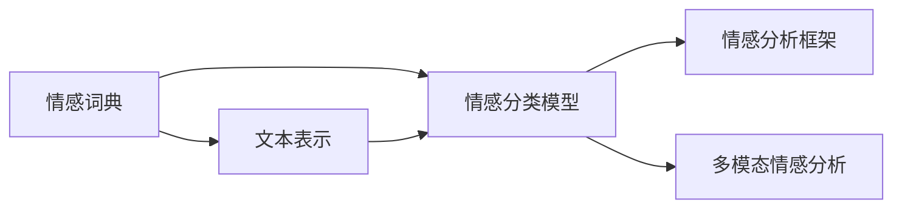

                 

# 数字化情感分析创业：AI驱动的社交洞察

## 1. 背景介绍

在数字化浪潮的推动下，社交媒体和在线平台的崛起改变了人们的信息获取方式和沟通习惯。无论是个人社交动态还是企业品牌舆情，都蕴含着丰富的情感信息和社交洞察。情感分析作为自然语言处理(NLP)领域的一个重要分支，帮助企业从海量社交数据中提取有价值的信息，辅助决策制定和业务优化。

### 1.1 情感分析的应用场景

情感分析在营销、客户服务、舆情监控、市场研究等多个领域都有广泛应用。例如：

- **营销**：通过社交媒体监测品牌口碑，指导市场活动策略。
- **客户服务**：分析客户评论和反馈，提升用户体验和服务质量。
- **舆情监控**：跟踪公众对产品、事件、政策的反应，及时应对负面舆情。
- **市场研究**：挖掘消费者情感倾向，发现市场机会和消费者需求。

这些应用场景突显了情感分析在商业决策中的重要性。然而，传统情感分析方法通常依赖手工标注数据和规则，耗时费力，难以应对大规模社交数据。人工智能技术的应用，使得情感分析变得更加高效、精准，成为数字化创业的新热点。

### 1.2 情感分析的核心问题

情感分析的核心在于理解文本中的情感倾向，通常包括极性、强度、情感类别等。在实践中，面临以下几个关键问题：

- **情感词典的选择**：如何构建包含丰富情感信息的词典，覆盖更多的情感维度？
- **文本表示的泛化能力**：如何有效地将文本转化为机器可理解的向量表示，提升模型的泛化能力？
- **情感分类的精度**：如何设计高效的分类模型，减少误分类现象？
- **语境的理解**：如何在多语境、多模态数据中准确把握文本情感？
- **动态情感变化**：如何跟踪和分析用户情感随时间的变化趋势？

这些问题的解决需要跨学科的知识和技术，如NLP、计算机视觉、统计学、心理学等，共同推动情感分析技术的发展。

## 2. 核心概念与联系

### 2.1 核心概念概述

为更好地理解情感分析的技术原理和应用流程，本节将介绍几个关键概念：

- **情感词典**：一个包含词语情感极性的词汇表，通常用于判断文本中词语的情感倾向。
- **文本表示**：将文本转化为机器可理解的数值向量，常用的方法包括词袋模型、TF-IDF、Word2Vec、BERT等。
- **情感分类模型**：对文本进行情感分类的机器学习模型，常用的有朴素贝叶斯、支持向量机、深度神经网络等。
- **情感分析框架**：一个综合了情感词典、文本表示、情感分类模型的系统架构，用于处理大规模文本数据。
- **多模态情感分析**：结合图像、视频、语音等多模态信息，提升情感分析的准确性和鲁棒性。

这些核心概念之间的关系可以通过以下Mermaid流程图来展示：



这个流程图展示了情感分析过程中各个关键组件的相互依赖关系：

1. 情感词典提供了词语情感极性的基础信息。
2. 文本表示将文本转化为数值向量，为情感分类模型提供输入。
3. 情感分类模型对文本进行情感分类，输出情感标签或情感极性。
4. 情感分析框架将情感词典、文本表示、情感分类模型整合，构建完整的情感分析系统。
5. 多模态情感分析将多模态信息融合，增强情感分析的准确性和鲁棒性。

这些概念共同构成了情感分析的核心框架，帮助企业从海量数据中提取有价值的情感信息。

## 3. 核心算法原理 & 具体操作步骤

### 3.1 算法原理概述

情感分析的本质是将文本数据转化为情感标签或情感极性向量，通常采用机器学习的方法进行建模。其核心算法包括：

- **文本表示学习**：将文本数据转换为机器可理解的数值向量。
- **情感分类模型训练**：对文本进行情感分类，学习情感与文本特征之间的关系。
- **多模态信息融合**：将文本与图像、视频、语音等多模态信息融合，提升情感分析的精度。

### 3.2 算法步骤详解

情感分析的主要步骤包括：

1. **数据预处理**：清洗文本数据，去除噪声，提取关键词和短语。
2. **文本表示学习**：将文本转化为数值向量，常用的方法包括词袋模型、TF-IDF、Word2Vec、BERT等。
3. **情感词典构建**：构建包含情感信息的词典，如SentiWordNet、AFINN等。
4. **情感分类模型训练**：选择适当的机器学习模型，如朴素贝叶斯、支持向量机、深度神经网络等，进行训练。
5. **模型评估与优化**：使用交叉验证、ROC曲线、精确度-召回率曲线等指标评估模型性能，进行调参优化。
6. **多模态融合**：结合多模态信息，如图像特征、视频情感、语音情感等，增强情感分析的鲁棒性。
7. **应用部署**：将训练好的模型部署到生产环境，进行实时情感分析。

### 3.3 算法优缺点

情感分析算法具有以下优点：

- **高效性**：自动化处理大规模文本数据，显著降低人工成本。
- **准确性**：基于深度神经网络等先进模型，情感分类精度较高。
- **泛化能力**：多模态融合提升模型的鲁棒性和泛化能力。

同时，也存在一些缺点：

- **数据依赖**：模型依赖于大量标注数据，获取高质量标注数据成本较高。
- **复杂性**：模型构建和调参较为复杂，需要一定的技术积累。
- **上下文理解**：难以准确理解文本的语境和隐含情感，有时会出现误分类现象。
- **多模态融合挑战**：多模态数据的获取和融合仍存在挑战，技术难度较高。

### 3.4 算法应用领域

情感分析技术已经在多个领域得到广泛应用，具体包括：

- **社交媒体监测**：跟踪品牌声誉，分析消费者情感，指导市场策略。
- **舆情分析**：监测公众对政策、事件的反应，辅助决策制定。
- **客户服务**：分析客户反馈，提升服务质量，优化客户体验。
- **医疗健康**：分析患者情感状态，辅助心理健康评估和治疗。
- **金融分析**：分析投资者情绪，预测股市走势，辅助投资决策。
- **广告投放**：监测广告效果，优化投放策略，提高ROI。

## 4. 数学模型和公式 & 详细讲解

### 4.1 数学模型构建

情感分析的数学模型通常包括文本表示和情感分类两个部分。

- **文本表示模型**：将文本转换为向量表示，常用的方法包括词袋模型、TF-IDF、Word2Vec、BERT等。
- **情感分类模型**：将文本向量映射到情感类别，常用的方法包括朴素贝叶斯、支持向量机、深度神经网络等。

### 4.2 公式推导过程

以基于BERT的情感分类模型为例，其核心公式如下：

1. **文本表示**：

   $$
   x = \text{BERT}(\text{text})
   $$

   其中 $x$ 为文本向量表示， $\text{text}$ 为输入文本。

2. **情感分类**：

   $$
   y = \text{Softmax}(W^T x + b)
   $$

   其中 $y$ 为情感类别概率分布， $W$ 为权重矩阵， $b$ 为偏置向量。

### 4.3 案例分析与讲解

假设我们需要对一篇产品评论进行情感分类，使用BERT模型进行处理：

1. **文本表示**：使用BERT模型将评论转化为向量表示 $x$。
2. **情感分类**：将向量 $x$ 输入情感分类模型，得到情感类别概率分布 $y$。
3. **情感标签**：选择概率最大的情感类别作为最终分类结果。

## 5. 项目实践：代码实例和详细解释说明

### 5.1 开发环境搭建

在进行情感分析项目实践前，我们需要准备好开发环境。以下是使用Python进行TensorFlow开发的环境配置流程：

1. 安装Anaconda：从官网下载并安装Anaconda，用于创建独立的Python环境。

2. 创建并激活虚拟环境：

   ```bash
   conda create -n tf-env python=3.8 
   conda activate tf-env
   ```

3. 安装TensorFlow：根据CUDA版本，从官网获取对应的安装命令。例如：

   ```bash
   conda install tensorflow -c tf -c conda-forge
   ```

4. 安装各类工具包：

   ```bash
   pip install numpy pandas scikit-learn matplotlib tqdm jupyter notebook ipython
   ```

完成上述步骤后，即可在`tf-env`环境中开始情感分析项目的开发。

### 5.2 源代码详细实现

以下是一个简单的情感分析项目，使用TensorFlow实现：

```python
import tensorflow as tf
from tensorflow.keras.preprocessing.text import Tokenizer
from tensorflow.keras.preprocessing.sequence import pad_sequences
from tensorflow.keras.layers import Embedding, LSTM, Dense
from tensorflow.keras.models import Sequential

# 构建数据集
texts = ["This product is great!", "I didn't like the service.", "The food was terrible."]
labels = [1, 0, 0]

# 构建词典
tokenizer = Tokenizer(num_words=5000)
tokenizer.fit_on_texts(texts)
sequences = tokenizer.texts_to_sequences(texts)

# 填充序列
max_len = 10
padded_sequences = pad_sequences(sequences, maxlen=max_len, padding='post', truncating='post')

# 构建模型
model = Sequential([
    Embedding(input_dim=5000, output_dim=128, input_length=max_len),
    LSTM(units=64, dropout=0.2, recurrent_dropout=0.2),
    Dense(units=1, activation='sigmoid')
])

# 编译模型
model.compile(optimizer='adam', loss='binary_crossentropy', metrics=['accuracy'])

# 训练模型
model.fit(padded_sequences, labels, epochs=10, batch_size=32)

# 测试模型
test_text = ["I highly recommend this product.", "The service was excellent."]
test_sequence = tokenizer.texts_to_sequences(test_text)
test_padded_sequence = pad_sequences(test_sequence, maxlen=max_len, padding='post', truncating='post')
prediction = model.predict(test_padded_sequence)
print(prediction)
```

### 5.3 代码解读与分析

让我们再详细解读一下关键代码的实现细节：

**构建数据集**：
- `texts`：包含样本文本。
- `labels`：样本情感标签，0表示负面，1表示正面。

**构建词典**：
- 使用`Tokenizer`将文本转化为数字序列。

**填充序列**：
- 使用`pad_sequences`将序列填充至固定长度，防止模型处理不平衡的数据。

**构建模型**：
- 使用`Sequential`构建模型，包含嵌入层、LSTM层和全连接层。

**编译模型**：
- 设置优化器、损失函数和评价指标，编译模型。

**训练模型**：
- 使用`fit`函数对模型进行训练。

**测试模型**：
- 对新的文本进行预测，输出模型判断结果。

可以看到，通过TensorFlow的高级API，构建和训练情感分析模型变得非常简单。然而，在实际应用中，还需要考虑更多因素，如模型调参、超参数优化、模型评估等，才能得到理想的效果。

## 6. 实际应用场景

### 6.1 社交媒体监测

情感分析在社交媒体监测中有着广泛应用。通过分析用户在Twitter、Facebook、微博等平台上的发言，可以实时监测品牌声誉、用户情绪等关键指标。企业可以据此调整市场策略，优化用户体验。

在技术实现上，可以使用爬虫工具抓取社交媒体数据，利用情感分析模型对评论、帖子进行情感分类。结合NLP技术进行关键词提取和情感词分析，可以得到详细的情感分析报告，帮助企业进行决策。

### 6.2 舆情分析

情感分析在舆情分析中的应用主要集中在新闻、论坛等平台。通过分析公众对特定事件、政策的反应，可以预测舆情走向，辅助政府和企业进行风险预警和危机管理。

在实际应用中，可以使用爬虫抓取新闻、论坛、社交媒体等平台的数据，使用情感分析模型对文本进行情感分类。结合时间序列分析等方法，可以预测情感变化的趋势，识别潜在的舆情风险。

### 6.3 客户服务

情感分析在客户服务中的应用主要体现在客户反馈分析上。通过分析客户评论、投诉、咨询等文本数据，可以发现服务中的问题，提升用户体验和满意度。

在技术实现上，可以使用爬虫工具抓取客户反馈数据，使用情感分析模型对文本进行情感分类。结合自然语言处理技术，进行关键词提取和情感词分析，可以得到详细的情感分析报告，帮助企业优化服务流程和提升服务质量。

### 6.4 金融分析

情感分析在金融领域的应用主要体现在市场情绪分析和投资决策支持上。通过分析投资者对股票、债券、货币等金融产品的情感倾向，可以预测市场走势，辅助投资决策。

在实际应用中，可以使用爬虫抓取财经新闻、论坛、社交媒体等平台的数据，使用情感分析模型对文本进行情感分类。结合时间序列分析和机器学习算法，可以预测市场情绪变化，辅助投资决策。

## 7. 工具和资源推荐

### 7.1 学习资源推荐

为了帮助开发者系统掌握情感分析的理论基础和实践技巧，这里推荐一些优质的学习资源：

1. 《自然语言处理入门》系列博文：由大模型技术专家撰写，深入浅出地介绍了情感分析的基本概念和经典模型。

2. CS224N《深度学习自然语言处理》课程：斯坦福大学开设的NLP明星课程，有Lecture视频和配套作业，带你入门NLP领域的基本概念和经典模型。

3. 《Python文本挖掘》书籍：详细介绍文本预处理、文本表示、情感分析等技术，适合深入学习。

4. HuggingFace官方文档：Transformer库的官方文档，提供了海量预训练模型和情感分析的详细教程。

5. Semeval开源项目：情感分析测评基准，涵盖大量不同类型的情感分析数据集，并提供了基于深度学习的情感分析基线模型。

通过对这些资源的学习实践，相信你一定能够快速掌握情感分析的精髓，并用于解决实际的情感分析问题。

### 7.2 开发工具推荐

高效的开发离不开优秀的工具支持。以下是几款用于情感分析开发的常用工具：

1. TensorFlow：基于Python的开源深度学习框架，灵活动态的计算图，适合快速迭代研究。同样有丰富的预训练语言模型资源。

2. PyTorch：基于Python的开源深度学习框架，灵活性高，适合研究原型和实验。

3. Transformers库：HuggingFace开发的NLP工具库，集成了众多SOTA语言模型，支持TensorFlow和PyTorch，是进行情感分析任务的开发利器。

4. Weights & Biases：模型训练的实验跟踪工具，可以记录和可视化模型训练过程中的各项指标，方便对比和调优。与主流深度学习框架无缝集成。

5. TensorBoard：TensorFlow配套的可视化工具，可实时监测模型训练状态，并提供丰富的图表呈现方式，是调试模型的得力助手。

6. Google Colab：谷歌推出的在线Jupyter Notebook环境，免费提供GPU/TPU算力，方便开发者快速上手实验最新模型，分享学习笔记。

合理利用这些工具，可以显著提升情感分析任务的开发效率，加快创新迭代的步伐。

### 7.3 相关论文推荐

情感分析技术的发展离不开学界的持续研究。以下是几篇奠基性的相关论文，推荐阅读：

1. Sentiment Analysis with Deep Learning：提出使用深度神经网络进行情感分类，提升了情感分析的精度。

2. Attention is All You Need：提出Transformer结构，开创了预训练大模型时代，为情感分析提供了新的基础模型。

3. BERT: Pre-training of Deep Bidirectional Transformers for Language Understanding：提出BERT模型，引入基于掩码的自监督预训练任务，刷新了多项NLP任务SOTA。

4. Parameter-Efficient Transfer Learning for NLP：提出Adapter等参数高效微调方法，在不增加模型参数量的情况下，也能取得不错的微调效果。

5. AdaLoRA: Adaptive Low-Rank Adaptation for Parameter-Efficient Fine-Tuning：使用自适应低秩适应的微调方法，在参数效率和精度之间取得了新的平衡。

这些论文代表了大情感分析技术的发展脉络。通过学习这些前沿成果，可以帮助研究者把握学科前进方向，激发更多的创新灵感。

## 8. 总结：未来发展趋势与挑战

### 8.1 总结

本文对基于深度学习的情感分析技术进行了全面系统的介绍。首先阐述了情感分析在数字化商业中的重要性，明确了情感分析在市场分析、客户服务、舆情监控等领域的广泛应用。其次，从原理到实践，详细讲解了情感分析的数学模型和操作步骤，给出了情感分析任务开发的完整代码实例。同时，本文还探讨了情感分析在实际应用中的多个场景，展示了情感分析技术的广泛前景。此外，本文精选了情感分析技术的各类学习资源，力求为读者提供全方位的技术指引。

通过本文的系统梳理，可以看到，基于深度学习的情感分析技术正在成为数字化创业的新热点，极大地拓展了情感分析应用的边界，催生了更多的落地场景。情感分析技术通过自动化处理大规模文本数据，帮助企业从海量数据中提取有价值的情感信息，辅助决策制定和业务优化，成为企业数字化转型的重要工具。未来，伴随深度学习技术的不断进步和情感分析模型的持续优化，相信情感分析技术必将在更广阔的应用领域大放异彩。

### 8.2 未来发展趋势

展望未来，情感分析技术将呈现以下几个发展趋势：

1. **深度学习技术的进步**：深度学习技术的不断发展，使得情感分析模型在精度和鲁棒性上持续提升，未来将出现更多高效的情感分析算法。

2. **多模态融合**：将文本与图像、视频、语音等多模态信息融合，提升情感分析的准确性和鲁棒性，成为新的研究热点。

3. **实时处理能力**：随着实时数据处理技术的进步，情感分析将能够实现对大规模实时数据的处理，满足企业对实时情感分析的需求。

4. **上下文理解**：通过引入上下文信息，提升模型对文本情感的准确理解和分类，解决多语境和隐含情感等问题。

5. **情感词典和知识图谱的优化**：构建更全面、更准确的情感词典和知识图谱，提升模型的情感理解能力。

6. **自动化调参和超参数优化**：引入自动化调参和超参数优化技术，提高模型的训练效率和性能。

7. **人工智能伦理和安全性**：引入人工智能伦理和安全性评估指标，确保情感分析模型在实际应用中的可靠性和安全性。

以上趋势凸显了情感分析技术的广阔前景。这些方向的探索发展，必将进一步提升情感分析系统的性能和应用范围，为数字化商业带来新的变革。

### 8.3 面临的挑战

尽管情感分析技术已经取得了瞩目成就，但在迈向更加智能化、普适化应用的过程中，它仍面临诸多挑战：

1. **数据依赖**：情感分析依赖于大量标注数据，获取高质量标注数据的成本较高，成为制约情感分析技术发展的瓶颈。

2. **多语境理解**：情感分析难以准确理解文本的语境和隐含情感，有时会出现误分类现象，影响模型的泛化能力。

3. **多模态融合挑战**：多模态数据的获取和融合仍存在挑战，技术难度较高，限制了多模态情感分析的应用。

4. **情感词典和知识图谱的构建**：情感词典和知识图谱的构建需要大量人力和时间，难以覆盖所有领域的情感信息。

5. **自动化调参和超参数优化**：情感分析模型调参和超参数优化复杂，需要丰富的经验和技能，难以自动化进行。

6. **人工智能伦理和安全性**：情感分析模型可能存在偏见、歧视等问题，需要引入伦理和安全性评估指标，确保模型的可靠性和安全性。

以上挑战凸显了情感分析技术在实际应用中仍需不断优化和改进，需要更多的研究和实践支持。

### 8.4 研究展望

面对情感分析面临的种种挑战，未来的研究需要在以下几个方面寻求新的突破：

1. **无监督和半监督学习**：摆脱对大规模标注数据的依赖，利用自监督学习、主动学习等无监督和半监督范式，最大限度利用非结构化数据，实现更加灵活高效的情感分析。

2. **深度学习架构的创新**：开发更加高效的深度学习架构，如BERT、GPT等，提升情感分析模型的精度和鲁棒性。

3. **多模态融合方法**：研究更加高效的多模态融合方法，如跨模态注意力机制、多模态编码器等，增强情感分析的准确性和鲁棒性。

4. **上下文理解的提升**：引入上下文信息，提升模型对文本情感的准确理解和分类，解决多语境和隐含情感等问题。

5. **情感词典和知识图谱的优化**：构建更全面、更准确的情感词典和知识图谱，提升模型的情感理解能力。

6. **自动化调参和超参数优化**：引入自动化调参和超参数优化技术，提高模型的训练效率和性能。

7. **人工智能伦理和安全性**：引入人工智能伦理和安全性评估指标，确保情感分析模型在实际应用中的可靠性和安全性。

这些研究方向将引领情感分析技术的不断发展，推动情感分析技术在更广泛领域的应用。未来，随着情感分析技术的持续进步和优化，相信情感分析将在数字化商业中发挥越来越重要的作用，助力企业实现数字化转型。

## 9. 附录：常见问题与解答

**Q1：情感分析在实际应用中需要注意哪些问题？**

A: 情感分析在实际应用中需要注意以下问题：

1. **数据依赖**：情感分析依赖于大量标注数据，获取高质量标注数据的成本较高，需要定期更新和维护标注数据集。

2. **多语境理解**：情感分析难以准确理解文本的语境和隐含情感，有时会出现误分类现象，影响模型的泛化能力。

3. **多模态融合挑战**：多模态数据的获取和融合仍存在挑战，技术难度较高，限制了多模态情感分析的应用。

4. **情感词典和知识图谱的构建**：情感词典和知识图谱的构建需要大量人力和时间，难以覆盖所有领域的情感信息。

5. **自动化调参和超参数优化**：情感分析模型调参和超参数优化复杂，需要丰富的经验和技能，难以自动化进行。

6. **人工智能伦理和安全性**：情感分析模型可能存在偏见、歧视等问题，需要引入伦理和安全性评估指标，确保模型的可靠性和安全性。

这些问题的解决需要跨学科的知识和技术，如NLP、计算机视觉、统计学、心理学等，共同推动情感分析技术的发展。

**Q2：情感分析模型在企业中的应用有哪些？**

A: 情感分析模型在企业中的应用主要包括以下几个方面：

1. **品牌声誉监测**：通过分析社交媒体、论坛等平台上的用户评论，监测品牌声誉，指导市场策略。

2. **客户服务优化**：分析客户评论、投诉、咨询等文本数据，发现服务中的问题，提升用户体验和满意度。

3. **舆情分析**：监测公众对特定事件、政策的反应，预测舆情走向，辅助政府和企业进行风险预警和危机管理。

4. **市场情绪分析**：分析投资者对股票、债券、货币等金融产品的情感倾向，预测市场走势，辅助投资决策。

5. **广告投放优化**：监测广告效果，优化投放策略，提高ROI。

6. **人力资源管理**：分析员工反馈和评价，提升人力资源管理水平。

这些应用场景突显了情感分析在企业决策和运营中的重要性，帮助企业从海量数据中提取有价值的情感信息，辅助决策制定和业务优化。

**Q3：情感分析在医疗领域有哪些应用？**

A: 情感分析在医疗领域的应用主要包括以下几个方面：

1. **患者情感状态监测**：分析患者的评论、社交媒体帖子等，监测其情感状态，辅助心理健康评估和治疗。

2. **医护人员情绪分析**：分析医护人员的工作日志、社交媒体帖子等，了解其工作压力和情绪状态，优化工作环境。

3. **医疗服务质量评估**：分析患者对医疗服务的评价，评估医疗服务质量，改进服务流程和质量。

4. **医疗舆情分析**：监测公众对医疗政策、事件的反应，辅助医疗决策和管理。

5. **远程医疗咨询**：分析患者的情感状态和需求，提供个性化的远程医疗咨询和心理支持。

这些应用场景突显了情感分析在医疗领域的重要价值，帮助医疗机构从海量数据中提取有价值的情感信息，辅助决策制定和业务优化。

**Q4：情感分析技术在实际应用中需要注意哪些伦理问题？**

A: 情感分析技术在实际应用中需要注意以下伦理问题：

1. **隐私保护**：情感分析涉及大量用户数据，需要严格遵守隐私保护法规，确保用户隐私安全。

2. **偏见和歧视**：情感分析模型可能存在偏见和歧视，需要引入伦理和安全性评估指标，确保模型的可靠性和安全性。

3. **误分类和误导**：情感分析模型的误分类可能导致误导性信息传播，影响用户决策和行为，需要谨慎处理。

4. **透明性和可解释性**：情感分析模型的决策过程需要透明和可解释，确保用户理解和信任模型的输出。

5. **法律责任**：情感分析模型的输出可能引发法律纠纷，需要明确模型的法律责任和用户权益。

这些伦理问题需要企业在使用情感分析技术时，充分考虑并采取相应措施，确保技术的合法、合规、合德使用。

**Q5：情感分析技术在实际应用中需要注意哪些挑战？**

A: 情感分析技术在实际应用中需要注意以下挑战：

1. **数据依赖**：情感分析依赖于大量标注数据，获取高质量标注数据的成本较高，需要定期更新和维护标注数据集。

2. **多语境理解**：情感分析难以准确理解文本的语境和隐含情感，有时会出现误分类现象，影响模型的泛化能力。

3. **多模态融合挑战**：多模态数据的获取和融合仍存在挑战，技术难度较高，限制了多模态情感分析的应用。

4. **情感词典和知识图谱的构建**：情感词典和知识图谱的构建需要大量人力和时间，难以覆盖所有领域的情感信息。

5. **自动化调参和超参数优化**：情感分析模型调参和超参数优化复杂，需要丰富的经验和技能，难以自动化进行。

6. **人工智能伦理和安全性**：情感分析模型可能存在偏见、歧视等问题，需要引入伦理和安全性评估指标，确保模型的可靠性和安全性。

这些问题的解决需要跨学科的知识和技术，如NLP、计算机视觉、统计学、心理学等，共同推动情感分析技术的发展。

**Q6：情感分析在企业中的应用有哪些？**

A: 情感分析在企业中的应用主要包括以下几个方面：

1. **品牌声誉监测**：通过分析社交媒体、论坛等平台上的用户评论，监测品牌声誉，指导市场策略。

2. **客户服务优化**：分析客户评论、投诉、咨询等文本数据，发现服务中的问题，提升用户体验和满意度。

3. **舆情分析**：监测公众对特定事件、政策的反应，预测舆情走向，辅助政府和企业进行风险预警和危机管理。

4. **市场情绪分析**：分析投资者对股票、债券、货币等金融产品的情感倾向，预测市场走势，辅助投资决策。

5. **广告投放优化**：监测广告效果，优化投放策略，提高ROI。

6. **人力资源管理**：分析员工反馈和评价，提升人力资源管理水平。

这些应用场景突显了情感分析在企业决策和运营中的重要性，帮助企业从海量数据中提取有价值的情感信息，辅助决策制定和业务优化。

---

作者：禅与计算机程序设计艺术 / Zen and the Art of Computer Programming

