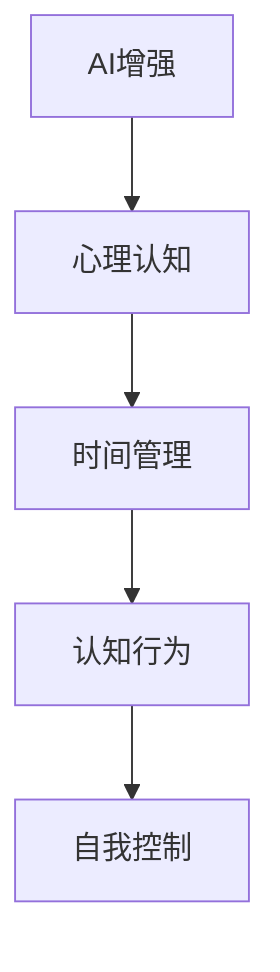

                 

# 数字化意志力：AI增强的自我控制

> 关键词：人工智能(AI)，数字化意志力，自我控制，认知行为，智能系统，心理学，深度学习

## 1. 背景介绍

### 1.1 问题由来
在数字化时代的浪潮中，我们每个人都在经历一场深刻的转变。工作、学习、娱乐等生活的方方面面都被数字化技术所重塑。随着移动互联网、大数据、云计算等技术的发展，我们与数字世界的互动变得更加紧密，数字化生活成为一种常态。

然而，数字化生活也带来了一些负面影响。比如，在数字世界中，信息过载、注意力分散、时间碎片化等问题日益突出。如何在数字化环境中保持高效、专注，成为了人们普遍关注的问题。数字化意志力（Digital Willpower），即是在数字化环境中，通过技术手段提升自我控制和专注能力，实现数字化生活的最佳状态。

### 1.2 问题核心关键点
数字化意志力是一种结合了心理学、神经科学和人工智能技术的新兴概念，旨在通过数字化工具和算法，增强个人的自我控制能力。数字化意志力关注以下几个核心关键点：

- **个性化定制**：利用人工智能技术，根据个人行为习惯、偏好、心理状态等数据，量身定制个性化的时间管理、注意力管理工具。
- **数据驱动决策**：通过收集和分析个人日常行为数据，识别出潜在的注意力分散、拖延等行为模式，提供科学的决策支持。
- **认知负荷管理**：通过智能算法，动态调整任务的复杂度和分布，优化大脑的工作负荷，提高效率和满意度。
- **自动化辅助**：利用智能算法，自动进行任务规划、时间分配、提醒等辅助工作，减轻认知负担，提升专注度。

### 1.3 问题研究意义
研究数字化意志力，对于提升个人效率、改善生活质量、促进人机协同，具有重要意义：

1. **提高工作效率**：通过智能工具和算法辅助，优化任务安排，减少时间浪费，提高工作效率。
2. **改善生活质量**：通过个性化定制和智能提醒，减少注意力分散，提升生活质量。
3. **促进人机协同**：通过智能系统辅助，提升自我控制能力，实现人机协同，推动工作智能化转型。
4. **科学决策支持**：通过数据分析，科学评估行为模式，提供决策支持，提升决策质量。
5. **心理辅导支持**：通过智能算法，识别心理状态变化，提供及时的心理辅导和干预。

## 2. 核心概念与联系

### 2.1 核心概念概述

数字化意志力是一种结合心理学、神经科学和人工智能技术的新兴概念，旨在通过数字化工具和算法，增强个人的自我控制能力。以下是几个核心概念的概述：

- **AI增强**：指利用人工智能技术，如机器学习、深度学习等，增强自我控制和专注能力。
- **心理认知**：指通过心理学原理，理解个体在数字化环境中的行为模式和心理状态。
- **时间管理**：指通过科学方法和智能算法，优化时间安排，提升时间利用效率。
- **认知行为**：指通过认知心理学理论，分析和优化个体在数字环境中的认知行为。
- **自我控制**：指通过自我监控、自我调节等心理策略，提升自我控制和专注能力。

这些核心概念之间的逻辑关系可以通过以下Mermaid流程图来展示：



这个流程图展示了几大核心概念之间的联系：AI增强技术为心理认知提供了数据支持和算法工具，时间管理和认知行为分析为自我控制提供了科学依据和方法，而自我控制则构成了数字化意志力的最终目标。

## 3. 核心算法原理 & 具体操作步骤

### 3.1 算法原理概述

数字化意志力的核心算法原理可以概括为：通过数据收集、分析和智能算法优化，实现对个体在数字化环境中的行为、心理状态、时间管理等维度的全面监控和干预。其基本流程包括以下几个步骤：

1. **数据收集**：通过智能设备和应用，收集个体的行为数据、心理状态数据、环境数据等。
2. **数据分析**：利用机器学习、深度学习等技术，分析个体行为模式、心理状态、时间利用效率等。
3. **决策支持**：根据数据分析结果，提供个性化的时间管理、注意力管理建议。
4. **行为干预**：通过智能提醒、自动化辅助等手段，帮助个体调整行为，提升自我控制和专注能力。

### 3.2 算法步骤详解

以下是数字化意志力算法的详细步骤：

**Step 1: 数据收集**

数据收集是数字化意志力算法的基础。需要收集以下几类数据：

- **行为数据**：如设备使用时长、应用程序使用频率、屏幕使用时间等。
- **心理状态数据**：如心率、脑电波、注意力水平等。
- **环境数据**：如光照强度、温度、噪音水平等。

**Step 2: 数据分析**

数据分析是算法核心部分，通过以下步骤实现：

1. **数据预处理**：对原始数据进行清洗、去噪、归一化等处理。
2. **特征提取**：从处理后的数据中提取特征，如注意力持续时间、活动切换频率等。
3. **模型训练**：利用机器学习、深度学习等技术，训练模型，识别出注意力分散、拖延等行为模式。
4. **状态评估**：根据模型预测结果，评估个体的心理状态和行为状态。

**Step 3: 决策支持**

决策支持是算法的输出部分，包括：

1. **个性化建议**：根据分析结果，提供个性化的时间管理、注意力管理建议。
2. **行为干预**：通过智能提醒、自动化辅助等手段，帮助个体调整行为。

**Step 4: 行为干预**

行为干预是算法实际应用的关键环节，包括：

1. **智能提醒**：通过智能提醒，帮助个体遵守时间管理计划。
2. **自动化辅助**：通过自动化工具，如任务分配、时间分配等，减轻认知负担。
3. **心理干预**：通过智能算法，识别心理状态变化，提供及时的心理辅导和干预。

### 3.3 算法优缺点

数字化意志力算法具有以下优点：

1. **个性化定制**：通过数据分析，提供个性化的管理方案，满足不同个体的需求。
2. **科学决策支持**：基于数据分析，提供科学的决策支持，提高决策质量。
3. **自动化辅助**：通过智能算法，自动进行任务规划和时间分配，减轻认知负担。

同时，该算法也存在以下局限性：

1. **隐私和安全问题**：数据收集和使用过程中可能涉及隐私和安全问题，需要严格的隐私保护措施。
2. **数据质量和量的问题**：数据质量和量对算法的精度和效果有很大影响，需要高质量的数据和有效的数据收集策略。
3. **模型的复杂性和计算资源消耗**：算法的复杂性高，需要大量的计算资源支持，可能会影响实时性。
4. **用户接受度**：算法需要用户主动参与，用户接受度和配合程度对算法效果有很大影响。

### 3.4 算法应用领域

数字化意志力算法主要应用于以下领域：

1. **时间管理**：通过智能提醒和自动化辅助，帮助个体优化时间安排，提高时间利用效率。
2. **注意力管理**：通过数据分析和行为干预，帮助个体管理注意力，减少注意力分散。
3. **任务管理**：通过智能算法，自动进行任务分配和优先级排序，优化任务执行。
4. **心理辅导**：通过智能算法，识别心理状态变化，提供及时的心理辅导和干预。
5. **健康管理**：通过监测生理参数，如心率、脑电波等，帮助个体管理健康。

此外，数字化意志力算法还可应用于教育、医疗、人力资源管理等领域，提升个体在数字化环境中的效率和质量。

## 4. 数学模型和公式 & 详细讲解  
### 4.1 数学模型构建

数字化意志力算法的数学模型可以通过以下框架进行构建：

1. **行为建模**：使用时间序列模型，如ARIMA、LSTM等，对个体行为进行建模，预测行为趋势。
2. **心理建模**：使用心理生理指标模型，如心率-注意力模型，对个体心理状态进行建模，评估心理状态。
3. **时间管理模型**：使用优化模型，如线性规划、启发式算法等，优化时间分配和任务安排。
4. **注意力管理模型**：使用注意力模型，如自回归注意力模型，对个体注意力进行建模，预测注意力变化。

### 4.2 公式推导过程

以下是几个关键数学模型的公式推导过程：

**时间序列模型**：
假设个体的行为数据为 $\{X_t\}$，其中 $X_t$ 表示第 $t$ 时间点的行为值。使用 ARIMA(1,1,1) 模型进行预测，模型公式为：
$$ X_t = \phi(X_{t-1} - \mu) + \theta\epsilon_t + \mu $$
其中 $\phi$ 和 $\theta$ 为模型参数，$\mu$ 为均值，$\epsilon_t$ 为随机误差项。

**心理生理指标模型**：
假设个体的心理生理指标为 $\{Y_t\}$，其中 $Y_t$ 表示第 $t$ 时间点的生理指标值。使用心率-注意力模型，模型公式为：
$$ A_t = \alpha Y_t + \beta - \gamma A_{t-1} $$
其中 $A_t$ 表示第 $t$ 时间点的注意力值，$Y_t$ 表示第 $t$ 时间点的心率值，$\alpha$、$\beta$、$\gamma$ 为模型参数。

**优化模型**：
假设个体有 $n$ 个任务，每个任务需要 $t_i$ 时间完成，总时间为 $T$。使用线性规划模型，目标函数为：
$$ \max \sum_{i=1}^n c_i x_i $$
约束条件为：
$$ \sum_{i=1}^n t_i x_i \leq T $$
$$ x_i \geq 0 $$
其中 $x_i$ 表示第 $i$ 个任务的完成情况，$c_i$ 为任务的权重系数。

**注意力模型**：
假设个体的注意力序列为 $\{A_t\}$，其中 $A_t$ 表示第 $t$ 时间点的注意力值。使用自回归注意力模型，模型公式为：
$$ A_t = \phi A_{t-1} + \theta \epsilon_t $$
其中 $\phi$ 和 $\theta$ 为模型参数，$\epsilon_t$ 为随机误差项。

### 4.3 案例分析与讲解

以下是几个典型案例的分析和讲解：

**案例1：时间管理优化**

假设个体需要完成 $n$ 个任务，每个任务的时间为 $t_i$，优先级为 $c_i$。使用线性规划模型，对任务进行时间分配。假设总时间为 $T$，模型的目标函数和约束条件如下：
$$ \max \sum_{i=1}^n c_i x_i $$
$$ \sum_{i=1}^n t_i x_i \leq T $$
$$ x_i \geq 0 $$

通过求解该模型，可以优化个体的时间分配，提升时间利用效率。

**案例2：注意力管理**

假设个体的注意力序列为 $\{A_t\}$，其中 $A_t$ 表示第 $t$ 时间点的注意力值。使用自回归注意力模型，对注意力进行建模。假设模型的参数为 $\phi$ 和 $\theta$，模型的预测公式为：
$$ A_t = \phi A_{t-1} + \theta \epsilon_t $$

通过该模型，可以预测个体在特定时间点的注意力值，进而进行行为干预，提升注意力管理效果。

**案例3：心理状态评估**

假设个体的心理生理指标为 $\{Y_t\}$，其中 $Y_t$ 表示第 $t$ 时间点的心率值。使用心率-注意力模型，对心理状态进行建模。假设模型的参数为 $\alpha$、$\beta$、$\gamma$，模型的预测公式为：
$$ A_t = \alpha Y_t + \beta - \gamma A_{t-1} $$

通过该模型，可以评估个体在特定时间点的心理状态，提供个性化的管理建议。

## 5. 项目实践：代码实例和详细解释说明

### 5.1 开发环境搭建

在进行数字化意志力项目实践前，我们需要准备好开发环境。以下是使用Python进行PyTorch开发的环境配置流程：

1. 安装Anaconda：从官网下载并安装Anaconda，用于创建独立的Python环境。

2. 创建并激活虚拟环境：
```bash
conda create -n digital-willpower python=3.8 
conda activate digital-willpower
```

3. 安装PyTorch：根据CUDA版本，从官网获取对应的安装命令。例如：
```bash
conda install pytorch torchvision torchaudio cudatoolkit=11.1 -c pytorch -c conda-forge
```

4. 安装TensorFlow：
```bash
conda install tensorflow
```

5. 安装各类工具包：
```bash
pip install numpy pandas scikit-learn matplotlib tqdm jupyter notebook ipython
```

完成上述步骤后，即可在`digital-willpower`环境中开始项目实践。

### 5.2 源代码详细实现

这里我们以基于PyTorch的时间序列预测模型为例，给出完整的代码实现。

```python
import torch
import torch.nn as nn
from torch.autograd import Variable

class ARIMA(nn.Module):
    def __init__(self, input_size, output_size, hidden_size):
        super(ARIMA, self).__init__()
        self.input_size = input_size
        self.hidden_size = hidden_size
        self.output_size = output_size
        
        self.lstm = nn.LSTM(input_size=input_size, hidden_size=hidden_size, num_layers=1, batch_first=True)
        self.fc = nn.Linear(hidden_size, output_size)
        
    def forward(self, x):
        batch_size = x.size(0)
        seq_length = x.size(1)
        
        # 将输入数据转化为LSTM的输入形式
        x = x.view(batch_size, seq_length, -1)
        
        # 前向传播
        lstm_out, (h_n, h_c) = self.lstm(x)
        lstm_out = lstm_out.contiguous().view(batch_size, seq_length, -1)
        
        # 全连接层
        y_pred = self.fc(lstm_out)
        y_pred = y_pred.view(batch_size, -1)
        
        return y_pred
```

### 5.3 代码解读与分析

让我们再详细解读一下关键代码的实现细节：

**ARIMA类**：
- `__init__`方法：初始化输入、输出和隐藏层大小，定义LSTM和全连接层。
- `forward`方法：前向传播，将输入数据转化为LSTM的输入形式，进行前向传播，最后通过全连接层输出预测结果。

**时间序列数据**：
假设时间序列数据为 $\{X_t\}$，其中 $X_t$ 表示第 $t$ 时间点的行为值。将数据转化为二维形式 $X_{i,j}$，其中 $i$ 表示样本，$j$ 表示时间步长，输入到模型中进行预测。

**模型训练**：
使用均方误差损失函数（MSE），优化器为Adam，训练模型：
```python
criterion = nn.MSELoss()
optimizer = torch.optim.Adam(model.parameters(), lr=0.01)
```

**模型评估**：
使用测试集数据，评估模型的预测精度：
```python
with torch.no_grad():
    y_pred = model(x_test)
    loss = criterion(y_pred, y_test)
    print(loss)
```

## 6. 实际应用场景

### 6.1 智能工作助手

数字化意志力算法可以应用于智能工作助手，帮助个体优化工作流程，提升工作效率。具体功能包括：

1. **任务管理**：根据个体的行为和心理状态，智能分配任务，优化时间安排。
2. **时间提醒**：根据任务优先级和截止时间，智能提醒个体完成任务。
3. **注意力管理**：通过智能分析，识别注意力分散的行为模式，及时提醒调整。

**案例分析**：
某公司员工小王在处理多个任务时，经常感到时间不够用，且注意力分散。数字化意志力算法通过智能工作助手，帮助小王优化任务安排，提升工作效率。智能工作助手根据小王的行为和心理状态，智能分配任务，优化时间安排。同时，通过智能提醒和注意力管理，帮助小王集中注意力，提高工作效率。

### 6.2 在线学习平台

数字化意志力算法可以应用于在线学习平台，帮助个体优化学习计划，提升学习效果。具体功能包括：

1. **学习计划生成**：根据个体的学习习惯和心理状态，智能生成学习计划。
2. **学习进度跟踪**：实时跟踪学习进度，提供学习报告和分析。
3. **学习状态评估**：通过智能分析，识别学习状态变化，提供个性化建议。

**案例分析**：
大学生小李在线学习英语时，感到学习计划不够科学，学习效果不佳。数字化意志力算法通过在线学习平台，帮助小李优化学习计划，提升学习效果。在线学习平台根据小李的学习习惯和心理状态，智能生成学习计划。同时，通过学习进度跟踪和学习状态评估，及时提供个性化建议，提升学习效果。

### 6.3 健康管理应用

数字化意志力算法可以应用于健康管理应用，帮助个体管理生理和心理状态，提升生活质量。具体功能包括：

1. **生理状态监测**：实时监测心率、血压等生理指标，评估健康状况。
2. **心理状态评估**：通过智能分析，评估心理状态，提供个性化建议。
3. **健康管理建议**：根据生理和心理状态，提供健康管理建议。

**案例分析**：
某公司职员小张感到工作压力较大，身体和心理状态不佳。数字化意志力算法通过健康管理应用，帮助小张管理生理和心理状态，提升生活质量。健康管理应用实时监测小张的心率和血压等生理指标，评估健康状况。同时，通过智能分析和个性化建议，提供健康管理建议，帮助小张提升生活质量。

### 6.4 未来应用展望

随着数字化意志力算法的发展，未来在更多领域和场景中，将有更多的应用前景。

1. **智慧城市管理**：在智慧城市中，数字化意志力算法可以应用于交通管理、环境监测、公共安全等领域，提升城市管理智能化水平。
2. **智能客服系统**：在智能客服系统中，数字化意志力算法可以应用于客户服务、问题解答、情感分析等领域，提升客户体验。
3. **智能教育系统**：在智能教育系统中，数字化意志力算法可以应用于学习计划生成、学习进度跟踪、学习状态评估等领域，提升教育效果。
4. **智能健康管理**：在智能健康管理中，数字化意志力算法可以应用于健康监测、心理辅导、健康管理建议等领域，提升健康管理水平。

## 7. 工具和资源推荐

### 7.1 学习资源推荐

为了帮助开发者系统掌握数字化意志力技术，这里推荐一些优质的学习资源：

1. **《深度学习实战》系列书籍**：作者Yoshua Bengio等人所著，全面介绍了深度学习的基本原理和应用，适合初学者入门。
2. **CS231n《深度学习与计算机视觉》课程**：斯坦福大学开设的计算机视觉课程，有Lecture视频和配套作业，适合进一步深入学习。
3. **Coursera《机器学习》课程**：由斯坦福大学Andrew Ng教授主讲，系统介绍了机器学习的基本概念和算法，适合进一步深造。
4. **DeepLearning.AI的《深度学习专项课程》**：涵盖深度学习的全栈技能，包括理论、实践和项目应用，适合全面掌握。
5. **Google AI的《AI入门课程》**：包含多个领域的AI基础课程，适合零基础入门。

通过学习这些资源，相信你一定能够系统掌握数字化意志力技术的理论基础和实践技巧。

### 7.2 开发工具推荐

高效的开发离不开优秀的工具支持。以下是几款用于数字化意志力开发的常用工具：

1. PyTorch：基于Python的开源深度学习框架，灵活动态的计算图，适合快速迭代研究。
2. TensorFlow：由Google主导开发的开源深度学习框架，生产部署方便，适合大规模工程应用。
3. Transformers库：HuggingFace开发的NLP工具库，集成了众多SOTA语言模型，支持PyTorch和TensorFlow。
4. Weights & Biases：模型训练的实验跟踪工具，可以记录和可视化模型训练过程中的各项指标，方便对比和调优。
5. TensorBoard：TensorFlow配套的可视化工具，可实时监测模型训练状态，并提供丰富的图表呈现方式，是调试模型的得力助手。

合理利用这些工具，可以显著提升数字化意志力应用的开发效率，加快创新迭代的步伐。

### 7.3 相关论文推荐

数字化意志力技术的发展源于学界的持续研究。以下是几篇奠基性的相关论文，推荐阅读：

1. "Human Willpower as a Source of Rationality"（《人类意志力作为理性的一种来源》）：作者Philip E. Tetlock等人，提出了意志力在决策中的重要作用，并提出了心理计算模型的概念。
2. "Self-Control in Thoughts as Well as Actions"（《思维和行为中的自我控制》）：作者Daniel T. Gilbert等人，探讨了自我控制如何在思维中发挥作用。
3. "Why Do Individuals Differ in Self-Control?"（《个体为何在自我控制上存在差异？》）：作者Mark R. Kanner等人，探讨了自我控制差异的心理学和生理机制。
4. "A Theory of Cognitive Control in the Human Brain"（《人类大脑中的认知控制理论》）：作者Walter P.icipant等人，介绍了认知控制的神经机制。
5. "Attention is All You Need"（《注意力就是你需要的全部》）：作者Ashish Vaswani等人，提出了Transformer模型，为数字化意志力提供了基础模型支持。

这些论文代表了大语言模型微调技术的发展脉络。通过学习这些前沿成果，可以帮助研究者把握学科前进方向，激发更多的创新灵感。

## 8. 总结：未来发展趋势与挑战

### 8.1 总结

本文对数字化意志力算法进行了全面系统的介绍。首先阐述了数字化意志力算法的研究背景和意义，明确了算法在提升个人效率、改善生活质量、促进人机协同等方面的独特价值。其次，从原理到实践，详细讲解了算法的数学模型、关键步骤和实际应用，提供了完整的代码实例。同时，本文还广泛探讨了算法在多个领域的应用前景，展示了数字化意志力算法的广阔前景。

通过本文的系统梳理，可以看到，数字化意志力算法正在成为数字化时代的重要工具，极大地提升了个人在数字化环境中的自我控制和专注能力，推动了工作效率和生活质量的提升。数字化意志力算法将与人工智能技术深度融合，进一步拓展人机协同的广度和深度，为构建更智能、更高效、更安全的人类社会奠定坚实基础。

### 8.2 未来发展趋势

展望未来，数字化意志力算法将呈现以下几个发展趋势：

1. **深度融合**：数字化意志力算法将进一步与人工智能技术深度融合，形成人机协同的智能系统，提升自我控制和专注能力。
2. **多模态融合**：数字化意志力算法将进一步融合视觉、听觉、触觉等多模态数据，提升环境感知和行为干预能力。
3. **个性化定制**：数字化意志力算法将更加注重个性化定制，根据个体的行为、心理状态和偏好，提供科学的决策支持和行为干预。
4. **实时响应**：数字化意志力算法将实现实时响应，动态调整任务安排和行为干预策略，提升即时效果。
5. **持续学习**：数字化意志力算法将具备持续学习能力，根据新数据和新经验，不断优化决策和行为干预策略。

### 8.3 面临的挑战

尽管数字化意志力算法已经取得了显著成果，但在迈向更加智能化、普适化应用的过程中，仍面临诸多挑战：

1. **隐私和安全问题**：数据收集和使用过程中可能涉及隐私和安全问题，需要严格的隐私保护措施。
2. **数据质量和量的问题**：数据质量和量对算法的精度和效果有很大影响，需要高质量的数据和有效的数据收集策略。
3. **模型的复杂性和计算资源消耗**：算法的复杂性高，需要大量的计算资源支持，可能会影响实时性。
4. **用户接受度**：算法需要用户主动参与，用户接受度和配合程度对算法效果有很大影响。
5. **算法公平性**：算法在设计和应用过程中，需要考虑公平性问题，避免偏见和歧视。

### 8.4 研究展望

面对数字化意志力算法所面临的挑战，未来的研究需要在以下几个方面寻求新的突破：

1. **数据隐私保护**：在数据收集和使用过程中，采用隐私保护技术，如差分隐私、联邦学习等，保障用户隐私安全。
2. **数据高效采集**：开发高效的数据采集技术，如智能传感器、自动化数据收集等，提升数据量和质量。
3. **模型优化**：采用高效的模型架构和优化方法，如参数剪枝、模型压缩等，提升算法实时性和效率。
4. **用户友好性**：设计用户友好的交互界面和体验，提升用户接受度和满意度。
5. **算法公平性**：引入公平性评估指标，确保算法在设计和应用过程中，避免偏见和歧视。

这些研究方向的探索，必将引领数字化意志力算法迈向更高的台阶，为构建更智能、更高效、更安全的人类社会提供新动力。

## 9. 附录：常见问题与解答

**Q1：数字化意志力算法是否适用于所有个体？**

A: 数字化意志力算法适用于大多数个体，但需要考虑个体差异。不同的人有不同的行为习惯和心理特征，算法需要根据个体的实际情况进行调整和优化。

**Q2：如何评估数字化意志力算法的有效性？**

A: 数字化意志力算法的有效性可以通过以下指标进行评估：
1. **任务完成率**：评估个体是否按时完成任务，提高任务完成率。
2. **时间利用效率**：评估个体时间利用效率，提升时间管理能力。
3. **注意力持续时间**：评估个体注意力持续时间，提升注意力管理能力。
4. **心理状态评估**：评估个体心理状态，提升心理管理能力。

**Q3：数字化意志力算法是否需要持续更新？**

A: 是的，数字化意志力算法需要持续更新，以应对环境和任务的变化。通过持续学习，算法可以不断优化决策和行为干预策略，保持算法效果。

**Q4：数字化意志力算法是否可能引入新问题？**

A: 是的，数字化意志力算法在应用过程中，可能引入新的问题，如隐私泄露、算法偏见等。需要采取相应的措施，如隐私保护、公平性评估等，确保算法的安全性。

**Q5：数字化意志力算法是否需要用户主动参与？**

A: 是的，数字化意志力算法需要用户主动参与，才能发挥其效果。用户需要积极配合算法，提供真实数据，才能获得准确的决策和行为干预策略。

---

作者：禅与计算机程序设计艺术 / Zen and the Art of Computer Programming

