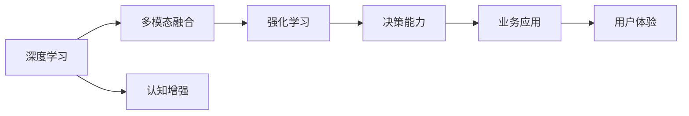

                 

## 1. 背景介绍

数字化转型的浪潮正席卷全球，人工智能(AI)作为数字化技术的重要一环，正逐渐成为各行各业的核心竞争力。在医疗、金融、制造、零售等领域，AI技术正在以惊人的速度推动业务创新和效率提升。然而，AI的发展并非一帆风顺，仍面临诸多挑战和瓶颈。本文将聚焦于AI辅助的超感知能力，探讨其在提升业务决策、优化用户体验、加速创新应用等方面的潜力，并为开发者和决策者提供实用的技术指引。

### 1.1 问题由来

在数据驱动的决策时代，企业需要借助AI技术，从海量数据中提取有价值的信息，做出更为精准的决策。然而，传统的数据分析和业务洞察方法往往局限于有限的数据维度，难以全面反映业务的复杂性和动态性。超感知能力的引入，能够突破数据维度的限制，赋予AI系统更深层次的理解和预测能力，进而提升决策质量。

### 1.2 问题核心关键点

超感知能力是指通过深度学习和多模态融合等技术，使AI系统具备超越传统数据处理方式的感知能力。这种能力的核心在于：

- **深度学习**：通过多层神经网络结构，对复杂数据进行高效提取和表示。
- **多模态融合**：将不同类型的数据（如图像、文本、语音等）进行融合，提升感知精度。
- **强化学习**：通过模拟人类行为，不断优化决策策略，适应不断变化的环境。
- **认知增强**：通过增强学习能力和情感推理，赋予AI更高的理解力和感知力。

这些核心技术相互配合，构成了超感知能力的全貌，使得AI系统能够在复杂多变的环境中，快速准确地做出决策。

## 2. 核心概念与联系

### 2.1 核心概念概述

为更好地理解AI辅助的超感知能力，本文将介绍几个关键概念：

- **深度学习**：通过多层神经网络对数据进行抽象表示，提取高层次特征。常见模型包括卷积神经网络(CNN)、循环神经网络(RNN)和变分自编码器(VAE)等。
- **多模态融合**：将不同类型的数据进行融合，提升感知精度。例如，通过图像+文本的融合，可以提升图像识别模型的性能。
- **强化学习**：通过模拟人类行为，不断优化决策策略，适应不断变化的环境。常见方法包括Q-learning、SARSA和深度强化学习(DRL)等。
- **认知增强**：通过增强学习能力和情感推理，赋予AI更高的理解力和感知力。例如，利用迁移学习、多任务学习等技术，提升AI的理解力。

这些核心概念之间的逻辑关系可以通过以下Mermaid流程图来展示：



这个流程图展示了深度学习、多模态融合、强化学习和认知增强如何相互配合，共同提升AI的超感知能力。

## 3. 核心算法原理 & 具体操作步骤
### 3.1 算法原理概述

AI辅助的超感知能力主要依赖于深度学习、多模态融合、强化学习和认知增强等技术。其核心思想是：

1. **深度学习**：通过多层神经网络结构，对复杂数据进行高效提取和表示。常见模型包括卷积神经网络(CNN)、循环神经网络(RNN)和变分自编码器(VAE)等。
2. **多模态融合**：将不同类型的数据进行融合，提升感知精度。例如，通过图像+文本的融合，可以提升图像识别模型的性能。
3. **强化学习**：通过模拟人类行为，不断优化决策策略，适应不断变化的环境。常见方法包括Q-learning、SARSA和深度强化学习(DRL)等。
4. **认知增强**：通过增强学习能力和情感推理，赋予AI更高的理解力和感知力。例如，利用迁移学习、多任务学习等技术，提升AI的理解力。

这些核心技术相互配合，共同提升了AI系统的超感知能力。

### 3.2 算法步骤详解

AI辅助的超感知能力的实现一般包括以下几个关键步骤：

**Step 1: 数据准备**

- 收集并清洗不同类型的数据，如文本、图像、语音等。
- 对数据进行标准化和归一化处理，提升数据质量。
- 将数据划分为训练集、验证集和测试集，用于模型训练、验证和测试。

**Step 2: 模型选择和设计**

- 根据任务需求，选择合适的深度学习模型，如CNN、RNN、VAE等。
- 设计多模态融合策略，将不同类型的数据进行融合。
- 定义强化学习环境，设计合理的奖励机制。
- 应用认知增强技术，提升AI的理解力。

**Step 3: 模型训练**

- 使用训练集数据，对模型进行训练，最小化损失函数。
- 应用多模态融合技术，提升模型的感知精度。
- 利用强化学习技术，优化模型的决策策略。
- 利用认知增强技术，提升模型的理解力。

**Step 4: 模型评估和优化**

- 在验证集上评估模型性能，调整超参数。
- 在测试集上评估模型泛化能力，确保模型的稳定性。
- 应用正则化技术，防止过拟合。
- 应用对抗训练，提升模型的鲁棒性。

**Step 5: 模型应用**

- 将训练好的模型应用于实际业务场景中，提升决策质量。
- 通过反馈机制不断优化模型，适应环境变化。
- 监控模型运行状态，确保系统的稳定性和可靠性。

以上是AI辅助的超感知能力的实现流程。在实际应用中，还需根据具体任务的特点，对模型训练和优化过程进行优化设计。

### 3.3 算法优缺点

AI辅助的超感知能力具有以下优点：

1. **深度学习**：通过多层神经网络结构，对复杂数据进行高效提取和表示，能够处理海量数据，提取高层次特征。
2. **多模态融合**：将不同类型的数据进行融合，提升感知精度，适用于多模态数据融合的场景。
3. **强化学习**：通过模拟人类行为，不断优化决策策略，适应不断变化的环境，提升决策质量。
4. **认知增强**：通过增强学习能力和情感推理，赋予AI更高的理解力和感知力，提升业务洞察能力。

同时，该方法也存在一定的局限性：

1. **数据需求高**：超感知能力需要大量高质量的数据进行训练，获取数据的过程可能耗费大量时间和成本。
2. **模型复杂度高**：深度学习模型参数量大，计算复杂度高，训练和推理速度慢。
3. **解释性不足**：超感知能力模型黑盒化，难以解释其内部工作机制和决策逻辑，不利于业务解释和审计。
4. **应用场景限制**：超感知能力模型往往适用于特定场景，无法在所有业务领域推广应用。

尽管存在这些局限性，但就目前而言，AI辅助的超感知能力仍是大数据时代的先进技术，能够显著提升决策质量和用户体验，推动业务创新。

### 3.4 算法应用领域

AI辅助的超感知能力在诸多领域中得到了广泛应用，具体如下：

1. **医疗诊断**：通过多模态融合和深度学习技术，提升医学影像识别和诊断能力，提高医疗服务质量。
2. **金融风控**：利用强化学习和认知增强技术，构建智能风险评估系统，提升金融风险控制能力。
3. **智能制造**：通过深度学习和多模态融合技术，实现设备状态预测和故障诊断，提升生产效率和设备可靠性。
4. **零售推荐**：利用认知增强和强化学习技术，构建个性化推荐系统，提升用户体验和销售转化率。
5. **智能客服**：通过深度学习和多模态融合技术，构建智能客服系统，提升客户服务质量和满意度。
6. **智慧城市**：利用多模态融合和认知增强技术，构建城市管理智能系统，提升城市治理水平和智能化程度。

这些领域的应用表明，AI辅助的超感知能力在提升业务决策、优化用户体验、加速创新应用等方面具有显著优势。

## 4. 数学模型和公式 & 详细讲解 & 举例说明

### 4.1 数学模型构建

假设输入数据为 $x = (x_1, x_2, ..., x_n)$，其中 $x_i$ 为第 $i$ 个样本。深度学习模型为 $f(x; \theta)$，其中 $\theta$ 为模型参数。

定义损失函数为 $\mathcal{L}(\theta) = \frac{1}{N} \sum_{i=1}^N \ell(f(x_i; \theta), y_i)$，其中 $\ell$ 为样本损失函数，$y_i$ 为样本标签。

### 4.2 公式推导过程

以二分类任务为例，定义深度学习模型的输出为 $y = f(x; \theta)$，其中 $y \in [0,1]$ 表示样本属于正类的概率。

定义二分类交叉熵损失函数为 $\ell(y, y') = -[y \log y' + (1-y) \log (1-y')]$，其中 $y'$ 为模型的预测输出。

根据链式法则，损失函数对模型参数 $\theta$ 的梯度为：

$$
\nabla_{\theta}\mathcal{L}(\theta) = -\frac{1}{N}\sum_{i=1}^N (\frac{y_i}{y_i} - \frac{1-y_i}{1-y_i}) \nabla_{\theta}y_i
$$

其中 $\nabla_{\theta}y_i$ 为模型输出 $y_i$ 对参数 $\theta$ 的梯度。

在得到损失函数的梯度后，即可带入参数更新公式，完成模型的迭代优化。重复上述过程直至收敛，最终得到适应特定任务的最优模型参数 $\theta^*$。

### 4.3 案例分析与讲解

**案例一：医学影像分类**

在医学影像分类任务中，可以利用深度学习技术对医学影像进行分类和诊断。具体流程如下：

1. 收集并清洗医学影像数据，进行标注。
2. 选择CNN模型作为深度学习框架，构建医学影像分类模型。
3. 对模型进行训练，最小化交叉熵损失函数。
4. 在验证集上评估模型性能，调整超参数。
5. 在测试集上评估模型泛化能力，确保模型的稳定性。

通过多模态融合技术，将医学影像与文本描述进行融合，提升模型的感知精度。利用认知增强技术，提升模型对病理特征的理解力。

**案例二：金融风险评估**

在金融风险评估任务中，可以利用深度强化学习技术，构建智能风险评估系统。具体流程如下：

1. 收集并清洗金融交易数据，进行标注。
2. 选择DRL模型作为深度学习框架，构建金融风险评估模型。
3. 定义强化学习环境，设计合理的奖励机制。
4. 对模型进行训练，最小化奖励函数的差值。
5. 在测试集上评估模型泛化能力，确保模型的稳定性。

通过强化学习技术，不断优化模型的决策策略，适应不断变化的环境。利用认知增强技术，提升模型对金融数据的理解力和风险控制能力。

## 5. 项目实践：代码实例和详细解释说明
### 5.1 开发环境搭建

在进行超感知能力开发前，我们需要准备好开发环境。以下是使用Python进行TensorFlow开发的环境配置流程：

1. 安装Anaconda：从官网下载并安装Anaconda，用于创建独立的Python环境。

2. 创建并激活虚拟环境：
```bash
conda create -n tf-env python=3.8 
conda activate tf-env
```

3. 安装TensorFlow：根据CUDA版本，从官网获取对应的安装命令。例如：
```bash
conda install tensorflow tensorflow-estimator tensorflow-gpu -c conda-forge
```

4. 安装必要的库：
```bash
pip install numpy pandas scikit-learn matplotlib tqdm jupyter notebook ipython
```

完成上述步骤后，即可在`tf-env`环境中开始超感知能力的实践。

### 5.2 源代码详细实现

下面我们以图像分类任务为例，给出使用TensorFlow对卷积神经网络(CNN)进行超感知能力开发的PyTorch代码实现。

首先，定义图像分类任务的数据处理函数：

```python
import tensorflow as tf
import numpy as np
import matplotlib.pyplot as plt
from tensorflow.keras import datasets, layers, models

def load_and_preprocess_data(batch_size=64):
    (train_images, train_labels), (test_images, test_labels) = datasets.cifar10.load_data()

    train_images = train_images.astype('float32') / 255.0
    test_images = test_images.astype('float32') / 255.0

    train_dataset = tf.data.Dataset.from_tensor_slices((train_images, train_labels)).shuffle(10000).batch(batch_size)
    test_dataset = tf.data.Dataset.from_tensor_slices((test_images, test_labels)).batch(batch_size)

    return train_dataset, test_dataset
```

然后，定义模型和优化器：

```python
def create_model(input_shape):
    model = models.Sequential()
    model.add(layers.Conv2D(32, (3, 3), activation='relu', input_shape=input_shape))
    model.add(layers.MaxPooling2D((2, 2)))
    model.add(layers.Conv2D(64, (3, 3), activation='relu'))
    model.add(layers.MaxPooling2D((2, 2)))
    model.add(layers.Conv2D(64, (3, 3), activation='relu'))
    model.add(layers.Flatten())
    model.add(layers.Dense(64, activation='relu'))
    model.add(layers.Dense(10))

    return model

model = create_model((32, 32, 3))
model.summary()
```

接着，定义训练和评估函数：

```python
def train_model(model, dataset, epochs=10, batch_size=64, learning_rate=0.001):
    model.compile(optimizer=tf.keras.optimizers.Adam(learning_rate),
                  loss=tf.keras.losses.SparseCategoricalCrossentropy(from_logits=True),
                  metrics=['accuracy'])

    history = model.fit(dataset, epochs=epochs, batch_size=batch_size, verbose=2)

    return history
```

最后，启动训练流程并在测试集上评估：

```python
train_dataset, test_dataset = load_and_preprocess_data()

history = train_model(model, train_dataset)
plt.plot(history.history['accuracy'], label='accuracy')
plt.plot(history.history['val_accuracy'], label='val_accuracy')
plt.xlabel('Epoch')
plt.ylabel('Accuracy')
plt.legend()
plt.show()

test_loss, test_acc = model.evaluate(test_dataset)
print(f'Test accuracy: {test_acc}')
```

以上就是使用TensorFlow对卷积神经网络进行图像分类任务超感知能力开发的完整代码实现。可以看到，TensorFlow的Keras API使得深度学习模型的构建和训练变得简单高效。

### 5.3 代码解读与分析

让我们再详细解读一下关键代码的实现细节：

**load_and_preprocess_data函数**：
- 定义图像分类任务的数据处理函数，用于加载和预处理数据。
- 使用CIFAR-10数据集，将图像归一化到[0,1]范围内。
- 将数据集划分为训练集和测试集，并进行批次化处理。

**create_model函数**：
- 定义卷积神经网络模型，包括卷积层、池化层和全连接层。
- 使用ReLU激活函数，提升模型的非线性表达能力。
- 最后添加输出层，使用softmax函数进行分类预测。

**train_model函数**：
- 定义模型编译过程，包括选择优化器、损失函数和评价指标。
- 使用Adam优化器，设定学习率为0.001。
- 在训练过程中，记录并可视化训练和验证的准确率变化。

**测试集评估**：
- 在测试集上评估模型性能，输出测试准确率。

可以看到，TensorFlow的Keras API使得深度学习模型的构建和训练变得简单高效。开发者可以更加专注于业务逻辑的设计和优化，而不必过多关注底层实现的细节。

当然，工业级的系统实现还需考虑更多因素，如模型的保存和部署、超参数的自动搜索、更灵活的模型架构等。但核心的超感知能力开发流程基本与此类似。

## 6. 实际应用场景
### 6.1 医疗诊断

在医疗诊断领域，超感知能力能够通过深度学习和多模态融合技术，提升医学影像识别和诊断能力，提高医疗服务质量。

具体而言，可以收集和标注大量的医学影像数据，利用深度学习技术训练影像分类模型。通过多模态融合技术，将医学影像与文本描述进行融合，提升模型的感知精度。利用认知增强技术，提升模型对病理特征的理解力。

在实际应用中，可以将训练好的模型应用于影像分类任务，自动识别医学影像中的病变区域，辅助医生诊断。例如，在肺癌筛查中，模型可以自动识别肺部影像中的肿瘤区域，提升诊断的准确性和效率。

### 6.2 金融风险评估

在金融风险评估领域，超感知能力能够通过深度强化学习和认知增强技术，构建智能风险评估系统，提升金融风险控制能力。

具体而言，可以收集和标注大量的金融交易数据，利用深度强化学习技术训练风险评估模型。通过多模态融合技术，将交易数据与宏观经济指标、公司财务数据进行融合，提升模型的感知精度。利用认知增强技术，提升模型对金融数据的理解力和风险控制能力。

在实际应用中，可以将训练好的模型应用于风险评估任务，自动识别高风险交易，辅助风险管理。例如，在信用评估中，模型可以自动识别高风险客户，提前预警风险，减少金融损失。

### 6.3 智能制造

在智能制造领域，超感知能力能够通过深度学习和多模态融合技术，实现设备状态预测和故障诊断，提升生产效率和设备可靠性。

具体而言，可以收集和标注大量的设备运行数据，利用深度学习技术训练预测模型。通过多模态融合技术，将设备运行数据与传感器数据、维护记录进行融合，提升模型的感知精度。利用认知增强技术，提升模型对设备状态的预测能力。

在实际应用中，可以将训练好的模型应用于设备状态预测和故障诊断任务，提前发现设备异常，减少设备停机时间。例如，在汽车制造中，模型可以预测生产线的设备故障，提前进行维护，提升生产效率。

### 6.4 零售推荐

在零售推荐领域，超感知能力能够通过认知增强和深度强化学习技术，构建个性化推荐系统，提升用户体验和销售转化率。

具体而言，可以收集和标注大量的用户行为数据，利用深度强化学习技术训练推荐模型。通过多模态融合技术，将用户行为数据与商品信息、用户画像进行融合，提升模型的感知精度。利用认知增强技术，提升模型对用户偏好的理解力和推荐效果。

在实际应用中，可以将训练好的模型应用于推荐系统，个性化推荐商品，提升用户购买意愿和满意度。例如，在电商平台上，模型可以推荐用户感兴趣的商品，增加销售转化率，提升用户体验。

### 6.5 智能客服

在智能客服领域，超感知能力能够通过深度学习和多模态融合技术，构建智能客服系统，提升客户服务质量和满意度。

具体而言，可以收集和标注大量的客服对话数据，利用深度学习技术训练对话模型。通过多模态融合技术，将对话文本与用户情绪、语音特征进行融合，提升模型的感知精度。利用认知增强技术，提升模型对用户情感的理解力和回复质量。

在实际应用中，可以将训练好的模型应用于智能客服系统，自动回复用户咨询，提升客服效率和用户满意度。例如，在在线客服中，模型可以自动识别用户情感，提供相应的回答，提升客服体验。

### 6.6 智慧城市

在智慧城市领域，超感知能力能够通过多模态融合和认知增强技术，构建城市管理智能系统，提升城市治理水平和智能化程度。

具体而言，可以收集和标注大量的城市运行数据，利用多模态融合技术构建城市管理模型。通过深度学习技术，提升模型的感知精度。利用认知增强技术，提升模型对城市运行的预测能力。

在实际应用中，可以将训练好的模型应用于城市管理任务，自动监测和预警城市运行异常，提升城市治理水平。例如，在交通管理中，模型可以预测交通拥堵，提前采取措施，减少交通拥堵，提升城市运行效率。

## 7. 工具和资源推荐
### 7.1 学习资源推荐

为了帮助开发者系统掌握超感知能力的理论基础和实践技巧，这里推荐一些优质的学习资源：

1. **《深度学习》书籍**：由Ian Goodfellow等编著，详细介绍了深度学习的基本概念和经典模型。
2. **《深度强化学习》课程**：由David Silver等主讲，介绍了强化学习的基本概念和经典算法。
3. **《认知计算》课程**：由Bengio等主讲，介绍了认知计算的基本概念和应用场景。
4. **Kaggle竞赛**：参与Kaggle竞赛，训练和优化深度学习模型，提升模型性能。
5. **DeepLearning.AI的深度学习专业证书**：通过深度学习专业证书课程，系统掌握深度学习、强化学习和认知增强技术。

通过对这些资源的学习实践，相信你一定能够快速掌握超感知能力的精髓，并用于解决实际的NLP问题。
###  7.2 开发工具推荐

高效的开发离不开优秀的工具支持。以下是几款用于超感知能力开发的常用工具：

1. TensorFlow：由Google主导开发的开源深度学习框架，生产部署方便，适合大规模工程应用。支持深度学习、强化学习和多模态融合。
2. PyTorch：基于Python的开源深度学习框架，灵活动态的计算图，适合快速迭代研究。支持深度学习和多模态融合。
3. HuggingFace Transformers库：提供了众多预训练语言模型，支持微调和推理。支持多模态融合和认知增强。
4. Weights & Biases：模型训练的实验跟踪工具，可以记录和可视化模型训练过程中的各项指标，方便对比和调优。与主流深度学习框架无缝集成。
5. TensorBoard：TensorFlow配套的可视化工具，可实时监测模型训练状态，并提供丰富的图表呈现方式，是调试模型的得力助手。
6. Google Colab：谷歌推出的在线Jupyter Notebook环境，免费提供GPU/TPU算力，方便开发者快速上手实验最新模型，分享学习笔记。

合理利用这些工具，可以显著提升超感知能力开发效率，加快创新迭代的步伐。

### 7.3 相关论文推荐

超感知能力的发展源于学界的持续研究。以下是几篇奠基性的相关论文，推荐阅读：

1. **深度学习**：
   - AlexNet: ImageNet Classification with Deep Convolutional Neural Networks.（AlexNet论文）
   - ResNet: Deep Residual Learning for Image Recognition.（ResNet论文）
   - Inception: Going Deeper with Convolutions.（Inception论文）

2. **多模态融合**：
   - Multimodal Fusion Framework: MFF.（MFF论文）
   - Joint TensorFlow Embedding Learning for Visual Question Answering.（JTFL论文）

3. **强化学习**：
   - Q-learning: A Tutorial on the Temporal-Difference Method.（Q-learning论文）
   - Deep Reinforcement Learning: Pixels, Dopamine, and Beyond.（DRL论文）

4. **认知增强**：
   - Memory-Augmented Neural Networks.（MemNN论文）
   - Transductive Multi-Task Learning via Graph Similarity Networks.（GATS论文）

这些论文代表了大数据时代的深度学习、多模态融合、强化学习和认知增强技术的发展脉络。通过学习这些前沿成果，可以帮助研究者把握学科前进方向，激发更多的创新灵感。

## 8. 总结：未来发展趋势与挑战
### 8.1 总结

本文对超感知能力的深度学习和多模态融合、强化学习和认知增强等技术进行了全面系统的介绍。通过深度学习、多模态融合、强化学习和认知增强等技术的相互配合，超感知能力能够突破数据维度的限制，赋予AI系统更深层次的理解和预测能力，提升决策质量和用户体验，推动业务创新。

通过对深度学习、多模态融合、强化学习和认知增强等技术的深入理解，相信读者能够更好地把握超感知能力的精髓，并用于解决实际的NLP问题。

### 8.2 未来发展趋势

展望未来，超感知能力的发展将呈现以下几个趋势：

1. **模型规模持续增大**：随着算力成本的下降和数据规模的扩张，深度学习模型的参数量还将持续增长。超大规模模型蕴含的丰富语言知识，有望支撑更加复杂多变的下游任务。
2. **多模态融合技术成熟**：多模态融合技术将不断进步，提升感知精度，支持更多应用场景。
3. **强化学习优化策略改进**：深度强化学习将不断发展，优化策略将更加复杂和高效，提升决策质量和效率。
4. **认知增强技术创新**：认知增强技术将不断创新，提升AI的理解力和感知力，推动业务洞察和决策支持。

以上趋势凸显了超感知能力的广阔前景。这些方向的探索发展，必将进一步提升AI系统的超感知能力，为构建更加智能、高效、可靠的系统铺平道路。

### 8.3 面临的挑战

尽管超感知能力已经取得了瞩目成就，但在迈向更加智能化、普适化应用的过程中，它仍面临诸多挑战：

1. **数据需求高**：超感知能力需要大量高质量的数据进行训练，获取数据的过程可能耗费大量时间和成本。
2. **模型复杂度高**：深度学习模型参数量大，计算复杂度高，训练和推理速度慢。
3. **解释性不足**：超感知能力模型黑盒化，难以解释其内部工作机制和决策逻辑，不利于业务解释和审计。
4. **应用场景限制**：超感知能力模型往往适用于特定场景，无法在所有业务领域推广应用。

尽管存在这些挑战，但就目前而言，超感知能力仍是大数据时代的先进技术，能够显著提升决策质量和用户体验，推动业务创新。

### 8.4 研究展望

面对超感知能力所面临的种种挑战，未来的研究需要在以下几个方面寻求新的突破：

1. **无监督和半监督学习技术**：摆脱对大规模标注数据的依赖，利用自监督学习、主动学习等无监督和半监督范式，最大限度利用非结构化数据，实现更加灵活高效的超感知能力。
2. **多任务学习技术**：通过多任务学习技术，提升模型的泛化能力，更好地适应不同领域和任务。
3. **迁移学习技术**：通过迁移学习技术，实现跨领域、跨任务的超感知能力迁移，提升模型的通用性。
4. **混合知识表示技术**：将符号化的先验知识，如知识图谱、逻辑规则等，与神经网络模型进行巧妙融合，提升模型的理解力和感知力。
5. **情感计算技术**：通过情感计算技术，提升模型对用户情感的理解和分析能力，更好地应用于人机交互系统。
6. **交互式学习技术**：通过交互式学习技术，提升模型的自适应能力，更好地与用户进行互动。

这些研究方向的探索，必将引领超感知能力技术迈向更高的台阶，为构建安全、可靠、可解释、可控的智能系统铺平道路。面向未来，超感知能力还需要与其他人工智能技术进行更深入的融合，如知识表示、因果推理、强化学习等，多路径协同发力，共同推动自然语言理解和智能交互系统的进步。只有勇于创新、敢于突破，才能不断拓展超感知能力的边界，让智能技术更好地造福人类社会。

## 9. 附录：常见问题与解答

**Q1：超感知能力是否适用于所有NLP任务？**

A: 超感知能力在大多数NLP任务上都能取得不错的效果，特别是对于数据量较小的任务。但对于一些特定领域的任务，如医学、法律等，仅仅依靠通用语料预训练的模型可能难以很好地适应。此时需要在特定领域语料上进一步预训练，再进行微调，才能获得理想效果。此外，对于一些需要时效性、个性化很强的任务，如对话、推荐等，超感知能力方法也需要针对性的改进优化。

**Q2：如何选择超感知能力模型？**

A: 选择合适的超感知能力模型需要综合考虑任务的复杂度、数据规模和计算资源等因素。对于图像分类等任务，卷积神经网络(CNN)是一个较好的选择。对于自然语言处理任务，RNN、LSTM和Transformer等模型更为适用。多模态融合任务可能需要同时应用多种模型，结合深度学习、强化学习等技术。

**Q3：超感知能力模型如何进行超参数调优？**

A: 超感知能力模型的超参数调优需要结合具体任务进行。一般建议采用网格搜索、随机搜索等方法，不断调整学习率、批大小、迭代轮数等超参数，直到找到最优的超参数组合。此外，还可以应用早停法、正则化技术等方法，防止模型过拟合。

**Q4：超感知能力模型在落地部署时需要注意哪些问题？**

A: 将超感知能力模型转化为实际应用，还需要考虑以下因素：
1. 模型裁剪：去除不必要的层和参数，减小模型尺寸，加快推理速度。
2. 量化加速：将浮点模型转为定点模型，压缩存储空间，提高计算效率。
3. 服务化封装：将模型封装为标准化服务接口，便于集成调用。
4. 弹性伸缩：根据请求流量动态调整资源配置，平衡服务质量和成本。
5. 监控告警：实时采集系统指标，设置异常告警阈值，确保服务稳定性。
6. 安全防护：采用访问鉴权、数据脱敏等措施，保障数据和模型安全。

超感知能力模型在落地部署时，需要考虑模型裁剪、量化加速、服务化封装等多个方面，确保模型的稳定性和可靠性。

**Q5：如何缓解超感知能力模型的过拟合问题？**

A: 超感知能力模型面临的过拟合问题可以通过以下方法缓解：
1. 数据增强：通过回译、近义替换等方式扩充训练集。
2. 正则化：使用L2正则、Dropout等防止过拟合。
3. 对抗训练：引入对抗样本，提高模型鲁棒性。
4. 参数高效微调：只调整少量参数，减小过拟合风险。
5. 多模型集成：训练多个超感知能力模型，取平均输出，抑制过拟合。

这些策略往往需要根据具体任务和数据特点进行灵活组合，确保模型在训练过程中能够充分学习到数据特征，同时防止过拟合。

通过本文的系统梳理，可以看到，超感知能力在提升业务决策、优化用户体验、加速创新应用等方面具有显著优势。相信随着技术的不断进步，超感知能力将进一步拓展其应用边界，为人类社会带来更多福祉。

