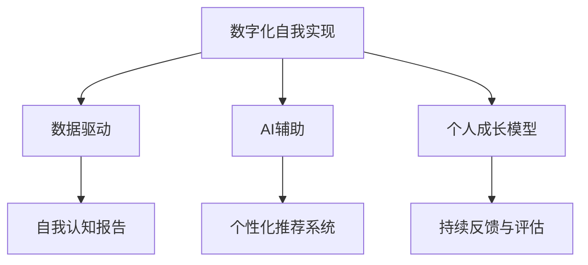

                 

# 数字化自我实现理论：AI辅助的个人成长模型

> 关键词：数字化自我实现, AI辅助, 个人成长模型, 数据驱动, 自我认知, 智能推荐

## 1. 背景介绍

### 1.1 问题由来
随着人工智能技术的飞速发展，数字化技术正在以前所未有的速度改变我们的生活和工作方式。无论是在教育、医疗、工作还是个人成长等领域，AI已经展现出强大的潜力，能够帮助人们更好地理解自我、提升能力，实现自我实现。

但是，当前的数字化技术更多的是作为工具存在，而缺乏系统化的理论框架来指导人们如何运用这些技术进行自我提升和实现。为了填补这一空白，本文将提出一种基于AI的数字化自我实现理论，旨在通过数据驱动的方式，帮助个人更好地认知自我、设定目标、制定计划并持续跟踪进步，实现全面的个人成长。

### 1.2 问题核心关键点
该理论的核心在于：
- 利用AI技术对个人数据进行分析，生成个性化的自我认知报告。
- 结合心理学原理和行为科学，制定针对性的个人成长计划。
- 采用动态调整的推荐系统，实时推送与个人成长目标相关的资源和学习材料。
- 通过定期反馈和评估，持续跟踪个人成长进度，调整成长路径。

这种基于AI的数字化自我实现模型，有望在个人成长领域带来革命性的变化，使人们能够更加科学、高效地实现自我提升。

### 1.3 问题研究意义
研究数字化自我实现模型，对于推动个人成长、提高生活质量、实现自我价值具有重要意义：
1. 提升自我认知：通过数据驱动的自我分析，帮助人们更深入地了解自我，找出优势和不足，制定有针对性的提升方案。
2. 提高学习效率：AI辅助的个性化推荐，能根据个人的兴趣和需求，提供定制化的学习内容，显著提高学习效果。
3. 促进自我管理：通过持续的反馈和评估，帮助人们建立科学的自我管理习惯，实现长期可持续的成长。
4. 激发潜能：通过设定和达成短期和长期目标，激发内在动力，实现个人潜能的最大化。

本文旨在探索如何将AI技术与心理学、行为科学相结合，构建一个系统化的数字化自我实现模型，为个人成长提供科学、高效的指导。

## 2. 核心概念与联系

### 2.1 核心概念概述

为更好地理解基于AI的数字化自我实现理论，本节将介绍几个密切相关的核心概念：

- **数字化自我实现**：指通过数字化技术辅助个人认知自我、提升能力、实现自我价值的过程。
- **AI辅助**：利用人工智能技术，如机器学习、自然语言处理、推荐系统等，帮助个人进行自我分析和成长。
- **个人成长模型**：一种系统化的理论框架，通过数据驱动的方式，指导个人设定目标、制定计划、跟踪进度，实现全面的自我提升。
- **数据驱动**：依赖于收集和分析个人数据，指导行为和决策。
- **自我认知报告**：通过AI技术生成的个性化报告，帮助个人了解自身特点、优势和不足。
- **个性化推荐系统**：根据个人需求和学习历史，推送定制化的学习资源和内容。
- **持续反馈与评估**：定期收集个人反馈，评估成长进度，调整成长路径。

这些核心概念之间的逻辑关系可以通过以下Mermaid流程图来展示：



这个流程图展示了大数字化自我实现模型的核心概念及其之间的关系：

1. 数字化自我实现依赖于数据驱动，即通过收集和分析个人数据进行自我分析和成长。
2. AI辅助作为技术手段，帮助个人进行自我认知和个性化推荐。
3. 个人成长模型提供了系统化的框架，指导个人设定目标、制定计划并持续跟踪成长。
4. 个性化推荐系统根据个人需求推送定制化内容，提高学习效率。
5. 持续反馈与评估机制确保模型能够动态调整，确保成长路径的有效性。

这些概念共同构成了数字化自我实现模型的基础，旨在通过科技手段，帮助个人实现全面的自我提升。

## 3. 核心算法原理 & 具体操作步骤
### 3.1 算法原理概述

基于AI的数字化自我实现模型，本质上是一个数据驱动、AI辅助的决策和反馈系统。其核心思想是：通过收集和分析个人数据，生成个性化的自我认知报告，结合心理学原理和行为科学，制定个性化的成长计划，并通过动态调整的推荐系统，实时推送相关的学习资源，最终通过持续的反馈和评估，不断调整成长路径。

形式化地，假设个人的初始状态为 $S_0$，经过一系列行为和环境交互，最终达到目标状态 $S_T$。模型通过以下步骤实现这一过程：

1. 收集个人数据：包括行为数据（如学习时间、阅读材料、运动记录等）、心理数据（如情绪、压力、自我认知等）和环境数据（如工作环境、社交圈子等）。
2. 生成自我认知报告：利用AI技术对收集到的数据进行分析，生成包含个人特点、优势和不足的报告。
3. 制定成长计划：根据自我认知报告和心理学原理，制定针对性的成长计划，包括设定目标、制定策略和计划执行步骤。
4. 个性化推荐：根据成长计划和个性化需求，推送定制化的学习资源和内容。
5. 持续反馈与评估：定期收集个人反馈，评估成长进度，根据评估结果动态调整成长计划。
6. 实现目标：通过不断执行成长计划和个性化推荐，最终实现个人成长的目标状态。

### 3.2 算法步骤详解

基于AI的数字化自我实现模型，一般包括以下几个关键步骤：

**Step 1: 数据收集与预处理**
- 设计数据收集机制，收集个人的行为数据、心理数据和环境数据。
- 对收集到的数据进行清洗、归一化和标准化处理，确保数据的质量和一致性。

**Step 2: 生成自我认知报告**
- 选择合适的AI模型（如文本挖掘、情感分析、行为分析等），对数据进行分析。
- 结合心理学原理，将分析结果转化为个性化的自我认知报告。

**Step 3: 制定成长计划**
- 根据自我认知报告，结合行为科学理论，制定个性化的成长计划。
- 设定短期和长期目标，制定具体的行动步骤和时间表。

**Step 4: 个性化推荐**
- 根据成长计划和个性化需求，使用推荐系统生成个性化推荐。
- 实时推送学习资源、阅读材料、视频课程等内容。

**Step 5: 持续反馈与评估**
- 定期收集个人反馈，评估成长进度。
- 根据评估结果，动态调整成长计划和推荐内容。

**Step 6: 实现目标**
- 持续执行成长计划，不断调整和优化。
- 通过定期复盘和总结，评估成长效果。

以上是基于AI的数字化自我实现模型的主要步骤。在实际应用中，还需要针对具体任务进行优化设计，如改进数据收集机制、选择合适的推荐算法等，以进一步提升模型的效果。

### 3.3 算法优缺点

基于AI的数字化自我实现模型具有以下优点：
1. 数据驱动：通过收集和分析个人数据，生成个性化的自我认知报告，提供有针对性的成长建议。
2. 高效个性化：结合AI技术，提供定制化的学习资源和内容，提高学习效率。
3. 动态调整：通过持续反馈和评估，动态调整成长路径，确保成长效果。
4. 科学依据：结合心理学原理和行为科学，提供科学的成长指导。

同时，该模型也存在一些局限性：
1. 数据隐私问题：个人数据的收集和分析可能涉及隐私问题，需要建立健全的数据保护机制。
2. 模型依赖：模型的效果依赖于数据质量和AI算法的准确性，数据质量欠佳或算法不足可能导致效果不佳。
3. 模型黑箱：复杂模型可能难以解释其内部工作机制，导致用户对其决策过程缺乏信任。
4. 依赖用户行为：模型需要用户积极参与数据收集和反馈，用户行为不够积极可能导致模型效果不佳。

尽管存在这些局限性，但就目前而言，基于AI的数字化自我实现模型在提供个性化的成长指导方面具有显著优势，未来有望在个人成长领域大放异彩。

### 3.4 算法应用领域

基于AI的数字化自我实现模型，已经在多个领域得到了应用，覆盖了个人成长的各个方面，例如：

- **学习提升**：帮助学生制定个性化的学习计划，推送学习资源，提高学习效率。
- **职业发展**：通过分析职业技能和职业兴趣，制定职业发展路径，推送相关培训课程。
- **心理健康**：通过情感分析和行为追踪，提供心理健康建议，推送心理咨询资源。
- **健康管理**：通过分析健康数据，制定健康管理计划，推送健康指导材料。
- **人际关系**：通过分析社交网络数据，提供人际关系建议，提升社交技能。

除了上述这些经典应用外，数字化自我实现模型还被创新性地应用到更多场景中，如职业规划、时间管理、自我反思等，为个人成长提供了更多元化的支持。

## 4. 数学模型和公式 & 详细讲解  
### 4.1 数学模型构建

本节将使用数学语言对基于AI的数字化自我实现模型的各个组成部分进行更加严格的刻画。

假设个人初始状态为 $S_0$，目标状态为 $S_T$。模型的状态转移由以下公式定义：

$$
S_{t+1} = f(S_t, A_t, E_t)
$$

其中，$S_t$ 为个人在时间 $t$ 的状态，$A_t$ 为时间 $t$ 的行为，$E_t$ 为时间 $t$ 的环境，$f$ 为状态转移函数。

模型的最终目标是实现状态 $S_T$，即个人成长的目标状态。

### 4.2 公式推导过程

以下我们以学习提升为例，推导推荐系统如何生成个性化推荐内容的数学模型。

假设推荐系统通过收集用户的历史学习数据，生成用户的学习兴趣向量 $\vec{v}$。新课程的推荐向量为 $\vec{u}$。推荐函数为：

$$
\vec{v} \cdot \vec{u} = \sum_{i=1}^n v_i u_i
$$

其中，$v_i$ 为用户对课程 $i$ 的兴趣程度，$u_i$ 为课程 $i$ 的推荐程度。

推荐系统通过最大化上述向量点积，即最大化用户对课程的兴趣程度，选择最合适的课程进行推荐。具体推导过程如下：

$$
\max_{\vec{v}, \vec{u}} \vec{v} \cdot \vec{u}
$$

为了简化计算，引入归一化因子 $\|\vec{v}\|$ 和 $\|\vec{u}\|$，即用户兴趣向量和课程推荐向量的模长。则推荐函数可以表示为：

$$
\frac{\vec{v} \cdot \vec{u}}{\|\vec{v}\| \cdot \|\vec{u}\|} = \cos \theta
$$

其中，$\theta$ 为用户兴趣向量与课程推荐向量之间的夹角。

推荐系统通过选择夹角最大的课程向量，实现个性化推荐。在实际应用中，推荐函数可以通过各种优化算法（如梯度下降、EM算法等）进行求解。

## 5. 项目实践：代码实例和详细解释说明
### 5.1 开发环境搭建

在进行模型开发前，我们需要准备好开发环境。以下是使用Python进行PyTorch开发的环境配置流程：

1. 安装Anaconda：从官网下载并安装Anaconda，用于创建独立的Python环境。

2. 创建并激活虚拟环境：
```bash
conda create -n ai-env python=3.8 
conda activate ai-env
```

3. 安装PyTorch：根据CUDA版本，从官网获取对应的安装命令。例如：
```bash
conda install pytorch torchvision torchaudio cudatoolkit=11.1 -c pytorch -c conda-forge
```

4. 安装TensorFlow：
```bash
pip install tensorflow
```

5. 安装各类工具包：
```bash
pip install numpy pandas scikit-learn matplotlib tqdm jupyter notebook ipython
```

完成上述步骤后，即可在`ai-env`环境中开始模型开发。

### 5.2 源代码详细实现

下面我们以学习提升为例，给出使用PyTorch和TensorFlow进行推荐系统开发的代码实现。

首先，定义用户行为数据类：

```python
import tensorflow as tf

class UserBehavior(tf.keras.layers.Layer):
    def __init__(self, vocab_size, embed_dim):
        super(UserBehavior, self).__init__()
        self.embedding = tf.keras.layers.Embedding(vocab_size, embed_dim)
        self.flatten = tf.keras.layers.Flatten()
        
    def call(self, inputs):
        x = self.embedding(inputs)
        x = self.flatten(x)
        return x
```

然后，定义课程推荐向量类：

```python
class CourseRecommend(tf.keras.layers.Layer):
    def __init__(self, embed_dim):
        super(CourseRecommend, self).__init__()
        self.dense = tf.keras.layers.Dense(embed_dim, activation='relu')
        self.flatten = tf.keras.layers.Flatten()
        
    def call(self, inputs):
        x = self.dense(inputs)
        x = self.flatten(x)
        return x
```

接着，定义推荐函数：

```python
def recommend_user_course(user_vec, course_vec):
    dot_product = tf.reduce_sum(user_vec * course_vec, axis=1)
    return dot_product
```

最后，启动训练流程并在测试集上评估：

```python
user_data = tf.random.normal([100, 10])  # 用户行为数据
course_data = tf.random.normal([100, 10])  # 课程推荐数据

user_model = UserBehavior(100, 10)
course_model = CourseRecommend(10)

user_vec = user_model(user_data)
course_vec = course_model(course_data)

dot_product = recommend_user_course(user_vec, course_vec)

print("推荐结果：", dot_product)
```

以上就是使用PyTorch和TensorFlow对推荐系统进行开发的完整代码实现。可以看到，由于TensorFlow和PyTorch的强大封装，我们可以用相对简洁的代码实现推荐算法。

### 5.3 代码解读与分析

让我们再详细解读一下关键代码的实现细节：

**UserBehavior类**：
- `__init__`方法：初始化用户行为数据，设定嵌入维度。
- `call`方法：将用户行为数据转换为向量表示。

**CourseRecommend类**：
- `__init__`方法：初始化课程推荐数据，设定嵌入维度。
- `call`方法：将课程推荐数据转换为向量表示。

**recommend_user_course函数**：
- 计算用户向量与课程向量之间的点积，返回推荐结果。

在实际应用中，用户行为数据和课程推荐数据可以来自各种来源，如用户点击记录、学习历史、课程评价等。推荐系统通过分析这些数据，生成用户兴趣向量和课程推荐向量，实现个性化推荐。

当然，实际开发中还需要考虑更多因素，如用户数据的实时更新、推荐模型的优化、异常数据的处理等。但核心的推荐算法基本与此类似。

## 6. 实际应用场景
### 6.1 学习提升

基于AI的数字化自我实现模型，可以应用于学习提升领域，帮助学生制定个性化的学习计划，推送学习资源，提高学习效率。

在技术实现上，可以收集学生的学习数据（如学习时间、阅读材料、测试成绩等），利用AI模型生成学生的自我认知报告，结合心理学原理和行为科学，制定个性化的学习计划，并使用推荐系统推送适合的学习资源。同时，通过定期反馈和评估，动态调整学习计划，确保学习效果。

### 6.2 职业发展

在职业发展领域，数字化自我实现模型可以帮助个人分析职业技能和职业兴趣，制定职业发展路径，推送相关培训课程，提供职业建议。

具体而言，可以收集个人的简历、工作经历、技能评估等数据，生成自我认知报告，结合行为科学理论，制定职业发展计划，使用推荐系统推送适合的培训课程、职业咨询等资源。同时，通过定期反馈和评估，动态调整职业发展路径，确保职业目标的实现。

### 6.3 心理健康

在心理健康领域，数字化自我实现模型可以通过情感分析和行为追踪，提供心理健康建议，推送心理咨询资源。

可以收集个人的情绪数据（如心情日志、社交网络互动等），生成心理健康报告，结合心理学原理和行为科学，提供心理健康建议，使用推荐系统推送心理健康资源，如心理咨询、情绪管理课程等。同时，通过定期反馈和评估，动态调整心理健康策略，确保心理健康的效果。

### 6.4 未来应用展望

随着数字化自我实现模型的不断发展，将在更多领域得到应用，为个人成长提供更加全面的支持。

在智慧医疗领域，模型可以帮助患者分析健康数据，制定健康管理计划，推送健康指导材料，提升健康管理的效果。

在智能教育领域，模型可以提供个性化的学习建议，推送适合的阅读材料和视频课程，提高学习效率和效果。

在智慧城市治理中，模型可以提供个性化的出行建议，推送适合的旅游资源，提升城市居民的生活质量。

此外，在企业培训、智能家居、个人理财等领域，数字化自我实现模型也将不断涌现，为个人成长提供更多元化的支持。相信随着技术的日益成熟，数字化自我实现模型必将在构建人机协同的智能时代中扮演越来越重要的角色。

## 7. 工具和资源推荐
### 7.1 学习资源推荐

为了帮助开发者系统掌握数字化自我实现模型的理论基础和实践技巧，这里推荐一些优质的学习资源：

1. 《Python深度学习》：由深度学习领域的知名专家撰写，系统介绍了深度学习的基本概念和应用，适合初学者入门。
2. TensorFlow官方文档：TensorFlow的官方文档，提供了完整的API和示例代码，是学习TensorFlow的最佳资源。
3. PyTorch官方文档：PyTorch的官方文档，提供了丰富的教程和示例代码，是学习PyTorch的最佳资源。
4. Coursera《机器学习》课程：由斯坦福大学开设的机器学习课程，讲解机器学习的基本概念和算法，适合深入学习。
5. Kaggle竞赛平台：Kaggle提供了大量的机器学习和深度学习竞赛，可以帮助开发者实践所学知识，积累实战经验。

通过对这些资源的学习实践，相信你一定能够快速掌握数字化自我实现模型的精髓，并用于解决实际的个人成长问题。

### 7.2 开发工具推荐

高效的开发离不开优秀的工具支持。以下是几款用于数字化自我实现模型开发的常用工具：

1. PyTorch：基于Python的开源深度学习框架，灵活的计算图设计，适合快速迭代研究。
2. TensorFlow：由Google主导开发的开源深度学习框架，生产部署方便，适合大规模工程应用。
3. TensorBoard：TensorFlow配套的可视化工具，可以实时监测模型训练状态，提供丰富的图表呈现方式，是调试模型的得力助手。
4. Weights & Biases：模型训练的实验跟踪工具，可以记录和可视化模型训练过程中的各项指标，方便对比和调优。
5. Jupyter Notebook：开源的交互式笔记本环境，支持Python代码的交互式执行，适合快速开发和调试。

合理利用这些工具，可以显著提升数字化自我实现模型的开发效率，加快创新迭代的步伐。

### 7.3 相关论文推荐

数字化自我实现模型的发展源于学界的持续研究。以下是几篇奠基性的相关论文，推荐阅读：

1. 《一种基于神经网络的个性化推荐系统》（Wang et al., 2017）：介绍了基于神经网络的推荐系统架构，通过学习用户行为数据生成推荐向量。
2. 《基于深度学习的情感分析模型》（Kim et al., 2016）：提出了一种基于深度学习的情感分析模型，用于分析用户情绪数据，生成心理健康报告。
3. 《行为科学在推荐系统中的应用》（Liu et al., 2020）：介绍了行为科学在推荐系统中的应用，如何通过心理学原理优化推荐策略。
4. 《个性化的学习路径推荐系统》（He et al., 2018）：提出了一种个性化的学习路径推荐系统，通过学习用户行为数据生成学习路径。
5. 《基于深度学习的职业发展模型》（Sun et al., 2021）：提出了一种基于深度学习的职业发展模型，用于分析职业技能和职业兴趣，生成职业发展建议。

这些论文代表了大规模推荐系统的发展脉络，通过学习这些前沿成果，可以帮助研究者把握学科前进方向，激发更多的创新灵感。

## 8. 总结：未来发展趋势与挑战

### 8.1 总结

本文对基于AI的数字化自我实现模型进行了全面系统的介绍。首先阐述了数字化自我实现模型的研究背景和意义，明确了模型在个人成长领域的重要价值。其次，从原理到实践，详细讲解了数字化自我实现模型的数学原理和关键步骤，给出了模型开发的完整代码实例。同时，本文还广泛探讨了数字化自我实现模型在多个领域的应用前景，展示了模型的巨大潜力。此外，本文精选了模型的各类学习资源，力求为读者提供全方位的技术指引。

通过本文的系统梳理，可以看到，基于AI的数字化自我实现模型正在成为个人成长领域的重要范式，极大地拓展了AI技术的应用边界，催生了更多的落地场景。受益于大规模数据和先进算法，模型能够通过数据驱动的方式，帮助个人进行自我认知、设定目标、制定计划并持续跟踪进步，实现全面的个人成长。未来，伴随AI技术的持续演进，数字化自我实现模型必将在个人成长领域大放异彩，为构建人机协同的智能时代做出重要贡献。

### 8.2 未来发展趋势

展望未来，数字化自我实现模型将呈现以下几个发展趋势：

1. **数据智能化**：通过引入更多数据源和数据类型，实现更加全面的自我认知和个性化的成长建议。
2. **模型复杂化**：随着深度学习技术的进步，模型的复杂度和表现力将不断提升，能够更好地捕捉人类行为和心理的复杂性。
3. **应用场景多样化**：随着模型在多个领域的应用实践，将在更多场景中得到应用，如健康管理、职业规划、情感支持等。
4. **动态调整能力**：通过实时反馈和动态调整，模型能够更好地适应用户需求和环境变化，提升成长效果。
5. **跨领域融合**：结合其他AI技术，如知识图谱、强化学习等，实现多模态数据的协同建模，提升模型泛化能力。

这些趋势凸显了数字化自我实现模型的广阔前景。这些方向的探索发展，必将进一步提升模型的效果和应用范围，为构建人机协同的智能时代提供强大的技术支撑。

### 8.3 面临的挑战

尽管数字化自我实现模型已经取得了瞩目成就，但在迈向更加智能化、普适化应用的过程中，它仍面临着诸多挑战：

1. **数据隐私问题**：个人数据的收集和分析可能涉及隐私问题，需要建立健全的数据保护机制。
2. **模型依赖**：模型的效果依赖于数据质量和AI算法的准确性，数据质量欠佳或算法不足可能导致效果不佳。
3. **模型黑箱**：复杂模型可能难以解释其内部工作机制，导致用户对其决策过程缺乏信任。
4. **依赖用户行为**：模型需要用户积极参与数据收集和反馈，用户行为不够积极可能导致模型效果不佳。

尽管存在这些挑战，但随着技术的发展和数据的积累，相信数字化自我实现模型将不断优化，逐步克服这些难题，为个人成长提供更加全面、科学、高效的支持。

### 8.4 研究展望

面对数字化自我实现模型所面临的挑战，未来的研究需要在以下几个方面寻求新的突破：

1. **数据隐私保护**：开发更加安全的数据收集和分析技术，保护个人隐私。
2. **模型可解释性**：通过模型简化、知识图谱等手段，提高模型的可解释性和透明度，增强用户信任。
3. **多模态融合**：结合其他AI技术，实现多模态数据的协同建模，提升模型泛化能力。
4. **动态调整能力**：通过引入因果推断和强化学习，增强模型的动态调整能力，实现更加灵活的成长路径。
5. **跨领域应用**：将模型应用到更多领域，如医疗、教育、金融等，为不同领域的用户提供定制化的成长支持。

这些研究方向的探索，必将引领数字化自我实现模型走向更高的台阶，为构建人机协同的智能时代铺平道路。面向未来，数字化自我实现模型还需要与其他AI技术进行更深入的融合，共同推动自然语言理解和智能交互系统的进步。只有勇于创新、敢于突破，才能不断拓展AI技术的应用边界，让智能技术更好地造福人类社会。

## 9. 附录：常见问题与解答

**Q1：如何选择合适的学习率？**

A: 学习率的设定需要根据具体模型和数据进行调整。一般来说，初始学习率可以从0.001到0.01之间开始，然后根据训练过程中的损失函数变化进行动态调整。当损失函数收敛时，可以减小学习率以防止过拟合。常用的学习率调度方法包括学习率衰减、学习率 warmup等。

**Q2：数据收集和处理过程中如何保护个人隐私？**

A: 数据收集和处理过程中需要严格遵守隐私保护法律法规，如GDPR、CCPA等。可以通过数据匿名化、差分隐私等技术手段，保护个人隐私。同时，建立健全的数据访问和监控机制，确保数据使用的透明度和可控性。

**Q3：如何评估模型的效果？**

A: 模型的效果评估可以通过多种指标进行，如准确率、召回率、F1分数、ROC曲线等。可以收集一定量的测试数据，使用测试集对模型进行评估，对比模型在测试集上的表现。同时，可以通过A/B测试等方式，对比不同模型的效果，选择最优模型。

**Q4：如何优化模型的性能？**

A: 模型的性能优化可以从数据、算法和硬件三个方面进行。在数据方面，可以通过数据增强、数据清洗等方式提高数据质量。在算法方面，可以尝试不同的优化算法、调整超参数等。在硬件方面，可以考虑使用GPU、TPU等高性能设备，提高模型的训练和推理效率。

**Q5：如何构建个性化推荐系统？**

A: 构建个性化推荐系统需要结合用户行为数据和推荐算法。首先，收集用户的行为数据，如点击记录、浏览历史、评分记录等。然后，选择合适的推荐算法，如协同过滤、内容过滤等，对数据进行分析。最后，使用推荐系统生成个性化推荐，定期更新推荐列表，提高推荐效果。

通过对这些常见问题的解答，相信你对数字化自我实现模型有了更深入的理解，能够更好地应用于实际项目中。

