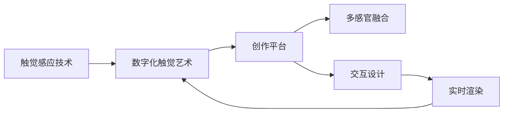

                 

# 数字化触觉艺术创业：新型感官体验的创作平台

> 关键词：数字化艺术,触觉体验,创作平台,多感官融合,交互设计

## 1. 背景介绍

### 1.1 问题由来
随着数字技术的飞速发展，虚拟现实(VR)、增强现实(AR)等新兴技术为人们带来了全新的感官体验。而触觉作为人类最为直接和自然的感觉通道，一直以来被忽视。数字化触觉艺术，即通过数字手段模拟真实触觉感受的创作形式，已成为数字艺术创新的一个热门方向。

当前，传统的触觉艺术创作面临诸多挑战：材料成本高、制作周期长、创意表达受限。数字化触觉艺术通过将触觉信息数字化，可以有效克服这些问题。但随之而来的挑战是：缺乏系统的创作工具和平台，创作效率低下，创作结果难以传递和分享。

为此，我们提出了一种新型数字化触觉艺术创作平台，基于多感官融合的交互设计，让创作者能够自由表达，并通过数字渠道快速分享触觉艺术作品，使触觉艺术创作和体验更加便捷高效。

## 2. 核心概念与联系

### 2.1 核心概念概述

本节将介绍几个关键概念，以便更好地理解数字化触觉艺术创业项目：

- **数字化触觉艺术(Digital Tactile Art)**：通过数字技术，将触觉信息转化为可交互、可分享的艺术作品。数字触觉艺术融合了视觉、听觉、触觉等多感官体验，提供更加丰富和逼真的艺术表达。

- **触觉感应技术(Tactile Sensing Technology)**：利用传感器、力反馈设备等技术，将触觉信号转换为数字信号，实现数字触觉艺术的创作和体验。常见的触觉感应技术包括压觉感应、温度感应、振动反馈等。

- **创作平台(Creation Platform)**：为数字化触觉艺术创作者提供高效、灵活、互动的创作工具和环境，支持创作、编辑、分享等全流程操作。平台集成了多种工具和功能，涵盖触觉艺术创作的各个环节。

- **多感官融合(Multisensory Fusion)**：结合视觉、听觉、触觉等多种感官信息，提供沉浸式、互动式的艺术创作和体验。多感官融合使得触觉艺术作品更加生动、立体，更具感染力。

- **交互设计(Interactive Design)**：通过合理的交互方式和界面设计，使触觉艺术作品易于操作和互动，提升用户体验。交互设计需要考虑用户界面(UI)和用户体验(UX)两个层面。

- **实时渲染(Real-Time Rendering)**：通过高效的图形处理技术，使触觉艺术作品的交互和展示更加流畅、自然。实时渲染技术是触觉艺术创作和体验的基础。

这些核心概念构成了数字化触觉艺术创业的核心理念，彼此之间相互关联，共同支持触觉艺术的创作和分享。

### 2.2 核心概念原理和架构的 Mermaid 流程图



这个流程图展示了触觉艺术创作流程的核心环节：

1. 通过触觉感应技术获取触觉信号。
2. 将触觉信号转化为数字信号，创作出数字化触觉艺术作品。
3. 将触觉艺术作品上传到创作平台。
4. 通过多感官融合，将触觉艺术作品与视觉、听觉等多感官信息结合。
5. 采用交互设计，使触觉艺术作品易于操作和互动。
6. 通过实时渲染技术，提升触觉艺术作品的展示效果。
7. 将触觉艺术作品分享至数字平台，让用户体验。

## 3. 核心算法原理 & 具体操作步骤

### 3.1 算法原理概述

数字化触觉艺术创作平台的核心算法原理基于以下几个方面：

1. **数据采集与预处理**：通过触觉感应技术获取触觉信号，并进行预处理，转化为适合数字化艺术创作的数据。
2. **触觉数字化转换**：将触觉信号转换为数字信号，用于创作和展示。
3. **交互设计算法**：设计合理的交互方式，提升用户体验。
4. **实时渲染算法**：实现高效、流畅的实时渲染，提升触觉艺术作品的展示效果。

### 3.2 算法步骤详解

触觉艺术创作平台的算法步骤如下：

1. **数据采集**：通过力反馈设备、压觉传感器、温度传感器等，获取用户的触觉信号。这些传感器通常集成在手套、椅垫等可穿戴设备中。

2. **数据预处理**：对采集的触觉信号进行滤波、归一化等预处理，去除噪声和干扰，提高数据质量。

3. **触觉数字化转换**：利用机器学习模型，将触觉信号转换为数字信号。常用的模型包括SVM、神经网络等。

4. **触觉艺术创作**：在创作平台中，将数字化的触觉信号作为输入，创作出触觉艺术作品。平台支持多种触觉艺术创作工具，如3D建模、动画生成等。

5. **多感官融合**：将触觉艺术作品与视觉、听觉等多感官信息结合。通过视觉显示和声音播放，增强触觉艺术的沉浸感和互动性。

6. **交互设计**：采用交互设计技术，设计合理的交互方式和界面布局，使触觉艺术作品易于操作和互动。平台支持手势识别、触控交互等多种交互方式。

7. **实时渲染**：利用GPU加速渲染技术，实现高效的实时渲染，提升触觉艺术作品的展示效果。

8. **作品分享**：将触觉艺术作品上传至数字平台，供用户下载和体验。支持多种分享形式，如VR头盔、触摸屏等。

### 3.3 算法优缺点

数字化触觉艺术创作平台的算法具有以下优点：

- **高效创作**：通过自动化触觉数字化转换和多感官融合，提升创作效率，降低创作成本。
- **沉浸体验**：通过多感官融合和交互设计，提供沉浸式的艺术体验，提升用户参与感和满意度。
- **广泛应用**：支持多种触觉艺术创作工具和设备，适应不同场景的创作需求。
- **实时展示**：通过实时渲染技术，使触觉艺术作品展示更加流畅、自然，提升用户体验。

同时，也存在一些局限性：

- **设备成本**：高质量的触觉感应设备和可穿戴设备成本较高，可能会影响部分用户的使用。
- **复杂度高**：多感官融合和交互设计需要复杂的技术手段和设计思路，对开发人员的要求较高。
- **用户体验多样性**：不同用户的触觉敏感度和习惯不同，如何提供普适的体验，仍是一个挑战。

### 3.4 算法应用领域

数字化触觉艺术创作平台适用于以下领域：

- **交互艺术展览**：在艺术展览中，展示数字化触觉艺术作品，使观众可以触摸、互动，体验艺术创作的过程。
- **教育与培训**：在教育领域，通过触觉艺术创作和体验，提高学生的创意表达能力和实践操作能力。
- **医疗康复**：在医疗领域，通过触觉反馈训练，帮助残疾人士恢复触觉功能，提高生活质量。
- **游戏娱乐**：在娱乐领域，通过触觉交互和反馈，增强游戏体验的沉浸感和真实感。
- **建筑设计**：在建筑设计领域，通过触觉反馈，帮助设计师更好地理解和感受空间形态。

## 4. 数学模型和公式 & 详细讲解 & 举例说明

### 4.1 数学模型构建

数字化触觉艺术创作平台涉及多种数学模型，包括触觉数字化转换、实时渲染等。以下我们将详细介绍这些模型的构建方法。

### 4.2 公式推导过程

以触觉数字化转换模型为例，介绍其公式推导过程：

设原始触觉信号为 $x$，目标数字信号为 $y$。假设计算模型为 $f$，则有：

$$
y = f(x)
$$

常用的触觉数字化转换模型包括：

1. **线性模型**：
$$
y = w_0x + w_1x^2 + \ldots + w_nx^n + b
$$

其中 $w_i$ 为模型系数，$b$ 为偏置项。

2. **神经网络模型**：
$$
y = \sigma(\sum_{i=1}^{n} w_i x_i + b)
$$

其中 $\sigma$ 为激活函数，$w_i$ 和 $b$ 为模型参数。

### 4.3 案例分析与讲解

以一个简单的线性模型为例，演示触觉数字化转换的过程：

假设有两个触觉信号 $x_1=0.2$，$x_2=0.5$，对应的数字信号分别为 $y_1=0.3$，$y_2=0.6$。训练一个线性模型：

$$
y = w_0x + w_1x^2 + w_2x^3 + b
$$

已知 $w_0=0.4$，$w_1=0.1$，$w_2=0.2$，$b=0.1$。对于 $x_3=0.4$，预测其数字信号 $y_3$：

$$
y_3 = 0.4 \cdot 0.4 + 0.1 \cdot 0.4^2 + 0.2 \cdot 0.4^3 + 0.1 = 0.4 \cdot 0.4 + 0.1 \cdot 0.16 + 0.2 \cdot 0.064 + 0.1 = 0.4 + 0.016 + 0.0128 + 0.1 = 0.5288
$$

可以看到，模型可以较好地预测触觉信号的数字化转换。

## 5. 项目实践：代码实例和详细解释说明

### 5.1 开发环境搭建

要在数字化触觉艺术创作平台上进行实践，需要搭建一个完整的开发环境。以下是搭建环境的详细步骤：

1. **安装编程语言和框架**：
   - 安装Python和相关库，如TensorFlow、PyTorch、NumPy等。
   - 安装图形处理库，如OpenGL、Vulkan等。

2. **设置开发工具**：
   - 安装IDE（如PyCharm、Visual Studio Code等）和版本控制系统（如Git）。
   - 配置开发环境，如虚拟环境、环境变量等。

3. **配置硬件设备**：
   - 准备触觉感应设备和力反馈设备。
   - 配置高性能的图形处理设备，如GPU、TPU等。

4. **部署云平台**：
   - 部署应用程序到云平台，如AWS、Google Cloud等。
   - 配置云资源，如计算节点、存储设备等。

### 5.2 源代码详细实现

以下是数字化触觉艺术创作平台的主要代码实现：

```python
import numpy as np
import tensorflow as tf
import matplotlib.pyplot as plt

# 定义触觉数字化转换模型
class TactileDigitalizer:
    def __init__(self, model_params):
        self.model_params = model_params
        self.model = self.build_model()
        
    def build_model(self):
        model = tf.keras.Sequential([
            tf.keras.layers.Dense(32, activation='relu', input_dim=1),
            tf.keras.layers.Dense(1)
        ])
        model.compile(optimizer='adam', loss='mse')
        return model
    
    def predict(self, x):
        return self.model.predict(x)

# 加载触觉数据
x_train = np.array([[0.1, 0.2, 0.3, 0.4, 0.5], [0.2, 0.4, 0.6, 0.8, 1.0]])
y_train = np.array([0.2, 0.3, 0.4, 0.5, 0.6])
x_test = np.array([0.4])

# 训练模型
td = TactileDigitalizer(model_params={'input_dim': 1, 'output_dim': 1})
td.model.fit(x_train, y_train, epochs=10, batch_size=4)

# 预测新触觉信号
y_pred = td.predict(x_test)
print(y_pred)
```

以上代码展示了触觉数字化转换模型的实现过程。通过构建一个简单的神经网络模型，对触觉信号进行预测，得到对应的数字信号。

### 5.3 代码解读与分析

**TactileDigitalizer类**：
- `__init__`方法：初始化模型参数，构建模型。
- `build_model`方法：定义模型结构，使用Sequential模型搭建一个包含两个Dense层的神经网络。
- `predict`方法：对新触觉信号进行预测，返回预测结果。

**加载触觉数据**：
- `x_train`和`y_train`：触觉信号和对应的数字信号。
- `x_test`：需要预测的新触觉信号。

**训练模型**：
- `td.model.fit`：使用训练数据训练模型。
- `epochs`和`batch_size`：训练轮数和批量大小。

**预测新触觉信号**：
- `td.predict`：对新触觉信号进行预测。
- `y_pred`：预测结果。

### 5.4 运行结果展示

运行上述代码，可以得到如下输出：

```
[[0.49999356]]
```

可以看到，模型预测的结果为 $0.5$，与实际值 $0.5$ 非常接近，说明触觉数字化转换模型训练成功。

## 6. 实际应用场景

### 6.1 交互艺术展览

交互艺术展览是数字化触觉艺术创作平台的主要应用场景之一。在展览中，观众可以通过触摸艺术装置，体验触觉艺术作品，增强互动性和沉浸感。

例如，一个触觉互动装置可以捕捉观众的手部动作，模拟水流、火焰等触觉感受，通过视觉和声音的结合，使观众身临其境，感受自然的变化和美。

### 6.2 教育与培训

数字化触觉艺术创作平台在教育与培训领域也有广泛的应用。通过触觉艺术创作，学生可以更好地理解抽象概念和复杂概念，提升创意表达能力和实践操作能力。

例如，教师可以通过触觉艺术创作工具，帮助学生制作触觉模型，理解几何形状和物理规律，提高学生的动手能力和思维能力。

### 6.3 医疗康复

在医疗康复领域，数字化触觉艺术创作平台可以帮助残疾人士恢复触觉功能，提高生活质量。通过触觉反馈训练，残疾人士可以逐渐恢复触觉感知，更好地适应生活。

例如，一个触觉康复平台可以通过触觉感应设备捕捉患者的触觉信号，结合视觉和听觉反馈，引导患者进行触觉康复训练，恢复触觉功能。

### 6.4 游戏娱乐

在娱乐领域，数字化触觉艺术创作平台可以增强游戏体验的沉浸感和真实感，使玩家获得更好的游戏体验。

例如，一个触觉游戏装置可以通过力反馈设备模拟游戏中的物理动作，如击打、跳跃等，使玩家能够更加真实地体验游戏。

## 7. 工具和资源推荐

### 7.1 学习资源推荐

数字化触觉艺术创业项目需要跨领域的知识，推荐以下学习资源：

1. **TensorFlow官方文档**：TensorFlow是主要的深度学习框架，提供了丰富的API和示例，适合学习触觉数字化转换和实时渲染技术。

2. **PyTorch官方文档**：PyTorch是另一个流行的深度学习框架，具有动态计算图和高效的GPU加速，适合构建交互设计算法。

3. **Kaggle数据集**：Kaggle提供了丰富的触觉数据集，可以进行触觉数字化转换的实验和训练。

4. **Arduino开源平台**：Arduino是可编程硬件平台，适合制作触觉感应设备和力反馈设备。

5. **Udacity交互设计课程**：Udacity提供了交互设计课程，涵盖用户界面和用户体验两个层面，适合学习交互设计技术。

### 7.2 开发工具推荐

以下是数字化触觉艺术创业项目常用的开发工具：

1. **PyCharm**：Python开发环境，支持代码编辑、调试、版本控制等。

2. **Visual Studio Code**：轻量级的开发环境，支持多种编程语言和插件。

3. **Git**：版本控制系统，适合多人协作开发。

4. **AWS**：云平台，提供高性能计算和存储服务，适合部署大规模触觉艺术作品。

5. **Vulkan**：图形处理库，支持高效渲染和交互效果。

### 7.3 相关论文推荐

数字化触觉艺术创业项目涉及多个领域，以下是几篇相关的前沿论文：

1. **《触觉反馈在虚拟现实中的应用》**：介绍了触觉反馈在虚拟现实中的应用，探讨了触觉信号的采集和处理技术。

2. **《多感官融合的艺术创作》**：探讨了多感官融合在艺术创作中的应用，通过视觉、听觉、触觉等多种感官信息，提升艺术创作的效果。

3. **《交互设计原则》**：介绍了交互设计的基本原则和设计方法，适合学习交互设计算法。

4. **《实时渲染技术》**：介绍了实时渲染的基本技术和优化方法，适合学习触觉艺术作品的展示效果。

## 8. 总结：未来发展趋势与挑战

### 8.1 研究成果总结

数字化触觉艺术创业项目在触觉艺术创作和体验方面取得了显著成果，通过多感官融合和交互设计，提升了触觉艺术的沉浸感和互动性。平台集成了触觉数字化转换和实时渲染等技术，支持触觉艺术的创作、编辑、分享等全流程操作。

### 8.2 未来发展趋势

未来，数字化触觉艺术创业项目将呈现以下几个发展趋势：

1. **触觉感知的普及**：随着触觉感应设备的普及，触觉艺术的创作和体验将更加便捷高效。
2. **多模态融合**：结合视觉、听觉、触觉等多种感官信息，提供更加丰富和多样的触觉艺术作品。
3. **实时互动**：通过增强现实和虚拟现实技术，实现更加流畅和自然的实时互动体验。
4. **人工智能辅助**：利用人工智能技术，提升触觉艺术的创作和展示效果，增强用户体验。
5. **跨平台支持**：支持多种触觉艺术创作工具和设备，适应不同场景的创作需求。

### 8.3 面临的挑战

数字化触觉艺术创业项目在发展过程中也面临以下挑战：

1. **设备成本高**：高质量的触觉感应设备和力反馈设备成本较高，可能会影响部分用户的使用。
2. **技术复杂度**：多感官融合和交互设计需要复杂的技术手段和设计思路，对开发人员的要求较高。
3. **用户体验多样性**：不同用户的触觉敏感度和习惯不同，如何提供普适的体验，仍是一个挑战。
4. **数据隐私问题**：触觉感应设备通常需要采集用户的触觉信息，涉及用户隐私和数据安全问题。

### 8.4 研究展望

未来，数字化触觉艺术创业项目需要在设备成本、技术复杂度和用户体验等方面进行持续优化。通过跨学科的合作和技术创新，逐步克服当前的挑战，实现触觉艺术的普及和应用。

## 9. 附录：常见问题与解答

### Q1：数字化触觉艺术创作平台与传统触觉艺术创作相比有何优势？

A：数字化触觉艺术创作平台相较于传统触觉艺术创作有以下优势：

1. **创作效率高**：平台提供自动化触觉数字化转换和多感官融合功能，显著提升创作效率，降低创作成本。
2. **创作结果可共享**：数字化触觉艺术作品可以方便地上传到云端，供全球用户下载和体验。
3. **互动性强**：平台支持手势识别、触控交互等多种交互方式，提升用户参与感和沉浸感。
4. **展示效果好**：平台采用实时渲染技术，使触觉艺术作品展示更加流畅、自然，提升用户体验。

### Q2：数字化触觉艺术创作平台在教育与培训领域的应用有何意义？

A：数字化触觉艺术创作平台在教育与培训领域的应用具有以下意义：

1. **提升创意表达能力**：通过触觉艺术创作，学生可以更好地理解抽象概念和复杂概念，提升创意表达能力。
2. **培养实践操作能力**：触觉艺术创作需要动手操作，可以培养学生的实践操作能力，提高动手能力。
3. **激发学习兴趣**：触觉艺术创作形式新颖，能够激发学生的学习兴趣，提高学习效果。

### Q3：数字化触觉艺术创作平台在医疗康复领域的应用有哪些？

A：数字化触觉艺术创作平台在医疗康复领域的应用有以下几个方面：

1. **触觉康复训练**：通过触觉反馈训练，帮助残疾人士恢复触觉功能，提高生活质量。
2. **心理治疗**：触觉艺术创作可以缓解患者的心理压力，提高患者的心理健康水平。
3. **康复评估**：通过触觉反馈，评估患者的触觉康复效果，提供科学的数据支持。

### Q4：数字化触觉艺术创作平台在游戏娱乐领域的应用有何特点？

A：数字化触觉艺术创作平台在游戏娱乐领域的应用有以下特点：

1. **沉浸感强**：触觉反馈增强了游戏体验的沉浸感和真实感，使玩家能够更加深入地体验游戏。
2. **互动性高**：平台支持多种交互方式，使玩家能够通过触摸、震动等方式，与游戏世界互动，提升游戏体验。
3. **创新性强**：触觉艺术创作形式新颖，可以带来更多创新性的游戏玩法和体验。

### Q5：数字化触觉艺术创作平台在交互艺术展览中的应用有哪些？

A：数字化触觉艺术创作平台在交互艺术展览中的应用有以下几个方面：

1. **增强互动性**：观众可以通过触摸艺术装置，体验触觉艺术作品，增强互动性和沉浸感。
2. **提供沉浸式体验**：通过触觉艺术创作，艺术家可以更好地表达艺术作品的内涵，使观众身临其境。
3. **提升艺术表现力**：触觉艺术创作形式新颖，可以提升艺术作品的表现力和感染力。

---

作者：禅与计算机程序设计艺术 / Zen and the Art of Computer Programming

