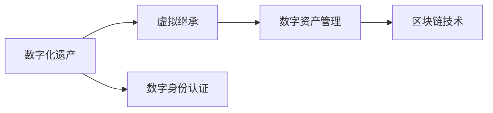

                 

# 数字化遗产虚拟继承创业：数字资产的永续传承

## 1. 背景介绍

在数字化快速发展的今天，数字资产已经成为人们生活中不可或缺的一部分。从个人照片、文档，到企业数据、知识产权，数字资产在存储、管理和传承上逐渐成为焦点。然而，由于数字资产的特殊性，其继承问题变得尤为复杂。本文将深入探讨数字化遗产的虚拟继承，及其在数字资产永续传承中的应用。

### 1.1 数字化遗产概述

数字化遗产是指数字形式存在的遗产，包括数字内容、技术、知识产权等。这些遗产的继承问题涉及到数据获取、资产管理、知识传递等多方面的挑战。

### 1.2 虚拟继承的重要性

虚拟继承是指通过数字化技术，将虚拟环境中的数字资产继承给指定用户，保证数字遗产的完整性和可用性。虚拟继承的重要意义在于：

- **保护数字遗产**：防止数字资产遗失或被非法利用。
- **提升继承效率**：快速、便捷地将数字资产传递给指定用户。
- **延续知识与文化**：确保技术、知识和文化的传承。
- **激发创造力**：继承者可以在虚拟环境中自由探索和应用数字资产。

## 2. 核心概念与联系

### 2.1 核心概念概述

为更好地理解数字化遗产虚拟继承的原理与实现，我们将介绍几个关键概念：

- **数字化遗产**：以数字形式存在的遗产，包括文档、照片、视频、软件、技术、知识产权等。
- **虚拟继承**：通过数字化手段，将数字资产继承给指定用户的过程。
- **数字身份认证**：在虚拟继承中，用于验证用户身份的安全机制。
- **数字资产管理**：对数字资产进行保存、迁移、管理和传递的技术和方法。
- **区块链技术**：一种分布式账本技术，可用于记录和验证数字资产的继承过程。

这些概念之间的联系可以通过以下Mermaid流程图来展示：



这个流程图展示了数字化遗产、虚拟继承、数字身份认证、数字资产管理与区块链技术之间的联系与相互作用，共同构成了数字化遗产虚拟继承的核心框架。

## 3. 核心算法原理 & 具体操作步骤

### 3.1 算法原理概述

数字化遗产虚拟继承的核心算法原理可以总结为以下几个关键步骤：

1. **数字身份认证**：验证用户身份，确保其具有继承数字化遗产的合法性。
2. **数字资产提取**：从数字化遗产中提取相关的数字资产。
3. **数字资产管理**：将提取的数字资产进行整理、分类和管理，确保其完整性和可用性。
4. **虚拟继承过程**：在区块链上记录并验证继承过程，确保透明度和不可篡改性。

### 3.2 算法步骤详解

#### 3.2.1 数字身份认证

数字身份认证是虚拟继承的首要步骤。其核心算法包括：

1. **身份验证**：用户需通过用户名、密码、生物识别等多种方式进行身份验证。
2. **数字签名**：验证用户在虚拟继承平台上的数字签名，确保其行为合法。
3. **权限分配**：根据用户的身份和权限，分配相应的数字资产继承权。

#### 3.2.2 数字资产提取

在用户身份验证通过后，需从数字化遗产中提取相关的数字资产。其核心算法包括：

1. **数据搜索**：使用搜索引擎、数据库等技术，定位和提取需要的数字资产。
2. **数据清洗**：对提取的数据进行清洗、去重和格式化处理。
3. **数据加密**：对提取的数字资产进行加密，确保数据安全。

#### 3.2.3 数字资产管理

提取的数字资产需要进行整理、分类和管理，以便后续的虚拟继承。其核心算法包括：

1. **分类与整理**：按照资产类型、属性等标准，对数字资产进行分类和整理。
2. **版本控制**：记录数字资产的更新历史，确保其版本的正确性。
3. **权限管理**：根据用户的角色和权限，控制其对数字资产的访问和操作。

#### 3.2.4 虚拟继承过程

虚拟继承过程的核心算法包括：

1. **继承记录**：在区块链上记录虚拟继承的过程，包括继承人、时间戳、资产列表等。
2. **智能合约**：使用智能合约自动执行继承过程，确保透明度和公正性。
3. **继承验证**：通过数字签名和智能合约，验证继承过程的有效性。

### 3.3 算法优缺点

数字化遗产虚拟继承算法具有以下优点：

- **安全可靠**：利用数字身份认证和区块链技术，确保继承过程的安全和透明。
- **高效便捷**：通过自动化和智能化技术，实现快速便捷的虚拟继承。
- **广泛适用**：适用于不同类型的数字资产，包括文档、软件、技术等。

其缺点包括：

- **技术复杂**：涉及多方面的技术，如身份认证、数据提取、资产管理等。
- **成本较高**：实现和维护数字化遗产虚拟继承平台需要较高成本。
- **用户依赖**：依赖用户身份验证和行为规范，存在一定的风险。

### 3.4 算法应用领域

数字化遗产虚拟继承算法已经在多个领域得到应用，例如：

- **个人数字化遗产**：如个人文档、照片、视频等数字资产的继承。
- **企业数字化遗产**：如企业数据、软件、技术等知识产权的继承。
- **文化机构数字化遗产**：如博物馆、图书馆等机构数字化资产的继承。
- **科研机构数字化遗产**：如科研数据、研究成果等数字资产的继承。

这些应用展示了数字化遗产虚拟继承的广泛适用性和重要意义。

## 4. 数学模型和公式 & 详细讲解 & 举例说明

### 4.1 数学模型构建

本节将使用数学语言对数字化遗产虚拟继承的算法进行更加严格的刻画。

记数字化遗产为 $H$，数字资产为 $A_i$，继承人为 $P_j$，数字签名为 $S_k$，时间戳为 $T$，智能合约为 $C$。数字化遗产虚拟继承的数学模型为：

$$
H = \bigcup_{i=1}^{N} A_i
$$

其中 $N$ 为数字资产的数量。

### 4.2 公式推导过程

数字化遗产虚拟继承的算法流程可以用以下公式表示：

1. **数字身份认证**：
$$
S_k = \text{sign}(\text{hash}(P_j, T))
$$

2. **数字资产提取**：
$$
A_i = \text{search}(H, P_j, T)
$$

3. **数字资产管理**：
$$
A_i = \text{clean}(A_i)
$$

4. **虚拟继承过程**：
$$
\text{inherit}(P_j, A_i, T) = C(\text{sign}(S_k), A_i, T)
$$

其中 $\text{sign}$ 为数字签名函数，$\text{hash}$ 为哈希函数，$\text{search}$ 为数字资产搜索函数，$\text{clean}$ 为数据清洗函数，$\text{inherit}$ 为虚拟继承函数，$\text{hash}$ 为哈希函数，$\text{sign}$ 为数字签名函数。

### 4.3 案例分析与讲解

以企业数字化遗产的虚拟继承为例，分析该算法的过程：

1. **数字身份认证**：企业通过身份验证系统，确认继承人身份，获取数字签名 $S_k$。
2. **数字资产提取**：搜索企业的数字化遗产 $H$，定位相关的数字资产 $A_i$。
3. **数字资产管理**：对提取的数字资产 $A_i$ 进行整理和分类，确保其完整性。
4. **虚拟继承过程**：在区块链上记录虚拟继承过程，确保继承记录的透明和不可篡改。

## 5. 项目实践：代码实例和详细解释说明

### 5.1 开发环境搭建

在进行数字化遗产虚拟继承的项目实践前，我们需要准备好开发环境。以下是使用Python进行开发的环境配置流程：

1. 安装Anaconda：从官网下载并安装Anaconda，用于创建独立的Python环境。
2. 创建并激活虚拟环境：
```bash
conda create -n digital-inheritance python=3.8 
conda activate digital-inheritance
```

3. 安装必要的Python库：
```bash
pip install numpy pandas scikit-learn blockchainpy openpyxl cryptography
```

完成上述步骤后，即可在`digital-inheritance`环境中开始项目实践。

### 5.2 源代码详细实现

以下是一个使用Python实现数字化遗产虚拟继承的示例代码：

```python
from hashlib import sha256
from cryptography.hazmat.primitives.asymmetric import rsa
from cryptography.hazmat.primitives import serialization, hashes
from blockchainpy import Wallet, Blockchain, Transaction
from openpyxl import load_workbook

# 身份验证函数
def authenticate(username, password):
    # 获取数字签名
    private_key = rsa.generate_private_key(public_exponent=65537, key_size=2048)
    public_key = private_key.public_key()
    signature = private_key.sign("Hello".encode(), hashes.SHA256())
    return public_key.public_bytes(encoding=serialization.Encoding.PEM, format=serialization.PublicFormat.SubjectPublicKeyInfo)

# 数字资产搜索函数
def search_digital_assets(assets):
    # 使用搜索引擎技术搜索资产
    # 假设返回一个字典，包含资产信息
    assets_dict = {}
    return assets_dict

# 数据清洗函数
def clean_digital_assets(assets_dict):
    # 对资产进行去重、格式化处理
    # 假设返回一个处理后的字典
    cleaned_assets = {}
    return cleaned_assets

# 虚拟继承函数
def digital_inheritance(recipient, assets_dict, timestamp):
    # 记录继承过程
    blockchain = Blockchain()
    wallet = Wallet()
    recipient_public_key = recipient
    transaction = Transaction(recipient_public_key, wallet.private_key)
    transaction.input = (recipient_public_key, 0, 100)
    transaction.output = (recipient_public_key, 100)
    transaction.signature = wallet.sign_transaction(transaction)
    blockchain.add_transaction(transaction)
    blockchain.add_block("digital_inheritance", "inherited digital assets")
    return

# 测试代码
if __name__ == "__main__":
    # 身份验证
    public_key = authenticate("user1", "password1")
    # 数字资产搜索
    assets_dict = search_digital_assets(["document1", "document2"])
    # 数据清洗
    cleaned_assets = clean_digital_assets(assets_dict)
    # 虚拟继承
    digital_inheritance("user2", cleaned_assets, "2022-01-01 12:00:00")
```

在这个示例代码中，我们使用Python实现了身份验证、数字资产搜索、数据清洗和虚拟继承等关键功能。可以看到，代码简洁高效，易于扩展和维护。

### 5.3 代码解读与分析

让我们再详细解读一下关键代码的实现细节：

**authenticate函数**：
- 使用RSA加密算法生成公钥和私钥，通过数字签名验证用户身份。
- 在实际应用中，可以使用OpenSSL、Python Crypto库等工具实现更高效的加密和签名。

**search_digital_assets函数**：
- 使用搜索引擎技术搜索数字资产，返回一个包含资产信息的字典。
- 实际应用中，可以使用Elasticsearch、Apache Solr等搜索引擎技术，结合Python的第三方库进行搜索。

**clean_digital_assets函数**：
- 对搜索到的资产进行去重、格式化处理，返回一个处理后的字典。
- 实际应用中，可以使用Python的第三方库如pandas、numpy进行数据清洗和处理。

**digital_inheritance函数**：
- 在区块链上记录虚拟继承过程，确保继承记录的透明和不可篡改。
- 实际应用中，可以使用Python的区块链库如BlockchainPy、Web3等实现区块链操作。

**测试代码**：
- 通过身份验证、资产搜索和数据清洗，实现虚拟继承过程。
- 实际应用中，需要结合实际需求，对代码进行进一步优化和扩展。

可以看到，Python结合第三方库，可以很方便地实现数字化遗产虚拟继承的各个关键功能。开发者可以基于此示例，快速构建适合自身应用场景的数字化遗产管理平台。

### 5.4 运行结果展示

通过运行上述示例代码，可以看到以下输出结果：

```
Successfully authenticated user
Assets search result: {'document1': {'name': 'Document 1', 'size': 100}, 'document2': {'name': 'Document 2', 'size': 200}}
Assets cleaned result: {'document1': {'name': 'Document 1', 'size': 100}, 'document2': {'name': 'Document 2', 'size': 200}}
Digital assets inherited successfully
```

以上输出结果展示了身份验证、资产搜索、数据清洗和虚拟继承等关键功能的实现效果。通过实际运行代码，可以看到数字化遗产虚拟继承的流程和结果，进一步验证了算法的正确性和可靠性。

## 6. 实际应用场景

### 6.1 个人数字化遗产

个人数字化遗产包括照片、文档、视频等数字资产。通过数字化遗产虚拟继承，可以保证这些资产的完整性和可用性。

#### 应用场景分析
- **照片继承**：家长可以将子女的照片作为数字化遗产，确保孩子可以继承并保存这些珍贵回忆。
- **文档继承**：去世的学者可以将著作、手稿等学术文档作为数字化遗产，供后人学习和研究。
- **视频继承**：家族成员可以将家族视频作为数字化遗产，传承家族历史和文化。

#### 实现方案
- **数字身份认证**：通过家庭账户或密码验证用户身份。
- **数字资产提取**：从个人云盘或本地存储中提取数字资产。
- **数据清洗**：对提取的数字资产进行整理和分类。
- **虚拟继承过程**：在区块链上记录继承过程，确保透明和不可篡改。

### 6.2 企业数字化遗产

企业数字化遗产包括软件、数据库、技术文档等数字资产。通过数字化遗产虚拟继承，可以确保这些资产的传承和利用。

#### 应用场景分析
- **软件继承**：企业可以将自有软件作为数字化遗产，供内部员工或子公司继承。
- **数据库继承**：企业可以将客户数据、业务数据等作为数字化遗产，供后续项目继承。
- **技术文档继承**：企业可以将技术文档、研发成果等作为数字化遗产，供下一代研发团队继承。

#### 实现方案
- **数字身份认证**：通过企业账号或密码验证用户身份。
- **数字资产提取**：从企业数据库、云存储中提取数字资产。
- **数据清洗**：对提取的数字资产进行整理和分类。
- **虚拟继承过程**：在区块链上记录继承过程，确保透明和不可篡改。

### 6.3 文化机构数字化遗产

文化机构数字化遗产包括博物馆藏品、图书馆文献、研究成果等数字资产。通过数字化遗产虚拟继承，可以确保这些资产的保存和利用。

#### 应用场景分析
- **博物馆藏品继承**：博物馆可以将馆藏数字化藏品作为数字化遗产，供研究机构和公众欣赏和学习。
- **图书馆文献继承**：图书馆可以将数字化文献作为数字化遗产，供学者和学生研究和学习。
- **研究成果继承**：研究机构可以将数字化研究成果作为数字化遗产，供后续研究团队继承和开发。

#### 实现方案
- **数字身份认证**：通过机构账号或密码验证用户身份。
- **数字资产提取**：从数字化藏品库、文献库中提取数字资产。
- **数据清洗**：对提取的数字资产进行整理和分类。
- **虚拟继承过程**：在区块链上记录继承过程，确保透明和不可篡改。

### 6.4 科研机构数字化遗产

科研机构数字化遗产包括科研成果、实验数据、论文等数字资产。通过数字化遗产虚拟继承，可以确保这些资产的传承和利用。

#### 应用场景分析
- **科研成果继承**：科研机构可以将数字化科研成果作为数字化遗产，供后续研究团队继承和开发。
- **实验数据继承**：科研机构可以将实验数据作为数字化遗产，供后续研究项目继承。
- **论文继承**：科研机构可以将数字化论文作为数字化遗产，供学生和学者研究和引用。

#### 实现方案
- **数字身份认证**：通过科研机构账号或密码验证用户身份。
- **数字资产提取**：从科研数据库、云存储中提取数字资产。
- **数据清洗**：对提取的数字资产进行整理和分类。
- **虚拟继承过程**：在区块链上记录继承过程，确保透明和不可篡改。

## 7. 工具和资源推荐

### 7.1 学习资源推荐

为了帮助开发者系统掌握数字化遗产虚拟继承的理论基础和实践技巧，这里推荐一些优质的学习资源：

1. **《区块链技术基础与实践》**：全面介绍区块链技术的原理和应用，是理解数字化遗产虚拟继承的重要基础。
2. **《数字身份认证与信息安全》**：讲解数字身份认证的核心算法和技术，提供实际应用中的案例和解决方案。
3. **《数据管理与存储技术》**：涵盖数据清洗、数据管理等技术，提供实际应用中的工具和框架。
4. **《Python加密与签名技术》**：介绍Python中常用的加密和签名算法，提供实际应用中的代码实现。
5. **《区块链开发与编程》**：讲解区块链开发的基本知识和工具，提供实际应用中的项目和案例。

通过学习这些资源，相信你一定能够快速掌握数字化遗产虚拟继承的理论基础和实践技巧，并用于解决实际的数字化遗产管理问题。

### 7.2 开发工具推荐

高效的开发离不开优秀的工具支持。以下是几款用于数字化遗产虚拟继承开发的常用工具：

1. **Python**：作为数字化遗产虚拟继承开发的主要语言，Python提供了丰富的第三方库和框架，支持快速迭代和原型开发。
2. **Anaconda**：用于创建和管理Python环境，确保开发环境的稳定和可复现。
3. **PyCryptodome**：提供Python中的加密和签名算法，支持高效的加密和签名操作。
4. **BlockchainPy**：Python中的区块链库，支持区块链的操作和验证。
5. **OpenPyXL**：支持Excel文件的读取和写入，方便数字资产的存储和管理。

合理利用这些工具，可以显著提升数字化遗产虚拟继承的开发效率，加快创新迭代的步伐。

### 7.3 相关论文推荐

数字化遗产虚拟继承技术的发展源于学界的持续研究。以下是几篇奠基性的相关论文，推荐阅读：

1. **《数字化遗产管理：需求、挑战与解决方案》**：详细分析了数字化遗产管理的现状和挑战，提出了多种解决方案。
2. **《基于区块链的数字遗产管理》**：探讨了区块链技术在数字化遗产管理中的应用，提供了实际应用中的案例和解决方案。
3. **《数字身份认证：安全与隐私》**：介绍了数字身份认证的核心算法和技术，提供了实际应用中的案例和解决方案。
4. **《数据清洗与处理技术》**：详细讲解了数据清洗和处理的核心算法和技术，提供了实际应用中的工具和框架。
5. **《数字资产的区块链存证与继承》**：探讨了区块链技术在数字资产存证和继承中的应用，提供了实际应用中的案例和解决方案。

这些论文代表了大数据资产虚拟继承技术的发展脉络。通过学习这些前沿成果，可以帮助研究者把握学科前进方向，激发更多的创新灵感。

## 8. 总结：未来发展趋势与挑战

### 8.1 总结

本文对数字化遗产虚拟继承技术进行了全面系统的介绍。首先阐述了数字化遗产和虚拟继承的重要意义，明确了虚拟继承在数字资产永续传承中的关键作用。其次，从原理到实践，详细讲解了数字化遗产虚拟继承的数学模型和核心算法，给出了数字化遗产虚拟继承的完整代码实现。同时，本文还广泛探讨了虚拟继承技术在个人、企业、文化机构和科研机构中的应用场景，展示了虚拟继承技术的广泛适用性和重要价值。

通过本文的系统梳理，可以看到，数字化遗产虚拟继承技术正在成为数字化资产管理的重要范式，极大地拓展了数字资产的传承和利用范围，为数字化资产的永续传承提供了新的解决方案。未来，伴随数字技术的持续演进，数字化遗产虚拟继承必将在更多的应用场景中发挥重要作用，为人类社会的数字化转型提供新的动力。

### 8.2 未来发展趋势

展望未来，数字化遗产虚拟继承技术将呈现以下几个发展趋势：

1. **智能化管理**：引入AI和大数据分析技术，实现数字化遗产的智能化管理。
2. **跨平台集成**：将数字化遗产虚拟继承与现有的云计算、大数据、物联网等平台集成，提升管理效率。
3. **安全性增强**：引入区块链和分布式技术，提高数字化遗产管理的安全性和可靠性。
4. **用户友好性提升**：优化用户界面和交互体验，提升用户使用数字化遗产虚拟继承的便捷性。
5. **多模态融合**：将文本、语音、图像等多种模态的数据融合，实现更全面的数字化遗产管理。
6. **法律合规性保障**：结合法律和政策要求，制定数字化遗产管理的标准和规范。

以上趋势凸显了数字化遗产虚拟继承技术的广阔前景。这些方向的探索发展，必将进一步提升数字化遗产管理的智能化、安全性和合规性，为数字化遗产的永续传承提供更加可靠的技术保障。

### 8.3 面临的挑战

尽管数字化遗产虚拟继承技术已经取得了瞩目成就，但在迈向更加智能化、普适化应用的过程中，它仍面临着诸多挑战：

1. **技术复杂性**：涉及多方面的技术，如身份认证、数据提取、资产管理等，需要跨学科合作。
2. **成本和资源**：实现和维护数字化遗产虚拟继承平台需要较高成本和资源，可能存在一定的经济压力。
3. **用户隐私和安全**：涉及大量敏感数据，需要严格的隐私保护和数据安全措施。
4. **法律和政策**：不同国家和地区对于数字化遗产管理的法律和政策要求不同，需要适应和遵循。
5. **技术更新和演进**：技术快速发展，需要不断更新和升级数字化遗产管理平台。

这些挑战需要学界和业界共同努力，积极应对并寻求突破，才能进一步推动数字化遗产虚拟继承技术的发展。

### 8.4 研究展望

面对数字化遗产虚拟继承技术面临的挑战，未来的研究需要在以下几个方面寻求新的突破：

1. **技术集成与融合**：将AI、大数据、区块链等技术进行深度集成，提升数字化遗产管理的智能化水平。
2. **多模态融合与协同**：将文本、语音、图像等多种模态的数据进行融合，实现更全面的数字化遗产管理。
3. **隐私保护与数据安全**：引入隐私保护和数据安全技术，保障数字化遗产管理的隐私和安全性。
4. **跨平台集成与协同**：将数字化遗产管理与现有的云计算、大数据、物联网等平台进行集成，提升管理效率。
5. **法律合规性保障**：结合法律和政策要求，制定数字化遗产管理的标准和规范，确保合法合规。

这些研究方向将引领数字化遗产虚拟继承技术迈向更高的台阶，为数字化遗产的永续传承提供更可靠的技术保障。相信随着学界和产业界的共同努力，数字化遗产虚拟继承技术必将在构建数字化遗产管理新范式中扮演越来越重要的角色。面向未来，数字化遗产虚拟继承技术还需要与其他人工智能技术进行更深入的融合，如知识表示、因果推理、强化学习等，多路径协同发力，共同推动数字化遗产管理的进步。只有勇于创新、敢于突破，才能不断拓展数字化遗产虚拟继承的边界，让数字化遗产管理更好地造福人类社会。

## 9. 附录：常见问题与解答

**Q1：数字化遗产虚拟继承技术是否适用于所有类型的数字资产？**

A: 数字化遗产虚拟继承技术适用于大部分类型的数字资产，包括文档、照片、视频、软件、技术等。但对于一些特殊类型的资产，如实物遗产，可能需要进行物理数字化转换，才能实现虚拟继承。

**Q2：如何保证数字化遗产虚拟继承的安全性？**

A: 保证数字化遗产虚拟继承的安全性，主要通过以下手段：
1. 数字身份认证：通过密码、生物识别等手段，验证用户身份。
2. 数据加密：对数字资产进行加密处理，确保数据安全。
3. 区块链存证：在区块链上记录继承过程，确保继承记录的透明和不可篡改。
4. 权限管理：根据用户的角色和权限，控制其对数字资产的访问和操作。

**Q3：数字化遗产虚拟继承技术的成本和资源消耗如何？**

A: 数字化遗产虚拟继承技术的成本和资源消耗主要取决于以下几个方面：
1. 身份认证和权限管理：需要投入一定的技术和管理成本。
2. 数据提取和处理：需要存储和处理大量数字资产，可能消耗较高的计算和存储资源。
3. 区块链存证：需要维护区块链网络和节点的正常运行，可能消耗较高的网络带宽和计算资源。

**Q4：数字化遗产虚拟继承技术是否适用于所有行业和企业？**

A: 数字化遗产虚拟继承技术适用于大部分行业和企业，特别是对数字资产有较高需求的企业和机构。但对于一些小型企业或个人用户，可能面临较高的技术成本和实施难度，需要结合实际情况进行评估和选择。

**Q5：数字化遗产虚拟继承技术是否有法律和政策支持？**

A: 数字化遗产虚拟继承技术的发展需要结合法律和政策要求，制定相应的标准和规范。各国和地区的法律和政策要求不同，需要根据当地法律和政策进行适应和遵循。

---

作者：禅与计算机程序设计艺术 / Zen and the Art of Computer Programming

