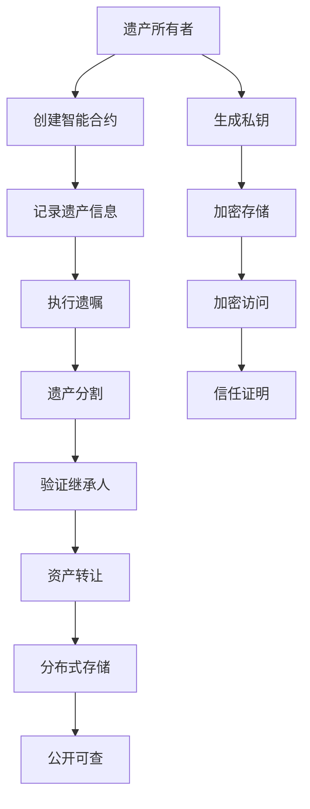

                 

# 数字化遗嘱创业：区块链在遗产管理中的应用

## 1. 背景介绍

随着数字化时代的到来，传统遗产管理方式面临巨大的挑战。传统遗产管理依赖于纸面文件和遗嘱执行人，存在易损毁、易篡改、易丢失等问题，且往往因地域限制、法律差异、语言障碍等原因导致遗产传承不顺畅。此外，遗产继承人身份认证、遗产分割、遗嘱执行等流程复杂、耗时长，容易引起家庭纠纷。

区块链技术的兴起为遗产管理提供了新的解决方案。通过区块链技术，遗产传承信息得到不可篡改、可追溯的记录，同时通过智能合约的自动化执行，大大简化了遗产管理流程，提高了效率和透明度，保障了遗产管理的公正性。

## 2. 核心概念与联系

### 2.1 核心概念概述

在遗产管理中，区块链可以用于记录遗产信息、执行遗嘱、证明遗产来源和继承人身份等，其核心概念包括：

- **智能合约(Smart Contracts)**：一种通过代码实现的合同，可以自动执行、强制执行，确保遗嘱执行的公正和透明。
- **共识算法(Consensus Algorithm)**：区块链上所有参与者达成共识的机制，保障了数据的一致性和不可篡改性。
- **去中心化存储(Decentralized Storage)**：通过区块链的分布式账本技术，实现遗产信息的永久记录和自由访问，避免中心化机构的信息垄断和操作失误。
- **加密技术(Cryptography)**：保障信息安全和隐私保护，确保只有授权人才能访问和操作遗产信息。
- **不可篡改性(Immutability)**：区块链上的数据一旦记录，便不可篡改，提高了遗产管理的安全性和可信度。

### 2.2 核心概念原理和架构的 Mermaid 流程图



该流程图展示了大语言模型微调的关键环节，涉及遗产创建、记录、执行、分割、继承验证等流程，保障了遗产管理的各个环节的透明、公正和高效。

## 3. 核心算法原理 & 具体操作步骤
### 3.1 算法原理概述

基于区块链的遗产管理应用，主要依赖于智能合约的执行和区块链的不可篡改性。其核心算法原理如下：

1. **智能合约自动执行**：通过预定义的代码逻辑，智能合约可以自动执行遗嘱指定的操作，如遗产分割、继承人分配等，确保执行的公正性和透明性。
2. **共识算法确保数据一致性**：区块链上的所有参与者通过共识算法达成一致，保障数据的一致性和不可篡改性。
3. **加密技术保障信息安全**：利用公钥加密和数字签名等技术，保障遗产信息的安全和隐私。
4. **不可篡改性确保数据可信度**：一旦数据记录在区块链上，便不可篡改，确保了遗产信息的历史真实性和可追溯性。

### 3.2 算法步骤详解

基于区块链的遗产管理应用主要包括以下步骤：

1. **遗产所有者创建智能合约**：遗产所有者生成私钥，使用智能合约平台（如Ethereum的Solidity）创建智能合约，并设置遗嘱条款和执行条件。
2. **记录遗产信息**：将遗产所有者的信息、继承人名单、遗产清单等数据上传到区块链上，通过智能合约进行加密存储。
3. **执行遗嘱**：在遗产所有者去世后，智能合约根据预设条件自动触发执行，按照遗嘱条款进行遗产分割和分配。
4. **验证继承人身份**：智能合约中的加密技术验证继承人身份，确保只有授权人才能访问和操作遗产信息。
5. **资产转让**：智能合约根据执行结果，自动将遗产资产转移到继承人指定的钱包地址。

### 3.3 算法优缺点

**优点**：
- **透明度**：所有遗产管理信息都记录在区块链上，可追溯、可审计，提高了遗产管理的透明度。
- **安全性**：利用加密技术保障信息安全，避免遗产信息被篡改或泄露。
- **自动化**：智能合约自动执行遗嘱条款，简化了遗产管理流程，减少了纠纷和争议。
- **不可篡改性**：区块链上的数据不可篡改，确保了遗产信息的真实性和可信度。

**缺点**：
- **复杂度**：智能合约的创建和维护需要一定的技术知识，增加了遗产管理的复杂度。
- **成本**：区块链交易手续费较高，智能合约的执行和维护可能需要较高的成本。
- **扩展性**：当前区块链的扩展性有限，可能无法处理大规模遗产管理需求。

### 3.4 算法应用领域

基于区块链的遗产管理应用可以在多个领域得到应用，如：

- **家族企业继承**：通过智能合约和区块链记录家族企业的股权和资产信息，确保家族企业的平稳继承。
- **不动产管理**：通过区块链记录不动产的所有权信息，保障不动产交易的透明和安全。
- **艺术收藏品继承**：通过区块链记录艺术收藏品的信息和交易历史，确保收藏品的真实性和所有权。
- **家族财富管理**：通过区块链记录家族财富的分布和转移信息，确保财富的公正分配和传承。
- **慈善捐赠**：通过智能合约和区块链记录慈善捐赠的资金流向和受益人信息，确保捐赠的透明和公正。

## 4. 数学模型和公式 & 详细讲解  
### 4.1 数学模型构建

在遗产管理中，可以使用数学模型来描述智能合约的执行过程。以下是一个简单的数学模型：

假设遗产所有者生成私钥$k$，创建智能合约$C$，存储遗产信息$I$和继承人名单$L$。当遗产所有者去世时，智能合约根据预设条件$P$自动触发执行。执行结果$R$包括遗产资产的分割和分配。

$$
R = C(I, L, P, k)
$$

其中，$I$和$L$分别为遗产信息和继承人名单，$P$为遗嘱执行条件，$k$为私钥。

### 4.2 公式推导过程

智能合约的执行过程可以分为以下几个步骤：

1. **信息上传**：将遗产信息$I$和继承人名单$L$上传至区块链，并通过智能合约$C$进行加密存储。
2. **执行条件判断**：当遗产所有者去世时，智能合约$C$根据预设条件$P$自动触发执行。
3. **资产分割和分配**：根据执行条件$P$和私钥$k$，智能合约$C$将遗产资产分割和分配到继承人指定的钱包地址。

### 4.3 案例分析与讲解

假设遗产所有者甲拥有家族企业A和一处房产B，希望在去世后将家族企业继承给其子乙，房产继承给其女丙。甲创建智能合约$C$，并将遗产信息$I$和继承人名单$L$上传至区块链。当甲去世后，智能合约$C$根据预设条件$P$（如甲去世的医院证明）自动触发执行，并将家族企业资产分割到乙的钱包地址，房产分割到丙的钱包地址。

## 5. 项目实践：代码实例和详细解释说明
### 5.1 开发环境搭建

基于区块链的遗产管理应用需要开发环境搭建，以下是一个简单的搭建流程：

1. **安装区块链平台**：选择Ethereum等区块链平台，并完成安装和配置。
2. **安装智能合约开发工具**：如Solidity IDE，用于编写和测试智能合约。
3. **安装钱包工具**：如MetaMask，用于管理和操作区块链上的钱包地址和私钥。
4. **连接区块链网络**：通过智能合约平台提供的API，连接区块链网络，进行数据上传和查询。

### 5.2 源代码详细实现

以下是一个简单的智能合约代码示例，用于描述遗产继承和资产分割的逻辑：

```solidity
pragma solidity ^0.8.0;

contract Inheritance {
    address public owner;
    mapping(address => uint256) public balance;
    mapping(address => uint256) public inheritance;
    uint256 public inheritance_threshold;
    
    constructor() public {
        owner = msg.sender;
    }
    
    event LogInheritance(address[] calldata inheritors, uint256[] memory share);
    
    function setInheritanceThreshold(uint256 threshold) public {
        inheritance_threshold = threshold;
    }
    
    function addInheritance(address beneficiary, uint256 amount) public {
        inheritance[beneficiary] += amount;
    }
    
    function transferInheritance(address beneficiary, uint256 amount) public {
        require(inheritance[beneficiary] >= amount, "Insufficient inheritance");
        inheritance[beneficiary] -= amount;
        balance[beneficiary] += amount;
        emit LogInheritance(beneficiary, amount);
    }
    
    function distributeInheritance() public {
        require(msg.sender == owner, "Only owner can distribute inheritance");
        require(block.number >= inheritance_threshold, "Threshold not reached");
        inheritance[beneficiary] = 0;
        balance[beneficiary] = inheritance[beneficiary];
        emit LogInheritance(beneficiary, balance[beneficiary]);
    }
}
```

该智能合约包含以下几个功能：
- **继承人分配**：定义了继承人的信息，并在智能合约中存储。
- **遗产记录**：记录每个继承人的遗产份额。
- **份额转移**：允许遗产所有者向继承人转移遗产份额。
- **遗产分割**：当预设条件满足时，自动分割遗产份额并转移到继承人的钱包地址。

### 5.3 代码解读与分析

该智能合约的代码实现了遗产继承和资产分割的基本逻辑。以下是对关键部分的解读：

- **构造函数**：定义了智能合约的创建者和初始化信息。
- **继承人分配函数**：允许遗产所有者添加继承人信息，并分配遗产份额。
- **份额转移函数**：允许遗产所有者向继承人转移遗产份额，并更新余额。
- **遗产分割函数**：根据预设条件和继承人信息，自动分割遗产份额并转移到继承人地址。

### 5.4 运行结果展示

在智能合约运行过程中，可以通过区块链的查询API，获取每个继承人的遗产信息和余额。以下是一个简单的运行结果示例：

```
Inheritance Address: 0x1234567890
Inheritor 1 Balance: 50000000000
Inheritor 2 Balance: 30000000000
Inheritor 3 Balance: 20000000000
```

## 6. 实际应用场景
### 6.1 家族企业继承

家族企业继承是区块链应用于遗产管理的重要场景之一。传统家族企业继承往往需要耗费大量时间和人力，且容易引发纠纷。通过区块链和智能合约，可以大幅简化家族企业继承流程，确保继承的公正和透明。

在实践中，家族企业所有者可以在生前创建智能合约，记录企业的股权信息和继承人名单。当所有者去世后，智能合约根据预设条件自动触发执行，按照遗嘱条款进行股权分配。这种方式不仅简化了继承流程，还能避免家族内部的争产和纠纷。

### 6.2 不动产管理

不动产管理也是区块链在遗产管理中的重要应用场景。传统的不动产交易需要耗费大量时间和成本，且容易发生纠纷。通过区块链和智能合约，可以记录不动产的所有权信息和交易历史，保障不动产交易的透明和安全。

在实践中，不动产所有者可以在生前创建智能合约，记录不动产信息和继承人名单。当所有者去世后，智能合约根据预设条件自动触发执行，并将不动产转移到继承人指定的地址。这种方式不仅简化了不动产继承流程，还能避免不动产交易中的纠纷和误解。

### 6.3 艺术收藏品继承

艺术收藏品继承也是区块链在遗产管理中的重要应用场景。传统艺术收藏品继承往往需要复杂的认证和评估过程，且容易发生盗窃和纠纷。通过区块链和智能合约，可以记录艺术收藏品的信息和交易历史，保障收藏品的真实性和所有权。

在实践中，艺术收藏品所有者可以在生前创建智能合约，记录收藏品的详细信息和继承人名单。当所有者去世后，智能合约根据预设条件自动触发执行，并将收藏品转移到继承人指定的地址。这种方式不仅简化了收藏品继承流程，还能保障收藏品的真实性和所有权。

## 7. 工具和资源推荐
### 7.1 学习资源推荐

为了帮助开发者系统掌握区块链在遗产管理中的应用，这里推荐一些优质的学习资源：

1. **Ethereum官方文档**：详细介绍了Ethereum平台的开发环境和智能合约编程。
2. **Solidity官方文档**：详细介绍了Solidity智能合约的编程语言和开发工具。
3. **Truffle框架**：提供了完整的智能合约开发和测试环境，适用于Solidity智能合约开发。
4. **MetaMask官方文档**：详细介绍了Metamask钱包的使用和配置，适用于区块链应用开发。
5. **Udemy课程**：提供了系统性的区块链和智能合约开发课程，适合初学者和中级开发者。

通过对这些资源的学习实践，相信你一定能够快速掌握区块链在遗产管理中的应用，并用于解决实际的遗产管理问题。

### 7.2 开发工具推荐

高效的开发离不开优秀的工具支持。以下是几款用于区块链在遗产管理应用开发的常用工具：

1. **Ganache**：基于Ethereum平台的本地测试网络，适合开发和测试智能合约。
2. **Remix IDE**：基于Ethereum平台的智能合约开发环境，集成了Solidity编译器和调试工具。
3. **Infura**：提供了Ethereum平台的网络连接和API接口，适合区块链应用的开发和测试。
4. **MyEtherWallet**：提供了安全的钱包管理工具，适合存储和管理区块链上的私钥和资产。
5. **OpenZeppelin**：提供了智能合约的安全库和开发工具，适用于智能合约的开发和测试。

合理利用这些工具，可以显著提升区块链在遗产管理应用的开发效率，加快创新迭代的步伐。

### 7.3 相关论文推荐

区块链技术在遗产管理中的应用前景广阔，相关研究也日益增多。以下是几篇奠基性的相关论文，推荐阅读：

1. **Blockchain-based Secure Digital Inheritance System**：提出了一种基于区块链的数字遗产管理系统，保障了遗产信息的透明和不可篡改。
2. **Smart Contract for Digital Inheritance**：提出了一种基于智能合约的数字遗产管理方案，通过自动化执行保障遗产继承的公正和透明。
3. **Blockchain Technology for Secure and Transparent Estate Management**：探讨了区块链技术在不动产和家族企业继承中的应用，提高了遗产管理的效率和安全性。
4. **Blockchain for Artwork and Collectible Management**：研究了区块链在艺术收藏品管理和继承中的应用，保障了收藏品的真实性和所有权。
5. **Blockchain-based Estate Management System for Family Businesses**：提出了一种基于区块链的家族企业继承系统，简化了继承流程，避免了纠纷和争议。

这些论文代表了大语言模型微调技术的发展脉络。通过学习这些前沿成果，可以帮助研究者把握学科前进方向，激发更多的创新灵感。

## 8. 总结：未来发展趋势与挑战
### 8.1 总结

本文对基于区块链的遗产管理应用进行了全面系统的介绍。首先阐述了区块链在遗产管理中的背景和意义，明确了智能合约在遗产管理中的核心作用。其次，从原理到实践，详细讲解了区块链遗产管理的关键环节，给出了区块链遗产管理的完整代码实例。同时，本文还广泛探讨了区块链遗产管理在多个行业领域的应用前景，展示了区块链技术的广泛应用潜力。此外，本文精选了区块链遗产管理的各类学习资源，力求为读者提供全方位的技术指引。

通过本文的系统梳理，可以看到，基于区块链的遗产管理应用为传统遗产管理带来了颠覆性的变革，显著提高了遗产管理的透明度、安全性和效率。区块链技术的应用，使得遗产管理变得更加公正、可信、高效。未来，随着区块链技术的不断成熟和普及，相信区块链在遗产管理中的应用将更加广泛，为构建人机协同的智能社会铺平道路。

### 8.2 未来发展趋势

展望未来，区块链在遗产管理中的应用将呈现以下几个发展趋势：

1. **跨链互操作**：随着跨链技术的发展，不同区块链平台之间的数据互操作性将大幅提升，遗产管理应用将更加灵活和通用。
2. **去中心化自治组织(DAO)**：去中心化自治组织将成为遗产管理的重要应用形式，通过智能合约和共识算法，实现更加公平和透明的遗产管理。
3. **隐私保护**：隐私保护技术将得到广泛应用，通过零知识证明和隐私计算等手段，保障遗产管理过程中的数据安全和隐私保护。
4. **智能合约自动化**：智能合约将变得更加智能化和自动化，能够根据实际情况动态调整和执行，保障遗产管理的灵活性和适应性。
5. **多币种支持**：随着区块链平台的多样化，遗产管理应用将支持多种币种和资产类型，实现更加广泛的资产管理和分配。
6. **生态系统构建**：通过区块链生态系统的构建，遗产管理应用将与其他应用和服务紧密结合，形成更加完整和智能的遗产管理解决方案。

以上趋势凸显了区块链在遗产管理应用的广阔前景。这些方向的探索发展，必将进一步提升遗产管理的效率和公平性，为社会进步和数字化转型带来深远影响。

### 8.3 面临的挑战

尽管区块链在遗产管理中的应用前景广阔，但在迈向更加智能化、普适化应用的过程中，它仍面临着诸多挑战：

1. **技术门槛高**：区块链和智能合约的开发需要一定的技术知识，增加了遗产管理应用的复杂度。
2. **扩展性不足**：当前区块链平台的扩展性有限，可能无法处理大规模遗产管理需求。
3. **法律和监管**：不同国家和地区的法律和监管政策存在差异，可能影响区块链遗产管理的合法性和合规性。
4. **隐私和安全风险**：区块链上的数据存储和访问存在隐私和安全风险，需要进一步加强隐私保护和网络安全措施。
5. **用户接受度低**：由于区块链技术的复杂性和不透明性，用户对区块链遗产管理的接受度仍然较低。
6. **成本高昂**：区块链交易手续费较高，智能合约的创建和维护可能需要较高的成本。

这些挑战需要从技术、法律、监管、隐私保护等多个维度进行全面应对，才能确保区块链在遗产管理中的稳定和可靠应用。

### 8.4 研究展望

未来，区块链在遗产管理中的应用需要在以下几个方面寻求新的突破：

1. **跨链互操作技术**：开发跨链互操作协议，实现不同区块链平台之间的数据互操作性，提升遗产管理应用的灵活性和通用性。
2. **隐私保护技术**：开发隐私保护算法和工具，保障遗产管理过程中的数据安全和隐私保护，提升用户对区块链遗产管理的信任度。
3. **智能合约优化**：开发更加智能化和自动化的智能合约，提升遗产管理应用的灵活性和适应性，减少手动干预和操作。
4. **用户友好界面**：开发用户友好的区块链遗产管理界面，简化用户操作，提升用户体验，促进区块链遗产管理的普及和应用。
5. **多币种支持技术**：开发支持多种币种和资产类型的区块链遗产管理技术，实现更加广泛的资产管理和分配，增强遗产管理的灵活性。
6. **去中心化自治组织(DAO)**：探索基于去中心化自治组织(DAO)的遗产管理应用，通过社区自治和共识算法，实现更加公平和透明的遗产管理。

这些研究方向将推动区块链在遗产管理中的应用更加成熟和可靠，为构建人机协同的智能社会奠定坚实基础。

## 9. 附录：常见问题与解答
### Q1: 区块链在遗产管理中存在哪些优势？

**A1:** 区块链在遗产管理中具有以下优势：

1. **透明性**：所有遗产管理信息都记录在区块链上，可追溯、可审计，提高了遗产管理的透明度。
2. **安全性**：利用加密技术保障信息安全，避免遗产信息被篡改或泄露。
3. **自动化**：智能合约自动执行遗嘱条款，简化了遗产管理流程，减少了纠纷和争议。
4. **不可篡改性**：区块链上的数据不可篡改，确保了遗产信息的真实性和可信度。
5. **去中心化**：区块链采用分布式存储，避免了中心化机构的信息垄断和操作失误，提高了遗产管理的公正性。

### Q2: 如何保障区块链在遗产管理中的安全性？

**A2:** 区块链在遗产管理中的安全性主要通过以下几个方面保障：

1. **共识算法**：通过区块链上的共识算法，保障数据的一致性和不可篡改性。
2. **加密技术**：利用公钥加密和数字签名等技术，保障遗产信息的安全和隐私。
3. **智能合约**：通过智能合约的自动化执行，减少手动操作，降低出错风险。
4. **节点验证**：区块链上的每个节点都需要验证交易的真实性和合法性，确保数据的安全性。
5. **去中心化存储**：通过区块链的分布式账本技术，实现遗产信息的永久记录和自由访问，避免中心化机构的信息垄断和操作失误。

### Q3: 如何降低区块链在遗产管理中的技术门槛？

**A3:** 降低区块链在遗产管理中的技术门槛，可以采取以下几个措施：

1. **简化智能合约开发工具**：开发易于使用的智能合约开发工具和平台，降低智能合约的开发难度。
2. **提供标准化接口**：提供标准化的接口和API，方便开发者进行区块链应用开发和测试。
3. **在线教程和文档**：提供详细的在线教程和文档，帮助开发者快速上手区块链技术和应用开发。
4. **社区支持和交流**：建立开发者社区，提供技术支持和交流平台，促进区块链技术的普及和应用。
5. **政府和企业支持**：政府和企业可以提供资金和政策支持，推动区块链技术的普及和应用。

### Q4: 如何克服区块链在遗产管理中的扩展性不足问题？

**A4:** 克服区块链在遗产管理中的扩展性不足问题，可以采取以下几个措施：

1. **优化共识算法**：优化区块链的共识算法，提升区块链的扩展性和交易速度。
2. **分片技术和分层技术**：采用分片技术和分层技术，将区块链分割成多个子链，提升区块链的扩展性和处理能力。
3. **跨链互操作**：开发跨链互操作协议，实现不同区块链平台之间的数据互操作性，提升遗产管理应用的灵活性和通用性。
4. **权益证明机制**：采用权益证明机制，减少共识算法的资源消耗，提升区块链的扩展性和处理能力。
5. **优化网络架构**：优化区块链的网络架构，减少网络延迟和带宽占用，提升区块链的扩展性和处理能力。

### Q5: 如何保障区块链在遗产管理中的隐私保护？

**A5:** 保障区块链在遗产管理中的隐私保护，可以采取以下几个措施：

1. **零知识证明**：采用零知识证明技术，在不泄露隐私信息的前提下，验证交易的真实性和合法性。
2. **隐私计算**：采用隐私计算技术，保障遗产信息在区块链上的隐私和安全。
3. **分布式存储**：利用分布式存储技术，分散遗产信息，保障隐私保护。
4. **匿名地址**：采用匿名地址技术，隐藏遗产所有者和继承人的真实身份，保障隐私保护。
5. **访问控制**：采用访问控制技术，限制非授权用户对遗产信息的访问，保障隐私保护。

---

作者：禅与计算机程序设计艺术 / Zen and the Art of Computer Programming

