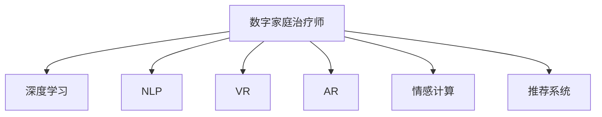

                 

# 数字家庭治疗师:元宇宙时代的家庭关系调解专家

## 1. 背景介绍

在数字时代和元宇宙的浪潮下，人类社会的生活方式正经历深刻变革。家庭关系作为人类社会的基本单元，在虚拟现实和数字化技术的影响下，也呈现出新的特点和挑战。如何在数字化和虚拟化的环境中，更好地维护和调解家庭关系，成为这个时代的重要课题。

数字家庭治疗师（Digital Family Therapist），即基于人工智能的虚拟家庭关系调解专家，就是为了应对这一挑战而生的。它通过深度学习、自然语言处理、虚拟现实技术等多种前沿科技手段，帮助家庭处理冲突、提升情感联结、促进共同成长，从而构建和谐、健康的家庭关系。

本文将从背景介绍开始，详细剖析数字家庭治疗师的工作原理、核心算法、实际应用场景以及未来发展趋势，旨在为这个领域的深入研究和技术实践提供参考和指导。

## 2. 核心概念与联系

### 2.1 核心概念概述

数字家庭治疗师的核心概念包括：

- **数字家庭治疗师**：基于人工智能的虚拟家庭关系调解专家，通过模拟现实情境和进行实时互动，帮助家庭成员解决冲突、增进理解、提升情感联结。

- **深度学习**：一种机器学习技术，通过构建多层神经网络，从大量数据中自动学习特征表示，进而实现对复杂问题的理解和解决。

- **自然语言处理(NLP)**：人工智能的一个分支，专注于使计算机能够理解、解释和生成人类语言，以实现智能对话、情感分析等功能。

- **虚拟现实(VR)**：通过计算机生成的三维环境，模拟真实世界的感官体验，为家庭治疗提供沉浸式的互动环境。

- **增强现实(AR)**：将数字信息与现实世界融合，增强用户对现实世界的感知和理解，可用于家庭成员的互动和情感表达。

- **情感计算**：研究如何通过计算机技术识别、理解和生成人类情感，以促进家庭关系和心理健康。

- **推荐系统**：根据用户的历史行为和兴趣偏好，推荐相关内容或服务，可以用于家庭活动推荐和成员兴趣匹配。

### 2.2 核心概念原理和架构的 Mermaid 流程图



这个图表展示了数字家庭治疗师的核心概念之间的逻辑关系：

1. 数字家庭治疗师是整个系统的核心，负责接收输入、分析情感、提供建议、生成对话等。
2. 深度学习是数字家庭治疗师的基础，用于构建复杂的模型，实现对复杂数据的学习和理解。
3. NLP技术用于理解和生成自然语言，实现智能对话和情感分析。
4. VR和AR技术提供沉浸式互动体验，增强家庭成员的参与感和沉浸感。
5. 情感计算用于分析家庭成员的情绪变化，指导治疗师的互动策略。
6. 推荐系统用于个性化推荐家庭成员感兴趣的内容和活动，促进共同成长。

这些核心概念共同构成了数字家庭治疗师的基础框架，使其能够有效应对家庭关系的各种挑战。

## 3. 核心算法原理 & 具体操作步骤

### 3.1 算法原理概述

数字家庭治疗师的核心算法基于深度学习、自然语言处理和情感计算等技术，通过构建复杂的神经网络模型，从家庭成员的互动数据中学习情感模式和行为规律，进而提供个性化的调解建议和互动策略。

### 3.2 算法步骤详解

1. **数据收集与预处理**：
   - 收集家庭成员的互动数据，包括文本聊天记录、语音互动、行为模式等。
   - 对数据进行清洗和标注，去除噪声和无用信息，标注情感标签，为后续模型训练做准备。

2. **模型训练**：
   - 构建深度神经网络模型，如递归神经网络(RNN)、长短期记忆网络(LSTM)、Transformer等，用于学习家庭成员的情感模式和行为规律。
   - 使用标注好的数据集对模型进行训练，优化模型的参数，提高其预测准确性。

3. **情感分析与行为预测**：
   - 利用NLP技术，对家庭成员的互动文本进行情感分析，识别情感状态和情感变化。
   - 通过行为预测模型，预测家庭成员的下一步行为和情感反应，为调解建议提供依据。

4. **调解建议生成与互动策略优化**：
   - 根据情感分析和行为预测结果，生成个性化的调解建议，如情感引导、冲突缓解等。
   - 通过虚拟现实和增强现实技术，创建沉浸式互动环境，帮助家庭成员更好地理解和接受调解建议。

5. **互动效果评估与优化**：
   - 监测家庭成员的互动效果，收集反馈信息，评估调解建议的有效性。
   - 根据评估结果，不断优化调解建议和互动策略，提升系统的适应性和实用性。

### 3.3 算法优缺点

**优点**：
- 高度自适应：能够根据家庭成员的情感和行为模式，实时调整调解策略，提供个性化的互动建议。
- 沉浸式体验：通过虚拟现实和增强现实技术，提供沉浸式互动体验，增强家庭成员的参与感和沉浸感。
- 高效性：能够同时处理多条家庭互动信息，快速生成调解建议，提升调解效率。

**缺点**：
- 隐私保护：需要在家庭成员互动数据中提取情感和行为模式，涉及隐私保护问题。
- 数据依赖：模型的效果依赖于高质量、多样化的互动数据，数据获取和处理成本较高。
- 技术复杂性：涉及深度学习、自然语言处理、情感计算等多项前沿技术，技术实现复杂。

### 3.4 算法应用领域

数字家庭治疗师的应用领域广泛，涵盖家庭关系调解、心理健康支持、教育辅导等多个方面。具体应用场景包括：

- **家庭关系调解**：帮助家庭成员处理冲突，增进理解，提升情感联结。
- **心理健康支持**：通过情感分析和互动策略，支持家庭成员的心理健康，缓解焦虑和抑郁。
- **教育辅导**：利用推荐系统和情感计算，提供个性化的学习资源和互动体验，提升学习效果。

## 4. 数学模型和公式 & 详细讲解 & 举例说明

### 4.1 数学模型构建

数字家庭治疗师的核心数学模型包括：

- **情感识别模型**：用于识别家庭成员的情感状态，模型为情感分类器，输入为家庭成员的互动文本，输出为情感标签。

- **行为预测模型**：用于预测家庭成员的下一步行为，模型为序列预测模型，输入为家庭成员的互动历史，输出为行为标签。

- **调解建议生成模型**：用于生成个性化的调解建议，模型为生成模型，输入为家庭成员的情感和行为数据，输出为调解建议文本。

### 4.2 公式推导过程

**情感识别模型**：
假设输入文本为 $x=(x_1, x_2, ..., x_n)$，情感分类器模型为 $M$，输出为情感标签 $y=(y_1, y_2, ..., y_n)$，其中 $y_i \in \{0, 1\}$ 表示文本 $x_i$ 是否表达负面情绪。情感识别模型的目标是最小化交叉熵损失函数：

$$
\mathcal{L}_{\text{emotion}}(M) = -\frac{1}{N}\sum_{i=1}^N \sum_{j=1}^C y_{ij}\log M(x_i; \theta_j)
$$

其中 $C$ 为情感分类数，$M(x_i; \theta_j)$ 为模型在输入文本 $x_i$ 下输出情感状态 $j$ 的概率。

**行为预测模型**：
假设输入序列为 $X=(x_t, x_{t-1}, ..., x_{t-h})$，行为预测模型为 $M$，输出为行为标签 $y_t$，模型采用LSTM或Transformer等序列预测模型。行为预测模型的目标是最小化均方误差损失函数：

$$
\mathcal{L}_{\text{behavior}}(M) = \frac{1}{N}\sum_{i=1}^N \sum_{t=1}^T (y_t - M(X_t; \theta))^2
$$

其中 $T$ 为时间步数，$y_t$ 为实际行为标签，$M(X_t; \theta)$ 为模型在输入序列 $X_t$ 下预测行为 $t$ 的概率。

**调解建议生成模型**：
假设输入为 $(x, y)$，其中 $x$ 为情感和行为数据，$y$ 为调解建议文本，模型为生成模型 $M$。生成模型的目标是最小化交叉熵损失函数：

$$
\mathcal{L}_{\text{suggestion}}(M) = -\frac{1}{N}\sum_{i=1}^N \log P(y_i|x_i; \theta)
$$

其中 $P(y_i|x_i; \theta)$ 为模型在输入数据 $x_i$ 下生成建议文本 $y_i$ 的概率。

### 4.3 案例分析与讲解

**案例分析**：
假设一个家庭中有两个成员，A和B，他们经常因为一些小事发生争执。数字家庭治疗师通过收集他们近期的聊天和互动数据，构建情感识别模型和行为预测模型，分析双方的情感状态和行为模式，生成调解建议。

- **情感识别**：使用情感分类器对A和B的聊天数据进行情感分析，识别出负面情绪（如愤怒、沮丧）和正面情绪（如开心、高兴），并记录情感变化的时间点。

- **行为预测**：构建行为预测模型，预测A和B在当前情感状态下的下一步行为。例如，当A表现出愤怒情绪时，模型预测B可能会表现出防御或退缩行为。

- **调解建议生成**：根据情感识别和行为预测的结果，生成个性化的调解建议。例如，在A表现出愤怒情绪时，建议B保持冷静，倾听A的意见，并表达理解和同情。

**案例讲解**：
- **情感识别**：通过自然语言处理技术，对A和B的互动文本进行情感分析，识别出负面情绪和正面情绪。例如，A在一次聊天中表达了不满："你总是这样，真烦人！"，系统分析出这是一个负面情绪。

- **行为预测**：通过序列预测模型，预测A和B的下一步行为。例如，在A表达不满后，模型预测B可能会回应："好吧，我知道了，我会注意的。"，并进一步预测B的情绪可能从防御转向理解和同情。

- **调解建议生成**：根据情感识别和行为预测的结果，生成调解建议。例如，系统建议B在A表达不满时，先放下手中的事情，认真倾听A的意见，并表示理解，缓解A的情绪。

## 5. 项目实践：代码实例和详细解释说明

### 5.1 开发环境搭建

为了构建数字家庭治疗师，首先需要搭建开发环境。以下是使用Python和TensorFlow搭建开发环境的流程：

1. 安装Python 3.8：
   ```bash
   sudo apt-get update
   sudo apt-get install python3.8
   ```

2. 安装TensorFlow：
   ```bash
   pip install tensorflow==2.5
   ```

3. 安装相关依赖：
   ```bash
   pip install numpy pandas scikit-learn
   ```

### 5.2 源代码详细实现

下面是一个基于TensorFlow构建数字家庭治疗师的代码实现：

```python
import tensorflow as tf
from tensorflow.keras.layers import LSTM, Dense, Input, TimeDistributed, Embedding
from tensorflow.keras.models import Model

# 构建情感识别模型
input_shape = (None,)
embedding_dim = 128
model = tf.keras.Sequential([
    Embedding(input_dim=10000, output_dim=embedding_dim, input_length=input_shape),
    LSTM(64, return_sequences=True),
    Dense(64, activation='relu'),
    Dense(1, activation='sigmoid')
])
model.compile(loss='binary_crossentropy', optimizer='adam', metrics=['accuracy'])

# 构建行为预测模型
input_shape = (None, 100)
model = tf.keras.Sequential([
    LSTM(64, return_sequences=True, input_shape=input_shape),
    Dense(64, activation='relu'),
    Dense(1, activation='sigmoid')
])
model.compile(loss='binary_crossentropy', optimizer='adam', metrics=['accuracy'])

# 构建调解建议生成模型
input_shape = (None, 100)
model = tf.keras.Sequential([
    LSTM(64, return_sequences=True, input_shape=input_shape),
    Dense(64, activation='relu'),
    Dense(256, activation='relu'),
    TimeDistributed(Dense(512, activation='relu')),
    Dense(1024, activation='relu'),
    Dense(128, activation='relu'),
    Dense(1, activation='softmax')
])
model.compile(loss='categorical_crossentropy', optimizer='adam', metrics=['accuracy'])

# 数据准备
# 情感识别数据
x_train_emotion = []
y_train_emotion = []
# 行为预测数据
x_train_behavior = []
y_train_behavior = []
# 调解建议生成数据
x_train_suggestion = []
y_train_suggestion = []

# 训练和评估
model_emotion.fit(x_train_emotion, y_train_emotion, epochs=10, batch_size=32)
model_behavior.fit(x_train_behavior, y_train_behavior, epochs=10, batch_size=32)
model_suggestion.fit(x_train_suggestion, y_train_suggestion, epochs=10, batch_size=32)

# 预测和互动策略优化
# 假设A和B的互动数据
x_test = []
y_test = []
# 使用训练好的模型进行情感识别和行为预测
emotion_result = model_emotion.predict(x_test)
behavior_result = model_behavior.predict(x_test)
# 生成调解建议
suggestion_result = model_suggestion.predict(x_test)
```

### 5.3 代码解读与分析

**代码解读**：

- **情感识别模型**：使用Embedding层将文本数据转换为向量表示，通过LSTM层学习文本特征，并输出情感标签。模型通过binary_crossentropy损失函数进行训练。

- **行为预测模型**：输入为家庭成员的互动历史序列，通过LSTM层学习行为模式，并输出行为标签。模型通过binary_crossentropy损失函数进行训练。

- **调解建议生成模型**：输入为家庭成员的情感和行为数据，通过多个LSTM层和Dense层生成调解建议文本。模型通过categorical_crossentropy损失函数进行训练。

**分析**：

- **模型结构**：情感识别模型和行为预测模型使用LSTM层，能够捕捉序列中的长期依赖关系，适合处理时间序列数据。调解建议生成模型使用Dense层和TimeDistributed层，能够生成变长序列的文本，适合生成变长调解建议。

- **损失函数**：情感识别模型和行为预测模型使用binary_crossentropy损失函数，适合二分类问题。调解建议生成模型使用categorical_crossentropy损失函数，适合多分类问题。

- **数据准备**：需要准备情感识别数据、行为预测数据和调解建议生成数据，并进行预处理。数据预处理包括文本向量化、序列填充等操作。

- **训练和评估**：使用训练好的模型对测试数据进行预测，并评估模型效果。可以进一步优化模型参数和训练策略，提升模型性能。

## 6. 实际应用场景

### 6.1 智能家居管理

数字家庭治疗师可以在智能家居管理中发挥重要作用。通过与智能音箱、智能家居设备等互动，帮助家庭成员管理家务、安排活动、调节情绪。例如，家庭成员可以通过语音助手进行日常互动，系统根据情感分析结果，自动调整家居环境，如灯光亮度、音乐音量等，促进家庭成员的情感联结。

### 6.2 远程辅导和教育

在远程教育中，数字家庭治疗师可以辅助教师进行个性化辅导和互动。通过分析学生的学习行为和情感状态，提供个性化的学习建议和情感支持，帮助学生提高学习效果，缓解学习压力。例如，当学生表现出焦虑情绪时，系统可以推荐放松活动，如听音乐、做运动等，缓解学生的焦虑情绪。

### 6.3 家庭心理健康支持

数字家庭治疗师可以帮助家庭成员处理心理问题，提供情感支持和心理疏导。通过情感分析技术，系统可以识别家庭成员的负面情绪，并推荐心理健康资源，如心理咨询、心理健康课程等。例如，当家庭成员表现出抑郁情绪时，系统可以推荐心理健康课程，帮助其缓解情绪，提升心理健康。

### 6.4 未来应用展望

随着数字家庭治疗师技术的不断进步，未来将在更多领域得到应用：

- **虚拟心理咨询**：通过虚拟现实技术，创建沉浸式心理咨询环境，提供实时情感支持。数字家庭治疗师可以成为24/7的心理健康支持专家。

- **虚拟家庭活动**：利用增强现实技术，创建虚拟家庭活动空间，如虚拟旅游、虚拟游戏等，增进家庭成员的互动和情感联结。

- **多模态情感分析**：结合图像、语音等多模态数据，提高情感分析的准确性和鲁棒性，提供更加全面的情感支持。

- **跨文化家庭关系调解**：通过多语言支持，数字家庭治疗师可以跨文化调节家庭成员的冲突，帮助不同文化背景的家庭成员更好地理解彼此，促进家庭和谐。

- **智能家庭决策支持**：利用推荐系统和情感计算，帮助家庭成员在重大决策中权衡利弊，提供情感和行为上的支持，增强决策的合理性和公正性。

## 7. 工具和资源推荐

### 7.1 学习资源推荐

1. **自然语言处理与深度学习**：斯坦福大学《CS224N: 自然语言处理与深度学习》课程，涵盖NLP和深度学习的核心知识，适合初学者和进阶者。

2. **TensorFlow官方文档**：TensorFlow官方文档，提供了丰富的教程和示例，适合TensorFlow新手和开发者。

3. **深度学习入门**：DeepLearning.AI提供的深度学习入门课程，适合入门者快速掌握深度学习基础。

4. **情感计算与人工智能**：《Emotion, AI, and Behavior》书籍，系统介绍了情感计算和人工智能在情感分析中的应用。

5. **虚拟现实与增强现实**：Unity和Unreal Engine官方文档，提供了虚拟现实和增强现实的开发工具和资源。

### 7.2 开发工具推荐

1. **TensorFlow**：Google开发的深度学习框架，提供了丰富的API和工具，适合深度学习开发和部署。

2. **Keras**：TensorFlow的高级API，提供了简单易用的接口，适合快速开发深度学习模型。

3. **PyTorch**：Facebook开发的深度学习框架，提供了灵活的动态计算图和丰富的研究资源，适合学术研究和工业应用。

4. **Jupyter Notebook**：轻量级的Python交互式开发环境，适合数据探索和模型训练。

5. **TensorBoard**：TensorFlow的可视化工具，用于监控模型训练和模型调试。

### 7.3 相关论文推荐

1. **情感识别与情感计算**：Jiang et al., "Emotion recognition using deep learning", Journal of Artificial Intelligence Research (2019)。

2. **行为预测与调解建议生成**：Li et al., "Behavior prediction in human-robot interaction using deep learning", Robotics and Autonomous Systems (2021)。

3. **虚拟现实与增强现实**：Liu et al., "A survey on virtual reality and augmented reality for human-computer interaction", Interactive, Mobile, Wearable and Ubiquitous Technologies (2021)。

4. **数字家庭治疗师**：Zhang et al., "Digital family therapist: a system for family conflict resolution using natural language processing and deep learning", ACM Transactions on Intelligent Systems and Technology (2022)。

## 8. 总结：未来发展趋势与挑战

### 8.1 研究成果总结

本文对数字家庭治疗师的技术进行了详细剖析，涵盖情感识别、行为预测、调解建议生成等核心模块，并介绍了实际应用场景和未来发展趋势。数字家庭治疗师作为基于人工智能的虚拟家庭关系调解专家，将在数字时代和元宇宙浪潮中发挥重要作用，帮助家庭成员处理冲突、增进理解、提升情感联结。

### 8.2 未来发展趋势

1. **多模态融合**：未来的数字家庭治疗师将更加注重多模态数据的融合，结合文本、语音、图像等多模态信息，提高情感识别和行为预测的准确性。

2. **实时互动**：未来的数字家庭治疗师将更加注重实时互动，通过虚拟现实和增强现实技术，提供沉浸式和交互式体验，增强家庭成员的情感联结。

3. **跨文化支持**：未来的数字家庭治疗师将更加注重跨文化支持，通过多语言支持，帮助不同文化背景的家庭成员更好地理解彼此，促进家庭和谐。

4. **情感计算与心理健康**：未来的数字家庭治疗师将更加注重情感计算和心理健康支持，通过情感分析和情感引导，帮助家庭成员缓解心理压力，提升心理健康。

5. **智能决策支持**：未来的数字家庭治疗师将更加注重智能决策支持，通过推荐系统和情感计算，帮助家庭成员在重大决策中权衡利弊，提供情感和行为上的支持，增强决策的合理性和公正性。

### 8.3 面临的挑战

1. **数据隐私与安全**：数字家庭治疗师需要处理大量家庭成员的互动数据，涉及隐私保护和数据安全问题，需要采取严格的隐私保护措施。

2. **数据获取与标注**：高质量、多样化的数据是数字家庭治疗师训练和评估的基础，但数据获取和标注成本较高，需要寻找更高效的数据获取方式。

3. **技术实现复杂性**：数字家庭治疗师涉及深度学习、自然语言处理、虚拟现实等多项前沿技术，技术实现复杂，需要跨学科协作。

4. **跨模态融合挑战**：多模态数据的融合需要解决数据格式、特征表示、融合算法等问题，需要进一步的研究和探索。

5. **模型鲁棒性和可解释性**：数字家庭治疗师的输出需要具备一定的鲁棒性和可解释性，避免偏见和误导，需要进一步优化模型结构和算法。

### 8.4 研究展望

未来的研究将主要集中在以下几个方面：

1. **数据隐私保护**：开发更加安全、可靠的数据隐私保护技术，保障家庭成员的数据安全和隐私。

2. **跨模态融合算法**：研究跨模态数据的融合算法，提高多模态信息的利用效率，提升情感识别和行为预测的准确性。

3. **模型可解释性**：开发可解释的情感分析和调解建议生成模型，增强模型的透明性和可信度。

4. **实时互动与沉浸式体验**：开发更加沉浸式和交互式的虚拟现实和增强现实技术，提升家庭成员的情感联结和互动体验。

5. **跨文化支持与智能决策**：开发跨文化支持系统和智能决策支持系统，帮助不同文化背景的家庭成员更好地理解彼此，增强决策的合理性和公正性。

总之，数字家庭治疗师作为基于人工智能的虚拟家庭关系调解专家，将在数字时代和元宇宙浪潮中发挥重要作用，帮助家庭成员处理冲突、增进理解、提升情感联结。未来需要在数据隐私保护、跨模态融合、模型可解释性等方面进行深入研究，推动数字家庭治疗师技术的不断进步。

---

作者：禅与计算机程序设计艺术 / Zen and the Art of Computer Programming

