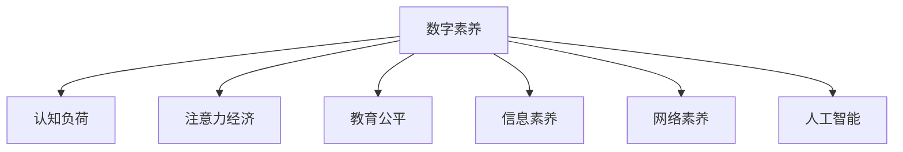

                 

# 数字素养教育：应对注意力经济的必修课

> 关键词：数字素养, 人工智能, 认知负荷, 教育公平, 网络素养, 信息素养, 数字鸿沟

## 1. 背景介绍

### 1.1 问题由来
随着信息技术的发展，数字化已成为现代社会的重要特征。在信息的爆炸式增长和数据应用的广泛渗透下，个体与社会对信息处理能力的要求不断提升。然而，数字素养教育（Digital Literacy Education）作为培养个体适应数字化环境的关键能力，在实际教育中面临诸多挑战。

首先，数字化环境复杂多变，技术更新迅速，要求教育内容与现实需求紧密结合。然而，传统的教育体系往往滞后于技术发展，难以有效传递最新的数字化知识和技能。

其次，数字化环境下的信息过载（Information Overload）和认知负荷（Cognitive Load）问题日益凸显。如何设计有效教学策略，减少学习者负担，提升教育效果，成为重要课题。

此外，数字鸿沟（Digital Divide）问题严重，尤其在发展中国家和偏远地区，资源匮乏，教育机会不均等现象普遍存在。

### 1.2 问题核心关键点
数字素养教育的核心在于培养个体处理、分析和评估信息的能力，使其能够在数字化环境中高效运作。其关键点包括：

1. **信息获取与筛选**：具备获取、筛选有价值信息的能力，避免被无效信息干扰。
2. **数据理解与应用**：能理解和应用数据，进行逻辑推理和决策。
3. **技术操作与应用**：掌握基本技术操作，灵活运用各类软件与平台。
4. **网络安全与隐私保护**：理解网络安全基本知识，保护个人隐私。
5. **创新思维与问题解决**：培养创新思维，运用技术解决实际问题。

本博客旨在全面系统地介绍数字素养教育的概念、原理及实际应用，并探索前沿技术如人工智能（AI）在教育中的应用，为构建更高效、公平的数字素养教育体系提供指导。

## 2. 核心概念与联系

### 2.1 核心概念概述

为更好地理解数字素养教育，本节将介绍几个核心概念：

- **数字素养（Digital Literacy）**：指个体在数字化环境下的基本知识和技能，包括信息获取与筛选、数据理解与应用、技术操作与应用、网络安全与隐私保护、创新思维与问题解决等。
- **认知负荷（Cognitive Load）**：指在学习过程中，个体需要处理的信息量和复杂度。有效的教育设计应尽量减少认知负荷，提高学习效率。
- **注意力经济（Attention Economy）**：指在数字化环境中，信息过载导致注意力资源的争夺日益激烈，要求个体具备更强的注意力分配与控制能力。
- **教育公平（Education Fairness）**：指教育资源在社会各群体间的公平分配，特别是在数字鸿沟问题中，提升欠发达地区和弱势群体的教育机会和效果。
- **信息素养（Information Literacy）**：指个体有效获取、评估、整合和应用信息的能力，是数字素养的重要组成部分。
- **网络素养（Cyber Literacy）**：指个体安全、负责任地使用网络的能力，包括网络安全与隐私保护等。
- **人工智能（Artificial Intelligence, AI）**：指模拟、延伸和扩展人类智能的理论、方法、技术及应用系统。

这些核心概念之间的联系通过以下Mermaid流程图展示：



## 3. 核心算法原理 & 具体操作步骤
### 3.1 算法原理概述

数字素养教育的核心是通过系统的课程设计，帮助学习者掌握必要的知识和技能。具体来说，可以采用以下流程：

1. **需求分析**：调研学习者的背景知识、技能水平、兴趣点，确定教育目标。
2. **课程设计**：设计符合学习者认知特点、富有互动性和趣味性的课程内容。
3. **实施教学**：使用多种教学手段，如在线视频、互动游戏、模拟实验等，增强学习效果。
4. **评估反馈**：通过测验、作业等方式，评估学习效果，并及时反馈给学习者。
5. **持续改进**：根据评估结果和反馈意见，不断优化教学内容和方法，提升教育效果。

数字素养教育的实施，需要在理论和实践中不断探索，结合最新的AI技术和教育理论，进行科学设计。

### 3.2 算法步骤详解

数字素养教育的实施步骤可具体分为以下几个环节：

**Step 1: 需求分析**
- 调研学习者的背景知识、技能水平、兴趣点。
- 分析学习者的认知特点，选择合适的教学内容和方法。

**Step 2: 课程设计**
- 确定教育目标，设计系统化的课程大纲。
- 选择或开发适合的教学资源，如课程视频、在线测验、互动游戏等。
- 设计互动性强、富有趣味性的教学活动，如小组讨论、角色扮演等。

**Step 3: 实施教学**
- 选择或开发适合的在线学习平台，创建课程账号。
- 采用多种教学手段，如在线视频、互动游戏、模拟实验等，增强学习效果。
- 组织在线或线下的互动活动，增加学习者参与度。

**Step 4: 评估反馈**
- 通过测验、作业等方式，评估学习效果。
- 收集学习者的反馈意见，了解教学中的不足。
- 根据评估结果和反馈意见，调整教学内容和方式。

**Step 5: 持续改进**
- 定期更新课程内容，确保其与最新技术发展同步。
- 不断优化教学方法，提高学习效果。
- 使用AI技术，如数据分析、个性化推荐等，提升教学针对性。

### 3.3 算法优缺点

数字素养教育的优势包括：

1. **灵活性高**：可以根据学习者的实际情况，灵活调整教学内容和方式，满足不同学习者的需求。
2. **自主性强**：学习者可以根据自己的时间和节奏，自主进行学习，提高学习效率。
3. **资源丰富**：网络上有大量免费或低成本的资源可供利用，降低了教育成本。
4. **易于扩展**：数字素养教育的实施不受地域限制，可以推广到更多地区和群体。

然而，也存在以下挑战：

1. **技术依赖性强**：需要一定的技术基础，可能对技术落后的学习者造成困扰。
2. **自我管理要求高**：学习者需要较强的自律性，否则容易中途放弃。
3. **教育公平问题**：技术资源的不均衡分配可能加剧数字鸿沟。
4. **过度依赖屏幕**：长时间面对屏幕可能影响学习者视力，需要适度休息。
5. **信息过载风险**：数字化环境中的信息过载可能增加学习者的认知负荷。

### 3.4 算法应用领域

数字素养教育的应用领域广泛，涵盖教育、职场、社会等多个方面：

- **基础教育**：在中小学课程中融入数字素养教育，培养学生基本的信息处理能力。
- **高等教育**：在大学中开设数据科学、人工智能等相关课程，提升学生的信息素养和技术操作能力。
- **职业培训**：在职场培训中引入数字素养教育，提升员工的职业竞争力。
- **社会教育**：通过社区活动、公开课等方式，普及数字素养知识，提升社会整体的信息处理能力。

## 4. 数学模型和公式 & 详细讲解  
### 4.1 数学模型构建

数字素养教育的效果评估可以通过以下数学模型进行建模：

假设数字素养教育的效果可以用成绩S来衡量，影响成绩的因素包括：

- 教学内容C
- 教学方法M
- 学习者背景B
- 学习资源R
- 互动程度I

数学模型如下：

$$
S = f(C, M, B, R, I)
$$

其中，f为复杂函数，表示各因素的相互作用。

### 4.2 公式推导过程

通过分析影响因素，可以构建以下公式：

$$
S = aC + bM + cB + dR + eI + f
$$

其中，a、b、c、d、e为系数，表示各因素对成绩的影响程度。f为常数项，表示其他未考虑因素对成绩的影响。

### 4.3 案例分析与讲解

以下是一个具体的案例分析：

假设某在线教育平台推出一堂数字素养课程，邀请了知名的专家进行授课，并使用了先进的互动技术，课程内容丰富，涵盖了信息获取与筛选、数据理解与应用、技术操作与应用、网络安全与隐私保护、创新思维与问题解决等。课程结束后，通过测验和作业评估学习效果。

- **教学内容C**：课程内容系统化、全面，覆盖了数字素养教育的各个方面。
- **教学方法M**：采用视频讲解、互动游戏、小组讨论等多样化教学手段，增强了学习效果。
- **学习者背景B**：学习者涵盖了不同年龄、不同职业背景的群体，具备一定的技术基础。
- **学习资源R**：平台提供了丰富的在线资源，包括课程视频、互动游戏、模拟实验等。
- **互动程度I**：课程设计了多个互动环节，提高了学习者的参与度。

通过数据分析，可以发现教学内容、教学方法、学习资源和互动程度对学习效果有显著影响，而学习者的背景对效果的影响相对较小。

## 5. 项目实践：代码实例和详细解释说明
### 5.1 开发环境搭建

进行数字素养教育项目的实践，需要搭建良好的开发环境。以下是使用Python进行Flask开发的环境配置流程：

1. 安装Python：从官网下载并安装Python，确保版本在3.7以上。
2. 安装Flask：使用pip安装Flask框架。
3. 安装相关库：如SQLAlchemy、WTForms、Jinja2等。
4. 创建虚拟环境：使用venv命令创建虚拟环境，并激活。
5. 编写代码：使用Flask的blueprint功能，创建课程管理、学习者管理、作业管理等功能模块。

完成上述步骤后，即可在虚拟环境中开始项目开发。

### 5.2 源代码详细实现

以下是一个简单的Flask代码实例，展示了数字素养教育平台的基本功能：

```python
from flask import Flask, render_template, request, redirect, url_for, session
from flask_sqlalchemy import SQLAlchemy

app = Flask(__name__)
app.config['SQLALCHEMY_DATABASE_URI'] = 'sqlite:///database.db'
app.config['SECRET_KEY'] = 'supersecretkey'
db = SQLAlchemy(app)

class User(db.Model):
    id = db.Column(db.Integer, primary_key=True)
    username = db.Column(db.String(80), unique=True, nullable=False)
    password = db.Column(db.String(120), nullable=False)
    courses = db.relationship('Course', backref='users', lazy=True)

class Course(db.Model):
    id = db.Column(db.Integer, primary_key=True)
    title = db.Column(db.String(120), nullable=False)
    content = db.Column(db.Text, nullable=False)
    is_active = db.Column(db.Boolean, default=True)

@app.route('/')
def index():
    courses = Course.query.filter_by(is_active=True).all()
    return render_template('index.html', courses=courses)

@app.route('/register', methods=['GET', 'POST'])
def register():
    if request.method == 'POST':
        username = request.form['username']
        password = request.form['password']
        user = User(username=username, password=password)
        db.session.add(user)
        db.session.commit()
        return redirect(url_for('index'))
    return render_template('register.html')

@app.route('/login', methods=['GET', 'POST'])
def login():
    if request.method == 'POST':
        username = request.form['username']
        password = request.form['password']
        user = User.query.filter_by(username=username, password=password).first()
        if user:
            session['user_id'] = user.id
            return redirect(url_for('courses'))
        return 'Invalid credentials'
    return render_template('login.html')

@app.route('/courses')
def courses():
    user_id = session.get('user_id')
    courses = User.query.get(user_id).courses
    return render_template('courses.html', courses=courses)

@app.route('/course/<id>')
def course(id):
    course = Course.query.get(id)
    return render_template('course.html', course=course)

if __name__ == '__main__':
    app.run(debug=True)
```

### 5.3 代码解读与分析

让我们再详细解读一下关键代码的实现细节：

**Flask框架**：
- 使用Flask框架搭建Web应用，提供路由和视图功能。
- 配置数据库连接和会话管理，使用SQLAlchemy作为ORM工具。

**User模型**：
- 定义User模型，包括用户名、密码和关联的课程信息。
- 使用SQLAlchemy的ORM框架，将数据库表与Python类映射。

**Course模型**：
- 定义Course模型，包括课程标题、内容、活跃状态等属性。
- 使用SQLAlchemy的ORM框架，将数据库表与Python类映射。

**路由定义**：
- 定义首页、注册、登录、课程列表和课程详情等路由。
- 使用装饰器和视图函数，处理不同路由的请求和响应。

**会话管理**：
- 使用session对象管理用户登录状态，记录用户ID。
- 在需要验证用户权限的路由中使用session对象。

**页面渲染**：
- 使用Flask的render_template函数，渲染HTML页面。
- 将课程信息、用户信息等数据传递给页面模板，动态显示内容。

**开发调试**：
- 使用if __name__ == '__main__':判断是否为直接运行脚本，启动应用。
- 在debug模式下启动应用，便于调试和测试。

## 6. 实际应用场景
### 6.1 数字素养课程设计

数字素养课程设计应结合实际需求和学生特点，设计出符合认知负荷和注意力的教育内容。以下是一个具体的课程设计案例：

**课程目标**：
- 信息获取与筛选
- 数据理解与应用
- 技术操作与应用
- 网络安全与隐私保护
- 创新思维与问题解决

**课程结构**：
- 模块一：信息获取与筛选
  - 子模块一：搜索引擎与信息筛选
  - 子模块二：网络爬虫与数据抓取
- 模块二：数据理解与应用
  - 子模块一：数据分析基础
  - 子模块二：数据可视化
- 模块三：技术操作与应用
  - 子模块一：基本编程技能
  - 子模块二：工具使用与自动化
- 模块四：网络安全与隐私保护
  - 子模块一：网络安全基础
  - 子模块二：隐私保护与数据安全
- 模块五：创新思维与问题解决
  - 子模块一：问题建模与分析
  - 子模块二：技术应用与创新

**教学方法**：
- 互动教学：使用在线互动工具，如Kahoot、Quizlet等，进行知识测验。
- 项目式学习：设计实际项目，如数据采集、分析与可视化，提高学习者的综合应用能力。
- 案例分析：选取典型案例，分析其信息处理过程，理解应用场景。

**学习评估**：
- 在线测验：定期进行在线测验，评估学习效果。
- 项目成果：对项目式学习的成果进行评估，检验学习者的综合应用能力。
- 学习反馈：收集学习者的反馈意见，了解学习过程中的困惑与不足。

**持续改进**：
- 更新课程内容：定期更新课程内容，确保其与最新技术发展同步。
- 优化教学方法：根据学习者的反馈意见，不断优化教学方法和资源。
- 引入AI技术：使用AI技术，如数据分析、个性化推荐等，提升教学针对性。

### 6.2 职业培训平台

数字素养教育同样适用于职场职业培训，帮助员工提升信息处理能力和技术操作水平。以下是一个具体的职业培训平台案例：

**平台功能**：
- 在线课程学习
- 在线测验与评估
- 学习记录与分析
- 学习社区与交流

**课程设计**：
- 模块一：信息获取与筛选
  - 子模块一：行业信息收集与分析
  - 子模块二：新闻订阅与信息监控
- 模块二：数据理解与应用
  - 子模块一：数据处理与分析
  - 子模块二：数据可视化与报告
- 模块三：技术操作与应用
  - 子模块一：Office 365技能
  - 子模块二：办公软件自动化
- 模块四：网络安全与隐私保护
  - 子模块一：网络安全基础
  - 子模块二：数据安全与合规
- 模块五：创新思维与问题解决
  - 子模块一：问题分析与解决
  - 子模块二：创新思维与创意表达

**教学方法**：
- 在线互动教学：使用Zoom、Teams等在线会议工具，进行实时互动教学。
- 模拟实验：设计模拟实验，模拟实际工作场景，提升员工的操作能力。
- 案例分析：选取典型案例，分析其信息处理过程，理解应用场景。

**学习评估**：
- 在线测验：定期进行在线测验，评估学习效果。
- 项目成果：对模拟实验的成果进行评估，检验员工的操作能力。
- 学习反馈：收集员工的反馈意见，了解学习过程中的困惑与不足。

**持续改进**：
- 更新课程内容：定期更新课程内容，确保其与最新技术发展同步。
- 优化教学方法：根据员工的反馈意见，不断优化教学方法和资源。
- 引入AI技术：使用AI技术，如数据分析、个性化推荐等，提升教学针对性。

## 7. 工具和资源推荐
### 7.1 学习资源推荐

为了帮助开发者系统掌握数字素养教育的核心概念和实践技巧，这里推荐一些优质的学习资源：

1. **《数字素养教育概论》（英文原版）**：深入介绍数字素养教育的基本概念和核心内容，是数字素养教育研究的经典之作。
2. **《教育技术前沿》**：国际知名教育技术杂志，涵盖最新的教育技术和数字素养教育研究成果，提供丰富的学习资源和实践案例。
3. **《网络素养教育手册》**：系统介绍网络素养教育的各个方面，提供详细的教学策略和实践指导。
4. **《信息素养教育课程设计指南》**：提供数字素养课程设计的详细指南，涵盖课程结构、教学方法、学习评估等各个环节。
5. **《AI在教育中的应用》**：介绍AI技术在教育中的最新应用，包括机器学习、自然语言处理等前沿技术。

通过对这些资源的学习实践，相信你一定能够全面掌握数字素养教育的核心内容，并用于解决实际的数字素养问题。

### 7.2 开发工具推荐

高效的开发离不开优秀的工具支持。以下是几款用于数字素养教育开发的常用工具：

1. **Jupyter Notebook**：交互式Python开发环境，支持动态展示代码执行结果，适合进行数据分析和可视化。
2. **Flask**：轻量级的Web框架，适合快速搭建数字素养教育平台。
3. **SQLAlchemy**：Python的ORM工具，支持与关系型数据库的交互，适合进行数据管理。
4. **Kahoot**：在线互动教学工具，支持实时测验和互动，适合进行知识评估。
5. **Quizlet**：在线学习工具，支持创建和学习自定义的学习卡片，适合进行知识复习。

合理利用这些工具，可以显著提升数字素养教育的开发效率，加快创新迭代的步伐。

### 7.3 相关论文推荐

数字素养教育的研究源于学界的持续研究。以下是几篇奠基性的相关论文，推荐阅读：

1. **《数字素养教育：定义、内涵与实践》**：综述数字素养教育的基本概念和核心内容，为数字素养教育提供理论基础。
2. **《认知负荷理论在数字素养教育中的应用》**：探讨认知负荷理论在数字素养教育中的具体应用，提供科学的教育设计指导。
3. **《人工智能在数字素养教育中的应用》**：介绍AI技术在数字素养教育中的最新应用，提供前沿的教学策略和实践指导。
4. **《网络素养教育的现状与未来》**：分析网络素养教育的研究现状和未来趋势，提供全面的教育策略和实践指导。
5. **《数字素养教育的挑战与应对》**：探讨数字素养教育面临的挑战与应对策略，提供系统的教育设计和实践指导。

这些论文代表了大数字素养教育的发展脉络。通过学习这些前沿成果，可以帮助研究者把握学科前进方向，激发更多的创新灵感。

## 8. 总结：未来发展趋势与挑战
### 8.1 总结

本文对数字素养教育的概念、原理及实际应用进行了全面系统的介绍。首先阐述了数字素养教育的背景和意义，明确了其培养个体适应数字化环境的关键能力。其次，从理论到实践，详细讲解了数字素养教育的设计流程和关键步骤，给出了数字素养教育平台的完整代码实例。同时，本文还探讨了数字素养教育在基础教育、职业培训等领域的广泛应用前景，展示了数字素养教育的巨大潜力。此外，本文精选了数字素养教育的各类学习资源，力求为读者提供全方位的技术指引。

通过本文的系统梳理，可以看到，数字素养教育作为培养个体适应数字化环境的关键能力，在现代社会中具有重要意义。结合最新的AI技术和教育理论，数字素养教育有望进一步提升学习效果和应用范围，为社会各领域提供更高效、更公平、更可持续的教育解决方案。

### 8.2 未来发展趋势

展望未来，数字素养教育将呈现以下几个发展趋势：

1. **AI技术的深度融合**：随着AI技术的发展，数字素养教育将更加智能化、个性化。AI技术可以辅助教师进行教学设计，个性化推荐学习资源，甚至进行自动评估。
2. **持续学习与微调**：数字素养教育需要不断更新，以适应技术发展和学习者需求的变化。通过微调和持续学习，数字素养教育将更具灵活性和适应性。
3. **多模态学习**：数字素养教育将更加注重多模态学习，融合文本、图像、视频等多种信息形式，提升学习者的综合应用能力。
4. **公平与包容**：数字素养教育将更加注重公平与包容，通过技术手段缩小数字鸿沟，提升欠发达地区和弱势群体的教育机会和效果。
5. **跨学科整合**：数字素养教育将更加注重跨学科整合，融合计算机科学、教育学、心理学等多学科知识，提供更全面的教育解决方案。

以上趋势凸显了数字素养教育的广阔前景。这些方向的探索发展，必将进一步提升数字素养教育的有效性和应用范围，为社会各领域提供更高效、更公平、更可持续的教育解决方案。

### 8.3 面临的挑战

尽管数字素养教育已经取得了显著进展，但在迈向更加智能化、普适化应用的过程中，仍面临诸多挑战：

1. **技术壁垒**：数字素养教育需要一定的技术基础，对于技术落后的学习者来说，可能存在一定的门槛。
2. **资源不均衡**：不同地区、不同群体之间的资源分配不均，可能导致教育机会不均等。
3. **信息过载**：数字化环境中的信息过载可能导致学习者的认知负荷增加，影响学习效果。
4. **隐私安全**：数字化环境中的隐私和安全问题不容忽视，需要采取有效措施保护学习者的个人信息。
5. **效果评估**：如何科学评估数字素养教育的效果，仍是一个亟待解决的问题。

### 8.4 研究展望

面对数字素养教育所面临的挑战，未来的研究需要在以下几个方面寻求新的突破：

1. **技术普及与降低门槛**：开发更易用的技术和工具，降低数字素养教育的门槛，提升学习者的接受度。
2. **资源均衡分配**：通过技术手段和政策支持，缩小数字鸿沟，提升欠发达地区和弱势群体的教育机会和效果。
3. **科学评估方法**：建立科学、客观的数字素养教育评估体系，评估学习者的综合应用能力和效果。
4. **隐私安全保障**：采用先进的技术手段，保护学习者的个人信息，确保数字素养教育的安全性。
5. **多模态融合**：融合文本、图像、视频等多种信息形式，提升学习者的综合应用能力。

这些研究方向的探索，必将引领数字素养教育迈向更高的台阶，为构建更高效、更公平、更可持续的教育体系提供科学指导。

## 9. 附录：常见问题与解答

**Q1：数字素养教育的具体内容是什么？**

A: 数字素养教育的具体内容主要包括：信息获取与筛选、数据理解与应用、技术操作与应用、网络安全与隐私保护、创新思维与问题解决等。这些内容涵盖了数字化环境下的基本知识和技能，旨在培养个体在数字化环境下的处理、分析和评估信息的能力。

**Q2：如何选择合适的数字素养教育资源？**

A: 选择合适的数字素养教育资源，需要考虑学习者的认知特点、兴趣点和教育目标。可以通过以下步骤选择：
1. 调研学习者的背景知识、技能水平和兴趣点。
2. 分析学习者的认知特点，选择适合的教学内容和方法。
3. 选择或开发适合的教学资源，如课程视频、在线测验、互动游戏等。
4. 设计互动性强、富有趣味性的教学活动，增加学习者的参与度。

**Q3：数字素养教育如何与现实需求结合？**

A: 数字素养教育需要紧密结合现实需求，设计符合实际应用的教学内容。可以通过以下步骤结合：
1. 调研学习者的背景知识、技能水平和兴趣点。
2. 分析学习者的认知特点，选择适合的教学内容和方法。
3. 结合实际应用场景，设计具体的教学案例和项目，提升学习者的综合应用能力。
4. 采用互动教学、项目式学习、案例分析等多样化的教学手段，增强学习效果。

**Q4：数字素养教育如何评估学习效果？**

A: 数字素养教育的评估可以通过以下方式进行：
1. 在线测验：定期进行在线测验，评估学习效果。
2. 项目成果：对项目式学习的成果进行评估，检验学习者的综合应用能力。
3. 学习反馈：收集学习者的反馈意见，了解学习过程中的困惑与不足。

**Q5：数字素养教育如何持续改进？**

A: 数字素养教育的持续改进可以通过以下方式进行：
1. 更新课程内容：定期更新课程内容，确保其与最新技术发展同步。
2. 优化教学方法：根据学习者的反馈意见，不断优化教学方法和资源。
3. 引入AI技术：使用AI技术，如数据分析、个性化推荐等，提升教学针对性。

---

作者：禅与计算机程序设计艺术 / Zen and the Art of Computer Programming

