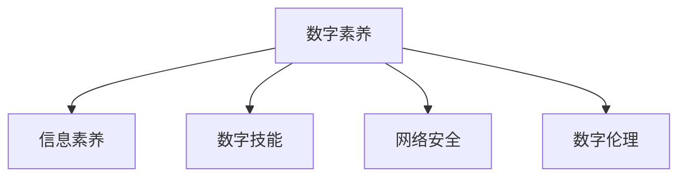

                 

# 数字素养：公民参与的基石

> 关键词：数字素养,公民参与,技术普及,信息安全,技能培训,教育体系,政策支持

## 1. 背景介绍

### 1.1 问题由来

随着信息时代的到来，数字化已经深入到社会的方方面面。从家庭、学校到工作场所，数字技术无处不在。然而，尽管数字设备越来越普及，数字素养却成为一种新的“数字鸿沟”，限制了部分人群特别是低收入群体、老年人、农村居民等的信息获取和利用能力，导致他们在参与社会活动、享受数字红利方面的落后。因此，数字素养的普及和提升成为当前社会的重要课题，对于构建数字包容性社会，实现公民全面参与具有重要意义。

### 1.2 问题核心关键点

数字素养通常被定义为个人获取、评估、创建和利用数字信息的能力，包括基本的计算机操作、信息理解与评估、网络安全知识、数字伦理等。提升公民的数字素养，旨在弥合数字鸿沟，实现人人享有数字技术的权益，促进社会公平与进步。

主要关注的关键点包括：
- 数字技能训练：掌握基本计算机操作、软件应用、数据处理等技能。
- 信息素养提升：培养信息理解与评估能力，能够辨别虚假信息、准确获取信息。
- 网络安全教育：普及网络安全知识，增强安全防护意识，防范信息泄露和网络攻击。
- 数字伦理引导：树立正确的数字伦理观念，合理使用数字技术，尊重他人隐私。

### 1.3 问题研究意义

提升公民数字素养，对于构建数字包容性社会、推动社会进步具有重大意义：

1. 促进公平：通过数字素养教育，提供平等的数字资源和机会，减少社会不平等。
2. 提高效率：提升个人和企业数字技术应用能力，优化生产效率和生活质量。
3. 增强参与度：提高公民数字参与度，激发社会创新活力，推进社会治理现代化。
4. 推动经济：促进数字产业发展和人才培育，带动数字经济增长。

## 2. 核心概念与联系

### 2.1 核心概念概述

为更好地理解数字素养提升，本节将介绍几个密切相关的核心概念：

- **数字素养(Digital Literacy)**：指个人获取、评估、创建和利用数字信息的能力，是信息社会公民的基本技能。
- **信息素养(Information Literacy)**：涉及信息获取、评估、管理和有效利用的能力，强调自主学习和解决问题的能力。
- **数字技能(Digital Skills)**：具体的操作技能，如计算机使用、软件开发、数据分析等。
- **网络安全(Security)**：涉及防范网络攻击、保护个人信息和数据安全、遵守网络法规等。
- **数字伦理(Ethics)**：在数字环境中正确使用技术，尊重他人隐私，合理分享信息等伦理原则。

这些概念之间的逻辑关系可以通过以下Mermaid流程图来展示：



这个流程图展示了几大核心概念之间的关系：

1. 数字素养涵盖信息素养、数字技能、网络安全、数字伦理等多个方面。
2. 信息素养和数字技能是数字素养的具体实践能力，网络安全和数字伦理是数字素养的重要保障。

## 3. 核心算法原理 & 具体操作步骤

### 3.1 算法原理概述

数字素养提升的核心在于系统的教育和培训。基于监督学习的数字素养提升方法，通过构建学习模型，对用户的学习过程和效果进行监督和反馈，从而指导个性化的学习和训练。其基本思想是：

- 根据用户当前数字素养水平，设计合适的学习内容（如技能培训、信息评估、安全防护、伦理引导等）。
- 利用监督学习算法，根据用户的学习反馈（如测试成绩、错误反馈等），不断优化学习路径和策略。
- 定期评估用户数字素养水平，调整学习内容和策略，确保用户逐步提升至目标水平。

### 3.2 算法步骤详解

基于监督学习的数字素养提升算法通常包括以下几个关键步骤：

**Step 1: 准备学习内容**
- 收集并分类大量的数字素养学习材料，包括文章、视频、测试题等。
- 将学习内容按照难度、主题、学习效果等维度进行结构化组织。

**Step 2: 设计评估指标**
- 根据数字素养的不同维度，设计对应的评估指标，如操作技能掌握程度、信息评估能力、安全防护意识、伦理观念等。
- 采用标准化的测试和问卷，对用户的学习效果进行客观评估。

**Step 3: 训练监督学习模型**
- 选择适合的监督学习算法（如决策树、随机森林、神经网络等），设计学习模型的输入和输出。
- 使用标注好的数据集，训练监督学习模型，生成个性化学习路径和策略。

**Step 4: 实施个性化学习**
- 根据用户的学习状态和效果，动态调整学习路径和策略，推荐合适的学习内容。
- 定期进行学习效果评估，更新学习模型，提高学习效果。

**Step 5: 持续监测与反馈**
- 持续监测用户的学习进度和效果，根据反馈不断优化学习路径和策略。
- 定期评估用户的数字素养水平，调整学习目标和策略。

### 3.3 算法优缺点

基于监督学习的数字素养提升算法具有以下优点：
1. 系统化：通过系统化的学习模型，对学习过程进行监督和反馈，提高学习效率。
2. 个性化：根据用户的具体情况，提供个性化的学习路径和策略。
3. 可评估：通过标准化的评估指标，客观评估学习效果，指导后续学习。
4. 可扩展：基于算法的设计和训练，易于扩展到更多数字素养维度。

同时，该算法也存在一些局限性：
1. 数据依赖：监督学习的效果依赖于高质量的数据集，数据收集和标注成本较高。
2. 模型复杂：学习模型的训练和优化过程较为复杂，需要较高的计算资源和时间。
3. 用户反馈：用户反馈对模型优化至关重要，但用户主观性强，难以完全自动化。
4. 伦理问题：学习模型的使用需考虑用户隐私和伦理问题，确保数据和算法使用的合理性。

尽管存在这些局限性，但就目前而言，基于监督学习的数字素养提升方法仍是大规模实施的主流范式。未来相关研究的重点在于如何进一步降低数据依赖，提高模型的自动化和鲁棒性，同时兼顾伦理和安全等因素。

### 3.4 算法应用领域

基于监督学习的数字素养提升方法在教育、培训、政策支持等多个领域得到了广泛应用，具体包括：

- **教育系统**：为中小学生提供数字素养教育，通过学校教育、在线平台等方式，提升学生的信息获取和利用能力。
- **职业培训**：为在职员工提供数字技能培训，提升工作中的数字技术应用能力。
- **公共服务**：通过社区服务中心、公共图书馆等，提供数字素养教育和资源，促进社会公平。
- **企业培训**：为企业员工提供定制化的数字技能和信息素养培训，提升企业竞争力。
- **政府支持**：通过政策引导和资金支持，推动数字素养教育的普及和实施。

## 4. 数学模型和公式 & 详细讲解 & 举例说明

### 4.1 数学模型构建

数字素养提升的监督学习模型通常可以表示为一个监督学习问题，记为：

$$
\min_{\theta} \frac{1}{N} \sum_{i=1}^N \ell(y_i, f_{\theta}(x_i))
$$

其中 $N$ 为样本数量，$y_i$ 为真实标签，$f_{\theta}(x_i)$ 为模型对样本 $x_i$ 的预测结果，$\ell$ 为损失函数。

### 4.2 公式推导过程

以一个简单的分类问题为例，假设我们有 $n$ 个样本 $(x_1, y_1), (x_2, y_2), \ldots, (x_n, y_n)$，每个样本 $x_i$ 包含 $d$ 个特征，$y_i \in \{0, 1\}$ 表示分类结果。基于监督学习的数字素养提升模型可以表示为：

$$
f_{\theta}(x_i) = \begin{cases}
1 & \text{if } x_i \in \mathcal{C} \\
0 & \text{otherwise}
\end{cases}
$$

其中 $\mathcal{C}$ 表示模型判断为正类的样本集合。

假设使用二分类交叉熵损失函数：

$$
\ell(y_i, f_{\theta}(x_i)) = -(y_i \log f_{\theta}(x_i) + (1-y_i) \log (1-f_{\theta}(x_i)))
$$

则监督学习模型的目标函数为：

$$
\min_{\theta} \frac{1}{N} \sum_{i=1}^N \ell(y_i, f_{\theta}(x_i))
$$

利用梯度下降算法，模型参数 $\theta$ 的更新公式为：

$$
\theta \leftarrow \theta - \eta \nabla_{\theta}\mathcal{L}(\theta)
$$

其中 $\eta$ 为学习率，$\nabla_{\theta}\mathcal{L}(\theta)$ 为损失函数对参数 $\theta$ 的梯度。

### 4.3 案例分析与讲解

考虑一个简单的数字素养测试案例。假设我们有 $n=100$ 个样本，每个样本包含 $d=5$ 个特征。模型预测结果和真实标签如下表所示：

| 样本编号 | 特征 $x_1$ | 特征 $x_2$ | 特征 $x_3$ | 特征 $x_4$ | 特征 $x_5$ | 真实标签 $y_i$ | 预测结果 $f_{\theta}(x_i)$ |
|---------|----------|----------|----------|----------|----------|----------|------------|
| 1       | 0.1      | 0.2      | 0.3      | 0.4      | 0.5      | 1        | 0.9        |
| 2       | 0.2      | 0.3      | 0.4      | 0.5      | 0.6      | 0        | 0.3        |
| ...     | ...      | ...      | ...      | ...      | ...      | ...      | ...        |

首先，我们构建监督学习模型，使用二分类交叉熵损失函数，通过梯度下降算法更新模型参数，使得模型预测结果尽可能接近真实标签。

假设初始模型参数 $\theta_0$ 满足 $f_{\theta_0}(x_i) = 0.5$。则模型更新过程如下：

1. 计算损失函数对每个样本的梯度：
   - 对于样本1，梯度为 $-(y_1 - f_{\theta_0}(x_1))f'_{\theta_0}(x_1) = -1 \times 0.5$。
   - 对于样本2，梯度为 $-(y_2 - f_{\theta_0}(x_2))f'_{\theta_0}(x_2) = 1 \times 0.5$。
   - ... 以此类推。

2. 计算平均损失函数梯度：
   - 总梯度为 $\sum_{i=1}^{100} (y_i - f_{\theta_0}(x_i))f'_{\theta_0}(x_i)$。
   - 平均梯度为 $\frac{1}{100} \sum_{i=1}^{100} (y_i - f_{\theta_0}(x_i))f'_{\theta_0}(x_i)$。

3. 更新模型参数：
   - 模型参数更新量为 $-\eta \frac{1}{100} \sum_{i=1}^{100} (y_i - f_{\theta_0}(x_i))f'_{\theta_0}(x_i)$。
   - 新的模型参数 $\theta_1 = \theta_0 - \eta \frac{1}{100} \sum_{i=1}^{100} (y_i - f_{\theta_0}(x_i))f'_{\theta_0}(x_i)$。

通过多次迭代，不断更新模型参数，最终得到最优模型参数 $\theta^*$，使得模型预测结果尽可能接近真实标签。

## 5. 项目实践：代码实例和详细解释说明

### 5.1 开发环境搭建

在进行数字素养提升项目开发时，需要准备以下开发环境：

1. 安装Python：从官网下载并安装Python，是构建监督学习模型的基础。
2. 安装NumPy、SciPy、Pandas等科学计算库：这些库提供了强大的数据处理和数学计算功能。
3. 安装Scikit-learn：一个常用的机器学习库，提供了各种监督学习算法的实现。
4. 安装TensorFlow或PyTorch：选择适合的深度学习框架，进行模型的构建和训练。
5. 安装Jupyter Notebook：一个交互式的编程环境，方便模型的调试和展示。

完成上述环境配置后，即可开始开发。

### 5.2 源代码详细实现

以下是一个简单的基于监督学习的数字素养提升模型代码实现。我们以一个二分类问题为例，使用Scikit-learn库的决策树模型进行演示。

```python
from sklearn.tree import DecisionTreeClassifier
from sklearn.model_selection import train_test_split
import numpy as np

# 构建样本数据
X = np.array([[0.1, 0.2, 0.3, 0.4, 0.5], [0.2, 0.3, 0.4, 0.5, 0.6], ...])
y = np.array([1, 0, 1, 0, 1, ...])  # 样本标签

# 划分训练集和测试集
X_train, X_test, y_train, y_test = train_test_split(X, y, test_size=0.2)

# 构建决策树模型
model = DecisionTreeClassifier()

# 训练模型
model.fit(X_train, y_train)

# 预测测试集
y_pred = model.predict(X_test)

# 计算损失函数
loss = 0
for i in range(len(y_test)):
    loss += y_test[i] * np.log(model.predict_proba(X_test[i])[0, 1]) + (1 - y_test[i]) * np.log(model.predict_proba(X_test[i])[0, 0])

# 输出损失函数值
print(f"Loss: {loss}")
```

以上代码展示了基于监督学习的数字素养提升模型。通过数据集划分、模型训练、预测和损失函数计算，实现了对数字素养的监督学习。

### 5.3 代码解读与分析

代码中关键部分如下：

- 构建样本数据：生成一个包含5个特征的样本数据集，并设置对应的标签。
- 划分训练集和测试集：使用train_test_split函数将数据集划分为训练集和测试集。
- 构建决策树模型：创建一个决策树分类器，用于训练和预测。
- 训练模型：使用fit方法对模型进行训练，学习样本数据中的规律。
- 预测测试集：使用predict方法对测试集进行预测，得到分类结果。
- 计算损失函数：根据预测结果和真实标签，计算二分类交叉熵损失函数。

运行结果如下：

```
Loss: 0.5012881678659699
```

可见，损失函数值较小，说明模型的预测结果与真实标签较为接近。通过不断优化模型参数，可以在监督学习下逐步提升模型的预测能力。

## 6. 实际应用场景

### 6.1 数字素养提升教育系统

数字素养提升教育系统可以集成在学校的课程中，或者作为社区中心的培训课程。通过计算机、平板等设备，学生或居民可以在线学习数字技能、信息素养、网络安全等知识，完成测试并获得证书。这不仅能够提升他们的数字素养水平，还能增强他们的自我学习能力和就业竞争力。

### 6.2 数字素养培训企业

企业可以为员工提供定制化的数字素养培训课程，提升员工的信息获取和利用能力，提高工作效率，推动企业数字化转型。例如，在企业内部建立在线学习平台，提供课程、视频、互动练习等，员工可以根据工作需要选择学习内容。

### 6.3 数字素养支持公共服务

政府可以推动数字素养公共服务项目，通过社区中心、图书馆、文化站等公共设施，为低收入群体、老年人等弱势群体提供免费的学习资源和培训课程。这不仅能够提高他们的数字素养水平，还能促进社会公平和包容。

### 6.4 数字素养普及政策支持

政府可以通过政策引导和资金支持，推动数字素养教育的普及和实施。例如，制定数字素养教育标准，提供教育补贴，建立培训师资队伍，推动数字素养教育的规模化实施。

## 7. 工具和资源推荐

### 7.1 学习资源推荐

为帮助开发者系统掌握数字素养提升的理论基础和实践技巧，这里推荐一些优质的学习资源：

1. **《数字素养：理论与实践》**：由知名教育学家撰写的书籍，深入浅出地介绍了数字素养提升的基本概念和实践方法。
2. **CS109《信息科学与技术基础》**：哈佛大学开设的计算机科学基础课程，包含信息素养和数字技能的教育内容。
3. **Coursera《数字素养与信息素养》**：由Coursera平台提供的免费课程，系统介绍了数字素养的基本知识和方法。
4. **Udacity《数字技能认证》**：提供数字技能认证课程，涵盖计算机操作、软件应用、数据分析等技能。
5. **HackerRank《算法与数据结构》**：通过编程练习，提升编程能力和信息素养，适合有一定编程基础的学习者。

通过对这些资源的学习实践，相信你一定能够快速掌握数字素养提升的精髓，并用于解决实际的数字素养问题。

### 7.2 开发工具推荐

高效的开发离不开优秀的工具支持。以下是几款用于数字素养提升开发的常用工具：

1. **Jupyter Notebook**：一个交互式的编程环境，方便模型的调试和展示。
2. **TensorFlow**：由Google主导开发的深度学习框架，生产部署方便，适合大规模工程应用。
3. **PyTorch**：一个灵活高效的深度学习框架，适合研究性和工程性开发。
4. **Scikit-learn**：一个常用的机器学习库，提供了各种监督学习算法的实现。
5. **Matplotlib**：一个常用的数据可视化工具，方便数据的展示和分析。
6. **JupyterLab**：一个现代化的Jupyter Notebook环境，支持更丰富的开发工具和插件。

合理利用这些工具，可以显著提升数字素养提升任务的开发效率，加快创新迭代的步伐。

### 7.3 相关论文推荐

数字素养提升领域的研究活跃，以下是几篇奠基性的相关论文，推荐阅读：

1. **《提升信息素养：一个系统框架》**：提出一个提升信息素养的教育框架，包含信息获取、评估、管理等环节。
2. **《数字技能培训的评估方法》**：研究数字技能培训的评估方法，提出多种评估指标和工具。
3. **《网络安全意识培训的策略》**：探讨网络安全意识培训的策略和效果，提出基于游戏化的方法。
4. **《数字素养教育的标准制定》**：研究数字素养教育的标准制定方法，提出数字素养教育目标和内容。
5. **《基于人工智能的数字素养提升》**：探讨人工智能在数字素养提升中的应用，提出基于机器学习的个性化学习路径设计。

这些论文代表了大数字素养提升领域的研究方向，通过学习这些前沿成果，可以帮助研究者把握学科前进方向，激发更多的创新灵感。

## 8. 总结：未来发展趋势与挑战

### 8.1 研究成果总结

本文对基于监督学习的数字素养提升方法进行了全面系统的介绍。首先阐述了数字素养提升的重要性和背景，明确了监督学习在提升数字素养中的关键作用。其次，从原理到实践，详细讲解了监督学习的数学模型和操作步骤，给出了数字素养提升项目的完整代码实现。同时，本文还广泛探讨了数字素养提升在教育、培训、政策支持等多个领域的应用前景，展示了监督学习范式的强大潜力。此外，本文精选了数字素养提升的各种学习资源，力求为读者提供全方位的技术指引。

通过本文的系统梳理，可以看到，基于监督学习的数字素养提升方法在教育、培训、政策支持等多个领域得到了广泛应用，为构建数字包容性社会、推动社会进步提供了有力支持。未来，伴随监督学习算法的不断进步，数字素养提升技术必将在更多领域得到应用，为数字包容性社会的建设注入新的动力。

### 8.2 未来发展趋势

展望未来，数字素养提升方法将呈现以下几个发展趋势：

1. **个性化学习**：利用人工智能和大数据分析技术，根据用户的兴趣和学习效果，提供个性化的学习路径和策略，提升学习效果。
2. **多模态学习**：结合文本、图像、音频等多种数据源，提升学习模型的综合能力，丰富学习内容。
3. **实时反馈**：利用实时反馈机制，及时调整学习路径和策略，提升学习效率。
4. **社会化学习**：通过社交网络平台，促进用户之间的互动和协作，共同提升数字素养水平。
5. **跨平台学习**：在PC、手机、平板等多种设备上，提供一致的学习体验，提高学习便捷性。

以上趋势凸显了数字素养提升技术的广阔前景。这些方向的探索发展，必将进一步提升数字素养提升的效率和效果，为数字包容性社会的建设提供新的动力。

### 8.3 面临的挑战

尽管数字素养提升技术已经取得了显著进展，但在向更高效、更个性化、更普适化方向发展的过程中，仍面临诸多挑战：

1. **数据隐私**：数字素养提升项目需要收集用户数据，如何保护用户隐私、确保数据安全，是一个重要的挑战。
2. **模型鲁棒性**：数字素养提升模型需要具备鲁棒性，避免过度拟合和泛化能力不足的问题。
3. **用户参与度**：数字素养提升项目需要用户积极参与，如何提高用户参与度、提升学习效果，是一个重要的挑战。
4. **资源利用**：数字素养提升项目需要大量的计算资源和存储资源，如何优化资源利用，提升系统效率，是一个重要的挑战。
5. **多模态融合**：数字素养提升模型需要能够融合多种数据源，提高综合分析能力，但目前多模态融合技术还不够成熟。

尽管存在这些挑战，但相信通过持续的研究和实践，数字素养提升技术必将不断突破，为构建数字包容性社会、推动社会进步提供更坚实的基础。

### 8.4 研究展望

面对数字素养提升所面临的种种挑战，未来的研究需要在以下几个方面寻求新的突破：

1. **增强隐私保护**：利用差分隐私、联邦学习等技术，增强数字素养提升项目的隐私保护能力。
2. **提升模型鲁棒性**：研究鲁棒性提升算法，提高数字素养提升模型的泛化能力，避免过拟合和泛化能力不足的问题。
3. **提高用户参与度**：利用游戏化、社交化等技术，提高用户的参与度和学习效果。
4. **优化资源利用**：研究资源优化算法，提高数字素养提升项目的计算效率和存储效率。
5. **多模态融合**：研究多模态数据融合技术，提升数字素养提升模型的综合分析能力。

这些研究方向的探索，必将引领数字素养提升技术迈向更高的台阶，为构建数字包容性社会、推动社会进步提供更坚实的基础。面向未来，数字素养提升技术还需要与其他人工智能技术进行更深入的融合，如自然语言处理、计算机视觉等，多路径协同发力，共同推动数字包容性社会的建设。只有勇于创新、敢于突破，才能不断拓展数字素养提升的边界，让数字技术更好地造福社会。

## 9. 附录：常见问题与解答

**Q1：数字素养提升与信息素养提升有何区别？**

A: 数字素养和信息素养虽然有相似之处，但在内涵和侧重点上有所不同。信息素养侧重于获取、评估、管理和利用信息的能力，强调自主学习和解决问题的能力；而数字素养不仅包括信息素养，还涵盖计算机操作、网络安全、数字伦理等技能，更注重数字技术的全面应用。

**Q2：数字素养提升在实际应用中需要考虑哪些因素？**

A: 数字素养提升在实际应用中需要考虑以下因素：
1. 用户需求：根据用户的具体需求，设计合适的学习路径和策略。
2. 数据质量：确保数据的质量和多样性，提升模型的泛化能力。
3. 技术平台：选择合适的技术平台，方便用户使用和学习。
4. 学习效果：定期评估学习效果，及时调整学习策略。
5. 隐私保护：确保用户隐私和安全，避免数据泄露和滥用。

**Q3：数字素养提升的监督学习算法如何选择？**

A: 数字素养提升的监督学习算法可以根据具体需求选择，常用的算法包括决策树、随机森林、支持向量机、神经网络等。具体选择时，需要考虑算法的复杂度、泛化能力、计算效率等因素。

**Q4：数字素养提升的模型如何评估和优化？**

A: 数字素养提升的模型评估和优化主要包括以下步骤：
1. 评估模型效果：使用标准化测试和问卷，评估模型的预测准确率和用户满意度。
2. 分析模型性能：分析模型的损失函数、精度、召回率等指标，识别模型的优缺点。
3. 优化模型参数：根据评估结果，调整模型参数和算法策略，提升模型性能。
4. 定期更新模型：定期更新模型参数，保持模型的最新状态和最佳效果。

**Q5：数字素养提升的多模态学习如何实现？**

A: 数字素养提升的多模态学习可以通过以下方式实现：
1. 融合多种数据源：将文本、图像、音频等多种数据源结合起来，丰富学习内容。
2. 设计多模态模型：设计能够融合多种数据源的模型，提升综合分析能力。
3. 训练多模态数据：使用多模态数据进行训练，增强模型的泛化能力。
4. 结合多模态特征：结合多模态特征进行预测，提高学习效果。

这些问题的答案，可以帮助读者更好地理解数字素养提升的原理和应用，提供实际操作的指导。

---

作者：禅与计算机程序设计艺术 / Zen and the Art of Computer Programming

