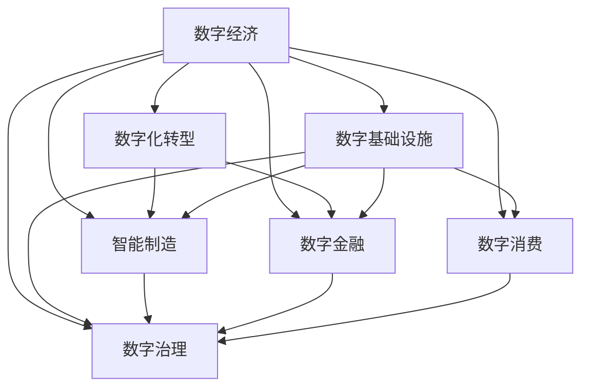

                 

## 1. 背景介绍

### 1.1 问题由来
随着信息技术的迅猛发展和全球化进程的不断加速，数字经济已成为推动全球经济增长的新引擎。数字经济不仅改变了传统经济的生产、分配、交换和消费模式，还深刻影响了全球的社会结构、文化观念和生活方式。

数字经济的崛起离不开技术的支持。人工智能、大数据、云计算等先进技术的融合应用，使得数字经济拥有了强大的活力和潜力。在消费、生产、流通、金融等多个领域，数字经济正通过数字化、网络化、智能化手段，实现效率提升、成本降低和价值创造。

### 1.2 问题核心关键点
数字经济的核心在于通过信息技术的深度应用，实现资源优化配置和价值创造。其关键点包括：
- **数字化**：将传统经济活动转化为数字形式，实现高效管理和智能化决策。
- **网络化**：利用互联网平台，打破地理和时间的限制，促进信息流通和价值共享。
- **智能化**：借助人工智能和大数据技术，实现精准决策和个性化服务。
- **融合发展**：通过跨界融合，实现产业协同、业务创新和市场拓展。

数字经济对社会发展的推动力体现在多个方面：
- **生产效率**：通过优化生产流程和提高自动化水平，实现生产效率的显著提升。
- **创新能力**：推动技术革新和商业模式创新，促进新业态和新市场的诞生。
- **就业结构**：带来新的就业机会，并改变传统的就业结构，增加就业灵活性和多样性。
- **社会福祉**：通过精准服务和公共服务数字化，提升社会管理和公共服务的质量和效率。

### 1.3 问题研究意义
研究数字经济的本质和发展规律，对于把握未来经济发展的方向，促进社会经济的持续健康发展，具有重要意义：

1. **指导政策制定**：数字经济政策需要基于其发展规律和特点进行制定，以促进经济的健康发展和社会的公平正义。
2. **推动产业升级**：通过数字技术的应用，加速传统产业的转型升级，提高产业竞争力。
3. **增强国际竞争力**：在全球化的背景下，数字经济成为提升国家竞争力的重要手段。
4. **促进社会公平**：通过数字技术的普及，缩小数字鸿沟，促进社会公平和包容性发展。
5. **驱动创新发展**：数字经济为科技创新提供了新的平台和方向，推动更多前沿技术的发展和应用。

## 2. 核心概念与联系

### 2.1 核心概念概述

为更好地理解数字经济的内在机制，本节将介绍几个关键概念及其相互关系：

- **数字经济**：指利用数字技术，通过信息资源的开发利用，推动经济发展的经济形态。数字经济涵盖了数字产品和服务、数字平台和市场、数字基础设施等多个方面。
- **数字化转型**：指传统企业通过数字化手段，实现业务流程、组织结构和商业模式的重构，以提升效率和竞争力。
- **数字基础设施**：包括互联网、数据中心、云计算、物联网等基础设施，为数字经济提供支撑。
- **智能制造**：通过数字技术改造传统制造流程，实现智能化的生产和管理系统。
- **数字金融**：利用数字技术，创新金融服务和产品，提高金融服务的效率和普惠性。
- **数字消费**：通过数字技术，促进新型消费模式和消费场景的涌现，提升消费体验和价值。
- **数字治理**：利用数字技术，提高政府治理能力和服务水平，实现智慧城市、智慧政务等目标。

这些概念共同构成了数字经济的基本框架，涵盖了生产、流通、消费和治理等多个层面，形成了一个动态发展的生态系统。

### 2.2 核心概念原理和架构的 Mermaid 流程图(Mermaid 流程节点中不要有括号、逗号等特殊字符)



该流程图展示了数字经济与相关概念之间的联系和互动关系：

- 数字经济通过数字化转型、智能制造、数字金融等方向，推动经济活动的数字化和智能化。
- 数字基础设施提供了数据存储、计算、传输等支撑，确保数字经济的高效运行。
- 数字消费和数字治理则分别从市场和治理两个层面，提升社会整体的数字化水平和公共服务的智能化程度。

## 3. 核心算法原理 & 具体操作步骤

### 3.1 算法原理概述

数字经济的运行和发展，依赖于算法和数据的高效利用。算法在数字经济中的应用，主要包括以下几个方面：

- **优化算法**：通过优化算法，提升生产、物流、供应链等环节的效率，降低成本，提高响应速度。
- **推荐算法**：利用推荐算法，实现个性化推荐和精准营销，提升用户满意度和黏性。
- **预测算法**：通过预测算法，进行需求预测、市场分析等，为决策提供数据支撑。
- **协同算法**：利用协同算法，促进各市场主体间的协同合作，实现资源共享和价值创造。
- **强化学习**：通过强化学习，实现智能决策和优化控制，提高系统的适应性和效率。

这些算法共同构成了数字经济的技术基础，支撑了数字经济的多样化和智能化发展。

### 3.2 算法步骤详解

以推荐算法为例，介绍其具体实现步骤：

**Step 1: 数据收集与预处理**
- 收集用户的历史行为数据，如浏览记录、购买记录等。
- 对数据进行清洗和归一化处理，去除噪音和异常值，标准化数据格式。

**Step 2: 特征工程**
- 提取用户行为特征，如浏览时间、浏览次数、购买频率等。
- 构建用户画像，描述用户的兴趣偏好和行为习惯。
- 选择与推荐任务相关的特征，进行特征选择和特征降维。

**Step 3: 模型训练**
- 选择合适的推荐算法，如协同过滤、基于内容的推荐等。
- 对数据集进行划分，划分为训练集和测试集。
- 在训练集上训练模型，并使用验证集进行模型调优。

**Step 4: 模型评估与优化**
- 在测试集上评估模型的性能，计算准确率、召回率等指标。
- 根据评估结果，调整模型参数，优化模型结构，提高推荐效果。
- 定期更新模型，适应用户行为变化，保持推荐效果。

**Step 5: 应用部署**
- 将训练好的模型集成到推荐系统中，实现个性化推荐功能。
- 根据推荐结果，生成个性化推荐内容，推送给用户。
- 实时监控推荐系统的性能，收集用户反馈，持续改进推荐算法。

### 3.3 算法优缺点

推荐算法在数字经济中具有以下优点：
- **个性化推荐**：通过分析用户行为，实现精准推荐，提升用户满意度和黏性。
- **数据驱动决策**：基于用户行为数据，优化推荐结果，提高决策的科学性和准确性。
- **动态调整**：实时更新模型，适应用户行为变化，保持推荐效果。

同时，该算法也存在一些局限性：
- **数据隐私**：推荐算法需要大量用户行为数据，可能涉及用户隐私保护问题。
- **数据质量**：推荐算法的性能高度依赖于数据质量，数据不完整或不准确会影响推荐效果。
- **推荐稀疏性**：部分用户的行为数据可能较少，导致推荐结果的稀疏性问题。
- **过度依赖算法**：过度依赖推荐算法，可能忽视用户的主观选择和个性化需求。

### 3.4 算法应用领域

推荐算法在数字经济中的应用领域非常广泛，包括但不限于：
- **电子商务**：根据用户行为，推荐商品、促销活动等，提高销售额和用户转化率。
- **内容平台**：根据用户兴趣，推荐新闻、视频、文章等，增加平台活跃度和用户留存率。
- **社交网络**：根据用户互动，推荐朋友、群组等，提升用户粘性和社区活跃度。
- **广告投放**：根据用户行为，推荐广告内容，提高广告投放的精准性和效果。
- **智能家居**：根据用户习惯，推荐设备使用场景和智能控制策略，提升用户体验。

推荐算法在数字经济中的应用，不仅提升了用户体验，还推动了商业模式和市场结构的变化，为数字经济的快速发展提供了重要支撑。

## 4. 数学模型和公式 & 详细讲解 & 举例说明

### 4.1 数学模型构建

本节将使用数学语言对推荐算法进行更加严格的刻画。

假设用户集合为 $U$，物品集合为 $I$，用户-物品交互矩阵为 $R$，其中 $R_{ui}=1$ 表示用户 $u$ 对物品 $i$ 有交互，否则为 0。推荐算法通过用户行为数据，预测用户对未交互物品的评分 $r_{ui}$，并将评分排序，推荐给用户 $u$。

推荐模型的目标是最大化预测评分和真实评分之间的匹配度，常用指标为平均绝对误差(MAE)或均方误差(MSE)。假设推荐模型为 $f_u$，其预测评分为 $\hat{r}_{ui}$，则目标函数为：

$$
\min_{f_u} \frac{1}{N} \sum_{u=1}^N \sum_{i=1}^M (\hat{r}_{ui} - r_{ui})^2
$$

其中 $N$ 为用户数，$M$ 为物品数。

### 4.2 公式推导过程

以下推导推荐算法中的矩阵分解方法，即利用奇异值分解(SVD)来表示用户-物品评分矩阵 $R$。

设 $R$ 的奇异值分解为 $R=UV^T$，其中 $U$ 为 $N \times k$ 矩阵，$V$ 为 $M \times k$ 矩阵，$k$ 为奇异值分解的维度。设用户表示向量为 $u$，物品表示向量为 $v$，则推荐模型可以表示为：

$$
\hat{r}_{ui} = u_i^T v_u
$$

其中 $u_i$ 和 $v_u$ 分别为物品 $i$ 和用户 $u$ 在 $V$ 矩阵中的表示。通过最大化 $u_i^T v_u$，可以实现对用户-物品评分的预测。

### 4.3 案例分析与讲解

以协同过滤推荐算法为例，展示其在实际应用中的具体实现和效果：

**协同过滤算法**：
- 基于用户的协同行为数据，找到与目标用户兴趣相近的其他用户，推荐其喜欢的物品。
- 选取 $k$ 个与目标用户 $u$ 最相似的用户，将他们的评分矩阵进行加权平均，得到目标用户的预测评分。
- 选择评分高于阈值 $r_{\max}$ 的物品进行推荐，保证推荐结果的质量。

协同过滤算法简单易用，无需额外的数据，能够基于用户行为进行推荐，具有较高的准确性和实用性。其局限性在于推荐结果过于依赖历史数据，容易受到数据稀疏性和冷启动问题的制约。

## 5. 项目实践：代码实例和详细解释说明

### 5.1 开发环境搭建

在进行推荐系统开发前，需要准备相应的开发环境：

1. 安装Python：从官网下载并安装最新版本的Python，推荐使用3.6或以上版本。
2. 安装Pandas：
```bash
pip install pandas
```
3. 安装Scikit-learn：
```bash
pip install scikit-learn
```
4. 安装NumPy：
```bash
pip install numpy
```
5. 安装Matplotlib：
```bash
pip install matplotlib
```
6. 安装SciPy：
```bash
pip install scipy
```

完成上述步骤后，即可开始推荐系统的开发。

### 5.2 源代码详细实现

下面以协同过滤推荐算法为例，给出使用Scikit-learn库实现推荐系统的代码示例：

```python
from sklearn.metrics.pairwise import cosine_similarity
from sklearn.decomposition import TruncatedSVD

# 数据准备
# 假设已经有一个用户-物品评分矩阵 R
R = np.array([[5, 3, 1],
              [4, 0, 0],
              [0, 2, 5]])

# 奇异值分解
svd = TruncatedSVD(n_components=2)
U = svd.fit_transform(R)

# 计算相似度矩阵
similarity_matrix = cosine_similarity(U)

# 预测评分
def predict_score(R, user, item):
    similarity = similarity_matrix[user]
    return R.dot(similarity)

# 推荐物品
def recommend_items(R, user, k=5, r_max=3):
    similarity = similarity_matrix[user]
    predictions = R.dot(similarity)
    items = np.argsort(predictions)[::-1]
    recommendations = items[items < r_max][-k:]
    return recommendations
```

### 5.3 代码解读与分析

这里我们详细解读一下关键代码的实现细节：

**数据准备**：
- 假设已经有一个用户-物品评分矩阵 `R`，其中行表示用户，列表示物品，数值表示评分。

**奇异值分解**：
- 使用Scikit-learn库的 `TruncatedSVD` 类进行奇异值分解，将评分矩阵 `R` 分解为 `U` 和 `V` 的乘积，其中 `U` 和 `V` 分别为用户表示矩阵和物品表示矩阵。

**相似度矩阵计算**：
- 使用余弦相似度计算用户表示向量之间的相似度矩阵。余弦相似度能够反映向量之间的相似程度，适用于矩阵分解。

**评分预测**：
- 定义 `predict_score` 函数，根据用户表示向量 `U` 和物品表示向量 `V`，计算用户对未交互物品的评分。

**物品推荐**：
- 定义 `recommend_items` 函数，根据用户评分预测结果，选择评分高于阈值 `r_max` 的物品进行推荐，并返回推荐结果。

**代码运行**：
- 假设 `user=0`，则调用 `recommend_items` 函数，推荐分数高于 3 的物品，返回推荐结果。

以上代码实现了基于奇异值分解的协同过滤推荐算法。在实际应用中，需要根据具体的数据格式和推荐场景，对代码进行适当调整和优化。

## 6. 实际应用场景

### 6.1 智能推荐系统

智能推荐系统是数字经济中应用最为广泛的领域之一。通过推荐算法，电商平台可以为用户提供个性化推荐，提高商品转化率和销售额；视频平台可以推荐用户感兴趣的影视内容，提升平台活跃度和用户粘性。

**电商平台推荐**：
- 收集用户的历史浏览、购买、评价数据，进行用户画像建模。
- 利用协同过滤、基于内容的推荐等算法，生成个性化推荐结果。
- 根据推荐效果和用户反馈，动态调整算法参数，提升推荐精度。

**视频平台推荐**：
- 收集用户的观看历史、点赞、评论等行为数据，进行用户画像建模。
- 利用协同过滤、协同训练等算法，生成个性化推荐结果。
- 根据推荐效果和用户反馈，实时调整算法，优化推荐内容。

### 6.2 智能营销

智能营销是数字经济中另一个重要的应用方向。通过推荐算法，企业可以精准定位目标用户，提升广告投放的精准性和效果。

**社交网络推荐**：
- 收集用户的朋友关系、互动数据，进行用户画像建模。
- 利用协同过滤、基于内容的推荐等算法，生成个性化广告推荐结果。
- 根据推荐效果和用户反馈，动态调整算法参数，优化广告投放策略。

**广告平台推荐**：
- 收集用户的浏览记录、点击行为，进行用户画像建模。
- 利用协同过滤、广告内容排序等算法，生成个性化广告推荐结果。
- 根据推荐效果和用户反馈，实时调整算法，优化广告投放策略。

### 6.3 智慧医疗

智慧医疗是数字经济的重要应用领域之一。通过推荐算法，医疗系统可以提高诊疗效率和患者体验。

**诊疗推荐**：
- 收集患者的医疗记录、症状数据，进行患者画像建模。
- 利用协同过滤、基于规则的推荐等算法，生成个性化诊疗推荐结果。
- 根据推荐效果和患者反馈，动态调整算法参数，优化诊疗方案。

**健康管理**：
- 收集用户的健康数据、生活方式数据，进行用户画像建模。
- 利用协同过滤、基于内容的推荐等算法，生成个性化健康管理推荐结果。
- 根据推荐效果和用户反馈，动态调整算法参数，优化健康管理方案。

### 6.4 未来应用展望

数字经济的发展前景广阔，未来将在更多领域得到应用，为社会带来深远影响：

1. **智慧城市**：通过智能推荐和优化决策，提升城市管理和服务水平，实现智慧城市建设。
2. **智能制造**：利用推荐算法优化生产流程，提高制造效率和质量，推动智能制造发展。
3. **智能交通**：通过推荐算法优化交通路线，减少拥堵，提升出行效率。
4. **智能教育**：利用推荐算法推荐学习资源，提升学习效果，实现个性化教育。
5. **智能金融**：通过推荐算法优化投资策略，提升金融产品和服务质量，推动金融创新。

未来，随着数字经济技术的进一步发展，推荐算法将深入到更多领域，为社会带来更多便利和价值。

## 7. 工具和资源推荐

### 7.1 学习资源推荐

为了帮助开发者系统掌握数字经济和推荐算法的基础知识，这里推荐一些优质的学习资源：

1. 《推荐系统实战》一书：详细介绍了推荐算法的原理和实现，适合实践应用。
2. 《深度学习》课程（Coursera）：由斯坦福大学Andrew Ng教授主讲，系统讲解深度学习基础知识和推荐算法。
3. Kaggle平台：提供大量推荐系统竞赛数据集和竞赛示例，适合数据驱动学习和算法优化。
4. 《推荐系统理论与实践》课程（edX）：由微软亚洲研究院主讲，全面覆盖推荐系统理论、算法和应用。

通过对这些资源的学习实践，相信你一定能够快速掌握推荐算法的基本原理和实现技巧，并用于解决实际的推荐问题。

### 7.2 开发工具推荐

高效的开发离不开优秀的工具支持。以下是几款用于推荐系统开发的常用工具：

1. Python：基于Python语言的推荐系统开发，简单易用，社区支持丰富。
2. Scikit-learn：用于机器学习和推荐算法开发的Python库，支持多种算法和数据格式。
3. TensorFlow：由Google主导开发的深度学习框架，支持分布式训练和高效推理。
4. PyTorch：基于Python的深度学习框架，支持动态图和静态图，易于调试和优化。
5. Apache Spark：分布式计算平台，支持大规模数据处理和机器学习任务。
6. Hadoop：大数据处理平台，支持海量数据的分布式存储和计算。

合理利用这些工具，可以显著提升推荐系统的开发效率，加快创新迭代的步伐。

### 7.3 相关论文推荐

数字经济和推荐算法的研究源于学界的持续探索。以下是几篇奠基性的相关论文，推荐阅读：

1. He et al. (2017) 《Deep Collaborative Filtering》：提出基于神经网络的协同过滤推荐算法，利用深度学习提升推荐效果。
2. Koren et al. (2009) 《Factorization Meets the Neighborhood: A Multifaceted Collaborative Filtering Model》：提出矩阵分解推荐算法，利用用户和物品的隐向量进行协同过滤。
3. Rendle et al. (2010) 《BPR: Bayesian Personalized Ranking from Implicit Feedback》：提出基于贝叶斯优化模型的推荐算法，提升推荐效果。
4. Wu et al. (2015) 《Collaborative Filtering via Matrix Factorization with Pairwise Constraints》：提出基于约束矩阵分解的协同过滤算法，提高推荐精度。
5. Hidasi et al. (2016) 《Simple and scalable collaborative filtering》：提出基于局部低秩近似和全局低秩近似的协同过滤算法，解决数据稀疏性和冷启动问题。

这些论文代表了推荐算法的发展脉络。通过学习这些前沿成果，可以帮助研究者把握学科前进方向，激发更多的创新灵感。

## 8. 总结：未来发展趋势与挑战

### 8.1 研究成果总结

数字经济和推荐算法的研究已经取得了诸多突破性成果，推动了商业和社会的快速发展。未来的研究将进一步探索以下几个方面：

1. **算法优化**：提升推荐算法的精度和效率，降低计算复杂度和存储需求。
2. **数据融合**：探索更多数据源和数据格式，提升推荐系统的多样性和准确性。
3. **跨模态推荐**：结合视觉、语音、文本等多模态数据，提升推荐系统的效果。
4. **可解释性**：增强推荐算法的可解释性和透明度，提高用户信任和满意度。
5. **个性化推荐**：实现更精准、更个性化的推荐，提升用户满意度和粘性。
6. **动态调整**：实时动态调整推荐算法，适应用户行为变化，提高推荐效果。

### 8.2 未来发展趋势

展望未来，数字经济和推荐算法的发展趋势如下：

1. **智能化推荐**：利用人工智能和大数据技术，实现更加智能、精准的推荐系统。
2. **多模态融合**：通过融合多模态数据，提升推荐系统的效果和覆盖面。
3. **跨界应用**：将推荐系统应用于更多领域，如智能制造、智慧城市、智能交通等。
4. **算法创新**：探索新的推荐算法和模型，提高推荐系统的性能和适应性。
5. **用户个性化**：更加注重用户的个性化需求，实现个性化推荐和服务。
6. **数据安全**：加强数据隐私保护和安全性，避免数据泄露和滥用。

### 8.3 面临的挑战

尽管数字经济和推荐算法取得了诸多进展，但在实际应用中仍面临诸多挑战：

1. **数据隐私**：用户行为数据可能涉及隐私问题，需要保护用户数据安全。
2. **数据质量**：数据质量直接影响推荐算法的准确性，数据清洗和预处理是关键。
3. **计算资源**：推荐算法通常需要处理大规模数据，需要高性能计算资源。
4. **算法复杂度**：复杂的推荐算法可能存在计算瓶颈，需要优化算法结构。
5. **冷启动问题**：对于新用户或新物品，推荐系统难以提供高质量推荐。
6. **用户体验**：过度依赖推荐算法可能忽视用户主观选择，影响用户体验。

### 8.4 研究展望

未来的研究需要在以下几个方面进行深入探索：

1. **隐私保护**：开发更加隐私保护的推荐算法，确保用户数据安全。
2. **数据治理**：建立数据治理机制，规范数据采集、存储和使用。
3. **算法优化**：优化推荐算法，提高计算效率和准确性。
4. **多模态融合**：结合多模态数据，提升推荐系统的效果和多样性。
5. **跨界应用**：将推荐系统应用于更多领域，推动行业创新。
6. **用户信任**：增强推荐算法的透明度和可解释性，提高用户信任。

只有解决这些挑战，才能充分发挥数字经济和推荐算法的潜力，推动社会的全面发展。

## 9. 附录：常见问题与解答

**Q1: 推荐算法如何处理数据稀疏性问题？**

A: 数据稀疏性是推荐系统面临的常见问题。推荐算法通常采用以下方法处理数据稀疏性：
1. 补零或补均值：对未交互的数据补零或均值，以保持数据矩阵的完整性。
2. 矩阵分解：利用矩阵分解方法，将高维稀疏矩阵分解为低维稠密矩阵，减少数据稀疏性。
3. 协同过滤：利用用户之间的协同行为数据，推荐用户可能感兴趣的商品或内容。
4. 神经网络：利用深度学习模型，通过学习用户和物品的隐向量表示，进行推荐。

**Q2: 推荐算法的核心是什么？**

A: 推荐算法的核心在于通过用户行为数据，预测用户对未交互物品的评分，从而进行推荐。常用的推荐算法包括协同过滤、基于内容的推荐、混合推荐等。协同过滤算法利用用户之间的协同行为数据进行推荐，基于内容的推荐算法利用物品的特征进行推荐，混合推荐算法则结合了多种推荐方式，提升推荐效果。

**Q3: 推荐算法和搜索引擎的区别是什么？**

A: 推荐算法和搜索引擎虽然都是信息检索领域的重要技术，但它们的关注点和实现方式有所不同：
1. 推荐算法关注的是用户行为和兴趣，通过分析用户的历史行为和偏好，进行个性化推荐。
2. 搜索引擎关注的是信息检索和排序，通过算法匹配用户查询和文档，返回相关性高的文档列表。
3. 推荐算法通常需要处理大规模数据，关注推荐效果和推荐质量。
4. 搜索引擎通常关注检索速度和效率，关注用户查询的响应时间和精度。

通过本文的系统梳理，可以看到，数字经济和推荐算法在理论研究和实际应用中取得了诸多突破性进展。未来的研究需要在算法优化、数据融合、跨模态推荐、隐私保护等方面进行深入探索，以充分发挥数字经济和推荐算法的潜力，推动社会的全面发展。

