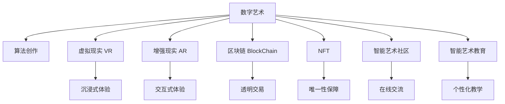

                 

# 数字艺术创业：艺术与科技的完美融合

## 1. 背景介绍

### 1.1 问题由来
在数字技术迅猛发展的今天，艺术与科技的融合成为不可逆转的趋势。数字艺术创业，作为将技术力量与艺术创意相结合的产物，正逐渐成为文化创意产业的新兴力量。无论是通过算法创作艺术作品，还是用科技提升艺术展览体验，数字艺术创业不仅能够催生出独特的艺术形式，更能带动经济效益和社会影响力的提升。

### 1.2 问题核心关键点
1. **艺术创作自动化**：通过算法自动化生成艺术作品，如绘画、音乐、诗歌等。
2. **艺术展示数字化**：利用AR、VR等技术，为观众提供沉浸式的艺术体验。
3. **艺术市场电商化**：利用区块链、NFT等技术，打造数字艺术品交易平台。
4. **艺术社区社交化**：构建线上艺术社区，促进艺术品的交流与收藏。
5. **艺术教育智能化**：开发智能教学系统，提供个性化的艺术学习体验。

### 1.3 问题研究意义
数字艺术创业不仅能够推动艺术与科技的创新融合，更能开拓新的商业模式，催生新的就业机会，对文化产业的发展具有深远的意义。它通过将传统艺术与前沿科技相结合，打破了行业壁垒，为艺术家、技术开发者以及大众提供了更多的可能性。

## 2. 核心概念与联系

### 2.1 核心概念概述

为更好地理解数字艺术创业，本节将介绍几个核心概念：

- **数字艺术**：使用数字技术进行创作、展示和传播的艺术形式，如数字绘画、数字音乐、数字影像等。
- **算法创作**：利用人工智能算法自动生成艺术作品，如GAN、RNN等。
- **虚拟现实（VR）**和**增强现实（AR）**：通过虚拟和增强现实技术，为观众提供沉浸式的艺术体验。
- **区块链（Blockchain）**和**NFT（非同质化代币）**：基于区块链技术的数字艺术品交易平台，保障艺术品的唯一性和真实性。
- **智能艺术社区**：利用社交媒体和AI技术，构建线上艺术交流平台。
- **智能艺术教育**：通过AI驱动的个性化学习系统，提升艺术教育的效果。

这些核心概念之间的逻辑关系可以通过以下Mermaid流程图来展示：



这个流程图展示了大艺术创业中主要概念的关联关系：

1. 数字艺术通过算法创作、VR/AR技术、区块链/NFT等手段进行创作、展示和交易。
2. 智能艺术社区和教育为数字艺术提供了新的传播和学习的平台。
3. 数字艺术创业能够促进艺术与科技的深度融合，产生更多的艺术形式和体验。

## 3. 核心算法原理 & 具体操作步骤
### 3.1 算法原理概述

数字艺术创业涉及多种技术的融合应用，其中包括算法创作、VR/AR、区块链和NFT等。这里以算法创作和区块链技术为例，简要概述其核心原理。

#### 算法创作

算法创作通常使用生成对抗网络（GAN）、循环神经网络（RNN）等深度学习模型，通过训练生成新的艺术作品。其核心原理是让一个模型（生成器）尝试生成与训练数据相似的新数据，而另一个模型（判别器）则试图区分训练数据和新生成数据。通过不断的对抗训练，生成器能够逐渐生成高质量的艺术作品。

#### 区块链和NFT

区块链技术通过去中心化的方式，实现了数字艺术品的透明、不可篡改的交易和所有权证明。NFT（非同质化代币）则通过区块链技术为每个艺术品赋予了唯一的数字证书，确保了艺术品的唯一性和真实性。

### 3.2 算法步骤详解

#### 算法创作步骤

1. **数据准备**：收集和标注艺术作品的数据集，用于训练生成模型。
2. **模型选择**：选择适合的深度学习模型，如GAN、RNN等。
3. **模型训练**：使用标注数据训练生成模型，通过对抗训练过程优化模型。
4. **作品生成**：利用训练好的模型生成新的艺术作品。
5. **作品评估**：通过专家评审或用户反馈，评估生成作品的品质。

#### 区块链和NFT步骤

1. **艺术品上链**：将艺术品上传到区块链平台，并生成NFT。
2. **证书生成**：为每个NFT生成唯一的证书，记录艺术品的详细信息。
3. **所有权转移**：通过智能合约实现艺术品的转移，保障所有权的合法性和透明性。
4. **交易记录**：区块链记录每次艺术品的交易，确保交易的不可篡改性。

### 3.3 算法优缺点

#### 算法创作的优缺点

- **优点**：
  - **高效性**：自动化生成大量高质量艺术品。
  - **多样性**：生成多种风格和类型的艺术作品。
  - **灵活性**：可以根据需求调整算法参数，生成特定风格的作品。

- **缺点**：
  - **艺术性不足**：生成的艺术品可能缺乏个性化和创新性。
  - **过度依赖算法**：人类艺术家的创作情感和独创性无法得到体现。
  - **伦理问题**：生成的艺术品可能被滥用或侵权。

#### 区块链和NFT的优缺点

- **优点**：
  - **安全性**：保障艺术品的所有权和交易透明。
  - **独特性**：每个艺术品具有唯一的数字证书。
  - **市场潜力**：为数字艺术品的交易和收藏提供了新的平台。

- **缺点**：
  - **技术复杂**：区块链和NFT技术门槛较高。
  - **成本较高**：上传和交易艺术品需要支付一定的费用。
  - **易受攻击**：区块链技术易受到黑客攻击和操纵。

### 3.4 算法应用领域

算法创作和区块链技术在数字艺术创业中有着广泛的应用：

1. **艺术创作**：如数字绘画、数字音乐、数字影像等。
2. **数字艺术品交易**：如数字艺术品市场、在线拍卖等。
3. **虚拟现实和增强现实**：如虚拟艺术展览、AR艺术互动等。
4. **艺术教育**：如智能艺术教学系统、在线艺术课程等。
5. **艺术社区**：如线上艺术论坛、艺术家社交网络等。

## 4. 数学模型和公式 & 详细讲解  
### 4.1 数学模型构建

以生成对抗网络（GAN）为例，其核心数学模型可以表示为：

$$
G(z) = \begin{cases}
    \mu + \sigma z, & \text{for real images}\\
    \mu + \sigma z, & \text{for generated images}
\end{cases}
$$

其中，$G(z)$ 为生成器，$z$ 为随机噪声向量，$\mu$ 和 $\sigma$ 为超参数。判别器 $D(x)$ 的模型为：

$$
D(x) = W(x) + B
$$

其中，$x$ 为输入的图像，$W$ 和 $B$ 为判别器的参数。

### 4.2 公式推导过程

GAN的训练过程是通过对抗训练实现的。在每一轮训练中，生成器 $G$ 尝试生成尽可能逼真的图像，而判别器 $D$ 则试图区分真实图像和生成图像。通过不断迭代，生成器逐渐优化，生成高质量的艺术作品。

### 4.3 案例分析与讲解

以 styleGAN 为例，其训练过程分为两个部分：

1. **生成器的训练**：使用真实图像数据集 $X$ 进行训练，目标是最小化生成器 $G$ 生成的图像与真实图像的差异。
2. **判别器的训练**：使用真实图像数据集 $X$ 和生成器 $G$ 生成的图像 $G(z)$ 进行训练，目标是最小化判别器 $D$ 区分真实图像和生成图像的误差。

通过这两个目标函数的联合优化，生成器逐渐学会了生成高质量的艺术作品。

## 5. 项目实践：代码实例和详细解释说明
### 5.1 开发环境搭建

在开始项目实践前，我们需要准备好开发环境。以下是使用Python进行PyTorch和TensorFlow开发的环境配置流程：

1. 安装Anaconda：从官网下载并安装Anaconda，用于创建独立的Python环境。
2. 创建并激活虚拟环境：
```bash
conda create -n pytorch-env python=3.8 
conda activate pytorch-env
```
3. 安装PyTorch和TensorFlow：根据CUDA版本，从官网获取对应的安装命令。例如：
```bash
conda install pytorch torchvision torchaudio cudatoolkit=11.1 -c pytorch -c conda-forge
```
4. 安装TensorFlow：使用pip安装TensorFlow，安装命令如下：
```bash
pip install tensorflow
```
5. 安装各类工具包：
```bash
pip install numpy pandas scikit-learn matplotlib tqdm jupyter notebook ipython
```

完成上述步骤后，即可在`pytorch-env`环境中开始项目实践。

### 5.2 源代码详细实现

以下是使用PyTorch实现GAN的代码实现：

```python
import torch
import torch.nn as nn
import torch.optim as optim
import torchvision.transforms as transforms
import torchvision.datasets as datasets
from torchvision.utils import save_image

class GAN(nn.Module):
    def __init__(self):
        super(GAN, self).__init__()
        self.denoiser = nn.Sequential(
            nn.Linear(100, 256),
            nn.ReLU(),
            nn.Linear(256, 256),
            nn.ReLU(),
            nn.Linear(256, 784),
            nn.Tanh()
        )
        self.discriminator = nn.Sequential(
            nn.Linear(784, 256),
            nn.ReLU(),
            nn.Linear(256, 256),
            nn.ReLU(),
            nn.Linear(256, 1),
            nn.Sigmoid()
        )

    def forward(self, z):
        image = self.denoiser(z)
        real = torch.rand_like(image)
        fake = torch.cat([real, image], dim=0)
        return fake

# 数据准备
mnist = datasets.MNIST('./data', train=True, download=True, transform=transforms.ToTensor())
mnist = torch.utils.data.DataLoader(mnist, batch_size=128, shuffle=True)

# 模型和优化器
gan = GAN()
optimizer = optim.Adam(gan.parameters(), lr=0.0002)
criterion = nn.BCELoss()

# 训练
for epoch in range(1000):
    for i, (real_images, _) in enumerate(mnist):
        real_images = real_images.view(-1, 28*28).float().to(device)
        z = torch.randn(batch_size, 100).float().to(device)

        optimizer.zero_grad()
        fake_images = gan(z)

        real_labels = torch.ones(batch_size, 1).float().to(device)
        fake_labels = torch.zeros(batch_size, 1).float().to(device)
        real_loss = criterion(gan(denoiser(real_images)), real_labels)
        fake_loss = criterion(gan(denoiser(fake_images)), fake_labels)

        loss = real_loss + fake_loss
        loss.backward()
        optimizer.step()

        if i % 50 == 0:
            save_image(denoiser(fake_images), './fake_images/{}.png'.format(epoch))
```

以上就是使用PyTorch实现GAN的完整代码实现。可以看到，使用PyTorch实现GAN相对简洁高效，开发者可以将更多精力放在数据处理、模型改进等高层逻辑上。

### 5.3 代码解读与分析

让我们再详细解读一下关键代码的实现细节：

- **GAN类定义**：定义生成器和判别器，并使用Sequential封装各层。
- **数据准备**：使用PyTorch自带的MNIST数据集，进行数据预处理。
- **模型和优化器**：选择合适的优化器和损失函数，并初始化模型。
- **训练过程**：在训练循环中，每次迭代生成器和判别器各自前向传播计算损失，并反向传播更新参数。
- **保存图像**：每50次迭代保存一次生成器生成的图像，用于可视化。

使用PyTorch实现GAN虽然相对简单，但随着模型规模的增加和数据量的增大，训练过程可能变得复杂。因此，还需要考虑更多的优化策略，如模型并行、学习率调度等，以提升训练效率和模型性能。

## 6. 实际应用场景
### 6.1 数字艺术品创作

数字艺术创作是大艺术创业的重要应用场景之一。通过GAN等算法，可以自动化生成高质量的数字艺术品，如数字绘画、数字音乐等。艺术家可以利用这些技术创作出独特的作品，提升创作效率，扩大创作边界。

### 6.2 数字艺术品交易

数字艺术品交易是大艺术创业的另一重要应用场景。使用区块链和NFT技术，可以构建透明、可信的数字艺术品交易平台，为艺术品买卖双方提供安全保障。艺术家可以通过平台发布和销售自己的作品，买家可以随时查阅艺术品的所有权和交易记录。

### 6.3 虚拟现实和增强现实

虚拟现实和增强现实技术，为大艺术创业提供了新的展示形式。通过VR和AR，观众可以沉浸在数字艺术作品中，体验不同的艺术风格和创意。这不仅提升了艺术品的观赏性，还能引发观众更多的互动和思考。

### 6.4 未来应用展望

随着数字技术的发展，数字艺术创业将在更多领域得到应用，为文化产业带来新的机遇。未来，数字艺术创业可能在以下几个方向取得突破：

1. **虚拟艺术展览**：通过VR和AR技术，构建虚拟艺术展览空间，让观众随时随地体验艺术。
2. **智能艺术创作**：利用AI技术，帮助艺术家进行艺术创作，提升创作效率和作品质量。
3. **艺术教育**：开发智能艺术教学系统，提供个性化的艺术学习体验，扩大艺术教育的覆盖面。
4. **艺术社区**：构建线上艺术社区，促进艺术家之间的交流和合作，激发更多的创意和作品。

## 7. 工具和资源推荐
### 7.1 学习资源推荐

为了帮助开发者系统掌握数字艺术创业的理论基础和实践技巧，这里推荐一些优质的学习资源：

1. **《生成对抗网络（GAN）》**：该书详细介绍了GAN的原理和实现方法，是理解生成式艺术创作的重要参考资料。
2. **CS231n《卷积神经网络和视觉识别》课程**：斯坦福大学开设的视觉识别课程，有Lecture视频和配套作业，带你入门视觉艺术的算法基础。
3. **《Blockchain and Bitcoin》**：该书全面介绍了区块链技术的工作原理和应用场景，是理解数字艺术品交易的基础。
4. **《NFT艺术市场》**：该书介绍了NFT技术的最新发展和市场应用，为数字艺术品交易提供了深入的行业视角。
5. **《虚拟现实和增强现实技术》**：该书详细介绍了VR和AR技术的发展历史和未来趋势，为数字艺术创作提供了技术支撑。

通过对这些资源的学习实践，相信你一定能够快速掌握数字艺术创业的精髓，并用于解决实际的数字艺术问题。

### 7.2 开发工具推荐

高效的开发离不开优秀的工具支持。以下是几款用于数字艺术创业开发的常用工具：

1. **PyTorch**：基于Python的开源深度学习框架，灵活动态的计算图，适合快速迭代研究。
2. **TensorFlow**：由Google主导开发的开源深度学习框架，生产部署方便，适合大规模工程应用。
3. **Blender**：开源3D创作软件，支持建模、渲染、动画等，是大艺术创业中常用的创作工具。
4. **Unity**：广泛使用的游戏开发引擎，支持虚拟现实和增强现实开发。
5. **Web3.js**：用于开发区块链应用的工具，支持以太坊等主流区块链平台。
6. **Sketchfab**：基于Web的3D模型分享平台，支持VR和AR设备的展示和体验。

合理利用这些工具，可以显著提升数字艺术创业的开发效率，加快创新迭代的步伐。

### 7.3 相关论文推荐

数字艺术创业的研究源于学界的持续研究。以下是几篇奠基性的相关论文，推荐阅读：

1. **《生成对抗网络（GAN）》**：Ian Goodfellow等人发表的生成对抗网络论文，奠定了GAN在艺术创作中的基础。
2. **《风格迁移算法》**：由Gatys等人提出的风格迁移算法，通过神经网络实现了风格的迁移和融合，开创了艺术创作的新方法。
3. **《Blockchain Technology》**：Bryant R. Lane等人发表的区块链技术综述，介绍了区块链的工作原理和应用场景。
4. **《NFT Art Marketplace》**：Altitude Publishing发表的NFT艺术市场分析，探讨了NFT在数字艺术品交易中的应用和前景。
5. **《虚拟现实和增强现实技术》**：Andrew A. Multanen等人发表的VR和AR技术综述，介绍了虚拟现实和增强现实的发展历程和未来趋势。

这些论文代表了大艺术创业技术的发展脉络。通过学习这些前沿成果，可以帮助研究者把握学科前进方向，激发更多的创新灵感。

## 8. 总结：未来发展趋势与挑战
### 8.1 总结

本文对数字艺术创业进行了全面系统的介绍。首先阐述了数字艺术创业的背景和意义，明确了艺术创作自动化、虚拟现实和增强现实、区块链和NFT等技术的重要价值。其次，从原理到实践，详细讲解了数字艺术创业的算法创作和区块链技术，给出了数字艺术创业的完整代码实现。同时，本文还探讨了数字艺术创业在数字艺术品创作、数字艺术品交易、虚拟现实和增强现实等领域的广泛应用，展示了数字艺术创业的巨大潜力。此外，本文精选了数字艺术创业的学习资源和开发工具，力求为读者提供全方位的技术指引。

通过本文的系统梳理，可以看到，数字艺术创业不仅能够推动艺术与科技的创新融合，更能开拓新的商业模式，催生新的就业机会，对文化产业的发展具有深远的意义。数字艺术创业通过将传统艺术与前沿科技相结合，打破了行业壁垒，为艺术家、技术开发者以及大众提供了更多的可能性。

### 8.2 未来发展趋势

展望未来，数字艺术创业将呈现以下几个发展趋势：

1. **技术融合加速**：未来的数字艺术创业将更加注重跨领域技术的融合，如AI、VR/AR、区块链等技术的深度结合。
2. **艺术创作民主化**：通过算法自动化创作和智能工具辅助，降低艺术创作的门槛，让更多人参与到艺术创作中来。
3. **数字艺术品市场扩大**：随着技术的成熟和普及，数字艺术品交易将逐渐成为主流，市场规模不断扩大。
4. **虚拟现实和增强现实普及**：VR和AR技术将更加成熟，成为数字艺术展示的重要手段，提升观众的沉浸感和体验感。
5. **智能艺术教育普及**：智能艺术教育系统将不断优化，提供更加个性化和高效的艺术学习体验。

以上趋势凸显了数字艺术创业的广阔前景。这些方向的探索发展，必将进一步推动数字艺术创业技术的进步，为文化产业的发展注入新的活力。

### 8.3 面临的挑战

尽管数字艺术创业已经取得了瞩目成就，但在迈向更加智能化、普适化应用的过程中，它仍面临着诸多挑战：

1. **技术门槛高**：数字艺术创业涉及多种复杂的技术，如深度学习、区块链、VR/AR等，需要开发者具备较强的技术背景。
2. **知识产权保护**：数字艺术品易于复制和传播，如何保护原创者的版权和知识产权，是数字艺术创业面临的重要挑战。
3. **用户接受度低**：传统的艺术形式深入人心，如何让更多人接受和理解数字艺术，还需要时间和市场的检验。
4. **法规和监管**：数字艺术创业涉及多个领域的法律法规，如何在规范框架下运营，还需不断探索和完善。
5. **经济效益不明确**：数字艺术创业的经济效益难以量化，如何平衡艺术价值和经济利益，需要更多实践和研究。

### 8.4 研究展望

面对数字艺术创业所面临的种种挑战，未来的研究需要在以下几个方面寻求新的突破：

1. **降低技术门槛**：开发更加易用和友好的工具和平台，降低数字艺术创业的入门门槛。
2. **保护知识产权**：研究区块链和NFT等技术，建立数字艺术品的版权保护机制。
3. **提升用户体验**：通过VR和AR技术，提升观众的沉浸感和体验感，增加数字艺术品的吸引力。
4. **完善法规和监管**：积极参与行业标准的制定，推动数字艺术创业在规范框架下的健康发展。
5. **探索商业模式**：研究数字艺术创业的多元化商业模式，提升经济效益和市场价值。

这些研究方向将为数字艺术创业提供更加坚实的理论和实践基础，推动数字艺术创业技术的不断进步和应用领域的不断扩大。未来，数字艺术创业必将在更多领域取得突破，为文化产业的发展注入新的动力。

## 9. 附录：常见问题与解答

**Q1：数字艺术创业的门槛高吗？**

A: 数字艺术创业的门槛相对较高，需要具备一定的技术背景和创新思维。但随着技术的不断发展和普及，越来越多的工具和平台正在降低入门门槛，让更多人能够参与到数字艺术创作和创业中来。

**Q2：数字艺术创业如何获得投资？**

A: 数字艺术创业可以通过多种方式获得投资，如天使投资、风险投资、政府基金等。在展示投资价值时，需要充分展示技术的创新性、产品的独特性和市场潜力。

**Q3：数字艺术创业的商业模式有哪些？**

A: 数字艺术创业的商业模式多种多样，如数字艺术品销售、虚拟艺术展览、艺术社区运营等。需要根据自身特点和市场需求，探索适合的模式。

**Q4：数字艺术创业如何保护知识产权？**

A: 数字艺术创业可以通过区块链和NFT技术，为艺术品生成唯一的数字证书，保障所有权和版权。同时，还可以通过版权登记、商标注册等法律手段，保护原创者的权益。

**Q5：数字艺术创业的未来展望是什么？**

A: 未来，数字艺术创业将在更多领域取得突破，如虚拟现实和增强现实、智能艺术教育、数字艺术品交易等。技术的不断进步和市场的逐步成熟，将为数字艺术创业提供更多的机遇和挑战。

---

作者：禅与计算机程序设计艺术 / Zen and the Art of Computer Programming

