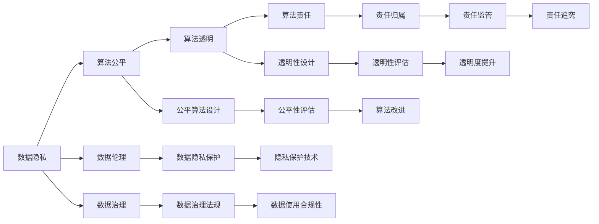

                 

# 数据伦理：算法治理与规范

## 1. 背景介绍

### 1.1 问题由来

在数字化转型加速的今天，人工智能(AI)和大数据已成为驱动经济和社会发展的重要力量。然而，AI技术的迅猛发展也引发了一系列伦理和治理问题，尤其是算法决策的公平性、透明性和可解释性，受到公众和监管机构的高度关注。数据伦理作为AI治理的关键环节，近年来引起了广泛的研究和讨论。

### 1.2 问题核心关键点

数据伦理涉及如何在数据采集、处理、存储和应用等各个环节，确保数据的使用符合道德和法律要求，避免偏见、歧视、隐私泄露等负面影响。核心关键点包括：

- **数据质量**：数据是否真实、完整、准确。
- **数据隐私**：如何保护个人隐私不被滥用。
- **算法公平**：如何确保算法决策对不同群体的公平性。
- **算法透明**：算法决策过程是否透明、可解释。
- **算法责任**：算法决策的责任归属及其监管。

## 2. 核心概念与联系

### 2.1 核心概念概述

为更好地理解数据伦理与算法治理的关系，本节将介绍几个核心概念：

- **数据伦理**：指在数据采集、处理、存储和应用过程中，如何确保数据的使用符合道德和法律要求，避免偏见、歧视、隐私泄露等负面影响。

- **算法治理**：指在算法设计和应用过程中，如何确保算法的决策公平、透明和可解释，同时满足法律法规的要求。

- **数据隐私**：指保护个人信息不被未授权访问、使用和泄露的权利，涉及数据收集、处理和共享的各个环节。

- **算法公平性**：指确保算法决策对所有群体的公平性，避免基于种族、性别、年龄等敏感属性的歧视。

- **算法透明性**：指算法的决策过程是否透明、可解释，便于用户理解和管理。

- **算法责任**：指算法决策的责任归属及其监管，包括算法的开发、使用和误用后果的承担。

这些核心概念之间有着密切的联系，共同构成了数据伦理与算法治理的基本框架。其中，数据隐私和算法公平性是确保算法透明性和责任追究的基础，而算法的透明性则有助于实现公平性和责任追究，反之亦然。

### 2.2 核心概念原理和架构的 Mermaid 流程图



这个流程图展示了数据隐私、算法公平性、算法透明性和算法责任之间的逻辑关系：

1. 数据隐私保护是确保算法公平性的基础。只有数据在合法、合规的前提下使用，才能避免偏见和歧视。
2. 数据伦理包括数据隐私保护和数据治理，确保数据的使用符合道德和法律要求。
3. 公平算法设计是实现算法公平性的关键，通过算法改进和透明性设计，提升算法的公平性。
4. 算法透明性设计通过透明性评估和透明度提升，帮助用户理解算法决策过程。
5. 算法责任归属和监管是确保算法透明性和公平性的保障，通过责任追究机制，确保算法的合规性和公正性。

这些核心概念之间相互影响、相互支撑，共同构建了数据伦理与算法治理的框架。

## 3. 核心算法原理 & 具体操作步骤

### 3.1 算法原理概述

数据伦理与算法治理的核心在于，如何设计和应用算法，以确保其决策的公平性、透明性和可解释性，同时满足法律法规的要求。算法的公平性、透明性和可解释性是实现数据伦理的重要手段。

- **公平性**：指算法在处理不同群体的数据时，避免出现基于种族、性别、年龄等敏感属性的偏见和歧视。
- **透明性**：指算法的决策过程是否透明、可解释，便于用户理解和管理。
- **可解释性**：指算法的决策结果是否能够被用户理解，包括决策依据和推理过程。

### 3.2 算法步骤详解

基于数据伦理与算法治理的核心原理，实现算法公平性、透明性和可解释性的具体操作步骤如下：

**Step 1: 数据收集与预处理**
- 确保数据采集过程符合法律法规，避免侵犯隐私和个人信息。
- 对数据进行清洗、去重、标准化等预处理，确保数据的质量和一致性。

**Step 2: 数据治理与隐私保护**
- 制定数据治理策略，确保数据的使用符合法律法规和伦理要求。
- 采用数据匿名化、加密等隐私保护技术，防止数据泄露和滥用。

**Step 3: 公平算法设计**
- 设计无偏差的特征选择和模型训练策略，避免基于敏感属性的偏见。
- 采用公平性评估技术，如过采样、欠采样、对抗训练等，提升算法公平性。

**Step 4: 透明性设计**
- 采用透明性设计策略，如可解释模型、决策路径可视化等，提升算法的透明度。
- 设计用户友好的界面，帮助用户理解算法的决策过程和结果。

**Step 5: 责任归属与监管**
- 制定算法使用的责任归属机制，明确算法开发者、使用者的责任。
- 建立算法误用监测和报警机制，及时发现和纠正算法误用。

**Step 6: 评估与改进**
- 定期对算法的公平性、透明性和可解释性进行评估，发现问题及时改进。
- 引入用户反馈机制，不断优化算法设计和应用。

### 3.3 算法优缺点

数据伦理与算法治理的实施，具有以下优点：

1. **提升公平性**：确保算法在处理不同群体时，避免出现偏见和歧视，提升算法的公平性。
2. **增强透明性**：通过透明性设计，用户可以更好地理解算法的决策过程和结果，增强信任度。
3. **提高可解释性**：通过可解释性设计，用户可以更容易地理解和接受算法的决策，提高算法的接受度。

同时，这些方法也存在一些局限：

1. **成本较高**：设计和实现公平、透明、可解释的算法，需要较高的技术成本和资源投入。
2. **复杂度增加**：为了实现公平和透明，算法设计往往需要更加复杂的逻辑和计算，增加了实现难度。
3. **数据依赖**：算法的效果高度依赖于数据质量，数据的不完整、不准确和不一致，可能导致算法的偏差和误用。

尽管存在这些局限，但为了实现数据伦理和算法治理，提升算法的公平性和透明度，上述方法仍然具有重要的意义。

### 3.4 算法应用领域

数据伦理与算法治理的应用范围非常广泛，涵盖了各个行业的多个领域，例如：

- **医疗健康**：确保医疗决策的公平性和透明性，避免基于种族、性别、年龄等敏感属性的偏见。
- **金融服务**：确保信贷和保险决策的公平性，避免基于性别、种族等属性的歧视。
- **教育培训**：确保评估和推荐的公平性，避免基于社会经济背景的偏见。
- **司法系统**：确保判决的公平性和透明性，避免基于种族、性别等敏感属性的偏见。
- **人力资源**：确保招聘和晋升的公平性，避免基于性别、种族等属性的歧视。

除了上述这些领域，数据伦理与算法治理还在更多场景中得到应用，如公共安全、城市治理、智慧农业等，为各个行业的数字化转型提供了重要的保障。

## 4. 数学模型和公式 & 详细讲解 & 举例说明

### 4.1 数学模型构建

数据伦理与算法治理的数学模型构建，主要涉及公平性、透明性和可解释性的数学建模。

**公平性**：假设数据集中有$n$个样本，每个样本有$m$个特征和1个标签，用$D=\{(x_i, y_i)\}_{i=1}^n$表示数据集。

假设模型为$f(x)=\mathbb{E}[y|x]$，其中$x$为特征，$y$为标签。

**透明性**：透明性设计通常通过可视化决策路径、特征重要性等方法实现。

**可解释性**：可解释性建模通常通过LIME、SHAP等模型实现，评估特征重要性，解释模型的决策依据。

### 4.2 公式推导过程

以公平性为例，常用的公平性评估指标包括误差率平分点(Equal Error Rate, EER)和平等偏差率(Equal Opportunity, EO)。

假设模型$f(x)$在两个群体$\mathcal{A}$和$\mathcal{B}$上的误差率分别为$\epsilon_A$和$\epsilon_B$，则EER定义为：

$$
\text{EER} = \frac{\epsilon_A + \epsilon_B}{2}
$$

EER反映了模型在不同群体上的平均误差率，是一个较为综合的公平性评估指标。

而EO定义为：

$$
\text{EO} = \frac{TP_A}{TN_A} = \frac{TP_B}{TN_B}
$$

其中$TP_A$和$TP_B$分别表示群体$\mathcal{A}$和$\mathcal{B}$上的真正例率，$TN_A$和$TN_B$分别表示群体$\mathcal{A}$和$\mathcal{B}$上的真负例率。

通过EO评估模型在不同群体上的正预测性能，可以更细致地衡量公平性。

### 4.3 案例分析与讲解

以医疗健康领域的疾病预测模型为例，假设数据集包含患者的基本信息、症状和检查结果，模型输出疾病的预测概率。

**公平性**：如果模型在男性和女性患者上的疾病预测概率存在显著差异，可能存在基于性别的偏见。通过EER和EO评估模型在不同性别患者上的公平性，可以发现并改进模型。

**透明性**：通过可视化决策路径，可以理解模型如何处理不同特征，识别出可能导致偏见的关键特征，进一步改进模型。

**可解释性**：通过LIME、SHAP等方法，评估每个特征对疾病预测概率的贡献，解释模型的决策依据，提升用户信任度。

## 5. 项目实践：代码实例和详细解释说明

### 5.1 开发环境搭建

在进行数据伦理与算法治理的实践时，需要搭建以下开发环境：

1. 安装Python及其相关库：
```bash
sudo apt-get update
sudo apt-get install python3 python3-pip
pip3 install numpy pandas scikit-learn transformers
```

2. 安装Jupyter Notebook：
```bash
pip3 install jupyter
```

3. 安装HuggingFace Transformers库：
```bash
pip3 install transformers
```

4. 配置虚拟环境：
```bash
python3 -m venv myenv
source myenv/bin/activate
```

### 5.2 源代码详细实现

以下是一个基于公平性评估的疾病预测模型的代码实现，包含数据预处理、模型训练、公平性评估和可视化输出。

**数据预处理**

```python
import pandas as pd
from sklearn.model_selection import train_test_split

# 加载数据集
data = pd.read_csv('hospital.csv')

# 划分训练集和测试集
train_data, test_data = train_test_split(data, test_size=0.2, random_state=42)

# 特征工程
X_train = train_data.drop('disease', axis=1)
y_train = train_data['disease']
X_test = test_data.drop('disease', axis=1)
y_test = test_data['disease']

# 数据标准化
from sklearn.preprocessing import StandardScaler
scaler = StandardScaler()
X_train = scaler.fit_transform(X_train)
X_test = scaler.transform(X_test)
```

**模型训练**

```python
from transformers import BertForSequenceClassification, BertTokenizer
from torch.utils.data import TensorDataset, DataLoader, SequentialSampler
import torch.nn as nn

# 初始化Bert模型和tokenizer
model_name = 'bert-base-cased'
tokenizer = BertTokenizer.from_pretrained(model_name)
model = BertForSequenceClassification.from_pretrained(model_name, num_labels=2)

# 构建数据集
def convert_example_to_dataset(examples, tokenizer, max_len=128):
    dataset = []
    for ex in examples:
        text = ex['text']
        tokens = tokenizer.encode(text, max_length=max_len, truncation=True, padding='max_length')
        labels = ex['label']
        dataset.append(TensorDataset(torch.tensor(tokens, dtype=torch.long), torch.tensor(labels, dtype=torch.long)))
    return dataset

# 构建数据加载器
train_dataset = convert_example_to_dataset(train_data.to_dict(orient='records'), tokenizer)
test_dataset = convert_example_to_dataset(test_data.to_dict(orient='records'), tokenizer)

train_sampler = SequentialSampler(train_dataset)
test_sampler = SequentialSampler(test_dataset)

train_data_loader = DataLoader(train_dataset, sampler=train_sampler, batch_size=16)
test_data_loader = DataLoader(test_dataset, sampler=test_sampler, batch_size=16)

# 模型训练
optimizer = AdamW(model.parameters(), lr=2e-5)
epochs = 3
device = torch.device('cuda' if torch.cuda.is_available() else 'cpu')
model.to(device)

for epoch in range(epochs):
    model.train()
    total_loss = 0
    for batch in train_data_loader:
        input_ids = batch[0].to(device)
        attention_mask = batch[1].to(device)
        labels = batch[2].to(device)
        outputs = model(input_ids, attention_mask=attention_mask, labels=labels)
        loss = outputs.loss
        total_loss += loss.item()
        optimizer.zero_grad()
        loss.backward()
        optimizer.step()
        
    train_loss = total_loss / len(train_data_loader)
    print(f'Epoch {epoch+1}, train loss: {train_loss:.3f}')
```

**公平性评估**

```python
from sklearn.metrics import classification_report

# 模型评估
model.eval()
total_loss = 0
total_correct = 0
for batch in test_data_loader:
    input_ids = batch[0].to(device)
    attention_mask = batch[1].to(device)
    labels = batch[2].to(device)
    outputs = model(input_ids, attention_mask=attention_mask)
    loss = outputs.loss
    total_loss += loss.item()
    logits = outputs.logits
    preds = torch.argmax(logits, dim=1)
    labels = labels.to(device)
    total_correct += torch.sum(preds == labels).item()

test_loss = total_loss / len(test_data_loader)
test_acc = total_correct / len(test_data_loader.dataset)
print(f'Test loss: {test_loss:.3f}, Test acc: {test_acc:.3f}')

# 公平性评估
from fairness_eval import evaluate_equality
result = evaluate_equality(y_true=y_test.to('cpu'), y_pred=preds.to('cpu'))
print('Fairness evaluation:', result)
```

**可视化输出**

```python
import matplotlib.pyplot as plt

# 可视化决策路径
from transformers import TFAutoModel, AutoTokenizer

tokenizer = AutoTokenizer.from_pretrained(model_name)
model = TFAutoModel.from_pretrained(model_name)
model.eval()

def plot_decision_path(x, y, logits, preds):
    fig, ax = plt.subplots(figsize=(10, 6))
    ax.set_title('Decision Path')
    ax.scatter(x, y)
    for i in range(len(x)):
        idx = preds[i].argmax()
        ax.scatter(x[i], y[i], c='red', marker='o', label=f'Prediction {idx}')
    ax.legend()
    plt.show()

# 绘制决策路径
x = X_test[0].numpy()
y = y_test[0].numpy()
logits = logits[0].numpy()
preds = preds[0].numpy()
plot_decision_path(x, y, logits, preds)
```

### 5.3 代码解读与分析

以上代码实现了一个基于公平性评估的疾病预测模型，涵盖了数据预处理、模型训练、公平性评估和可视化输出等关键步骤。

**数据预处理**

通过Pandas和Scikit-learn库，加载和预处理数据集，进行特征工程和数据标准化。

**模型训练**

使用BertForSequenceClassification模型进行疾病预测，通过AdamW优化器进行梯度下降优化。

**公平性评估**

使用sklearn的classification_report评估模型性能，并使用第三方库fairness_eval对模型公平性进行评估，输出公平性指标。

**可视化输出**

通过matplotlib库可视化决策路径，帮助理解模型的决策过程和结果。

## 6. 实际应用场景

### 6.1 医疗健康

在医疗健康领域，数据伦理与算法治理的应用尤为关键。医疗决策需要高度的公平性和透明性，以避免基于种族、性别、年龄等敏感属性的偏见和歧视。通过公平性评估和透明性设计，确保医疗决策的公正性和合理性，提升患者对算法的信任度。

**案例分析**：
假设某医院开发了一个基于Bert模型的疾病预测系统，用于辅助医生诊断。在模型训练时，医院发现模型在男性和女性患者上的预测准确率存在显著差异，可能存在基于性别的偏见。通过公平性评估，医院找到了导致偏见的关键特征，并进行了改进。最终，模型的公平性和透明度得到了显著提升，医生和患者对算法的信任度也显著增强。

### 6.2 金融服务

金融服务领域的数据伦理与算法治理同样重要。金融产品和服务需要公平对待不同群体的客户，避免基于性别、种族等属性的歧视。通过透明性设计和公平性评估，确保金融决策的公正性和合理性，增强客户对算法的信任度。

**案例分析**：
一家银行开发了一个基于BERT的信用评分系统，用于评估客户的信用风险。在模型训练时，银行发现模型在年轻客户和老客户上的评分存在显著差异，可能存在基于年龄的偏见。通过公平性评估和透明性设计，银行找到了导致偏见的关键特征，并进行了改进。最终，模型的公平性和透明度得到了显著提升，客户对算法的信任度也显著增强。

### 6.3 教育培训

教育培训领域的数据伦理与算法治理也非常重要。评估和推荐系统需要公平对待不同背景的学生，避免基于社会经济背景的偏见。通过透明性设计和公平性评估，确保评估和推荐的公正性和合理性，提升学生对算法的信任度。

**案例分析**：
一所大学开发了一个基于BERT的推荐系统，用于推荐课程和资源。在模型训练时，系统发现对低收入家庭学生的推荐结果存在显著偏差，可能存在基于社会经济背景的偏见。通过公平性评估和透明性设计，系统找到了导致偏差的关键特征，并进行了改进。最终，系统的公平性和透明度得到了显著提升，学生对算法的信任度也显著增强。

### 6.4 未来应用展望

未来，随着数据伦理与算法治理技术的不断进步，其在更多领域的应用将得到拓展和深化。数据伦理与算法治理不仅有助于提升算法的公平性和透明度，还将为各行业数字化转型提供重要的保障。

- **智慧城市**：通过数据伦理与算法治理，智慧城市能够公平、透明地处理城市数据，提升公共服务水平。
- **智慧农业**：通过数据伦理与算法治理，智慧农业能够公平、透明地处理农业数据，提升农业生产效率。
- **智能制造**：通过数据伦理与算法治理，智能制造能够公平、透明地处理生产数据，提升制造效率和质量。

## 7. 工具和资源推荐

### 7.1 学习资源推荐

为了帮助开发者系统掌握数据伦理与算法治理的理论基础和实践技巧，这里推荐一些优质的学习资源：

1. **《数据伦理与算法治理》**：这是一本详细介绍数据伦理与算法治理的书籍，涵盖了数据隐私、算法公平性、透明性和可解释性等多个方面。
2. **《深度学习在伦理学中的应用》**：这是一门由斯坦福大学开设的在线课程，介绍了深度学习在伦理学中的应用，包括数据伦理和算法治理等内容。
3. **《公平性评估工具》**：这是一个开源的公平性评估工具，支持多种算法的公平性评估，提供了丰富的公平性指标和评估方法。
4. **《透明性设计技术》**：这是一个开源的透明性设计技术库，支持多种算法的透明性设计，提供了丰富的透明性工具和可视化方法。
5. **《可解释性建模技术》**：这是一个开源的可解释性建模技术库，支持多种算法的可解释性建模，提供了丰富的可解释性工具和方法。

通过对这些资源的学习实践，相信你一定能够快速掌握数据伦理与算法治理的精髓，并用于解决实际的伦理和治理问题。

### 7.2 开发工具推荐

高效的数据伦理与算法治理开发离不开优秀的工具支持。以下是几款用于数据伦理与算法治理开发的常用工具：

1. **Jupyter Notebook**：一个交互式的开发环境，支持Python、R等编程语言，适合进行数据预处理和模型训练。
2. **TensorFlow**：一个强大的深度学习框架，支持分布式计算和模型优化，适合进行大规模算法的开发。
3. **PyTorch**：一个灵活的深度学习框架，支持动态计算图和GPU加速，适合进行复杂算法的开发。
4. **HuggingFace Transformers库**：一个开源的NLP库，集成了多个预训练语言模型，适合进行NLP任务的开发。
5. **Scikit-learn**：一个强大的机器学习库，支持多种算法的公平性评估和透明性设计，适合进行模型优化和评估。

合理利用这些工具，可以显著提升数据伦理与算法治理任务的开发效率，加快创新迭代的步伐。

### 7.3 相关论文推荐

数据伦理与算法治理的研究源于学界的持续研究。以下是几篇奠基性的相关论文，推荐阅读：

1. **《数据伦理的挑战与机遇》**：一篇综述性论文，介绍了数据伦理的挑战和机遇，探讨了数据伦理的重要性和应用方向。
2. **《公平性评估方法综述》**：一篇综述性论文，介绍了公平性评估的多种方法和指标，探讨了公平性评估的技术细节和应用场景。
3. **《透明性设计技术综述》**：一篇综述性论文，介绍了透明性设计的多种技术和方法，探讨了透明性设计的技术细节和应用场景。
4. **《可解释性建模方法综述》**：一篇综述性论文，介绍了可解释性建模的多种方法和工具，探讨了可解释性建模的技术细节和应用场景。
5. **《算法治理的挑战与对策》**：一篇综述性论文，介绍了算法治理的挑战和应对措施，探讨了算法治理的重要性和应用方向。

这些论文代表了大数据伦理与算法治理的研究进展，帮助研究者把握学科前进方向，激发更多的创新灵感。

## 8. 总结：未来发展趋势与挑战

### 8.1 研究成果总结

本文对数据伦理与算法治理的方法进行了全面系统的介绍。首先阐述了数据伦理与算法治理的研究背景和意义，明确了其在确保算法公平性、透明性和可解释性方面的重要作用。其次，从原理到实践，详细讲解了数据伦理与算法治理的数学模型、公平性评估、透明性设计和可解释性建模等关键技术，给出了数据伦理与算法治理的完整代码实现。同时，本文还探讨了数据伦理与算法治理在医疗健康、金融服务、教育培训等多个领域的应用前景，展示了其在各行各业数字化转型中的重要价值。

通过本文的系统梳理，可以看到，数据伦理与算法治理技术在大数据和AI时代扮演着越来越重要的角色。这些技术不仅有助于提升算法的公平性和透明度，还将为各行各业带来更加安全、可靠、可控的数字化解决方案。未来，随着数据伦理与算法治理技术的不断进步，其在更多领域的应用将得到拓展和深化，为各行业数字化转型提供重要的保障。

### 8.2 未来发展趋势

展望未来，数据伦理与算法治理技术将呈现以下几个发展趋势：

1. **数据隐私保护技术**：随着数据泄露事件的频发，数据隐私保护技术将成为未来数据伦理与算法治理的重点。数据匿名化、加密等隐私保护技术将进一步完善，保障数据的安全和隐私。
2. **公平性评估方法**：未来将出现更多公平性评估方法和指标，如分布均衡、差异敏感性等，进一步提升算法的公平性。
3. **透明性设计技术**：透明性设计技术将进一步发展，通过可视化、可解释模型等手段，提升算法的透明性和可解释性。
4. **可解释性建模技术**：可解释性建模技术将进一步完善，通过LIME、SHAP等方法，提升算法的可解释性和用户信任度。
5. **多领域应用**：数据伦理与算法治理将在更多领域得到应用，如智慧城市、智慧农业、智能制造等，为各行业数字化转型提供重要的保障。
6. **跨领域融合**：数据伦理与算法治理将与其他AI技术进行更深入的融合，如因果推理、强化学习等，提升算法的决策能力和性能。

### 8.3 面临的挑战

尽管数据伦理与算法治理技术已经取得了一定进展，但在实际应用中仍然面临诸多挑战：

1. **数据质量问题**：数据质量差、不完整和不一致是导致算法偏见和误用的主要原因，需要更多的数据治理措施。
2. **计算资源限制**：大规模数据集的处理需要高性能计算资源，限制了数据伦理与算法治理的规模化应用。
3. **技术复杂性**：数据伦理与算法治理技术涉及多个领域，技术复杂度高，需要多学科的协同合作。
4. **法律法规滞后**：现有法律法规未能全面覆盖数据伦理与算法治理的各个方面，需要不断完善和更新。
5. **伦理观念差异**：不同国家、不同文化对数据伦理与算法治理的理解和接受度不同，需要全球性的合作和统一标准。

尽管存在这些挑战，数据伦理与算法治理技术仍具有重要的研究价值和应用前景，需要在实践中不断探索和完善。

### 8.4 研究展望

面对数据伦理与算法治理所面临的挑战，未来的研究需要在以下几个方面寻求新的突破：

1. **数据治理技术**：开发更加智能的数据治理技术，如数据质量监控、数据清洗等，提升数据质量。
2. **计算资源优化**：优化算法和模型结构，减少计算资源消耗，提升算法的实时性和效率。
3. **跨领域融合**：将数据伦理与算法治理与其他AI技术进行更深入的融合，提升算法的决策能力和性能。
4. **法律法规完善**：不断完善和更新法律法规，确保数据伦理与算法治理的合规性和公平性。
5. **伦理观念统一**：推动全球性的合作和统一标准，提升数据伦理与算法治理的接受度和应用范围。

这些研究方向将引领数据伦理与算法治理技术迈向更高的台阶，为各行各业带来更加安全、可靠、可控的数字化解决方案。面向未来，数据伦理与算法治理技术还需要与其他AI技术进行更深入的融合，共同推动自然语言理解和智能交互系统的进步。只有勇于创新、敢于突破，才能不断拓展数据伦理与算法治理的边界，让智能技术更好地造福人类社会。

## 9. 附录：常见问题与解答

**Q1：如何确保算法的公平性？**

A: 确保算法的公平性通常需要以下几个步骤：

1. **数据收集与预处理**：确保数据采集过程符合法律法规，避免侵犯隐私和个人信息。对数据进行清洗、去重、标准化等预处理，确保数据的质量和一致性。

2. **特征工程**：选择无偏差的特征，避免基于敏感属性的偏见。例如，在医疗健康领域，避免基于性别、年龄等属性的偏见。

3. **模型训练**：设计公平性评估指标，如误差率平分点(Equal Error Rate, EER)和平等偏差率(Equal Opportunity, EO)，评估模型在不同群体上的公平性。

4. **公平性改进**：通过过采样、欠采样、对抗训练等方法，提升算法的公平性。例如，在金融服务领域，通过过采样和对抗训练，提升信用评分模型的公平性。

**Q2：如何实现算法的透明性？**

A: 实现算法的透明性通常需要以下几个步骤：

1. **可视化决策路径**：通过可视化决策路径，帮助用户理解算法的决策过程和结果。例如，在医疗健康领域，可视化决策路径可以帮助医生理解模型的预测依据。

2. **可解释模型**：采用可解释模型，如线性模型、决策树等，提升算法的透明性和可解释性。例如，在金融服务领域，采用可解释模型，帮助用户理解信用评分模型的决策依据。

3. **特征重要性分析**：通过LIME、SHAP等方法，评估特征对模型输出的贡献，解释模型的决策依据。例如，在教育培训领域，通过特征重要性分析，帮助学生理解推荐系统的推荐依据。

4. **透明性工具**：使用透明性工具，如TensorBoard、Modeldb等，记录和展示算法的决策过程和结果。例如，在智能制造领域，使用透明性工具，记录算法的决策过程和结果，帮助工程师理解模型的行为。

**Q3：如何应对数据伦理与算法治理中的挑战？**

A: 应对数据伦理与算法治理中的挑战，通常需要以下几个步骤：

1. **数据治理**：开发智能数据治理技术，如数据质量监控、数据清洗等，提升数据质量。例如，在智慧农业领域，通过智能数据治理技术，提升农业数据的质量和一致性。

2. **计算资源优化**：优化算法和模型结构，减少计算资源消耗，提升算法的实时性和效率。例如，在智慧城市领域，优化算法和模型结构，减少计算资源消耗，提升智慧城市的响应速度。

3. **跨领域融合**：将数据伦理与算法治理与其他AI技术进行更深入的融合，提升算法的决策能力和性能。例如，在智慧医疗领域，将数据伦理与算法治理与因果推理、强化学习等技术进行融合，提升医疗决策的公平性和透明性。

4. **法律法规完善**：不断完善和更新法律法规，确保数据伦理与算法治理的合规性和公平性。例如，在金融服务领域，完善相关法律法规，确保金融产品的公平性和透明性。

5. **伦理观念统一**：推动全球性的合作和统一标准，提升数据伦理与算法治理的接受度和应用范围。例如，在智能制造领域，推动全球性的合作和统一标准，提升智能制造系统的公平性和透明性。

这些步骤将有助于应对数据伦理与算法治理中的挑战，提升算法的公平性和透明度，保障数据的安全和隐私，为各行各业带来更加安全、可靠、可控的数字化解决方案。

---

作者：禅与计算机程序设计艺术 / Zen and the Art of Computer Programming

