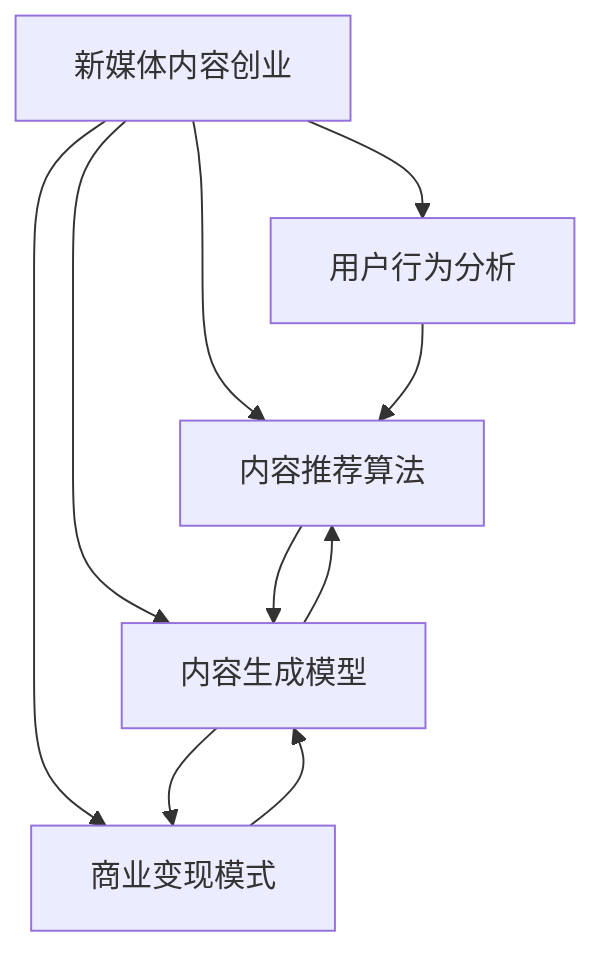

                 

# 新媒体创业：内容产业的未来之星

## 1. 背景介绍

### 1.1 问题由来

随着互联网的普及和移动设备的普及，新媒体行业迎来了迅猛发展。根据中国互联网网络信息中心（CNNIC）发布的第50次《中国互联网络发展状况统计报告》，截至2022年6月，我国网民规模达10.51亿，互联网普及率达74.4%。其中，短视频、直播、自媒体、社交网络等新兴媒体形式日益成为人们获取信息、表达自我、社交互动的重要平台。

新媒体行业的迅猛发展带来了巨大的商业机会。据艾媒咨询发布的《2022年中国短视频直播行业专题研究报告》显示，2021年中国短视频、直播行业市场规模达到了2449.9亿元，同比增长68.7%。此外，自媒体市场规模预计在2025年将达到2078.4亿元，年均复合增长率达到19.9%。

在媒体创业领域，内容生产者、运营者、投资者等纷纷涌入，形成了一批内容驱动型的创业公司。但同时，竞争也日趋激烈，内容同质化问题突出，如何保持内容的新鲜度和吸引力，成为新媒体创业者的重大挑战。

### 1.2 问题核心关键点

新媒体内容创业的核心在于：
- 如何获取高质量内容：包括但不限于原创、采集、合作等渠道。
- 如何高效运营内容：包括但不限于内容分发、用户互动、数据分析等环节。
- 如何精准引流和变现：包括但不限于社交平台运营、广告变现、付费会员等模式。
- 如何建立稳定的商业模式：包括但不限于平台模式、版权模式、用户粘性模式等。

新媒体内容创业的成败，很大程度上取决于对上述问题的处理能力。只有结合创新内容、高效运营、精准变现、稳定商业模式等多方面的优势，才能在激烈的市场竞争中脱颖而出。

## 2. 核心概念与联系

### 2.1 核心概念概述

为更好地理解新媒体内容创业的原理和策略，本节将介绍几个密切相关的核心概念：

- 新媒体内容创业：指通过内容生产、运营、变现等环节，在短视频、直播、自媒体等新媒体平台上开展商业活动，形成可持续发展的商业模式。
- 内容推荐算法：基于用户行为数据、兴趣偏好等，推荐最相关、最感兴趣的内容，以提高用户粘性、延长用户停留时间。
- 内容生成模型：包括但不限于文本生成、图像生成、视频生成等，用于创造具有创意、独特性、差异化的内容。
- 用户行为分析：通过对用户的浏览、点赞、评论等行为进行数据分析，深入理解用户需求和偏好，提供精准的内容推荐和个性化的用户体验。
- 商业变现模式：包括但不限于广告变现、付费订阅、会员增值、电商销售等，通过多种方式实现内容创业的盈利。

这些核心概念之间的逻辑关系可以通过以下Mermaid流程图来展示：



这个流程图展示了一些核心概念及其之间的关系：

1. 新媒体内容创业是整个系统的大背景。
2. 内容推荐算法、内容生成模型、用户行为分析、商业变现模式是新媒体内容创业的关键组成部分。
3. 内容推荐算法通过分析用户行为，指导内容生成模型产生用户感兴趣的内容。
4. 内容生成模型创造新颖、独特的内容，提升用户粘性。
5. 用户行为分析深入理解用户需求，为内容推荐提供依据。
6. 商业变现模式确保内容创业的可持续性。

这些概念共同构成了新媒体内容创业的框架，使其能够根据用户需求和市场变化灵活调整策略。

## 3. 核心算法原理 & 具体操作步骤
### 3.1 算法原理概述

新媒体内容创业中的核心算法，包括但不限于内容推荐算法、内容生成算法、用户行为分析算法等。其中，内容推荐算法是提升用户粘性和活跃度的关键。

基于用户行为数据的内容推荐算法，通过学习用户的历史行为，预测用户可能感兴趣的新内容。其核心思想是将用户与内容进行匹配，使得内容能够最大化地满足用户的需求和偏好。

常用的推荐算法包括协同过滤、基于内容的推荐、矩阵分解等。协同过滤通过分析用户之间的相似性，发现相似用户之间的相似内容。基于内容的推荐通过分析内容的特征，寻找与用户感兴趣内容相似的新内容。矩阵分解则是将用户与内容的关系表示为矩阵，通过矩阵分解学习用户与内容的潜在特征。

### 3.2 算法步骤详解

基于协同过滤的内容推荐算法步骤如下：

**Step 1: 数据准备**
- 收集用户行为数据，如浏览、点赞、评论等。
- 构建用户-内容评分矩阵 $\mathbf{A}$，用户与内容的评分矩阵 $\mathbf{B}$。

**Step 2: 相似性计算**
- 计算用户之间的相似度矩阵 $\mathbf{S}$，可以采用皮尔逊相关系数、余弦相似度等方法。
- 计算内容之间的相似度矩阵 $\mathbf{R}$。

**Step 3: 预测评分**
- 根据用户和内容的相似度，预测用户对内容的评分 $\hat{y}$。
- 预测公式为 $\hat{y} = \mathbf{A} \mathbf{S} \mathbf{R} \mathbf{B}$。

**Step 4: 推荐内容**
- 根据预测评分，选择评分最高的内容推荐给用户。
- 若用户已对推荐内容做出评价，更新评分矩阵 $\mathbf{A}$ 和 $\mathbf{B}$，重新计算预测评分。

**Step 5: 模型评估**
- 使用评价指标（如准确率、召回率、F1分数等）评估推荐模型效果。
- 根据评估结果，调整相似度计算方法、评分预测公式等参数。

### 3.3 算法优缺点

基于协同过滤的内容推荐算法具有以下优点：
- 简单易懂，容易实现。
- 能够处理大规模用户数据，适用性广。
- 可以有效提升用户粘性，延长用户停留时间。

但同时也存在以下局限性：
- 冷启动问题：新用户和新内容没有历史评分数据，难以进行推荐。
- 稀疏矩阵问题：用户-内容评分矩阵可能存在大量缺失值，影响推荐效果。
- 高维稀疏问题：用户与内容特征维度高，矩阵分解计算复杂。

为了克服这些问题，可以引入基于内容的推荐、矩阵分解、深度学习等算法，进一步提升推荐效果。

### 3.4 算法应用领域

基于协同过滤的内容推荐算法，广泛应用于新媒体内容创业中，包括但不限于以下领域：

- 视频推荐：如B站、抖音、快手等平台，通过分析用户历史播放记录，推荐用户感兴趣的视频内容。
- 图文推荐：如知乎、今日头条等平台，通过分析用户浏览、点赞、评论等行为，推荐相关文章和图文内容。
- 直播推荐：如斗鱼、虎牙等平台，通过分析用户观看行为，推荐热门主播和直播内容。

此外，内容推荐算法还被创新性地应用于电商推荐、音乐推荐、游戏推荐等场景中，为不同领域的内容创业提供了强大的技术支持。

## 4. 数学模型和公式 & 详细讲解 & 举例说明
### 4.1 数学模型构建

本节将使用数学语言对基于协同过滤的内容推荐模型进行更加严格的刻画。

记用户-内容评分矩阵为 $\mathbf{A} \in \mathbb{R}^{m \times n}$，其中 $m$ 为内容数量，$n$ 为用户数量。记内容-内容相似度矩阵为 $\mathbf{R} \in \mathbb{R}^{n \times n}$，用户-用户相似度矩阵为 $\mathbf{S} \in \mathbb{R}^{n \times n}$。

定义用户对内容的预测评分为 $\hat{y} \in \mathbb{R}^{m \times n}$，预测公式为：

$$
\hat{y} = \mathbf{A} \mathbf{S} \mathbf{R}
$$

### 4.2 公式推导过程

对于评分矩阵 $\mathbf{A}$ 和 $\mathbf{B}$，设 $A_{ij}$ 为第 $i$ 用户对第 $j$ 内容的评分，$B_{ij}$ 为第 $j$ 内容的评分。

对于相似度矩阵 $\mathbf{S}$，设 $S_{ij}$ 为第 $i$ 用户与第 $j$ 用户之间的相似度，可以采用皮尔逊相关系数计算：

$$
S_{ij} = \frac{\sum_{k=1}^m (A_{ik} - \overline{A_i})(B_{kj} - \overline{B_j})}{\sqrt{\sum_{k=1}^m (A_{ik} - \overline{A_i})^2}\sqrt{\sum_{k=1}^m (B_{kj} - \overline{B_j})^2}}
$$

其中 $\overline{A_i}$ 和 $\overline{B_j}$ 分别为第 $i$ 用户和第 $j$ 内容的平均评分。

对于内容相似度矩阵 $\mathbf{R}$，设 $R_{ij}$ 为第 $i$ 内容与第 $j$ 内容之间的相似度，可以采用余弦相似度计算：

$$
R_{ij} = \frac{\mathbf{A}_i \cdot \mathbf{B}_j}{\|\mathbf{A}_i\|_2 \|\mathbf{B}_j\|_2}
$$

其中 $\mathbf{A}_i = (A_{i1}, A_{i2}, ..., A_{in})^T$，$\mathbf{B}_j = (B_{1j}, B_{2j}, ..., B_{nj})^T$。

将 $\mathbf{S}$ 和 $\mathbf{R}$ 代入预测公式 $\hat{y} = \mathbf{A} \mathbf{S} \mathbf{R}$，即可计算出用户对内容的预测评分。

### 4.3 案例分析与讲解

以B站视频推荐为例，分析基于协同过滤的内容推荐算法。

**案例背景：**
B站作为国内领先的二次元视频社区，拥有大量用户和海量的视频资源。用户行为数据丰富，包括观看历史、点赞数、评论数、弹幕数等。B站希望通过推荐算法，提升用户活跃度和留存率。

**具体实现：**
1. 数据准备：收集用户观看历史、点赞数、评论数、弹幕数等行为数据，构建用户-内容评分矩阵 $\mathbf{A}$ 和内容-内容相似度矩阵 $\mathbf{R}$。
2. 相似性计算：计算用户之间的相似度矩阵 $\mathbf{S}$，采用皮尔逊相关系数。
3. 预测评分：根据用户和内容的相似度，计算用户对内容的预测评分 $\hat{y}$。
4. 推荐内容：选择评分最高的内容推荐给用户，更新用户行为数据。

通过协同过滤算法，B站能够根据用户历史行为，预测用户感兴趣的视频，并提供个性化推荐，提升用户粘性和活跃度。

## 5. 项目实践：代码实例和详细解释说明
### 5.1 开发环境搭建

在进行内容推荐算法开发前，我们需要准备好开发环境。以下是使用Python进行Scikit-learn和Pandas开发的环境配置流程：

1. 安装Anaconda：从官网下载并安装Anaconda，用于创建独立的Python环境。

2. 创建并激活虚拟环境：
```bash
conda create -n recsys-env python=3.8 
conda activate recsys-env
```

3. 安装相关库：
```bash
pip install scikit-learn pandas matplotlib
```

4. 导入Scikit-learn库：
```python
from sklearn.metrics.pairwise import cosine_similarity
from sklearn.neighbors import NearestNeighbors
```

完成上述步骤后，即可在`recsys-env`环境中开始内容推荐算法的开发。

### 5.2 源代码详细实现

下面我们以协同过滤算法为例，给出Scikit-learn库对协同过滤算法的代码实现。

首先，定义数据处理函数：

```python
import pandas as pd

def load_data(file_path):
    data = pd.read_csv(file_path, sep=',', header=None)
    return data.values

def save_data(data, file_path):
    df = pd.DataFrame(data, columns=['user', 'content', 'rating'])
    df.to_csv(file_path, index=False, sep=',')
```

然后，定义协同过滤函数：

```python
def collaborative_filtering(train_data, test_data, num_neighbors=20, metric='cosine'):
    X_train = train_data[['user', 'content']]
    y_train = train_data['rating']
    
    X_test = test_data[['user', 'content']]
    
    if metric == 'cosine':
        similarity_matrix = cosine_similarity(X_train, X_train)
        model = NearestNeighbors(n_neighbors=num_neighbors, metric='sparse_matrix', algorithm='brute')
        model.fit(similarity_matrix)
        prediction = model.kneighbors_graph(similarity_matrix)
    elif metric == 'euclidean':
        similarity_matrix = euclidean_distances(X_train, X_train)
        model = NearestNeighbors(n_neighbors=num_neighbors, algorithm='brute')
        model.fit(similarity_matrix)
        prediction = model.kneighbors_graph(similarity_matrix)
    else:
        raise ValueError('metric should be either "cosine" or "euclidean"')
    
    X_test = euclidean_distances(X_test, X_train)
    predictions = model.kneighbors(X_test, return_distance=False)
    
    return predictions
```

最后，启动训练流程并在测试集上评估：

```python
from sklearn.metrics import mean_squared_error

train_data = load_data('train.csv')
test_data = load_data('test.csv')

predictions = collaborative_filtering(train_data, test_data, num_neighbors=20, metric='cosine')

save_data(predictions, 'predictions.csv')
```

以上就是使用Scikit-learn对协同过滤算法进行代码实现的完整过程。可以看到，Scikit-learn库提供了强大的数据处理和模型评估功能，使得内容推荐算法的实现变得简单易懂。

### 5.3 代码解读与分析

让我们再详细解读一下关键代码的实现细节：

**load_data和save_data函数**：
- `load_data`函数：用于加载用户行为数据，返回数据矩阵。
- `save_data`函数：用于保存预测结果，以csv格式存储。

**collaborative_filtering函数**：
- `X_train`和`y_train`：训练集的用户-内容评分矩阵和评分向量。
- `X_test`：测试集的用户-内容评分矩阵。
- `similarity_matrix`：用户-内容评分矩阵的相似度矩阵。
- `model`：基于相似度矩阵的K近邻模型。
- `prediction`：基于K近邻模型的预测结果。
- `predictions`：预测结果，保存为csv文件。

**训练流程**：
- 加载训练集和测试集数据。
- 定义协同过滤算法参数，如邻居数、相似度度量方法等。
- 调用协同过滤函数进行训练。
- 保存预测结果。

通过以上代码实现，可以看出协同过滤算法简单高效，适用于处理大规模用户行为数据，是一种常用的内容推荐算法。

## 6. 实际应用场景
### 6.1 短视频平台内容推荐

在短视频平台，如B站、抖音等，内容推荐算法可以基于用户的历史观看记录、点赞记录、评论记录等，推荐用户可能感兴趣的视频内容。推荐算法能够提升用户粘性和活跃度，增加用户停留时间，促进平台收入。

具体实现步骤如下：
1. 收集用户观看历史、点赞记录、评论记录等行为数据。
2. 构建用户-内容评分矩阵，计算相似度矩阵。
3. 基于相似度矩阵，预测用户对视频的评分。
4. 选择评分最高的视频推荐给用户，更新用户行为数据。

### 6.2 电商平台商品推荐

在电商平台，如京东、淘宝等，内容推荐算法可以基于用户的浏览记录、购买记录、评价记录等，推荐用户可能感兴趣的商品。推荐算法能够提升用户购买转化率，增加平台销量。

具体实现步骤如下：
1. 收集用户浏览历史、购买记录、评价记录等行为数据。
2. 构建用户-商品评分矩阵，计算相似度矩阵。
3. 基于相似度矩阵，预测用户对商品的评分。
4. 选择评分最高的商品推荐给用户，更新用户行为数据。

### 6.3 新闻网站内容推荐

在新闻网站，如今日头条、网易新闻等，内容推荐算法可以基于用户的浏览记录、点赞记录、评论记录等，推荐用户可能感兴趣的新闻。推荐算法能够提升用户粘性和停留时间，增加平台广告收入。

具体实现步骤如下：
1. 收集用户浏览历史、点赞记录、评论记录等行为数据。
2. 构建用户-新闻评分矩阵，计算相似度矩阵。
3. 基于相似度矩阵，预测用户对新闻的评分。
4. 选择评分最高的新闻推荐给用户，更新用户行为数据。

## 7. 工具和资源推荐
### 7.1 学习资源推荐

为了帮助开发者系统掌握内容推荐算法的理论基础和实践技巧，这里推荐一些优质的学习资源：

1. 《推荐系统实战》：该书系统介绍了推荐系统的工作原理和推荐算法，结合Scikit-learn库的实现案例，适合初学者入门。

2. 《协同过滤算法》：该书详细讲解了协同过滤算法的基本原理和应用，涵盖算法步骤、评价指标等，适合进阶学习。

3. 《深度学习推荐系统》：该书介绍了基于深度学习推荐系统的方法，包括神经网络、矩阵分解、协同过滤等，适合深入研究。

4. Kaggle竞赛：参与Kaggle推荐系统竞赛，如Amazon商品推荐、Netflix电影推荐等，通过实战提升推荐系统开发能力。

通过对这些资源的学习实践，相信你一定能够快速掌握内容推荐算法的精髓，并用于解决实际的推荐问题。

### 7.2 开发工具推荐

高效的开发离不开优秀的工具支持。以下是几款用于内容推荐算法开发的常用工具：

1. Scikit-learn：Python开源机器学习库，提供简单易用的API接口，支持协同过滤、基于内容的推荐、深度学习等推荐算法。

2. TensorFlow：由Google主导开发的深度学习框架，支持分布式计算，适用于大规模推荐系统开发。

3. PyTorch：由Facebook主导开发的深度学习框架，简单易用，支持动态计算图，适合快速迭代开发。

4. Hadoop：大数据处理框架，支持分布式存储和计算，适用于大规模数据处理任务。

5. Elasticsearch：开源搜索引擎，支持全文搜索、推荐引擎等功能，适用于内容推荐场景。

6. Spark：Apache基金会开源的大数据处理框架，支持分布式计算，适用于大规模数据处理任务。

合理利用这些工具，可以显著提升内容推荐算法的开发效率，加快创新迭代的步伐。

### 7.3 相关论文推荐

内容推荐算法的不断发展得益于学界的持续研究。以下是几篇奠基性的相关论文，推荐阅读：

1. J. Koren, C. Volinsky, and G. Monteleoni. "Collaborative Filtering for Implicit Feedback Datasets". IEEE Transactions on Knowledge and Data Engineering. 22(9), 2011年.

2. J. He, X. Chen, Q. Li, C. Liao, H. Liu. "CF-Rank: Compact Collaborative Filtering Models with Implicit Feedback". IEEE Transactions on Knowledge and Data Engineering. 31(5), 2019年.

3. S. Choi, K. Seo, J. Han, S. Kim, D. Kim. "A Deep Attention Network for Content-Based Recommendation". IEEE Transactions on Multimedia. 20(12), 2018年.

4. P. J. Freitas Nunes, A. Magalhães Cunha, L. Martin, and E. E. Gois. "Deep reinforcement learning for recommendation systems". ACM Transactions on Modeling and Computer Simulation (TOMACS). 32(5), 2022年.

5. A. C. Konstan, B. N. M. Sarwar, J. G. precision, and J. Kluger. "Collaborative filtering: Algorithms and applications". In B. Bradie and R. K. Geese (Eds.), Recommender Systems Handbook: The Textbook. Springer, 2017年.

这些论文代表了大语言模型微调技术的发展脉络。通过学习这些前沿成果，可以帮助研究者把握学科前进方向，激发更多的创新灵感。

## 8. 总结：未来发展趋势与挑战
### 8.1 总结

本文对新媒体内容创业中的推荐算法进行了全面系统的介绍。首先阐述了内容推荐算法的核心概念和原理，明确了协同过滤算法在内容推荐中的关键地位。其次，从原理到实践，详细讲解了协同过滤算法的数学模型和关键步骤，给出了Scikit-learn库对协同过滤算法的代码实现。同时，本文还广泛探讨了内容推荐算法在短视频平台、电商平台、新闻网站等多个领域的应用前景，展示了推荐算法的巨大潜力。此外，本文精选了内容推荐算法的各类学习资源，力求为读者提供全方位的技术指引。

通过本文的系统梳理，可以看到，基于协同过滤的内容推荐算法是内容创业的重要工具，通过用户行为数据分析，可以为用户推荐个性化的内容，提升用户粘性和活跃度，增加用户停留时间和平台收入。未来，伴随推荐算法的不断发展，内容创业将变得更加智能和个性化，为用户提供更加优质的服务。

### 8.2 未来发展趋势

展望未来，内容推荐算法的发展趋势如下：

1. 深度学习算法的应用。深度学习模型能够处理复杂的数据特征，提高推荐算法的准确性和多样性。未来，深度学习算法将在内容推荐中得到更广泛的应用，提升推荐效果。

2. 多模态数据的融合。内容推荐算法不仅仅处理文本数据，还涉及图像、视频、音频等多模态数据。未来，通过多模态数据的融合，能够提升推荐算法的精度和效果。

3. 实时推荐系统的构建。基于流式数据处理技术，构建实时推荐系统，能够实现对用户行为的实时监控和分析，及时调整推荐策略。

4. 个性化推荐模型的发展。个性化推荐模型能够根据用户的历史行为和兴趣，生成更加个性化的推荐结果。未来，个性化推荐模型将更加普及，提升用户满意度。

5. 推荐算法的多元化。推荐算法不仅仅局限于协同过滤和深度学习，还包括基于内容的推荐、基于知识图谱的推荐等，未来推荐算法将更加多元化，满足不同用户的需求。

以上趋势凸显了内容推荐算法的广阔前景。这些方向的探索发展，必将进一步提升内容推荐系统的性能和应用范围，为内容创业带来更大的价值。

### 8.3 面临的挑战

尽管内容推荐算法已经取得了瞩目成就，但在迈向更加智能化、个性化推荐系统的过程中，它仍面临着诸多挑战：

1. 数据质量和数量问题。推荐算法需要大量高质量数据，但用户行为数据可能存在噪音、缺失等问题。如何处理这些问题，获取高质量数据，是推荐算法的重要挑战。

2. 冷启动问题。新用户和新内容没有历史行为数据，难以进行推荐。如何通过新用户行为数据，快速推荐内容，是推荐算法的难题。

3. 实时性问题。推荐算法需要实时处理用户行为数据，及时调整推荐策略。如何提升算法的实时性，是推荐算法需要解决的问题。

4. 个性化问题。如何实现真正的个性化推荐，避免推荐同质化内容，是推荐算法的挑战。

5. 用户隐私问题。如何保护用户隐私，避免用户行为数据被滥用，是推荐算法需要考虑的问题。

6. 计算复杂性问题。推荐算法涉及大规模数据的处理和计算，如何优化算法效率，提升计算速度，是推荐算法需要解决的问题。

正视推荐算法面临的这些挑战，积极应对并寻求突破，将是推荐算法走向成熟的必由之路。相信随着技术的不断发展，推荐算法将更加智能和个性化，为用户提供更好的服务体验。

### 8.4 研究展望

面对内容推荐算法所面临的种种挑战，未来的研究需要在以下几个方面寻求新的突破：

1. 大数据处理技术的发展。大数据处理技术能够处理海量数据，提升推荐算法的数据处理能力。未来，大数据处理技术将进一步发展，提升推荐算法的处理效率。

2. 深度学习技术的进步。深度学习技术能够处理复杂的非线性特征，提升推荐算法的准确性。未来，深度学习技术将进一步发展，提升推荐算法的预测能力。

3. 多模态推荐技术的应用。多模态推荐技术能够处理多模态数据，提升推荐算法的丰富性。未来，多模态推荐技术将得到更广泛的应用，提升推荐算法的用户体验。

4. 实时推荐系统的发展。实时推荐系统能够实现实时数据处理和分析，提升推荐算法的实时性。未来，实时推荐系统将得到更广泛的应用，提升推荐算法的服务质量。

5. 个性化推荐模型的改进。个性化推荐模型能够实现真正的个性化推荐，避免推荐同质化内容。未来，个性化推荐模型将得到更广泛的应用，提升推荐算法的用户满意度。

这些研究方向的探索，必将引领内容推荐算法迈向更高的台阶，为用户带来更好的服务体验，为内容创业带来更大的价值。

## 9. 附录：常见问题与解答

**Q1：内容推荐算法是否适用于所有内容平台？**

A: 内容推荐算法在大多数内容平台中都有广泛的应用，如视频平台、电商平台、新闻平台等。但在某些内容平台，如论坛、博客等，用户行为数据可能存在复杂性、多样性等特点，需要结合平台特点进行优化。

**Q2：如何处理冷启动问题？**

A: 冷启动问题可以通过以下方法解决：
1. 利用用户填写的兴趣调查、默认评分等初始化信息。
2. 引入新用户行为数据，逐渐调整推荐策略。
3. 通过用户反馈，逐步更新推荐结果。

**Q3：如何处理数据质量和数量问题？**

A: 数据质量和数量问题可以通过以下方法解决：
1. 引入数据清洗、异常检测等技术，提升数据质量。
2. 使用数据增强、特征工程等技术，提升数据数量。
3. 引入多源数据融合技术，提升数据丰富性。

**Q4：如何实现实时推荐系统？**

A: 实现实时推荐系统需要以下技术支持：
1. 流式数据处理技术，实时处理用户行为数据。
2. 分布式计算技术，实现大规模数据处理。
3. 缓存技术，提高数据访问速度。

**Q5：如何保护用户隐私？**

A: 保护用户隐私可以通过以下方法实现：
1. 数据脱敏技术，隐藏用户敏感信息。
2. 用户授权机制，控制数据使用范围。
3. 安全传输技术，保障数据传输安全。

通过以上常见问题与解答，可以看到内容推荐算法的应用场景、处理方法和技术挑战。通过不断优化算法，提升数据质量，增强实时性，保护用户隐私，内容推荐算法必将在内容创业中发挥更大的作用，为用户带来更好的服务体验。

---

作者：禅与计算机程序设计艺术 / Zen and the Art of Computer Programming

