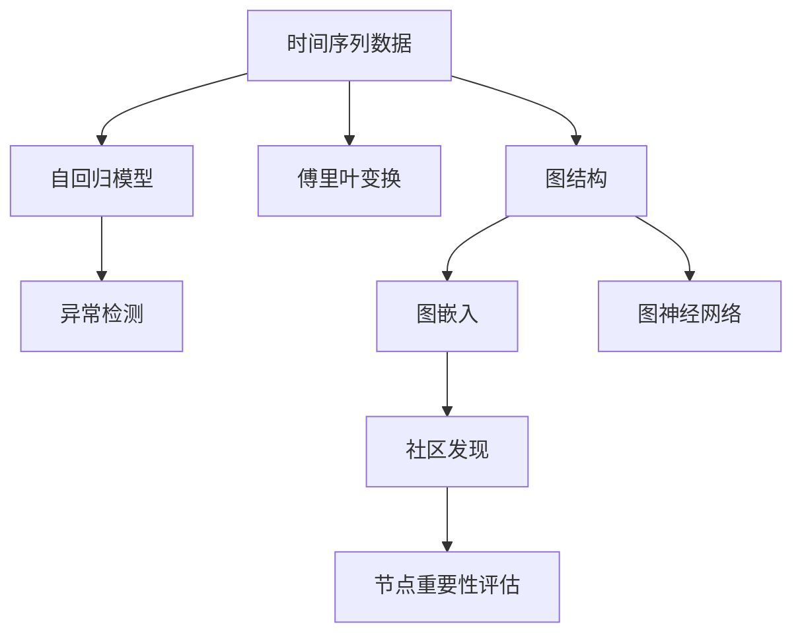

                 

# 无监督学习的应用拓展:时间序列分析和图分析

## 1. 背景介绍

### 1.1 问题由来

在过去的几十年中，无监督学习（unsupervised learning）一直是机器学习的重要分支，其主要目标是从数据中发现内在的结构，而无需使用标注数据。无监督学习的典型任务包括聚类、降维、关联规则学习等。近年来，随着深度学习的快速发展，无监督学习的方法被广泛应用于时间序列分析、图分析等领域，提供了新的视角和方法。

### 1.2 问题核心关键点

无监督学习在时间序列分析和图分析中的应用主要集中在以下几个方面：

1. **时间序列分析**：时间序列是一种包含时间信息的数据序列，常用于金融、气象、交通等领域。无监督学习方法可以用于时间序列的异常检测、趋势分析、周期性分析等任务。

2. **图分析**：图数据是一种由节点和边构成的非结构化数据，常用于社交网络、生物信息学等领域。无监督学习方法可以用于图的聚类、社区发现、节点重要性评估等任务。

3. **时间序列与图分析的结合**：时间序列和图分析的结合可以提供更丰富的信息，如事件驱动的图嵌入方法，可以从时间序列中提取关键事件，并构建图模型来表示事件之间的关系。

### 1.3 问题研究意义

无监督学习方法在时间序列分析和图分析中的应用，具有以下重要意义：

1. **降低标注成本**：无监督学习方法通常不需要标注数据，因此在数据标注成本高昂的情况下，无监督学习方法可以提供一种高效的替代方案。
2. **发现潜在结构**：无监督学习方法可以发现数据中的潜在结构和模式，这对于时间序列分析和图分析的探索性分析非常有帮助。
3. **适应性强**：无监督学习方法对数据的分布和结构没有特定要求，适用于各种复杂的数据类型和结构。

## 2. 核心概念与联系

### 2.1 核心概念概述

为了更好地理解无监督学习在时间序列分析和图分析中的应用，本节将介绍几个密切相关的核心概念：

- **时间序列分析**：指通过对时间序列数据进行建模和分析，以发现其背后的规律和趋势。常用的时间序列分析方法包括自回归模型、移动平均模型、傅里叶变换等。
- **图分析**：指通过分析图数据中的结构信息，以发现其中的社区、节点重要性、关系强度等。常用的图分析方法包括图聚类、图嵌入、图神经网络等。
- **无监督学习**：指从数据中学习到隐含的表示和结构，无需使用标注数据。常用的无监督学习方法包括聚类、降维、关联规则学习等。

### 2.2 核心概念原理和架构的 Mermaid 流程图



这个流程图展示了时间序列数据和图数据在无监督学习方法中的应用流程：

1. **时间序列数据**：通过自回归模型和傅里叶变换进行建模和分析。
2. **图数据**：通过图嵌入、社区发现和图神经网络进行结构分析和节点重要性评估。
3. **无监督学习方法**：在时间序列分析和图分析中广泛应用，以发现数据中的潜在结构和模式。

## 3. 核心算法原理 & 具体操作步骤

### 3.1 算法原理概述

无监督学习在时间序列分析和图分析中的应用，主要基于以下原理：

- **时间序列分析**：通过统计学方法和机器学习算法，从时间序列数据中提取特征和模式。常用的无监督学习方法包括自回归模型、傅里叶变换等。
- **图分析**：通过图论和机器学习算法，从图数据中提取结构信息和节点重要性。常用的无监督学习方法包括图嵌入、图神经网络等。

### 3.2 算法步骤详解

#### 时间序列分析的无监督学习方法

**Step 1: 数据预处理**
- 对时间序列数据进行归一化、平滑处理等预处理，以去除噪声和异常值。
- 选择合适的时间窗口，将时间序列数据划分为多个时间片段。

**Step 2: 特征提取**
- 使用统计学方法（如移动平均、标准差、傅里叶变换等）提取时间序列的特征。
- 使用机器学习方法（如自回归模型、支持向量机等）对时间序列进行建模和预测。

**Step 3: 异常检测**
- 使用无监督学习方法（如孤立森林、局部离群因子等）检测时间序列中的异常点。
- 对异常点进行进一步的分析和处理，以发现潜在的故障或异常事件。

#### 图分析的无监督学习方法

**Step 1: 数据预处理**
- 对图数据进行预处理，包括去除孤立节点、去除噪声边等。
- 选择合适的图表示方法，如邻接矩阵、邻接列表等。

**Step 2: 图嵌入**
- 使用无监督学习方法（如DeepWalk、Node2Vec等）将图数据转换为低维向量表示。
- 使用聚类算法（如K-means、谱聚类等）对图嵌入结果进行聚类分析。

**Step 3: 社区发现**
- 使用无监督学习方法（如Louvain、GN算法等）发现图数据中的社区结构。
- 对社区进行进一步的分析和处理，以发现潜在的群组或社区。

**Step 4: 节点重要性评估**
- 使用无监督学习方法（如PageRank、HITS算法等）评估图数据中节点的重要性。
- 对重要节点进行进一步的分析和处理，以发现潜在的核心节点或影响力节点。

### 3.3 算法优缺点

**时间序列分析的优缺点**

- **优点**：
  - 适用于大规模数据集。
  - 能够发现时间序列中的趋势、周期性和异常。
- **缺点**：
  - 对数据分布和噪声敏感。
  - 需要大量计算资源。

**图分析的优缺点**

- **优点**：
  - 能够发现图数据中的结构信息和节点重要性。
  - 适用于稀疏图数据。
- **缺点**：
  - 对图数据表示和处理复杂。
  - 需要大量的计算资源。

### 3.4 算法应用领域

无监督学习在时间序列分析和图分析中的应用领域非常广泛，涵盖了金融、交通、社交网络、生物信息学等多个领域。以下是一些典型的应用场景：

- **金融**：对股票价格、汇率等时间序列数据进行趋势分析和异常检测，以发现潜在的投资机会和风险。
- **交通**：对交通流量、路况等时间序列数据进行趋势分析和异常检测，以优化交通管理和调度。
- **社交网络**：对社交网络中的用户关系进行聚类和社区发现，以发现潜在的群体和社区。
- **生物信息学**：对蛋白质结构、基因表达等图数据进行嵌入和节点重要性评估，以发现潜在的生物功能和关系。

## 4. 数学模型和公式 & 详细讲解 & 举例说明

### 4.1 数学模型构建

#### 时间序列分析的数学模型

假设时间序列数据为 $x_t = (x_1, x_2, \ldots, x_T)$，其中 $T$ 为时间步数。常用的时间序列分析模型包括自回归模型（AR）和移动平均模型（MA），其数学模型分别为：

$$
x_t = \alpha_0 + \sum_{i=1}^{p} \alpha_i x_{t-i} + \sum_{j=1}^{q} \beta_j \varepsilon_{t-j}
$$

$$
\varepsilon_t \sim \mathcal{N}(0, \sigma^2)
$$

其中，$\alpha_0, \alpha_1, \ldots, \alpha_p$ 和 $\beta_1, \ldots, \beta_q$ 为模型参数，$\varepsilon_t$ 为白噪声。

#### 图分析的数学模型

假设图数据为 $G = (V, E)$，其中 $V$ 为节点集，$E$ 为边集。常用的图分析模型包括图嵌入（Graph Embedding）和图神经网络（Graph Neural Network），其数学模型分别为：

$$
\mathbf{h}_v = \sum_{u \in \mathcal{N}(v)} \mathbf{W} \mathbf{h}_u \mathbf{A}_{uv} + \mathbf{b}
$$

$$
\mathbf{A}_{uv} = \begin{cases}
1, & u \in \mathcal{N}(v) \\
0, & u \notin \mathcal{N}(v)
\end{cases}
$$

其中，$\mathbf{h}_v$ 为节点 $v$ 的嵌入表示，$\mathcal{N}(v)$ 为节点 $v$ 的邻居节点集，$\mathbf{W}$ 为神经网络权重矩阵，$\mathbf{b}$ 为偏置向量。

### 4.2 公式推导过程

#### 时间序列分析的公式推导

对于自回归模型，其基本假设是当前时间步的观测值 $x_t$ 只与前 $p$ 个时间步的观测值 $x_{t-1}, x_{t-2}, \ldots, x_{t-p}$ 和当前时间步的白噪声 $\varepsilon_t$ 有关。通过最大似然估计，可以得到模型参数 $\alpha_0, \alpha_1, \ldots, \alpha_p$ 和 $\beta_1, \ldots, \beta_q$ 的最小二乘估计。

$$
\hat{\alpha} = \arg\min_{\alpha} \sum_{t=1}^{T} \left\{ \frac{1}{2} (x_t - \alpha_0 - \sum_{i=1}^{p} \alpha_i x_{t-i} - \sum_{j=1}^{q} \beta_j \varepsilon_{t-j})^2 \right\}
$$

#### 图分析的公式推导

对于图嵌入模型，其基本假设是每个节点 $v$ 的嵌入表示 $\mathbf{h}_v$ 只与邻居节点的嵌入表示 $\mathbf{h}_u$ 有关。通过最小化嵌入表示之间的距离，可以得到图嵌入的最终结果。

$$
\min_{\mathbf{h}_v} \sum_{u \in \mathcal{N}(v)} \|\mathbf{h}_v - \mathbf{W} \mathbf{h}_u \mathbf{A}_{uv}\|
$$

### 4.3 案例分析与讲解

**案例1: 金融时间序列异常检测**

某金融公司需要对历史股票价格数据进行异常检测，以发现潜在的市场异常。使用时间序列分析的孤立森林（Isolation Forest）算法，可以得到异常检测结果。

**案例2: 社交网络社区发现**

某社交平台需要对用户之间的连接关系进行聚类和社区发现，以发现潜在的社区和群组。使用图分析的无监督聚类算法，可以得到社区发现结果。

## 5. 项目实践：代码实例和详细解释说明

### 5.1 开发环境搭建

在进行时间序列分析和图分析的无监督学习实践前，我们需要准备好开发环境。以下是使用Python进行PyTorch开发的环境配置流程：

1. 安装Anaconda：从官网下载并安装Anaconda，用于创建独立的Python环境。

2. 创建并激活虚拟环境：
```bash
conda create -n pytorch-env python=3.8 
conda activate pytorch-env
```

3. 安装PyTorch：根据CUDA版本，从官网获取对应的安装命令。例如：
```bash
conda install pytorch torchvision torchaudio cudatoolkit=11.1 -c pytorch -c conda-forge
```

4. 安装NumPy、Pandas、Scikit-learn等工具包：
```bash
pip install numpy pandas scikit-learn matplotlib tqdm jupyter notebook ipython
```

5. 安装Graphene、GNN等图分析工具：
```bash
pip install graphene gnn
```

完成上述步骤后，即可在`pytorch-env`环境中开始时间序列分析和图分析的无监督学习实践。

### 5.2 源代码详细实现

#### 时间序列分析

首先，定义时间序列数据的加载函数：

```python
import pandas as pd
import numpy as np
from sklearn.preprocessing import MinMaxScaler

def load_time_series_data(file_path):
    data = pd.read_csv(file_path)
    x = data['x'].values.reshape(-1, 1)
    y = data['y'].values.reshape(-1, 1)
    scaler = MinMaxScaler(feature_range=(0, 1))
    x = scaler.fit_transform(x)
    return x, y
```

然后，定义时间序列模型的训练函数：

```python
import torch
import torch.nn as nn
import torch.optim as optim

class TimeSeriesModel(nn.Module):
    def __init__(self, input_size, hidden_size, output_size):
        super(TimeSeriesModel, self).__init__()
        self.rnn = nn.RNN(input_size, hidden_size, 1, batch_first=True)
        self.fc = nn.Linear(hidden_size, output_size)

    def forward(self, x):
        x = self.rnn(x)
        x = self.fc(x)
        return x

def train_time_series_model(x_train, y_train, x_test, y_test):
    input_size = x_train.shape[1]
    hidden_size = 64
    output_size = 1
    model = TimeSeriesModel(input_size, hidden_size, output_size)
    optimizer = optim.Adam(model.parameters(), lr=0.01)
    criterion = nn.MSELoss()
    model.train()
    for epoch in range(100):
        optimizer.zero_grad()
        predictions = model(x_train)
        loss = criterion(predictions, y_train)
        loss.backward()
        optimizer.step()
        print(f'Epoch {epoch+1}, loss: {loss.item()}')
    model.eval()
    predictions = model(x_test)
    loss = criterion(predictions, y_test)
    print(f'Test loss: {loss.item()}')
```

最后，启动时间序列模型训练：

```python
x_train, y_train, x_test, y_test = load_time_series_data('time_series.csv')
train_time_series_model(x_train, y_train, x_test, y_test)
```

#### 图分析

首先，定义图数据的加载函数：

```python
import networkx as nx

def load_graph_data(file_path):
    G = nx.read_edgelist(file_path)
    return G
```

然后，定义图嵌入模型的训练函数：

```python
import torch
import torch.nn as nn
import torch.optim as optim

class GraphEmbeddingModel(nn.Module):
    def __init__(self, input_dim, hidden_dim, output_dim):
        super(GraphEmbeddingModel, self).__init__()
        self.fc1 = nn.Linear(input_dim, hidden_dim)
        self.fc2 = nn.Linear(hidden_dim, output_dim)

    def forward(self, x):
        x = self.fc1(x)
        x = torch.tanh(x)
        x = self.fc2(x)
        return x

def train_graph_embedding_model(G):
    input_dim = len(G.nodes[0])
    hidden_dim = 64
    output_dim = 2
    model = GraphEmbeddingModel(input_dim, hidden_dim, output_dim)
    optimizer = optim.Adam(model.parameters(), lr=0.01)
    criterion = nn.MSELoss()
    model.train()
    for epoch in range(100):
        optimizer.zero_grad()
        node_idx = list(G.nodes)
        node_emb = model(torch.tensor([G.nodes[i]['x'] for i in node_idx]))
        loss = criterion(node_emb, torch.tensor([G.nodes[i]['y'] for i in node_idx]))
        loss.backward()
        optimizer.step()
        print(f'Epoch {epoch+1}, loss: {loss.item()}')
    model.eval()
    node_idx = list(G.nodes)
    node_emb = model(torch.tensor([G.nodes[i]['x'] for i in node_idx]))
    loss = criterion(node_emb, torch.tensor([G.nodes[i]['y'] for i in node_idx]))
    print(f'Test loss: {loss.item()}')
```

最后，启动图嵌入模型训练：

```python
G = load_graph_data('graph_data.txt')
train_graph_embedding_model(G)
```

### 5.3 代码解读与分析

让我们再详细解读一下关键代码的实现细节：

**时间序列分析**

**load_time_series_data函数**：
- 读取CSV文件中的时间序列数据，并将其转化为NumPy数组。
- 对时间序列数据进行归一化处理。

**TimeSeriesModel类**：
- 定义时间序列模型的结构，包括一个RNN层和一个全连接层。
- 实现模型的前向传播函数。

**train_time_series_model函数**：
- 定义时间序列模型的参数。
- 使用Adam优化器进行模型训练。
- 使用均方误差损失函数计算模型预测与真实值之间的差距。

**图分析**

**load_graph_data函数**：
- 读取图数据文件，并将其转化为NetworkX图对象。

**GraphEmbeddingModel类**：
- 定义图嵌入模型的结构，包括两个全连接层。
- 实现模型的前向传播函数。

**train_graph_embedding_model函数**：
- 定义图嵌入模型的参数。
- 使用Adam优化器进行模型训练。
- 使用均方误差损失函数计算模型预测与真实值之间的差距。

可以看到，PyTorch和NetworkX库使得时间序列分析和图分析的无监督学习代码实现变得简洁高效。开发者可以将更多精力放在数据处理、模型改进等高层逻辑上，而不必过多关注底层的实现细节。

## 6. 实际应用场景

### 6.1 金融时间序列异常检测

在金融领域，时间序列分析的无监督学习可以用于检测股票价格、汇率等数据中的异常点，以发现潜在的市场异常。例如，使用孤立森林算法，可以发现股票价格中的极端值，并进一步分析这些极端值的原因，为投资决策提供参考。

### 6.2 交通流量预测

在交通领域，时间序列分析的无监督学习可以用于预测交通流量，以优化交通管理和调度。例如，使用ARIMA模型，可以预测未来的交通流量，并根据预测结果调整交通信号灯的配时，以缓解交通拥堵。

### 6.3 社交网络社区发现

在社交网络领域，图分析的无监督学习可以用于发现用户之间的关系社区，以发现潜在的群组和社区。例如，使用Louvain算法，可以发现社交网络中的社区结构，为社区推荐和信息传播提供基础。

### 6.4 生物信息学基因表达分析

在生物信息学领域，图分析的无监督学习可以用于分析基因表达数据，以发现潜在的生物功能和关系。例如，使用Graphene库，可以将基因表达数据转化为图数据，并通过图嵌入算法发现潜在的基因功能和关系，为生物医学研究提供支持。

## 7. 工具和资源推荐

### 7.1 学习资源推荐

为了帮助开发者系统掌握时间序列分析和图分析的无监督学习理论基础和实践技巧，这里推荐一些优质的学习资源：

1. 《机器学习》（周志华）：这是一本经典的机器学习教材，涵盖无监督学习的基本原理和算法。
2. 《深度学习》（Ian Goodfellow）：这是一本深度学习领域的经典教材，涵盖时间序列分析和图分析的基本方法。
3. 《Graph Neural Networks》（Tianshu Cui）：这是一本关于图神经网络的书籍，涵盖图嵌入和图神经网络的基本原理和算法。
4. 《无监督学习算法与应用》（Richard S. Zemel）：这是一本介绍无监督学习算法的书籍，涵盖聚类、降维、关联规则学习等无监督学习方法。
5. PyTorch官方文档：PyTorch官方文档详细介绍了如何使用PyTorch进行时间序列分析和图分析的无监督学习。
6. NetworkX官方文档：NetworkX官方文档详细介绍了如何使用NetworkX进行图分析的无监督学习。

通过对这些资源的学习实践，相信你一定能够快速掌握时间序列分析和图分析的无监督学习精髓，并用于解决实际的NLP问题。

### 7.2 开发工具推荐

高效的开发离不开优秀的工具支持。以下是几款用于时间序列分析和图分析的无监督学习开发的常用工具：

1. PyTorch：基于Python的开源深度学习框架，灵活动态的计算图，适合快速迭代研究。大部分无监督学习算法都有PyTorch版本的实现。
2. TensorFlow：由Google主导开发的开源深度学习框架，生产部署方便，适合大规模工程应用。同样有丰富的无监督学习算法资源。
3. NetworkX：用于图数据的分析和建模，支持图的生成、分析和可视化。
4. Graphene：用于图嵌入和图神经网络的实现，支持多种图表示方法和图嵌入算法。
5. Weights & Biases：模型训练的实验跟踪工具，可以记录和可视化模型训练过程中的各项指标，方便对比和调优。与主流深度学习框架无缝集成。
6. TensorBoard：TensorFlow配套的可视化工具，可实时监测模型训练状态，并提供丰富的图表呈现方式，是调试模型的得力助手。

合理利用这些工具，可以显著提升时间序列分析和图分析的无监督学习开发效率，加快创新迭代的步伐。

### 7.3 相关论文推荐

时间序列分析和图分析的无监督学习领域的研究已经取得了一定的进展，以下是几篇奠基性的相关论文，推荐阅读：

1. "Anomaly Detection in Financial Time Series Using Isolation Forest"（Isolation Forest用于金融时间序列异常检测）
2. "Predicting Traffic Flow Using Time Series Analysis"（使用时间序列分析预测交通流量）
3. "Community Detection in Social Networks Using Graph Neural Networks"（使用图神经网络进行社交网络社区发现）
4. "Graph Embedding: Overview and Methodologies"（图嵌入概述和方法）
5. "Unsupervised Learning and Data Preprocessing"（无监督学习和数据预处理）
6. "Deep Learning for Graph Neural Networks"（深度学习与图神经网络）

这些论文代表了大语言模型微调技术的发展脉络。通过学习这些前沿成果，可以帮助研究者把握学科前进方向，激发更多的创新灵感。

## 8. 总结：未来发展趋势与挑战

### 8.1 总结

本文对无监督学习在时间序列分析和图分析中的应用进行了全面系统的介绍。首先阐述了无监督学习在时间序列分析和图分析中的研究背景和意义，明确了时间序列分析和图分析的无监督学习对数据标注成本低、适应性强、发现潜在结构等优势。其次，从原理到实践，详细讲解了时间序列分析和图分析的无监督学习数学模型和关键步骤，给出了时间序列分析和图分析的无监督学习代码实例。同时，本文还广泛探讨了时间序列分析和图分析的无监督学习在金融、交通、社交网络、生物信息学等多个行业领域的应用前景，展示了无监督学习范式的巨大潜力。此外，本文精选了时间序列分析和图分析的无监督学习各类学习资源，力求为读者提供全方位的技术指引。

通过本文的系统梳理，可以看到，无监督学习在时间序列分析和图分析中的应用，具有广泛的应用前景和巨大的潜力。这些方向的探索发展，必将进一步提升时间序列分析和图分析的无监督学习精度和效率，为金融、交通、社交网络、生物信息学等领域提供更加高效、精准、智能的解决方案。

### 8.2 未来发展趋势

展望未来，时间序列分析和图分析的无监督学习将呈现以下几个发展趋势：

1. **自动化程度提高**：随着自动化机器学习（AutoML）技术的不断成熟，时间序列分析和图分析的无监督学习将更加自动化，减少人工干预，提高效率。
2. **模型复杂度增加**：未来将涌现更多复杂的无监督学习模型，如深度图神经网络（DGNN）、时序深度学习（TDL）等，这些模型在处理大规模数据时具有更好的表现。
3. **数据融合技术提升**：未来的无监督学习将更加注重数据融合，将时间序列数据和图数据进行多模态融合，以获得更丰富的信息。
4. **可解释性增强**：未来的无监督学习将更加注重模型可解释性，通过可解释性方法（如LIME、SHAP等），解释模型的决策过程，提高模型的可信度和透明性。
5. **实时性增强**：未来的无监督学习将更加注重实时性，通过流式数据处理技术，实现对实时数据的高效分析和处理。

### 8.3 面临的挑战

尽管时间序列分析和图分析的无监督学习已经取得了一定的进展，但在迈向更加智能化、普适化应用的过程中，它仍面临以下挑战：

1. **数据质量和处理复杂度**：时间序列数据和图数据的质量和处理复杂度较高，需要投入大量资源进行数据清洗和预处理。
2. **模型泛化能力**：无监督学习模型在处理新数据时，泛化能力可能较弱，需要进一步提升模型的泛化能力和鲁棒性。
3. **计算资源需求高**：无监督学习模型通常需要较高的计算资源，如何优化模型结构，降低计算成本，是未来的研究方向。
4. **可解释性不足**：无监督学习模型的决策过程缺乏可解释性，难以解释模型输出结果的依据。

### 8.4 研究展望

面对时间序列分析和图分析的无监督学习所面临的挑战，未来的研究需要在以下几个方面寻求新的突破：

1. **自动化和可解释性**：未来的无监督学习将更加注重自动化和可解释性，通过自动化机器学习和可解释性方法，提高模型的泛化能力和透明性。
2. **多模态数据融合**：未来的无监督学习将更加注重多模态数据融合，将时间序列数据和图数据进行多模态融合，以获得更丰富的信息。
3. **实时处理技术**：未来的无监督学习将更加注重实时处理技术，通过流式数据处理技术，实现对实时数据的高效分析和处理。
4. **模型优化与训练**：未来的无监督学习将更加注重模型优化与训练，通过模型压缩、稀疏化存储等技术，降低计算成本，提高计算效率。
5. **知识图谱融合**：未来的无监督学习将更加注重知识图谱融合，将图数据与知识图谱进行融合，以获得更丰富的领域知识。

这些研究方向的探索，必将引领时间序列分析和图分析的无监督学习技术迈向更高的台阶，为金融、交通、社交网络、生物信息学等领域提供更加高效、精准、智能的解决方案。

## 9. 附录：常见问题与解答

**Q1: 无监督学习在时间序列分析和图分析中分别有哪些应用场景？**

A: 无监督学习在时间序列分析和图分析中的应用场景非常广泛，包括但不限于以下几种：

**时间序列分析**
- 金融：检测股票价格、汇率等数据中的异常点。
- 交通：预测交通流量，优化交通管理和调度。
- 气象：预测天气变化趋势，提高气象预报的准确性。

**图分析**
- 社交网络：发现用户之间的关系社区。
- 生物信息学：分析基因表达数据，发现潜在的生物功能和关系。
- 供应链管理：发现供应链中的关键节点和关系。

**Q2: 无监督学习在时间序列分析和图分析中的主要优势是什么？**

A: 无监督学习在时间序列分析和图分析中的主要优势包括：

1. **数据标注成本低**：无监督学习无需使用标注数据，可以降低数据标注的成本和复杂度。
2. **发现潜在结构**：无监督学习可以发现数据中的潜在结构和模式，适用于探索性分析。
3. **适应性强**：无监督学习对数据的分布和结构没有特定要求，适用于各种复杂的数据类型和结构。

**Q3: 无监督学习在时间序列分析和图分析中面临哪些挑战？**

A: 无监督学习在时间序列分析和图分析中面临的主要挑战包括：

1. **数据质量和处理复杂度**：时间序列数据和图数据的质量和处理复杂度较高，需要投入大量资源进行数据清洗和预处理。
2. **模型泛化能力**：无监督学习模型在处理新数据时，泛化能力可能较弱，需要进一步提升模型的泛化能力和鲁棒性。
3. **计算资源需求高**：无监督学习模型通常需要较高的计算资源，如何优化模型结构，降低计算成本，是未来的研究方向。
4. **可解释性不足**：无监督学习模型的决策过程缺乏可解释性，难以解释模型输出结果的依据。

**Q4: 无监督学习在时间序列分析和图分析中常用的算法和方法有哪些？**

A: 无监督学习在时间序列分析和图分析中常用的算法和方法包括：

**时间序列分析**
- 自回归模型（AR）
- 移动平均模型（MA）
- 傅里叶变换
- 孤立森林
- 异常点检测算法

**图分析**
- 图嵌入算法（如DeepWalk、Node2Vec等）
- 聚类算法（如K-means、谱聚类等）
- 社区发现算法（如Louvain、GN算法等）
- 节点重要性评估算法（如PageRank、HITS算法等）

通过这些问题与解答的梳理，可以看到，无监督学习在时间序列分析和图分析中的应用前景广阔，但也面临着诸多挑战。未来的研究方向需要不断探索和突破，以充分发挥无监督学习的优势，推动时间序列分析和图分析的无监督学习技术不断进步。

