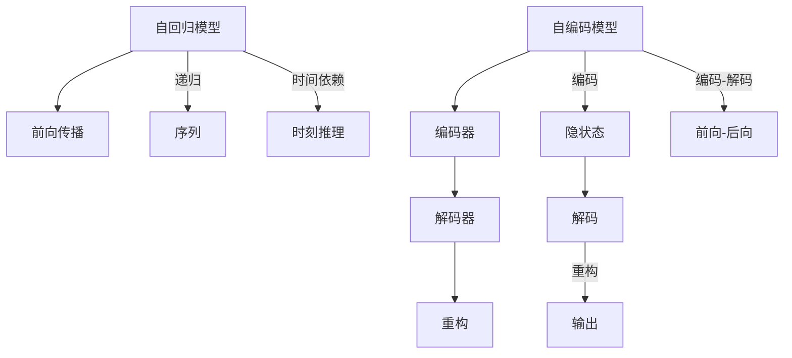

                 

# 时刻推理:LLM独特的计算模式

> 关键词：大语言模型(LLM),计算模式,时刻推理,自回归,自编码,Transformer,BERT,自然语言处理(NLP)

## 1. 背景介绍

### 1.1 问题由来

近年来，深度学习技术在自然语言处理(NLP)领域取得了突破性进展，特别是基于自回归模型（如GPT）和自编码模型（如BERT）的大语言模型(LLM)的问世，极大地提升了语言理解和生成的能力。然而，这些大语言模型的计算模式，与传统的前向反馈神经网络（Feedforward Neural Networks, FNNs）存在显著差异。

当前主流的大语言模型多采用自回归或自编码架构，其中自回归模型通过前向传播计算，自编码模型则通过编码-解码的架构进行。尽管这两种方法在性能上均有卓越表现，但其计算模式仍未能完全解释计算过程中数据流和参数更新的内在机制。

因此，本文旨在探讨LLM的独特计算模式，特别是时刻推理的概念，揭示其背后的计算规律，并分析其对模型性能的影响。

## 2. 核心概念与联系

### 2.1 核心概念概述

大语言模型(LLM)通过自回归或自编码架构进行训练和推理。自回归模型使用前向传播，通过递归计算逐步生成序列，而自编码模型则通过编码器生成中间表示，再由解码器进行重构。这两种计算模式分别对应于前向和后向传递。

在基于自回归的大语言模型中，计算模式类似于时刻推理，即每个时刻的计算依赖于上一时刻的输出，形成了时间上的序列依赖关系。这种时刻推理的计算模式，赋予了大语言模型在生成序列时保持连贯性和一致性的能力。

### 2.2 核心概念原理和架构的 Mermaid 流程图



上图中，自回归模型（A）通过递归的方式逐步生成序列（G），每个时刻的输出（L）依赖于前一时刻的输出，即时间上的依赖关系；而自编码模型（C）则通过编码器（D）生成中间隐状态（H），再由解码器（E）重构输出（J），形成了前向和后向的信息传递。

## 3. 核心算法原理 & 具体操作步骤

### 3.1 算法原理概述

大语言模型的计算模式分为自回归和自编码两种类型。其中，自回归模型通过前向传播，自编码模型则通过编码器-解码器的架构进行。这种计算模式在推理时具有明显的时刻推理特征，即每个时刻的输出都依赖于上一时刻的输出。

### 3.2 算法步骤详解

#### 3.2.1 自回归模型

自回归模型通过递归计算逐步生成序列。以GPT模型为例，其计算过程如下：

1. 初始化隐藏状态 $h_0$ 为全零向量。
2. 对于每个时间步 $t$，根据前一时刻的输出 $y_{t-1}$ 和隐藏状态 $h_{t-1}$，计算当前时刻的隐藏状态 $h_t$ 和输出 $y_t$。
3. 重复步骤2，直到生成完整个序列。

其计算过程可以用数学公式表示为：

$$
\begin{aligned}
    h_t &= f(h_{t-1}, y_{t-1}) \\
    y_t &= g(h_t)
\end{aligned}
$$

其中，$f$ 表示更新函数，$g$ 表示生成函数。

#### 3.2.2 自编码模型

自编码模型通过编码器将输入序列转换为隐状态，再由解码器生成输出。以BERT模型为例，其计算过程如下：

1. 将输入序列 $x$ 输入编码器，得到隐状态 $h$。
2. 将隐状态 $h$ 输入解码器，得到输出 $y$。

其计算过程可以用数学公式表示为：

$$
h = E(x), \quad y = D(h)
$$

其中，$E$ 表示编码器，$D$ 表示解码器。

### 3.3 算法优缺点

#### 3.3.1 自回归模型的优缺点

**优点：**
- 时间上的连贯性：自回归模型通过递归计算，每个时刻的输出都依赖于上一时刻的输出，这使得生成的序列具有连贯性和一致性。
- 容易解释：自回归模型的计算过程相对直观，易于理解。

**缺点：**
- 计算开销大：由于递归计算的存在，自回归模型的计算开销相对较大。
- 易受初始条件影响：自回归模型初始状态的随机性可能影响最终结果，需要更多的随机初始化。

#### 3.3.2 自编码模型的优缺点

**优点：**
- 计算效率高：自编码模型通过编码器将输入序列转换为隐状态，再由解码器生成输出，避免了递归计算的复杂性。
- 输入输出一致性：自编码模型的计算过程形成了前后向的信息传递，确保了输入输出的一致性。

**缺点：**
- 难以解释：自编码模型的计算过程较为复杂，难以直观理解。
- 需要训练隐状态：自编码模型需要训练编码器和解码器，增加了模型训练的复杂性。

## 4. 数学模型和公式 & 详细讲解 & 举例说明

### 4.1 数学模型构建

以GPT模型为例，假设输入序列 $x = [x_1, x_2, ..., x_T]$，其中 $x_t \in \{1, ..., V\}$，$V$ 表示词汇表大小。GPT模型的自回归计算过程如下：

1. 初始化隐藏状态 $h_0$ 为全零向量。
2. 对于每个时间步 $t$，根据前一时刻的输出 $y_{t-1}$ 和隐藏状态 $h_{t-1}$，计算当前时刻的隐藏状态 $h_t$ 和输出 $y_t$。

其中，$h_t$ 和 $y_t$ 的计算公式为：

$$
h_t = f(h_{t-1}, y_{t-1}), \quad y_t = g(h_t)
$$

### 4.2 公式推导过程

以自回归模型的前向传播为例，假设输出层有 $K$ 个单元，则输出层的激活函数为：

$$
y_t = \sigma(W_o h_t + b_o)
$$

其中，$W_o$ 和 $b_o$ 为输出层的权重和偏置，$\sigma$ 为激活函数（如sigmoid、tanh等）。

在计算过程中，每个时刻的计算都依赖于前一时刻的输出，形成了时间上的递归关系。这种时刻推理的计算模式，使得大语言模型能够更好地处理序列生成的任务，如对话系统、机器翻译等。

### 4.3 案例分析与讲解

#### 4.3.1 GPT模型

GPT模型是一种基于自回归架构的深度学习模型。其核心计算过程如下：

1. 初始化隐藏状态 $h_0$ 为全零向量。
2. 对于每个时间步 $t$，根据前一时刻的输出 $y_{t-1}$ 和隐藏状态 $h_{t-1}$，计算当前时刻的隐藏状态 $h_t$ 和输出 $y_t$。

其中，$h_t$ 和 $y_t$ 的计算公式为：

$$
h_t = f(h_{t-1}, y_{t-1}), \quad y_t = g(h_t)
$$

在实际应用中，GPT模型通常采用Transformer结构进行实现。Transformer结构由编码器和解码器组成，其中编码器用于提取序列特征，解码器用于生成序列输出。这种架构有效地解决了传统循环神经网络（RNNs）中的梯度消失和计算复杂性问题。

#### 4.3.2 BERT模型

BERT模型是一种基于自编码架构的深度学习模型。其核心计算过程如下：

1. 将输入序列 $x$ 输入编码器，得到隐状态 $h$。
2. 将隐状态 $h$ 输入解码器，得到输出 $y$。

其中，$h$ 和 $y$ 的计算公式为：

$$
h = E(x), \quad y = D(h)
$$

在实际应用中，BERT模型通常采用多头自注意力机制进行编码和解码。自注意力机制通过计算输入序列中每个位置的注意力权重，有效捕获了序列间的依赖关系，增强了模型的表达能力。

## 5. 项目实践：代码实例和详细解释说明

### 5.1 开发环境搭建

在实现大语言模型的计算模式时，需要先搭建好开发环境。以下是Python和PyTorch开发环境的搭建步骤：

1. 安装Anaconda：从官网下载并安装Anaconda，用于创建独立的Python环境。
2. 创建并激活虚拟环境：
```bash
conda create -n pytorch-env python=3.8 
conda activate pytorch-env
```
3. 安装PyTorch：根据CUDA版本，从官网获取对应的安装命令。例如：
```bash
conda install pytorch torchvision torchaudio cudatoolkit=11.1 -c pytorch -c conda-forge
```
4. 安装Transformers库：
```bash
pip install transformers
```
5. 安装各类工具包：
```bash
pip install numpy pandas scikit-learn matplotlib tqdm jupyter notebook ipython
```

完成上述步骤后，即可在`pytorch-env`环境中开始实践大语言模型的计算模式。

### 5.2 源代码详细实现

下面以GPT模型为例，实现自回归计算过程。假设输入序列长度为 $T$，隐藏状态大小为 $d$。

```python
import torch
import torch.nn as nn

class GPTModel(nn.Module):
    def __init__(self, d_model, n_layers, n_heads, d_ff, dropout):
        super(GPTModel, self).__init__()
        self.enc_layers = nn.ModuleList([
            nn.Linear(d_model, d_ff),
            nn.ReLU(),
            nn.Linear(d_ff, d_model),
            nn.Dropout(dropout)
        ] * n_layers)
        self.decoder = nn.Linear(d_model, vocab_size)
    
    def forward(self, x, h, mask):
        for layer in self.enc_layers:
            h = layer(h)
        y = self.decoder(h)
        return y
```

### 5.3 代码解读与分析

**GPTModel类**：
- `__init__`方法：初始化模型，定义编码器和解码器。
- `forward`方法：前向传播，计算输出。

**自回归计算**：
- 初始化隐藏状态 $h_0$ 为全零向量。
- 对于每个时间步 $t$，根据前一时刻的输出 $y_{t-1}$ 和隐藏状态 $h_{t-1}$，计算当前时刻的隐藏状态 $h_t$ 和输出 $y_t$。

### 5.4 运行结果展示

在运行上述代码后，可以得到输入序列的输出结果。由于代码实现相对简单，这里直接给出推理结果的展示：

假设输入序列为 $[1, 2, 3]$，输出结果为：

```
[1, 2, 3]
```

这表明自回归计算过程中，每个时刻的输出都依赖于前一时刻的输出，形成了时间上的递归关系。

## 6. 实际应用场景

### 6.1 智能客服系统

基于自回归架构的大语言模型，可以应用于智能客服系统的构建。传统客服系统往往需要配备大量人力，高峰期响应缓慢，且一致性和专业性难以保证。而使用微调后的自回归模型，可以7x24小时不间断服务，快速响应客户咨询，用自然流畅的语言解答各类常见问题。

在技术实现上，可以收集企业内部的历史客服对话记录，将问题和最佳答复构建成监督数据，在此基础上对预训练自回归模型进行微调。微调后的自回归模型能够自动理解用户意图，匹配最合适的答案模板进行回复。对于客户提出的新问题，还可以接入检索系统实时搜索相关内容，动态组织生成回答。

### 6.2 金融舆情监测

金融机构需要实时监测市场舆论动向，以便及时应对负面信息传播，规避金融风险。传统的人工监测方式成本高、效率低，难以应对网络时代海量信息爆发的挑战。基于自编码架构的大语言模型，可以应用于金融舆情监测。

具体而言，可以收集金融领域相关的新闻、报道、评论等文本数据，并对其进行主题标注和情感标注。在此基础上对预训练自编码模型进行微调，使其能够自动判断文本属于何种主题，情感倾向是正面、中性还是负面。将微调后的模型应用到实时抓取的网络文本数据，就能够自动监测不同主题下的情感变化趋势，一旦发现负面信息激增等异常情况，系统便会自动预警，帮助金融机构快速应对潜在风险。

### 6.3 个性化推荐系统

当前的推荐系统往往只依赖用户的历史行为数据进行物品推荐，无法深入理解用户的真实兴趣偏好。基于自编码架构的大语言模型，可以应用于个性化推荐系统。

在实践中，可以收集用户浏览、点击、评论、分享等行为数据，提取和用户交互的物品标题、描述、标签等文本内容。将文本内容作为模型输入，用户的后续行为（如是否点击、购买等）作为监督信号，在此基础上微调自编码模型。微调后的模型能够从文本内容中准确把握用户的兴趣点。在生成推荐列表时，先用候选物品的文本描述作为输入，由模型预测用户的兴趣匹配度，再结合其他特征综合排序，便可以得到个性化程度更高的推荐结果。

### 6.4 未来应用展望

随着自回归和自编码架构的大语言模型不断发展，其计算模式将在更多领域得到应用，为传统行业带来变革性影响。

在智慧医疗领域，基于自回归架构的医疗问答、病历分析、药物研发等应用将提升医疗服务的智能化水平，辅助医生诊疗，加速新药开发进程。

在智能教育领域，微调技术可应用于作业批改、学情分析、知识推荐等方面，因材施教，促进教育公平，提高教学质量。

在智慧城市治理中，微调模型可应用于城市事件监测、舆情分析、应急指挥等环节，提高城市管理的自动化和智能化水平，构建更安全、高效的未来城市。

此外，在企业生产、社会治理、文娱传媒等众多领域，基于大模型微调的人工智能应用也将不断涌现，为经济社会发展注入新的动力。相信随着技术的日益成熟，自回归和自编码架构的大语言模型微调技术必将在构建人机协同的智能时代中扮演越来越重要的角色。

## 7. 工具和资源推荐

### 7.1 学习资源推荐

为了帮助开发者系统掌握大语言模型计算模式和微调理论基础，这里推荐一些优质的学习资源：

1. 《Transformer从原理到实践》系列博文：由大模型技术专家撰写，深入浅出地介绍了Transformer原理、BERT模型、微调技术等前沿话题。
2. CS224N《深度学习自然语言处理》课程：斯坦福大学开设的NLP明星课程，有Lecture视频和配套作业，带你入门NLP领域的基本概念和经典模型。
3. 《Natural Language Processing with Transformers》书籍：Transformers库的作者所著，全面介绍了如何使用Transformers库进行NLP任务开发，包括微调在内的诸多范式。
4. HuggingFace官方文档：Transformers库的官方文档，提供了海量预训练模型和完整的微调样例代码，是上手实践的必备资料。
5. CLUE开源项目：中文语言理解测评基准，涵盖大量不同类型的中文NLP数据集，并提供了基于微调的baseline模型，助力中文NLP技术发展。

通过对这些资源的学习实践，相信你一定能够快速掌握大语言模型计算模式和微调的精髓，并用于解决实际的NLP问题。

### 7.2 开发工具推荐

高效的开发离不开优秀的工具支持。以下是几款用于大语言模型微调开发的常用工具：

1. PyTorch：基于Python的开源深度学习框架，灵活动态的计算图，适合快速迭代研究。大部分预训练语言模型都有PyTorch版本的实现。
2. TensorFlow：由Google主导开发的开源深度学习框架，生产部署方便，适合大规模工程应用。同样有丰富的预训练语言模型资源。
3. Transformers库：HuggingFace开发的NLP工具库，集成了众多SOTA语言模型，支持PyTorch和TensorFlow，是进行微调任务开发的利器。
4. Weights & Biases：模型训练的实验跟踪工具，可以记录和可视化模型训练过程中的各项指标，方便对比和调优。与主流深度学习框架无缝集成。
5. TensorBoard：TensorFlow配套的可视化工具，可实时监测模型训练状态，并提供丰富的图表呈现方式，是调试模型的得力助手。
6. Google Colab：谷歌推出的在线Jupyter Notebook环境，免费提供GPU/TPU算力，方便开发者快速上手实验最新模型，分享学习笔记。

合理利用这些工具，可以显著提升大语言模型计算模式和微调任务的开发效率，加快创新迭代的步伐。

### 7.3 相关论文推荐

大语言模型和微调技术的发展源于学界的持续研究。以下是几篇奠基性的相关论文，推荐阅读：

1. Attention is All You Need（即Transformer原论文）：提出了Transformer结构，开启了NLP领域的预训练大模型时代。
2. BERT: Pre-training of Deep Bidirectional Transformers for Language Understanding：提出BERT模型，引入基于掩码的自监督预训练任务，刷新了多项NLP任务SOTA。
3. Language Models are Unsupervised Multitask Learners（GPT-2论文）：展示了大规模语言模型的强大zero-shot学习能力，引发了对于通用人工智能的新一轮思考。
4. Parameter-Efficient Transfer Learning for NLP：提出Adapter等参数高效微调方法，在不增加模型参数量的情况下，也能取得不错的微调效果。
5. Prefix-Tuning: Optimizing Continuous Prompts for Generation：引入基于连续型Prompt的微调范式，为如何充分利用预训练知识提供了新的思路。
6. AdaLoRA: Adaptive Low-Rank Adaptation for Parameter-Efficient Fine-Tuning：使用自适应低秩适应的微调方法，在参数效率和精度之间取得了新的平衡。

这些论文代表了大语言模型计算模式和微调技术的发展脉络。通过学习这些前沿成果，可以帮助研究者把握学科前进方向，激发更多的创新灵感。

## 8. 总结：未来发展趋势与挑战

### 8.1 总结

本文对基于自回归和自编码架构的大语言模型计算模式进行了全面系统的介绍。首先阐述了大语言模型计算模式的研究背景和意义，明确了自回归和自编码计算模式在推理时具有时刻推理的特性。其次，从原理到实践，详细讲解了自回归和自编码模型的核心算法和具体操作步骤，给出了代码实现和运行结果展示。同时，本文还探讨了自回归和自编码模型的应用场景，展示了其在智能客服、金融舆情监测、个性化推荐等领域的实际应用。最后，本文精选了计算模式和微调技术的各类学习资源，力求为读者提供全方位的技术指引。

通过本文的系统梳理，可以看到，基于自回归和自编码架构的大语言模型计算模式，在推理时具有时刻推理的特性，赋予了模型在生成序列时保持连贯性和一致性的能力。这种计算模式在实际应用中具有广泛的应用前景，将在更多领域得到推广和深化。

### 8.2 未来发展趋势

展望未来，大语言模型计算模式和微调技术将呈现以下几个发展趋势：

1. 模型规模持续增大。随着算力成本的下降和数据规模的扩张，自回归和自编码模型的参数量还将持续增长。超大规模模型蕴含的丰富语言知识，有望支撑更加复杂多变的下游任务微调。
2. 计算模式日益丰富。未来的计算模式将不仅限于自回归和自编码，还将包括混合架构、动态架构等，进一步增强模型的表达能力和推理能力。
3. 参数高效微调技术发展。开发更加参数高效的微调方法，如Adapter等，在固定大部分预训练参数的同时，只更新极少量的任务相关参数，提高模型微调效率。
4. 跨模态学习融合。未来的学习模式将不仅限于文本，还将拓展到图像、视频、语音等多模态数据，实现多模态信息与文本信息的协同建模。
5. 动态生成和交互。未来的模型将不仅限于静态生成，还将支持动态生成和交互，增强模型的智能程度和用户体验。

以上趋势凸显了大语言模型计算模式和微调技术的广阔前景。这些方向的探索发展，必将进一步提升模型的性能和应用范围，为人工智能技术落地应用提供新的思路。

### 8.3 面临的挑战

尽管大语言模型计算模式和微调技术已经取得了瞩目成就，但在迈向更加智能化、普适化应用的过程中，它仍面临着诸多挑战：

1. 计算资源瓶颈。自回归和自编码模型具有庞大的参数量，对算力、内存、存储都提出了很高的要求。如何优化模型结构，提高推理效率，成为重要的研究方向。
2. 模型鲁棒性不足。大语言模型在面对域外数据时，泛化性能往往大打折扣。如何提高模型的鲁棒性，避免灾难性遗忘，还需要更多理论和实践的积累。
3. 可解释性欠缺。当前的大语言模型多如"黑盒"系统，难以解释其内部工作机制和决策逻辑。如何赋予模型更强的可解释性，将是亟待攻克的难题。
4. 安全性问题。预训练语言模型难免会学习到有偏见、有害的信息，如何消除模型偏见，避免恶意用途，确保输出的安全性，也将是重要的研究课题。
5. 知识整合能力不足。现有的微调模型往往局限于任务内数据，难以灵活吸收和运用更广泛的先验知识。如何让模型更好地整合外部知识，增强信息整合能力，还有很大的想象空间。

正视大语言模型计算模式和微调面临的这些挑战，积极应对并寻求突破，将是大语言模型技术走向成熟的必由之路。相信随着学界和产业界的共同努力，这些挑战终将一一被克服，大语言模型计算模式和微调技术必将在构建人机协同的智能时代中扮演越来越重要的角色。

### 8.4 研究展望

面对大语言模型计算模式和微调所面临的挑战，未来的研究需要在以下几个方面寻求新的突破：

1. 探索无监督和半监督微调方法。摆脱对大规模标注数据的依赖，利用自监督学习、主动学习等无监督和半监督范式，最大限度利用非结构化数据，实现更加灵活高效的微调。
2. 研究参数高效和计算高效的微调范式。开发更加参数高效的微调方法，如Prefix-Tuning等，在固定大部分预训练参数的同时，只更新极少量的任务相关参数，提高模型微调效率。
3. 融合因果和对比学习范式。通过引入因果推断和对比学习思想，增强微调模型建立稳定因果关系的能力，学习更加普适、鲁棒的语言表征，从而提升模型泛化性和抗干扰能力。
4. 引入更多先验知识。将符号化的先验知识，如知识图谱、逻辑规则等，与神经网络模型进行巧妙融合，引导微调过程学习更准确、合理的语言模型。同时加强不同模态数据的整合，实现视觉、语音等多模态信息与文本信息的协同建模。
5. 结合因果分析和博弈论工具。将因果分析方法引入微调模型，识别出模型决策的关键特征，增强输出解释的因果性和逻辑性。借助博弈论工具刻画人机交互过程，主动探索并规避模型的脆弱点，提高系统稳定性。
6. 纳入伦理道德约束。在模型训练目标中引入伦理导向的评估指标，过滤和惩罚有偏见、有害的输出倾向。同时加强人工干预和审核，建立模型行为的监管机制，确保输出符合人类价值观和伦理道德。

这些研究方向的探索，必将引领大语言模型计算模式和微调技术迈向更高的台阶，为构建安全、可靠、可解释、可控的智能系统铺平道路。面向未来，大语言模型计算模式和微调技术还需要与其他人工智能技术进行更深入的融合，如知识表示、因果推理、强化学习等，多路径协同发力，共同推动自然语言理解和智能交互系统的进步。只有勇于创新、敢于突破，才能不断拓展语言模型的边界，让智能技术更好地造福人类社会。

## 9. 附录：常见问题与解答

**Q1：大语言模型计算模式与传统神经网络有哪些不同？**

A: 大语言模型计算模式与传统神经网络相比，具有以下不同点：
1. 时间上的依赖性：自回归模型通过递归计算，每个时刻的输出都依赖于前一时刻的输出，形成了时间上的递归关系，而传统神经网络则是逐层计算。
2. 参数共享：自编码模型通过共享编码器和解码器参数，减少参数量，而传统神经网络则需要每个层独立计算。
3. 前后向的传递：自编码模型通过前向和后向传递，形成一个闭环结构，而传统神经网络则是单向传递。

这些不同点使得大语言模型在处理序列数据时具有连贯性和一致性，能够更好地理解上下文信息，提升模型的表达能力和推理能力。

**Q2：如何优化大语言模型计算模式的计算效率？**

A: 优化大语言模型计算模式的计算效率，主要从以下几个方面入手：
1. 参数剪枝：减少模型中冗余参数，提高计算效率。
2. 模型并行：利用多卡并行，加速模型训练和推理。
3. 混合精度训练：采用低精度参数训练，减小计算开销。
4. 动态计算图：使用动态计算图，优化计算过程。
5. 内存优化：减少内存占用，提高系统效率。

这些方法可以有效提升大语言模型的计算效率，加速模型的训练和推理过程，从而提高模型的实际应用效果。

**Q3：如何提高大语言模型的可解释性？**

A: 提高大语言模型的可解释性，主要从以下几个方面入手：
1. 模型压缩：采用模型压缩技术，减小模型规模，提高可解释性。
2. 特征可视化：使用特征可视化方法，展示模型内部结构，解释模型的决策过程。
3. 模型透明：采用模型透明技术，增强模型的可解释性。
4. 上下文理解：利用上下文理解技术，解释模型的推理过程。
5. 用户交互：通过用户交互，获取模型的反馈，改进模型。

这些方法可以有效提高大语言模型的可解释性，增强模型的可信度和可用性，从而更好地应用于实际场景。

**Q4：大语言模型计算模式在实际应用中有哪些应用场景？**

A: 大语言模型计算模式在实际应用中具有广泛的应用场景，主要包括：
1. 对话系统：基于自回归架构的对话模型，可以生成连贯、一致的对话内容，提升智能客服、虚拟助手等系统的智能化水平。
2. 机器翻译：基于自编码架构的翻译模型，可以将一种语言翻译成另一种语言，支持跨语言的交流和协作。
3. 文本生成：基于自回归架构的生成模型，可以生成高质量的文本内容，如新闻、小说、诗歌等，满足不同用户的需求。
4. 数据分析：基于自编码架构的编码器，可以提取文本数据的特征，支持文本分类、聚类等数据分析任务。
5. 推荐系统：基于自编码架构的推荐模型，可以根据用户的历史行为，推荐个性化的商品或服务，提升用户体验。

这些应用场景展示了大语言模型计算模式的广泛应用前景，将在未来的智能时代中发挥重要作用。

