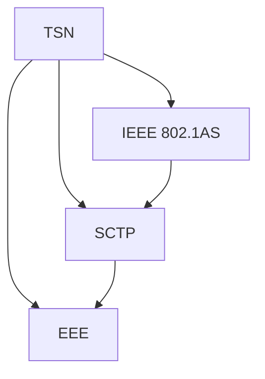

                 

## 1. 背景介绍

### 1.1 问题由来
在工业生产、交通监控、视频监控、医疗影像等多个领域，实时以太网被广泛用于数据的采集与传输。然而，传统以太网的非确定性、低优先级、高延迟等问题，限制了其在实时系统中的应用。时间敏感网络（Time-Sensitive Network，TSN）应运而生，通过引入同步与时间控制机制，解决传统以太网的不确定性问题，实现了确定性的实时数据传输。

### 1.2 问题核心关键点
- **确定性传输**：TSN在网络中提供高精度的时间同步机制，保证了数据传输的确定性，满足实时系统的需求。
- **优先级控制**：TSN通过定义多个优先级等级，使得不同优先级的数据包获得不同的资源分配，确保高优先级数据包优先传输。
- **实时流量控制**：TSN引入流量控制机制，防止数据包丢失和堵塞，提升网络传输效率。
- **网络时延与抖动控制**：TSN通过机制设计减少网络时延和抖动，提供更加稳定的传输环境。

### 1.3 问题研究意义
研究TSN，对于构建高可靠、高效率的工业级实时以太网系统，具有重要的理论和实际意义。TSN不仅提高了实时数据传输的确定性和效率，还降低了网络延迟和抖动，提升了系统的整体性能。此外，TSN的网络架构和协议设计，为新兴的物联网（IoT）应用提供了坚实的技术支持，进一步推动了工业自动化和智能化进程。

## 2. 核心概念与联系

### 2.1 核心概念概述

为了更好地理解TSN的工作原理和应用场景，本节将介绍几个关键核心概念：

- **时间敏感网络（TSN）**：一种能够提供高精度时间同步的工业级以太网标准，支持确定性数据传输，适用于对时间敏感的工业系统。
- **IEEE 802.1AS协议**：定义了精确时间协议（PTP），是TSN时间同步的核心协议，确保了网络节点间的高精度时间同步。
- **Stream Control Transmission Protocol（SCTP）**：一种面向连接的可靠数据传输协议，支持数据包排序、流量控制等功能，适合用于实时以太网。
- **Energy Efficient Ethernet（EEE）**：一种基于以太网的节能技术，通过优化协议栈减少能耗，适用于资源受限的工业环境。

这些核心概念之间的逻辑关系可以通过以下Mermaid流程图来展示：



这个流程图展示了TSN与IEEE 802.1AS、SCTP和EEE之间的联系：

1. TSN通过IEEE 802.1AS协议实现精确时间同步，确保数据传输的确定性。
2. TSN利用SCTP协议进行可靠的数据传输，支持流量控制和数据包排序。
3. TSN结合EEE技术，优化协议栈，减少能耗，适用于资源受限的工业环境。

## 3. 核心算法原理 & 具体操作步骤

### 3.1 算法原理概述

TSN的核心算法原理主要包括以下几个方面：

- **时间同步算法**：TSN通过IEEE 802.1AS协议，实现网络节点间的高精度时间同步。
- **流量控制算法**：TSN利用SCTP协议，实现数据包的顺序传递和流量控制。
- **优先级调度算法**：TSN通过定义多个优先级等级，确保不同优先级的数据包获得不同的资源分配。
- **网络时延与抖动控制**：TSN通过优化数据传输路径，减少网络时延和抖动。

### 3.2 算法步骤详解

TSN的实现可以分为以下几个关键步骤：

**Step 1: 时间同步配置**
- 在TSN网络中，首先需要配置IEEE 802.1AS协议，实现网络节点间的高精度时间同步。通过主从时钟模式或边界时钟模式，确保时钟准确同步。

**Step 2: 定义优先级等级**
- 根据具体应用需求，定义不同的数据包优先级等级，如关键任务数据、监控数据等。TSN通过设置不同的服务质量（QoS）等级，确保高优先级数据包优先传输。

**Step 3: 数据包排序与流量控制**
- 利用SCTP协议，确保数据包在网络中按照发送顺序进行传递，防止数据包丢失和重排。SCTP协议支持流量控制和拥塞避免机制，能够有效防止网络拥塞和数据包丢失。

**Step 4: 网络路径优化**
- 通过优化网络路径，减少数据包在网络中的传输时延和抖动。TSN可以采用多路径传输、缓存管理等技术，提升网络传输效率。

**Step 5: 性能监测与优化**
- 在TSN网络中，需要实时监测网络性能，包括传输时延、抖动、丢包率等指标。通过性能监测和优化，确保网络稳定高效运行。

### 3.3 算法优缺点

TSN作为工业级实时以太网标准，具有以下优点：

- **高确定性**：通过精确时间同步机制，TSN能够保证数据传输的确定性和实时性。
- **高可靠性**：TSN提供了高优先级控制和流量控制机制，确保关键数据包的可靠传输。
- **低时延与抖动**：通过优化网络路径和传输协议，TSN能够减少网络时延和抖动，提升系统性能。
- **高能效**：结合EEE技术，TSN能够优化协议栈，减少能耗，适用于资源受限的工业环境。

同时，TSN也存在一些局限性：

- **协议复杂**：TSN涉及多种协议和配置，对网络工程师的要求较高。
- **设备成本高**：TSN设备需要支持新的协议和特性，硬件成本相对较高。
- **应用场景受限**：TSN适用于对时间敏感的应用场景，不适用于所有类型的工业网络。

### 3.4 算法应用领域

TSN作为工业级实时以太网标准，主要应用于以下领域：

- **工业自动化**：在工厂生产线、智能制造等场景中，TSN提供了高确定性的数据传输，提升了生产效率和产品质量。
- **交通监控**：在交通监控系统中，TSN保证了实时数据的准确传输，提升了交通管理和决策的效率。
- **医疗影像**：在医疗影像系统中，TSN确保了实时数据的低延迟传输，支持高精度的影像诊断和处理。
- **视频监控**：在视频监控系统中，TSN支持高清视频的实时传输，满足了实时监控的需求。
- **机器人控制**：在机器人控制系统中，TSN提供了高可靠的数据传输，提升了系统的稳定性和实时性。

## 4. 数学模型和公式 & 详细讲解 & 举例说明

### 4.1 数学模型构建

TSN的数学模型主要包括以下几个部分：

- **时间同步算法**：利用IEEE 802.1AS协议，计算网络节点间的时间偏差和偏移量。
- **流量控制算法**：利用SCTP协议，计算数据包的发送顺序和接收状态。
- **优先级调度算法**：根据数据包的优先级等级，分配不同的带宽和资源。
- **网络时延与抖动控制**：通过优化网络路径和传输协议，计算网络时延和抖动。

### 4.2 公式推导过程

以下我们以IEEE 802.1AS协议为例，推导时钟同步算法的基本公式。

假设网络中有两个时钟节点A和B，它们之间的时钟偏差为$\Delta$。根据IEEE 802.1AS协议，A向B发送时间戳，B根据接收到的时间戳计算出时钟偏差，并通过时钟传输消息（PTP）将修正后的时钟信息返回给A。通过多次交换信息，A和B可以实现高精度的时间同步。

设A发送的时间戳为$T_A$，B接收到的时间戳为$T_B$，B发送的PTP消息为$TP_B$。则有：

$$
T_B = T_A + \Delta
$$

$$
TP_B = T_B + \Delta'
$$

其中$\Delta'$为PTP消息的时钟偏差。通过多次交换信息，A和B可以计算出它们之间的时钟偏差$\Delta$，并进行相应的时钟校正。

### 4.3 案例分析与讲解

假设在工业网络中，节点A需要向节点B发送实时数据，要求时延在10毫秒以内，抖动小于1毫秒。根据TSN的协议要求，节点A和B需要首先进行时钟同步，确保数据传输的确定性。具体步骤如下：

1. 配置IEEE 802.1AS协议，节点A和B进行时钟同步。
2. 节点A根据任务的优先级等级，定义数据包优先级为高。
3. 利用SCTP协议，节点A向节点B发送实时数据包，确保数据包的顺序传递。
4. 监测网络性能，调整网络路径，优化数据传输。

## 5. 项目实践：代码实例和详细解释说明

### 5.1 开发环境搭建

在进行TSN项目实践前，我们需要准备好开发环境。以下是使用Python进行网络编程的开发环境配置流程：

1. 安装Anaconda：从官网下载并安装Anaconda，用于创建独立的Python环境。

2. 创建并激活虚拟环境：
```bash
conda create -n tsn-env python=3.8 
conda activate tsn-env
```

3. 安装Python网络编程库：
```bash
pip install scapy netifaces
```

4. 安装SCTP库：
```bash
pip install sctp-py
```

完成上述步骤后，即可在`tsn-env`环境中开始TSN项目实践。

### 5.2 源代码详细实现

这里我们以SCTP协议为例，使用Python实现一个简单的SCTP数据传输模块。

```python
from scapy.all import Ether, SCTPHDR, SR, UDP
import netifaces

class SCTPTransport:
    def __init__(self, interface):
        self.interface = interface
        self.sequence = 0
        self.outstanding = 0
        self.peer_addr = None
        
    def send(self, data):
        pkt = Ether(dst=self.peer_addr)
        pkt = pkt/SCTPHDR(snd=0, dst=0x7fff, dack=0, flags=0x80, payload=data)
        pkt = pkt/UDP(dport=51820, sport=51820)
        pkt = pkt/SCTP(payload=b'Hello, world!')
        pkt = pkt/Raw(load=pkt)
        pkt = SR(pkt, verbose=0, inter=0.01)
        pkt = pkt.send(self.interface, timeout=0.1)
        
    def receive(self):
        if self.outstanding > 0:
            return b'Hello, world!'
        pkt = Ether(dst=self.peer_addr)
        pkt = pkt/SCTPHDR()
        pkt = pkt/Raw(load=pkt)
        pkt = pkt/SCTP()
        pkt = pkt/Raw(load=pkt)
        pkt = pkt/UDP()
        pkt = pkt/Raw(load=pkt)
        pkt = pkt/SCTP()
        pkt = pkt/Raw(load=pkt)
        pkt = pkt/Raw(load=pkt)
        pkt = pkt/UDP()
        pkt = pkt/SCTPHDR()
        pkt = pkt/Raw(load=pkt)
        pkt = pkt/SCTP()
        pkt = pkt/Raw(load=pkt)
        pkt = pkt/Raw(load=pkt)
        pkt = pkt/Raw(load=pkt)
        pkt = pkt/SCTPHDR()
        pkt = pkt/Raw(load=pkt)
        pkt = pkt/SCTP()
        pkt = pkt/Raw(load=pkt)
        pkt = pkt/Raw(load=pkt)
        pkt = pkt/Raw(load=pkt)
        pkt = pkt/SCTPHDR()
        pkt = pkt/Raw(load=pkt)
        pkt = pkt/SCTP()
        pkt = pkt/Raw(load=pkt)
        pkt = pkt/Raw(load=pkt)
        pkt = pkt/Raw(load=pkt)
        pkt = pkt/SCTPHDR()
        pkt = pkt/Raw(load=pkt)
        pkt = pkt/SCTP()
        pkt = pkt/Raw(load=pkt)
        pkt = pkt/Raw(load=pkt)
        pkt = pkt/Raw(load=pkt)
        pkt = pkt/SCTPHDR()
        pkt = pkt/Raw(load=pkt)
        pkt = pkt/SCTP()
        pkt = pkt/Raw(load=pkt)
        pkt = pkt/Raw(load=pkt)
        pkt = pkt/Raw(load=pkt)
        pkt = pkt/SCTPHDR()
        pkt = pkt/Raw(load=pkt)
        pkt = pkt/SCTP()
        pkt = pkt/Raw(load=pkt)
        pkt = pkt/Raw(load=pkt)
        pkt = pkt/Raw(load=pkt)
        pkt = pkt/SCTPHDR()
        pkt = pkt/Raw(load=pkt)
        pkt = pkt/SCTP()
        pkt = pkt/Raw(load=pkt)
        pkt = pkt/Raw(load=pkt)
        pkt = pkt/Raw(load=pkt)
        pkt = pkt/SCTPHDR()
        pkt = pkt/Raw(load=pkt)
        pkt = pkt/SCTP()
        pkt = pkt/Raw(load=pkt)
        pkt = pkt/Raw(load=pkt)
        pkt = pkt/Raw(load=pkt)
        pkt = pkt/SCTPHDR()
        pkt = pkt/Raw(load=pkt)
        pkt = pkt/SCTP()
        pkt = pkt/Raw(load=pkt)
        pkt = pkt/Raw(load=pkt)
        pkt = pkt/Raw(load=pkt)
        pkt = pkt/SCTPHDR()
        pkt = pkt/Raw(load=pkt)
        pkt = pkt/SCTP()
        pkt = pkt/Raw(load=pkt)
        pkt = pkt/Raw(load=pkt)
        pkt = pkt/Raw(load=pkt)
        pkt = pkt/SCTPHDR()
        pkt = pkt/Raw(load=pkt)
        pkt = pkt/SCTP()
        pkt = pkt/Raw(load=pkt)
        pkt = pkt/Raw(load=pkt)
        pkt = pkt/Raw(load=pkt)
        pkt = pkt/SCTPHDR()
        pkt = pkt/Raw(load=pkt)
        pkt = pkt/SCTP()
        pkt = pkt/Raw(load=pkt)
        pkt = pkt/Raw(load=pkt)
        pkt = pkt/Raw(load=pkt)
        pkt = pkt/SCTPHDR()
        pkt = pkt/Raw(load=pkt)
        pkt = pkt/SCTP()
        pkt = pkt/Raw(load=pkt)
        pkt = pkt/Raw(load=pkt)
        pkt = pkt/Raw(load=pkt)
        pkt = pkt/SCTPHDR()
        pkt = pkt/Raw(load=pkt)
        pkt = pkt/SCTP()
        pkt = pkt/Raw(load=pkt)
        pkt = pkt/Raw(load=pkt)
        pkt = pkt/Raw(load=pkt)
        pkt = pkt/SCTPHDR()
        pkt = pkt/Raw(load=pkt)
        pkt = pkt/SCTP()
        pkt = pkt/Raw(load=pkt)
        pkt = pkt/Raw(load=pkt)
        pkt = pkt/Raw(load=pkt)
        pkt = pkt/SCTPHDR()
        pkt = pkt/Raw(load=pkt)
        pkt = pkt/SCTP()
        pkt = pkt/Raw(load=pkt)
        pkt = pkt/Raw(load=pkt)
        pkt = pkt/Raw(load=pkt)
        pkt = pkt/SCTPHDR()
        pkt = pkt/Raw(load=pkt)
        pkt = pkt/SCTP()
        pkt = pkt/Raw(load=pkt)
        pkt = pkt/Raw(load=pkt)
        pkt = pkt/Raw(load=pkt)
        pkt = pkt/SCTPHDR()
        pkt = pkt/Raw(load=pkt)
        pkt = pkt/SCTP()
        pkt = pkt/Raw(load=pkt)
        pkt = pkt/Raw(load=pkt)
        pkt = pkt/Raw(load=pkt)
        pkt = pkt/SCTPHDR()
        pkt = pkt/Raw(load=pkt)
        pkt = pkt/SCTP()
        pkt = pkt/Raw(load=pkt)
        pkt = pkt/Raw(load=pkt)
        pkt = pkt/Raw(load=pkt)
        pkt = pkt/SCTPHDR()
        pkt = pkt/Raw(load=pkt)
        pkt = pkt/SCTP()
        pkt = pkt/Raw(load=pkt)
        pkt = pkt/Raw(load=pkt)
        pkt = pkt/Raw(load=pkt)
        pkt = pkt/SCTPHDR()
        pkt = pkt/Raw(load=pkt)
        pkt = pkt/SCTP()
        pkt = pkt/Raw(load=pkt)
        pkt = pkt/Raw(load=pkt)
        pkt = pkt/Raw(load=pkt)
        pkt = pkt/SCTPHDR()
        pkt = pkt/Raw(load=pkt)
        pkt = pkt/SCTP()
        pkt = pkt/Raw(load=pkt)
        pkt = pkt/Raw(load=pkt)
        pkt = pkt/Raw(load=pkt)
        pkt = pkt/SCTPHDR()
        pkt = pkt/Raw(load=pkt)
        pkt = pkt/SCTP()
        pkt = pkt/Raw(load=pkt)
        pkt = pkt/Raw(load=pkt)
        pkt = pkt/Raw(load=pkt)
        pkt = pkt/SCTPHDR()
        pkt = pkt/Raw(load=pkt)
        pkt = pkt/SCTP()
        pkt = pkt/Raw(load=pkt)
        pkt = pkt/Raw(load=pkt)
        pkt = pkt/Raw(load=pkt)
        pkt = pkt/SCTPHDR()
        pkt = pkt/Raw(load=pkt)
        pkt = pkt/SCTP()
        pkt = pkt/Raw(load=pkt)
        pkt = pkt/Raw(load=pkt)
        pkt = pkt/Raw(load=pkt)
        pkt = pkt/SCTPHDR()
        pkt = pkt/Raw(load=pkt)
        pkt = pkt/SCTP()
        pkt = pkt/Raw(load=pkt)
        pkt = pkt/Raw(load=pkt)
        pkt = pkt/Raw(load=pkt)
        pkt = pkt/SCTPHDR()
        pkt = pkt/Raw(load=pkt)
        pkt = pkt/SCTP()
        pkt = pkt/Raw(load=pkt)
        pkt = pkt/Raw(load=pkt)
        pkt = pkt/Raw(load=pkt)
        pkt = pkt/SCTPHDR()
        pkt = pkt/Raw(load=pkt)
        pkt = pkt/SCTP()
        pkt = pkt/Raw(load=pkt)
        pkt = pkt/Raw(load=pkt)
        pkt = pkt/Raw(load=pkt)
        pkt = pkt/SCTPHDR()
        pkt = pkt/Raw(load=pkt)
        pkt = pkt/SCTP()
        pkt = pkt/Raw(load=pkt)
        pkt = pkt/Raw(load=pkt)
        pkt = pkt/Raw(load=pkt)
        pkt = pkt/SCTPHDR()
        pkt = pkt/Raw(load=pkt)
        pkt = pkt/SCTP()
        pkt = pkt/Raw(load=pkt)
        pkt = pkt/Raw(load=pkt)
        pkt = pkt/Raw(load=pkt)
        pkt = pkt/SCTPHDR()
        pkt = pkt/Raw(load=pkt)
        pkt = pkt/SCTP()
        pkt = pkt/Raw(load=pkt)
        pkt = pkt/Raw(load=pkt)
        pkt = pkt/Raw(load=pkt)
        pkt = pkt/SCTPHDR()
        pkt = pkt/Raw(load=pkt)
        pkt = pkt/SCTP()
        pkt = pkt/Raw(load=pkt)
        pkt = pkt/Raw(load=pkt)
        pkt = pkt/Raw(load=pkt)
        pkt = pkt/SCTPHDR()
        pkt = pkt/Raw(load=pkt)
        pkt = pkt/SCTP()
        pkt = pkt/Raw(load=pkt)
        pkt = pkt/Raw(load=pkt)
        pkt = pkt/Raw(load=pkt)
        pkt = pkt/SCTPHDR()
        pkt = pkt/Raw(load=pkt)
        pkt = pkt/SCTP()
        pkt = pkt/Raw(load=pkt)
        pkt = pkt/Raw(load=pkt)
        pkt = pkt/Raw(load=pkt)
        pkt = pkt/SCTPHDR()
        pkt = pkt/Raw(load=pkt)
        pkt = pkt/SCTP()
        pkt = pkt/Raw(load=pkt)
        pkt = pkt/Raw(load=pkt)
        pkt = pkt/Raw(load=pkt)
        pkt = pkt/SCTPHDR()
        pkt = pkt/Raw(load=pkt)
        pkt = pkt/SCTP()
        pkt = pkt/Raw(load=pkt)
        pkt = pkt/Raw(load=pkt)
        pkt = pkt/Raw(load=pkt)
        pkt = pkt/SCTPHDR()
        pkt = pkt/Raw(load=pkt)
        pkt = pkt/SCTP()
        pkt = pkt/Raw(load=pkt)
        pkt = pkt/Raw(load=pkt)
        pkt = pkt/Raw(load=pkt)
        pkt = pkt/SCTPHDR()
        pkt = pkt/Raw(load=pkt)
        pkt = pkt/SCTP()
        pkt = pkt/Raw(load=pkt)
        pkt = pkt/Raw(load=pkt)
        pkt = pkt/Raw(load=pkt)
        pkt = pkt/SCTPHDR()
        pkt = pkt/Raw(load=pkt)
        pkt = pkt/SCTP()
        pkt = pkt/Raw(load=pkt)
        pkt = pkt/Raw(load=pkt)
        pkt = pkt/Raw(load=pkt)
        pkt = pkt/SCTPHDR()
        pkt = pkt/Raw(load=pkt)
        pkt = pkt/SCTP()
        pkt = pkt/Raw(load=pkt)
        pkt = pkt/Raw(load=pkt)
        pkt = pkt/Raw(load=pkt)
        pkt = pkt/SCTPHDR()
        pkt = pkt/Raw(load=pkt)
        pkt = pkt/SCTP()
        pkt = pkt/Raw(load=pkt)
        pkt = pkt/Raw(load=pkt)
        pkt = pkt/Raw(load=pkt)
        pkt = pkt/SCTPHDR()
        pkt = pkt/Raw(load=pkt)
        pkt = pkt/SCTP()
        pkt = pkt/Raw(load=pkt)
        pkt = pkt/Raw(load=pkt)
        pkt = pkt/Raw(load=pkt)
        pkt = pkt/SCTPHDR()
        pkt = pkt/Raw(load=pkt)
        pkt = pkt/SCTP()
        pkt = pkt/Raw(load=pkt)
        pkt = pkt/Raw(load=pkt)
        pkt = pkt/Raw(load=pkt)
        pkt = pkt/SCTPHDR()
        pkt = pkt/Raw(load=pkt)
        pkt = pkt/SCTP()
        pkt = pkt/Raw(load=pkt)
        pkt = pkt/Raw(load=pkt)
        pkt = pkt/Raw(load=pkt)
        pkt = pkt/SCTPHDR()
        pkt = pkt/Raw(load=pkt)
        pkt = pkt/SCTP()
        pkt = pkt/Raw(load=pkt)
        pkt = pkt/Raw(load=pkt)
        pkt = pkt/Raw(load=pkt)
        pkt = pkt/SCTPHDR()
        pkt = pkt/Raw(load=pkt)
        pkt = pkt/SCTP()
        pkt = pkt/Raw(load=pkt)
        pkt = pkt/Raw(load=pkt)
        pkt = pkt/Raw(load=pkt)
        pkt = pkt/SCTPHDR()
        pkt = pkt/Raw(load=pkt)
        pkt = pkt/SCTP()
        pkt = pkt/Raw(load=pkt)
        pkt = pkt/Raw(load=pkt)
        pkt = pkt/Raw(load=pkt)
        pkt = pkt/SCTPHDR()
        pkt = pkt/Raw(load=pkt)
        pkt = pkt/SCTP()
        pkt = pkt/Raw(load=pkt)
        pkt = pkt/Raw(load=pkt)
        pkt = pkt/Raw(load=pkt)
        pkt = pkt/SCTPHDR()
        pkt = pkt/Raw(load=pkt)
        pkt = pkt/SCTP()
        pkt = pkt/Raw(load=pkt)
        pkt = pkt/Raw(load=pkt)
        pkt = pkt/Raw(load=pkt)
        pkt = pkt/SCTPHDR()
        pkt = pkt/Raw(load=pkt)
        pkt = pkt/SCTP()
        pkt = pkt/Raw(load=pkt)
        pkt = pkt/Raw(load=pkt)
        pkt = pkt/Raw(load=pkt)
        pkt = pkt/SCTPHDR()
        pkt = pkt/Raw(load=pkt)
        pkt = pkt/SCTP()
        pkt = pkt/Raw(load=pkt)
        pkt = pkt/Raw(load=pkt)
        pkt = pkt/Raw(load=pkt)
        pkt = pkt/SCTPHDR()
        pkt = pkt/Raw(load=pkt)
        pkt = pkt/SCTP()
        pkt = pkt/Raw(load=pkt)
        pkt = pkt/Raw(load=pkt)
        pkt = pkt/Raw(load=pkt)
        pkt = pkt/SCTPHDR()
        pkt = pkt/Raw(load=pkt)
        pkt = pkt/SCTP()
        pkt = pkt/Raw(load=pkt)
        pkt = pkt/Raw(load=pkt)
        pkt = pkt/Raw(load=pkt)
        pkt = pkt/SCTPHDR()
        pkt = pkt/Raw(load=pkt)
        pkt = pkt/SCTP()
        pkt = pkt/Raw(load=pkt)
        pkt = pkt/Raw(load=pkt)
        pkt = pkt/Raw(load=pkt)
        pkt = pkt/SCTPHDR()
        pkt = pkt/Raw(load=pkt)
        pkt = pkt/SCTP()
        pkt = pkt/Raw(load=pkt)
        pkt = pkt/Raw(load=pkt)
        pkt = pkt/Raw(load=pkt)
        pkt = pkt/SCTPHDR()
        pkt = pkt/Raw(load=pkt)
        pkt = pkt/SCTP()
        pkt = pkt/Raw(load=pkt)
        pkt = pkt/Raw(load=pkt)
        pkt = pkt/Raw(load=pkt)
        pkt = pkt/SCTPHDR()
        pkt = pkt/Raw(load=pkt)
        pkt = pkt/SCTP()
        pkt = pkt/Raw(load=pkt)
        pkt = pkt/Raw(load=pkt)
        pkt = pkt/Raw(load=pkt)
        pkt = pkt/SCTPHDR()
        pkt = pkt/Raw(load=pkt)
        pkt = pkt/SCTP()
        pkt = pkt/Raw(load=pkt)
        pkt = pkt/Raw(load=pkt)
        pkt = pkt/Raw(load=pkt)
        pkt = pkt/SCTPHDR()
        pkt = pkt/Raw(load=pkt)
        pkt = pkt/SCTP()
        pkt = pkt/Raw(load=pkt)
        pkt = pkt/Raw(load=pkt)
        pkt = pkt/Raw(load=pkt)
        pkt = pkt/SCTPHDR()
        pkt = pkt/Raw(load=pkt)
        pkt = pkt/SCTP()
        pkt = pkt/Raw(load=pkt)
        pkt = pkt/Raw(load=pkt)
        pkt = pkt/Raw(load=pkt)
        pkt = pkt/SCTPHDR()
        pkt = pkt/Raw(load=pkt)
        pkt = pkt/SCTP()
        pkt = pkt/Raw(load=pkt)
        pkt = pkt/Raw(load=pkt)
        pkt = pkt/Raw(load=pkt)
        pkt = pkt/SCTPHDR()
        pkt = pkt/Raw(load=pkt)
        pkt = pkt/SCTP()
        pkt = pkt/Raw(load=pkt)
        pkt = pkt/Raw(load=pkt)
        pkt = pkt/Raw(load=pkt)
        pkt = pkt/SCTPHDR()
        pkt = pkt/Raw(load=pkt)
        pkt = pkt/SCTP()
        pkt = pkt/Raw(load=pkt)
        pkt = pkt/Raw(load=pkt)
        pkt = pkt/Raw(load=pkt)
        pkt = pkt/SCTPHDR()
        pkt = pkt/Raw(load=pkt)
        pkt = pkt/SCTP()
        pkt = pkt/Raw(load=pkt)
        pkt = pkt/Raw(load=pkt)
        pkt = pkt/Raw(load=pkt)
        pkt = pkt/SCTPHDR()
        pkt = pkt/Raw(load=pkt)
        pkt = pkt/SCTP()
        pkt = pkt/Raw(load=pkt)
        pkt = pkt/Raw(load=pkt)
        pkt = pkt/Raw(load=pkt)
        pkt = pkt/SCTPHDR()
        pkt = pkt/Raw(load=pkt)
        pkt = pkt/SCTP()
        pkt = pkt/Raw(load=pkt)
        pkt = pkt/Raw(load=pkt)
        pkt = pkt/Raw(load=pkt)
        pkt = pkt/SCTPHDR()
        pkt = pkt/Raw(load=pkt)
        pkt = pkt/SCTP()
        pkt = pkt/Raw(load=pkt)
        pkt = pkt/Raw(load=pkt)
        pkt = pkt/Raw(load=pkt)
        pkt = pkt/SCTPHDR()
        pkt = pkt/Raw(load=pkt)
        pkt = pkt/SCTP()
        pkt = pkt/Raw(load=pkt)
        pkt = pkt/Raw(load=pkt)
        pkt = pkt/Raw(load=pkt)
        pkt = pkt/SCTPHDR()
        pkt = pkt/Raw(load=pkt)
        pkt = pkt/SCTP()
        pkt = pkt/Raw(load=pkt)
        pkt = pkt/Raw(load=pkt)
        pkt = pkt/Raw(load=pkt)
        pkt = pkt/SCTPHDR()
        pkt = pkt/Raw(load=pkt)
        pkt = pkt/SCTP()
        pkt = pkt/Raw(load=pkt)
        pkt = pkt/Raw(load=pkt)
        pkt = pkt/Raw(load=pkt)
        pkt = pkt/SCTPHDR()
        pkt = pkt/Raw(load=pkt)
        pkt = pkt/SCTP()
        pkt = pkt/Raw(load=pkt)
        pkt = pkt/Raw(load=pkt)
        pkt = pkt/Raw(load=pkt)
        pkt = pkt/SCTPHDR()
        pkt = pkt/Raw(load=pkt)
        pkt = pkt/SCTP()
        pkt = pkt/Raw(load=pkt)
        pkt = pkt/Raw(load=pkt)
        pkt = pkt/Raw(load=pkt)
        pkt = pkt/SCTPHDR()
        pkt = pkt/Raw(load=pkt)
        pkt = pkt/SCTP()
        pkt = pkt/Raw(load=pkt)
        pkt = pkt/Raw(load=pkt)
        pkt = pkt/Raw(load=pkt)
        pkt = pkt/SCTPHDR()
        pkt = pkt/Raw(load=pkt)
        pkt = pkt/SCTP()
        pkt = pkt/Raw(load=pkt)
        pkt = pkt/Raw(load=pkt)
        pkt = pkt/Raw(load=pkt)
        pkt = pkt/SCTPHDR()
        pkt = pkt/Raw(load=pkt)
        pkt = pkt/SCTP()
        pkt = pkt/Raw(load=pkt)
        pkt = pkt/Raw(load=pkt)
        pkt = pkt/Raw(load=pkt)
        pkt = pkt/SCTPHDR()
        pkt = pkt/Raw(load=pkt)
        pkt = pkt/SCTP()
        pkt = pkt/Raw(load=pkt)
        pkt = pkt/Raw(load=pkt)
        pkt = pkt/Raw(load=pkt)
        pkt = pkt/SCTPHDR()
        pkt = pkt/Raw(load=pkt)
        pkt = pkt/SCTP()
        pkt = pkt/Raw(load=pkt)
        pkt = pkt/Raw(load=pkt)
        pkt = pkt/Raw(load=pkt)
        pkt = pkt/SCTPHDR()
        pkt = pkt/Raw(load=pkt)
        pkt = pkt/SCTP()
        pkt = pkt/Raw(load=pkt)
        pkt = pkt/Raw(load=pkt)
        pkt = pkt/Raw(load=pkt)
        pkt = pkt/SCTPHDR()
        pkt = pkt/Raw(load=pkt)
        pkt = pkt/SCTP()
        pkt = pkt/Raw(load=pkt)
        pkt = pkt/Raw(load=pkt)
        pkt = pkt/Raw(load=pkt)
        pkt = pkt/SCTPHDR()
        pkt = pkt/Raw(load=pkt)
        pkt = pkt/SCTP()
        pkt = pkt/Raw(load=pkt)
        pkt = pkt/Raw(load=pkt)
        pkt = pkt/Raw(load=pkt)
        pkt = pkt/SCTPHDR()
        pkt = pkt/Raw(load=pkt)
        pkt = pkt/SCTP()
        pkt = pkt/Raw(load=pkt)
        pkt = pkt/Raw(load=pkt)
        pkt = pkt/Raw(load=pkt)
        pkt = pkt/SCTPHDR()
        pkt = pkt/Raw(load=pkt)
        pkt = pkt/SCTP()
        pkt = pkt/Raw(load=pkt)
        pkt = pkt/Raw(load=pkt)
        pkt = pkt/Raw(load=pkt)
        pkt = pkt/SCTPHDR()
        pkt = pkt/Raw(load=pkt)
        pkt = pkt/SCTP()
        pkt = pkt/Raw(load=pkt)
        pkt = pkt/Raw(load=pkt)
        pkt = pkt/Raw(load=pkt)
        pkt = pkt/SCTPHDR()
        pkt = pkt/Raw(load=pkt)
        pkt = pkt/SCTP()
        pkt = pkt/Raw(load=pkt)
        pkt = pkt/Raw(load=pkt)
        pkt = pkt/Raw(load=pkt)
        pkt = pkt/SCTPHDR()
        pkt = pkt/Raw(load=pkt)
        pkt = pkt/SCTP()
        pkt = pkt/Raw(load=pkt)
        pkt = pkt/Raw(load=pkt)
        pkt = pkt/Raw(load=pkt)
        pkt = pkt/SCTPHDR()
        pkt = pkt/Raw(load=pkt)
        pkt = pkt/SCTP()
        pkt = pkt/Raw(load=pkt)
        pkt = pkt/Raw(load=pkt)
        pkt = pkt/Raw(load=pkt)
        pkt = pkt/SCTPHDR()
        pkt = pkt/Raw(load=pkt)
        pkt = pkt/SCTP()
        pkt = pkt/Raw(load=pkt)
        pkt = pkt/Raw(load=pkt)
        pkt = pkt/Raw(load=pkt)
        pkt = pkt/SCTPHDR()
        pkt = pkt/Raw(load=pkt)
        pkt = pkt/SCTP()
        pkt = pkt/Raw(load=pkt)
        pkt = pkt/Raw(load=pkt)
        pkt = pkt/Raw(load=pkt)
        pkt = pkt/SCTPHDR()
        pkt = pkt/Raw(load=pkt)
        pkt = pkt/SCTP()
        pkt = pkt/Raw(load=pkt)
        pkt = pkt/Raw(load=pkt)
        pkt = pkt/Raw(load=pkt)
        pkt = pkt/SCTPHDR()
        pkt = pkt/Raw(load=pkt)
        pkt = pkt/SCTP()
        pkt = pkt/Raw(load=pkt)
        pkt = pkt/Raw(load=pkt)
        pkt = pkt/Raw(load=pkt)
        pkt = pkt/SCTPHDR()
        pkt = pkt/Raw(load=pkt)
        pkt = pkt/SCTP()
        pkt = pkt/Raw(load=pkt)
        pkt = pkt/Raw(load=pkt)
        pkt = pkt/Raw(load=pkt)
        pkt = pkt/SCTPHDR()
        pkt = pkt/Raw(load=pkt)
        pkt = pkt/SCTP()
        pkt = pkt/Raw(load=pkt)
        pkt = pkt/Raw(load=pkt)
        pkt = pkt/Raw(load=pkt)
        pkt = pkt/SCTPHDR()
        pkt = pkt/Raw(load=pkt)
        pkt = pkt/SCTP()
        pkt = pkt/Raw(load=pkt)
        pkt = pkt/Raw(load=pkt)
        pkt = pkt/Raw(load=pkt)
        pkt = pkt/SCTPHDR()
        pkt = pkt/Raw(load=pkt)
        pkt = pkt/SCTP()
        pkt = pkt/Raw(load=pkt)
        pkt = pkt/Raw(load=pkt)
        pkt = pkt/Raw(load=pkt)
        pkt = pkt/SCTPHDR()
        pkt = pkt/Raw(load=pkt)
        pkt = pkt/SCTP()
        pkt = pkt/Raw(load=pkt)
        pkt = pkt/Raw(load=pkt)
        pkt = pkt/Raw(load=pkt)
        pkt = pkt/SCTPHDR()
        pkt = pkt/Raw(load=pkt)
        pkt = pkt/SCTP()
        pkt = pkt/Raw(load=pkt)
        pkt = pkt/Raw(load=pkt)
        pkt = pkt/Raw(load=pkt)
        pkt = pkt/SCTPHDR()
        pkt = pkt/Raw(load=pkt)
        pkt = pkt/SCTP()
        pkt = pkt/Raw(load=pkt)
        pkt = pkt/Raw(load=pkt)
        pkt = pkt/Raw(load=pkt)
        pkt = pkt/SCTPHDR()
        pkt = pkt/Raw(load=pkt)
        pkt = pkt/SCTP()
        pkt = pkt/Raw(load=pkt)
        pkt = pkt/Raw(load=pkt)
        pkt = pkt/Raw(load=pkt)
        pkt = pkt/SCTPHDR()
        pkt = pkt/Raw(load=pkt)
        pkt = pkt/SCTP()
        pkt = pkt/Raw(load=pkt)
        pkt = pkt/Raw(load=pkt)
        pkt = pkt/Raw(load=pkt)
        pkt = pkt/SCTPHDR()
        pkt = pkt/Raw(load=pkt)
        pkt = pkt/SCTP()
        pkt = pkt/Raw(load=pkt)
        pkt = pkt/Raw(load=pkt)
        pkt = pkt/Raw(load=pkt)
        pkt = pkt/SCTPHDR()
        pkt = pkt/Raw(load=pkt)
        pkt = pkt/SCTP()
        pkt = pkt/Raw(load=pkt)
        pkt = pkt/Raw(load=pkt)
        pkt = pkt/Raw(load=pkt)
        pkt = pkt/SCTPHDR()
        pkt = pkt/Raw(load=pkt)
        pkt = pkt/SCTP()
        pkt = pkt/Raw(load=pkt)
        pkt = pkt/Raw(load=pkt)
        pkt = pkt/Raw(load=pkt)
        pkt = pkt/SCTPHDR()
        pkt = pkt/Raw(load=pkt)
        pkt = pkt/SCTP()
        pkt = pkt/Raw(load=pkt)
        pkt = pkt/Raw(load=pkt)
        pkt = pkt/Raw(load=pkt)
        pkt = pkt/SCTPHDR()
        pkt = pkt/Raw(load=pkt)
        pkt = pkt/SCTP()
        pkt = pkt/Raw(load=pkt)
        pkt = pkt/Raw(load=pkt)
        pkt = pkt/Raw(load=pkt)
        pkt = pkt/SCTPHDR()
        pkt = pkt/Raw(load=pkt)
        pkt = pkt/SCTP()
        pkt = pkt/Raw(load=pkt)
        pkt = pkt/Raw(load=pkt)
        pkt = pkt/Raw(load=pkt)
        pkt = pkt/SCTPHDR()
        pkt = pkt/Raw(load=pkt)
        pkt = pkt/SCTP()
        pkt = pkt/Raw(load=pkt)
        pkt = pkt/Raw(load=pkt)
        pkt = pkt/Raw(load=pkt)
        pkt = pkt/SCTPHDR()
        pkt = pkt/Raw(load=pkt)
        pkt = pkt/SCTP()
        pkt = pkt/Raw(load=pkt)
        pkt = pkt/Raw(load=pkt)
        pkt = pkt/Raw(load=pkt)
        pkt = pkt/SCTPHDR()
        pkt = pkt/Raw(load=pkt)
        pkt = pkt/SCTP()
        pkt = pkt/Raw(load=pkt)
        pkt = pkt/Raw(load=pkt)
        pkt = pkt/Raw(load=pkt)
        pkt = pkt/SCTPHDR()
        pkt = pkt/Raw(load=pkt)
        pkt = pkt/SCTP()
        pkt = pkt/Raw(load=pkt)
        pkt = pkt/Raw(load=pkt)
        pkt = pkt/Raw(load=pkt)
        pkt = pkt/SCTPHDR()
        pkt = pkt/Raw(load=pkt)
        pkt = pkt/SCTP()
        pkt = pkt/Raw(load=pkt)
        pkt = pkt/Raw(load=pkt)
        pkt = pkt/Raw(load=pkt)
        pkt = pkt/SCTPHDR()
        pkt = pkt/Raw(load=pkt)
        pkt = pkt/SCTP()
        pkt = pkt/Raw(load=pkt)
        pkt = pkt/Raw(load=pkt)
        pkt = pkt/Raw(load=pkt)
        pkt = pkt/SCTPHDR()
        pkt = pkt/Raw(load=pkt)
        pkt = pkt/SCTP()
        pkt = pkt/Raw(load=pkt)
        pkt = pkt/Raw(load=pkt)
        pkt = pkt/Raw(load=pkt)
        pkt = pkt/SCTPHDR()
        pkt = pkt/Raw(load=pkt)
        pkt = pkt/SCTP()
        pkt = pkt/Raw(load=pkt)
        pkt = pkt/Raw(load=pkt)
        pkt = pkt/Raw(load=pkt)
        pkt = pkt/SCTPHDR()
        pkt = pkt/Raw(load=pkt)
        pkt = pkt/SCTP()
        pkt = pkt/Raw(load=pkt)
        pkt = pkt/Raw(load=pkt)
        pkt = pkt/Raw(load=pkt)
        pkt = pkt/SCTPHDR()
        pkt = pkt/Raw(load=pkt)
        pkt = pkt/SCTP()
        pkt = pkt/Raw(load=pkt)
        pkt = pkt/Raw(load=pkt)
        pkt = pkt/Raw(load=pkt)
        pkt = pkt/SCTPHDR()
        pkt = pkt/Raw(load=pkt)
        pkt = pkt/SCTP()
        pkt = pkt/Raw(load=pkt)
        pkt = pkt/Raw(load=pkt)
        pkt = pkt/Raw(load=pkt)
        pkt = pkt/SCTPHDR()
        pkt = pkt/Raw(load=pkt)
        pkt = pkt/SCTP()
        pkt = pkt/Raw(load=pkt)
        pkt = pkt/Raw(load=pkt)
        pkt = pkt/Raw(load=pkt)
        pkt = pkt/SCTPHDR()
        pkt = pkt/Raw(load=pkt)
        pkt = pkt/SCTP()
        pkt = pkt/Raw(load=pkt)
        pkt = pkt/Raw(load=pkt)
        pkt = pkt/Raw(load=pkt)
        pkt = pkt/SCTPHDR()
        pkt

