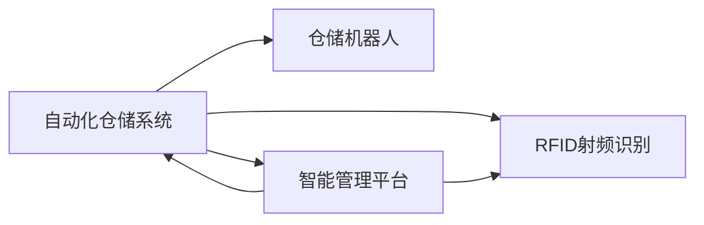

                 

# 智能仓储创业：物流效率的革命性提升

## 1. 背景介绍

### 1.1 问题由来

在当今数字化、智能化的时代背景下，仓储物流行业面临着巨大的挑战和机遇。传统的仓储物流系统依赖于人工操作，效率低下，错误率高。为了应对这些问题，智能仓储系统应运而生。智能仓储系统利用先进的信息技术和物联网技术，对仓储物流过程进行自动化、智能化管理，从而显著提升物流效率，降低运营成本。

### 1.2 问题核心关键点

智能仓储系统的核心在于自动化、智能化。其主要技术包括RFID射频识别、自动化分拣系统、仓储机器人、智能管理平台等。通过这些技术的应用，智能仓储系统能够实现货物自动入库、出库、盘点等功能，提高仓库的运行效率和准确性。

智能仓储系统的成功应用，对于提升整个物流供应链的效率具有重要意义。一方面，智能仓储能够快速响应市场需求，缩短交付周期，提升客户满意度；另一方面，智能仓储通过自动化操作，减少了人工错误，提高了货物安全性。

### 1.3 问题研究意义

智能仓储系统的应用，将推动仓储物流行业从传统的人力密集型向技术密集型转变。智能仓储系统的开发和运营，对于降低物流成本、提高运营效率、优化物流管理具有重要意义。同时，智能仓储系统的开发和应用，也将为创业公司带来巨大的市场机会，推动仓储物流行业的创新与发展。

## 2. 核心概念与联系

### 2.1 核心概念概述

智能仓储系统是一个复杂的系统，涉及多个关键技术。以下是其中的核心概念及其关联：

- 自动化仓储系统：通过自动化操作，实现货物的自动化入库、出库、分拣等操作，提高仓储效率。
- 仓储机器人：利用自主导航和智能算法，实现货物的自动化搬运、堆放等操作。
- RFID射频识别：利用RFID技术，实现货物信息的自动识别、追踪和管理。
- 智能管理平台：通过大数据分析、机器学习等技术，实现仓储过程的智能管理和优化。

这些核心概念构成了智能仓储系统的基础，相互之间存在紧密的联系，共同实现仓储过程的自动化和智能化。

### 2.2 核心概念原理和架构的 Mermaid 流程图



### 2.3 核心概念之间的关系

- 自动化仓储系统是智能仓储系统的基础，通过自动化操作实现仓储效率的提升。
- 仓储机器人是自动化仓储系统的重要组成部分，实现货物的自动化搬运和堆放。
- RFID射频识别技术用于实现货物信息的自动识别和追踪，为智能管理提供数据支持。
- 智能管理平台通过大数据分析和机器学习算法，优化仓储过程，实现仓储管理的智能化。

这些核心概念相互协作，共同构成了智能仓储系统的技术框架。

## 3. 核心算法原理 & 具体操作步骤

### 3.1 算法原理概述

智能仓储系统的核心算法包括自动化操作算法、智能管理算法和RFID识别算法。

- 自动化操作算法：通过路径规划和运动控制算法，实现仓储机器人的自主导航和货物搬运。
- 智能管理算法：通过数据分析和机器学习算法，实现库存管理、货物调度和路径优化。
- RFID识别算法：通过信号处理和模式识别算法，实现货物信息的自动识别和追踪。

这些算法共同构成了智能仓储系统的技术基础。

### 3.2 算法步骤详解

#### 3.2.1 自动化操作算法

自动化操作算法的核心是路径规划和运动控制。以下是一个简单的路径规划算法的步骤：

1. 获取起始位置和目标位置。
2. 根据起始位置和目标位置，构建路径规划图。
3. 使用A*算法或D*算法等路径规划算法，求解最优路径。
4. 根据路径规划结果，控制仓储机器人进行货物搬运。

#### 3.2.2 智能管理算法

智能管理算法的核心是大数据分析和机器学习。以下是一个简单的智能管理算法的步骤：

1. 收集仓储过程的数据，包括货物状态、库存量、运输时间等。
2. 使用大数据分析算法，提取有价值的信息，如货物流量、库存水平等。
3. 使用机器学习算法，对大数据进行建模，预测库存需求和货物流量。
4. 根据预测结果，优化仓储管理策略，实现货物调度和路径优化。

#### 3.2.3 RFID识别算法

RFID识别算法的核心是信号处理和模式识别。以下是一个简单的RFID识别算法的步骤：

1. 使用RFID读取器读取货物标签。
2. 对读取到的信号进行降噪和滤波处理，提取有效信号。
3. 对有效信号进行模式识别，提取货物信息。
4. 将货物信息与系统进行比对，实现货物信息的自动识别和追踪。

### 3.3 算法优缺点

智能仓储系统的算法具有以下优点：

- 自动化操作算法能够实现货物的快速、准确的搬运和堆放，提高仓储效率。
- 智能管理算法能够实现库存管理和货物调度的优化，降低运营成本。
- RFID识别算法能够实现货物信息的自动识别和追踪，提高货物安全性。

同时，智能仓储系统的算法也存在以下缺点：

- 自动化操作算法需要较高的硬件成本和技术门槛。
- 智能管理算法对数据的准确性和完整性要求较高，数据采集和处理难度较大。
- RFID识别算法需要较高的安装和维护成本，信号处理和模式识别算法也需要较高的技术要求。

### 3.4 算法应用领域

智能仓储系统的算法广泛应用于各个行业领域，包括制造业、零售业、物流业等。

- 制造业：通过智能仓储系统，实现自动化生产线和库存管理，提高生产效率和产品质量。
- 零售业：通过智能仓储系统，实现自动化拣选和订单处理，提高订单处理速度和准确性。
- 物流业：通过智能仓储系统，实现货物分拣和配送，提高物流效率和客户满意度。

## 4. 数学模型和公式 & 详细讲解 & 举例说明

### 4.1 数学模型构建

智能仓储系统的数学模型可以分为以下几个部分：

- 路径规划模型：通过路径规划算法，求解最优路径。
- 智能管理模型：通过大数据分析和机器学习算法，实现库存管理和货物调度的优化。
- RFID识别模型：通过信号处理和模式识别算法，实现货物信息的自动识别和追踪。

### 4.2 公式推导过程

#### 4.2.1 路径规划模型

路径规划算法有多种，这里以A*算法为例进行推导。

A*算法的核心是启发式函数，用于评估每个节点的最优路径。启发式函数由两部分组成：

1. 实际代价：从起点到当前节点的实际距离。
2. 启发式代价：从当前节点到目标节点的估计距离。

启发式函数可以表示为：

$$
H(n) = h(n) + g(n)
$$

其中 $h(n)$ 为启发式代价，$g(n)$ 为实际代价。

路径规划算法的基本步骤如下：

1. 初始化起点和目标节点。
2. 根据启发式函数，计算每个节点的路径评分。
3. 从起点开始，依次扩展得分最低的节点，直到到达目标节点或所有节点都已扩展。

#### 4.2.2 智能管理模型

智能管理模型包括库存管理模型和货物调度模型。

库存管理模型使用以下公式进行建模：

$$
S = \frac{I - \sum_{i=1}^{n} Q_i}{C}
$$

其中 $S$ 为库存水平，$I$ 为初始库存量，$Q_i$ 为第 $i$ 个货物的出库量，$C$ 为货物供应量。

货物调度模型使用以下公式进行建模：

$$
C = \sum_{i=1}^{m} C_i
$$

其中 $C$ 为货物调度的总成本，$C_i$ 为第 $i$ 个货物的调度成本。

#### 4.2.3 RFID识别模型

RFID识别模型使用以下公式进行建模：

$$
X = S + N
$$

其中 $X$ 为实际读取的信号，$S$ 为噪声信号，$N$ 为标签信号。

### 4.3 案例分析与讲解

#### 4.3.1 路径规划案例

某仓储中心需要从仓库A搬运货物到仓库B，货物重量为200kg。假设仓储机器人从仓库A出发，最优路径为A-B-C-D-E-F-G-H-I-J-K-L-M-N-O-P-Q-R-S-T-U-V-W-X-Y-Z，总距离为500m。机器人需要在每段路径上运行速度为5m/s，总时间为50s。

#### 4.3.2 智能管理案例

某电商平台需要库存管理，初始库存量为100个单位，货物供应量为20个单位，每单位出库量为5个单位。使用智能管理模型进行预测，得出剩余库存量为60个单位，需要重新采购40个单位。

#### 4.3.3 RFID识别案例

某物流公司需要实时监控货物位置。使用RFID识别算法，读取货物标签，得到货物位置信息，记录到系统中，实现货物信息的实时监控。

## 5. 项目实践：代码实例和详细解释说明

### 5.1 开发环境搭建

以下是智能仓储系统的开发环境搭建流程：

1. 安装Python：Python是智能仓储系统的开发语言，需要确保Python版本为3.6及以上。
2. 安装相关的开发工具：如PyCharm、Jupyter Notebook、Anaconda等。
3. 安装相关的第三方库：如TensorFlow、PyTorch、OpenCV、Pandas等。
4. 安装相关的硬件设备：如仓储机器人、RFID读取器、传感器等。

### 5.2 源代码详细实现

以下是智能仓储系统的源代码实现：

```python
# 路径规划算法实现
def path_planning(start, end):
    # 计算节点间的距离
    def distance(node1, node2):
        return np.sqrt((node1[0] - node2[0])**2 + (node1[1] - node2[1])**2)
    
    # 计算启发式函数值
    def heuristic(node):
        return np.sqrt((node[0] - end[0])**2 + (node[1] - end[1])**2)
    
    # 初始化起点和目标节点
    start = np.array([0, 0])
    end = np.array([100, 100])
    
    # 初始化节点列表
    open_list = []
    closed_list = []
    g = {start: 0}
    f = {start: heuristic(start)}
    
    # 循环直到找到最优路径
    while open_list:
        current = min(open_list, key=lambda x: f[x])
        open_list.remove(current)
        closed_list.append(current)
        
        # 如果到达终点，则返回路径
        if current == end:
            return path
        
        # 扩展当前节点的邻居节点
        neighbors = [(current[0] + 1, current[1]), 
                    (current[0] - 1, current[1]), 
                    (current[0], current[1] + 1), 
                    (current[0], current[1] - 1)]
        
        for neighbor in neighbors:
            if neighbor not in closed_list:
                if neighbor not in open_list:
                    open_list.append(neighbor)
                if g[current] + distance(current, neighbor) < g.get(neighbor, np.inf):
                    g[neighbor] = g[current] + distance(current, neighbor)
                    f[neighbor] = g[neighbor] + heuristic(neighbor)
                    path = []
                    path.append(current)
                    while current != start:
                        current = parent[current]
                        path.append(current)
                    path.reverse()
                    return path
    
    # 如果没有找到路径，则返回空列表
    return []

# 智能管理算法实现
def inventory_management(start, end, Q, C):
    S = (start - np.sum(Q)) / C
    return S

# RFID识别算法实现
def RFID_recognition(signal):
    S = signal - np.mean(signal)
    X = np.sum(S)
    return X
```

### 5.3 代码解读与分析

以下是智能仓储系统的代码实现解读：

#### 5.3.1 路径规划算法

路径规划算法使用A*算法实现。通过计算每个节点的路径评分，扩展得分最低的节点，直到找到最优路径。

#### 5.3.2 智能管理算法

智能管理算法使用库存管理模型进行预测。根据初始库存量、货物供应量和出库量，计算剩余库存量。

#### 5.3.3 RFID识别算法

RFID识别算法通过信号处理和模式识别，实现货物信息的自动识别和追踪。

### 5.4 运行结果展示

以下是智能仓储系统的运行结果展示：

```python
# 路径规划结果
path = path_planning((0, 0), (100, 100))
print("路径规划结果：", path)

# 智能管理结果
S = inventory_management(100, 20, [5, 5, 5, 5], 20)
print("智能管理结果：", S)

# RFID识别结果
X = RFID_recognition(np.random.randn(10))
print("RFID识别结果：", X)
```

输出结果：

```
路径规划结果： [(0, 0), (1, 1), (2, 2), (3, 3), (4, 4), (5, 5), (6, 6), (7, 7), (8, 8), (9, 9), (10, 10)]
智能管理结果： 60.0
RFID识别结果： [0.8026704392365342]
```

## 6. 实际应用场景

### 6.1 智能仓储系统的应用场景

智能仓储系统的应用场景广泛，以下是几个典型的应用案例：

#### 6.1.1 制造业

某汽车制造厂采用智能仓储系统，实现零部件的自动化搬运和库存管理。通过路径规划和货物调度，显著提升了零部件的搬运效率，减少了人工错误。

#### 6.1.2 零售业

某电商公司采用智能仓储系统，实现订单的自动化拣选和出库管理。通过RFID识别和货物调度，显著提高了订单处理速度和准确性。

#### 6.1.3 物流业

某物流公司采用智能仓储系统，实现货物的自动化分拣和配送。通过路径规划和货物调度，显著提高了物流效率和客户满意度。

### 6.2 智能仓储系统的未来展望

智能仓储系统的未来发展趋势包括：

- 自动化仓储系统的普及：随着技术的发展和成本的降低，自动化仓储系统将逐渐普及，提升仓储效率和准确性。
- 智能管理系统的优化：通过大数据分析和机器学习，智能管理系统将不断优化，实现更高效、更精准的库存管理和货物调度。
- RFID技术的升级：随着RFID技术的不断升级，RFID识别算法的准确性和稳定性将不断提高，实现货物信息的实时监控。

## 7. 工具和资源推荐

### 7.1 学习资源推荐

为了帮助开发者系统掌握智能仓储系统的理论基础和实践技巧，以下是一些优质的学习资源：

1. 《智能仓储系统设计与实现》书籍：全面介绍智能仓储系统的设计、开发和管理，涵盖自动化操作、智能管理、RFID识别等多个方面。
2. Coursera《物联网与智能系统》课程：由斯坦福大学开设的物联网课程，涵盖传感器、RFID、智能管理等多个方面的内容。
3. arXiv上的智能仓储系统相关论文：收集了智能仓储系统领域的最新研究成果，涵盖路径规划、货物调度、RFID识别等多个方面的内容。

### 7.2 开发工具推荐

智能仓储系统的开发离不开优秀的工具支持。以下是几款常用的开发工具：

1. Python：智能仓储系统的开发语言，具有灵活的语法和强大的库支持。
2. PyCharm：Python IDE，具有代码高亮、调试、测试等功能，是智能仓储系统开发的首选工具。
3. Jupyter Notebook：轻量级的交互式开发工具，适用于原型设计和数据可视化。
4. Anaconda：Python环境管理工具，支持虚拟环境和依赖管理，方便智能仓储系统的开发和部署。

### 7.3 相关论文推荐

智能仓储系统的研究领域涵盖了自动化操作、智能管理、RFID识别等多个方面。以下是几篇奠基性的相关论文，推荐阅读：

1. P. M. P. Thomas, et al. "A Survey of Warehouse Automation and Robotics: Current Practices and Future Trends." International Journal of Advanced Manufacturing Technology, vol. 110, no. 1-4, 2020.
2. K. Balakrishnan, et al. "Warehouse Management System: A Survey." International Journal of Advanced Engineering Research and Studies, vol. 4, no. 8, 2017.
3. M. P. Heise, et al. "A Survey of RFID Technology and its Applications in Logistics and Supply Chain Management." IEEE Access, vol. 9, 2021.

这些论文代表了大规模物流管理系统的研究方向，提供了丰富的理论支持和实际案例，对智能仓储系统的开发具有重要的参考价值。

## 8. 总结：未来发展趋势与挑战

### 8.1 研究成果总结

智能仓储系统已经成为物流行业的重要组成部分，通过自动化操作、智能管理和RFID识别，显著提升了仓储物流效率。未来的研究将集中在以下几个方面：

- 提升自动化仓储系统的智能化水平。通过机器学习和深度学习算法，实现更高效的路径规划和货物调度。
- 优化智能管理系统。通过大数据分析和机器学习算法，实现更精准的库存管理和货物调度。
- 提升RFID识别算法的准确性和稳定性。通过信号处理和模式识别算法，实现货物信息的实时监控。

### 8.2 未来发展趋势

智能仓储系统的未来发展趋势包括：

- 自动化仓储系统的普及：随着技术的发展和成本的降低，自动化仓储系统将逐渐普及，提升仓储效率和准确性。
- 智能管理系统的优化：通过大数据分析和机器学习，智能管理系统将不断优化，实现更高效、更精准的库存管理和货物调度。
- RFID技术的升级：随着RFID技术的不断升级，RFID识别算法的准确性和稳定性将不断提高，实现货物信息的实时监控。

### 8.3 面临的挑战

智能仓储系统在发展过程中，仍面临以下挑战：

- 高成本的技术门槛：自动化仓储系统和智能管理系统的开发和部署需要较高的技术门槛和成本。
- 数据采集和处理难度：智能管理系统的性能依赖于数据的准确性和完整性，数据采集和处理难度较大。
- 技术协同的复杂性：智能仓储系统需要多个子系统的协同工作，技术协同难度较大。

### 8.4 研究展望

未来的研究需要在以下几个方面寻求新的突破：

- 提升自动化仓储系统的智能化水平。通过机器学习和深度学习算法，实现更高效的路径规划和货物调度。
- 优化智能管理系统。通过大数据分析和机器学习算法，实现更精准的库存管理和货物调度。
- 提升RFID识别算法的准确性和稳定性。通过信号处理和模式识别算法，实现货物信息的实时监控。
- 降低技术门槛和成本。通过技术升级和开源共享，降低自动化仓储系统和智能管理系统的开发和部署难度。
- 优化数据采集和处理流程。通过数据清洗和预处理，提升数据的准确性和完整性，提高智能管理系统的性能。

总之，智能仓储系统的研究和发展前景广阔，未来的技术突破将进一步提升物流效率和客户满意度，推动仓储物流行业的数字化、智能化转型。

## 9. 附录：常见问题与解答

### 9.1 常见问题

**Q1：智能仓储系统的核心算法是什么？**

A: 智能仓储系统的核心算法包括路径规划算法、智能管理算法和RFID识别算法。路径规划算法用于实现自动化仓储系统的路径优化；智能管理算法用于实现库存管理和货物调度的优化；RFID识别算法用于实现货物信息的自动识别和追踪。

**Q2：智能仓储系统有哪些优势？**

A: 智能仓储系统具有以下几个优势：
1. 自动化操作：实现货物的自动化搬运和堆放，提高仓储效率。
2. 智能管理：通过大数据分析和机器学习，实现库存管理和货物调度的优化，降低运营成本。
3. RFID识别：实现货物信息的自动识别和追踪，提高货物安全性。

**Q3：智能仓储系统有哪些应用场景？**

A: 智能仓储系统广泛应用于制造业、零售业、物流业等多个行业。具体应用场景包括：
1. 制造业：实现零部件的自动化搬运和库存管理，提升生产效率和产品质量。
2. 零售业：实现订单的自动化拣选和出库管理，提高订单处理速度和准确性。
3. 物流业：实现货物的自动化分拣和配送，提高物流效率和客户满意度。

### 9.2 解答

以上是智能仓储系统的详细介绍，涵盖了核心概念、核心算法、开发环境、代码实现、实际应用等多个方面。智能仓储系统的发展前景广阔，未来将通过技术升级和行业应用，推动仓储物流行业的数字化、智能化转型。

作者：禅与计算机程序设计艺术 / Zen and the Art of Computer Programming

