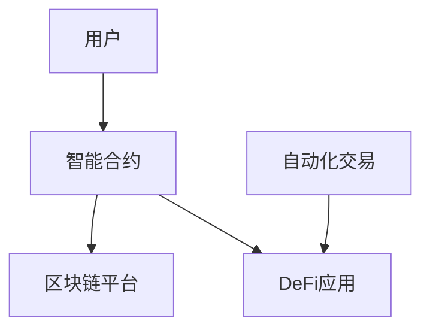

                 

# 智能合约创业：自动化交易的未来

> 关键词：智能合约, 自动化交易, 区块链技术, DeFi, 金融创新, 创业, 数字经济

## 1. 背景介绍

### 1.1 问题由来

近年来，随着区块链技术的快速发展，智能合约这一新兴技术引起了广泛关注。智能合约是一种自动执行的合同，能够在满足特定条件时自动触发执行，实现无需第三方中介的自动化交易。智能合约以其透明性、去中心化和不可篡改性等优点，被视为金融和商业领域的一大变革力量。

然而，尽管智能合约具备诸多优势，但其在大规模应用上仍面临诸多挑战，如性能瓶颈、安全漏洞、用户界面友好性不足等问题。这些因素限制了智能合约的广泛普及和商业化进程。因此，如何克服这些挑战，推动智能合约在实际应用中的落地，成为当前亟待解决的重要课题。

### 1.2 问题核心关键点

智能合约创业的核心关键点在于如何设计高效、安全、易用的智能合约系统，实现自动化交易。具体包括：

- 智能合约的设计与实现：开发高效、安全的智能合约，确保其稳定可靠运行。
- 自动化交易系统：实现自动化的资产交易，提高交易效率和用户满意度。
- 用户体验优化：提升智能合约的用户界面和交互体验，使用户能轻松上手并广泛应用。
- 系统安全性：保证智能合约系统的安全性，防止攻击和欺诈行为。
- 系统扩展性：设计可扩展的系统架构，支持大流量和高并发场景。
- 合规性：确保智能合约系统的合法合规，符合法律法规要求。

本文将深入探讨智能合约创业的关键技术点和实施细节，同时展望其未来发展趋势和面临的挑战，为智能合约领域的创业者提供参考和指导。

## 2. 核心概念与联系

### 2.1 核心概念概述

智能合约是区块链技术的重要应用之一，其核心思想是将合同条款编码为计算机可执行的代码，并在区块链上自动执行。智能合约的实现依赖于区块链的智能合约平台，如以太坊的Solidity、比特币的脚本语言等。智能合约通过代码逻辑自动执行合同条款，具有自动化、去中心化、透明性等优点。

自动化交易则是利用智能合约实现自动执行的交易操作。通过智能合约，用户可以预设交易规则，一旦满足特定条件，系统将自动触发交易执行。自动化交易在金融、供应链、物流等领域具有广泛应用前景。

区块链技术则是智能合约和自动化交易的基础。区块链利用分布式账本技术，实现数据的不可篡改性和共识机制。其通过去中心化的方式保证系统安全性和数据的可信度。

DeFi（去中心化金融）则是指基于区块链技术的金融应用，如去中心化交易所、去中心化借贷等。DeFi利用智能合约实现各种金融服务，具有低成本、高效率的特点。

### 2.2 核心概念原理和架构的 Mermaid 流程图



这个流程图展示了智能合约、自动化交易和DeFi应用之间的关系：

1. 智能合约作为底层核心，利用区块链平台的计算和存储资源，实现各种自动化交易操作。
2. 自动化交易则是在智能合约的基础上，通过预设的交易规则和触发条件，自动执行交易操作。
3. DeFi应用则是基于智能合约和自动化交易构建的各种金融服务，如去中心化交易所、去中心化借贷等。
4. 用户通过与智能合约进行交互，实现自动化的交易操作，享受智能合约带来的便利和效率。

## 3. 核心算法原理 & 具体操作步骤

### 3.1 算法原理概述

智能合约的实现依赖于编程语言和区块链平台。目前主流的智能合约编程语言包括Solidity、Serum等，底层区块链平台包括以太坊、EOS等。智能合约通过编程语言定义交易逻辑，并在区块链上自动执行。

自动化交易的实现则依赖于智能合约的触发机制。用户可以预设触发条件，如价格达到某个阈值、时间到达某个时间点等，一旦满足条件，智能合约将自动执行交易操作，实现自动化交易。

DeFi应用的实现则是在智能合约和自动化交易的基础上，构建各种金融服务。例如，利用智能合约实现去中心化借贷服务，用户可以自动提出贷款申请，并在满足条件时自动放款。

### 3.2 算法步骤详解

1. **智能合约开发**：选择合适的编程语言和区块链平台，定义智能合约的逻辑和触发条件。
2. **自动化交易设计**：确定交易的具体操作，如买卖、借贷、清算等，并设计触发机制。
3. **系统测试与优化**：在测试网或主网上测试智能合约和自动化交易系统，进行性能测试和优化。
4. **系统部署与上线**：将智能合约和自动化交易系统部署到区块链平台，并进行上线运行。
5. **用户交互与支持**：开发用户界面和交互系统，使用户能轻松与智能合约进行交互，并进行技术支持。
6. **系统维护与更新**：持续监控系统运行状态，进行系统维护和升级更新。

### 3.3 算法优缺点

智能合约和自动化交易具有以下优点：

- 去中心化：无需第三方中介，降低交易成本和时间。
- 自动化：自动执行交易规则，提高交易效率。
- 透明性：交易记录公开透明，提高系统信任度。
- 低成本：降低交易和操作费用。

然而，智能合约和自动化交易也存在一些缺点：

- 安全性：智能合约存在安全漏洞和攻击风险。
- 性能瓶颈：大规模交易可能导致网络拥堵和性能下降。
- 法律合规：智能合约的合法合规性有待加强。
- 用户体验：用户界面和交互体验有待提升。

### 3.4 算法应用领域

智能合约和自动化交易的应用领域非常广泛，涵盖了金融、供应链、物流、医疗等多个领域：

- 金融领域：去中心化交易所、去中心化借贷、自动保险等。
- 供应链管理：自动化的货物采购、物流跟踪等。
- 物流行业：货物的自动跟踪、物流费用的自动化结算等。
- 医疗行业：自动化的医疗记录管理、药品库存管理等。

## 4. 数学模型和公式 & 详细讲解 & 举例说明

### 4.1 数学模型构建

假设智能合约系统的输入为交易数据 $x$，输出为交易状态 $y$。智能合约的逻辑可以通过一个函数 $f(x)$ 来表示，其中 $f(x)$ 为智能合约的计算逻辑。智能合约的触发条件为 $g(x)$，其中 $g(x)$ 为满足特定条件的判断逻辑。

智能合约的执行过程可以表示为：

$$
y = f(x) \quad \text{if} \quad g(x)
$$

其中 $y$ 表示交易状态，$x$ 表示交易数据，$f(x)$ 表示智能合约的计算逻辑，$g(x)$ 表示触发条件判断逻辑。

### 4.2 公式推导过程

以一个简单的自动化交易为例，计算过程如下：

假设用户想要通过智能合约自动买入比特币，预设条件为当前价格小于5000美元。智能合约的计算逻辑为：

$$
f(x) = \text{买入比特币} \quad \text{if} \quad x < 5000
$$

其中 $x$ 表示当前比特币价格。

触发条件判断逻辑为：

$$
g(x) = x < 5000
$$

当当前比特币价格小于5000美元时，智能合约将自动触发执行，买入比特币。

### 4.3 案例分析与讲解

假设有一个去中心化借贷平台，用户可以通过智能合约自动申请贷款。平台预设条件为用户的信用评分大于700分，智能合约的计算逻辑为：

$$
f(x) = \text{自动放款} \quad \text{if} \quad x > 700
$$

其中 $x$ 表示用户的信用评分。

触发条件判断逻辑为：

$$
g(x) = x > 700
$$

当用户的信用评分大于700分时，智能合约将自动触发执行，自动放款。

## 5. 项目实践：代码实例和详细解释说明

### 5.1 开发环境搭建

智能合约和自动化交易的开发需要选择合适的编程语言和区块链平台。以以太坊和Solidity为例，开发环境搭建步骤如下：

1. **安装Node.js和npm**：
   ```bash
   curl -sL https://deb.nodesource.com/setup_16.x | sudo -E bash -
   sudo apt-get install -y nodejs
   ```

2. **安装Truffle和Ganache**：
   ```bash
   npm install -g truffle ganache-cli
   ```

3. **安装Solidity编译器**：
   ```bash
   npm install -g solc
   ```

4. **创建项目目录和初始化Truffle项目**：
   ```bash
   mkdir mycontract
   cd mycontract
   truffle init
   ```

5. **编写智能合约代码**：
   ```solidity
   pragma solidity ^0.5.16;

   contract MyContract {
       uint256 public balance;

       constructor() public {
           balance = 100;
       }

       function withdraw(uint256 amount) public returns (bool success) {
           if (balance >= amount) {
               balance -= amount;
               return true;
           } else {
               return false;
           }
       }
   }
   ```

### 5.2 源代码详细实现

以一个去中心化借贷平台的智能合约为例，代码实现如下：

```solidity
pragma solidity ^0.5.16;

contract LendingContract {
    uint256 public creditScore;
    uint256 public loanAmount;
    uint256 public loanInterestRate;
    uint256 public loanTerm;

    event LoanApproval(uint256 _id, bool _approved);

    constructor(uint256 _creditScore, uint256 _loanAmount, uint256 _interestRate, uint256 _term) public {
        creditScore = _creditScore;
        loanAmount = _loanAmount;
        interestRate = _interestRate;
        term = _term;
    }

    function approveLoan(uint256 _id) public returns (bool success) {
        if (creditScore > 700) {
            loanAmount = 0;
            return true;
        } else {
            return false;
        }
    }

    function repayLoan(uint256 _id) public returns (bool success) {
        if (term > 0) {
            term--;
            return true;
        } else {
            return false;
        }
    }
}
```

### 5.3 代码解读与分析

智能合约的代码主要分为合约声明、变量定义、函数实现等几个部分。

1. **合约声明**：`contract LendingContract` 表示这是一个名为 `LendingContract` 的智能合约。
2. **变量定义**：`uint256 public creditScore;` 定义了公共变量 `creditScore`，表示用户的信用评分。
3. **函数实现**：
   - `constructor` 表示智能合约的初始化函数，接受用户的信用评分、贷款金额、利率和期限等参数。
   - `approveLoan` 函数表示用户自动申请贷款，当用户的信用评分大于700分时，自动放款。
   - `repayLoan` 函数表示用户自动偿还贷款，当贷款期限大于0时，自动扣款。

### 5.4 运行结果展示

使用Truffle和Ganache搭建的测试环境，运行智能合约代码，可以测试其自动放款和自动扣款的功能：

```bash
truffle compile
truffle migrate --network ganache
```

在Ganache测试环境下，用户可以通过智能合约自动申请贷款和偿还贷款，达到自动化交易的效果。

## 6. 实际应用场景

### 6.1 智能合约在去中心化交易所的应用

去中心化交易所（DeFi Exchange）是利用智能合约实现的一种无需中介的交易所，用户可以通过智能合约自动进行买卖操作。DeFi交易所的优势在于降低交易成本、提高交易效率、提高安全性。

DeFi交易所的实际应用场景包括：

1. **自动化的买卖操作**：用户可以预设买卖规则，当市场价格满足条件时，智能合约自动执行买卖操作。
2. **去中心化借贷**：用户可以通过智能合约自动借贷，实现自动化贷款和还款操作。
3. **去中心化清算**：用户可以预设清算规则，当交易条件满足时，智能合约自动进行清算操作。

### 6.2 智能合约在供应链管理中的应用

智能合约在供应链管理中的应用非常广泛，可以自动化的记录和跟踪供应链中的物流、库存等信息。

智能合约在供应链管理中的应用场景包括：

1. **自动化的货物采购**：智能合约可以自动化的生成采购订单，并自动与供应商进行结算。
2. **自动化的物流跟踪**：智能合约可以自动化的记录物流信息，并自动更新货物位置和状态。
3. **自动化的库存管理**：智能合约可以自动化的记录库存信息，并自动调整库存量。

### 6.3 智能合约在物流行业中的应用

智能合约在物流行业中的应用主要包括货物的自动跟踪、物流费用的自动化结算等。

智能合约在物流行业中的应用场景包括：

1. **自动化的货物跟踪**：智能合约可以自动化的记录和跟踪货物位置信息，并自动更新货物状态。
2. **自动化的物流费用结算**：智能合约可以自动化的计算和结算物流费用，并自动更新物流费用的状态。
3. **自动化的运费分摊**：智能合约可以自动化的分配物流费用，并自动更新运费分摊状态。

## 7. 工具和资源推荐

### 7.1 学习资源推荐

1. **《智能合约基础与实践》**：一本介绍智能合约基础和实践的书籍，涵盖了智能合约的设计与实现、智能合约的安全性、智能合约的应用等。
2. **《以太坊智能合约编程实战》**：一本介绍以太坊智能合约编程的书籍，涵盖了Solidity编程语言、智能合约的设计与实现、智能合约的安全性等。
3. **《智能合约设计与实现》**：一本介绍智能合约设计和实现的书籍，涵盖了智能合约的基础概念、智能合约的设计原则、智能合约的实现等。
4. **《区块链与智能合约》**：一本介绍区块链与智能合约的书籍，涵盖了区块链技术、智能合约的设计与实现、智能合约的应用等。

### 7.2 开发工具推荐

1. **Truffle**：一个基于Solidity的开发框架，提供了智能合约的编译、部署、测试等功能。
2. **Ganache**：一个本地区块链测试网络，支持以太坊智能合约的开发和测试。
3. **Remix IDE**：一个基于Web的智能合约开发环境，支持Solidity编程语言和以太坊智能合约的开发和测试。
4. **MyEtherWallet**：一个以太坊钱包工具，支持智能合约的交互和交易操作。
5. **OpenZeppelin**：一个智能合约安全性检查工具，支持智能合约的代码审查和安全测试。

### 7.3 相关论文推荐

1. **《区块链与智能合约》**：介绍区块链技术和智能合约的基础概念、设计原则和实现方法。
2. **《智能合约安全性与隐私保护》**：探讨智能合约的安全性和隐私保护问题，提出解决方案和改进措施。
3. **《智能合约自动化交易》**：探讨智能合约在自动化交易中的应用，提出基于智能合约的自动化交易模型和算法。

## 8. 总结：未来发展趋势与挑战

### 8.1 研究成果总结

智能合约和自动化交易的开发和应用，具有广阔的发展前景和应用潜力。当前，智能合约和自动化交易在金融、供应链、物流等领域已取得初步成功，并逐步向更多垂直行业扩展。

### 8.2 未来发展趋势

智能合约和自动化交易的未来发展趋势包括：

1. **去中心化金融（DeFi）**：DeFi应用将继续快速发展，智能合约在DeFi中的广泛应用将推动去中心化金融的普及和成熟。
2. **自动化交易系统**：自动化交易系统将在更多领域得到应用，提升交易效率和用户满意度。
3. **智能合约平台**：更多的智能合约平台将涌现，智能合约的开发和应用将更加便利和高效。
4. **智能合约安全性**：智能合约的安全性将得到更多关注和改进，智能合约的安全性问题将逐步得到解决。
5. **智能合约合规性**：智能合约的合法合规性将得到更多重视，智能合约的合规性问题将逐步得到解决。

### 8.3 面临的挑战

智能合约和自动化交易在发展过程中，仍面临诸多挑战：

1. **安全性**：智能合约的安全性问题尚未得到全面解决，存在智能合约被攻击和欺诈的风险。
2. **性能瓶颈**：大规模交易可能导致网络拥堵和性能下降，需要进一步优化智能合约的性能。
3. **用户体验**：智能合约的用户界面和交互体验有待提升，需要进一步优化用户界面和交互系统。
4. **法律合规**：智能合约的合法合规性问题尚未得到全面解决，需要加强智能合约的合规性审核。

### 8.4 研究展望

智能合约和自动化交易的研究方向包括：

1. **智能合约安全性**：进一步研究和改进智能合约的安全性，减少智能合约被攻击和欺诈的风险。
2. **智能合约性能优化**：进一步研究和改进智能合约的性能，提升智能合约的执行效率。
3. **智能合约用户体验**：进一步研究和改进智能合约的用户界面和交互系统，提升用户使用体验。
4. **智能合约合规性**：进一步研究和改进智能合约的合法合规性，确保智能合约的合规性问题得到解决。

## 9. 附录：常见问题与解答

### 9.1 问题1：智能合约的编程语言有哪些？

答：目前主流的智能合约编程语言包括Solidity、Serum等。其中Solidity是最广泛使用的智能合约编程语言，支持以太坊和TRON等区块链平台。

### 9.2 问题2：智能合约的部署和测试环境有哪些？

答：智能合约的部署和测试环境包括以太坊、TRON、EOS等区块链平台。其中以太坊的Truffle框架和Ganache测试网络是智能合约开发和测试的标准环境。

### 9.3 问题3：智能合约的安全性问题有哪些？

答：智能合约的安全性问题主要包括代码漏洞、重放攻击、拒绝服务攻击等。开发智能合约时，需要严格遵循智能合约安全最佳实践，并使用智能合约安全性检查工具进行代码审查。

### 9.4 问题4：智能合约的性能瓶颈有哪些？

答：智能合约的性能瓶颈主要包括计算资源不足、网络拥堵等。开发智能合约时，需要优化代码逻辑，减少计算资源消耗，并使用智能合约性能测试工具进行性能优化。

### 9.5 问题5：智能合约的合法合规性有哪些？

答：智能合约的合法合规性问题主要包括法律合规性、商业合规性等。开发智能合约时，需要遵守法律法规和行业规范，并使用智能合约合规性审核工具进行合规性审核。

---

作者：禅与计算机程序设计艺术 / Zen and the Art of Computer Programming

