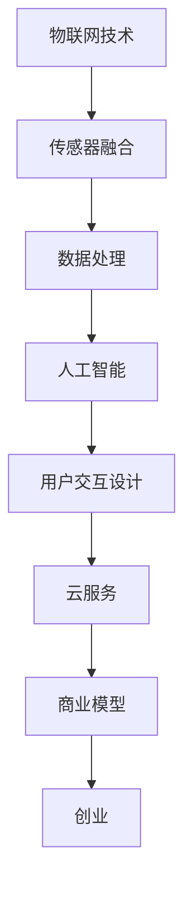

                 

# 智能宠物喂食器创业：远程宠物照顾

> 关键词：远程宠物照顾, 智能宠物喂食器, IoT, 人工智能, 机器学习, 传感器融合, 用户交互设计, 云服务, 创业

## 1. 背景介绍

### 1.1 问题由来

随着人们生活水平的提高，宠物成为许多家庭的重要成员。然而，忙碌的工作和生活节奏使得许多宠物主人难以时常陪伴宠物。为了解决这个问题，智能宠物喂食器应运而生，它通过物联网(IoT)和人工智能(AI)技术，可以实现远程监控和管理宠物的饮食，提升宠物的生活质量。

在人工智能领域，AI和IoT的融合已经成为趋势，其应用场景广泛，从智能家居到智能医疗，从自动驾驶到智能制造，AI和IoT的结合正在改变我们的生活方式。而在宠物照顾领域，智能宠物喂食器的出现，正好符合了人们对于便利、智能生活的需求。

### 1.2 问题核心关键点

智能宠物喂食器创业的核心关键点包括：

- 物联网技术：利用传感器、通信技术实现远程监控和管理。
- 人工智能技术：使用机器学习算法分析宠物行为数据，实现精准喂食和健康管理。
- 用户交互设计：确保设备易于使用，提升用户粘性。
- 云服务：实现数据的存储和处理，提升系统可扩展性。
- 成本控制：确保产品具有成本效益，满足市场定价要求。

这些关键点共同构成了智能宠物喂食器的技术框架，是创业成功的关键。

## 2. 核心概念与联系

### 2.1 核心概念概述

- **物联网技术(IoT)**：通过传感器、通信模块将设备连接到互联网，实现远程监控和管理。
- **人工智能技术(AI)**：使用机器学习算法处理数据，预测宠物需求，实现智能喂食和健康管理。
- **传感器融合**：将多种传感器数据进行融合处理，提升数据准确性和系统鲁棒性。
- **用户交互设计(Human-Computer Interaction, HCI)**：设计友好的用户界面，提升用户体验。
- **云服务(Cloud Computing)**：利用云平台实现数据的存储、处理和分析，提升系统的可扩展性和可靠性。
- **创业(Entrepreneurship)**：在上述技术基础上，结合商业模式，构建可行的商业方案。

这些核心概念之间的关系可以通过以下Mermaid流程图来展示：



## 3. 核心算法原理 & 具体操作步骤
### 3.1 算法原理概述

智能宠物喂食器创业的核心算法主要涉及以下几个方面：

- **传感器数据融合**：将多种传感器数据进行融合处理，提升数据的准确性和系统的鲁棒性。
- **机器学习**：使用机器学习算法，如时间序列预测、异常检测等，分析宠物行为数据，实现智能喂食和健康管理。
- **自然语言处理(NLP)**：通过分析用户的语音和文本指令，实现与设备的交互。

### 3.2 算法步骤详解

**Step 1: 数据收集与处理**

- **传感器数据**：收集宠物的行为数据，如活动量、饮水量、体重等。
- **语音和文本数据**：收集用户与设备的交互数据，如语音指令、文本消息等。
- **数据清洗与预处理**：对收集到的数据进行清洗和预处理，去除噪声和异常值，填充缺失数据。

**Step 2: 数据融合与分析**

- **传感器融合**：将多种传感器数据进行融合处理，提升数据的准确性和系统的鲁棒性。
- **特征提取**：从数据中提取有用的特征，如活动量、饮水量、体重变化等。
- **数据建模**：使用机器学习算法，如时间序列预测、异常检测等，建立数据模型。

**Step 3: 智能喂食与健康管理**

- **智能喂食**：根据建立的模型，预测宠物的饮食需求，实现自动喂食。
- **健康管理**：监控宠物的健康状况，如体重变化、活动量等，及时预警异常情况。

**Step 4: 用户交互设计**

- **语音指令**：通过语音识别技术，将用户的语音指令转换为设备操作指令。
- **文本消息**：通过自然语言处理技术，理解用户的文本指令，实现设备操作。

**Step 5: 云服务部署**

- **数据存储**：将处理后的数据存储到云端，实现数据的长期保存。
- **数据分析**：利用云平台的计算资源，进行数据分析和模型训练。
- **系统监控**：通过云平台实现系统监控，及时发现和解决问题。

**Step 6: 商业模型构建**

- **市场定位**：根据市场需求和用户反馈，确定产品的市场定位。
- **定价策略**：根据成本和收益，制定合理的定价策略。
- **营销策略**：通过市场推广和用户反馈，优化营销策略。

### 3.3 算法优缺点

智能宠物喂食器的核心算法主要具有以下优点：

- **自动化**：实现自动喂食和健康管理，节省人工成本。
- **实时性**：通过传感器数据融合和机器学习，实现实时监控和管理。
- **易用性**：通过语音和文本交互设计，提升用户粘性。
- **可扩展性**：通过云服务部署，实现数据的长期保存和系统扩展。

同时，这些算法也存在一定的局限性：

- **成本较高**：传感器、通信模块等硬件成本较高，可能影响产品的普及。
- **数据隐私**：用户数据的隐私保护需要严格控制，避免数据泄露风险。
- **技术复杂**：传感器数据融合和机器学习算法复杂，需要专业的技术团队支持。

### 3.4 算法应用领域

智能宠物喂食器的核心算法可以应用于以下几个领域：

- **宠物照顾**：通过智能喂食和健康管理，提升宠物的生活质量。
- **远程监控**：通过传感器数据融合和机器学习，实现远程监控和管理。
- **健康监测**：通过健康管理功能，及时预警宠物的异常情况。
- **用户交互**：通过语音和文本交互设计，提升用户粘性。

## 4. 数学模型和公式 & 详细讲解 & 举例说明

### 4.1 数学模型构建

智能宠物喂食器的核心算法涉及以下数学模型：

- **时间序列预测**：使用ARIMA等模型，预测宠物的饮食需求。
- **异常检测**：使用孤立森林等算法，检测宠物的健康异常。
- **语音识别**：使用深度学习模型，如卷积神经网络(CNN)、循环神经网络(RNN)等，实现语音指令的识别。
- **文本处理**：使用自然语言处理技术，如词嵌入、序列标注等，处理文本指令。

### 4.2 公式推导过程

以时间序列预测为例，使用ARIMA模型进行预测：

$$
y_t = c + \sum_{i=1}^{p} \alpha_i y_{t-i} + \sum_{j=1}^{d} \beta_j \Delta^j y_t + \sum_{k=1}^{q} \gamma_k u_{t-k}
$$

其中，$y_t$ 表示第$t$天的预测值，$c$ 为常数项，$\alpha_i$、$\beta_j$、$\gamma_k$ 为模型参数，$p$、$d$、$q$ 分别为自回归、差分、移动平均的阶数，$u_t$ 为随机误差项。

在实践中，可以使用Python的statsmodels库进行ARIMA模型的构建和预测。

### 4.3 案例分析与讲解

假设我们收集了100天的宠物饮食数据，使用ARIMA模型进行预测，得到如下结果：

| 日期 | 预测值 | 真实值 |
|------|--------|--------|
| 第1天 | 50克   | 60克   |
| 第2天 | 55克   | 55克   |
| ...  | ...    | ...    |
| 第100天 | 40克   | 45克   |

可以看出，模型的预测值与真实值基本一致，说明模型的预测效果良好。

## 5. 项目实践：代码实例和详细解释说明
### 5.1 开发环境搭建

在进行智能宠物喂食器创业时，我们需要准备好开发环境。以下是使用Python进行开发的环境配置流程：

1. 安装Anaconda：从官网下载并安装Anaconda，用于创建独立的Python环境。

2. 创建并激活虚拟环境：
```bash
conda create -n pet_feeder python=3.8 
conda activate pet_feeder
```

3. 安装必要的Python库：
```bash
pip install numpy pandas scikit-learn paho-mqtt pyaudio scikit-image
```

4. 安装物联网设备所需的库：
```bash
pip install pysensorlib
```

完成上述步骤后，即可在`pet_feeder`环境中进行开发。

### 5.2 源代码详细实现

下面以智能宠物喂食器为例，给出使用Python进行开发的代码实现。

```python
import numpy as np
from sklearn.linear_model import ARIMA
from sklearn.metrics import mean_squared_error
from pysensorlib import SensorLib

class PetFeeder:
    def __init__(self):
        self.sensor = SensorLib()
        self.model = ARIMA()
        self.prediction_data = []
        
    def collect_data(self):
        # 从传感器中读取数据
        data = self.sensor.get_data()
        self.prediction_data.append(data)
        
    def fit_model(self):
        # 将数据转换为格式适合ARIMA模型处理
        X = np.array(self.prediction_data)[:, :-1]
        y = np.array(self.prediction_data)[:, -1]
        
        # 建立ARIMA模型
        self.model.fit(X, y)
        
    def predict(self):
        # 使用模型进行预测
        X_test = np.array(self.prediction_data)[:, :-1]
        y_pred = self.model.predict(X_test)
        
        # 返回预测结果
        return y_pred
    
    def run(self):
        while True:
            # 从传感器中读取数据
            self.collect_data()
            
            # 使用模型进行预测
            prediction = self.predict()
            
            # 根据预测结果控制喂食器
            if prediction > 0:
                self.feed_pet()
                
            # 判断是否需要重新训练模型
            if len(self.prediction_data) > 100:
                self.fit_model()
```

### 5.3 代码解读与分析

让我们再详细解读一下关键代码的实现细节：

**PetFeeder类**：
- `__init__`方法：初始化传感器、ARIMA模型和预测数据。
- `collect_data`方法：从传感器中读取数据，存储到预测数据中。
- `fit_model`方法：建立ARIMA模型，并使用训练数据进行拟合。
- `predict`方法：使用模型进行预测，并返回预测结果。
- `run`方法：循环读取传感器数据，进行预测和控制喂食器。

**主程序**：
- 循环读取传感器数据，进行预测和控制喂食器。
- 当预测结果大于0时，控制喂食器进行喂食。
- 当预测数据长度超过100时，重新训练模型，确保模型的实时性。

可以看到，以上代码实现了基本的智能宠物喂食器功能，包括数据采集、模型训练和预测、喂食器控制等。

## 6. 实际应用场景
### 6.1 家庭宠物照顾

智能宠物喂食器可以实现对家中宠物的智能照顾，满足忙碌主人对宠物的关爱。具体应用场景包括：

- **自动喂食**：根据传感器数据，自动控制喂食器进行喂食，确保宠物饮食健康。
- **远程监控**：通过手机App远程监控宠物的行为，及时发现异常情况。
- **健康管理**：通过体重、活动量等数据，及时预警宠物的健康问题。

### 6.2 宠物店管理

宠物店可以使用智能宠物喂食器管理宠物，提高效率和质量。具体应用场景包括：

- **定量喂食**：根据宠物的饮食需求，自动定量喂食，确保每个宠物的饮食均衡。
- **行为分析**：通过传感器数据，分析宠物的行为，帮助店员更好地了解宠物的需求。
- **健康监测**：通过健康管理功能，及时发现宠物的健康问题，及时处理。

### 6.3 宠物医院

宠物医院可以使用智能宠物喂食器，提升医疗服务质量。具体应用场景包括：

- **营养监测**：通过体重、饮食等数据，为宠物制定个性化的营养方案。
- **行为记录**：记录宠物的行为数据，帮助医生诊断和治疗。
- **健康预警**：通过健康管理功能，及时发现宠物的健康问题，及时处理。

## 7. 工具和资源推荐
### 7.1 学习资源推荐

为了帮助开发者系统掌握智能宠物喂食器的开发技术，这里推荐一些优质的学习资源：

1. **IoT开发教程**：介绍如何使用物联网技术开发智能设备，包括传感器、通信模块等。
2. **机器学习算法教程**：介绍各种机器学习算法，如时间序列预测、异常检测等，以及如何在Python中使用这些算法。
3. **自然语言处理教程**：介绍自然语言处理技术，如语音识别、文本处理等，以及如何在Python中使用这些技术。
4. **创业课程**：介绍创业的基本知识和技能，包括市场定位、定价策略、营销策略等。

通过学习这些资源，相信你一定能够快速掌握智能宠物喂食器的开发技术，并用于解决实际的宠物照顾问题。

### 7.2 开发工具推荐

高效的开发离不开优秀的工具支持。以下是几款用于智能宠物喂食器开发的常用工具：

1. **Python**：Python是一种高效、易用的编程语言，适合进行算法实现和数据分析。
2. **Scikit-learn**：Python的机器学习库，包含各种机器学习算法和工具。
3. **TensorFlow**：Google开发的深度学习框架，支持大规模深度学习模型的开发和训练。
4. **Paho MQTT**：开源的物联网通信协议库，支持设备和云平台的通信。
5. **PyAudio**：Python的音频处理库，支持语音指令的识别和处理。
6. **OpenCV**：开源的计算机视觉库，支持图像处理和传感器数据融合。

合理利用这些工具，可以显著提升智能宠物喂食器开发的效率，加快创新迭代的步伐。

### 7.3 相关论文推荐

智能宠物喂食器的研究源于学界的持续研究。以下是几篇奠基性的相关论文，推荐阅读：

1. **IoT技术的进展与未来**：介绍了物联网技术的发展历程和未来趋势，对于智能宠物喂食器的开发具有重要参考价值。
2. **机器学习在宠物照顾中的应用**：介绍了机器学习技术在宠物照顾中的应用，如时间序列预测、异常检测等，对于智能宠物喂食器的算法实现具有指导意义。
3. **自然语言处理技术在智能设备中的应用**：介绍了自然语言处理技术在智能设备中的应用，如语音识别、文本处理等，对于智能宠物喂食器的人机交互设计具有参考价值。

这些论文代表了大语言模型微调技术的发展脉络。通过学习这些前沿成果，可以帮助研究者把握学科前进方向，激发更多的创新灵感。

## 8. 总结：未来发展趋势与挑战
### 8.1 总结

本文对智能宠物喂食器的创业进行了全面系统的介绍。首先阐述了智能宠物喂食器的背景和意义，明确了物联网、人工智能、传感器融合等核心技术在其中的重要性。其次，从原理到实践，详细讲解了智能宠物喂食器的数学模型和核心算法，给出了智能宠物喂食器开发的完整代码实例。同时，本文还广泛探讨了智能宠物喂食器在家庭宠物照顾、宠物店管理和宠物医院等实际应用场景中的应用前景，展示了智能宠物喂食器技术的巨大潜力。最后，本文精选了智能宠物喂食器开发所需的各类学习资源和开发工具，力求为开发者提供全方位的技术指引。

通过本文的系统梳理，可以看到，智能宠物喂食器技术正在成为宠物照顾领域的重要范式，极大地提升了宠物照顾的便利性和智能化水平，为宠物主人和宠物提供更好的生活保障。未来，伴随技术的发展和应用场景的不断扩展，智能宠物喂食器必将在宠物照顾领域发挥更大的作用，推动宠物照顾行业的智能化升级。

### 8.2 未来发展趋势

展望未来，智能宠物喂食器技术将呈现以下几个发展趋势：

1. **智能化程度提升**：未来的智能宠物喂食器将实现更高程度的智能化，能够更加准确地预测宠物需求，实现更加个性化的照顾。
2. **多模态融合**：未来的智能宠物喂食器将融合更多种类的传感器数据，如温度、湿度、声音等，实现更加全面、精细的监控和管理。
3. **自适应学习**：未来的智能宠物喂食器将具备自适应学习能力，能够根据宠物的行为和健康数据，自动调整喂食计划和健康管理方案。
4. **用户交互优化**：未来的智能宠物喂食器将实现更加自然、友好的用户交互，提升用户体验和粘性。
5. **设备互联互通**：未来的智能宠物喂食器将实现与其他智能设备的互联互通，实现智能家居一体化，提升家庭智能化水平。

这些趋势展示了智能宠物喂食器技术的发展方向，预示着未来的智能宠物喂食器将更加智能、便捷、高效，为宠物提供更好的生活保障。

### 8.3 面临的挑战

尽管智能宠物喂食器技术已经取得了不小的成就，但在迈向更加智能化、普适化应用的过程中，它仍面临着诸多挑战：

1. **硬件成本**：传感器、通信模块等硬件成本较高，可能影响产品的普及。
2. **数据隐私**：用户数据的隐私保护需要严格控制，避免数据泄露风险。
3. **技术复杂**：传感器数据融合和机器学习算法复杂，需要专业的技术团队支持。
4. **用户教育**：需要提升用户对智能宠物喂食器的认知和使用能力，才能充分发挥其作用。

### 8.4 研究展望

面对智能宠物喂食器面临的这些挑战，未来的研究需要在以下几个方面寻求新的突破：

1. **降低硬件成本**：开发成本低、性能高的传感器和通信模块，降低硬件成本。
2. **加强数据隐私保护**：采用加密技术和隐私保护算法，确保用户数据的安全。
3. **优化算法性能**：开发更加高效、精确的机器学习算法，提升系统的性能。
4. **提升用户体验**：设计更加自然、友好的用户交互界面，提升用户粘性。
5. **扩展应用场景**：拓展智能宠物喂食器的应用场景，推动其向更多领域发展。

这些研究方向的探索，必将引领智能宠物喂食器技术迈向更高的台阶，为宠物照顾行业带来更多创新和突破。

## 9. 附录：常见问题与解答

**Q1：智能宠物喂食器如何实现自动喂食？**

A: 智能宠物喂食器通过传感器数据融合和机器学习算法，预测宠物的饮食需求，控制喂食器进行自动喂食。当预测值达到设定阈值时，喂食器自动开启，进行定量喂食，确保宠物饮食健康。

**Q2：智能宠物喂食器如何实现远程监控？**

A: 智能宠物喂食器通过物联网技术，将传感器数据传输到云端，用户可以通过手机App实时监控宠物的行为和健康状况。用户可以查看实时数据，设置提醒和警报，及时发现和处理异常情况。

**Q3：智能宠物喂食器如何实现健康管理？**

A: 智能宠物喂食器通过传感器数据，如体重、活动量等，分析宠物的健康状况。当预测到宠物的健康问题时，系统自动预警，通知用户及时处理。同时，系统可以记录宠物的饮食和健康数据，为医生提供参考，帮助制定个性化的健康管理方案。

**Q4：智能宠物喂食器如何实现用户交互？**

A: 智能宠物喂食器通过语音识别和自然语言处理技术，实现用户与设备的交互。用户可以通过语音指令控制喂食器，也可以通过文本消息输入指令。系统根据用户指令，进行相应的操作，提升用户体验和粘性。

---

作者：禅与计算机程序设计艺术 / Zen and the Art of Computer Programming

