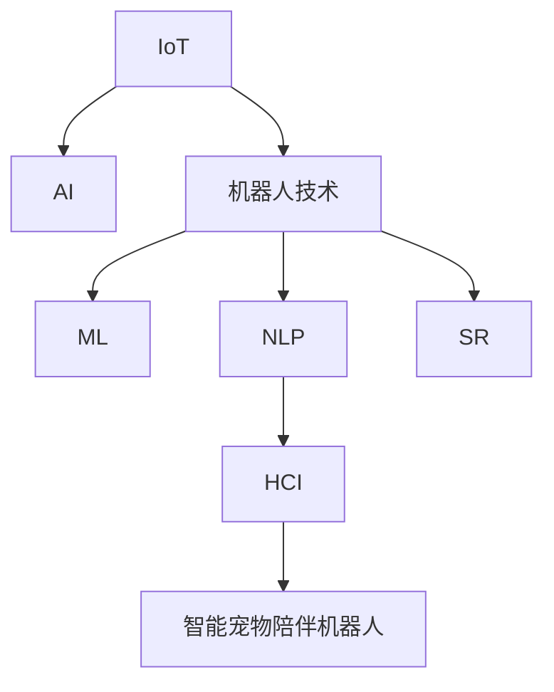

                 

# 智能宠物陪伴机器人创业：科技宠物的新定义

> 关键词：智能宠物陪伴机器人,创业,科技宠物,用户需求,技术架构,市场分析

## 1. 背景介绍

### 1.1 问题由来
随着社会的快速发展，人们的生活节奏日益加快，宠物陪伴成为了越来越多人缓解压力、提升幸福感的重要方式。但现实情况是，繁忙的工作和紧张的生活节奏使得很多人难以腾出时间陪伴自己的宠物。传统宠物饲养方式面临诸多挑战，如宠物孤独、无法及时发现宠物健康状况、训练难度大等。在这一背景下，智能宠物陪伴机器人应运而生，有望解决这些问题，提供更科学、高效、人性化的宠物养护方案。

### 1.2 问题核心关键点
智能宠物陪伴机器人作为一种新兴的科技宠物产品，结合了物联网、人工智能、机器人技术等多种前沿技术，旨在通过智能硬件和软件系统，为宠物提供全方位的智能化陪伴和护理服务。核心关键点包括：
- 硬件设计：包括宠物机器人本体、传感器、机械臂等核心部件，保证机器人在宠物身边能稳定运行、安全互动。
- 软件系统：包括机器人操作系统、AI算法、交互界面等模块，实现宠物行为识别、环境感知、智能决策等功能。
- 用户需求：了解并满足不同类型宠物主人的多样化需求，如喂食、清洁、陪伴、健康监测等。
- 市场定位：精准把握市场需求，细分目标用户群体，差异化营销策略。
- 商业模式：明确盈利模式，包括硬件销售、服务订阅、广告收入等，实现可持续发展。

## 2. 核心概念与联系

### 2.1 核心概念概述

为了更好地理解智能宠物陪伴机器人的工作原理和优化方向，本节将介绍几个密切相关的核心概念：

- 物联网(IoT)：一种通过互联网连接各类物品、设备、传感器的网络，实现设备间的互联互通。
- 人工智能(AI)：一种使计算机模拟人类智能行为的技术，包括感知、学习、推理、决策等能力。
- 机器人技术：结合机械设计、自动化控制、计算机技术等，实现自主运行的智能机器。
- 机器学习(ML)：一种数据驱动的算法，使机器通过学习数据自动优化模型。
- 自然语言处理(NLP)：使计算机能理解、处理人类自然语言的技术。
- 语音识别(SR)：使计算机能识别并处理语音信息的技术。
- 人机交互(HCI)：实现人与机器之间的自然、高效交互的技术。

这些核心概念之间的逻辑关系可以通过以下Mermaid流程图来展示：



这个流程图展示出智能宠物陪伴机器人的核心概念及其之间的关系：

1. IoT为机器人提供了数据采集和交互的基础。
2. AI使机器人具备感知、学习、推理、决策等智能能力。
3. ML使得机器人能够自动优化自身行为，提升用户体验。
4. NLP和SR使机器人能理解和生成自然语言，增强人机交互。
5. HCI实现自然、高效的人机交互，提升用户体验。
6. 这些技术结合后，便能构成智能宠物陪伴机器人，为宠物提供全面的陪伴和护理服务。

## 3. 核心算法原理 & 具体操作步骤
### 3.1 算法原理概述

智能宠物陪伴机器人结合了多种前沿技术，其核心算法原理主要包括以下几个方面：

- 传感器数据融合：通过集成多种传感器（如红外、摄像头、麦克风等），采集宠物行为、环境数据，并进行数据融合处理，获得更加全面、准确的感知信息。
- 行为识别：利用机器学习算法，对采集到的传感器数据进行分析，识别宠物的行走、喂食、睡眠等行为模式。
- 决策规划：基于感知信息和行为识别结果，制定智能决策和行动规划，实现对宠物的精确护理。
- 智能交互：结合自然语言处理和语音识别技术，实现与宠物主人的自然、高效交互。

### 3.2 算法步骤详解

智能宠物陪伴机器人的核心算法步骤包括以下几个关键环节：

**Step 1: 数据采集与预处理**
- 利用传感器阵列采集宠物的行为、环境数据，并进行降噪、滤波等预处理操作。
- 通过摄像头捕捉宠物的实时图像信息，并进行目标检测、人脸识别等预处理操作。

**Step 2: 行为识别**
- 利用机器学习算法（如卷积神经网络、支持向量机等）对传感器数据进行特征提取和分类。
- 通过行为分类器对采集到的数据进行行为识别，判断宠物的行走、喂食、睡眠等行为模式。

**Step 3: 决策规划**
- 基于行为识别结果，制定智能决策和行动规划。
- 利用优化算法（如A*、Q学习等）进行路径规划，实现机械臂的精准操作。

**Step 4: 智能交互**
- 通过语音识别技术，理解宠物主人或宠物的语音指令，并进行自然语言处理。
- 结合自然语言生成技术，生成回复语音或文本信息，实现与宠物主人的交互。

**Step 5: 行为响应与反馈**
- 根据决策规划结果，控制机械臂执行喂食、清洁、陪伴等操作。
- 实时采集操作结果，进行评估和反馈，调整决策和行为。

### 3.3 算法优缺点

智能宠物陪伴机器人结合了多种前沿技术，具有以下优点：
1. 全面感知：通过集成多种传感器，能够实时采集全面的感知数据，提供准确的宠物状态信息。
2. 智能决策：结合机器学习和优化算法，能够自动制定智能决策，实现精确的护理操作。
3. 自然交互：利用自然语言处理和语音识别技术，实现与宠物主人和宠物的自然、高效交互。
4. 个性化护理：通过学习不同宠物的行为模式，提供个性化的护理方案。

同时，该算法也存在一定的局限性：
1. 硬件成本高：传感器和机械臂等硬件设备价格较高，增加了产品成本。
2. 模型复杂：多传感器数据的融合和行为识别模型较为复杂，需要较高的计算资源。
3. 用户隐私：传感器数据采集和处理可能涉及用户隐私，需要严格的隐私保护措施。
4. 系统鲁棒性：传感器数据可能受环境干扰，导致行为识别和决策的准确性下降。

尽管存在这些局限性，但智能宠物陪伴机器人作为科技宠物的创新应用，已经取得了诸多突破，其技术优势也日益显现。

### 3.4 算法应用领域

智能宠物陪伴机器人的核心算法已经在以下几个领域得到了广泛应用：

- 宠物行为监测：通过传感器数据融合和行为识别技术，实时监测宠物行为，预警宠物异常状态。
- 宠物健康管理：通过数据分析和机器学习，预测宠物健康状况，提供科学的营养和管理方案。
- 宠物互动陪伴：利用自然语言处理和语音识别技术，实现与宠物主人和宠物的自然交流，提升陪伴体验。
- 智能喂食和清洁：通过机械臂和传感器，实现精准喂食和宠物卫生清洁，减少人工劳动。
- 智能玩具和训练：结合行为识别和决策规划，提供智能化的宠物玩具和训练方案。

除了上述这些经典应用外，智能宠物陪伴机器人还被创新性地应用到更多场景中，如智能环境控制、安全报警等，为宠物养护提供了全新的解决方案。

## 4. 数学模型和公式 & 详细讲解 & 举例说明
### 4.1 数学模型构建

本节将使用数学语言对智能宠物陪伴机器人的核心算法进行更加严格的刻画。

记传感器数据为 $\mathbf{X}$，行为识别模型为 $M_{\theta}$，决策规划模型为 $D_{\phi}$，智能交互模型为 $I_{\lambda}$。则智能宠物陪伴机器人的核心算法可以表示为：

$$
\begin{aligned}
\hat{X} &= F_{\mathbf{X}}(\mathbf{X}) \\
\hat{B} &= M_{\theta}(\hat{X}) \\
\hat{A} &= D_{\phi}(\hat{B}) \\
\hat{I} &= I_{\lambda}(\hat{A})
\end{aligned}
$$

其中，$F_{\mathbf{X}}$ 表示传感器数据预处理，$M_{\theta}$ 表示行为识别模型，$D_{\phi}$ 表示决策规划模型，$I_{\lambda}$ 表示智能交互模型。

### 4.2 公式推导过程

以下我们以行为识别模型 $M_{\theta}$ 为例，推导其数学模型。

假设传感器数据 $\mathbf{X} = (x_1, x_2, \dots, x_n)$，行为识别模型 $M_{\theta} = [M_{\theta_1}, M_{\theta_2}, \dots, M_{\theta_k}]$，其中 $M_{\theta_i}$ 表示第 $i$ 个行为分类器，每个分类器的输出表示为 $\hat{b}_i$。则行为识别模型可表示为：

$$
M_{\theta}(\mathbf{X}) = [M_{\theta_1}(x_1), M_{\theta_2}(x_2), \dots, M_{\theta_k}(x_k)]
$$

通过交叉熵损失函数，可以定义行为识别模型的损失函数为：

$$
\mathcal{L}(\theta) = -\frac{1}{N} \sum_{i=1}^N \sum_{j=1}^k l_i(\hat{b}_i, y_i)
$$

其中 $y_i$ 表示第 $i$ 个样本的真实行为标签，$l_i$ 表示交叉熵损失函数。通过反向传播算法，可以更新模型参数 $\theta$，最小化损失函数 $\mathcal{L}(\theta)$，使得模型输出逼近真实标签。

### 4.3 案例分析与讲解

假设传感器数据 $\mathbf{X}$ 为宠物行走的行为数据，行为识别模型 $M_{\theta}$ 包括两个分类器：$M_{\theta_1}$ 用于判断宠物是否在行走，$M_{\theta_2}$ 用于判断宠物行走的方向。

对于每个传感器数据点 $x_i$，行为识别模型 $M_{\theta}$ 的输出为：

$$
M_{\theta}(x_i) = [M_{\theta_1}(x_i), M_{\theta_2}(x_i)]
$$

假设 $M_{\theta_1}$ 和 $M_{\theta_2}$ 的输出分别为 $\hat{b}_1$ 和 $\hat{b}_2$，则行为识别模型的输出为：

$$
M_{\theta}(\mathbf{X}) = [\hat{b}_1, \hat{b}_2]
$$

通过交叉熵损失函数，可以定义行为识别模型的损失函数为：

$$
\mathcal{L}(\theta) = -\frac{1}{N} \sum_{i=1}^N \left[l_1(\hat{b}_1, y_1) + l_2(\hat{b}_2, y_2)\right]
$$

其中 $y_1$ 和 $y_2$ 分别表示宠物是否行走和行走的方向。通过反向传播算法，可以更新模型参数 $\theta$，最小化损失函数 $\mathcal{L}(\theta)$，使得模型输出逼近真实标签。

## 5. 项目实践：代码实例和详细解释说明
### 5.1 开发环境搭建

在进行智能宠物陪伴机器人开发前，我们需要准备好开发环境。以下是使用Python进行PyTorch开发的环境配置流程：

1. 安装Anaconda：从官网下载并安装Anaconda，用于创建独立的Python环境。

2. 创建并激活虚拟环境：
```bash
conda create -n pet_ai_env python=3.8 
conda activate pet_ai_env
```

3. 安装PyTorch：根据CUDA版本，从官网获取对应的安装命令。例如：
```bash
conda install pytorch torchvision torchaudio cudatoolkit=11.1 -c pytorch -c conda-forge
```

4. 安装TensorFlow：如果需要进行混合深度学习，可以安装TensorFlow。
```bash
pip install tensorflow
```

5. 安装OpenCV：用于处理图像数据。
```bash
pip install opencv-python
```

6. 安装其他必要的库：
```bash
pip install numpy pandas sklearn sklearn-umfpack pyserial
```

完成上述步骤后，即可在`pet_ai_env`环境中开始智能宠物陪伴机器人开发。

### 5.2 源代码详细实现

下面我们以智能喂食系统为例，给出使用PyTorch进行智能宠物陪伴机器人的代码实现。

首先，定义传感器数据处理函数：

```python
import numpy as np
from sklearn.umfpack import UMFARowSparse
from pyserial import Serial

class SensorData:
    def __init__(self, port, baudrate=9600):
        self.serial = Serial(port, baudrate=baudrate)
        self.data = []
        
    def read(self, num):
        data = self.serial.read(num)
        return data
    
    def preprocess(self, data):
        # 数据预处理，如降噪、滤波等
        pass
    
    def fusion(self):
        # 数据融合，如集成多传感器数据
        pass
        
    def encode(self, data):
        # 数据编码，如转换为特征向量
        pass
```

然后，定义行为识别模型：

```python
from torch import nn
from torch.optim import Adam

class BehaviorClassifier(nn.Module):
    def __init__(self, num_features):
        super(BehaviorClassifier, self).__init__()
        self.fc1 = nn.Linear(num_features, 64)
        self.fc2 = nn.Linear(64, 2)
        
    def forward(self, x):
        x = self.fc1(x)
        x = nn.ReLU()(x)
        x = self.fc2(x)
        return x

# 创建行为识别模型实例
model = BehaviorClassifier(num_features)
```

接着，定义决策规划模型：

```python
import math
from typing import List, Tuple

class DecisionPlanner:
    def __init__(self, robot_pos: Tuple[float, float], pet_pos: Tuple[float, float]):
        self.robot_pos = robot_pos
        self.pet_pos = pet_pos
        self.distance = math.sqrt((self.robot_pos[0] - self.pet_pos[0])**2 + (self.robot_pos[1] - self.pet_pos[1])**2)
        
    def plan(self):
        # 决策规划算法，如A*算法
        pass
        
    def execute(self):
        # 执行决策规划结果，如控制机械臂
        pass
```

最后，定义智能交互模型：

```python
from pydub import AudioSegment
from pyttsx3 import init

class InteractiveSystem:
    def __init__(self):
        self.synthesizer = init()
        self.synthesizer.setProperty('voice', 'hifuzzy')
        
    def generate_text(self, text):
        # 生成文本信息，如自然语言处理
        pass
        
    def generate_audio(self, text):
        # 生成音频信息，如语音合成
        pass
```

综合上述代码，可以初步搭建智能宠物陪伴机器人系统。

### 5.3 代码解读与分析

让我们再详细解读一下关键代码的实现细节：

**SensorData类**：
- `__init__`方法：初始化传感器数据读取器和数据缓冲区。
- `read`方法：从传感器读取数据。
- `preprocess`方法：对读取的数据进行预处理操作，如降噪、滤波等。
- `fusion`方法：对处理后的数据进行融合操作，如集成多传感器数据。
- `encode`方法：对融合后的数据进行编码操作，如转换为特征向量。

**BehaviorClassifier类**：
- `__init__`方法：初始化行为识别模型的结构。
- `forward`方法：前向传播计算行为识别结果。

**DecisionPlanner类**：
- `__init__`方法：初始化决策规划模型的参数。
- `plan`方法：决策规划算法，如A*算法。
- `execute`方法：执行决策规划结果，如控制机械臂。

**InteractiveSystem类**：
- `__init__`方法：初始化智能交互系统的语音合成器。
- `generate_text`方法：生成文本信息，如自然语言处理。
- `generate_audio`方法：生成音频信息，如语音合成。

**综合实现**：
- 传感器数据通过 `SensorData` 类读取、预处理、融合和编码后，输入行为识别模型进行分类。
- 行为识别模型的输出作为决策规划模型的输入，决策规划模型输出机械臂的执行指令。
- 机械臂根据指令执行动作，反馈信息给传感器，再次进入循环。
- 同时，智能交互系统通过 `InteractiveSystem` 类生成文本和音频信息，实现与宠物主人的交互。

## 6. 实际应用场景
### 6.1 智能喂食系统

智能喂食系统是智能宠物陪伴机器人中最具代表性的应用之一。通过传感器数据采集、行为识别和决策规划，系统能够实时监测宠物的进食情况，并自动控制喂食器进行精准喂食。

在技术实现上，可以结合摄像头和红外线传感器，实时监测宠物的进食行为。当宠物接近喂食器时，传感器数据被传入行为识别模型，判断宠物是否开始进食。如果判断结果为进食状态，决策规划模型将控制喂食器执行喂食操作，确保宠物吃得饱饱的。

智能喂食系统不仅能够提升宠物的生活质量，还能减轻宠物主人的负担。例如，可以设计为定时喂食模式，让宠物主人不必每天反复检查，也能确保宠物按时吃到营养均衡的食物。

### 6.2 智能清洁系统

智能清洁系统通过传感器数据采集、行为识别和决策规划，实现对宠物的卫生清洁。系统可以自动开启机械臂，用湿纸巾或干湿两用布擦拭宠物的身体，保持宠物的清洁。

在技术实现上，可以结合摄像头和机械臂，实时监测宠物的清洁需求。当宠物进入清洁区域时，传感器数据被传入行为识别模型，判断宠物是否需要清洁。如果判断结果为需要清洁，决策规划模型将控制机械臂执行清洁操作，确保宠物的卫生状况。

智能清洁系统不仅能够提升宠物的生活质量，还能减轻宠物主人的工作量。例如，可以设计为自动清洁模式，让宠物主人不必每天手动擦拭，也能确保宠物的卫生干净。

### 6.3 智能陪伴系统

智能陪伴系统通过自然语言处理和语音识别技术，实现与宠物主人和宠物的自然、高效交互。系统能够根据宠物主人的指令，控制机械臂进行喂食、清洁等操作，还能通过语音合成和自然语言处理，与宠物主人进行自然对话，增强陪伴体验。

在技术实现上，可以通过摄像头和麦克风，采集宠物主人和宠物的语音和视频数据。传感器数据被传入行为识别模型，判断宠物的状态和需求。决策规划模型根据行为识别结果，控制机械臂执行相应的操作。同时，智能交互系统通过语音合成和自然语言处理，生成回复语音或文本信息，实现与宠物主人的交互。

智能陪伴系统不仅能够提升宠物主人的陪伴体验，还能减轻宠物主人的负担。例如，可以设计为聊天机器人模式，让宠物主人可以随时随地与宠物互动，增强宠物主人的心理慰藉。

## 7. 工具和资源推荐
### 7.1 学习资源推荐

为了帮助开发者系统掌握智能宠物陪伴机器人的核心技术，这里推荐一些优质的学习资源：

1. 《Python机器学习》系列书籍：深入浅出地介绍了机器学习的基础知识和实践技巧，是入门学习的极佳教材。
2. 《深度学习》系列课程：斯坦福大学开设的深度学习课程，涵盖深度学习的基本概念和核心算法。
3. 《自然语言处理综述》：斯坦福大学开设的NLP课程，涵盖NLP的前沿技术和应用实例。
4. 《机器人学导论》：麻省理工学院开设的机器人课程，涵盖机器人设计和控制的基础理论。
5. 《物联网基础》：物联网领域的基础课程，介绍物联网的基本概念和核心技术。
6. 《智能机器人开发实战》：实战性较强的课程，涵盖智能机器人的开发流程和应用场景。

通过对这些资源的学习实践，相信你一定能够系统掌握智能宠物陪伴机器人的核心技术，并用于解决实际的NLP问题。

### 7.2 开发工具推荐

高效的开发离不开优秀的工具支持。以下是几款用于智能宠物陪伴机器人开发的常用工具：

1. PyTorch：基于Python的开源深度学习框架，灵活动态的计算图，适合快速迭代研究。
2. TensorFlow：由Google主导开发的开源深度学习框架，生产部署方便，适合大规模工程应用。
3. OpenCV：开源的计算机视觉库，提供丰富的图像处理功能。
4. Pyserial：Python串口库，用于与传感器等硬件设备进行通信。
5. Pydub：音频处理库，用于处理音频信息。
6. pyTTSX3：文本转语音库，用于生成语音信息。

合理利用这些工具，可以显著提升智能宠物陪伴机器人的开发效率，加快创新迭代的步伐。

### 7.3 相关论文推荐

智能宠物陪伴机器人作为一种新兴的科技宠物产品，其研究主要集中于以下几个领域：

1. 传感器数据融合：研究如何高效、准确地融合多种传感器数据，提升感知能力。
2. 行为识别：研究如何通过机器学习算法，自动识别宠物的行为模式。
3. 决策规划：研究如何通过优化算法，制定智能决策和行动规划。
4. 智能交互：研究如何通过自然语言处理和语音识别技术，实现自然、高效的人机交互。

以下是几篇奠基性的相关论文，推荐阅读：

1. "Spatial-Temporal Visual Memory with Hierarchical Attention for Robot Visual Navigation"：提出了一种基于视觉记忆的导航算法，应用于智能机器人。
2. "Deep Residual Learning for Image Recognition"：提出了深度残差网络，用于图像分类和识别任务。
3. "Voice Activity Detection Using Deep Neural Networks with Deep Neural Network Clustering"：提出了一种基于深度神经网络聚类的语音活动检测算法，应用于智能音箱。
4. "Scalable Machine Learning and Reinforcement Learning for Human-Robot Interaction"：提出了基于强化学习的机器人交互算法，应用于智能服务机器人。
5. "Online Learning for Multimodal Deep Learning"：提出了一种基于在线学习的多模态深度学习算法，应用于智能监控系统。

这些论文代表了大模型微调技术的最新进展，帮助研究者深入理解智能宠物陪伴机器人的核心算法和应用场景。

## 8. 总结：未来发展趋势与挑战
### 8.1 总结

本文对智能宠物陪伴机器人的核心技术进行了全面系统的介绍。首先阐述了智能宠物陪伴机器人的背景和意义，明确了智能宠物陪伴机器人的核心关键点。其次，从原理到实践，详细讲解了智能宠物陪伴机器人的核心算法，给出了智能宠物陪伴机器人系统开发的完整代码实例。同时，本文还广泛探讨了智能宠物陪伴机器人系统在智能喂食、智能清洁、智能陪伴等实际应用场景中的应用前景，展示了智能宠物陪伴机器人的广泛应用潜力。此外，本文精选了智能宠物陪伴机器人系统的各类学习资源，力求为读者提供全方位的技术指引。

通过本文的系统梳理，可以看到，智能宠物陪伴机器人作为科技宠物的创新应用，结合了多种前沿技术，能够为宠物提供全方位的智能化陪伴和护理服务。未来，伴随技术的不断发展，智能宠物陪伴机器人必将在宠物养护领域发挥更大的作用，为人类和宠物的和谐共处带来新的可能性。

### 8.2 未来发展趋势

展望未来，智能宠物陪伴机器人技术将呈现以下几个发展趋势：

1. 更加精准的感知：通过传感器技术、图像处理技术的不断进步，智能宠物陪伴机器人将能够更加精准地感知宠物的状态和需求。
2. 更高效的决策规划：结合机器学习和优化算法，智能宠物陪伴机器人将能够更加高效地制定决策和行动规划，提升系统的响应速度和准确性。
3. 更加自然的交互：通过自然语言处理和语音识别技术的不断进步，智能宠物陪伴机器人将能够更加自然、高效地与宠物主人进行互动。
4. 更加个性化的服务：通过学习不同宠物的行为模式，智能宠物陪伴机器人将能够提供更加个性化的服务，满足不同类型宠物主人的多样化需求。
5. 更加全面的应用场景：智能宠物陪伴机器人将应用于更多场景，如智能喂食、智能清洁、智能陪伴、智能训练等，为宠物养护提供全方位的解决方案。
6. 更加广泛的市场需求：随着人们生活水平的提高，对智能宠物陪伴机器人的需求将不断增加，市场规模有望持续扩大。

以上趋势凸显了智能宠物陪伴机器人技术的广阔前景。这些方向的探索发展，必将进一步提升智能宠物陪伴机器人的性能和应用范围，为人类和宠物的和谐共处带来新的可能性。

### 8.3 面临的挑战

尽管智能宠物陪伴机器人技术已经取得了一定的突破，但在迈向更加智能化、普适化应用的过程中，它仍面临着诸多挑战：

1. 硬件成本高：传感器、机械臂等硬件设备价格较高，增加了产品成本。
2. 模型复杂：多传感器数据的融合和行为识别模型较为复杂，需要较高的计算资源。
3. 用户隐私：传感器数据采集和处理可能涉及用户隐私，需要严格的隐私保护措施。
4. 系统鲁棒性：传感器数据可能受环境干扰，导致行为识别和决策的准确性下降。
5. 持续学习：需要设计有效的持续学习机制，避免灾难性遗忘，保持系统性能的稳定性和可靠性。
6. 跨领域融合：需要融合多种前沿技术，实现跨领域应用的突破，提升系统的综合性能。

这些挑战是智能宠物陪伴机器人技术发展过程中不可避免的问题。唯有不断突破技术瓶颈，才能使智能宠物陪伴机器人技术真正落地应用，为人类和宠物的和谐共处提供更多可能。

### 8.4 研究展望

面对智能宠物陪伴机器人技术所面临的诸多挑战，未来的研究需要在以下几个方面寻求新的突破：

1. 开发更高效、更精准的感知算法，提升系统的感知能力。
2. 结合机器学习和优化算法，开发更高效的决策规划模型。
3. 引入自然语言处理和语音识别技术，实现更自然、高效的人机交互。
4. 结合多模态数据，开发更全面的智能宠物陪伴机器人系统。
5. 设计有效的持续学习机制，保持系统性能的稳定性和可靠性。
6. 结合多种前沿技术，实现跨领域应用的突破。

这些研究方向的探索，必将引领智能宠物陪伴机器人技术迈向更高的台阶，为人类和宠物的和谐共处提供更多可能。面向未来，智能宠物陪伴机器人技术还需要与其他人工智能技术进行更深入的融合，如知识表示、因果推理、强化学习等，多路径协同发力，共同推动自然语言理解和智能交互系统的进步。只有勇于创新、敢于突破，才能不断拓展智能宠物陪伴机器人的边界，让科技宠物更好地服务于人类。

## 9. 附录：常见问题与解答

**Q1：智能宠物陪伴机器人是否适合所有类型的宠物？**

A: 智能宠物陪伴机器人主要适用于需要持续陪伴和护理的宠物，如猫、狗等。对于需要更多自由活动的宠物，如鸟类、鱼类等，智能宠物陪伴机器人可能不适合。因此，在使用智能宠物陪伴机器人前，需要根据宠物的品种和习性进行评估，选择适合的设备和应用场景。

**Q2：智能宠物陪伴机器人如何保证宠物的安全？**

A: 智能宠物陪伴机器人主要通过机械臂和传感器等硬件设备来实现对宠物的护理。为保证宠物的安全，智能宠物陪伴机器人设计时需要考虑以下几个方面：
1. 机械臂设计：机械臂应具有足够的安全性和灵活性，以避免对宠物造成伤害。
2. 传感器设计：传感器应具备高精度和高可靠性的特点，以准确感知宠物的状态。
3. 软件算法设计：软件算法应具备鲁棒性和容错性，以避免对宠物造成误操作或误判。
4. 用户培训：宠物主人应具备基本的使用指导和维护知识，以避免不当操作导致的安全隐患。

**Q3：智能宠物陪伴机器人在实际应用中会遇到哪些问题？**

A: 智能宠物陪伴机器人在实际应用中可能会遇到以下几个问题：
1. 传感器数据噪声：传感器数据可能受到环境噪声的影响，导致行为识别和决策的准确性下降。
2. 机械臂控制精度：机械臂的控制精度可能受到环境因素的影响，导致喂食、清洁等操作的精准度下降。
3. 用户隐私保护：传感器数据采集和处理可能涉及用户隐私，需要严格的隐私保护措施。
4. 硬件设备维护：传感器和机械臂等硬件设备需要定期维护和校准，以保证系统的稳定性和可靠性。
5. 系统软件优化：系统软件需要进行优化和更新，以提升系统的响应速度和性能。

这些问题是智能宠物陪伴机器人在实际应用中可能遇到的主要问题。为解决这些问题，需要设计有效的数据清洗和预处理算法，提升机械臂的控制精度，加强隐私保护措施，定期进行硬件设备的维护和校准，优化和更新系统软件。

**Q4：智能宠物陪伴机器人如何提升用户体验？**

A: 智能宠物陪伴机器人可以通过以下几个方面提升用户体验：
1. 精准感知：通过传感器数据融合和行为识别技术，实时监测宠物的状态和需求，提供精准的护理服务。
2. 智能决策：结合机器学习和优化算法，制定智能决策和行动规划，提升系统的响应速度和准确性。
3. 自然交互：通过自然语言处理和语音识别技术，实现与宠物主人和宠物的自然、高效交互，增强陪伴体验。
4. 个性化服务：通过学习不同宠物的行为模式，提供个性化的护理方案，满足不同类型宠物主人的多样化需求。
5. 综合应用：结合多模态数据，开发更全面的智能宠物陪伴机器人系统，提升系统的综合性能。

这些方面的优化将大大提升智能宠物陪伴机器人的用户体验，使其更好地服务于人类和宠物的和谐共处。

---

作者：禅与计算机程序设计艺术 / Zen and the Art of Computer Programming

