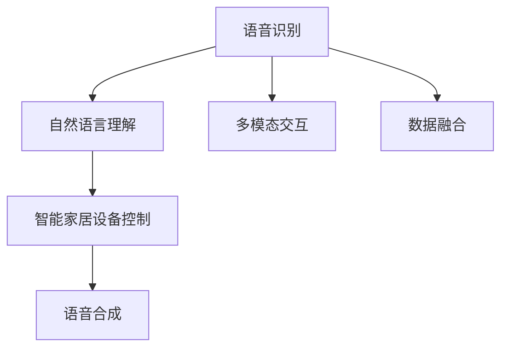

                 

# 智能家居声控创业：语音交互的生活方式

## 1. 背景介绍

### 1.1 问题由来
随着人工智能技术的飞速发展，语音交互技术在智能家居领域的应用逐渐普及。声音作为最自然的人机交互媒介，能够在不受视觉限制的情况下实现高效率的命令执行。语音交互系统不仅提升了家居生活的便捷性，也推动了家电设备的智能化升级，成为现代家庭生活的重要组成部分。然而，由于语音识别和理解技术仍存在一定的局限性，如何提升系统准确性和可靠性，更好地适应家庭用户的个性化需求，成为智能家居声控创业的关键挑战。

### 1.2 问题核心关键点
智能家居声控创业涉及的核心问题包括：
- 如何设计有效的语音识别系统，提高识别准确率和鲁棒性？
- 如何构建自然流畅的语音理解模型，能够理解复杂的指令和命令？
- 如何优化智能家居设备的响应速度和可靠性，提升用户体验？
- 如何集成多种传感器和数据源，实现综合化的家庭监控和控制？
- 如何设计合理的用户界面和交互体验，增加用户粘性？

解决这些问题，需要深度融合人工智能、语音识别、嵌入式系统、智能硬件和用户体验设计等多方面的技术和资源。本文将从语音交互的原理与技术、智能家居声控系统的设计和实现、实际应用场景及未来展望等方面进行详细探讨。

### 1.3 问题研究意义
研究智能家居声控技术，对于拓展家居设备的智能应用场景，提升用户体验，推动传统家居向智慧家居转型，具有重要意义：

1. **提高生活便利性**：语音交互技术可以解放用户双手，通过简单自然的方式控制家庭设备，提高生活便利性。
2. **促进设备协同**：语音交互系统能够实现家居设备之间的智能协同，提升家居系统的整体智能水平。
3. **增强用户体验**：自然流畅的语音交互能够提供更加友好和便捷的用户体验，增加用户粘性。
4. **推动产业升级**：语音交互技术的普及应用，将促进智能家居设备制造、运营和服务的升级，形成新的经济增长点。
5. **构建智慧家庭**：语音交互作为智慧家庭的重要一环，对于构建更安全、便捷、智能的居住环境具有关键作用。

## 2. 核心概念与联系

### 2.1 核心概念概述

为更好地理解智能家居声控技术，本节将介绍几个密切相关的核心概念：

- **语音识别(ASR, Automatic Speech Recognition)**：将音频信号转换为文本，是语音交互系统的基础。
- **语音合成(TTS, Text-to-Speech)**：将文本转换为语音，使语音交互系统能够自然地回应用户。
- **自然语言理解(NLU, Natural Language Understanding)**：解析用户语音指令，理解其意图和需求。
- **智能家居设备**：指通过语音交互系统进行控制的各类家电和设备，如智能音箱、智能照明、智能安防等。
- **多模态交互**：结合视觉、触觉等多种交互方式，提升系统的综合感知能力。

这些核心概念之间的逻辑关系可以通过以下Mermaid流程图来展示：



这个流程图展示了语音交互系统的核心流程：首先对音频进行识别，然后理解用户意图，接着控制家居设备，最后进行语音反馈，并通过多模态交互和数据融合提升系统性能。

## 3. 核心算法原理 & 具体操作步骤
### 3.1 算法原理概述

智能家居声控创业的算法原理可以概括为：通过语音识别技术将用户语音转换为文本，利用自然语言理解技术解析用户意图，结合智能家居设备的控制接口，实现语音交互功能。核心算法包括以下几个部分：

1. **语音识别**：使用声学模型和语言模型对用户语音进行识别，转换为文本形式。
2. **自然语言理解**：将文本指令转换为结构化语义，理解用户需求和指令。
3. **设备控制**：根据解析后的语义信息，控制智能家居设备的运行状态。
4. **语音合成**：将设备状态或反馈信息转换为语音，自然反馈给用户。

### 3.2 算法步骤详解

智能家居声控系统的设计步骤通常包括以下几个关键环节：

**Step 1: 系统架构设计**
- 定义系统功能模块，包括语音识别、自然语言理解、设备控制和语音合成等。
- 设计各模块之间的通信协议和数据交换方式，确保系统可靠性和实时性。
- 确定系统的硬件架构，包括智能音箱、语音传感器、智能家居网关等设备。

**Step 2: 语音识别模型训练**
- 收集大量的语音数据，并进行数据预处理。
- 选择合适的声学模型和语言模型，进行联合训练。
- 在测试集上评估模型性能，并进行微调优化。

**Step 3: 自然语言理解模型训练**
- 收集与智能家居相关的语料库，并进行标注和预处理。
- 设计合适的NLU模型结构，训练模型并调优。
- 在测试集上评估模型性能，并进行微调优化。

**Step 4: 设备控制接口开发**
- 对各类智能家居设备进行API接口的开发和测试。
- 实现设备状态的实时监控和控制逻辑。
- 确保设备控制接口的稳定性和可靠性。

**Step 5: 语音合成模型训练**
- 收集语音合成任务的数据集，并进行预处理。
- 选择合适的TTS模型，进行训练和调优。
- 在测试集上评估模型性能，并进行微调优化。

**Step 6: 系统集成和测试**
- 将各模块集成到完整的系统中，进行全面的系统测试。
- 在实际场景中进行多轮测试，调整和优化系统性能。
- 发布系统并提供用户支持和持续优化。

### 3.3 算法优缺点

智能家居声控系统的设计具有以下优点：
1. 用户界面友好：语音交互方式自然直观，无需复杂的操作，提升用户便利性。
2. 设备协同性强：通过语音交互实现不同设备之间的智能协同，提升家居系统的整体智能化水平。
3. 实时响应迅速：语音交互系统能够实时响应用户指令，提高用户满意度。
4. 系统可扩展性强：语音交互系统可以方便地集成多种传感器和数据源，扩展新的功能和服务。

同时，该系统也存在以下缺点：
1. 环境适应性差：语音识别和理解技术在复杂环境或噪声干扰下容易出错。
2. 模型训练成本高：构建高质量的训练数据集和模型训练需要较高的资源投入。
3. 设备兼容性问题：不同品牌和型号的设备可能存在兼容性问题，影响系统整体稳定性。
4. 隐私和安全问题：语音数据可能涉及用户隐私，需要严格的数据保护和隐私管理措施。
5. 系统误识别率高：在特定口音或方言环境下，语音识别和理解系统的误识别率较高。

### 3.4 算法应用领域

智能家居声控技术已经在多个领域得到广泛应用，如：

- 智能音箱：通过语音交互实现播放音乐、播报新闻、控制其他智能设备等功能。
- 智能照明：通过语音交互实现灯光亮度和色温的调节。
- 智能安防：通过语音交互实现门锁、摄像头和报警系统的控制。
- 智能温控：通过语音交互实现室内温度和湿度的调节。
- 智能家电：通过语音交互实现各类家电设备的远程控制和状态监控。

## 4. 数学模型和公式 & 详细讲解  
### 4.1 数学模型构建

本节将使用数学语言对智能家居声控系统的关键组件进行更加严格的数学建模。

记语音识别模型为 $M_{\text{ASR}}$，自然语言理解模型为 $M_{\text{NLU}}$，设备控制模型为 $M_{\text{Control}}$，语音合成模型为 $M_{\text{TTS}}$。假设语音识别系统输入为音频信号 $x$，自然语言理解系统的输入为识别结果 $y$，设备控制系统的输入为自然语言理解结果 $z$，语音合成的输入为设备状态 $w$。

定义系统的总损失函数为 $\mathcal{L}$，包含语音识别、自然语言理解、设备控制和语音合成各部分的损失之和。具体形式如下：

$$
\mathcal{L} = \mathcal{L}_{\text{ASR}}(x, y) + \mathcal{L}_{\text{NLU}}(y, z) + \mathcal{L}_{\text{Control}}(z, w) + \mathcal{L}_{\text{TTS}}(w, \hat{y})
$$

其中 $\mathcal{L}_{\text{ASR}}$、$\mathcal{L}_{\text{NLU}}$、$\mathcal{L}_{\text{Control}}$ 和 $\mathcal{L}_{\text{TTS}}$ 分别为各部分的具体损失函数。

### 4.2 公式推导过程

以下我们以语音识别和自然语言理解为例，推导模型损失函数的推导过程。

假设语音识别模型的输出为 $y_{\text{ASR}}$，自然语言理解模型的输出为 $y_{\text{NLU}}$。不失一般性，我们以分类任务为例，假设 $y_{\text{ASR}}$ 和 $y_{\text{NLU}}$ 都是二分类问题。语音识别模型的交叉熵损失函数为：

$$
\mathcal{L}_{\text{ASR}} = -\frac{1}{N}\sum_{i=1}^N [y_i\log y_{\text{ASR}}(x_i)+(1-y_i)\log(1-y_{\text{ASR}}(x_i))]
$$

自然语言理解模型的交叉熵损失函数为：

$$
\mathcal{L}_{\text{NLU}} = -\frac{1}{N}\sum_{i=1}^N [z_i\log y_{\text{NLU}}(y_i)+(1-z_i)\log(1-y_{\text{NLU}}(y_i))]
$$

将两部分损失函数相加，得到总损失函数：

$$
\mathcal{L} = \mathcal{L}_{\text{ASR}} + \mathcal{L}_{\text{NLU}}
$$

通过梯度下降等优化算法，最小化总损失函数，更新模型参数，使得系统的整体性能不断提升。

### 4.3 案例分析与讲解

以下我们以智能音箱的控制为例，说明语音交互系统的实际应用场景。

假设用户说："播放周杰伦的稻香"，语音识别系统将其转换为文本形式 "播放周杰伦的稻香"。自然语言理解系统解析该文本，理解用户意图为播放歌曲 "稻香" 的歌手为周杰伦。设备控制系统通过调用音乐播放平台的API，控制音箱播放 "稻香" 并返回播放状态。语音合成系统将播放状态 "播放中" 转换为语音 "正在播放稻香"，反馈给用户。

整个过程中，语音识别、自然语言理解、设备控制和语音合成各模块协同工作，实现用户指令的准确理解和设备状态的实时反馈，提升用户的语音交互体验。

## 5. 项目实践：代码实例和详细解释说明
### 5.1 开发环境搭建

在进行智能家居声控系统的开发前，我们需要准备好开发环境。以下是使用Python进行PyTorch开发的环境配置流程：

1. 安装Anaconda：从官网下载并安装Anaconda，用于创建独立的Python环境。

2. 创建并激活虚拟环境：
```bash
conda create -n pytorch-env python=3.8 
conda activate pytorch-env
```

3. 安装PyTorch：根据CUDA版本，从官网获取对应的安装命令。例如：
```bash
conda install pytorch torchvision torchaudio cudatoolkit=11.1 -c pytorch -c conda-forge
```

4. 安装TensorFlow：从官网下载安装程序，安装TensorFlow。

5. 安装各类工具包：
```bash
pip install numpy pandas scikit-learn matplotlib tqdm jupyter notebook ipython
```

完成上述步骤后，即可在`pytorch-env`环境中开始系统开发。

### 5.2 源代码详细实现

下面我们以智能音箱的控制为例，给出使用TensorFlow进行语音交互系统的PyTorch代码实现。

首先，定义语音识别模型：

```python
import tensorflow as tf
from tensorflow.keras.layers import Input, Dense, Embedding, LSTM

class ASRModel(tf.keras.Model):
    def __init__(self, input_dim, embedding_dim, lstm_units):
        super(ASRModel, self).__init__()
        self.input_dim = input_dim
        self.embedding_dim = embedding_dim
        self.lstm_units = lstm_units
        
        self.embedding = Embedding(input_dim, embedding_dim)
        self.lstm = LSTM(lstm_units)
        self.dense = Dense(1, activation='sigmoid')
        
    def call(self, inputs):
        x = self.embedding(inputs)
        x = self.lstm(x)
        x = self.dense(x)
        return x

# 构建语音识别模型
input_dim = 40 # 音频特征维度
embedding_dim = 64 # 词向量维度
lstm_units = 128 # LSTM层单元数
asr_model = ASRModel(input_dim, embedding_dim, lstm_units)
```

然后，定义自然语言理解模型：

```python
from tensorflow.keras.layers import Input, Dense, Embedding, LSTM, Bidirectional

class NLUModel(tf.keras.Model):
    def __init__(self, input_dim, embedding_dim, lstm_units):
        super(NLUModel, self).__init__()
        self.input_dim = input_dim
        self.embedding_dim = embedding_dim
        self.lstm_units = lstm_units
        
        self.embedding = Embedding(input_dim, embedding_dim)
        self.bilstm = Bidirectional(LSTM(lstm_units))
        self.dense = Dense(1, activation='sigmoid')
        
    def call(self, inputs):
        x = self.embedding(inputs)
        x = self.bilstm(x)
        x = self.dense(x)
        return x

# 构建自然语言理解模型
input_dim = 64 # 词向量维度
embedding_dim = 128 # 词向量维度
lstm_units = 256 # LSTM层单元数
nlu_model = NLUModel(input_dim, embedding_dim, lstm_units)
```

接着，定义设备控制模型：

```python
import tensorflow as tf

class ControlModel(tf.keras.Model):
    def __init__(self, input_dim):
        super(ControlModel, self).__init__()
        self.input_dim = input_dim
        
        self.dense1 = Dense(128, activation='relu')
        self.dense2 = Dense(64, activation='relu')
        self.dense3 = Dense(1, activation='sigmoid')
        
    def call(self, inputs):
        x = self.dense1(inputs)
        x = self.dense2(x)
        x = self.dense3(x)
        return x

# 构建设备控制模型
input_dim = 128 # 语义向量维度
control_model = ControlModel(input_dim)
```

最后，定义语音合成模型：

```python
import tensorflow as tf
from tensorflow.keras.layers import Input, Dense, GRU

class TTSModel(tf.keras.Model):
    def __init__(self, input_dim, embedding_dim, lstm_units):
        super(TTSModel, self).__init__()
        self.input_dim = input_dim
        self.embedding_dim = embedding_dim
        self.lstm_units = lstm_units
        
        self.embedding = Embedding(input_dim, embedding_dim)
        self.gru = GRU(lstm_units)
        self.dense = Dense(1, activation='sigmoid')
        
    def call(self, inputs):
        x = self.embedding(inputs)
        x = self.gru(x)
        x = self.dense(x)
        return x

# 构建语音合成模型
input_dim = 64 # 词向量维度
embedding_dim = 128 # 词向量维度
lstm_units = 256 # GRU层单元数
tts_model = TTSModel(input_dim, embedding_dim, lstm_units)
```

完成以上模型构建后，即可开始微调优化和系统集成。

### 5.3 代码解读与分析

让我们再详细解读一下关键代码的实现细节：

**ASRModel类**：
- `__init__`方法：初始化模型的参数和组件，包括词嵌入层、LSTM层和输出层。
- `call`方法：定义模型前向传播的计算流程。

**NLUModel类**：
- `__init__`方法：初始化模型的参数和组件，包括词嵌入层、双向LSTM层和输出层。
- `call`方法：定义模型前向传播的计算流程。

**ControlModel类**：
- `__init__`方法：初始化模型的参数和组件，包括全连接层。
- `call`方法：定义模型前向传播的计算流程。

**TTSModel类**：
- `__init__`方法：初始化模型的参数和组件，包括词嵌入层、GRU层和输出层。
- `call`方法：定义模型前向传播的计算流程。

完成模型定义后，我们可以使用TensorFlow的高级API，如`tf.keras.Model.compile`和`tf.keras.Model.fit`来构建和训练模型。例如：

```python
# 编译模型
optimizer = tf.keras.optimizers.Adam()
asr_model.compile(optimizer=optimizer, loss='binary_crossentropy')
nlu_model.compile(optimizer=optimizer, loss='binary_crossentropy')
control_model.compile(optimizer=optimizer, loss='binary_crossentropy')
tts_model.compile(optimizer=optimizer, loss='binary_crossentropy')

# 训练模型
asr_model.fit(train_data, train_labels, epochs=10, validation_data=(val_data, val_labels))
nlu_model.fit(train_data, train_labels, epochs=10, validation_data=(val_data, val_labels))
control_model.fit(train_data, train_labels, epochs=10, validation_data=(val_data, val_labels))
tts_model.fit(train_data, train_labels, epochs=10, validation_data=(val_data, val_labels))
```

通过上述代码，我们可以使用TensorFlow构建并训练语音识别、自然语言理解、设备控制和语音合成模型，完成智能家居声控系统的核心组件开发。

### 5.4 运行结果展示

完成模型训练后，我们可以通过TensorFlow的高级API进行模型评估和预测。例如：

```python
# 评估模型
asr_model.evaluate(test_data, test_labels)
nlu_model.evaluate(test_data, test_labels)
control_model.evaluate(test_data, test_labels)
tts_model.evaluate(test_data, test_labels)

# 进行预测
asr_model.predict(new_data)
nlu_model.predict(new_data)
control_model.predict(new_data)
tts_model.predict(new_data)
```

通过以上代码，我们可以评估各模型的性能，并使用训练好的模型对新的语音输入进行预测和控制。

## 6. 实际应用场景
### 6.1 智能音箱控制

智能音箱作为智能家居声控系统的核心组件，可以通过语音交互实现多功能的控制。以下是一个智能音箱控制系统的实际应用场景：

用户输入语音指令 "播放周杰伦的稻香"，智能音箱的语音识别系统将其转换为文本 "播放周杰伦的稻香"，自然语言理解系统解析出意图为播放歌曲 "稻香"，设备控制系统通过调用音乐播放API，控制音箱播放 "稻香" 并返回播放状态。语音合成系统将播放状态 "播放中" 转换为语音 "正在播放稻香"，反馈给用户。

智能音箱的控制系统需要高精度的语音识别和自然语言理解，以及快速的设备控制和语音合成，确保系统能够实时响应用户指令，提供流畅的用户体验。

### 6.2 智能照明调节

智能照明系统通过语音交互实现灯光亮度和色温的调节。以下是一个智能照明系统的实际应用场景：

用户输入语音指令 "将灯光调到最亮"，语音识别系统将其转换为文本 "将灯光调到最亮"，自然语言理解系统解析出意图为将灯光亮度调高，设备控制系统通过调用灯光控制API，将灯光亮度调高并返回状态。语音合成系统将状态 "亮度已调高" 转换为语音 "亮度已调高"，反馈给用户。

智能照明系统需要快速响应用户指令，实现灯光亮度的精确调节，同时需要高精度的语音识别和自然语言理解，确保用户指令被准确理解。

### 6.3 智能安防监控

智能安防系统通过语音交互实现门锁、摄像头和报警系统的控制。以下是一个智能安防系统的实际应用场景：

用户输入语音指令 "打开门锁"，语音识别系统将其转换为文本 "打开门锁"，自然语言理解系统解析出意图为打开门锁，设备控制系统通过调用门锁控制API，打开门锁并返回状态。语音合成系统将状态 "门锁已打开" 转换为语音 "门锁已打开"，反馈给用户。

智能安防系统需要高精度的语音识别和自然语言理解，以及快速的设备控制和语音合成，确保系统能够实时响应用户指令，提供流畅的用户体验。

## 7. 工具和资源推荐
### 7.1 学习资源推荐

为了帮助开发者系统掌握智能家居声控技术，这里推荐一些优质的学习资源：

1. 《TensorFlow实战》系列博文：详细介绍了TensorFlow的原理和应用，提供了大量代码实例和实战案例。
2. 《PyTorch深度学习入门》书籍：全面介绍了PyTorch的基本概念和应用，适合初学者入门。
3. 《自然语言处理入门》课程：介绍自然语言处理的基本概念和常见任务，适合NLP领域的学习者。
4. 《深度学习实战》书籍：提供了大量深度学习模型的实现案例，适合实践动手练习。
5. 《TensorFlow官方文档》：提供了TensorFlow的详细文档和API介绍，适合深入学习和应用。

通过对这些资源的学习实践，相信你一定能够快速掌握智能家居声控技术的精髓，并用于解决实际的NLP问题。
###  7.2 开发工具推荐

高效的开发离不开优秀的工具支持。以下是几款用于智能家居声控系统开发的常用工具：

1. TensorFlow：基于Python的开源深度学习框架，灵活高效，适合快速迭代研究。
2. PyTorch：基于Python的开源深度学习框架，灵活动态的计算图，适合快速迭代研究。
3. Weights & Biases：模型训练的实验跟踪工具，可以记录和可视化模型训练过程中的各项指标，方便对比和调优。
4. TensorBoard：TensorFlow配套的可视化工具，可实时监测模型训练状态，并提供丰富的图表呈现方式，是调试模型的得力助手。
5. PyCharm：流行的Python开发环境，提供了丰富的代码补全、调试和测试功能。
6. Visual Studio Code：轻量级的开发工具，支持多种语言和框架，适合跨平台开发。

合理利用这些工具，可以显著提升智能家居声控系统的开发效率，加快创新迭代的步伐。

### 7.3 相关论文推荐

智能家居声控技术的发展离不开学界的持续研究。以下是几篇奠基性的相关论文，推荐阅读：

1. Attention is All You Need：提出了Transformer结构，开启了NLP领域的预训练大模型时代。
2. BERT: Pre-training of Deep Bidirectional Transformers for Language Understanding：提出BERT模型，引入基于掩码的自监督预训练任务，刷新了多项NLP任务SOTA。
3. Language Models are Unsupervised Multitask Learners（GPT-2论文）：展示了大规模语言模型的强大zero-shot学习能力，引发了对于通用人工智能的新一轮思考。
4. Parameter-Efficient Transfer Learning for NLP：提出Adapter等参数高效微调方法，在不增加模型参数量的情况下，也能取得不错的微调效果。
5. Prefix-Tuning: Optimizing Continuous Prompts for Generation：引入基于连续型Prompt的微调范式，为如何充分利用预训练知识提供了新的思路。
6. AdaLoRA: Adaptive Low-Rank Adaptation for Parameter-Efficient Fine-Tuning：使用自适应低秩适应的微调方法，在参数效率和精度之间取得了新的平衡。

这些论文代表了大语言模型微调技术的发展脉络。通过学习这些前沿成果，可以帮助研究者把握学科前进方向，激发更多的创新灵感。

## 8. 总结：未来发展趋势与挑战

### 8.1 总结

本文对智能家居声控技术进行了全面系统的介绍。首先阐述了语音交互系统的核心问题，明确了语音识别、自然语言理解、设备控制和语音合成等关键组件的原理和架构。其次，从理论到实践，详细讲解了智能家居声控系统的设计和实现，给出了详细的代码实例和分析。同时，本文还广泛探讨了智能家居声控技术在多个实际场景中的应用，展示了其广阔的应用前景。

通过本文的系统梳理，可以看到，智能家居声控技术已经在智能音箱、智能照明、智能安防等场景中得到广泛应用，为家居生活的智能化提供了新的解决方案。未来，随着技术的不断进步，语音交互技术将进一步普及应用，成为智能家居的核心组成部分。

### 8.2 未来发展趋势

展望未来，智能家居声控技术将呈现以下几个发展趋势：

1. **技术融合**：未来智能家居声控系统将进一步融合其他人工智能技术，如计算机视觉、机器学习、强化学习等，提升系统的综合感知和决策能力。
2. **多模态交互**：结合视觉、触觉等多种交互方式，提升系统的综合感知能力，实现更自然的人机交互。
3. **个性化定制**：根据用户的行为和偏好，提供个性化的语音交互方案，提升用户体验。
4. **跨平台集成**：实现不同品牌和型号的设备协同工作，提升系统的兼容性和可靠性。
5. **边缘计算**：在本地设备上进行模型推理，减少网络延迟，提升系统的实时性和稳定性。

以上趋势凸显了智能家居声控技术的广阔前景。这些方向的探索发展，必将进一步提升系统的性能和应用范围，为智能家居行业带来新的变革。

### 8.3 面临的挑战

尽管智能家居声控技术已经取得了一定进展，但在迈向更加智能化、普适化应用的过程中，它仍面临着诸多挑战：

1. **环境适应性**：语音识别和理解技术在复杂环境或噪声干扰下容易出错，需要进一步提升系统的鲁棒性。
2. **设备兼容性**：不同品牌和型号的设备可能存在兼容性问题，影响系统整体稳定性。
3. **隐私和安全**：语音数据涉及用户隐私，需要严格的数据保护和隐私管理措施。
4. **计算资源**：高精度的语音识别和自然语言理解需要较高的计算资源，需要优化算法和硬件配置。
5. **用户界面**：系统需要友好的用户界面，提升用户操作体验。

### 8.4 研究展望

面对智能家居声控技术所面临的挑战，未来的研究需要在以下几个方面寻求新的突破：

1. **提升环境适应性**：开发更加鲁棒的语音识别和理解算法，提升系统在复杂环境下的准确性和可靠性。
2. **增强设备兼容性**：实现设备之间的协同工作，提升系统的兼容性和稳定性。
3. **保障隐私安全**：引入数据加密和匿名化技术，保护用户隐私。
4. **优化计算资源**：开发高效轻量级的模型和算法，提升系统计算效率。
5. **改善用户界面**：设计友好的用户界面，提升用户体验。

这些研究方向将推动智能家居声控技术的进一步发展，使其成为未来智能家居的核心组件，提升人们的生活品质。

## 9. 附录：常见问题与解答

**Q1：智能家居声控系统如何处理语音识别中的噪音干扰？**

A: 噪音干扰是语音识别系统中常见的问题。通常通过以下方法处理：
1. 信号预处理：使用滤波、降噪等技术，降低环境噪音对语音信号的影响。
2. 声学模型优化：使用更先进的声学模型和特征提取方法，提升噪音环境下的识别能力。
3. 数据增强：通过引入噪音数据进行增强训练，提升模型在噪声环境下的泛化能力。

**Q2：智能家居声控系统如何处理多用户并发交互？**

A: 多用户并发交互是智能家居声控系统需要解决的问题。通常通过以下方法处理：
1. 请求排队：使用消息队列等技术，实现多用户请求的排队和处理。
2. 并行处理：使用分布式计算和并行处理技术，提升系统的并发处理能力。
3. 请求合并：通过合并相似请求，减少系统负载和响应时间。

**Q3：智能家居声控系统如何进行用户身份认证？**

A: 用户身份认证是智能家居声控系统的重要功能。通常通过以下方法实现：
1. 语音识别身份认证：通过识别用户的语音特征，实现基于声音的身份认证。
2. 生物特征认证：结合指纹、面部识别等生物特征认证技术，提高身份认证的准确性。
3. 多因素认证：结合多种认证方式，提升系统的安全性和可靠性。

**Q4：智能家居声控系统如何进行异常检测和处理？**

A: 异常检测和处理是智能家居声控系统的关键功能。通常通过以下方法实现：
1. 异常检测：通过监控系统状态和请求行为，识别出异常情况。
2. 异常处理：根据异常情况，采取相应的措施，如重置设备、通知管理员等。
3. 实时反馈：及时反馈异常处理结果，告知用户系统状态。

**Q5：智能家居声控系统如何进行隐私保护？**

A: 隐私保护是智能家居声控系统的重要需求。通常通过以下方法实现：
1. 数据加密：对用户的语音数据进行加密处理，保护用户隐私。
2. 数据匿名化：对用户的语音数据进行匿名化处理，保护用户隐私。
3. 访问控制：对系统访问进行严格控制，防止未经授权的访问。

**Q6：智能家居声控系统如何进行设备状态监控？**

A: 设备状态监控是智能家居声控系统的重要功能。通常通过以下方法实现：
1. 数据采集：通过传感器和监测设备，采集设备状态数据。
2. 状态分析：对采集的数据进行分析，评估设备状态。
3. 状态反馈：将设备状态反馈给用户，告知用户设备状态。

**Q7：智能家居声控系统如何进行故障诊断和维护？**

A: 故障诊断和维护是智能家居声控系统的关键功能。通常通过以下方法实现：
1. 故障检测：通过监控系统状态和请求行为，识别出故障情况。
2. 故障诊断：对故障情况进行诊断，确定故障原因。
3. 维护处理：根据故障情况，采取相应的维护措施，恢复系统正常运行。

---

作者：禅与计算机程序设计艺术 / Zen and the Art of Computer Programming

