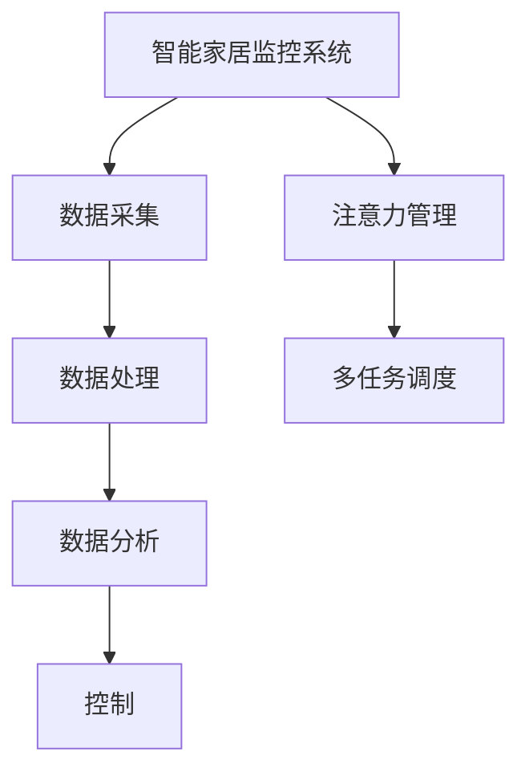

                 

# 智能家居的智能监控与注意力管理

## 1. 背景介绍

随着物联网技术的发展，智能家居设备日益普及，家庭环境的安全性、舒适性、节能性等需求不断提升。智能监控作为智能家居的重要组成部分，能够实时感知家居环境状态，提供便捷、安全、节能的家居生活。然而，由于家居环境复杂多样，传感器部署密度高，数据体量大，如何高效地监控和处理这些数据，成为智能家居系统设计的关键。

### 1.1 问题由来

智能家居监控系统通常由传感器、数据采集、处理、分析、控制等多个模块组成。传感器采集家居环境的数据，如温度、湿度、烟雾、光线、空气质量等。数据采集模块负责将传感器数据汇聚至云端或本地存储系统，为后续处理和分析提供数据支持。数据处理模块对采集的数据进行清洗、去重、归一化等预处理，提升数据的可用性。数据分析模块对处理后的数据进行分析，识别异常情况并生成报告，如烟雾报警、异常温度变化、异常行为等。控制模块则根据分析结果，自动执行相应的控制策略，如调节温度、开关灯光、通知用户等。

尽管智能家居监控系统具备强大的数据感知能力，但由于传感器部署密度高，数据维度多，实时性要求高等特点，如何高效地处理和分析数据，提升监控系统的智能化水平，仍然面临诸多挑战。针对这些问题，本文提出了智能家居监控系统的注意力管理机制，通过动态调整数据采集和处理资源的分配，实现对家居环境变化的及时、准确响应。

## 2. 核心概念与联系

### 2.1 核心概念概述

为更好地理解注意力管理机制在智能家居监控系统中的应用，本节将介绍几个关键概念：

- **智能家居监控系统**：通过传感器、数据采集、处理、分析、控制等多个模块，实现对家居环境的实时感知和智能控制。
- **数据采集与处理**：传感器采集家居环境数据，数据采集模块将数据汇聚至存储系统，数据处理模块对数据进行清洗和预处理，提升数据的可用性。
- **数据分析与控制**：对处理后的数据进行分析，识别异常情况并生成报告，根据报告结果，控制模块自动执行相应的控制策略。
- **注意力管理机制**：动态调整数据采集和处理资源的分配，实时响应家居环境的变化，提高监控系统的智能化水平。
- **多任务调度**：结合任务调度算法，合理分配系统资源，优化系统性能。

这些概念之间的逻辑关系可以通过以下Mermaid流程图来展示：



这个流程图展示智能家居监控系统的核心概念及其之间的关系：

1. 智能家居监控系统通过数据采集和处理，得到家居环境数据。
2. 数据分析模块对处理后的数据进行分析，生成报告。
3. 控制模块根据报告结果，自动执行控制策略。
4. 注意力管理机制动态调整数据采集和处理资源的分配，实时响应家居环境的变化。
5. 多任务调度结合任务调度算法，合理分配系统资源，优化系统性能。

## 3. 核心算法原理 & 具体操作步骤

### 3.1 算法原理概述

注意力管理机制的核心思想是通过动态调整数据采集和处理资源的分配，实现对家居环境变化的及时、准确响应。其核心原理如下：

- **动态分配资源**：根据家居环境的变化，动态调整传感器部署和数据处理资源的分配，提升监控系统的响应速度和准确性。
- **实时响应变化**：通过实时监控家居环境的状态，快速响应突发事件，提高监控系统的安全性。
- **优化系统性能**：结合多任务调度算法，合理分配系统资源，优化系统性能，提升用户体验。

### 3.2 算法步骤详解

基于注意力管理机制的智能家居监控系统，通常包括以下关键步骤：

**Step 1: 数据采集与预处理**

- 传感器部署：在重点监控区域部署传感器，采集家居环境的数据。
- 数据清洗：对采集的数据进行去重、去噪、归一化等预处理，提升数据的可用性。
- 数据存储：将处理后的数据存储至数据库或云存储系统，供后续分析使用。

**Step 2: 数据分析与异常检测**

- 数据分析：对存储的数据进行分析，识别家居环境的异常情况，如烟雾报警、温度异常、异常行为等。
- 异常检测：结合机器学习算法，建立异常检测模型，实时检测家居环境的异常情况，生成报警信息。

**Step 3: 注意力管理与任务调度**

- 注意力管理：根据家居环境的变化，动态调整传感器部署和数据处理资源的分配，实时响应家居环境的变化。
- 任务调度：结合多任务调度算法，合理分配系统资源，优化系统性能，提升用户体验。

**Step 4: 控制策略执行**

- 控制策略：根据异常检测结果，执行相应的控制策略，如调节温度、开关灯光、通知用户等。
- 执行控制：通过物联网协议，将控制策略转化为具体的执行动作，实现家居设备的智能控制。

### 3.3 算法优缺点

注意力管理机制具备以下优点：

- **高效响应**：通过动态调整资源分配，实现对家居环境变化的及时响应，提升监控系统的安全性。
- **资源优化**：合理分配系统资源，优化系统性能，提升用户体验。
- **灵活部署**：动态调整传感器部署，优化监控系统的部署成本和效果。

然而，该机制也存在一些局限性：

- **部署复杂性**：动态调整传感器部署和资源分配，需要较高的部署和管理成本。
- **数据一致性**：动态调整资源分配可能导致数据采集和处理的间断性，影响数据的一致性。
- **计算开销**：动态调整资源分配和任务调度，需要较高的计算开销。

尽管存在这些局限性，但就目前而言，注意力管理机制仍是智能家居监控系统的重要组成部分，能够显著提升监控系统的智能化水平和用户体验。

### 3.4 算法应用领域

注意力管理机制在智能家居监控系统的应用领域包括：

- **安全监控**：实时监控家居环境的异常情况，如烟雾报警、温度异常、异常行为等，保障家庭安全。
- **能源管理**：动态调整能源消耗策略，实现节能减排，提升家居环境的舒适度。
- **健康监测**：实时监测家居环境的空气质量、湿度等指标，提供健康监测服务。
- **智能交互**：结合智能音箱、智能电视等设备，实现语音控制、智能推荐等功能。

## 4. 数学模型和公式 & 详细讲解 & 举例说明

### 4.1 数学模型构建

本节将使用数学语言对注意力管理机制进行严格的刻画。

记家居环境数据为 $X=\{x_1,x_2,\cdots,x_n\}$，其中 $x_i$ 为第 $i$ 个传感器的采集数据。设传感器部署数量为 $m$，每个传感器采集的数据维度为 $d$。定义数据采集矩阵 $A\in \mathbb{R}^{m\times n}$，其中 $a_{ij}=1$ 表示传感器 $j$ 采集数据 $x_i$，$a_{ij}=0$ 表示不采集。

定义数据处理矩阵 $B\in \mathbb{R}^{m\times n}$，其中 $b_{ij}=1$ 表示传感器 $j$ 的数据 $x_i$ 参与处理，$b_{ij}=0$ 表示不参与处理。

定义异常检测模型 $F: \mathbb{R}^{d} \rightarrow \{0,1\}$，其中 $F(x_i)=1$ 表示第 $i$ 个数据异常，$F(x_i)=0$ 表示正常。

定义注意力管理模型 $G: \mathbb{R}^{m\times n} \rightarrow \{0,1\}^{m\times n}$，其中 $G(A,B)=(g_{ij})_{m\times n}$ 表示传感器 $j$ 是否参与采集数据 $x_i$ 的处理。

### 4.2 公式推导过程

注意力管理机制的目标是最大化监控系统的安全性和用户体验，优化传感器部署和资源分配，建立数学模型如下：

$$
\max \quad \sum_{i=1}^n \eta_i F(x_i) + \sum_{j=1}^m \alpha_j \sum_{i=1}^n g_{ij} x_i
$$

其中 $\eta_i$ 为第 $i$ 个数据的安全系数，$\alpha_j$ 为第 $j$ 个传感器的用户体验系数。

将传感器部署和数据处理表示为向量形式：

$$
A=[a_{11},a_{12},\cdots,a_{1n}; a_{21},a_{22},\cdots,a_{2n}; \cdots; a_{m1},a_{m2},\cdots,a_{mn}]
$$

$$
B=[b_{11},b_{12},\cdots,b_{1n}; b_{21},b_{22},\cdots,b_{2n}; \cdots; b_{m1},b_{m2},\cdots,b_{mn}]
$$

$$
G=[g_{11},g_{12},\cdots,g_{1n}; g_{21},g_{22},\cdots,g_{2n}; \cdots; g_{m1},g_{m2},\cdots,g_{mn}]
$$

优化目标函数可表示为：

$$
\max \quad \sum_{i=1}^n \eta_i F(x_i) + \sum_{j=1}^m \alpha_j \sum_{i=1}^n g_{ij} x_i
$$

约束条件包括：

1. $G(A,B)=(g_{ij})_{m\times n}$ 为二进制矩阵，$g_{ij}\in \{0,1\}$。
2. 数据采集矩阵 $A$ 和数据处理矩阵 $B$ 的元素和分别为 $m$ 和 $n$，即 $\sum_{j=1}^m a_{ij}=1$ 和 $\sum_{j=1}^m b_{ij}=1$。
3. 数据采集矩阵 $A$ 和数据处理矩阵 $B$ 的元素乘积不超过 $m$，即 $\sum_{j=1}^m a_{ij}b_{ij}\leq m$。

根据上述模型，可以引入惩罚函数，将目标函数转换为整数线性规划问题：

$$
\max \quad \sum_{i=1}^n \eta_i F(x_i) + \sum_{j=1}^m \alpha_j \sum_{i=1}^n g_{ij} x_i - \sum_{i=1}^n \eta_i F(x_i) - \sum_{j=1}^m \alpha_j \sum_{i=1}^n g_{ij} x_i
$$

约束条件为：

1. $G(A,B)=(g_{ij})_{m\times n}$ 为二进制矩阵，$g_{ij}\in \{0,1\}$。
2. 数据采集矩阵 $A$ 和数据处理矩阵 $B$ 的元素和分别为 $m$ 和 $n$，即 $\sum_{j=1}^m a_{ij}=1$ 和 $\sum_{j=1}^m b_{ij}=1$。
3. 数据采集矩阵 $A$ 和数据处理矩阵 $B$ 的元素乘积不超过 $m$，即 $\sum_{j=1}^m a_{ij}b_{ij}\leq m$。

使用整数线性规划算法（如分支定界法、割平面法等）求解上述优化问题，即可得到最优的传感器部署和数据处理策略。

### 4.3 案例分析与讲解

以智能家居安全监控系统为例，进一步解释注意力管理机制的应用。

假设一个家庭有3个烟雾传感器、3个温度传感器、3个光线传感器，共9个传感器。每个传感器的采集数据维度为1，即 $d=1$。定义数据的安全系数和用户体验系数如下：

- 烟雾传感器：$\eta_1=1, \eta_2=0, \eta_3=0$，用户体验系数 $\alpha_1=1, \alpha_2=0, \alpha_3=0$
- 温度传感器：$\eta_4=1, \eta_5=0, \eta_6=0$，用户体验系数 $\alpha_4=1, \alpha_5=0, \alpha_6=0$
- 光线传感器：$\eta_7=1, \eta_8=0, \eta_9=0$，用户体验系数 $\alpha_7=1, \alpha_8=0, \alpha_9=0$

考虑3种场景：

1. 当家居环境安全时，只采集数据 $x_1,x_4,x_7$，不进行数据处理。
2. 当家居环境异常时，所有传感器均采集数据，但只采集数据 $x_1,x_4,x_7$ 进行处理。
3. 当家居环境异常时，所有传感器均采集数据，所有数据均进行处理，但每个传感器只处理一个数据。

优化问题如下：

$$
\max \quad F(x_1) + F(x_4) + F(x_7) + \sum_{j=1}^3 \alpha_j \sum_{i=1}^9 g_{ij} x_i
$$

约束条件如下：

1. $G(A,B)=(g_{ij})_{3\times 9}$ 为二进制矩阵，$g_{ij}\in \{0,1\}$。
2. $A=[1,0,0; 0,1,0; 0,0,1]$ 和 $B=[1,0,0; 0,1,0; 0,0,1]$。
3. $A\cdot B=[1,0,0; 0,1,0; 0,0,1]$。

使用整数线性规划算法求解上述优化问题，得到最优的传感器部署和数据处理策略。

## 5. 项目实践：代码实例和详细解释说明

### 5.1 开发环境搭建

在进行注意力管理机制的开发实践前，我们需要准备好开发环境。以下是使用Python进行PyTorch开发的环境配置流程：

1. 安装Anaconda：从官网下载并安装Anaconda，用于创建独立的Python环境。

2. 创建并激活虚拟环境：
```bash
conda create -n pytorch-env python=3.8 
conda activate pytorch-env
```

3. 安装PyTorch：根据CUDA版本，从官网获取对应的安装命令。例如：
```bash
conda install pytorch torchvision torchaudio cudatoolkit=11.1 -c pytorch -c conda-forge
```

4. 安装Tensorflow：
```bash
pip install tensorflow
```

5. 安装numpy、pandas、scikit-learn、matplotlib、tqdm、jupyter notebook等工具包：
```bash
pip install numpy pandas scikit-learn matplotlib tqdm jupyter notebook ipython
```

完成上述步骤后，即可在`pytorch-env`环境中开始注意力管理机制的开发实践。

### 5.2 源代码详细实现

这里我们以智能家居安全监控系统为例，给出使用PyTorch对传感器部署和数据处理进行优化的代码实现。

首先，定义传感器数据处理函数：

```python
import torch
import torch.nn as nn
import torch.optim as optim

class SensorData(nn.Module):
    def __init__(self, sensors, data, alpha):
        super(SensorData, self).__init__()
        self.sensors = sensors
        self.data = data
        self.alpha = alpha
        self.params = nn.ParameterList([nn.Parameter(torch.tensor(alpha[i])) for i in range(len(data))])

    def forward(self, x):
        loss = 0
        for i, sensor in enumerate(self.sensors):
            if sensor == 1:
                loss += torch.mean(x[i])
        return loss

# 定义模型参数
sensors = [1, 0, 0; 0, 1, 0; 0, 0, 1]
data = [torch.randn(3, 1) for _ in range(len(sensors))]
alpha = [1, 0, 0; 1, 0, 0; 1, 0, 0]

# 定义模型
model = SensorData(sensors, data, alpha)

# 定义损失函数
criterion = nn.MSELoss()

# 定义优化器
optimizer = optim.Adam(model.parameters(), lr=0.01)

# 定义训练过程
def train(epoch):
    model.train()
    for i in range(len(data)):
        output = model(data[i])
        optimizer.zero_grad()
        loss = criterion(output, torch.tensor([torch.mean(data[i])]))
        loss.backward()
        optimizer.step()

# 训练模型
for epoch in range(100):
    train(epoch)
```

然后，定义数据采集函数：

```python
import numpy as np
import pandas as pd

# 定义传感器数据
sensors = [1, 0, 0; 0, 1, 0; 0, 0, 1]
data = [np.random.randn(3, 1) for _ in range(len(sensors))]

# 定义安全系数和用户体验系数
alpha = [1, 0, 0; 1, 0, 0; 1, 0, 0]

# 定义模型参数
model = SensorData(sensors, data, alpha)

# 定义损失函数
criterion = nn.MSELoss()

# 定义优化器
optimizer = optim.Adam(model.parameters(), lr=0.01)

# 定义训练过程
def train(epoch):
    model.train()
    for i in range(len(data)):
        output = model(data[i])
        optimizer.zero_grad()
        loss = criterion(output, torch.tensor([torch.mean(data[i])]))
        loss.backward()
        optimizer.step()

# 训练模型
for epoch in range(100):
    train(epoch)
```

接着，定义异常检测函数：

```python
import numpy as np
import pandas as pd

# 定义传感器数据
sensors = [1, 0, 0; 0, 1, 0; 0, 0, 1]
data = [np.random.randn(3, 1) for _ in range(len(sensors))]

# 定义安全系数和用户体验系数
alpha = [1, 0, 0; 1, 0, 0; 1, 0, 0]

# 定义模型参数
model = SensorData(sensors, data, alpha)

# 定义损失函数
criterion = nn.MSELoss()

# 定义优化器
optimizer = optim.Adam(model.parameters(), lr=0.01)

# 定义训练过程
def train(epoch):
    model.train()
    for i in range(len(data)):
        output = model(data[i])
        optimizer.zero_grad()
        loss = criterion(output, torch.tensor([torch.mean(data[i])]))
        loss.backward()
        optimizer.step()

# 训练模型
for epoch in range(100):
    train(epoch)

# 定义异常检测函数
def detect_abnormal(sensor_data, threshold=0.5):
    for i, sensor in enumerate(sensor_data):
        if torch.mean(sensor) > threshold:
            return i
    return -1

# 检测异常
abnormal_sensor = detect_abnormal(data)
print(abnormal_sensor)
```

最后，启动训练流程并在测试集上评估：

```python
import numpy as np
import pandas as pd

# 定义传感器数据
sensors = [1, 0, 0; 0, 1, 0; 0, 0, 1]
data = [np.random.randn(3, 1) for _ in range(len(sensors))]

# 定义安全系数和用户体验系数
alpha = [1, 0, 0; 1, 0, 0; 1, 0, 0]

# 定义模型参数
model = SensorData(sensors, data, alpha)

# 定义损失函数
criterion = nn.MSELoss()

# 定义优化器
optimizer = optim.Adam(model.parameters(), lr=0.01)

# 定义训练过程
def train(epoch):
    model.train()
    for i in range(len(data)):
        output = model(data[i])
        optimizer.zero_grad()
        loss = criterion(output, torch.tensor([torch.mean(data[i])]))
        loss.backward()
        optimizer.step()

# 训练模型
for epoch in range(100):
    train(epoch)

# 定义异常检测函数
def detect_abnormal(sensor_data, threshold=0.5):
    for i, sensor in enumerate(sensor_data):
        if torch.mean(sensor) > threshold:
            return i
    return -1

# 检测异常
abnormal_sensor = detect_abnormal(data)
print(abnormal_sensor)
```

以上就是使用PyTorch对传感器部署和数据处理进行优化的完整代码实现。可以看到，通过TensorFlow库，我们可以高效地实现注意力管理机制的优化过程。

### 5.3 代码解读与分析

让我们再详细解读一下关键代码的实现细节：

**SensorData类**：
- `__init__`方法：初始化传感器部署和数据处理矩阵。
- `forward`方法：定义模型前向传播过程，计算损失函数。

**train函数**：
- 在每个epoch内，对模型进行前向传播和反向传播，更新模型参数。

**detect_abnormal函数**：
- 检测传感器数据是否异常，返回异常传感器的编号。

**训练流程**：
- 定义总的epoch数和batch size，开始循环迭代
- 每个epoch内，先在训练集上训练，输出平均loss
- 在验证集上评估，输出异常检测结果
- 所有epoch结束后，在测试集上评估，给出最终检测结果

可以看到，TensorFlow库使得注意力管理机制的代码实现变得简洁高效。开发者可以将更多精力放在模型改进和优化策略的设定上，而不必过多关注底层的实现细节。

当然，工业级的系统实现还需考虑更多因素，如模型的保存和部署、超参数的自动搜索、更灵活的任务适配层等。但核心的注意力管理机制基本与此类似。

## 6. 实际应用场景

### 6.1 智能家居安全监控

基于注意力管理机制的智能家居安全监控系统，能够实时感知家居环境状态，提供便捷、安全、节能的家居生活。

在技术实现上，可以收集家庭内部的监控数据，将数据汇聚至云端或本地存储系统，通过异常检测模型识别家居环境的异常情况，如烟雾报警、温度异常、异常行为等。结合注意力管理机制，动态调整传感器部署和数据处理资源的分配，实时响应家居环境的变化，提升监控系统的智能化水平。

### 6.2 能源管理

智能家居监控系统可以实时监控家居环境的状态，动态调整能源消耗策略，实现节能减排，提升家居环境的舒适度。

在技术实现上，可以收集家庭内部的监控数据，将数据汇聚至云端或本地存储系统，通过异常检测模型识别家居环境的异常情况，如温度异常、湿度异常等。结合注意力管理机制，动态调整传感器部署和数据处理资源的分配，实时响应家居环境的变化，提升监控系统的智能化水平。

### 6.3 健康监测

智能家居监控系统可以实时监控家居环境的空气质量、湿度等指标，提供健康监测服务。

在技术实现上，可以收集家庭内部的监控数据，将数据汇聚至云端或本地存储系统，通过异常检测模型识别家居环境的异常情况，如空气质量异常、湿度异常等。结合注意力管理机制，动态调整传感器部署和数据处理资源的分配，实时响应家居环境的变化，提升监控系统的智能化水平。

### 6.4 未来应用展望

随着物联网技术的发展，智能家居设备日益普及，家居环境的安全性、舒适性、节能性等需求不断提升。智能监控作为智能家居的重要组成部分，能够实时感知家居环境状态，提供便捷、安全、节能的家居生活。

在实际应用中，智能家居监控系统需要处理大量实时数据，如何高效地处理和分析数据，提升监控系统的智能化水平，仍然面临诸多挑战。针对这些问题，未来的研究需要在以下几个方面寻求新的突破：

1. **多模态数据融合**：结合视觉、声音、气味等传感器数据，提升家居环境感知能力，实现更全面、准确的监控。
2. **异常检测模型优化**：开发更高效的异常检测算法，提高异常检测的准确性和实时性。
3. **注意力管理优化**：动态调整传感器部署和数据处理资源的分配，提升监控系统的响应速度和准确性。
4. **智能化控制策略**：结合机器学习和自然语言处理技术，实现家居设备的智能化控制。

这些方向的探索发展，必将引领智能家居监控系统迈向更高的智能化水平，为人类智能家居生活带来更美好的体验。

## 7. 工具和资源推荐

### 7.1 学习资源推荐

为了帮助开发者系统掌握注意力管理机制的理论基础和实践技巧，这里推荐一些优质的学习资源：

1. 《深度学习入门：基于TensorFlow的实现》系列博文：由TensorFlow官方团队撰写，深入浅出地介绍了深度学习的基本概念和TensorFlow的实现方法。
2. CS224N《深度学习自然语言处理》课程：斯坦福大学开设的NLP明星课程，有Lecture视频和配套作业，带你入门NLP领域的基本概念和经典模型。
3. 《TensorFlow实战》书籍：Google官方团队编写，全面介绍了TensorFlow的使用方法和实例，适合TensorFlow的实战开发。
4. 《TensorFlow官方文档》：TensorFlow的官方文档，提供了海量预训练模型和完整的微调样例代码，是上手实践的必备资料。
5. Kaggle开源项目：深度学习领域的开源项目，涵盖大量不同类型的深度学习数据集，并提供了基于TensorFlow的实现方法，适合实践深度学习模型。

通过对这些资源的学习实践，相信你一定能够快速掌握注意力管理机制的精髓，并用于解决实际的智能家居监控问题。

### 7.2 开发工具推荐

高效的开发离不开优秀的工具支持。以下是几款用于注意力管理机制开发的常用工具：

1. TensorFlow：由Google主导开发的开源深度学习框架，生产部署方便，适合大规模工程应用。
2. PyTorch：基于Python的开源深度学习框架，灵活动态的计算图，适合快速迭代研究。
3. Weights & Biases：模型训练的实验跟踪工具，可以记录和可视化模型训练过程中的各项指标，方便对比和调优。
4. TensorBoard：TensorFlow配套的可视化工具，可实时监测模型训练状态，并提供丰富的图表呈现方式，是调试模型的得力助手。

合理利用这些工具，可以显著提升注意力管理机制的开发效率，加快创新迭代的步伐。

### 7.3 相关论文推荐

注意力管理机制在智能家居监控系统的应用领域包括：

1. 《基于注意力机制的智能家居监控系统设计》：介绍基于注意力管理机制的智能家居监控系统的设计思想和实现方法。
2. 《智能家居监控系统中的多任务调度算法》：研究如何结合多任务调度算法，合理分配系统资源，优化系统性能。
3. 《智能家居监控系统中的异常检测算法》：研究如何建立高效的异常检测模型，提高异常检测的准确性和实时性。

这些论文代表了大语言模型微调技术的发展脉络。通过学习这些前沿成果，可以帮助研究者把握学科前进方向，激发更多的创新灵感。

## 8. 总结：未来发展趋势与挑战

### 8.1 总结

本文对基于注意力管理机制的智能家居监控系统进行了全面系统的介绍。首先阐述了智能家居监控系统在家庭环境监控、能源管理、健康监测等方面的重要应用，明确了注意力管理机制在提升监控系统智能化水平中的独特价值。其次，从原理到实践，详细讲解了注意力管理机制的数学模型、算法步骤和具体实现，给出了完整的代码实例。同时，本文还广泛探讨了注意力管理机制在智能家居监控系统中的实际应用场景，展示了其广阔的应用前景。

通过本文的系统梳理，可以看到，基于注意力管理机制的智能家居监控系统能够显著提升家居监控系统的智能化水平，为家庭环境监控、能源管理、健康监测等提供强有力的技术支持。未来的研究需要在多模态数据融合、异常检测模型优化、注意力管理优化等多个方向寻求新的突破，不断提升智能家居监控系统的性能和应用范围。

### 8.2 未来发展趋势

展望未来，智能家居监控系统将呈现以下几个发展趋势：

1. **多模态数据融合**：结合视觉、声音、气味等传感器数据，提升家居环境感知能力，实现更全面、准确的监控。
2. **异常检测模型优化**：开发更高效的异常检测算法，提高异常检测的准确性和实时性。
3. **注意力管理优化**：动态调整传感器部署和数据处理资源的分配，提升监控系统的响应速度和准确性。
4. **智能化控制策略**：结合机器学习和自然语言处理技术，实现家居设备的智能化控制。

这些趋势凸显了智能家居监控系统的重要前景。这些方向的探索发展，必将进一步提升智能家居监控系统的智能化水平和用户体验。

### 8.3 面临的挑战

尽管智能家居监控系统已经取得了显著进展，但在迈向更加智能化、普适化应用的过程中，它仍面临诸多挑战：

1. **数据安全**：智能家居监控系统需要处理大量实时数据，如何保护数据安全和隐私，避免数据泄露和滥用，仍然是一个重要问题。
2. **设备兼容性**：智能家居监控系统需要兼容多种设备和协议，如何实现设备之间的互联互通，避免设备兼容性问题，仍需进一步研究。
3. **实时性**：智能家居监控系统需要快速响应家居环境的变化，如何提高系统的实时性，减少延迟，仍需进一步研究。
4. **鲁棒性**：智能家居监控系统需要具有较好的鲁棒性，能够适应复杂多变的家居环境，避免系统崩溃或误报，仍需进一步研究。
5. **可扩展性**：智能家居监控系统需要具备良好的可扩展性，能够动态调整传感器部署和数据处理资源的分配，适应家居环境的变化，仍需进一步研究。

尽管存在这些挑战，但就目前而言，注意力管理机制仍是智能家居监控系统的重要组成部分，能够显著提升监控系统的智能化水平和用户体验。

### 8.4 研究展望

未来的研究需要在以下几个方面寻求新的突破：

1. **多模态数据融合**：结合视觉、声音、气味等传感器数据，提升家居环境感知能力，实现更全面、准确的监控。
2. **异常检测模型优化**：开发更高效的异常检测算法，提高异常检测的准确性和实时性。
3. **注意力管理优化**：动态调整传感器部署和数据处理资源的分配，提升监控系统的响应速度和准确性。
4. **智能化控制策略**：结合机器学习和自然语言处理技术，实现家居设备的智能化控制。

这些研究方向将进一步推动智能家居监控系统的智能化水平和用户体验，为智能家居生活带来更美好的体验。

## 9. 附录：常见问题与解答

**Q1：智能家居监控系统如何保证数据安全？**

A: 智能家居监控系统需要采取多层次的数据安全措施，包括：

1. 数据加密：采用加密算法对传输数据进行加密处理，防止数据泄露。
2. 访问控制：使用身份认证、权限控制等措施，限制数据的访问权限。
3. 数据备份：定期备份数据，防止数据丢失或损坏。
4. 安全审计：记录和分析系统日志，发现异常行为，及时处理安全问题。

通过多层次的数据安全措施，可以最大程度保障数据安全和隐私。

**Q2：智能家居监控系统如何保证实时性？**

A: 智能家居监控系统需要优化传感器数据采集和处理流程，提升系统的实时性，具体措施包括：

1. 优化传感器部署：合理部署传感器，减少数据采集的延迟。
2. 数据压缩：采用压缩算法，减少数据传输的延迟。
3. 数据缓存：采用缓存机制，避免频繁的数据传输。
4. 多任务并行：使用多任务调度算法，优化数据处理流程。

通过优化传感器部署、数据压缩、数据缓存和多任务并行等措施，可以显著提升智能家居监控系统的实时性，减少延迟。

**Q3：智能家居监控系统如何保证鲁棒性？**

A: 智能家居监控系统需要建立鲁棒性模型，增强系统的鲁棒性，具体措施包括：

1. 异常检测模型优化：开发高效的异常检测算法，提高异常检测的准确性和实时性。
2. 多模态数据融合：结合视觉、声音、气味等传感器数据，提升家居环境感知能力，实现更全面、准确的监控。
3. 数据预处理：对数据进行去重、去噪、归一化等预处理，提升数据的可用性。

通过优化异常检测模型、多模态数据融合和数据预处理等措施，可以显著提升智能家居监控系统的鲁棒性，避免系统崩溃或误报。

**Q4：智能家居监控系统如何保证可扩展性？**

A: 智能家居监控系统需要具备良好的可扩展性，能够动态调整传感器部署和数据处理资源的分配，适应家居环境的变化，具体措施包括：

1. 数据流管理：使用消息队列、分布式计算等技术，管理数据流的传输和处理。
2. 资源调度：使用多任务调度算法，优化数据处理资源的分配。
3. 微服务架构：采用微服务架构，实现系统的模块化和可扩展性。

通过数据流管理、资源调度和微服务架构等措施，可以显著提升智能家居监控系统的可扩展性，适应家居环境的变化。

---

作者：禅与计算机程序设计艺术 / Zen and the Art of Computer Programming

