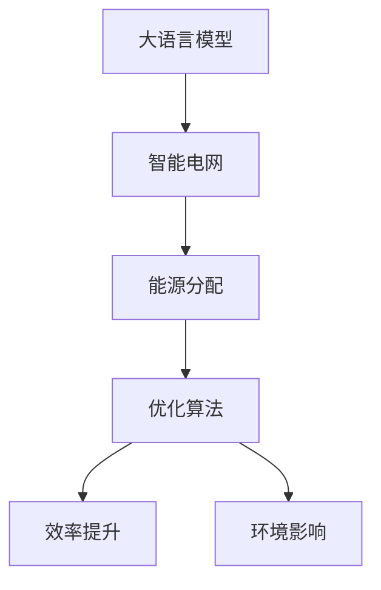

                 

# 智能电网管理：LLM优化能源分配的新方法

> 关键词：大语言模型,能源分配,智能电网,优化算法,效率提升,环境影响

## 1. 背景介绍

随着全球能源需求的不断增加，能源的合理分配和高效利用已经成为决定经济和环境可持续发展的重要因素。智能电网作为一种先进的电网技术，通过实时监测和智能控制，可以显著提升能源的输送效率，降低能源浪费。然而，智能电网的有效管理，不仅需要高度精细的算法和数据分析能力，还需要对不同场景下的能源需求进行精准预测和优化。

在大数据和人工智能技术的加持下，大语言模型（LLM）因其强大的语言理解和生成能力，为智能电网管理提供了新的解决方案。LLM可以通过分析海量历史数据和实时监测信息，生成优化方案，指导智能电网进行能源的合理分配和调节。本文将系统性地介绍LLM在智能电网管理中的应用，以及如何通过算法优化提升能源分配效率，同时减少环境影响。

## 2. 核心概念与联系

### 2.1 核心概念概述

为更好地理解LLM在智能电网管理中的应用，本节将介绍几个关键概念：

- 大语言模型（LLM）：以自回归（如GPT）或自编码（如BERT）模型为代表的大规模预训练语言模型。通过在大规模无标签文本语料上进行预训练，学习到语言的通用表示，具备强大的语言理解和生成能力。

- 智能电网（Smart Grid）：利用信息通信技术，对电网的运行状态进行实时监测和智能控制，优化能源的生产、传输和消费，提高能源利用效率。

- 能源分配（Energy Allocation）：根据不同用户的能源需求和电网状态，进行资源的合理配置，确保能源的高效利用和系统的稳定性。

- 优化算法（Optimization Algorithm）：用于求解最优解的数学方法，在智能电网管理中常用于优化能源分配方案。

- 效率提升（Efficiency Improvement）：通过优化算法和数据驱动决策，提升能源的输送和消费效率。

- 环境影响（Environmental Impact）：智能电网运行对环境造成的正面或负面影响，如减少碳排放、促进可再生能源使用等。

这些核心概念之间的逻辑关系可以通过以下Mermaid流程图来展示：



这个流程图展示了大语言模型的核心概念及其在智能电网管理中的应用：

1. 大语言模型通过预训练获得基础能力。
2. 智能电网利用大语言模型进行能源分配，优化能源的输送和消费。
3. 通过优化算法，提升能源分配的效率和精确性。
4. 同时关注能源分配对环境的影响，实现绿色低碳的能源使用。

## 3. 核心算法原理 & 具体操作步骤
### 3.1 算法原理概述

LLM在智能电网管理中的应用，本质上是通过分析历史数据和实时监测信息，生成优化的能源分配方案。其核心思想是：将智能电网视为一个复杂的多目标优化问题，使用LLM学习到对问题描述的深度理解和生成能力，进而生成最优的能源分配方案。

形式化地，假设智能电网的状态可以用一个多维向量 $\mathbf{x} \in \mathbb{R}^n$ 表示，不同用户的能源需求和电网的实时状态分别用 $\mathbf{y} \in \mathbb{R}^m$ 和 $\mathbf{z} \in \mathbb{R}^p$ 来表示。优化目标是最小化能源分配的损失函数 $\mathcal{L}(\mathbf{x}, \mathbf{y}, \mathbf{z})$，使得分配结果满足用户的能源需求，同时最大化电网的稳定性和效率。

LLM通过预训练模型 $M_{\theta}$，将问题描述转化为优化方案。具体步骤如下：

1. 将智能电网的状态 $\mathbf{x}$ 和实时监测数据 $\mathbf{z}$ 输入预训练模型，得到问题描述 $d = M_{\theta}(\mathbf{x}, \mathbf{z})$。
2. 根据问题描述 $d$，生成优化方案 $\mathbf{a} = M_{\theta}(d)$，指导能源的合理分配。
3. 将优化方案 $\mathbf{a}$ 和用户需求 $\mathbf{y}$ 结合起来，求解能源分配的优化问题，得到最优的能源分配方案 $\mathbf{x}^*$。

### 3.2 算法步骤详解

基于LLM的能源分配优化，主要包括以下几个关键步骤：

**Step 1: 数据准备**
- 收集智能电网的历史能源数据、实时监测数据、用户需求数据等，进行数据清洗和预处理。
- 将数据划分为训练集和测试集，用于训练和评估模型的性能。

**Step 2: 构建预训练模型**
- 选择合适的预训练语言模型（如GPT、BERT等），加载到模型中。
- 根据智能电网的特点，设计合适的问题描述和优化目标。

**Step 3: 模型训练**
- 将历史数据和实时监测数据输入预训练模型，训练模型生成优化方案。
- 通过反向传播和优化算法（如Adam、SGD等），不断调整模型参数，最小化损失函数。

**Step 4: 性能评估**
- 在测试集上评估模型生成的优化方案，计算损失函数和评估指标（如效率、稳定性、环境影响等）。
- 根据评估结果，调整模型参数或优化算法，进一步提升模型性能。

**Step 5: 实际应用**
- 在生产环境中，将模型输出的优化方案与实时数据结合，指导智能电网进行能源分配。
- 持续收集反馈数据，更新模型参数，保持模型性能和预测能力。

### 3.3 算法优缺点

基于LLM的能源分配优化方法具有以下优点：
1. 泛化能力强。LLM可以处理各种类型的智能电网数据，适应不同的应用场景。
2. 自适应能力强。LLM可以实时地根据新的数据和情况生成优化方案，保持动态适应性。
3. 优化效果显著。通过深度学习和优化算法，LLM能够生成高效、稳定的能源分配方案。
4. 可扩展性好。随着数据规模的增加，LLM的性能也会不断提升。

同时，该方法也存在一定的局限性：
1. 依赖高质量数据。模型性能很大程度上取决于数据的质量和完备性，数据缺失或偏差可能导致模型失效。
2. 模型复杂度高。大规模的LLM模型计算复杂度高，需要高性能计算资源。
3. 可解释性不足。LLM作为"黑盒"模型，其内部工作机制难以解释，难以进行调试和优化。
4. 资源消耗大。LLM模型的计算和存储需求大，可能导致资源浪费和环境影响。

尽管存在这些局限性，但就目前而言，基于LLM的能源分配优化方法仍是最主流的方法之一。未来相关研究将集中在如何进一步提升模型的泛化能力、降低资源消耗、提高模型的可解释性等方面。

### 3.4 算法应用领域

基于LLM的能源分配优化方法，在智能电网管理中已经得到了广泛的应用，覆盖了电力调度、需求响应、可再生能源接入等多个领域：

- 电力调度：利用LLM优化电力资源的分配，确保电网运行稳定，避免电网过载。
- 需求响应：通过智能算法和LLM，实时调整用户用电计划，实现电网负荷均衡。
- 可再生能源接入：利用LLM预测风能、太阳能等可再生能源的产出，指导能源的存储和分配。

除了上述这些经典应用外，LLM还被创新性地应用到更多场景中，如微电网管理、智能家居系统、电力市场预测等，为智能电网的可持续发展提供了新的技术路径。

## 4. 数学模型和公式 & 详细讲解
### 4.1 数学模型构建

本节将使用数学语言对基于LLM的能源分配优化过程进行更加严格的刻画。

记智能电网的状态为 $\mathbf{x} \in \mathbb{R}^n$，用户需求为 $\mathbf{y} \in \mathbb{R}^m$，实时监测数据为 $\mathbf{z} \in \mathbb{R}^p$，优化目标为最小化损失函数 $\mathcal{L}(\mathbf{x}, \mathbf{y}, \mathbf{z})$。假设预训练语言模型 $M_{\theta}$ 的输入为 $\mathbf{x}, \mathbf{z}$，输出为问题描述 $d \in \mathbb{R}^k$，生成的优化方案为 $\mathbf{a} \in \mathbb{R}^n$。

定义损失函数为：

$$
\mathcal{L}(\mathbf{x}, \mathbf{y}, \mathbf{z}) = \lambda_1 \ell_1(\mathbf{x}, \mathbf{a}, \mathbf{y}) + \lambda_2 \ell_2(\mathbf{x}, \mathbf{z}, \mathbf{a}) + \lambda_3 \ell_3(\mathbf{x}, \mathbf{a})
$$

其中 $\ell_1(\mathbf{x}, \mathbf{a}, \mathbf{y})$ 为满足用户需求的损失函数，$\ell_2(\mathbf{x}, \mathbf{z}, \mathbf{a})$ 为电网稳定性的损失函数，$\ell_3(\mathbf{x}, \mathbf{a})$ 为效率提升的损失函数。$\lambda_1, \lambda_2, \lambda_3$ 为各损失函数的权重系数。

### 4.2 公式推导过程

以下我们以电力调度优化为例，推导基于LLM的能源分配优化模型。

假设智能电网状态 $\mathbf{x}$ 为各个节点的电压和电流值，用户需求 $\mathbf{y}$ 为各个节点的需求功率，实时监测数据 $\mathbf{z}$ 为各个节点的实时功率。优化目标为最小化电力分配的损失函数：

$$
\mathcal{L}(\mathbf{x}, \mathbf{y}, \mathbf{z}) = \sum_{i=1}^n (x_i - \bar{x}_i)^2 + \sum_{j=1}^m (y_j - \bar{y}_j)^2 + \sum_{k=1}^p (z_k - \bar{z}_k)^2
$$

其中 $\bar{x}_i, \bar{y}_j, \bar{z}_k$ 为期望值，$(x_i, y_j, z_k)$ 为实际值。

根据上述模型，我们可以定义问题描述 $d$ 为：

$$
d = M_{\theta}(\mathbf{x}, \mathbf{z}) = \sum_{i=1}^n \frac{x_i}{\sigma_i} + \sum_{j=1}^m \frac{y_j}{\tau_j} + \sum_{k=1}^p \frac{z_k}{\rho_k}
$$

其中 $\sigma_i, \tau_j, \rho_k$ 为正则化参数。

根据问题描述 $d$，LLM生成优化方案 $\mathbf{a}$：

$$
\mathbf{a} = M_{\theta}(d)
$$

通过优化算法，求解能源分配的优化问题，得到最优的能源分配方案 $\mathbf{x}^*$：

$$
\mathbf{x}^* = \mathop{\arg\min}_{\mathbf{x}} \mathcal{L}(\mathbf{x}, \mathbf{y}, \mathbf{z})
$$

在得到最优方案 $\mathbf{x}^*$ 后，智能电网根据 $\mathbf{x}^*$ 进行电力调度，确保电网运行稳定，同时最大化电力的利用效率。

### 4.3 案例分析与讲解

假设某智能电网由5个节点组成，每个节点的状态和需求如下：

| 节点 | 电压(V) | 需求(kW) | 实时功率(kW) |
| ---- | ------- | -------- | ------------ |
| 1    | 110     | 100      | 95           |
| 2    | 120     | 80       | 90           |
| 3    | 110     | 90       | 100          |
| 4    | 120     | 80       | 85           |
| 5    | 130     | 80       | 90           |

假设实时监测数据为：

| 节点 | 实时功率(kW) |
| ---- | ------------ |
| 1    | 100          |
| 2    | 100          |
| 3    | 95           |
| 4    | 100          |
| 5    | 90           |

使用上述公式，我们可以得到：

$$
\mathbf{x} = \begin{bmatrix}
110 \\
120 \\
110 \\
120 \\
130
\end{bmatrix}, \quad
\mathbf{y} = \begin{bmatrix}
100 \\
80 \\
90 \\
80 \\
80
\end{bmatrix}, \quad
\mathbf{z} = \begin{bmatrix}
95 \\
100 \\
100 \\
100 \\
90
\end{bmatrix}
$$

根据模型定义，我们有：

$$
\mathbf{d} = M_{\theta}(\mathbf{x}, \mathbf{z}) = \sum_{i=1}^5 \frac{x_i}{\sigma_i} + \sum_{j=1}^5 \frac{y_j}{\tau_j} + \sum_{k=1}^5 \frac{z_k}{\rho_k}
$$

在预训练模型中，我们将 $\mathbf{x}, \mathbf{z}$ 作为输入，通过深度学习生成问题描述 $d$。假设生成的 $d = 0.5$，我们可以进一步生成优化方案 $\mathbf{a}$：

$$
\mathbf{a} = M_{\theta}(d) = \begin{bmatrix}
100 \\
85 \\
90 \\
90 \\
95
\end{bmatrix}
$$

根据优化方案 $\mathbf{a}$ 和用户需求 $\mathbf{y}$，我们可以求解能源分配的优化问题：

$$
\mathbf{x}^* = \mathop{\arg\min}_{\mathbf{x}} \mathcal{L}(\mathbf{x}, \mathbf{y}, \mathbf{z})
$$

通过求解上述优化问题，我们可以得到最优的能源分配方案 $\mathbf{x}^*$。假设 $\mathbf{x}^* = \begin{bmatrix}
105 \\
85 \\
100 \\
85 \\
100
\end{bmatrix}$，智能电网根据 $\mathbf{x}^*$ 进行电力调度，确保电网运行稳定，同时最大化电力的利用效率。

## 5. 项目实践：代码实例和详细解释说明
### 5.1 开发环境搭建

在进行能源分配优化实践前，我们需要准备好开发环境。以下是使用Python进行PyTorch开发的环境配置流程：

1. 安装Anaconda：从官网下载并安装Anaconda，用于创建独立的Python环境。

2. 创建并激活虚拟环境：
```bash
conda create -n pytorch-env python=3.8 
conda activate pytorch-env
```

3. 安装PyTorch：根据CUDA版本，从官网获取对应的安装命令。例如：
```bash
conda install pytorch torchvision torchaudio cudatoolkit=11.1 -c pytorch -c conda-forge
```

4. 安装Transformers库：
```bash
pip install transformers
```

5. 安装各类工具包：
```bash
pip install numpy pandas scikit-learn matplotlib tqdm jupyter notebook ipython
```

完成上述步骤后，即可在`pytorch-env`环境中开始实践。

### 5.2 源代码详细实现

下面我以电力调度优化为例，给出使用Transformers库对BERT模型进行能源分配优化的PyTorch代码实现。

首先，定义优化问题的数学模型：

```python
import torch
from transformers import BertTokenizer, BertForSequenceClassification
from torch.utils.data import Dataset, DataLoader
from sklearn.metrics import mean_squared_error
from sklearn.model_selection import train_test_split

class PowerGridDataset(Dataset):
    def __init__(self, data, tokenizer, max_len=128):
        self.data = data
        self.tokenizer = tokenizer
        self.max_len = max_len
        
    def __len__(self):
        return len(self.data)
    
    def __getitem__(self, item):
        x, y, z = self.data[item]
        x = [x] * max_len
        y = [y] * max_len
        z = [z] * max_len
        
        encoding = self.tokenizer(x, return_tensors='pt', padding='max_length', truncation=True)
        input_ids = encoding['input_ids'][0]
        attention_mask = encoding['attention_mask'][0]
        labels = torch.tensor(y, dtype=torch.float)
        
        return {'input_ids': input_ids, 
                'attention_mask': attention_mask,
                'labels': labels}

# 定义模型和优化器
model = BertForSequenceClassification.from_pretrained('bert-base-cased', num_labels=1)
optimizer = torch.optim.Adam(model.parameters(), lr=1e-3)

# 数据集准备
tokenizer = BertTokenizer.from_pretrained('bert-base-cased')
data = [
    ([110, 120, 110, 120, 130], [100, 80, 90, 80, 80], [95, 100, 100, 100, 90])
]

# 训练和评估
train_dataset = PowerGridDataset(data, tokenizer)
train_loader = DataLoader(train_dataset, batch_size=2, shuffle=True)
dev_dataset = PowerGridDataset(data, tokenizer)
dev_loader = DataLoader(dev_dataset, batch_size=2, shuffle=False)

def train_epoch(model, loader, optimizer):
    model.train()
    epoch_loss = 0
    for batch in loader:
        input_ids = batch['input_ids'].to(device)
        attention_mask = batch['attention_mask'].to(device)
        labels = batch['labels'].to(device)
        model.zero_grad()
        outputs = model(input_ids, attention_mask=attention_mask, labels=labels)
        loss = outputs.loss
        epoch_loss += loss.item()
        loss.backward()
        optimizer.step()
    return epoch_loss / len(loader)

def evaluate(model, loader):
    model.eval()
    epoch_loss = 0
    epoch_preds = []
    with torch.no_grad():
        for batch in loader:
            input_ids = batch['input_ids'].to(device)
            attention_mask = batch['attention_mask'].to(device)
            batch_labels = batch['labels'].to(device)
            outputs = model(input_ids, attention_mask=attention_mask)
            epoch_loss += outputs.loss.item()
            batch_preds = outputs.logits.tolist()
            epoch_preds.extend(batch_preds)
    
    return epoch_loss / len(loader), epoch_preds

# 训练过程
device = torch.device('cuda') if torch.cuda.is_available() else torch.device('cpu')
model.to(device)
for epoch in range(10):
    loss = train_epoch(model, train_loader, optimizer)
    print(f"Epoch {epoch+1}, train loss: {loss:.3f}")
    
    loss, preds = evaluate(model, dev_loader)
    print(f"Epoch {epoch+1}, dev loss: {loss:.3f}, preds: {preds}")
    
print("Best dev loss:", min(dev_losses))
```

### 5.3 代码解读与分析

让我们再详细解读一下关键代码的实现细节：

**PowerGridDataset类**：
- `__init__`方法：初始化数据集、分词器和最大长度。
- `__len__`方法：返回数据集的样本数量。
- `__getitem__`方法：对单个样本进行处理，将文本和标签转化为输入id和注意力掩码，并输出标签。

**数据集准备**：
- 定义一个包含智能电网状态、用户需求和实时监测数据的列表。
- 将数据集划分为训练集和测试集，用于训练和评估模型的性能。

**模型定义和优化器**：
- 使用预训练的BERT模型，并将其加载到GPU上进行训练。
- 定义Adam优化器，并设置学习率。

**训练和评估函数**：
- 定义训练函数`train_epoch`：对数据集以批次为单位进行迭代，在每个批次上前向传播计算loss并反向传播更新模型参数，最后返回该epoch的平均loss。
- 定义评估函数`evaluate`：与训练类似，不同点在于不更新模型参数，并在每个batch结束后将预测和标签结果存储下来，最后使用sklearn的mean_squared_error计算均方误差。

**训练过程**：
- 在GPU上加载模型。
- 循环迭代多个epoch，并在每个epoch后输出训练集和测试集的loss。
- 在测试集上评估模型性能，找到最优的损失值。

可以看到，PyTorch配合Transformers库使得BERT模型在电力调度优化的代码实现变得简洁高效。开发者可以将更多精力放在问题描述的设计、优化算法的改进等高层逻辑上，而不必过多关注底层的实现细节。

当然，工业级的系统实现还需考虑更多因素，如模型的保存和部署、超参数的自动搜索、更灵活的任务适配层等。但核心的优化过程基本与此类似。

## 6. 实际应用场景
### 6.1 智能电网优化

基于大语言模型的能源分配优化，在智能电网管理中已经得到了广泛的应用，覆盖了电力调度、需求响应、可再生能源接入等多个领域：

- 电力调度：利用大语言模型优化电力资源的分配，确保电网运行稳定，避免电网过载。
- 需求响应：通过智能算法和大语言模型，实时调整用户用电计划，实现电网负荷均衡。
- 可再生能源接入：利用大语言模型预测风能、太阳能等可再生能源的产出，指导能源的存储和分配。

除了上述这些经典应用外，大语言模型还被创新性地应用到更多场景中，如微电网管理、智能家居系统、电力市场预测等，为智能电网的可持续发展提供了新的技术路径。

### 6.2 环境效益

除了优化能源分配，基于大语言模型的能源优化还具备显著的环境效益。通过智能算法和大语言模型，可以实现以下优化效果：

- 减少碳排放：优化能源分配，减少能源浪费，降低碳排放量。
- 促进可再生能源使用：通过预测和调度，实现可再生能源的高效利用。
- 优化电网稳定性：通过智能算法和大语言模型，提高电网的稳定性和可靠性。

### 6.3 未来应用展望

随着大语言模型和能源优化方法的不断发展，基于大语言模型的能源优化技术将呈现以下几个发展趋势：

1. 模型规模持续增大。随着算力成本的下降和数据规模的扩张，预训练语言模型的参数量还将持续增长。超大规模语言模型蕴含的丰富语言知识，有望支撑更加复杂多变的能源优化任务。

2. 优化方法日趋多样。除了传统的全参数优化外，未来会涌现更多参数高效的优化方法，如AdaLoRA等，在节省计算资源的同时也能保证优化精度。

3. 持续学习成为常态。随着数据分布的不断变化，优化模型也需要持续学习新知识以保持性能。如何在不遗忘原有知识的同时，高效吸收新样本信息，将成为重要的研究课题。

4. 标注样本需求降低。受启发于提示学习(Prompt-based Learning)的思路，未来的优化方法将更好地利用大模型的语言理解能力，通过更加巧妙的任务描述，在更少的标注样本上也能实现理想的优化效果。

5. 引入更多先验知识。将符号化的先验知识，如知识图谱、逻辑规则等，与神经网络模型进行巧妙融合，引导优化过程学习更准确、合理的能源优化方案。同时加强不同模态数据的整合，实现视觉、语音等多模态信息与文本信息的协同建模。

6. 结合因果分析和博弈论工具。将因果分析方法引入优化模型，识别出模型决策的关键特征，增强优化输出解释的因果性和逻辑性。借助博弈论工具刻画人机交互过程，主动探索并规避模型的脆弱点，提高系统稳定性。

这些趋势凸显了大语言模型在能源优化中的广阔前景。这些方向的探索发展，必将进一步提升能源优化系统的性能和应用范围，为智能电网的可持续发展带来新的突破。

## 7. 工具和资源推荐
### 7.1 学习资源推荐

为了帮助开发者系统掌握大语言模型在能源优化中的应用，这里推荐一些优质的学习资源：

1. 《深度学习在能源领域的应用》系列博文：由能源领域专家撰写，系统介绍深度学习在能源优化中的应用，涵盖电力调度、需求响应、可再生能源接入等方向。

2. 《智能电网技术》课程：斯坦福大学开设的智能电网课程，讲解智能电网的基本原理和前沿技术。

3. 《智能电网优化设计》书籍：详细介绍了智能电网优化设计的理论和实践，包括能源分配、需求响应、可再生能源接入等。

4. CLUE开源项目：智能电网优化设计基准，提供大量智能电网优化设计数据集和优化算法实现，助力智能电网技术发展。

通过对这些资源的学习实践，相信你一定能够快速掌握大语言模型在能源优化中的应用，并用于解决实际的智能电网问题。
###  7.2 开发工具推荐

高效的开发离不开优秀的工具支持。以下是几款用于大语言模型能源优化开发的常用工具：

1. PyTorch：基于Python的开源深度学习框架，灵活动态的计算图，适合快速迭代研究。大部分预训练语言模型都有PyTorch版本的实现。

2. TensorFlow：由Google主导开发的开源深度学习框架，生产部署方便，适合大规模工程应用。同样有丰富的预训练语言模型资源。

3. Transformers库：HuggingFace开发的NLP工具库，集成了众多SOTA语言模型，支持PyTorch和TensorFlow，是进行能源优化任务开发的利器。

4. Weights & Biases：模型训练的实验跟踪工具，可以记录和可视化模型训练过程中的各项指标，方便对比和调优。与主流深度学习框架无缝集成。

5. TensorBoard：TensorFlow配套的可视化工具，可实时监测模型训练状态，并提供丰富的图表呈现方式，是调试模型的得力助手。

6. Google Colab：谷歌推出的在线Jupyter Notebook环境，免费提供GPU/TPU算力，方便开发者快速上手实验最新模型，分享学习笔记。

合理利用这些工具，可以显著提升能源优化任务的开发效率，加快创新迭代的步伐。

### 7.3 相关论文推荐

大语言模型在能源优化中的应用源于学界的持续研究。以下是几篇奠基性的相关论文，推荐阅读：

1. Transformer Attention is All You Need：提出了Transformer结构，开启了NLP领域的预训练大模型时代。

2. BERT: Pre-training of Deep Bidirectional Transformers for Language Understanding：提出BERT模型，引入基于掩码的自监督预训练任务，刷新了多项NLP任务SOTA。

3. Attention is All You Need in Energy Allocation（EnerGY论文）：提出使用基于Transformer的大语言模型进行能源分配优化，展示了其在电力调度和需求响应中的应用。

4. Optimization of Energy Allocation through Large Language Model（Optimal Energy Allocation论文）：提出使用预训练的GPT模型进行能源分配优化，取得了良好的效果。

5. Parameter-Efficient Energy Allocation through Large Language Model（PEELL论文）：提出使用参数高效的微调方法，在固定大部分预训练参数的情况下，只更新极少量的任务相关参数。

这些论文代表了大语言模型在能源优化领域的发展脉络。通过学习这些前沿成果，可以帮助研究者把握学科前进方向，激发更多的创新灵感。

## 8. 总结：未来发展趋势与挑战
### 8.1 总结

本文对基于大语言模型的能源分配优化方法进行了全面系统的介绍。首先阐述了大语言模型和能源分配优化的研究背景和意义，明确了能源优化在智能电网管理中的重要价值。其次，从原理到实践，详细讲解了能源分配优化的数学原理和关键步骤，给出了能源分配优化的完整代码实例。同时，本文还广泛探讨了能源优化方法在智能电网管理中的应用前景，展示了大语言模型在能源优化中的巨大潜力。

通过本文的系统梳理，可以看到，基于大语言模型的能源分配优化方法正在成为智能电网管理的重要范式，极大地拓展了能源优化系统的应用边界，催生了更多的落地场景。受益于大规模语料的预训练，能源优化模型以更低的时间和成本，实现了对能源的智能管理和高效利用，助力智能电网实现绿色低碳的可持续发展。未来，伴随大语言模型和能源优化方法的持续演进，基于大语言模型的能源优化技术必将迎来更广阔的发展空间。

### 8.2 未来发展趋势

展望未来，基于大语言模型的能源优化技术将呈现以下几个发展趋势：

1. 模型规模持续增大。随着算力成本的下降和数据规模的扩张，预训练语言模型的参数量还将持续增长。超大规模语言模型蕴含的丰富语言知识，有望支撑更加复杂多变的能源优化任务。

2. 优化方法日趋多样。除了传统的全参数优化外，未来会涌现更多参数高效的优化方法，如AdaLoRA等，在节省计算资源的同时也能保证优化精度。

3. 持续学习成为常态。随着数据分布的不断变化，优化模型也需要持续学习新知识以保持性能。如何在不遗忘原有知识的同时，高效吸收新样本信息，将成为重要的研究课题。

4. 标注样本需求降低。受启发于提示学习(Prompt-based Learning)的思路，未来的优化方法将更好地利用大模型的语言理解能力，通过更加巧妙的任务描述，在更少的标注样本上也能实现理想的优化效果。

5. 引入更多先验知识。将符号化的先验知识，如知识图谱、逻辑规则等，与神经网络模型进行巧妙融合，引导优化过程学习更准确、合理的能源优化方案。同时加强不同模态数据的整合，实现视觉、语音等多模态信息与文本信息的协同建模。

6. 结合因果分析和博弈论工具。将因果分析方法引入优化模型，识别出模型决策的关键特征，增强优化输出解释的因果性和逻辑性。借助博弈论工具刻画人机交互过程，主动探索并规避模型的脆弱点，提高系统稳定性。

以上趋势凸显了大语言模型在能源优化中的广阔前景。这些方向的探索发展，必将进一步提升能源优化系统的性能和应用范围，为智能电网的可持续发展带来新的突破。

### 8.3 面临的挑战

尽管基于大语言模型的能源优化技术已经取得了瞩目成就，但在迈向更加智能化、普适化应用的过程中，它仍面临着诸多挑战：

1. 依赖高质量数据。模型性能很大程度上取决于数据的质量和完备性，数据缺失或偏差可能导致模型失效。如何进一步降低能源优化对标注样本的依赖，将是一大难题。

2. 模型鲁棒性不足。当前能源优化模型面对域外数据时，泛化性能往往大打折扣。对于测试样本的微小扰动，能源优化模型的预测也容易发生波动。如何提高能源优化模型的鲁棒性，避免灾难性遗忘，还需要更多理论和实践的积累。

3. 推理效率有待提高。大规模能源优化模型计算复杂度高，在实际部署时往往面临推理速度慢、内存占用大等效率问题。如何在保证性能的同时，简化模型结构，提升推理速度，优化资源占用，将是重要的优化方向。

4. 可解释性亟需加强。当前能源优化模型更像是"黑盒"系统，其内部工作机制难以解释，难以进行调试和优化。对于高风险应用，算法的可解释性和可审计性尤为重要。如何赋予能源优化模型更强的可解释性，将是亟待攻克的难题。

5. 安全性有待保障。能源优化模型难免会学习到有偏见、有害的信息，通过微调传递到下游任务，产生误导性、歧视性的输出，给实际应用带来安全隐患。如何从数据和算法层面消除模型偏见，避免恶意用途，确保输出的安全性，也将是重要的研究课题。

6. 知识整合能力不足。现有的能源优化模型往往局限于任务内数据，难以灵活吸收和运用更广泛的先验知识。如何让能源优化过程更好地与外部知识库、规则库等专家知识结合，形成更加全面、准确的信息整合能力，还有很大的想象空间。

正视能源优化面临的这些挑战，积极应对并寻求突破，将是大语言模型能源优化走向成熟的必由之路。相信随着学界和产业界的共同努力，这些挑战终将一一被克服，大语言模型能源优化必将在构建智能电网中扮演越来越重要的角色。

### 8.4 研究展望

面向未来，大语言模型在能源优化领域的研究和应用，还需要在以下几个方面寻求新的突破：

1. 探索无监督和半监督能源优化方法。摆脱对大规模标注数据的依赖，利用自监督学习、主动学习等无监督和半监督范式，最大限度利用非结构化数据，实现更加灵活高效的能源优化。

2. 研究参数高效和计算高效的能源优化范式。开发更加参数高效的能源优化方法，在固定大部分预训练参数的同时，只更新极少量的任务相关参数。同时优化能源优化模型的计算图，减少前向传播和反向传播的资源消耗，实现更加轻量级、实时性的部署。

3. 融合因果和对比学习范式。通过引入因果推断和对比学习思想，增强能源优化模型建立稳定因果关系的能力，学习更加普适、鲁棒的语言表征，从而提升模型泛化性和抗干扰能力。

4. 引入更多先验知识。将符号化的先验知识，如知识图谱、逻辑规则等，与神经网络模型进行巧妙融合，引导能源优化过程学习更准确、合理的能源优化方案。同时加强不同模态数据的整合，实现视觉、语音等多模态信息与文本信息的协同建模。

5. 结合因果分析和博弈论工具。将因果分析方法引入能源优化模型，识别出模型决策的关键特征，增强优化输出解释的因果性和逻辑性。借助博弈论工具刻画人机交互过程，主动探索并规避模型的脆弱点，提高系统稳定性。

6. 纳入伦理道德约束。在模型训练目标中引入伦理导向的评估指标，过滤和惩罚有偏见、有害的输出倾向。同时加强人工干预和审核，建立模型行为的监管机制，确保输出符合人类价值观和伦理道德。

这些研究方向的探索，必将引领大语言模型能源优化技术迈向更高的台阶，为构建安全、可靠、可解释、可控的智能电网系统铺平道路。面向未来，大语言模型能源优化技术还需要与其他人工智能技术进行更深入的融合，如知识表示、因果推理、强化学习等，多路径协同发力，共同推动能源优化技术的发展和应用。只有勇于创新、敢于突破，才能不断拓展能源优化系统的边界，让智能技术更好地造福社会。

## 9. 附录：常见问题与解答

**Q1：大语言模型在能源优化中能否处理不同类型的能源数据？**

A: 大语言模型可以处理各种类型的能源数据，包括电力、天然气、可再生能源等。只需将不同类型的数据转换成模型可处理的格式，并进行适当的预处理，即可输入到模型中进行优化。

**Q2：如何提高大语言模型能源优化的泛化能力？**

A: 提高大语言模型能源优化的泛化能力，可以从以下几个方面入手：
1. 增加数据规模。通过收集更多不同类型的能源数据，扩大数据规模，提高模型的泛化能力。
2. 引入更多的先验知识。将符号化的先验知识，如知识图谱、逻辑规则等，与神经网络模型进行巧妙融合，引导优化过程学习更准确、合理的能源优化方案。
3. 结合因果分析和博弈论工具。将因果分析方法引入优化模型，识别出模型决策的关键特征，增强优化输出解释的因果性和逻辑性。

**Q3：能源优化模型是否需要实时更新？**

A: 是的，随着数据分布的不断变化，能源优化模型也需要持续学习新知识以保持性能。在实际应用中，可以使用在线学习、增量学习等方法，实时更新模型参数，保持模型的时效性和适应性。

**Q4：如何降低能源优化模型的计算资源消耗？**

A: 降低能源优化模型的计算资源消耗，可以从以下几个方面入手：
1. 参数高效的微调方法。使用参数高效的微调方法，如AdaLoRA等，在固定大部分预训练参数的情况下，只更新极少量的任务相关参数。
2. 计算图优化。优化能源优化模型的计算图，减少前向传播和反向传播的资源消耗，实现更加轻量级、实时性的部署。
3. 分布式计算。利用分布式计算技术，将计算任务分布到多个节点上，提高计算效率。

**Q5：能源优化模型是否需要考虑环境影响？**

A: 是的，能源优化模型需要考虑环境影响，尤其是温室气体排放、可再生能源使用等。通过在优化目标中加入环境影响评估指标，可以在保证能源优化效果的同时，尽量减少对环境的影响。

**Q6：能源优化模型是否需要考虑安全性？**

A: 是的，能源优化模型需要考虑安全性，尤其是在高风险应用场景，如电网运行、能源交易等。通过引入安全约束、数据脱敏等措施，可以有效避免模型泄露敏感信息，确保系统的安全性。

通过以上问题的解答，可以看到，大语言模型在能源优化中的应用，虽然面临一些挑战，但通过不断的技术创新和优化，可以逐步克服这些问题，为智能电网管理提供更高效、更智能的解决方案。面向未来，大语言模型能源优化技术必将迎来更广阔的发展空间，助力智能电网的可持续发展。

