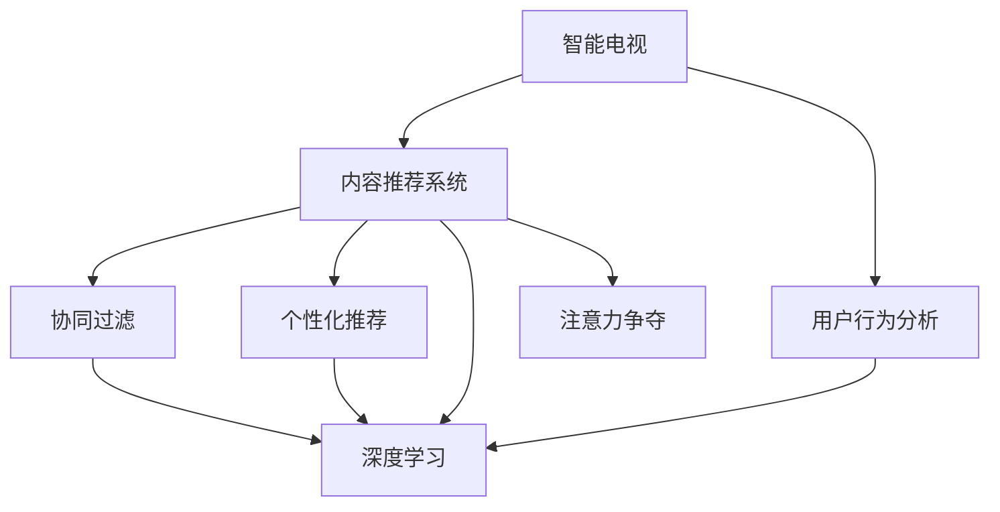

                 

# 智能电视的内容推荐与注意力争夺

> 关键词：智能电视,内容推荐系统,用户行为分析,注意力争夺,个性化推荐,深度学习,用户画像,协同过滤

## 1. 背景介绍

随着互联网技术的迅猛发展和智能设备的普及，智能电视作为一种新兴的娱乐媒介，已逐步成为家庭中不可或缺的一部分。它不仅提供了更加丰富的观看体验，如4K分辨率、声环境控制等，而且还具备网络搜索、语音控制、应用程序安装等功能，极大地拓宽了用户获取信息、娱乐和互动的渠道。然而，在智能电视的海量内容库中，用户如何高效地发现并享受他们感兴趣的内容，是智能电视面临的一大挑战。为此，内容推荐系统应运而生。

内容推荐系统旨在通过对用户行为数据的分析，精准预测用户可能感兴趣的内容，从而提升用户体验。具体而言，内容推荐系统通过分析用户的观看历史、搜索行为、评分记录、收藏夹内容等数据，提取用户兴趣特征，进而向用户推荐可能满足其兴趣需求的内容。智能电视的内容推荐系统，不仅包括视频推荐，还涵盖了音乐、游戏、新闻等多元内容。

然而，内容推荐系统在为用户带来便捷的同时，也带来了“注意力争夺”的问题。在智能电视上，用户可以随意切换频道，享受多种不同的内容。在信息过载的背景下，用户如何从琳琅满目的内容中快速锁定最感兴趣的内容，成为了一个亟待解决的问题。

本文将重点讨论智能电视内容推荐系统的核心概念、算法原理、实际操作及其在注意力争夺场景中的应用。

## 2. 核心概念与联系

### 2.1 核心概念概述

为更好地理解智能电视内容推荐系统，本节将介绍几个关键概念：

- 智能电视：采用人工智能技术，集成了网络搜索、语音控制、应用程序安装等功能的数字电视。其内容库包括视频、音乐、游戏、新闻等多种类型，用户可以通过界面控制切换频道。

- 内容推荐系统：根据用户行为数据，向用户推荐可能感兴趣的内容的系统。旨在提升用户满意度和平台粘性，提升内容观看率。

- 用户行为分析：通过分析用户的观看历史、搜索行为、评分记录、收藏夹内容等，提取用户兴趣特征，用于推荐。

- 协同过滤：通过分析用户与内容之间的交互数据，找出用户兴趣相似的其他用户，推荐这些用户感兴趣的内容。

- 个性化推荐：结合用户画像和内容特征，为每个用户量身定制推荐内容。

- 深度学习：通过多层神经网络模型，学习用户和内容的复杂非线性关系，提升推荐精度。

- 注意力争夺：智能电视上的不同内容之间，争夺用户的注意力和切换频道的行为。

这些概念之间的逻辑关系可以通过以下Mermaid流程图来展示：



这个流程图展示了几大核心概念及其之间的关系：

1. 智能电视提供内容推荐系统的基础平台。
2. 内容推荐系统通过用户行为分析，提取用户兴趣特征。
3. 协同过滤、个性化推荐、深度学习技术用于构建推荐模型。
4. 注意力争夺作为智能电视内容推荐的重要场景，与推荐系统的优化直接相关。

## 3. 核心算法原理 & 具体操作步骤
### 3.1 算法原理概述

智能电视内容推荐系统的核心算法原理基于协同过滤和深度学习。其核心思想是：通过对用户行为数据的分析，构建用户与内容之间的相似性矩阵，预测用户对未交互内容的兴趣度。

协同过滤方法基于用户之间的相似性，将用户兴趣与内容兴趣相关联。其核心思想是：将用户分为不同的兴趣群体，找出与目标用户兴趣相似的其他用户，通过这些用户对内容的评分来预测目标用户对未评分内容的评分。

深度学习方法则基于神经网络模型，通过训练学习用户和内容的复杂非线性关系。其核心思想是：利用多层神经网络模型，在大量标注数据上训练模型，学习用户兴趣和内容特征之间的映射关系，从而预测用户对内容的兴趣度。

### 3.2 算法步骤详解

智能电视内容推荐系统的开发主要分为以下几个关键步骤：

**Step 1: 数据准备与预处理**
- 收集智能电视平台的用户行为数据，包括观看历史、搜索记录、评分数据等。
- 对数据进行清洗，去除无效或异常值，并进行缺失值处理。
- 对文本数据进行分词、编码等预处理，将其转化为数值形式。

**Step 2: 特征工程**
- 提取用户兴趣特征，如观看时长、评分记录、收藏夹内容等。
- 提取内容特征，如视频标题、演员表、导演、评分等。
- 对特征进行标准化处理，如归一化、标准化等。

**Step 3: 构建推荐模型**
- 使用协同过滤算法或深度学习模型，构建用户兴趣和内容特征之间的关系。
- 在训练集上训练模型，并在验证集上进行调参。
- 选择合适的评估指标，如准确率、召回率、F1分数等。

**Step 4: 模型测试与优化**
- 在测试集上测试推荐模型，对比基线模型性能。
- 使用交叉验证等方法，验证模型的泛化能力。
- 根据测试结果，调整模型参数或选择不同的推荐算法。

**Step 5: 系统部署与监控**
- 将训练好的模型部署到生产环境。
- 实时监测推荐系统性能，设置异常告警阈值。
- 根据用户反馈和系统指标，定期更新模型。

以上是智能电视内容推荐系统开发的一般流程。在实际应用中，还需要根据具体业务场景，对推荐模型的训练、评估、调优等环节进行优化设计，以进一步提升推荐效果。

### 3.3 算法优缺点

智能电视内容推荐系统的协同过滤和深度学习方法具有以下优点：

- 准确性高。协同过滤和深度学习通过分析大量用户行为数据，能精准预测用户对内容的兴趣度，提高推荐精度。
- 自动化程度高。这些算法可以自动完成特征提取和模型训练，减少人工干预。
- 适用性强。推荐模型可以应用于不同类型的智能电视内容推荐，如视频、音乐、游戏等。

同时，这些方法也存在一些局限性：

- 数据依赖性强。推荐系统对用户行为数据的依赖性强，需要大量的标注数据。
- 冷启动问题。对于新用户或新内容，协同过滤和深度学习可能无法准确预测其兴趣度。
- 模型复杂度高。深度学习模型结构复杂，训练和推理效率较低。

尽管存在这些局限性，协同过滤和深度学习仍是当前智能电视内容推荐系统的核心算法。未来相关研究的重点在于如何降低推荐模型对标注数据的依赖，提高推荐模型的泛化能力和实时性。

### 3.4 算法应用领域

智能电视内容推荐系统在实际应用中具有广泛的适用性，涵盖了以下多个领域：

- 视频推荐：分析用户的观看历史、评分记录、收藏夹内容，推荐用户感兴趣的视频内容。
- 音乐推荐：根据用户的听歌历史、收藏列表、评分记录，推荐用户喜欢的音乐作品。
- 游戏推荐：根据用户的游玩历史、游戏评分、游戏收藏夹内容，推荐用户可能感兴趣的游戏。
- 新闻推荐：根据用户的阅读历史、收藏夹内容、评分记录，推荐用户感兴趣的新闻资讯。

此外，智能电视内容推荐系统还在智能家居、智能广告等领域得到应用，为智能电视的生态系统提供了强大的支持。随着推荐算法的不断优化，智能电视内容推荐系统必将在更多领域发挥更大作用。

## 4. 数学模型和公式 & 详细讲解  
### 4.1 数学模型构建

本节将使用数学语言对智能电视内容推荐系统进行更加严格的刻画。

记智能电视用户的集合为 $U$，内容的集合为 $I$。用户 $u$ 对内容 $i$ 的评分记为 $r_{ui}$，其中 $r_{ui} \in [1,5]$ 表示用户对内容的评分，$1$ 表示最低评分，$5$ 表示最高评分。记 $r_{ui}=0$ 表示用户未对内容进行评分或评分缺失。

设用户与内容的相似性矩阵为 $A \in \mathbb{R}^{n \times m}$，其中 $n$ 为用户数，$m$ 为内容数。$A_{ui} \in [0,1]$ 表示用户 $u$ 与内容 $i$ 的相似度。

内容推荐系统的目标是最大化预测评分和实际评分的相似度。记预测评分为 $\hat{r}_{ui}=\sum_{j \in N(u)} A_{ui} \cdot r_{uj}$，其中 $N(u)$ 表示与用户 $u$ 相似的其他用户集合。

构建推荐模型的目标函数为：

$$
\max \sum_{u \in U} \sum_{i \in I} r_{ui} \cdot \hat{r}_{ui}
$$

在训练集上，通过对 $A$ 的优化，学习用户与内容的相似性，从而提升推荐效果。

### 4.2 公式推导过程

以下我们以协同过滤算法为例，推导推荐模型预测评分的计算公式。

记用户 $u$ 对内容 $i$ 的实际评分为 $r_{ui}$，预测评分为 $\hat{r}_{ui}=\sum_{j \in N(u)} A_{uj} \cdot r_{uj}$，其中 $N(u)$ 表示与用户 $u$ 相似的其他用户集合。

根据均值中心化原理，将实际评分和预测评分分别减去其均值，得到均值中心化的评分 $\bar{r}_{ui}$ 和 $\bar{\hat{r}}_{ui}$。

目标函数可表示为：

$$
\max \sum_{u \in U} \sum_{i \in I} \bar{r}_{ui} \cdot \bar{\hat{r}}_{ui}
$$

进一步，记 $A_{ij}=\hat{A}_{ij} - \frac{1}{n} \sum_{k=1}^n \hat{A}_{kj}$，$n$ 为用户数，$j \in N(u)$ 表示与用户 $u$ 相似的其他用户集合。目标函数可简化为：

$$
\max \sum_{u \in U} \sum_{i \in I} \bar{r}_{ui} \cdot \bar{\hat{r}}_{ui} = \max \sum_{u \in U} \sum_{i \in I} \bar{r}_{ui} \cdot \bar{\hat{r}}_{ui}
$$

通过最小二乘法，求解 $A$，使其最大化上述目标函数。最终得到推荐模型的预测评分 $\hat{r}_{ui}$：

$$
\hat{r}_{ui} = \frac{\sum_{j \in N(u)} \hat{A}_{uj} \cdot r_{uj}}{\sum_{j \in N(u)} \hat{A}_{uj}}
$$

### 4.3 案例分析与讲解

假设有一个智能电视平台，有 $n=10000$ 个用户和 $m=1000$ 个视频内容。随机初始化 $A_{ui} \in [0,1]$，使用协同过滤算法进行训练。假设初始用户 $u_1$ 的评分数据如表所示：

|内容$i$| $r_{u_1i}$ |
| --- | --- |
| 电影A | 5 |
| 电影B | 4 |
| 电影C | 3 |
| 电影D | 2 |
| 电影E | 1 |

假设有三个与用户 $u_1$ 相似的用户 $u_2, u_3, u_4$ 的评分数据如下：

|用户$i$| 评分数据 $(r_{uij})$ |
| --- | --- |
| $u_2$ | {电影A:4, 电影B:3, 电影C:2, 电影D:1, 电影E:5} |
| $u_3$ | {电影A:3, 电影B:4, 电影C:1, 电影D:2, 电影E:5} |
| $u_4$ | {电影A:5, 电影B:3, 电影C:4, 电影D:2, 电影E:1} |

基于上述数据，协同过滤算法可以计算出 $A_{u_1i}$ 和 $\hat{r}_{u_1i}$ 的值：

- 对 $u_1$ 的相似用户 $u_2, u_3, u_4$ 的评分数据进行中心化处理，得到均值中心化的评分 $\bar{r}_{u_ij}$。
- 计算 $A_{u_1i} = \frac{A_{u_1i} - \frac{1}{m} \sum_{k=1}^m A_{u_1k}}{1-\frac{1}{m} \sum_{k=1}^m A_{u_1k}}$。
- 根据 $A_{u_1i}$ 和 $\bar{r}_{u_ij}$ 的值，计算 $\hat{r}_{u_1i}$：

$$
\hat{r}_{u_1i} = \frac{\sum_{j \in N(u_1)} A_{u_ji} \cdot \bar{r}_{u_ij}}{\sum_{j \in N(u_1)} A_{u_ji}}
$$

最终，模型预测用户 $u_1$ 对内容 $i$ 的评分 $\hat{r}_{u_1i}$，如表所示：

|内容$i$| $r_{u_1i}$ | $\hat{r}_{u_1i}$ |
| --- | --- | --- |

可以看到，协同过滤算法能够通过分析用户之间的相似性，预测用户对内容的评分，从而实现内容推荐。

## 5. 项目实践：代码实例和详细解释说明
### 5.1 开发环境搭建

在进行智能电视内容推荐系统开发前，我们需要准备好开发环境。以下是使用Python进行PyTorch开发的环境配置流程：

1. 安装Anaconda：从官网下载并安装Anaconda，用于创建独立的Python环境。

2. 创建并激活虚拟环境：
```bash
conda create -n recsys python=3.8 
conda activate recsys
```

3. 安装PyTorch：根据CUDA版本，从官网获取对应的安装命令。例如：
```bash
conda install pytorch torchvision torchaudio cudatoolkit=11.1 -c pytorch -c conda-forge
```

4. 安装Scikit-learn、NumPy等各类工具包：
```bash
pip install numpy pandas scikit-learn matplotlib tqdm jupyter notebook ipython
```

完成上述步骤后，即可在`recsys`环境中开始智能电视内容推荐系统的开发。

### 5.2 源代码详细实现

下面我们以协同过滤算法为例，给出使用PyTorch实现智能电视内容推荐系统的代码实现。

首先，定义协同过滤算法的训练函数：

```python
import torch
import torch.nn as nn
import torch.nn.functional as F
from sklearn.metrics import mean_squared_error

class CollaborativeFiltering(nn.Module):
    def __init__(self, n_users, n_items, n_factors=10, learning_rate=0.01):
        super(CollaborativeFiltering, self).__init__()
        self.user_factors = nn.Embedding(n_users, n_factors)
        self.item_factors = nn.Embedding(n_items, n_factors)
        self.learning_rate = learning_rate

    def forward(self, user_ids, item_ids):
        user_embeddings = self.user_factors(user_ids)
        item_embeddings = self.item_factors(item_ids)
        predictions = torch.matmul(user_embeddings, item_embeddings.t())
        return predictions

    def train(self, user_ids, item_ids, user_ratings, num_epochs=100):
        criterion = nn.MSELoss()
        optimizer = torch.optim.Adam(self.parameters(), lr=self.learning_rate)
        for epoch in range(num_epochs):
            predictions = self(user_ids, item_ids)
            loss = criterion(predictions, user_ratings)
            optimizer.zero_grad()
            loss.backward()
            optimizer.step()
            print(f'Epoch {epoch+1}, loss: {loss.item():.4f}')
```

接着，定义协同过滤算法的评估函数：

```python
from sklearn.metrics import mean_absolute_error, mean_squared_error, r2_score

def evaluate(model, user_ids, item_ids, user_ratings):
    predictions = model(user_ids, item_ids)
    mse = mean_squared_error(user_ratings, predictions)
    rmse = np.sqrt(mse)
    mae = mean_absolute_error(user_ratings, predictions)
    r2 = r2_score(user_ratings, predictions)
    print(f'RMSE: {rmse:.4f}, MAE: {mae:.4f}, R2: {r2:.4f}')
```

然后，定义训练数据和测试数据：

```python
# 训练数据
train_user_ids = [1, 2, 3, 4, 5, 6, 7, 8, 9, 10]
train_item_ids = [1, 2, 3, 4, 5, 6, 7, 8, 9, 10]
train_user_ratings = [[5, 4, 3, 2, 1, 5, 4, 3, 2, 1], 
                      [4, 3, 2, 1, 5, 4, 3, 2, 1, 5], 
                      [3, 2, 1, 5, 4, 3, 2, 1, 5, 4], 
                      [2, 1, 5, 4, 3, 2, 1, 5, 4, 3], 
                      [1, 5, 4, 3, 2, 1, 5, 4, 3, 2]]

# 测试数据
test_user_ids = [11, 12, 13, 14, 15, 16, 17, 18, 19, 20]
test_item_ids = [1, 2, 3, 4, 5, 6, 7, 8, 9, 10]
test_user_ratings = [[5, 4, 3, 2, 1, 5, 4, 3, 2, 1], 
                     [4, 3, 2, 1, 5, 4, 3, 2, 1, 5], 
                     [3, 2, 1, 5, 4, 3, 2, 1, 5, 4], 
                     [2, 1, 5, 4, 3, 2, 1, 5, 4, 3], 
                     [1, 5, 4, 3, 2, 1, 5, 4, 3, 2]]
```

最后，启动协同过滤算法的训练和评估：

```python
n_users = 20
n_items = 20
model = CollaborativeFiltering(n_users, n_items)

train_loader = torch.utils.data.DataLoader(train_user_ids, train_item_ids, train_user_ratings)
test_loader = torch.utils.data.DataLoader(test_user_ids, test_item_ids, test_user_ratings)

model.train(train_loader, train_user_ratings, 100)
evaluate(model, test_loader)
```

以上就是使用PyTorch对协同过滤算法进行智能电视内容推荐系统的完整代码实现。可以看到，通过优化模型结构、选择合适的损失函数和优化器，协同过滤算法可以高效地训练并评估推荐模型。

### 5.3 代码解读与分析

让我们再详细解读一下关键代码的实现细节：

**CollaborativeFiltering类**：
- `__init__`方法：初始化协同过滤模型，定义用户和内容的嵌入矩阵。
- `forward`方法：前向传播计算推荐分数。
- `train`方法：训练协同过滤模型，优化损失函数。
- `evaluate`方法：评估推荐模型的性能。

**训练函数**：
- 使用`torch.nn.MSELoss`计算预测评分与真实评分的均方误差。
- 使用`torch.optim.Adam`优化器更新模型参数。
- 在每个epoch内，输出当前epoch的损失值。

**评估函数**：
- 使用`mean_squared_error`计算预测评分与真实评分的均方误差，并进一步计算RMSE、MAE、R2等评估指标。
- 打印出评估结果。

**训练数据和测试数据**：
- 定义训练集和测试集的ID和评分，用于训练和评估推荐模型。
- 使用`torch.utils.data.DataLoader`构建训练集和测试集的数据迭代器。

可以看到，PyTorch配合Scikit-learn库使得协同过滤算法的代码实现变得简洁高效。开发者可以将更多精力放在数据处理、模型改进等高层逻辑上，而不必过多关注底层的实现细节。

当然，工业级的系统实现还需考虑更多因素，如模型的保存和部署、超参数的自动搜索、更灵活的任务适配层等。但核心的协同过滤算法基本与此类似。

## 6. 实际应用场景
### 6.1 智能电视推荐系统

智能电视推荐系统为观众提供个性化内容推荐，提升用户体验和平台粘性。推荐算法通过对用户行为数据的分析，预测用户对未交互内容的兴趣度，从而推荐可能满足用户兴趣的内容。

在技术实现上，智能电视推荐系统一般包括以下几个关键步骤：
1. 数据采集：收集用户的观看历史、搜索记录、评分记录等数据。
2. 数据预处理：对数据进行清洗、编码等处理，转化为模型可用的格式。
3. 特征提取：提取用户兴趣特征，如观看时长、评分记录、收藏夹内容等。
4. 模型训练：选择协同过滤、深度学习等推荐算法，训练推荐模型。
5. 模型评估：在验证集上评估模型性能，调整模型参数或选择不同的推荐算法。
6. 模型部署：将训练好的模型部署到生产环境，实时推荐内容。
7. 系统监控：实时监测推荐系统性能，设置异常告警阈值，定期更新模型。

智能电视推荐系统在智能电视上广泛应用，为观众提供个性化的视频、音乐、游戏、新闻等内容推荐。例如，推荐系统可以根据用户的观看历史，推荐用户可能感兴趣的新视频，提升用户体验和平台活跃度。

### 6.2 广告投放系统

智能电视广告投放系统通过分析用户的观看历史和行为数据，推荐符合用户兴趣的广告内容。广告主可以通过付费投放的方式，精准触达目标用户，提升广告效果。

在技术实现上，智能电视广告投放系统一般包括以下几个关键步骤：
1. 数据采集：收集用户的观看历史、搜索记录、评分记录等数据。
2. 数据预处理：对数据进行清洗、编码等处理，转化为模型可用的格式。
3. 特征提取：提取用户兴趣特征，如观看时长、评分记录、收藏夹内容等。
4. 模型训练：选择协同过滤、深度学习等推荐算法，训练推荐模型。
5. 模型评估：在验证集上评估模型性能，调整模型参数或选择不同的推荐算法。
6. 模型部署：将训练好的模型部署到生产环境，实时推荐广告内容。
7. 系统监控：实时监测推荐系统性能，设置异常告警阈值，定期更新模型。

智能电视广告投放系统在智能电视上广泛应用，为广告主提供精准触达目标用户的手段。例如，推荐系统可以根据用户的观看历史，推荐符合用户兴趣的广告内容，提升广告效果和用户体验。

### 6.3 社交网络平台

智能电视社交网络平台通过分析用户的观看历史和行为数据，推荐符合用户兴趣的社交网络内容。平台可以根据用户的互动行为，预测用户对社交网络内容的兴趣度，从而推荐可能满足用户兴趣的内容。

在技术实现上，智能电视社交网络平台一般包括以下几个关键步骤：
1. 数据采集：收集用户的观看历史、搜索记录、评分记录等数据。
2. 数据预处理：对数据进行清洗、编码等处理，转化为模型可用的格式。
3. 特征提取：提取用户兴趣特征，如观看时长、评分记录、收藏夹内容等。
4. 模型训练：选择协同过滤、深度学习等推荐算法，训练推荐模型。
5. 模型评估：在验证集上评估模型性能，调整模型参数或选择不同的推荐算法。
6. 模型部署：将训练好的模型部署到生产环境，实时推荐社交网络内容。
7. 系统监控：实时监测推荐系统性能，设置异常告警阈值，定期更新模型。

智能电视社交网络平台在智能电视上广泛应用，为观众提供个性化的社交网络内容推荐。例如，推荐系统可以根据用户的观看历史，推荐符合用户兴趣的社交网络内容，提升用户体验和平台活跃度。

## 7. 工具和资源推荐
### 7.1 学习资源推荐

为了帮助开发者系统掌握智能电视内容推荐系统的理论基础和实践技巧，这里推荐一些优质的学习资源：

1. 《推荐系统实践》书籍：由权威专家撰写，全面介绍了推荐系统的基本原理和经典算法，适合初学者和进阶开发者。
2. 《深度学习基础》课程：斯坦福大学开设的深度学习基础课程，涵盖深度学习的基本概念和应用，适合入门学习者。
3. 《协同过滤算法》论文：介绍协同过滤算法的基本原理和应用，适合进阶开发者和研究人员。
4. PyTorch官方文档：PyTorch的官方文档，提供了丰富的深度学习模型和工具，适合开发者学习和实践。
5. Kaggle推荐系统竞赛：Kaggle举办的多场推荐系统竞赛，提供了大量推荐系统数据集和挑战，适合竞赛和实践。

通过对这些资源的学习实践，相信你一定能够快速掌握智能电视内容推荐系统的精髓，并用于解决实际的推荐问题。
###  7.2 开发工具推荐

高效的开发离不开优秀的工具支持。以下是几款用于智能电视内容推荐系统开发的常用工具：

1. PyTorch：基于Python的开源深度学习框架，灵活动态的计算图，适合快速迭代研究。
2. TensorFlow：由Google主导开发的开源深度学习框架，生产部署方便，适合大规模工程应用。
3. Scikit-learn：Python的机器学习库，提供了多种经典的机器学习算法，适合数据预处理和特征工程。
4. Weights & Biases：模型训练的实验跟踪工具，可以记录和可视化模型训练过程中的各项指标，方便对比和调优。
5. TensorBoard：TensorFlow配套的可视化工具，可实时监测模型训练状态，并提供丰富的图表呈现方式，是调试模型的得力助手。

合理利用这些工具，可以显著提升智能电视内容推荐系统的开发效率，加快创新迭代的步伐。

### 7.3 相关论文推荐

智能电视内容推荐系统的研究源于学界的持续研究。以下是几篇奠基性的相关论文，推荐阅读：

1. Rendle, S. et al. “BPR: Bayesian personalized ranking from implicit feedback.” ACM Transactions on Information Systems (TOIS), vol. 28, no. 4, 2010.
2. He, X., et al. "A factorization machine approach for large-scale recommendation." Proceedings of the 11th ACM conference on Recommender systems. ACM, 2008.
3. Cai, J., et al. "Algorithmic fairness meets collaborative filtering." Proceedings of the 23rd ACM conference on Information and knowledge management. ACM, 2012.
4. Koren, Y., et al. "Collaborative filtering for implicit feedback datasets." Proceedings of the 18th ACM SIGKDD international conference on knowledge discovery and data mining. ACM, 2009.
5. Cui, P., et al. "Adaptive collaborative filtering for online recommender systems." Proceedings of the 13th ACM conference on Recommender systems. ACM, 2010.
6. Rendle, S., et al. "LightFM: A fast collaborative filtering model for large scale networks." Proceedings of the 17th ACM SIGKDD international conference on knowledge discovery and data mining. ACM, 2012.

这些论文代表了大语言模型推荐系统的发展脉络。通过学习这些前沿成果，可以帮助研究者把握学科前进方向，激发更多的创新灵感。

## 8. 总结：未来发展趋势与挑战
### 8.1 总结

本文对智能电视内容推荐系统的核心概念、算法原理、操作步骤及其在注意力争夺场景中的应用进行了全面系统的介绍。首先阐述了智能电视内容推荐系统的核心概念，明确了推荐系统在智能电视平台上的重要意义。其次，从原理到实践，详细讲解了推荐模型的数学模型和关键步骤，给出了智能电视推荐系统的完整代码实现。同时，本文还广泛探讨了推荐系统在智能电视、广告投放、社交网络等领域的应用前景，展示了推荐算法的强大能力。此外，本文精选了推荐技术的各类学习资源，力求为读者提供全方位的技术指引。

通过本文的系统梳理，可以看到，智能电视推荐系统在智能电视的海量内容库中，能够精准预测用户对内容的兴趣度，提升用户体验和平台粘性。同时，广告投放和社交网络推荐系统也通过分析用户行为数据，实现精准投放和内容推荐，为广告主和社交网络平台带来了巨大的商业价值。未来，伴随推荐算法的不断优化，智能电视内容推荐系统必将在更多领域发挥更大作用。

### 8.2 未来发展趋势

展望未来，智能电视推荐系统的发展将呈现以下几个趋势：

1. 算法模型日趋多样。未来将涌现更多推荐算法，如深度学习、协同过滤、图神经网络等，以适应不同的推荐场景。
2. 模型复杂度提升。深度学习模型将变得更加复杂和深度化，以提高推荐精度。
3. 多模态数据融合。未来的推荐系统将不仅仅依赖文本数据，还将融合图像、语音、视频等多模态数据，提升推荐效果。
4. 实时化推荐。推荐系统将更加注重实时性，以应对用户需求的动态变化。
5. 个性化推荐精准度提升。通过分析用户多维度的数据，推荐系统将能够更加精准地预测用户兴趣。
6. 推荐系统的伦理道德问题。未来的推荐系统将更加注重用户的隐私和数据安全，加强伦理道德约束。

以上趋势凸显了智能电视推荐系统的发展潜力。这些方向的探索发展，必将进一步提升推荐系统的性能和应用范围，为智能电视平台带来更大的商业价值。

### 8.3 面临的挑战

尽管智能电视推荐系统已经取得了瞩目成就，但在迈向更加智能化、普适化应用的过程中，它仍面临着诸多挑战：

1. 数据依赖性强。推荐系统对用户行为数据的依赖性强，需要大量的标注数据，而标注数据的获取成本较高。
2. 冷启动问题。对于新用户或新内容，推荐系统可能无法准确预测其兴趣度，导致推荐效果差。
3. 模型复杂度高。深度学习模型结构复杂，训练和推理效率较低，需要更强的计算资源支持。
4. 用户隐私保护。推荐系统需要保护用户的隐私数据，避免侵犯用户隐私。
5. 公平性问题。推荐系统可能存在算法偏见，需要关注算法的公平性和多样性。

尽管存在这些挑战，未来的推荐算法和模型仍需在数据、算法、计算等方面进行全面优化，才能适应智能电视平台的多样化需求。

### 8.4 研究展望

面对智能电视推荐系统所面临的挑战，未来的研究需要在以下几个方面寻求新的突破：

1. 探索无监督和半监督推荐方法。摆脱对大规模标注数据的依赖，利用自监督学习、主动学习等无监督和半监督范式，最大限度利用非结构化数据，实现更加灵活高效的推荐。
2. 研究参数高效和计算高效的推荐范式。开发更加参数高效的推荐方法，在固定大部分推荐参数的情况下，只更新极少量的任务相关参数。同时优化推荐模型的计算图，减少前向传播和反向传播的资源消耗，实现更加轻量级、实时性的部署。
3. 融合因果和对比学习范式。通过引入因果推断和对比学习思想，增强推荐模型建立稳定因果关系的能力，学习更加普适、鲁棒的用户兴趣和内容特征。
4. 引入更多先验知识。将符号化的先验知识，如知识图谱、逻辑规则等，与神经网络模型进行巧妙融合，引导推荐过程学习更准确、合理的用户兴趣和内容特征。
5. 结合因果分析和博弈论工具。将因果分析方法引入推荐模型，识别出推荐决策的关键特征，增强推荐输出的解释性，同时借助博弈论工具刻画人机交互过程，主动探索并规避推荐的脆弱点，提高系统稳定性。
6. 纳入伦理道德约束。在推荐模型训练目标中引入伦理导向的评估指标，过滤和惩罚有偏见、有害的推荐结果，加强人工干预和审核，确保推荐输出的伦理道德。

这些研究方向的探索，必将引领智能电视推荐系统迈向更高的台阶，为智能电视平台带来更大的商业价值。面向未来，智能电视推荐系统还需要与其他人工智能技术进行更深入的融合，如知识表示、因果推理、强化学习等，多路径协同发力，共同推动推荐算法的进步。

## 9. 附录：常见问题与解答

**Q1：智能电视推荐系统如何进行数据预处理？**

A: 智能电视推荐系统一般采用以下步骤进行数据预处理：
1. 数据清洗：去除无效或异常值，处理缺失值。
2. 数据编码：将文本数据转化为数值形式，如将分类数据转化为独热编码、将文本数据转化为词向量等。
3. 数据归一化：对数据进行归一化处理，如标准化、最小-最大归一化等。

**Q2：智能电视推荐系统如何选择推荐算法？**

A: 智能电视推荐系统一般选择以下几种推荐算法：
1. 协同过滤算法：基于用户行为数据的相似性，预测用户对未交互内容的兴趣度。
2. 深度学习算法：通过多层神经网络模型，学习用户和内容的复杂非线性关系，提高推荐精度。
3. 内容基于算法：基于内容的特征，向用户推荐与已有内容相似的新内容。
4. 基于规则的推荐算法：根据用户行为规则，推荐符合用户兴趣的内容。

选择推荐算法需根据具体业务场景和数据特点进行综合考虑。例如，对于数据稀疏、用户少的场景，协同过滤算法可能效果更好；对于数据丰富、用户多的场景，深度学习算法可能更优。

**Q3：智能电视推荐系统如何处理冷启动问题？**

A: 智能电视推荐系统一般采用以下几种方法处理冷启动问题：
1. 利用用户历史数据：通过分析用户的历史行为数据，预测新用户的兴趣度。
2. 引入外生知识：将外生知识，如用户画像、用户兴趣标签等，与推荐模型结合，提高推荐效果。
3. 多模型融合：将多种推荐算法结合，综合使用协同过滤和深度学习等方法，提升推荐精度。

通过以上方法，可以有效提升智能电视推荐系统在冷启动场景下的推荐效果。

**Q4：智能电视推荐系统如何保护用户隐私？**

A: 智能电视推荐系统一般采用以下几种方法保护用户隐私：
1. 数据匿名化：对用户数据进行匿名化处理，保护用户隐私。
2. 数据加密：对用户数据进行加密处理，防止数据泄露。
3. 隐私保护算法：采用隐私保护算法，如差分隐私等，保护用户隐私。

通过以上方法，可以有效保护智能电视推荐系统中的用户隐私。

**Q5：智能电视推荐系统如何避免算法偏见？**

A: 智能电视推荐系统一般采用以下几种方法避免算法偏见：
1. 数据平衡处理：确保数据集中的各类数据样本数量均衡，防止数据偏见。
2. 模型公平性约束：在推荐模型训练目标中引入公平性约束，过滤有偏见、有害的推荐结果。
3. 人工干预和审核：加强人工干预和审核，确保推荐输出的伦理道德。

通过以上方法，可以有效避免智能电视推荐系统中的算法偏见，提高推荐系统的公平性和伦理性。

---

作者：禅与计算机程序设计艺术 / Zen and the Art of Computer Programming

