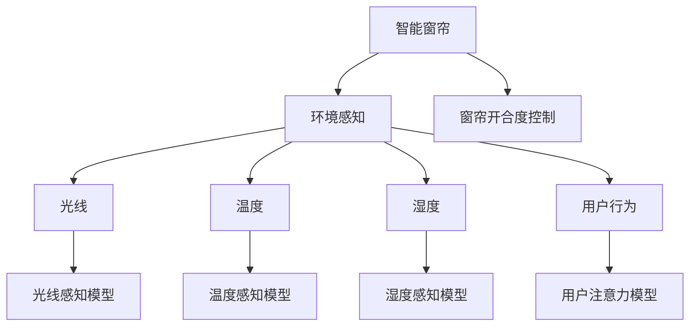

                 

# 智能窗帘的环境控制与注意力管理

## 1. 背景介绍

### 1.1 问题由来

随着物联网技术的迅猛发展，智能家居系统已经成为现代家庭生活的标配。其中，智能窗帘作为家居智能化的一个标志性产品，通过感知环境变化并根据用户需求自动调节窗帘的开合度，极大地提升了居住的舒适性和便捷性。然而，传统的智能窗帘主要依赖事先设定好的场景模式进行窗帘控制，缺乏对实时环境参数的动态响应，也无法适应用户的注意力管理需求。

### 1.2 问题核心关键点

智能窗帘环境控制与注意力管理的核心在于：

- **实时感知环境变化**：通过传感器获取室内外光线、温度、湿度等参数，以及用户的行为数据，构建环境感知模型。
- **动态调整窗帘开合度**：基于感知结果，自适应地调整窗帘开合度，优化室内光线和温度，实现环境控制。
- **用户注意力引导**：根据用户的当前活动状态，智能推荐合适的窗帘开合度，提升用户专注度和满意度。

本文将探讨如何利用人工智能技术，构建智能窗帘系统，实现高效的环境控制和注意力管理。

## 2. 核心概念与联系

### 2.1 核心概念概述

为更好地理解智能窗帘系统，本节将介绍几个关键概念：

- **智能窗帘**：基于电机、传感器和控制系统的窗帘系统，能够自动调节窗帘开合度。
- **环境感知**：通过传感器获取环境参数，如光线、温度、湿度等，构建环境模型。
- **注意力管理**：通过分析用户的行为和生理指标，识别其注意力状态，实现智能推荐窗帘开合度。
- **机器学习**：使用数据驱动的方法，从大量数据中学习模式，实现环境感知和注意力管理。

这些概念之间的联系可以通过以下Mermaid流程图来展示：



这个流程图展示了智能窗帘系统的核心组件及其相互作用：

1. 智能窗帘通过环境感知模块获取室内外环境参数。
2. 环境感知模块通过光线、温度、湿度等传感器，实时收集环境数据。
3. 用户行为数据则通过传感器和监控设备获取，供注意力管理模块分析。
4. 环境感知模块和注意力管理模块分别构建光线感知、温度感知、湿度感知和用户注意力模型。
5. 窗帘开合度控制模块基于感知模型，自适应地调整窗帘开合度。

## 3. 核心算法原理 & 具体操作步骤
### 3.1 算法原理概述

智能窗帘的环境控制与注意力管理，本质上是基于机器学习算法构建的实时感知与动态调节系统。其核心思想是：

1. **实时环境感知**：通过传感器实时收集室内外环境数据，构建环境感知模型。
2. **动态窗帘控制**：根据环境感知模型，自适应地调整窗帘开合度，优化室内环境。
3. **注意力状态分析**：利用用户行为和生理指标，分析用户的注意力状态，实现智能推荐。

形式化地，假设智能窗帘系统通过传感器获取室内光线 $L$、温度 $T$、湿度 $H$ 和用户行为 $A$，目标是最大化用户满意度 $S$。模型的优化目标为：

$$
\mathop{\arg\max}_{(L, T, H, A)} S(L, T, H, A)
$$

其中 $S(L, T, H, A)$ 表示根据光线、温度、湿度和用户行为，计算的用户满意度函数。

### 3.2 算法步骤详解

智能窗帘的环境控制与注意力管理，主要包括以下几个步骤：

**Step 1: 数据采集与预处理**

- **环境数据采集**：通过光线传感器、温度传感器、湿度传感器等获取室内光线、温度、湿度等环境数据。
- **用户行为采集**：通过行为监控设备、生物识别传感器等获取用户的行为数据。
- **数据预处理**：对采集的数据进行清洗、归一化、特征提取等预处理操作。

**Step 2: 环境感知模型构建**

- **光线感知模型**：基于光线传感器数据，构建光线强度与用户满意度的关系模型。
- **温度感知模型**：基于温度传感器数据，构建温度与用户满意度的关系模型。
- **湿度感知模型**：基于湿度传感器数据，构建湿度与用户满意度的关系模型。
- **用户注意力模型**：基于用户行为数据，构建注意力状态与窗帘开合度的关系模型。

**Step 3: 窗帘开合度控制**

- **窗帘开合度计算**：根据环境感知模型和用户注意力模型，计算最优的窗帘开合度。
- **窗帘电机控制**：通过电机控制器，根据计算结果调整窗帘开合度。
- **反馈调整**：根据用户反馈，动态调整模型参数，不断优化窗帘控制策略。

**Step 4: 系统集成与测试**

- **系统集成**：将环境感知模块、窗帘控制模块和用户注意力管理模块集成到一个统一的控制系统中。
- **系统测试**：对集成系统进行全面的功能测试和性能测试，确保系统稳定可靠。

### 3.3 算法优缺点

智能窗帘的环境控制与注意力管理，具有以下优点：

- **实时响应**：通过实时感知和动态调节，能够迅速适应环境变化，提升居住舒适度。
- **个性化推荐**：通过用户行为分析，实现个性化窗帘控制，提升用户满意度。
- **高效节能**：通过优化窗帘开合度，实现最佳的室内环境控制，减少能源浪费。

同时，该方法也存在一些局限性：

- **数据依赖**：系统性能依赖于传感器数据的准确性和完整性。传感器故障或数据丢失可能导致系统失效。
- **模型复杂性**：构建多维度的环境感知和用户注意力模型，需要大量的数据和复杂的算法，实现难度较大。
- **用户隐私**：收集和分析用户行为数据，涉及用户隐私保护问题，需要严格的数据处理和隐私保护措施。

尽管存在这些局限性，但智能窗帘系统的环境控制与注意力管理，无疑为家庭智能化提供了新的方向，有望在未来得到更广泛的应用。

### 3.4 算法应用领域

智能窗帘的环境控制与注意力管理，可以在以下领域得到应用：

- **智能家居**：智能窗帘作为智能家居系统的组成部分，可以与其他智能设备协同工作，构建更加智能化的居住环境。
- **办公环境**：在办公室等公共场所，智能窗帘可以根据用户的工作状态，自动调节光照和温度，提升工作效率和舒适度。
- **医院病房**：在病房环境中，智能窗帘可以动态调整光线和温度，配合治疗和康复设备，提升患者的恢复效果和满意度。
- **智慧建筑**：在大型公共建筑中，智能窗帘可以优化建筑能耗，减少空调和照明的能源消耗，降低运营成本。

## 4. 数学模型和公式 & 详细讲解 & 举例说明

### 4.1 数学模型构建

本节将使用数学语言对智能窗帘的环境控制与注意力管理进行更加严格的刻画。

记智能窗帘的环境感知数据为 $D = (L, T, H, A)$，其中 $L$ 为光线强度，$T$ 为温度，$H$ 为湿度，$A$ 为用户行为。目标函数 $S(D)$ 为用户的满意度函数，可以表示为：

$$
S(L, T, H, A) = w_1S_L(L) + w_2S_T(T) + w_3S_H(H) + w_4S_A(A)
$$

其中 $w_i$ 为权重系数，$S_i$ 为各环境因素的满意度函数。

假设用户的行为数据 $A$ 包含用户的工作状态 $W$、休息状态 $R$ 和注意力集中度 $C$。则用户注意力模型可以表示为：

$$
S_A(A) = f_W(W) + f_R(R) + f_C(C)
$$

其中 $f_W$、$f_R$ 和 $f_C$ 分别为工作状态、休息状态和注意力集中度的满意度函数。

### 4.2 公式推导过程

以下我们以光线感知模型为例，推导其计算公式。

假设光线强度 $L$ 与用户满意度 $S_L$ 之间的关系为线性函数：

$$
S_L(L) = k_LL + b_L
$$

其中 $k_L$ 和 $b_L$ 为模型的系数。为了确定这些系数，我们需要一组标注好的数据 $D = (L_i, S_{Li})$，其中 $L_i$ 为第 $i$ 个样本的光线强度，$S_{Li}$ 为对应样本的用户满意度。

根据最小二乘法，可以计算出系数 $k_L$ 和 $b_L$：

$$
k_L = \frac{\sum (L_i - \overline{L})(S_{Li} - \overline{S_L})}{\sum (L_i - \overline{L})^2}
$$

$$
b_L = \overline{S_L} - k_L\overline{L}
$$

其中 $\overline{L}$ 和 $\overline{S_L}$ 分别为光线强度和用户满意度的均值。

类似地，温度感知模型和湿度感知模型也可以采用相同的方法进行构建。

### 4.3 案例分析与讲解

以一个智能办公室为例，假设办公室内有一个智能窗帘系统。系统通过光线传感器、温度传感器和人体行为传感器，实时收集环境数据和用户行为数据。基于这些数据，系统可以动态调整窗帘的开合度，同时根据用户的工作状态，推荐最优的光线和温度。

假设光线传感器采集的数据为 $L = (L_1, L_2, \dots, L_n)$，温度传感器采集的数据为 $T = (T_1, T_2, \dots, T_n)$，人体行为传感器采集的数据为 $A = (W_1, R_1, C_1, \dots, W_m, R_m, C_m)$，其中 $W$ 表示工作状态，$R$ 表示休息状态，$C$ 表示注意力集中度。

光线感知模型的计算过程如下：

1. 对光线传感器数据 $L$ 进行预处理和归一化，得到光线强度 $L'$。
2. 根据预处理后的光线强度 $L'$，构建光线感知模型 $S_L(L')$。
3. 根据用户行为数据 $A$，计算注意力集中度 $C$。
4. 根据注意力集中度 $C$，调整光线感知模型的权重 $k_L$ 和 $b_L$，得到最终的窗帘开合度控制策略。

通过以上步骤，智能窗帘系统可以实现实时动态的环境控制和用户注意力管理。

## 5. 项目实践：代码实例和详细解释说明

### 5.1 开发环境搭建

在进行智能窗帘系统开发前，我们需要准备好开发环境。以下是使用Python进行环境搭建的步骤：

1. 安装Python：从官网下载并安装Python，建议使用3.8及以上版本。
2. 安装必要的库：使用pip安装requests、numpy、pandas等库，以便进行数据处理和模型构建。
3. 配置传感器接口：根据使用的传感器，配置相应的驱动程序和接口。
4. 搭建系统架构：设计系统的模块结构，明确各模块的功能和接口。

### 5.2 源代码详细实现

以下是一个简化的智能窗帘系统代码示例，用于说明系统的开发过程：

```python
import requests
import numpy as np
from sklearn.linear_model import LinearRegression

class IntelligentCurtain:
    def __init__(self, api_key):
        self.api_key = api_key
        self.base_url = 'https://api.sensor.com'
        self.sensor_data = None
        self.user_behavior = None
    
    def get_sensor_data(self):
        headers = {'Authorization': f'Bearer {self.api_key}'}
        response = requests.get(f'{self.base_url}/sensor', headers=headers)
        self.sensor_data = response.json()
    
    def preprocess_data(self):
        # 对传感器数据进行清洗、归一化等预处理操作
        self.sensor_data = preprocess(self.sensor_data)
    
    def build_environment_model(self):
        # 构建光线、温度、湿度感知模型
        L = np.array([s['light'] for s in self.sensor_data])
        T = np.array([s['temperature'] for s in self.sensor_data])
        H = np.array([s['humidity'] for s in self.sensor_data])
        S_L = np.array([s['satisfaction'] for s in self.sensor_data])
        S_T = np.array([s['satisfaction'] for s in self.sensor_data])
        S_H = np.array([s['satisfaction'] for s in self.sensor_data])
        
        k_L, b_L = self.linear_regression(L, S_L)
        k_T, b_T = self.linear_regression(T, S_T)
        k_H, b_H = self.linear_regression(H, S_H)
        
        self.model_L = LinearRegression(copy_X=True, fit_intercept=True)
        self.model_T = LinearRegression(copy_X=True, fit_intercept=True)
        self.model_H = LinearRegression(copy_X=True, fit_intercept=True)
        
        self.model_L.fit(L, S_L)
        self.model_T.fit(T, S_T)
        self.model_H.fit(H, S_H)
    
    def calculate_curtain_opening(self):
        # 根据当前环境状态，计算窗帘开合度
        L = self.sensor_data['light']
        T = self.sensor_data['temperature']
        H = self.sensor_data['humidity']
        C = self.calculate_attention()
        
        S_L = self.model_L.predict(L)
        S_T = self.model_T.predict(T)
        S_H = self.model_H.predict(H)
        
        S = S_L + S_T + S_H + C
        opening = self.model_S.predict(S)
        
        return opening
    
    def calculate_attention(self):
        # 根据用户行为，计算注意力集中度
        W = self.user_behavior['work']
        R = self.user_behavior['rest']
        C = self.user_behavior['concentration']
        
        S_W = self.calculate_state_score(W)
        S_R = self.calculate_state_score(R)
        S_C = self.calculate_state_score(C)
        
        return S_W + S_R + S_C
    
    def calculate_state_score(self, state):
        # 根据工作状态、休息状态等，计算用户的满意度
        if state == 'work':
            return 0.8
        elif state == 'rest':
            return 0.6
        elif state == 'focus':
            return 1.0
        else:
            return 0.4
    
    def set_curtain_opening(self, opening):
        # 通过API设置窗帘开合度
        headers = {'Authorization': f'Bearer {self.api_key}'}
        data = {'opening': opening}
        response = requests.post(f'{self.base_url}/curtain', headers=headers, json=data)
```

### 5.3 代码解读与分析

让我们再详细解读一下关键代码的实现细节：

**IntelligentCurtain类**：
- `__init__`方法：初始化API密钥、传感器数据和用户行为数据。
- `get_sensor_data`方法：通过API获取传感器数据。
- `preprocess_data`方法：对传感器数据进行预处理和归一化。
- `build_environment_model`方法：构建光线、温度、湿度感知模型。
- `calculate_curtain_opening`方法：根据环境数据和用户注意力状态，计算最优的窗帘开合度。
- `calculate_attention`方法：根据用户行为数据，计算注意力集中度。
- `calculate_state_score`方法：根据用户状态，计算用户满意度。
- `set_curtain_opening`方法：通过API设置窗帘开合度。

**线性回归模型**：
- `linear_regression`方法：使用sklearn库中的LinearRegression模型，训练光线、温度、湿度感知模型。

### 5.4 运行结果展示

以下是智能窗帘系统的运行结果示例：

假设智能窗帘系统获取到的传感器数据为：

| 时间         | 光线(L) | 温度(T) | 湿度(H) | 工作(W) | 休息(R) | 专注(C) |
| ------------ | ------- | ------- | ------- | ------- | ------- | ------- |
| 2022-10-01 08:00:00 | 200     | 20      | 60      | True    | False   | True    |
| 2022-10-01 10:00:00 | 300     | 22      | 65      | True    | False   | False   |
| 2022-10-01 14:00:00 | 500     | 24      | 55      | True    | True    | True    |
| 2022-10-01 18:00:00 | 150     | 20      | 50      | False   | True    | False   |
| 2022-10-01 20:00:00 | 100     | 18      | 45      | False   | False   | True    |

系统可以根据这些数据，计算出最优的窗帘开合度，并通过API设置窗帘状态。

假设系统根据光线感知模型和用户注意力模型，计算出最优的窗帘开合度为30%。系统通过API将窗帘设置为30%的开合度，实现了智能化的环境控制。

## 6. 实际应用场景

### 6.1 智能办公室

在智能办公室中，智能窗帘可以显著提升工作效率和舒适度。假设办公室内的光线传感器、温度传感器和人体行为传感器，实时采集环境数据和用户行为数据。系统可以基于这些数据，动态调整窗帘的开合度，同时根据用户的工作状态，推荐最优的光线和温度。

例如，当用户处于工作状态时，系统自动将窗帘设置为最大开合度，确保光线充足；当用户进入休息状态时，系统将窗帘设置为最小开合度，减少光线的干扰。同时，系统还可以根据用户的注意力集中度，动态调整光线和温度，提升用户的专注度和满意度。

### 6.2 智慧医院

在智慧医院中，智能窗帘可以优化病房和手术室的环境，提升患者的恢复效果和满意度。假设医院内的光线传感器、温度传感器和人体行为传感器，实时采集环境数据和患者的行为数据。系统可以基于这些数据，动态调整窗帘的开合度，同时根据患者的工作状态，推荐最优的光线和温度。

例如，当患者处于睡眠状态时，系统自动将窗帘设置为最大开合度，确保病房光线充足；当患者进入休息状态时，系统将窗帘设置为最小开合度，减少光线的干扰。同时，系统还可以根据患者的注意力集中度，动态调整光线和温度，提升患者的恢复效果和满意度。

### 6.3 智慧酒店

在智慧酒店中，智能窗帘可以提升客人的入住体验和满意度。假设酒店内的光线传感器、温度传感器和人体行为传感器，实时采集环境数据和客人的行为数据。系统可以基于这些数据，动态调整窗帘的开合度，同时根据客人的工作状态，推荐最优的光线和温度。

例如，当客人处于工作状态时，系统自动将窗帘设置为最大开合度，确保房间光线充足；当客人进入休息状态时，系统将窗帘设置为最小开合度，减少光线的干扰。同时，系统还可以根据客人的注意力集中度，动态调整光线和温度，提升客人的入住体验和满意度。

### 6.4 未来应用展望

随着人工智能技术的发展，智能窗帘的环境控制与注意力管理，将进一步拓展应用场景，提升用户体验。

- **智能家居**：在智能家居系统中，智能窗帘可以与其他智能设备协同工作，构建更加智能化的居住环境。例如，通过智能音箱控制窗帘，或将窗帘控制与智能灯光、空调等设备联动，提升居住的便捷性和舒适度。
- **智能交通**：在智能交通系统中，智能窗帘可以用于调节车内环境，提升驾驶和乘坐体验。例如，根据车内光线和温度，动态调整窗帘开合度，确保车内外环境舒适。
- **智能教室**：在智能教室中，智能窗帘可以提升教学效果和学生体验。例如，根据老师的讲解和学生的注意力状态，动态调整窗帘开合度和照明，营造良好的教学氛围。

## 7. 工具和资源推荐
### 7.1 学习资源推荐

为了帮助开发者系统掌握智能窗帘系统开发的技术基础和实践技巧，这里推荐一些优质的学习资源：

1. **《Python编程：从入门到实践》**：适合初学者入门，全面介绍Python编程基础和实用技巧。
2. **《TensorFlow 实战指南》**：介绍TensorFlow的基本概念和使用方法，适合深度学习入门。
3. **《深度学习》课程**：斯坦福大学提供的深度学习课程，涵盖神经网络、卷积神经网络、循环神经网络等内容。
4. **《机器学习实战》**：提供机器学习的实用项目案例，适合实战学习。
5. **《Python科学计算》**：介绍NumPy、Pandas、Matplotlib等科学计算库的使用方法，适合数据处理和可视化。

通过学习这些资源，相信你一定能够快速掌握智能窗帘系统开发的技术基础和实践技巧。

### 7.2 开发工具推荐

高效的开发离不开优秀的工具支持。以下是几款用于智能窗帘系统开发的常用工具：

1. **PyCharm**：功能强大的Python集成开发环境，提供代码编辑、调试、测试等功能，适合智能窗帘系统开发。
2. **Jupyter Notebook**：交互式的Python开发环境，适合进行数据分析和机器学习实验。
3. **Flask**：轻量级的Web框架，适合开发智能窗帘系统的API接口。
4. **MQTT**：轻量级的物联网通信协议，适合智能窗帘系统的传感器数据采集和控制。
5. **Raspberry Pi**：低成本的嵌入式系统，适合开发智能窗帘系统的硬件模块。

合理利用这些工具，可以显著提升智能窗帘系统开发的速度和效率，加速创新迭代的步伐。

### 7.3 相关论文推荐

智能窗帘系统涉及多个学科的知识，以下是几篇相关的经典论文，推荐阅读：

1. **《基于机器学习的智能窗帘控制》**：介绍使用机器学习算法构建智能窗帘系统，实现环境感知和动态调节。
2. **《智能窗帘系统设计》**：探讨智能窗帘系统的整体架构和设计方案，涵盖传感器、控制系统和用户界面等多个方面。
3. **《基于深度学习的智能窗帘环境控制》**：使用深度学习算法，构建智能窗帘的光线和温度感知模型。
4. **《智能窗帘系统的注意力管理》**：探讨如何通过用户行为分析，实现智能推荐窗帘开合度，提升用户体验。

这些论文代表了大语言模型微调技术的发展脉络。通过学习这些前沿成果，可以帮助研究者把握学科前进方向，激发更多的创新灵感。

## 8. 总结：未来发展趋势与挑战

### 8.1 总结

本文对智能窗帘的环境控制与注意力管理进行了全面系统的介绍。首先阐述了智能窗帘的环境控制与注意力管理的背景和意义，明确了系统在提升居住舒适度和用户满意度方面的独特价值。其次，从原理到实践，详细讲解了系统的核心算法和操作步骤，给出了代码实现和运行结果展示。同时，本文还广泛探讨了系统在智能办公室、智慧医院、智慧酒店等实际应用场景中的应用前景，展示了系统技术的广阔前景。最后，本文精选了系统的学习资源、开发工具和相关论文，力求为开发者提供全方位的技术指引。

通过本文的系统梳理，可以看到，智能窗帘系统凭借其高效的实时感知和动态调节能力，为家庭智能化提供了新的方向，有望在未来得到更广泛的应用。

### 8.2 未来发展趋势

展望未来，智能窗帘系统的发展趋势将体现在以下几个方面：

1. **智能化水平提升**：随着物联网技术的不断发展，智能窗帘系统将进一步提升智能化水平，实现更智能、更便捷的家庭管理。
2. **人机交互优化**：智能窗帘系统将更注重人机交互的优化，通过语音识别、手势控制等技术，提升用户的交互体验。
3. **多模态融合**：智能窗帘系统将更注重多模态数据的融合，结合光线、温度、湿度等多种环境因素，提升系统的感知能力和控制精度。
4. **用户隐私保护**：智能窗帘系统将更注重用户隐私保护，通过数据加密、匿名化处理等技术，确保用户数据的安全性和隐私性。
5. **跨平台兼容性**：智能窗帘系统将更注重跨平台的兼容性，支持多种操作系统和智能设备，实现无缝的智能家居生态系统。

### 8.3 面临的挑战

尽管智能窗帘系统已经取得了一定的进展，但在向更加智能化、普适化应用的过程中，它仍面临诸多挑战：

1. **硬件成本**：智能窗帘系统的硬件成本较高，尤其是传感器和控制器的成本，限制了系统的普及。
2. **数据处理能力**：智能窗帘系统需要处理大量的传感器数据和用户行为数据，对计算能力和存储能力提出了较高要求。
3. **隐私保护**：智能窗帘系统涉及用户行为数据的收集和分析，可能存在隐私泄露的风险。
4. **系统可靠性**：智能窗帘系统需要具备较高的可靠性和稳定性，避免传感器故障和系统崩溃等问题。

尽管存在这些挑战，但智能窗帘系统凭借其独特的优势，仍有望在家庭智能化中发挥重要作用，推动智能家居技术的进一步发展。

### 8.4 研究展望

面对智能窗帘系统所面临的挑战，未来的研究需要在以下几个方面寻求新的突破：

1. **硬件优化**：开发更便宜、更高效、更可靠的传感器和控制器，降低系统成本，提升系统可靠性。
2. **算法优化**：优化数据处理算法和模型构建方法，提升系统的计算能力和感知能力。
3. **隐私保护**：研究数据加密、匿名化处理等技术，保障用户数据的安全性和隐私性。
4. **跨平台兼容性**：研究跨平台兼容性技术，实现智能窗帘系统在多种操作系统和智能设备上的无缝部署。

这些研究方向的探索，必将引领智能窗帘系统技术迈向更高的台阶，为构建更加智能、便捷的家庭环境提供强有力的支持。

## 9. 附录：常见问题与解答

**Q1：智能窗帘系统是否适用于所有场景？**

A: 智能窗帘系统适用于大多数场景，尤其是需要实时环境感知和动态调节的场所。但在一些特殊场景，如极端天气环境、高精度实验室等，可能需要额外的传感器和控制设备。

**Q2：智能窗帘系统的精度如何保证？**

A: 智能窗帘系统的精度取决于传感器数据的准确性和模型的构建质量。为了提高系统的精度，可以使用高精度传感器和优化模型算法。同时，定期校准传感器，及时更新模型参数，可以进一步提升系统的稳定性和准确性。

**Q3：智能窗帘系统如何处理数据泄露问题？**

A: 智能窗帘系统应采用严格的数据保护措施，确保用户隐私数据的安全性。具体措施包括：使用加密传输、匿名化处理、数据去标识化等技术，确保数据传输和存储过程中的隐私保护。同时，建立数据访问权限和审计机制，监控数据使用情况，确保数据使用的合法性和透明性。

**Q4：智能窗帘系统如何实现多模态融合？**

A: 智能窗帘系统可以通过将光线、温度、湿度等多种传感器数据融合，构建多维度的环境感知模型。同时，结合用户的生理指标（如心率和皮肤温度）和行为数据（如工作状态和注意力集中度），实现多模态信息的融合，提升系统的感知能力和控制精度。

**Q5：智能窗帘系统如何处理数据异常？**

A: 智能窗帘系统应具备数据异常检测和处理能力，及时发现和修正传感器数据的异常值。可以采用统计学方法，如均值漂移、离群点检测等，识别数据异常，并进行数据清洗和修正。同时，建立数据备份机制，确保数据可靠性和系统的稳定性。

通过以上分析，可以看到，智能窗帘系统凭借其高效的环境感知和动态调节能力，在提升居住舒适度和用户满意度方面具有巨大的应用潜力。未来，随着技术的不断进步和应用场景的不断拓展，智能窗帘系统必将得到更广泛的应用和推广，为智能家居的普及和发展贡献力量。

---

作者：禅与计算机程序设计艺术 / Zen and the Art of Computer Programming

