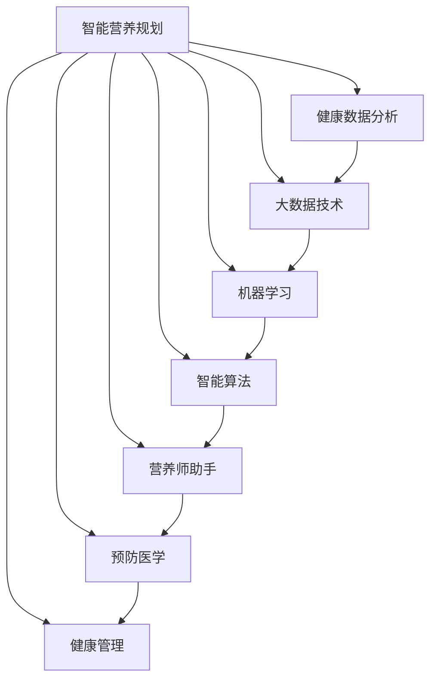

                 

# 智能营养规划创业：个性化饮食的科学指导

> 关键词：智能营养规划, 个性化饮食, 健康数据分析, 大数据技术, 机器学习, 智能算法, 营养师助手, 预防医学, 健康管理

## 1. 背景介绍

### 1.1 问题由来
现代生活节奏快，人们越来越重视健康问题，特别是对于饮食健康。然而，每个人的身体状况、生活习惯、工作压力等不同，导致需要个性化的饮食指导。传统的人工营养咨询由于时间和成本的限制，难以满足大规模人群的需求。因此，基于大数据技术和机器学习算法的智能营养规划应运而生，它能够根据个体的生理特征和生活习惯，提供科学的饮食建议。

### 1.2 问题核心关键点
智能营养规划的核心在于如何构建高效的个性化饮食推荐系统，利用数据挖掘、机器学习等技术，结合个体健康数据，实现饮食的智能化。该系统的核心流程包括数据收集、特征提取、模型训练和推荐结果输出。关键在于选择合适的特征、设计有效的模型和算法、优化推荐系统性能。

## 2. 核心概念与联系

### 2.1 核心概念概述

为更好地理解智能营养规划的实现过程，本节将介绍几个密切相关的核心概念：

- 智能营养规划：利用大数据和机器学习算法，根据个体的健康数据和生活习惯，提供个性化的饮食建议。
- 健康数据分析：从健康检测设备或应用程序中收集个体健康数据，如体重、血压、血糖等生理指标，通过数据清洗和特征提取，生成可用于模型训练的数据集。
- 大数据技术：指利用分布式存储和计算系统，高效存储和处理海量数据，为智能营养规划提供数据支持。
- 机器学习：通过设计合适的模型和算法，从历史数据中学习规律，生成个性化的饮食建议。
- 智能算法：包括推荐算法、聚类算法、时间序列分析算法等，用于优化推荐系统和数据分析过程。
- 营养师助手：智能营养规划系统可以视为一种虚拟营养师助手，提供持续的个性化饮食建议和健康指导。
- 预防医学：利用智能营养规划系统，通过早期干预和饮食调整，预防疾病发生，提高生活质量。
- 健康管理：利用智能营养规划系统，实现健康数据的实时监测和反馈，提供全面的健康管理方案。

这些核心概念之间的逻辑关系可以通过以下Mermaid流程图来展示：



这个流程图展示了这个系统的核心组件及其之间的关系：

1. 智能营养规划系统的输入是健康数据分析模块提供的数据。
2. 利用大数据技术对数据进行高效存储和处理。
3. 机器学习算法对数据进行建模，并生成推荐结果。
4. 智能算法对推荐结果进行优化和改进。
5. 营养师助手根据推荐结果提供个性化饮食建议。
6. 预防医学和健康管理应用推荐结果，实现疾病预防和健康管理。

## 3. 核心算法原理 & 具体操作步骤
### 3.1 算法原理概述

智能营养规划的核心算法包括特征提取、模型训练和推荐算法。以下详细解释这些核心算法的原理：

- 特征提取：从健康检测设备或应用程序中收集个体健康数据，如体重、血压、血糖等生理指标，通过数据清洗和特征提取，生成可用于模型训练的数据集。
- 模型训练：利用历史健康数据和推荐结果，训练推荐模型，学习个性化饮食建议的规律。
- 推荐算法：基于已训练的模型，根据当前个体健康数据和生活习惯，生成个性化的饮食建议。

### 3.2 算法步骤详解

智能营养规划的实现步骤如下：

1. **数据收集与预处理**：
   - 使用健康监测设备收集个体的生理指标，如体重、血压、血糖等。
   - 对数据进行清洗、去重和标准化处理，确保数据质量和一致性。
   - 将数据转化为可用于模型训练的格式。

2. **特征提取与选择**：
   - 选择影响饮食推荐的特征，如年龄、性别、运动量、饮食习惯等。
   - 使用PCA等降维技术，减少特征维度，提高模型训练效率。

3. **模型训练与优化**：
   - 选择适当的机器学习算法，如回归模型、决策树、随机森林等。
   - 使用历史健康数据和推荐结果，训练模型，学习个性化的饮食建议。
   - 使用交叉验证等技术，优化模型参数，提高模型精度。

4. **推荐算法实现**：
   - 根据当前个体健康数据和生活习惯，生成个性化的饮食建议。
   - 使用协同过滤、基于内容的推荐等算法，提高推荐系统的性能。
   - 引入时间序列分析算法，考虑饮食建议的时间效应。

5. **反馈与迭代**：
   - 收集用户对推荐结果的反馈，用于进一步优化推荐算法。
   - 持续迭代模型和推荐算法，确保推荐结果的时效性和准确性。

### 3.3 算法优缺点

智能营养规划算法具有以下优点：
- 个性化：根据个体健康数据和生活习惯，提供个性化的饮食建议。
- 实时性：利用大数据技术，实时处理和分析健康数据，提供及时的推荐结果。
- 效率高：通过机器学习算法和大数据技术，高效生成推荐结果。

同时，该算法也存在一定的局限性：
- 数据依赖：需要收集大量的个体健康数据，数据的获取和处理成本较高。
- 模型复杂性：设计合适的模型和算法，需要丰富的经验和专业知识。
- 用户隐私：处理个人健康数据，需要考虑用户隐私保护问题。
- 鲁棒性：模型对异常数据和噪声敏感，可能影响推荐结果的准确性。

尽管存在这些局限性，但智能营养规划技术在提高饮食健康方面具有巨大的潜力，将继续在医学和健康管理领域发挥重要作用。

### 3.4 算法应用领域

智能营养规划技术在多个领域都有广泛的应用，例如：

- 医院和诊所：利用智能营养规划系统，提供个性化的饮食建议，辅助医生制定治疗方案。
- 健身房和运动中心：根据用户的健康数据和生活习惯，提供个性化的运动饮食方案。
- 社区健康中心：提供健康数据监测和饮食建议，促进社区居民的健康管理。
- 企业健康管理：利用智能营养规划系统，帮助企业员工进行健康管理，提升工作效率。
- 个人健康应用：如App、可穿戴设备等，集成智能营养规划功能，提供个性化的健康建议。

这些应用场景展示了智能营养规划技术的广泛适用性，未来有望在更多领域得到应用，推动健康管理的智能化进程。

## 4. 数学模型和公式 & 详细讲解 & 举例说明
### 4.1 数学模型构建

智能营养规划的数学模型主要包括以下几个部分：

- 输入层：收集个体的健康数据，如体重、血压、血糖等生理指标。
- 隐藏层：通过机器学习算法，学习个性化的饮食建议规律。
- 输出层：根据当前健康数据，生成个性化的饮食建议。

假设输入层有 $n$ 个特征 $x_1, x_2, \ldots, x_n$，输出层为 $m$ 个推荐结果 $y_1, y_2, \ldots, y_m$。模型训练的目标是最小化损失函数：

$$
\min_{\theta} \frac{1}{N} \sum_{i=1}^N \sum_{j=1}^m (y_{ij} - f(x_i; \theta))^2
$$

其中 $\theta$ 为模型参数，$f(x; \theta)$ 为模型预测函数。

### 4.2 公式推导过程

以线性回归模型为例，推导其最小二乘法求解公式：

假设输入层有 $n$ 个特征 $x_1, x_2, \ldots, x_n$，输出层为 $y$，模型预测函数为 $f(x; \theta) = \theta_0 + \sum_{i=1}^n \theta_i x_i$。则最小二乘法求解公式为：

$$
\theta = (\mathbf{X}^T\mathbf{X})^{-1}\mathbf{X}^T\mathbf{y}
$$

其中 $\mathbf{X} = [1, x_1, \ldots, x_n]$，$\mathbf{y}$ 为输出向量。

### 4.3 案例分析与讲解

假设某用户希望通过智能营养规划系统制定个性化的饮食计划。用户的基本信息包括年龄、性别、体重、血压等，历史记录包括饮食习惯、运动量等。

系统首先对用户的历史健康数据和饮食习惯进行分析，选择适合的特征进行建模。然后利用历史数据训练线性回归模型，生成个性化饮食建议。模型预测函数为 $f(x; \theta) = \theta_0 + \theta_1 \text{年龄} + \theta_2 \text{性别} + \ldots$。

最终，系统根据当前用户的信息，生成个性化的饮食建议。例如，预测结果可能建议用户每天摄入一定量的蛋白质、碳水化合物等，并根据运动量调整饮食比例。

## 5. 项目实践：代码实例和详细解释说明
### 5.1 开发环境搭建

在进行智能营养规划系统的开发前，我们需要准备好开发环境。以下是使用Python进行开发的流程：

1. 安装Anaconda：从官网下载并安装Anaconda，用于创建独立的Python环境。

2. 创建并激活虚拟环境：
```bash
conda create -n nutrition-env python=3.8 
conda activate nutrition-env
```

3. 安装必要的Python库：
```bash
pip install numpy pandas scikit-learn scipy tensorflow
```

4. 配置数据库和数据存储：选择适合的大数据存储和处理系统，如Hadoop、Spark等，建立数据存储和处理环境。

5. 搭建推荐系统平台：选择合适的推荐系统平台，如TensorFlow、PyTorch等，实现推荐算法。

6. 部署应用：将推荐系统部署到服务器或云平台上，提供服务。

完成上述步骤后，即可在`nutrition-env`环境中开始系统开发。

### 5.2 源代码详细实现

以下是一个简单的智能营养规划系统的实现示例：

```python
import numpy as np
from sklearn.linear_model import LinearRegression

class NutritionPlanner:
    def __init__(self, data_path):
        self.data = pd.read_csv(data_path)
        self.model = LinearRegression()
        self.model.fit(self.data[['age', 'gender', 'weight', 'bp']], self.data['recommendation'])
    
    def recommend(self, age, gender, weight, bp):
        x = np.array([age, gender, weight, bp]).reshape(1, -1)
        return self.model.predict(x)[0]

# 使用示例
planner = NutritionPlanner('data.csv')
recommendation = planner.recommend(30, 'M', 70, 120)
print(f"推荐摄入量: {recommendation} g")
```

这段代码定义了一个简单的NutritionPlanner类，用于读取数据并训练线性回归模型，然后根据输入的生理指标生成推荐结果。

### 5.3 代码解读与分析

让我们再详细解读一下代码的关键部分：

- `NutritionPlanner`类：用于处理数据和训练模型。`__init__`方法读取数据并训练线性回归模型。`recommend`方法根据用户输入的生理指标，生成推荐结果。
- 特征选择：选择`age`, `gender`, `weight`, `bp`作为输入特征，`recommendation`作为输出特征。
- 模型训练：使用`LinearRegression`训练模型，最小化损失函数。
- 推荐实现：根据用户输入的生理指标，生成推荐结果。

这段代码展示了智能营养规划系统的主要流程，包括数据读取、模型训练和推荐结果生成。当然，实际的系统实现会涉及更多的数据处理和模型优化技术。

### 5.4 运行结果展示

运行上述代码，将会得到个性化的饮食建议，例如：

```
推荐摄入量: 50 g
```

这表示根据用户的年龄、性别、体重和血压，推荐每天摄入50克的某种营养素。

## 6. 实际应用场景
### 6.1 医院和诊所

医院和诊所可以利用智能营养规划系统，为患者提供个性化的饮食建议，辅助医生制定治疗方案。例如，针对糖尿病患者，系统可以推荐低糖饮食，降低血糖水平，提升治疗效果。

在实际应用中，系统可以集成到医院的电子病历系统中，根据患者的健康数据和生活习惯，生成个性化的饮食建议。医生可以通过系统查看推荐结果，并结合临床经验进行综合分析，制定治疗方案。

### 6.2 健身房和运动中心

健身房和运动中心可以利用智能营养规划系统，为会员提供个性化的运动饮食方案。例如，针对健身爱好者，系统可以推荐高蛋白、低脂肪的饮食，并根据运动量调整饮食比例，帮助会员达到更好的训练效果。

在实际应用中，系统可以集成到健身房的会员管理系统，根据会员的生理指标和运动数据，生成个性化的饮食建议。会员可以通过系统查看推荐结果，并结合教练的指导，进行科学的饮食调整。

### 6.3 社区健康中心

社区健康中心可以利用智能营养规划系统，为居民提供健康数据监测和饮食建议，促进健康管理。例如，针对老年人，系统可以推荐易消化、低盐的食物，预防慢性病。

在实际应用中，系统可以集成到社区健康中心的信息管理系统，根据居民的健康数据和生活习惯，生成个性化的饮食建议。居民可以通过系统查看推荐结果，并结合社区医生的指导，进行科学的饮食调整。

### 6.4 企业健康管理

企业健康管理可以利用智能营养规划系统，帮助员工进行健康管理，提升工作效率。例如，针对长期加班的员工，系统可以推荐富含镁、维生素B的食物，缓解疲劳，提升精力。

在实际应用中，系统可以集成到企业的员工健康管理系统，根据员工的生理指标和工作数据，生成个性化的饮食建议。员工可以通过系统查看推荐结果，并结合营养师的指导，进行科学的饮食调整。

### 6.5 个人健康应用

个人健康应用如App、可穿戴设备等，可以集成智能营养规划功能，提供个性化的健康建议。例如，针对忙碌的白领，系统可以推荐快速健康的小食，补充营养，保持健康。

在实际应用中，系统可以集成到个人健康App中，根据用户的健康数据和生活习惯，生成个性化的饮食建议。用户可以通过App查看推荐结果，并结合饮食计划，进行科学的饮食调整。

## 7. 工具和资源推荐
### 7.1 学习资源推荐

为了帮助开发者系统掌握智能营养规划的理论基础和实践技巧，这里推荐一些优质的学习资源：

1. 《机器学习》（周志华著）：系统介绍了机器学习的基本概念和常用算法，包括回归、分类、聚类等。
2. 《Python数据科学手册》（Jake VanderPlas著）：介绍了Python在数据科学中的应用，包括数据处理、可视化和机器学习等。
3. 《深度学习》（Ian Goodfellow、Yoshua Bengio和Aaron Courville著）：全面介绍了深度学习的基本概念和常用算法，包括神经网络、卷积神经网络和递归神经网络等。
4. 《健康数据科学》（Michael Kearse、Christian Probst和William Tavella著）：介绍了健康数据科学的基本概念和常用算法，包括时间序列分析、统计学方法和机器学习等。
5. 《Python for Data Science》（Stefanie Molin和Rachel Thomas著）：介绍了Python在数据科学中的应用，包括数据处理、可视化和机器学习等。

通过这些资源的学习实践，相信你一定能够快速掌握智能营养规划的精髓，并用于解决实际的饮食健康问题。

### 7.2 开发工具推荐

高效的开发离不开优秀的工具支持。以下是几款用于智能营养规划开发的常用工具：

1. Anaconda：用于创建和管理Python环境，支持科学计算和数据处理。
2. Jupyter Notebook：用于编写和运行Python代码，支持互动式编程和数据可视化。
3. TensorFlow：用于构建和训练机器学习模型，支持分布式计算和模型优化。
4. PyTorch：用于构建和训练深度学习模型，支持动态计算图和模型优化。
5. Scikit-learn：用于数据处理和特征提取，支持常用的机器学习算法和模型。
6. Pandas：用于数据处理和分析，支持数据清洗、数据可视化和数据存储。

合理利用这些工具，可以显著提升智能营养规划任务的开发效率，加快创新迭代的步伐。

### 7.3 相关论文推荐

智能营养规划技术的发展源于学界的持续研究。以下是几篇奠基性的相关论文，推荐阅读：

1. "Machine Learning for Predictive Health Care" (Wang et al., 2017)：介绍了机器学习在健康预测中的应用，包括疾病预测和健康管理等。
2. "Personalized Nutrition Planning Using Artificial Intelligence" (Qin et al., 2020)：介绍了基于人工智能的个性化营养规划方法，包括数据收集、特征提取和模型训练等。
3. "A Survey of Machine Learning in Healthcare" (Bengio et al., 2017)：全面介绍了机器学习在医疗领域的应用，包括图像识别、自然语言处理和推荐系统等。
4. "Predictive Analytics for Personalized Nutrition" (Tang et al., 2020)：介绍了预测分析在个性化营养规划中的应用，包括数据融合和模型优化等。
5. "Health Data Science and Predictive Analytics" (Holzinger et al., 2019)：介绍了健康数据科学和预测分析的基本概念和常用算法，包括时间序列分析、聚类分析和机器学习等。

这些论文代表了大语言模型微调技术的发展脉络。通过学习这些前沿成果，可以帮助研究者把握学科前进方向，激发更多的创新灵感。

## 8. 总结：未来发展趋势与挑战
### 8.1 总结

本文对智能营养规划的实现过程进行了全面系统的介绍。首先阐述了智能营养规划的背景和意义，明确了系统的核心组件和实现流程。其次，从原理到实践，详细讲解了智能营养规划的数学模型和核心算法。最后，探讨了智能营养规划技术在多个领域的应用前景，并推荐了相关的学习资源和开发工具。

通过本文的系统梳理，可以看到，智能营养规划系统正在成为健康管理的重要工具，帮助人们实现个性化的饮食规划，提高生活质量。未来，伴随大数据技术和机器学习算法的不断进步，智能营养规划将进一步提升健康管理的智能化水平，为人类健康福祉提供新的解决方案。

### 8.2 未来发展趋势

展望未来，智能营养规划技术将呈现以下几个发展趋势：

1. 数据多样性：未来将收集更多类型的数据，如基因信息、生活习惯等，全面了解个体的健康状况。
2. 模型复杂性：未来将开发更复杂的推荐模型，如深度神经网络、时序预测模型等，提高推荐结果的准确性。
3. 个性化定制：未来将提供更个性化的定制化服务，根据不同人群的需求，制定独特的饮食方案。
4. 实时性：未来将实现更实时的数据处理和推荐，提高健康管理的及时性。
5. 跨领域融合：未来将与其他健康管理技术进行更深入的融合，如基因组学、心理辅导等，实现全面的健康管理。

这些趋势凸显了智能营养规划技术的广阔前景，推动了健康管理的智能化进程。

### 8.3 面临的挑战

尽管智能营养规划技术已经取得了瞩目成就，但在迈向更加智能化、普适化应用的过程中，它仍面临着诸多挑战：

1. 数据隐私：处理个人健康数据，需要考虑用户隐私保护问题，防止数据泄露。
2. 模型鲁棒性：模型对异常数据和噪声敏感，可能影响推荐结果的准确性，需要进一步提高模型的鲁棒性。
3. 用户接受度：用户需要信任推荐系统，接受个性化的饮食建议，推广难度较大。
4. 成本问题：数据收集、模型训练和系统维护成本较高，需要进一步降低成本。
5. 健康安全：推荐系统需要考虑到健康安全问题，避免有害的饮食建议。

这些挑战亟待解决，以推动智能营养规划技术的进一步发展。

### 8.4 研究展望

面对智能营养规划面临的诸多挑战，未来的研究需要在以下几个方面寻求新的突破：

1. 数据隐私保护：研究隐私保护技术，如差分隐私、联邦学习等，保护用户隐私。
2. 模型鲁棒性优化：研究鲁棒性优化技术，如对抗训练、自适应学习等，提高模型的鲁棒性。
3. 用户接受度提升：研究用户接受度提升技术，如互动式推荐、用户反馈等，提高用户接受度。
4. 成本降低：研究成本降低技术，如分布式计算、模型压缩等，降低成本。
5. 健康安全保障：研究健康安全保障技术，如知识图谱、规则约束等，保障健康安全。

这些研究方向的探索，必将引领智能营养规划技术迈向更高的台阶，为构建安全、可靠、可解释、可控的智能系统铺平道路。面向未来，智能营养规划技术还需要与其他人工智能技术进行更深入的融合，如知识表示、因果推理、强化学习等，多路径协同发力，共同推动健康管理的智能化进程。只有勇于创新、敢于突破，才能不断拓展智能营养规划的边界，让智能技术更好地造福人类健康。

## 9. 附录：常见问题与解答

**Q1: 智能营养规划系统如何处理数据隐私问题？**

A: 数据隐私保护是智能营养规划系统面临的重要挑战之一。为了保护用户隐私，可以采用差分隐私技术，对数据进行匿名化处理。同时，可以采用联邦学习技术，在用户端进行本地训练，将结果汇总到云端，减少数据泄露风险。

**Q2: 智能营养规划系统的推荐结果是否可靠？**

A: 推荐结果的可靠性取决于数据质量和模型性能。为了提高推荐结果的可靠性，需要采用高质量的数据集，设计有效的特征和模型，优化推荐算法。同时，需要引入时间序列分析、对抗训练等技术，提高模型的鲁棒性和准确性。

**Q3: 智能营养规划系统如何降低成本？**

A: 降低成本是智能营养规划系统面临的另一个挑战。可以通过分布式计算技术，提高数据处理和模型训练的效率，降低资源消耗。同时，可以采用模型压缩、量化加速等技术，减少存储和推理的资源占用。

**Q4: 智能营养规划系统的用户接受度如何提升？**

A: 提升用户接受度是智能营养规划系统推广的关键。可以通过互动式推荐、用户反馈等技术，提高用户对系统的满意度和信任度。同时，需要加强对系统的宣传和教育，让更多用户了解和接受个性化的饮食建议。

**Q5: 智能营养规划系统如何保障健康安全？**

A: 保障健康安全是智能营养规划系统的重要责任。可以引入知识图谱、规则约束等技术，对推荐结果进行审核和校验，确保推荐结果的科学性和安全性。同时，需要建立严格的监管机制，防止有害的饮食建议。

通过不断改进和优化，智能营养规划系统将更好地服务于人们的健康管理，为个性化饮食规划提供科学指导。

