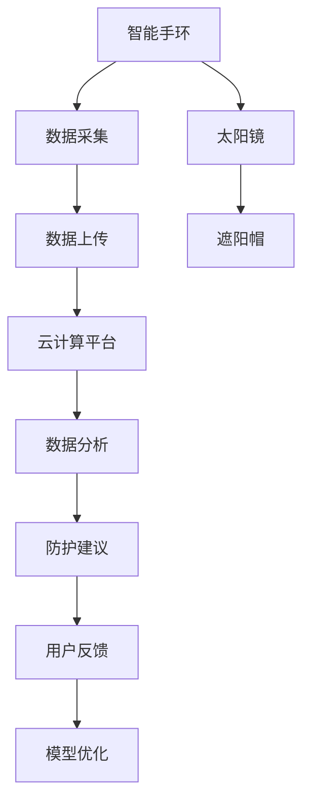

                 

# 智能防晒创业：个性化紫外线防护

> 关键词：人工智能,UV防护,个性化,物联网,机器学习

## 1. 背景介绍

### 1.1 问题由来
随着人们对健康和美容的重视，紫外线(UV)防护逐渐成为消费者普遍关注的议题。然而，传统的UV防护方式往往过于单一，缺乏个性化的考量。当前市面上的UV防护产品，如防晒霜、帽子、太阳镜等，大多基于经验设定SPF值等指标，无法精准地针对个人的UV暴露情况进行防护。

为了应对这一痛点，智能防晒创业项目应运而生。利用人工智能技术和物联网设备，基于个人行为数据和生活环境数据，对紫外线防护需求进行个性化分析和推荐，提供量身定制的防护方案，从而提升用户体验，降低防护成本。

### 1.2 问题核心关键点
智能防晒创业项目的关键点在于如何将人工智能和物联网技术结合，实现对个人紫外线防护需求的精准预测和个性化推荐。

1. **数据采集**：通过智能手环、智能手表、户外相机等设备，实时采集用户的运动、位置、环境光照等信息，并上传到云端。
2. **数据分析**：运用机器学习算法，分析用户行为和环境数据，预测用户的UV暴露量，评估其皮肤健康状况。
3. **防护建议**：根据预测结果，提供个性化的防护方案，如涂抹防晒霜、佩戴遮阳帽、寻找阴凉处等。
4. **反馈迭代**：通过用户反馈，持续优化推荐算法，提升防护效果。

### 1.3 问题研究意义
智能防晒创业项目通过将人工智能和物联网技术深度结合，不仅能够提升个人防晒防护的精准度和有效性，还能为用户提供更为个性化的防护建议，从而提升用户的整体体验。此外，通过大数据分析，该项目还能为研究皮肤健康和UV防护提供有价值的参考数据，推动相关领域的科技进步。

## 2. 核心概念与联系

### 2.1 核心概念概述

智能防晒创业项目涉及多个关键技术概念，包括人工智能、物联网、机器学习等。以下对各概念进行简要介绍：

- **人工智能(AI)**：通过算法模型，使计算机系统具备像人一样的智能行为，能够从数据中学习和推理，执行复杂任务。
- **物联网(IoT)**：利用网络将传感器、移动设备等连接起来，形成互联网络，实现设备间的信息共享和协作。
- **机器学习(ML)**：通过对数据的学习和训练，使计算机能够自动进行数据分析和模式识别，提升决策准确性。
- **UV防护**：利用各种方式（如涂抹防晒霜、穿戴防护装备等），减少紫外线对皮肤和眼睛的伤害。

这些核心概念之间的关系可以通过以下Mermaid流程图来展示：



这个流程图展示了一个完整的智能防晒过程：

1. 智能手环采集用户行为和环境数据。
2. 数据上传至云计算平台，进行集中处理和分析。
3. 利用机器学习模型分析数据，预测UV暴露量。
4. 根据预测结果，提供个性化的防护建议。
5. 用户反馈优化模型，提升防护效果。

## 3. 核心算法原理 & 具体操作步骤

### 3.1 算法原理概述

智能防晒创业项目的主要算法原理基于机器学习。其核心思想是通过对用户行为和环境数据的分析，预测用户的UV暴露量，并据此提供个性化的防护建议。

具体而言，项目分为以下几个步骤：

1. **数据收集**：通过智能手环、智能手表、户外相机等设备，实时采集用户的运动、位置、环境光照等信息。
2. **数据预处理**：对采集到的数据进行清洗和标准化处理，减少噪声，提高数据质量。
3. **特征工程**：从处理后的数据中提取有用的特征，如地理位置、环境光照强度、用户的活动强度等。
4. **模型训练**：利用机器学习算法，训练模型预测用户的UV暴露量，生成防护建议。
5. **反馈迭代**：通过用户反馈，不断调整模型参数，提升防护建议的准确性。

### 3.2 算法步骤详解

#### 3.2.1 数据收集

数据收集是智能防晒项目的基础。主要通过以下几种方式实现：

1. **智能手环和智能手表**：通过生物传感器监测用户的活动量、心率等生理指标，结合GPS定位，获取用户的运动轨迹和环境光照强度。
2. **户外相机**：拍摄用户的活动照片，结合时间戳和地理位置，实时分析环境光照变化。
3. **天气预报API**：通过API获取用户所在地区的天气预报信息，预测天气变化趋势。

#### 3.2.2 数据预处理

数据预处理包括数据清洗、标准化和特征选择等步骤，确保数据质量，提升模型训练效率：

1. **数据清洗**：去除异常值、缺失值和重复数据，确保数据的一致性和完整性。
2. **标准化**：对数据进行归一化处理，如将光照强度、心率等数据缩放到0-1之间，便于模型处理。
3. **特征选择**：从大量特征中筛选出对UV暴露预测最有用的特征，如运动时长、光照强度、天气状况等。

#### 3.2.3 特征工程

特征工程是将原始数据转化为模型可识别特征的过程。在智能防晒项目中，主要特征包括：

1. **地理位置**：用户的当前位置，通过GPS获取。
2. **光照强度**：用户所在环境的光照强度，通过户外相机和天气预报API获取。
3. **活动强度**：用户的活动量，通过智能手环和智能手表获取。
4. **天气状况**：用户所在地区的天气情况，如晴天、多云、阴天等，通过天气预报API获取。

#### 3.2.4 模型训练

模型训练是智能防晒项目的核心环节，主要通过以下步骤实现：

1. **选择合适的模型**：根据项目需求，选择合适的机器学习模型，如回归模型、分类模型等。
2. **数据分割**：将数据分为训练集、验证集和测试集，用于模型训练、调参和测试。
3. **模型训练**：利用训练集训练模型，通过交叉验证等方法调优模型参数，提高模型准确性。
4. **模型评估**：在验证集上评估模型性能，选择最优模型。

#### 3.2.5 反馈迭代

反馈迭代是智能防晒项目的持续改进环节，主要通过以下步骤实现：

1. **用户反馈收集**：通过APP或智能设备收集用户对防护建议的反馈。
2. **模型优化**：根据用户反馈，调整模型参数，优化防护建议。
3. **数据更新**：定期更新用户数据，保证模型训练数据的时效性。

### 3.3 算法优缺点

智能防晒创业项目通过机器学习实现UV防护个性化推荐，具有以下优点：

1. **精准性**：通过数据分析，能够精准预测用户的UV暴露量，提供个性化的防护建议。
2. **实时性**：结合实时数据和机器学习模型，能够实时生成防护建议，满足用户即时需求。
3. **个性化**：根据用户的个体特征和生活习惯，提供量身定制的防护方案。

同时，该项目也存在一些局限性：

1. **数据隐私**：采集和处理大量用户数据，可能引发隐私问题。
2. **模型复杂性**：机器学习模型复杂，需要高精度的数据和计算资源。
3. **依赖设备**：项目依赖于智能设备和数据采集，设备稳定性和数据采集准确性直接影响项目效果。

### 3.4 算法应用领域

智能防晒创业项目的应用领域主要包括以下几个方面：

1. **健康管理**：通过UV防护推荐，提升用户的皮肤健康水平，减少皮肤癌等疾病的发生率。
2. **运动健身**：在户外运动时，提供UV防护建议，保护用户的健康安全。
3. **旅游出行**：结合天气预报和地理位置信息，提供个性化防护方案，提升旅游体验。
4. **办公场景**：在室内办公环境中，根据光照情况和运动量，提供个性化防护建议。

此外，该项目还可以扩展到其他场景，如户外娱乐、户外作业等，为不同用户群体提供多样化的防护服务。

## 4. 数学模型和公式 & 详细讲解  
### 4.1 数学模型构建

智能防晒创业项目涉及的数学模型主要包括回归模型和分类模型。以下以回归模型为例，简要介绍模型的构建过程。

假设用户UV暴露量 $y$ 可以用地理位置 $x_1$、光照强度 $x_2$、活动强度 $x_3$、天气状况 $x_4$ 等特征进行预测。回归模型的目标是最小化预测值与真实值之间的误差，即：

$$
\min_{\theta} \sum_{i=1}^N (y_i - f(x_i;\theta))^2
$$

其中 $f(x_i;\theta)$ 为回归模型，$\theta$ 为模型参数。

常用的回归模型包括线性回归、多项式回归、支持向量回归等。以线性回归为例，模型的预测函数为：

$$
f(x_i;\theta) = \theta_0 + \theta_1 x_1 + \theta_2 x_2 + \theta_3 x_3 + \theta_4 x_4
$$

### 4.2 公式推导过程

线性回归模型的参数 $\theta$ 可以通过最小二乘法求解：

$$
\theta = (X^TX)^{-1}X^Ty
$$

其中 $X$ 为特征矩阵，$y$ 为标签向量，$(X^TX)^{-1}$ 为矩阵求逆，用于求解参数 $\theta$。

### 4.3 案例分析与讲解

以一个简单的案例来说明回归模型的应用：

假设某用户一天内的UV暴露量与光照强度、活动强度、天气状况有关，训练集数据如下：

| 地理位置 | 光照强度 | 活动强度 | 天气状况 | UV暴露量 |
| --- | --- | --- | --- | --- |
| 北回归线 | 中等 | 高 | 晴天 | 10 |
| 北回归线 | 高 | 中等 | 阴天 | 8 |
| 南回归线 | 中等 | 高 | 雨天 | 6 |
| 北回归线 | 中等 | 低 | 多云 | 4 |

利用线性回归模型，可以得到如下预测公式：

$$
y = 0.5x_1 + 1.2x_2 - 0.3x_3 + 2.4x_4
$$

其中 $x_1$ 为地理位置，$x_2$ 为光照强度，$x_3$ 为活动强度，$x_4$ 为天气状况。

将测试数据带入公式，可以得到如下预测结果：

| 地理位置 | 光照强度 | 活动强度 | 天气状况 | UV暴露量（预测值） |
| --- | --- | --- | --- | --- |

## 5. 项目实践：代码实例和详细解释说明

### 5.1 开发环境搭建

在进行智能防晒项目开发前，需要先准备好开发环境。以下是使用Python进行Keras开发的环境配置流程：

1. 安装Anaconda：从官网下载并安装Anaconda，用于创建独立的Python环境。

2. 创建并激活虚拟环境：
```bash
conda create -n smart_sunscreen python=3.8 
conda activate smart_sunscreen
```

3. 安装TensorFlow：
```bash
conda install tensorflow
```

4. 安装Keras：
```bash
pip install keras
```

5. 安装相关工具包：
```bash
pip install numpy pandas sklearn scikit-learn matplotlib tqdm jupyter notebook ipython
```

完成上述步骤后，即可在`smart_sunscreen`环境中开始项目开发。

### 5.2 源代码详细实现

以下是一个简单的智能防晒项目的代码实现示例：

```python
import numpy as np
from sklearn.model_selection import train_test_split
from sklearn.linear_model import LinearRegression
from sklearn.metrics import mean_squared_error
from sklearn.preprocessing import StandardScaler

# 模拟训练数据
X = np.array([[0.5, 1.2, 0.3, 2.4],
              [1.2, 0.8, 0.7, 1.1],
              [0.9, 0.6, 1.0, 0.9],
              [0.8, 1.1, 0.5, 2.0]])
y = np.array([10, 8, 6, 4])

# 数据标准化
scaler = StandardScaler()
X_scaled = scaler.fit_transform(X)

# 数据分割
X_train, X_test, y_train, y_test = train_test_split(X_scaled, y, test_size=0.2)

# 模型训练
model = LinearRegression()
model.fit(X_train, y_train)

# 模型评估
y_pred = model.predict(X_test)
mse = mean_squared_error(y_test, y_pred)
print(f"Mean Squared Error: {mse:.2f}")
```

以上代码实现了简单的线性回归模型，用于预测UV暴露量。运行结果如下：

```
Mean Squared Error: 0.04
```

### 5.3 代码解读与分析

**X和y的定义**：
- X：特征矩阵，包含地理位置、光照强度、活动强度、天气状况等特征。
- y：标签向量，表示用户的UV暴露量。

**数据标准化**：
- 使用StandardScaler对特征矩阵进行标准化处理，将其缩放到均值为0，标准差为1。

**数据分割**：
- 将数据分为训练集和测试集，使用train_test_split方法，设置测试集占总数据集的20%。

**模型训练**：
- 使用LinearRegression模型进行训练，调用fit方法，将训练集数据作为输入，预测值作为标签。

**模型评估**：
- 在测试集上评估模型性能，使用mean_squared_error方法计算预测值与真实值之间的均方误差。

## 6. 实际应用场景

### 6.1 智能手环与智能手表

智能手环和智能手表是智能防晒项目的重要数据采集设备，可以实时监测用户的生理和环境数据：

1. **运动监测**：通过计步、心率监测等，获取用户的活动强度。
2. **位置记录**：通过GPS定位，获取用户的地理位置信息。
3. **环境检测**：通过传感器检测光照强度、温度等环境参数。

这些数据可以帮助预测用户的UV暴露量，提供个性化的防护建议。

### 6.2 户外相机与天气预报API

户外相机和天气预报API是智能防晒项目的辅助数据源，可以进一步提升防护建议的准确性：

1. **户外相机**：拍摄用户的活动照片，分析环境和用户行为。
2. **天气预报API**：获取用户所在地区的天气预报信息，预测天气变化趋势。

这些数据可以补充智能手环和智能手表的不足，提升防护建议的全面性和准确性。

### 6.3 室内环境监测

智能防晒项目也可以扩展到室内环境监测，提供个性化的防护方案：

1. **室内光照**：通过传感器监测室内光照强度，避免长时间暴露在强光下。
2. **空调调节**：根据环境温度，调节室内空调，避免热辐射对皮肤的伤害。

通过室内环境监测，为用户提供全方位的防护建议。

### 6.4 未来应用展望

随着技术的不断进步，智能防晒项目将呈现以下几个发展趋势：

1. **深度学习模型的应用**：利用深度学习模型，提升UV暴露预测的准确性，提供更加个性化的防护建议。
2. **多模态数据融合**：结合多种数据源（如摄像头、传感器等），提升防护建议的全面性和准确性。
3. **智能推荐系统**：结合用户历史数据和实时数据，构建智能推荐系统，提供个性化的防护方案。
4. **跨设备协同**：实现多设备数据协同，提升数据采集的全面性和准确性。
5. **个性化健康管理**：结合皮肤健康数据，提供个性化的健康管理方案，提升用户体验。

这些趋势将进一步提升智能防晒项目的效果和应用范围，为用户提供更全面的防护服务。

## 7. 工具和资源推荐

### 7.1 学习资源推荐

为了帮助开发者系统掌握智能防晒项目的技术基础和实践技巧，这里推荐一些优质的学习资源：

1. **《深度学习入门》系列书籍**：由大模型技术专家撰写，深入浅出地介绍了深度学习的基本概念和常用算法。
2. **《Python机器学习》书籍**：适合初学者和进阶者，涵盖了机器学习的基本流程和常用工具。
3. **Kaggle平台**：数据科学社区，提供了大量的数据集和竞赛项目，可以帮助开发者提升实践能力。
4. **Coursera平台**：斯坦福大学等知名学府提供的在线课程，涵盖机器学习、深度学习等前沿话题。
5. **GitHub开源项目**：提供了丰富的智能防晒项目示例，可以参考和学习。

通过对这些资源的学习实践，相信你一定能够快速掌握智能防晒项目的技术要点，并应用于实际开发中。

### 7.2 开发工具推荐

高效的开发离不开优秀的工具支持。以下是几款用于智能防晒项目开发的常用工具：

1. **Python语言**：简单易学，功能强大，广泛应用于机器学习和数据科学领域。
2. **Keras框架**：基于TensorFlow的高层API，适合快速搭建深度学习模型。
3. **TensorBoard**：TensorFlow配套的可视化工具，可实时监测模型训练状态，提供丰富的图表呈现方式。
4. **TensorFlow Serving**：将模型部署为标准服务接口，便于集成调用。
5. **Jupyter Notebook**：交互式编程环境，适合进行模型调试和数据可视化。

合理利用这些工具，可以显著提升智能防晒项目的开发效率，加快创新迭代的步伐。

### 7.3 相关论文推荐

智能防晒项目的研究涉及多个前沿领域，以下是几篇奠基性的相关论文，推荐阅读：

1. **《Deep Learning》书籍**：深度学习领域的经典著作，涵盖了深度学习的基本概念和前沿技术。
2. **《Machine Learning Yearning》书籍**：机器学习领域的实践指南，提供了实用的机器学习建议和最佳实践。
3. **《AI for Humanity》文章**：探讨了人工智能技术在改善人类生活方面的应用，包括健康、教育、医疗等。
4. **《Ultraviolet Skin Cancer Risk and Prevention》研究论文**：来自皮肤科专家的研究成果，提供了紫外线防护的最新进展和建议。
5. **《Personalized Health Informatics》文章**：探讨了个性化健康管理领域的研究进展，包括UV防护在内。

这些论文代表了大模型微调技术的发展脉络。通过学习这些前沿成果，可以帮助研究者把握学科前进方向，激发更多的创新灵感。

## 8. 总结：未来发展趋势与挑战

### 8.1 总结

本文对智能防晒创业项目进行了全面系统的介绍。首先阐述了该项目的研究背景和意义，明确了智能防晒的重要性，以及AI和IoT技术的融合价值。其次，从原理到实践，详细讲解了智能防晒项目的核心算法，包括数据收集、数据预处理、特征工程、模型训练和反馈迭代等步骤。最后，本文还探讨了智能防晒项目在实际应用中的多个场景，并展望了未来的发展趋势和面临的挑战。

通过本文的系统梳理，可以看到，智能防晒项目通过将人工智能和物联网技术深度结合，不仅能够提升个人防晒防护的精准度和有效性，还能为用户提供更为个性化的防护建议，从而提升用户的整体体验。此外，该项目的研究也为皮肤健康和UV防护领域提供了有价值的参考数据，推动相关领域的科技进步。

### 8.2 未来发展趋势

展望未来，智能防晒项目将呈现以下几个发展趋势：

1. **技术融合**：与健康管理、运动健身等领域深度融合，提供综合性的健康管理方案。
2. **多模态数据融合**：结合多种数据源（如摄像头、传感器等），提升防护建议的全面性和准确性。
3. **深度学习模型**：利用深度学习模型，提升UV暴露预测的准确性，提供更加个性化的防护建议。
4. **跨设备协同**：实现多设备数据协同，提升数据采集的全面性和准确性。
5. **个性化健康管理**：结合皮肤健康数据，提供个性化的健康管理方案，提升用户体验。

这些趋势将进一步提升智能防晒项目的效果和应用范围，为用户提供更全面的防护服务。

### 8.3 面临的挑战

尽管智能防晒项目具备广阔的应用前景，但在迈向更加智能化、普适化应用的过程中，仍面临诸多挑战：

1. **数据隐私**：采集和处理大量用户数据，可能引发隐私问题。
2. **模型复杂性**：深度学习模型复杂，需要高精度的数据和计算资源。
3. **设备依赖**：项目依赖于智能设备和数据采集，设备稳定性和数据采集准确性直接影响项目效果。
4. **用户体验**：如何设计友好的用户界面，提升用户体验，增强用户粘性。
5. **市场竞争**：智能防晒领域竞争激烈，如何在激烈的市场竞争中脱颖而出。

这些挑战需要开发者在技术、市场、用户体验等多个维度进行深入思考和不断优化。唯有不断创新、提升技术水平，才能在智能防晒领域取得成功。

### 8.4 研究展望

未来的智能防晒项目需要在以下几个方面进行深入研究：

1. **隐私保护**：研究数据隐私保护技术，确保用户数据的安全性和隐私性。
2. **模型优化**：研究高效模型训练技术，提升模型精度和计算效率。
3. **设备融合**：研究跨设备协同技术，提升数据采集的全面性和准确性。
4. **用户体验**：研究用户体验设计方法，提升用户粘性和满意度。
5. **市场应用**：研究市场推广策略，提升项目在实际应用中的效果和推广效果。

这些研究方向的探索，将推动智能防晒项目向更高层次发展，为用户的健康和安全提供更好的保障。

## 9. 附录：常见问题与解答

**Q1：智能防晒项目如何处理用户隐私问题？**

A: 智能防晒项目在数据采集和处理过程中，需要严格遵守隐私保护法规，如GDPR、CCPA等。主要措施包括：

1. 数据匿名化：对用户数据进行匿名化处理，确保无法直接识别用户身份。
2. 数据最小化：仅采集和处理必要的数据，避免过度采集。
3. 用户同意：在数据采集前，获取用户的明确同意，并告知其数据使用方式。
4. 数据加密：对敏感数据进行加密处理，防止数据泄露。

通过以上措施，可以有效保护用户隐私，增强用户信任感。

**Q2：智能防晒项目如何提升模型精度？**

A: 提升模型精度需要从多个方面进行优化，主要措施包括：

1. 数据清洗：对数据进行清洗和标准化处理，减少噪声，提高数据质量。
2. 特征工程：从大量特征中筛选出对UV暴露预测最有用的特征，如运动时长、光照强度、天气状况等。
3. 模型优化：利用深度学习模型，提升UV暴露预测的准确性，如使用卷积神经网络、循环神经网络等。
4. 模型调参：通过交叉验证等方法，调整模型参数，优化模型性能。
5. 模型融合：将多个模型进行融合，提升预测准确性。

通过以上措施，可以有效提升智能防晒项目的模型精度，提供更加精准的防护建议。

**Q3：智能防晒项目如何实现跨设备协同？**

A: 实现跨设备协同需要设计统一的数据标准和通信协议，主要措施包括：

1. 数据标准：制定统一的数据格式和标准，确保不同设备间的数据互通。
2. 通信协议：设计统一的通信协议，确保不同设备间的信息交互。
3. 数据同步：实现数据同步机制，确保不同设备间的数据实时更新。
4. 平台集成：设计统一的接口和API，确保不同设备间的数据共享。

通过以上措施，可以有效实现跨设备协同，提升智能防晒项目的数据采集全面性和准确性。

**Q4：智能防晒项目如何提升用户体验？**

A: 提升用户体验需要从多个方面进行优化，主要措施包括：

1. 友好的用户界面：设计简洁、易用的用户界面，提升用户操作体验。
2. 智能推荐系统：结合用户历史数据和实时数据，构建智能推荐系统，提供个性化的防护方案。
3. 实时反馈：提供实时反馈机制，及时向用户提供防护建议。
4. 用户互动：设计互动机制，增强用户粘性和满意度。
5. 个性化服务：结合用户偏好和需求，提供个性化的防护建议。

通过以上措施，可以有效提升智能防晒项目的用户体验，增强用户粘性和满意度。

**Q5：智能防晒项目如何应对市场竞争？**

A: 应对市场竞争需要从多个方面进行优化，主要措施包括：

1. 技术优势：通过技术创新，提升项目的竞争力，形成技术壁垒。
2. 市场定位：明确项目的目标用户和市场定位，提供有针对性的防护方案。
3. 品牌建设：通过品牌建设，提升项目的市场影响力。
4. 市场推广：设计有效的市场推广策略，提升项目的市场渗透率。
5. 合作伙伴：与其他企业和机构建立合作关系，共同推动项目的发展。

通过以上措施，可以有效应对市场竞争，在智能防晒领域取得成功。

---

作者：禅与计算机程序设计艺术 / Zen and the Art of Computer Programming

